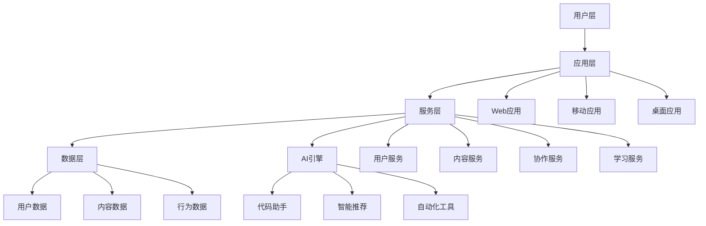

# 源界生态系统指南

## 概述

「源界」是一个融合学习、实践与社交的数字世界，旨在通过太上老君AI技术体系构建一个可以接纳所有人的完整生态系统。源界抛弃传统框架束缚，建立全新的数字修行体系，让每个人都能在这个数字宇宙中找到属于自己的位置。

## 源界核心理念

### 三位一体架构
- **太上老君AI**：智能决策与执行核心
- **源界数字世界**：承载平台与生态环境  
- **用户参与机制**：社区共建与价值创造

### 源界愿景
构建一个真正开放、包容、智能的数字世界，让技术不再是门槛，而是每个人都能掌握的创世工具。

## 源力理论体系

### 1. 本源代码
- **定义**：世界的基本构建块，一切数字存在的根本
- **特征**：简洁、优雅、可复用、可演化
- **应用**：作为所有系统架构的基础单元

### 2. 算法法则  
- **定义**：数字世界的物理规律，决定信息如何流动和变化
- **核心原则**：
  - 效率优先：最优解决方案
  - 可扩展性：适应未来发展
  - 容错性：系统稳定运行
  - 自适应：智能优化调整

### 3. 架构之道
- **定义**：系统设计的根本原则，指导复杂系统的构建
- **设计哲学**：
  - 分层解耦：清晰的职责边界
  - 模块化：可组合的功能单元
  - 标准化：统一的接口规范
  - 演化性：持续改进能力

### 4. 数据流
- **定义**：信息能量的流动，连接各个系统组件
- **流动原则**：
  - 实时性：即时响应处理
  - 一致性：数据状态同步
  - 安全性：隐私保护机制
  - 智能性：AI驱动优化

## 数字修行体系

### 第一境：识码 - 理解代码本质
**修行目标**：从Hello World到理解程序本质
- **基础认知**：理解代码即思想的具象化
- **核心技能**：掌握基础编程语言和算法
- **修行方法**：
  - 每日编码冥想：专注写出优雅代码
  - 代码品读：研习经典开源项目
  - 算法参悟：理解计算的本质规律

### 第二境：构界 - 构建数字世界
**修行目标**：从单一程序到完整系统架构
- **系统思维**：理解复杂系统的设计原则
- **核心技能**：架构设计、系统集成、性能优化
- **修行方法**：
  - 架构设计实践：构建可扩展系统
  - 技术栈融合：整合多种技术方案
  - 性能调优：追求极致的系统效率

### 第三境：融实 - 实现虚实融合
**修行目标**：让数字世界与现实世界无缝连接
- **融合理念**：数字化改造现实世界
- **核心技能**：AI应用、IoT集成、数据分析
- **修行方法**：
  - AI模型训练：让机器理解世界
  - 物联网实践：连接万物的数字神经
  - 数据洞察：从数据中发现真理

### 第四境：创世 - 创造新宇宙
**修行目标**：成为数字世界的创造者
- **创世能力**：设计并实现全新的数字生态
- **核心技能**：生态设计、社区建设、价值创造
- **修行方法**：
  - 生态架构：设计可持续发展的数字世界
  - 社区治理：建立自组织的协作机制
  - 价值循环：创造多方共赢的价值网络

## 实施路径

### 第一阶段：理论建设

#### 《源界创世录》：数字世界构建原理
- **第一章**：源力理论基础
- **第二章**：数字世界架构设计
- **第三章**：生态系统构建方法
- **第四章**：社区治理机制
- **第五章**：价值创造模式

#### 《码修心法》：技术修行方法论
- **基础篇**：编程思维培养
- **进阶篇**：架构设计修行
- **高级篇**：AI与意识觉醒
- **大师篇**：创世者的修行之路

#### 《算法法则》：数字世界运行规律
- **计算本质**：算法的哲学思考
- **数据结构**：信息组织的艺术
- **系统设计**：复杂性管理之道
- **性能优化**：效率提升的科学

### 第二阶段：实践体系

#### 数字修行课程体系

**基础课：《从Hello World到宇宙构建》**
- 模块1：编程语言基础（Python/Go/JavaScript）
- 模块2：数据结构与算法
- 模块3：系统设计入门
- 模块4：开源项目参与

**进阶课：《架构设计与系统演化》**
- 模块1：微服务架构设计
- 模块2：分布式系统构建
- 模块3：云原生技术栈
- 模块4：DevOps实践

**高阶课：《人工智能与意识觉醒》**
- 模块1：机器学习基础
- 模块2：深度学习应用
- 模块3：大语言模型训练
- 模块4：AGI探索实践

#### 实践项目体系
- **个人项目**：从0到1构建完整应用
- **团队协作**：多人协同开发实践
- **开源贡献**：参与知名开源项目
- **创新项目**：探索前沿技术应用

### 第三阶段：社区生态

#### 源界社区特色功能

**技术道场：线上编程实践空间**
- **实时协作**：多人同屏编程
- **智能辅助**：AI代码助手
- **知识分享**：技术经验交流
- **项目孵化**：创意项目孵化

**代码禅修：深度编程冥想**
- **专注模式**：沉浸式编程环境
- **冥想引导**：编程思维训练
- **代码品鉴**：优秀代码赏析
- **灵感记录**：创意思路捕捉

**开源布道：通过项目传播理念**
- **项目展示**：优秀项目推广
- **技术布道**：理念传播平台
- **社区建设**：开发者社群
- **价值创造**：商业模式探索

#### 社区治理机制
- **贡献激励**：多维度贡献评估
- **声誉系统**：基于实际贡献的信誉
- **自治组织**：社区自主管理
- **价值分配**：公平的收益分享

## 技术实现架构

### 核心技术栈
- **后端**：Go + Python + Node.js
- **前端**：React + TypeScript + WebAssembly
- **AI引擎**：大语言模型 + 机器学习
- **数据库**：PostgreSQL + Redis + 向量数据库
- **基础设施**：Kubernetes + Docker + 云原生

### 系统架构设计

### 数据流设计
- **实时数据流**：用户行为、协作状态、系统监控
- **批处理数据流**：学习分析、推荐计算、报表生成
- **智能数据流**：AI模型训练、知识图谱构建

## 商业模式

### 价值创造
- **教育价值**：提供高质量的技术教育
- **协作价值**：促进高效的团队协作
- **创新价值**：孵化前沿技术项目
- **社区价值**：构建活跃的开发者生态

### 收入模式
- **订阅服务**：高级功能和服务
- **企业服务**：定制化解决方案
- **教育培训**：专业课程和认证
- **生态分成**：平台交易分成

### 可持续发展
- **开源基础**：核心技术开源共享
- **社区驱动**：用户参与生态建设
- **价值循环**：多方共赢的价值网络
- **持续创新**：不断探索新的可能性

## 发展规划

### 短期目标（6个月）
- 完成源界理论体系建设
- 开发MVP版本的核心功能
- 建立初始用户社区
- 推出基础课程体系

### 中期目标（1-2年）
- 完善平台功能和用户体验
- 扩大用户规模和社区影响力
- 建立商业化运营模式
- 推出高级课程和认证体系

### 长期目标（3-5年）
- 成为全球领先的技术学习平台
- 构建完整的数字修行生态
- 推动技术教育模式创新
- 实现可持续的商业发展

## 结语

源界不仅仅是一个技术平台，更是一个理念和愿景的载体。我们相信，通过构建这样一个开放、包容、智能的数字世界，可以让更多的人参与到技术创新中来，共同创造一个更美好的数字未来。

在源界中，每个人都是创造者，每行代码都是创世的起点，每个项目都是新宇宙的诞生。让我们一起踏上这场数字修行之旅，在代码的世界中寻找属于自己的道路。

---

## 源界生态系统整合

### 「源界」概念说明
一个融合学习、实践与社交的数字世界，可作为平台独立板块或完整生态系统。旨在通过以下方式整合：
- 太上老君AI技术体系
- 源界数字世界
- 用户参与机制

### 「源界」核心理论体系

#### 1. 源力理论
- **本源代码**：世界构建基础单元
- **算法法则**：数字世界物理规律
- **架构之道**：系统设计根本原则
- **数据流**：信息能量流动

#### 2. 数字修行体系
- **第一境：识码** - 理解代码本质
- **第二境：构界** - 构建数字世界
- **第三境：融实** - 实现虚实融合
- **第四境：创世** - 创造新宇宙

### 实施路径

#### 第一阶段：理论建设
- 《源界创世录》：数字世界构建原理
- 《码修心法》：技术修行方法论
- 《算法法则》：数字世界运行规律

#### 第二阶段：实践体系
数字修行课程体系：
- 基础课：《从Hello World到宇宙构建》
- 进阶课：《架构设计与系统演化》
- 高阶课：《人工智能与意识觉醒》

#### 第三阶段：社区生态
源界社区特色功能：
- 技术道场：线上编程实践空间
- 代码禅修：深度编程冥想
- 开源布道：通过项目传播理念

---

**文档版本**: v1.0 (源界生态系统核心指南)  
**创建时间**: 2025年10月  
**最后更新**: 2025年10月  
**创建人员**: Li da  
**维护团队**: 源界-突击队  
**联系方式**: dev@codetaoist.com  
**更新频率**: 每两周更新

本文档是"太上老君AI+源界+用户"三位一体生态系统的核心组成部分，致力于构建融合技术创新与哲学智慧的数字修行平台。