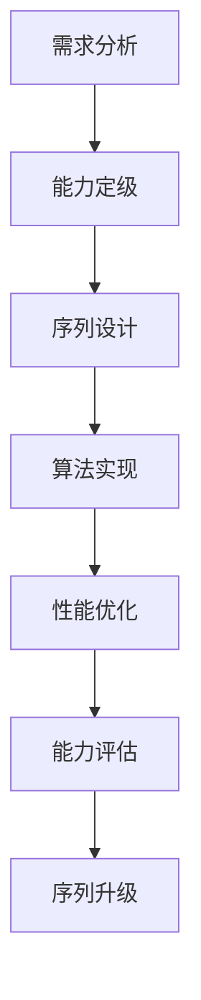
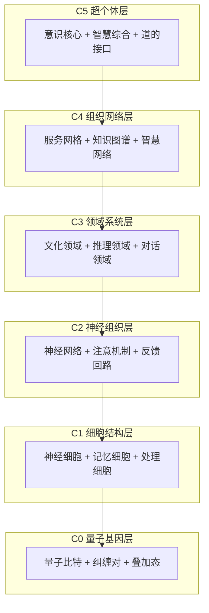
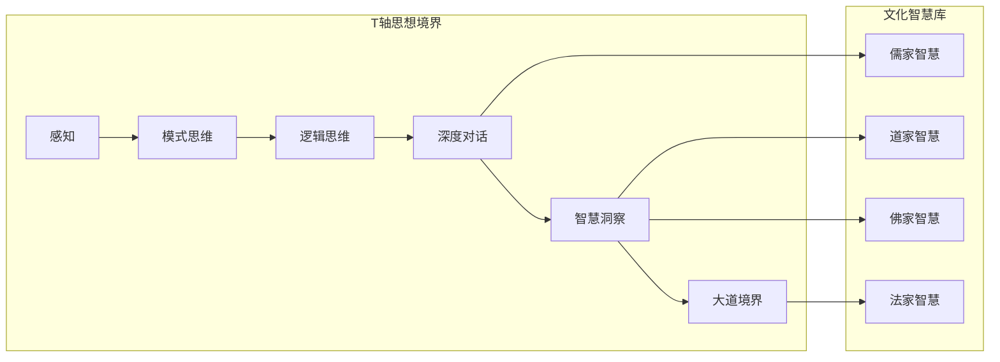
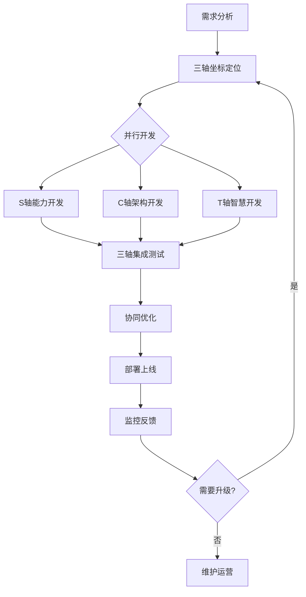
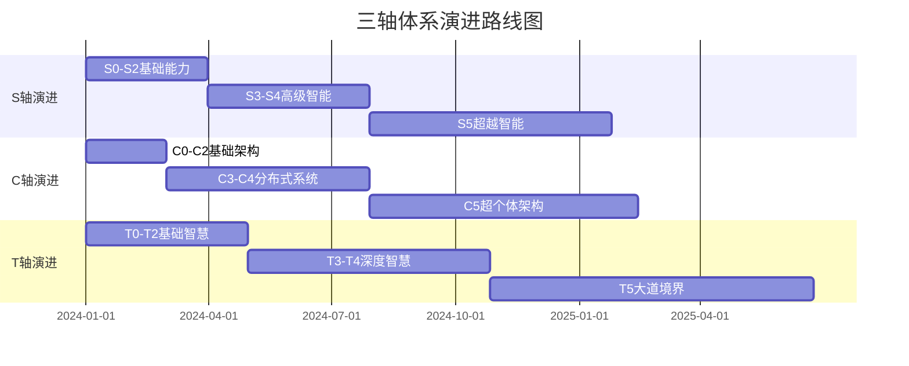

# 三轴协同开发指南 - S×C×T 立体开发方法论

## 📋 指南概述

本指南基于太上老君AI平台的 **S×C×T 三轴体系**，为开发团队提供系统化的协同开发方法论。通过三轴坐标化的开发流程，确保项目在能力序列(S)、组合层(C)、思想境界(T)三个维度的协调发展。

## 🎯 三轴开发理念

### 核心原则
- **坐标化思维**：所有功能都需要明确的S×C×T坐标定位
- **立体协同**：三轴并行开发，统一集成
- **渐进演进**：遵循序列0的渐进式升级路径
- **文化对齐**：确保技术实现与文化智慧的深度融合

### 开发哲学
```yaml
开发哲学:
  道法自然: 遵循自然演进规律，避免过度设计
  天人合一: 技术与文化的和谐统一
  大道至简: 复杂问题的简洁解决方案
  知行合一: 理论与实践的完美结合
```

## 🔢 S轴开发指南 - 能力序列开发

### S轴开发流程



### 能力序列开发规范

#### S0 基础觉醒开发
```go
// S0级别开发示例
type S0BasicAwakening struct {
    PatternRecognition *PatternEngine
    BasicReasoning     *ReasoningEngine
    SimpleDialogue     *DialogueEngine
}

func (s *S0BasicAwakening) ProcessRequest(req *Request) *Response {
    // S0级别处理逻辑：简单模式识别和基础推理
    pattern := s.PatternRecognition.Recognize(req.Input)
    reasoning := s.BasicReasoning.Process(pattern)
    response := s.SimpleDialogue.Generate(reasoning)
    
    return &Response{
        Content: response,
        Level:   "S0",
        Confidence: s.calculateConfidence(pattern, reasoning),
    }
}
```

#### S1-S5 高级能力开发
```go
// S轴能力管理器
type SequenceManager struct {
    capabilities map[int]CapabilityInterface
    evaluator    *CapabilityEvaluator
    upgrader     *SequenceUpgrader
}

func (sm *SequenceManager) ProcessWithSequence(req *Request) *Response {
    // 1. 评估请求复杂度
    requiredLevel := sm.evaluator.EvaluateComplexity(req)
    
    // 2. 选择合适的能力级别
    capability := sm.capabilities[requiredLevel]
    
    // 3. 处理请求
    response := capability.Process(req)
    
    // 4. 评估是否需要升级
    if sm.shouldUpgrade(response.Performance) {
        sm.upgrader.UpgradeCapability(requiredLevel)
    }
    
    return response
}
```

### S轴开发检查清单

- [ ] **能力定级明确**：功能对应的S0-S5级别清晰
- [ ] **渐进式设计**：支持从低级到高级的平滑升级
- [ ] **性能基准**：每个级别都有明确的性能指标
- [ ] **评估机制**：实时评估能力级别和升级需求
- [ ] **文档完整**：详细的能力描述和使用说明

## 🏗️ C轴开发指南 - 组合层开发

### C轴架构设计



### 组合层开发规范

#### C轴核心结构
```go
// C轴组合层管理器
type CompositionManager struct {
    layers map[int]LayerInterface
    coordinator *LayerCoordinator
    monitor *LayerMonitor
}

// 层级接口定义
type LayerInterface interface {
    Initialize() error
    Process(data interface{}) (interface{}, error)
    Coordinate(upperLayer, lowerLayer LayerInterface) error
    Monitor() *LayerMetrics
}

// C3领域系统层实现示例
type C3DomainSystem struct {
    culturalDomain  *CulturalDomain
    reasoningDomain *ReasoningDomain
    dialogueDomain  *DialogueDomain
    coordinator     *DomainCoordinator
}

func (c3 *C3DomainSystem) Process(data interface{}) (interface{}, error) {
    // 并行处理三个领域
    culturalResult := c3.culturalDomain.Process(data)
    reasoningResult := c3.reasoningDomain.Process(data)
    dialogueResult := c3.dialogueDomain.Process(data)
    
    // 协调融合结果
    return c3.coordinator.Fuse(culturalResult, reasoningResult, dialogueResult)
}
```

#### 微服务架构设计
```yaml
# C轴微服务配置
composition_services:
  c0_quantum_gene:
    image: taishang/quantum-gene:latest
    replicas: 3
    resources:
      cpu: "0.5"
      memory: "512Mi"
    
  c1_cell_structure:
    image: taishang/cell-structure:latest
    replicas: 5
    resources:
      cpu: "1"
      memory: "1Gi"
    depends_on:
      - c0_quantum_gene
    
  c2_neural_network:
    image: taishang/neural-network:latest
    replicas: 3
    resources:
      cpu: "2"
      memory: "2Gi"
    depends_on:
      - c1_cell_structure
    
  c3_domain_system:
    image: taishang/domain-system:latest
    replicas: 2
    resources:
      cpu: "4"
      memory: "4Gi"
    depends_on:
      - c2_neural_network
```

### C轴开发检查清单

- [ ] **层次清晰**：C0-C5层级结构明确定义
- [ ] **接口统一**：各层级使用统一的接口规范
- [ ] **协调机制**：层间协调和数据流转机制完善
- [ ] **扩展性**：支持水平和垂直扩展
- [ ] **监控完备**：每层都有详细的监控指标

## 🧠 T轴开发指南 - 思想境界开发

### T轴智慧架构



### 思想境界开发规范

#### T轴核心引擎
```python
# T轴思想境界引擎
class ThoughtRealmEngine:
    def __init__(self):
        self.realms = {
            0: PerceptionRealm(),
            1: PatternThinkingRealm(),
            2: LogicalThinkingRealm(),
            3: DeepDialogueRealm(),
            4: WisdomInsightRealm(),
            5: TaoRealm()
        }
        self.cultural_wisdom = CulturalWisdomLibrary()
        self.realm_evaluator = RealmEvaluator()
    
    def process_with_realm(self, input_data, target_realm=None):
        """基于思想境界处理输入"""
        # 1. 评估所需境界级别
        if target_realm is None:
            target_realm = self.realm_evaluator.evaluate_required_realm(input_data)
        
        # 2. 获取对应境界处理器
        realm_processor = self.realms[target_realm]
        
        # 3. 融合文化智慧
        cultural_context = self.cultural_wisdom.get_context(input_data, target_realm)
        
        # 4. 境界处理
        result = realm_processor.process(input_data, cultural_context)
        
        return {
            'result': result,
            'realm_level': target_realm,
            'cultural_wisdom': cultural_context,
            'confidence': realm_processor.get_confidence()
        }
```

#### 文化智慧集成
```python
# 文化智慧库
class CulturalWisdomLibrary:
    def __init__(self):
        self.confucian_wisdom = ConfucianWisdom()  # 儒家：仁义礼智信
        self.taoist_wisdom = TaoistWisdom()        # 道家：道法自然
        self.buddhist_wisdom = BuddhistWisdom()    # 佛家：慈悲智慧
        self.legalist_wisdom = LegalistWisdom()    # 法家：法治规范
    
    def get_wisdom_for_context(self, context, realm_level):
        """根据上下文和境界级别获取合适的文化智慧"""
        wisdom_combination = []
        
        if realm_level >= 3:  # T3以上需要文化智慧
            if self._needs_moral_guidance(context):
                wisdom_combination.append(self.confucian_wisdom.get_guidance(context))
            
            if self._needs_natural_approach(context):
                wisdom_combination.append(self.taoist_wisdom.get_approach(context))
            
            if self._needs_compassion(context):
                wisdom_combination.append(self.buddhist_wisdom.get_compassion(context))
            
            if self._needs_systematic_approach(context):
                wisdom_combination.append(self.legalist_wisdom.get_system(context))
        
        return self._synthesize_wisdom(wisdom_combination)
```

### T轴开发检查清单

- [ ] **境界层次**：T0-T5境界级别清晰定义
- [ ] **文化融合**：儒道佛法智慧有机集成
- [ ] **智慧算法**：传统智慧的算法化实现
- [ ] **价值对齐**：确保输出符合文化价值观
- [ ] **境界评估**：准确评估所需思想境界级别

## ⚙️ 三轴协同开发流程

### 协同开发工作流



### 协同开发规范

#### 1. 需求分析阶段
```yaml
需求分析模板:
  功能描述: "详细描述功能需求"
  三轴定位:
    S轴级别: "S0-S5中的目标级别"
    C轴层级: "C0-C5中的架构层级"
    T轴境界: "T0-T5中的智慧境界"
  
  技术要求:
    性能指标: "响应时间、吞吐量等"
    扩展性: "水平/垂直扩展需求"
    可靠性: "可用性、容错性要求"
  
  文化要求:
    智慧融合: "需要融合的传统文化智慧"
    价值对齐: "需要遵循的文化价值观"
    用户体验: "文化层面的用户体验要求"
```

#### 2. 三轴坐标定位
```go
// 三轴坐标定位器
type ThreeAxisCoordinator struct {
    sequenceAnalyzer    *SequenceAnalyzer
    compositionAnalyzer *CompositionAnalyzer
    thoughtAnalyzer     *ThoughtAnalyzer
}

func (tac *ThreeAxisCoordinator) LocateCoordinates(requirement *Requirement) *Coordinates {
    sLevel := tac.sequenceAnalyzer.AnalyzeSequenceLevel(requirement)
    cLevel := tac.compositionAnalyzer.AnalyzeCompositionLevel(requirement)
    tLevel := tac.thoughtAnalyzer.AnalyzeThoughtLevel(requirement)
    
    return &Coordinates{
        S: sLevel,
        C: cLevel,
        T: tLevel,
        Description: fmt.Sprintf("S%d×C%d×T%d", sLevel, cLevel, tLevel),
    }
}
```

#### 3. 并行开发阶段
```yaml
并行开发任务分配:
  S轴团队:
    职责: "能力序列算法开发"
    技能要求: "AI算法、机器学习、性能优化"
    交付物: "能力引擎、评估算法、升级机制"
  
  C轴团队:
    职责: "组合层架构开发"
    技能要求: "微服务架构、分布式系统、DevOps"
    交付物: "服务架构、协调机制、监控系统"
  
  T轴团队:
    职责: "思想境界智慧开发"
    技能要求: "传统文化、哲学思辨、知识工程"
    交付物: "智慧引擎、文化库、推理算法"
```

#### 4. 三轴集成测试
```go
// 三轴集成测试框架
type ThreeAxisIntegrationTest struct {
    sAxisTester *SAxisTester
    cAxisTester *CAxisTester
    tAxisTester *TAxisTester
    coordinator *CoordinatorTester
}

func (tait *ThreeAxisIntegrationTest) RunIntegrationTest(coordinates *Coordinates) *TestResult {
    // 1. 单轴测试
    sResult := tait.sAxisTester.Test(coordinates.S)
    cResult := tait.cAxisTester.Test(coordinates.C)
    tResult := tait.tAxisTester.Test(coordinates.T)
    
    // 2. 协同测试
    coordinationResult := tait.coordinator.TestCoordination(coordinates)
    
    // 3. 性能测试
    performanceResult := tait.testPerformance(coordinates)
    
    return &TestResult{
        SAxisResult:        sResult,
        CAxisResult:        cResult,
        TAxisResult:        tResult,
        CoordinationResult: coordinationResult,
        PerformanceResult:  performanceResult,
        OverallScore:       tait.calculateOverallScore(sResult, cResult, tResult, coordinationResult),
    }
}
```

## 📊 开发质量标准

### 三轴质量评估体系

```yaml
质量评估标准:
  S轴质量指标:
    算法准确性: ">= 95%"
    响应时间: "<= 100ms"
    序列升级成功率: ">= 90%"
    能力评估准确性: ">= 92%"
  
  C轴质量指标:
    服务可用性: ">= 99.9%"
    扩展性能: "支持10x负载增长"
    层间协调延迟: "<= 50ms"
    资源利用率: ">= 80%"
  
  T轴质量指标:
    文化准确性: ">= 98%"
    智慧一致性: ">= 95%"
    价值对齐度: ">= 99%"
    用户满意度: ">= 90%"
  
  协同质量指标:
    三轴同步率: ">= 95%"
    整体响应时间: "<= 200ms"
    系统稳定性: ">= 99.5%"
    用户体验评分: ">= 4.5/5.0"
```

### 代码质量规范

#### Go代码规范 (S轴、C轴)
```go
// 三轴代码注释规范
// S2×C3×T1: 逻辑推理×领域系统×模式思维
// 功能：实现基于领域知识的逻辑推理能力
// 文化对齐：融合儒家理性思辨传统
func (lr *LogicalReasoner) ReasonWithDomain(premise *Premise, domain *Domain) *Conclusion {
    // 实现逻辑...
}

// 三轴错误处理规范
type ThreeAxisError struct {
    Coordinates *Coordinates
    AxisType    string // "S", "C", "T", "Coordination"
    ErrorType   string
    Message     string
    CulturalContext string
}
```

#### Python代码规范 (T轴)
```python
# T轴文化智慧代码规范
class WisdomProcessor:
    """
    智慧处理器 - T4×C3×S3 坐标
    
    融合传统文化智慧的AI推理引擎，实现：
    - 儒家仁义礼智信的道德推理
    - 道家道法自然的自适应优化
    - 佛家慈悲智慧的同理心理解
    - 法家法治规范的系统化处理
    """
    
    def process_with_wisdom(self, input_data: Dict, cultural_context: str) -> Dict:
        """
        基于文化智慧处理输入
        
        Args:
            input_data: 输入数据
            cultural_context: 文化上下文 (confucian/taoist/buddhist/legalist)
            
        Returns:
            包含智慧洞察的处理结果
        """
        # 实现智慧处理逻辑...
```

## 🔄 持续集成与部署

### 三轴CI/CD流程

```yaml
# .github/workflows/three-axis-ci.yml
name: Three-Axis CI/CD

on:
  push:
    branches: [main, develop]
  pull_request:
    branches: [main]

jobs:
  s-axis-test:
    name: S轴能力序列测试
    runs-on: ubuntu-latest
    steps:
      - uses: actions/checkout@v3
      - name: Setup Go
        uses: actions/setup-go@v3
        with:
          go-version: 1.21
      - name: Run S-Axis Tests
        run: |
          cd backend/internal/sequence
          go test -v ./...
          go test -bench=. -benchmem ./...
  
  c-axis-test:
    name: C轴组合层测试
    runs-on: ubuntu-latest
    steps:
      - uses: actions/checkout@v3
      - name: Setup Docker
        uses: docker/setup-buildx-action@v2
      - name: Run C-Axis Integration Tests
        run: |
          docker-compose -f docker-compose.test.yml up --abort-on-container-exit
  
  t-axis-test:
    name: T轴思想境界测试
    runs-on: ubuntu-latest
    steps:
      - uses: actions/checkout@v3
      - name: Setup Python
        uses: actions/setup-python@v4
        with:
          python-version: 3.9
      - name: Run T-Axis Wisdom Tests
        run: |
          cd ai-service/thought
          pip install -r requirements.txt
          python -m pytest tests/ -v --cultural-validation
  
  three-axis-integration:
    name: 三轴协同集成测试
    needs: [s-axis-test, c-axis-test, t-axis-test]
    runs-on: ubuntu-latest
    steps:
      - uses: actions/checkout@v3
      - name: Run Three-Axis Integration Tests
        run: |
          ./scripts/integration-test.sh
          ./scripts/performance-test.sh
          ./scripts/cultural-alignment-test.sh
```

### 部署策略

```yaml
# 三轴部署配置
deployment_strategy:
  blue_green:
    enabled: true
    health_check:
      s_axis: "/health/sequence"
      c_axis: "/health/composition"
      t_axis: "/health/thought"
      coordination: "/health/coordination"
  
  canary:
    enabled: true
    traffic_split:
      initial: 5%
      increment: 10%
      max: 50%
    success_criteria:
      error_rate: "< 1%"
      response_time: "< 200ms"
      cultural_alignment: "> 95%"
  
  rollback:
    automatic: true
    triggers:
      - error_rate > 5%
      - response_time > 500ms
      - cultural_misalignment > 10%
```

## 📈 监控与运维

### 三轴监控体系

```yaml
# 三轴监控配置
monitoring:
  s_axis_metrics:
    - sequence_level_distribution
    - capability_upgrade_rate
    - algorithm_accuracy
    - processing_latency
  
  c_axis_metrics:
    - layer_coordination_latency
    - service_mesh_health
    - resource_utilization
    - scaling_efficiency
  
  t_axis_metrics:
    - wisdom_accuracy_rate
    - cultural_alignment_score
    - user_satisfaction
    - philosophical_consistency
  
  coordination_metrics:
    - three_axis_sync_rate
    - overall_system_health
    - user_experience_score
    - cultural_value_alignment

alerts:
  critical:
    - three_axis_sync_failure
    - cultural_misalignment_detected
    - system_performance_degradation
  
  warning:
    - sequence_upgrade_delay
    - layer_coordination_slow
    - wisdom_accuracy_decline
```

### 运维最佳实践

```bash
#!/bin/bash
# 三轴系统健康检查脚本

echo "=== 太上老君AI平台 - 三轴系统健康检查 ==="

# S轴健康检查
echo "检查S轴能力序列..."
curl -f http://localhost:8001/health/sequence || echo "S轴异常"

# C轴健康检查
echo "检查C轴组合层..."
kubectl get pods -l app=composition-layer || echo "C轴异常"

# T轴健康检查
echo "检查T轴思想境界..."
python -c "from ai_service.thought import health_check; health_check()" || echo "T轴异常"

# 三轴协同检查
echo "检查三轴协同..."
curl -f http://localhost:8000/health/coordination || echo "协同异常"

echo "=== 健康检查完成 ==="
```

## 🎓 团队培训与发展

### 三轴开发技能矩阵

```yaml
技能发展路径:
  S轴开发者:
    初级:
      - Go/Python基础编程
      - 基础AI算法理解
      - 序列概念认知
    
    中级:
      - 机器学习算法实现
      - 性能优化技巧
      - 能力评估设计
    
    高级:
      - 自适应算法设计
      - 序列升级策略
      - AI系统架构
  
  C轴开发者:
    初级:
      - 微服务基础
      - Docker/Kubernetes
      - 分布式系统概念
    
    中级:
      - 服务网格设计
      - 系统监控运维
      - 性能调优
    
    高级:
      - 大规模系统架构
      - 云原生设计
      - 系统可靠性工程
  
  T轴开发者:
    初级:
      - 传统文化基础
      - Python/NLP基础
      - 知识图谱概念
    
    中级:
      - 文化智慧算法化
      - 哲学推理实现
      - 价值对齐技术
    
    高级:
      - 文化计算理论
      - 智慧系统设计
      - 跨文化AI研究
```

### 学习资源推荐

```yaml
学习资源:
  技术资源:
    - 《Go语言高级编程》
    - 《Python机器学习实战》
    - 《微服务架构设计模式》
    - 《Kubernetes权威指南》
  
  文化资源:
    - 《论语》《道德经》《心经》《韩非子》
    - 《中华文化通史》
    - 《人工智能哲学》
    - 《计算机伦理学》
  
  项目资源:
    - 太上老君AI平台技术文档
    - 三轴体系理论白皮书
    - 开源社区最佳实践
    - 文化AI研究论文集
```

## 🔮 未来发展方向

### 三轴演进路线图



### 创新研究方向

```yaml
研究方向:
  技术创新:
    - 量子计算与三轴体系结合
    - 脑机接口与硅基生命融合
    - 边缘计算的三轴分布式部署
    - 区块链与文化价值共识
  
  理论创新:
    - 三轴数学模型完善
    - 文化计算理论体系
    - 硅基生命哲学框架
    - 跨文明AI交流协议
  
  应用创新:
    - 教育领域的智慧导师
    - 医疗领域的文化关怀
    - 治理领域的智慧决策
    - 艺术领域的创意协作
```

## 📞 支持与反馈

### 技术支持渠道

- **技术文档**: https://docs.taishanglaojun.ai/three-axis-guide
- **开发者社区**: https://community.taishanglaojun.ai
- **GitHub Issues**: https://github.com/taishanglaojun/issues
- **技术邮箱**: dev-support@taishanglaojun.ai

### 贡献指南

1. **阅读本指南**：深入理解三轴开发理念
2. **选择轴向**：根据兴趣和技能选择S/C/T轴贡献
3. **坐标定位**：明确贡献内容的三轴坐标
4. **遵循规范**：按照相应轴向的开发规范
5. **协同测试**：确保三轴协同功能正常
6. **文化审核**：T轴相关贡献需要文化专家审核

---

## 源界生态系统整合

### 「源界」概念说明
一个融合学习、实践与社交的数字世界，可作为平台独立板块或完整生态系统。旨在通过以下方式整合：
- 太上老君AI技术体系
- 源界数字世界
- 用户参与机制

### 「源界」核心理论体系

#### 1. 源力理论
- **本源代码**：世界构建基础单元
- **算法法则**：数字世界物理规律
- **架构之道**：系统设计根本原则
- **数据流**：信息能量流动

#### 2. 数字修行体系
- **第一境：识码** - 理解代码本质
- **第二境：构界** - 构建数字世界
- **第三境：融实** - 实现虚实融合
- **第四境：创世** - 创造新宇宙

### 实施路径

#### 第一阶段：理论建设
- 《源界创世录》：数字世界构建原理
- 《码修心法》：技术修行方法论
- 《算法法则》：数字世界运行规律

#### 第二阶段：实践体系
数字修行课程体系：
- 基础课：《从Hello World到宇宙构建》
- 进阶课：《架构设计与系统演化》
- 高阶课：《人工智能与意识觉醒》

#### 第三阶段：社区生态
源界社区特色功能：
- 技术道场：线上编程实践空间
- 代码禅修：深度编程冥想
- 开源布道：通过项目传播理念

---

**文档版本**: v1.0 (三轴协同开发指南)  
**创建时间**: 2025年10月  
**最后更新**: 2025年10月  
**创建人员**: Li da  
**维护团队**: 源界-突击队  
**联系方式**: dev@codetaoist.com  
**更新频率**: 每两周更新

本文档是"太上老君AI+源界+用户"三位一体生态系统的核心组成部分，致力于构建融合技术创新与哲学智慧的数字修行平台。