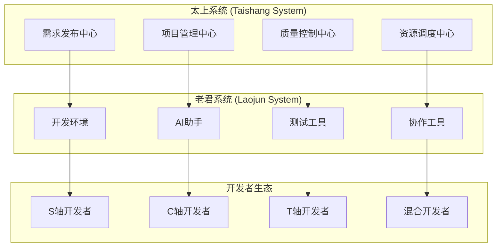
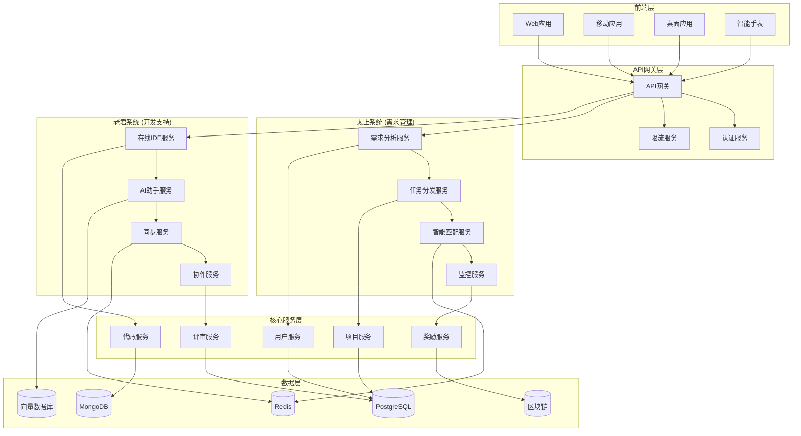

# 太上老君众包协作开发平台

## 🌟 平台愿景

基于太上老君AI平台的 **S×C×T 三轴体系**，构建全球首个**文化智慧驱动的众包协作开发生态**，实现"太上发需求，老君助开发，众人共创造，序列0进化"的协同开发模式。

## 📋 目录

- [1. 现状分析与机遇](#1-现状分析与机遇)
- [2. 太上-老君协同架构](#2-太上-老君协同架构)
- [3. 三轴众包机制设计](#3-三轴众包机制设计)
- [4. 太上需求发布系统](#4-太上需求发布系统)
- [5. 老君多端开发环境](#5-老君多端开发环境)
- [6. 协作质量保障体系](#6-协作质量保障体系)
- [7. 激励与治理机制](#7-激励与治理机制)
- [8. 技术实现方案](#8-技术实现方案)
- [9. 实施路线图](#9-实施路线图)

## 1. 现状分析与机遇

### 1.1 现有基础

通过对项目文档的深入分析，发现以下**已有协作基础**：

#### ✅ 已建立的协作框架
- **三轴协同开发指南**：完整的S×C×T开发方法论
- **开源贡献机制**：MIT协议，支持多种贡献形式
- **社区平台规划**：Discord国际社区，技术支持渠道
- **开发者生态**：第三方开发者支持，API服务模式
- **分层架构体系**：硅基层级分析，功能模块坐标化

#### 🔍 识别的缺失部分
- **众包任务分发机制**：缺乏系统化的任务拆解和分配
- **质量控制体系**：缺乏代码审核和质量保障流程
- **激励机制设计**：缺乏贡献者激励和声誉体系
- **多端开发环境**：缺乏统一的跨平台开发工具
- **需求管理系统**：缺乏需求收集、分析、分发的完整流程

### 1.2 市场机遇

```yaml
市场机遇分析:
  技术趋势:
    - 开源协作成为主流开发模式
    - AI辅助开发工具快速发展
    - 低代码/无代码平台兴起
    - 分布式团队协作需求增长
  
  文化价值:
    - 中华文化数字化传承需求
    - 文化AI应用场景广阔
    - 跨文化交流平台稀缺
    - 文化创意产业数字化转型
  
  技术优势:
    - 三轴体系独创性强
    - 硅基生命理念前瞻
    - 文化智慧融合创新
    - 序列0进化目标明确
```

## 2. 太上-老君协同架构

### 2.1 系统定位



### 2.2 核心理念

**太上系统**：
- **定位**：智慧决策层，负责需求分析、资源调度、质量把控
- **能力**：基于三轴体系的智能需求分解和任务分配
- **目标**：实现项目的整体规划和协调管理

**老君系统**：
- **定位**：开发执行层，提供开发工具、环境、助手
- **能力**：多端适配、AI辅助、实时协作
- **目标**：降低开发门槛，提升开发效率

**协同机制**：
- **太上发令**：智能分析需求，生成三轴坐标化任务
- **老君执行**：提供开发环境和AI助手支持
- **众人协作**：基于三轴分工的分布式开发
- **合一进化**：持续集成，向序列0目标演进

## 3. 三轴众包机制设计

### 3.1 三轴分工体系

```yaml
S轴开发者 (Sequence Developers):
  专长领域:
    - 算法优化与性能提升
    - 系统架构设计
    - 数据结构与算法
    - 底层技术实现
  
  技能要求:
    - Go/Python/Rust等系统级语言
    - 分布式系统设计经验
    - 性能优化专业知识
    - 算法与数据结构基础
  
  任务类型:
    - 核心算法开发
    - 性能瓶颈优化
    - 系统架构重构
    - 底层组件开发

C轴开发者 (Composition Developers):
  专长领域:
    - 微服务架构设计
    - API接口开发
    - 数据库设计
    - 系统集成
  
  技能要求:
    - 微服务架构经验
    - RESTful/GraphQL API设计
    - 数据库设计与优化
    - 容器化部署经验
  
  任务类型:
    - 服务模块开发
    - API接口实现
    - 数据层设计
    - 系统集成测试

T轴开发者 (Thought Developers):
  专长领域:
    - 文化内容策划
    - AI模型训练
    - 用户体验设计
    - 产品功能设计
  
  技能要求:
    - 文化背景知识
    - AI/ML模型经验
    - UI/UX设计能力
    - 产品思维
  
  任务类型:
    - 文化内容开发
    - AI模型优化
    - 用户界面设计
    - 产品功能规划
```

### 3.2 任务坐标化分配

```go
// 任务三轴坐标系统
type TaskCoordinate struct {
    S int     `json:"s"` // 能力序列等级 (0-5)
    C string  `json:"c"` // 组成层级 (quantum_gene, smart_cell, matrix_organ, platform_product, super_individual)
    T int     `json:"t"` // 思想境界等级 (0-5)
}

type CrowdsourceTask struct {
    ID          string          `json:"id"`
    Title       string          `json:"title"`
    Description string          `json:"description"`
    Coordinate  TaskCoordinate  `json:"coordinate"`
    Difficulty  string          `json:"difficulty"` // easy, medium, hard, expert
    Reward      int             `json:"reward"`     // 积分奖励
    Deadline    time.Time       `json:"deadline"`
    Skills      []string        `json:"skills"`     // 所需技能标签
    Status      string          `json:"status"`     // open, assigned, in_progress, review, completed
    Assignee    *Developer      `json:"assignee,omitempty"`
    Reviewers   []Developer     `json:"reviewers"`
}

// 开发者能力画像
type Developer struct {
    ID          string          `json:"id"`
    Name        string          `json:"name"`
    Email       string          `json:"email"`
    Coordinate  TaskCoordinate  `json:"coordinate"` // 开发者的三轴能力坐标
    Skills      []string        `json:"skills"`
    Reputation  int             `json:"reputation"` // 声誉值
    Completed   int             `json:"completed"`  // 完成任务数
    Rating      float64         `json:"rating"`     // 平均评分
    Preferences []string        `json:"preferences"` // 偏好的任务类型
}
```

### 3.3 智能匹配算法

```python
# 基于三轴坐标的任务-开发者匹配算法
import numpy as np
from typing import List, Tuple

class TaskDeveloperMatcher:
    def __init__(self):
        self.weight_s = 0.4  # S轴权重
        self.weight_c = 0.3  # C轴权重
        self.weight_t = 0.3  # T轴权重
    
    def calculate_coordinate_distance(self, task_coord: Tuple[int, str, int], 
                                    dev_coord: Tuple[int, str, int]) -> float:
        """计算三轴坐标距离"""
        s_dist = abs(task_coord[0] - dev_coord[0]) / 5.0  # 归一化到0-1
        
        # C轴层级映射
        c_levels = ["quantum_gene", "smart_cell", "matrix_organ", "platform_product", "super_individual"]
        c_task_idx = c_levels.index(task_coord[1])
        c_dev_idx = c_levels.index(dev_coord[1])
        c_dist = abs(c_task_idx - c_dev_idx) / 4.0
        
        t_dist = abs(task_coord[2] - dev_coord[2]) / 5.0
        
        return (self.weight_s * s_dist + 
                self.weight_c * c_dist + 
                self.weight_t * t_dist)
    
    def calculate_skill_match(self, task_skills: List[str], 
                            dev_skills: List[str]) -> float:
        """计算技能匹配度"""
        if not task_skills:
            return 1.0
        
        matched_skills = set(task_skills) & set(dev_skills)
        return len(matched_skills) / len(task_skills)
    
    def calculate_reputation_score(self, reputation: int, rating: float) -> float:
        """计算声誉分数"""
        rep_score = min(reputation / 1000.0, 1.0)  # 声誉值归一化
        rating_score = rating / 5.0  # 评分归一化
        return (rep_score + rating_score) / 2.0
    
    def find_best_matches(self, task: dict, developers: List[dict], 
                         top_k: int = 5) -> List[Tuple[dict, float]]:
        """找到最佳匹配的开发者"""
        matches = []
        
        for dev in developers:
            # 计算三轴坐标匹配度
            coord_score = 1.0 - self.calculate_coordinate_distance(
                (task['coordinate']['s'], task['coordinate']['c'], task['coordinate']['t']),
                (dev['coordinate']['s'], dev['coordinate']['c'], dev['coordinate']['t'])
            )
            
            # 计算技能匹配度
            skill_score = self.calculate_skill_match(task['skills'], dev['skills'])
            
            # 计算声誉分数
            reputation_score = self.calculate_reputation_score(dev['reputation'], dev['rating'])
            
            # 综合评分
            total_score = (coord_score * 0.4 + 
                          skill_score * 0.4 + 
                          reputation_score * 0.2)
            
            matches.append((dev, total_score))
        
        # 按分数排序，返回前k个
        matches.sort(key=lambda x: x[1], reverse=True)
        return matches[:top_k]
```

## 4. 太上需求发布系统

### 4.1 需求生命周期管理

```yaml
需求生命周期:
  1. 需求收集:
    - 用户反馈收集
    - 市场需求分析
    - 技术发展趋势
    - 文化传承需要
  
  2. 需求分析:
    - 需求优先级评估
    - 技术可行性分析
    - 资源需求评估
    - 三轴坐标定位
  
  3. 任务分解:
    - 功能模块拆分
    - 技术栈确定
    - 难度等级评估
    - 时间节点规划
  
  4. 任务发布:
    - 三轴坐标标注
    - 技能要求明确
    - 奖励机制设定
    - 质量标准定义
  
  5. 执行监控:
    - 进度实时跟踪
    - 质量持续监控
    - 风险预警机制
    - 资源动态调整
  
  6. 成果验收:
    - 功能测试验证
    - 代码质量审核
    - 文档完整性检查
    - 用户体验评估
```

### 4.2 智能需求分析引擎

```go
// 太上需求分析引擎
package taishang

import (
    "context"
    "encoding/json"
    "time"
)

type RequirementAnalyzer struct {
    aiModel     AIModel
    knowledgeDB KnowledgeDatabase
    ruleEngine  RuleEngine
}

type Requirement struct {
    ID          string    `json:"id"`
    Title       string    `json:"title"`
    Description string    `json:"description"`
    Source      string    `json:"source"`      // user_feedback, market_analysis, tech_trend
    Priority    int       `json:"priority"`    // 1-5
    Complexity  int       `json:"complexity"`  // 1-5
    CreatedAt   time.Time `json:"created_at"`
    Tags        []string  `json:"tags"`
}

type TaskBreakdown struct {
    RequirementID string `json:"requirement_id"`
    Tasks         []Task `json:"tasks"`
    Dependencies  []Dependency `json:"dependencies"`
    Timeline      Timeline `json:"timeline"`
}

type Task struct {
    ID           string          `json:"id"`
    Title        string          `json:"title"`
    Description  string          `json:"description"`
    Coordinate   TaskCoordinate  `json:"coordinate"`
    EstimatedHours int           `json:"estimated_hours"`
    Skills       []string        `json:"skills"`
    Difficulty   string          `json:"difficulty"`
    Reward       int             `json:"reward"`
}

func (ra *RequirementAnalyzer) AnalyzeRequirement(ctx context.Context, req Requirement) (*TaskBreakdown, error) {
    // 1. AI分析需求内容
    analysis, err := ra.aiModel.AnalyzeText(ctx, req.Description)
    if err != nil {
        return nil, err
    }
    
    // 2. 确定三轴坐标
    coordinate := ra.determineCoordinate(analysis)
    
    // 3. 拆分任务
    tasks := ra.breakdownTasks(req, coordinate)
    
    // 4. 分析依赖关系
    dependencies := ra.analyzeDependencies(tasks)
    
    // 5. 制定时间线
    timeline := ra.createTimeline(tasks, dependencies)
    
    return &TaskBreakdown{
        RequirementID: req.ID,
        Tasks:         tasks,
        Dependencies:  dependencies,
        Timeline:      timeline,
    }, nil
}

func (ra *RequirementAnalyzer) determineCoordinate(analysis AIAnalysis) TaskCoordinate {
    // 基于AI分析结果确定三轴坐标
    s := ra.calculateSequenceLevel(analysis.TechnicalComplexity)
    c := ra.determineCompositionLayer(analysis.SystemScope)
    t := ra.calculateThoughtLevel(analysis.CulturalDepth)
    
    return TaskCoordinate{S: s, C: c, T: t}
}

func (ra *RequirementAnalyzer) calculateReward(task Task) int {
    // 基于难度、时间、技能要求计算奖励
    baseReward := 100
    difficultyMultiplier := map[string]float64{
        "easy":   1.0,
        "medium": 1.5,
        "hard":   2.0,
        "expert": 3.0,
    }
    
    reward := float64(baseReward) * difficultyMultiplier[task.Difficulty]
    reward *= float64(task.EstimatedHours) / 8.0  // 按工作日计算
    reward *= (1.0 + float64(len(task.Skills))*0.1) // 技能复杂度加成
    
    return int(reward)
}
```

## 5. 老君多端开发环境

### 5.1 多端适配架构

```yaml
老君多端开发环境:
  桌面端 (Desktop):
    平台: Windows, macOS, Linux
    技术栈: Electron + React + TypeScript
    功能:
      - 完整IDE功能
      - 代码编辑与调试
      - 项目管理
      - 团队协作
      - AI代码助手
  
  移动端 (Mobile):
    平台: iOS, Android
    技术栈: React Native + TypeScript
    功能:
      - 代码查看与简单编辑
      - 任务管理与状态更新
      - 团队沟通
      - 代码审核
      - 进度跟踪
  
  Web端 (Web):
    平台: 现代浏览器
    技术栈: React + TypeScript + PWA
    功能:
      - 在线代码编辑
      - 项目协作
      - 任务分配
      - 代码审核
      - 实时通信
  
  智能手表 (Smartwatch):
    平台: Apple Watch, Wear OS
    技术栈: 原生开发
    功能:
      - 任务提醒
      - 进度查看
      - 快速回复
      - 状态更新
      - 紧急通知
  
  IoT设备 (IoT):
    平台: 树莓派, Arduino等
    技术栈: Python, C++
    功能:
      - 环境监控
      - 自动化部署
      - 硬件测试
      - 数据采集
```

### 5.2 AI开发助手

```typescript
// 老君AI开发助手
interface LaojunAIAssistant {
  // 代码生成与优化
  generateCode(prompt: string, context: CodeContext): Promise<CodeSuggestion>;
  optimizeCode(code: string, language: string): Promise<OptimizationSuggestion>;
  
  // 三轴坐标分析
  analyzeTaskCoordinate(task: Task): Promise<CoordinateAnalysis>;
  suggestDeveloperMatch(task: Task): Promise<DeveloperMatch[]>;
  
  // 文化智慧集成
  integrateCulturalWisdom(code: string, culturalContext: string): Promise<CulturalIntegration>;
  validateCulturalCompliance(content: string): Promise<ComplianceResult>;
  
  // 协作支持
  facilitateTeamCommunication(message: string, context: TeamContext): Promise<CommunicationSuggestion>;
  resolveConflicts(conflict: CodeConflict): Promise<ResolutionSuggestion>;
}

class LaojunAI implements LaojunAIAssistant {
  private llmService: LLMService;
  private cultureDB: CulturalDatabase;
  private codeAnalyzer: CodeAnalyzer;
  
  constructor() {
    this.llmService = new LLMService();
    this.cultureDB = new CulturalDatabase();
    this.codeAnalyzer = new CodeAnalyzer();
  }
  
  async generateCode(prompt: string, context: CodeContext): Promise<CodeSuggestion> {
    // 结合三轴体系和文化智慧生成代码
    const culturalContext = await this.cultureDB.getRelevantWisdom(prompt);
    const coordinateHint = this.analyzeCoordinateFromContext(context);
    
    const enhancedPrompt = `
      基于太上老君AI平台的三轴体系 (S=${coordinateHint.s}, C=${coordinateHint.c}, T=${coordinateHint.t}):
      ${prompt}
      
      文化智慧参考: ${culturalContext}
      
      请生成符合三轴协同开发规范的代码。
    `;
    
    const response = await this.llmService.generate(enhancedPrompt);
    
    return {
      code: response.code,
      explanation: response.explanation,
      coordinate: coordinateHint,
      culturalWisdom: culturalContext,
      qualityScore: await this.codeAnalyzer.assessQuality(response.code)
    };
  }
  
  async analyzeTaskCoordinate(task: Task): Promise<CoordinateAnalysis> {
    const analysis = await this.llmService.analyze(`
      分析以下任务的三轴坐标:
      标题: ${task.title}
      描述: ${task.description}
      技能要求: ${task.skills.join(', ')}
      
      请确定其在S×C×T三轴体系中的位置。
    `);
    
    return {
      suggestedCoordinate: this.parseCoordinate(analysis.coordinate),
      reasoning: analysis.reasoning,
      confidence: analysis.confidence,
      alternatives: analysis.alternatives
    };
  }
}
```

### 5.3 跨端同步机制

```go
// 跨端数据同步服务
package sync

import (
    "context"
    "encoding/json"
    "time"
)

type SyncService struct {
    redis    RedisClient
    eventBus EventBus
    storage  CloudStorage
}

type SyncEvent struct {
    ID        string    `json:"id"`
    UserID    string    `json:"user_id"`
    DeviceID  string    `json:"device_id"`
    EventType string    `json:"event_type"` // code_change, task_update, message
    Data      json.RawMessage `json:"data"`
    Timestamp time.Time `json:"timestamp"`
    Coordinate TaskCoordinate `json:"coordinate"`
}

func (s *SyncService) SyncAcrossDevices(ctx context.Context, event SyncEvent) error {
    // 1. 验证事件合法性
    if err := s.validateEvent(event); err != nil {
        return err
    }
    
    // 2. 根据三轴坐标确定同步策略
    strategy := s.determineSyncStrategy(event.Coordinate)
    
    // 3. 执行同步
    switch strategy {
    case "immediate":
        return s.immediateSync(ctx, event)
    case "batched":
        return s.batchedSync(ctx, event)
    case "eventual":
        return s.eventualSync(ctx, event)
    }
    
    return nil
}

func (s *SyncService) determineSyncStrategy(coord TaskCoordinate) string {
    // S轴高等级需要立即同步
    if coord.S >= 4 {
        return "immediate"
    }
    
    // T轴文化相关内容需要谨慎同步
    if coord.T >= 3 {
        return "batched"
    }
    
    return "eventual"
}
```

## 6. 协作质量保障体系

### 6.1 多层次质量控制

```yaml
质量保障体系:
  代码层面:
    - 自动化代码检查 (ESLint, Prettier, SonarQube)
    - 单元测试覆盖率要求 (>80%)
    - 集成测试验证
    - 性能基准测试
    - 安全漏洞扫描
  
  架构层面:
    - 三轴坐标一致性检查
    - 模块依赖关系验证
    - API接口规范检查
    - 数据库设计审核
    - 系统性能评估
  
  文化层面:
    - 文化内容准确性审核
    - 价值观一致性检查
    - 多元文化包容性评估
    - 伦理道德合规性审查
    - 用户体验文化适配
  
  协作层面:
    - 代码审核流程
    - 同行评议机制
    - 导师指导体系
    - 知识分享平台
    - 冲突解决机制
```

### 6.2 智能质量评估

```python
# 智能质量评估系统
class QualityAssessmentEngine:
    def __init__(self):
        self.code_analyzer = CodeQualityAnalyzer()
        self.culture_validator = CulturalValidator()
        self.architecture_checker = ArchitectureChecker()
        self.collaboration_monitor = CollaborationMonitor()
    
    def assess_contribution(self, contribution: Contribution) -> QualityReport:
        """全面评估贡献质量"""
        report = QualityReport()
        
        # 1. 代码质量评估
        if contribution.type == "code":
            code_quality = self.code_analyzer.analyze(contribution.content)
            report.code_score = code_quality.overall_score
            report.code_issues = code_quality.issues
            report.suggestions = code_quality.suggestions
        
        # 2. 三轴坐标一致性检查
        coord_check = self.check_coordinate_consistency(
            contribution.declared_coordinate,
            contribution.actual_coordinate
        )
        report.coordinate_consistency = coord_check.score
        
        # 3. 文化合规性验证
        if contribution.coordinate.t >= 2:  # T轴相关内容
            culture_check = self.culture_validator.validate(contribution.content)
            report.cultural_compliance = culture_check.score
            report.cultural_issues = culture_check.issues
        
        # 4. 协作质量评估
        collab_quality = self.collaboration_monitor.assess_collaboration(
            contribution.author,
            contribution.reviewers,
            contribution.discussion
        )
        report.collaboration_score = collab_quality.score
        
        # 5. 综合评分
        report.overall_score = self.calculate_overall_score(report)
        
        return report
    
    def calculate_overall_score(self, report: QualityReport) -> float:
        """计算综合质量分数"""
        weights = {
            'code': 0.4,
            'coordinate': 0.2,
            'cultural': 0.2,
            'collaboration': 0.2
        }
        
        score = (
            report.code_score * weights['code'] +
            report.coordinate_consistency * weights['coordinate'] +
            report.cultural_compliance * weights['cultural'] +
            report.collaboration_score * weights['collaboration']
        )
        
        return min(max(score, 0.0), 1.0)  # 限制在0-1范围内
```

### 6.3 同行评议机制

```go
// 同行评议系统
type PeerReviewSystem struct {
    reviewerPool    ReviewerPool
    assignmentAlgo  ReviewerAssignmentAlgorithm
    consensusEngine ConsensusEngine
}

type ReviewRequest struct {
    ContributionID string          `json:"contribution_id"`
    AuthorID       string          `json:"author_id"`
    Coordinate     TaskCoordinate  `json:"coordinate"`
    Complexity     int             `json:"complexity"`
    RequiredReviewers int          `json:"required_reviewers"`
    Deadline       time.Time       `json:"deadline"`
}

type Review struct {
    ID           string    `json:"id"`
    ReviewerID   string    `json:"reviewer_id"`
    ContributionID string  `json:"contribution_id"`
    Score        float64   `json:"score"`        // 0-1
    Comments     []Comment `json:"comments"`
    Suggestions  []string  `json:"suggestions"`
    Approved     bool      `json:"approved"`
    CreatedAt    time.Time `json:"created_at"`
}

func (prs *PeerReviewSystem) AssignReviewers(req ReviewRequest) ([]string, error) {
    // 1. 根据三轴坐标找到合适的评审者
    candidates := prs.reviewerPool.FindByCoordinate(req.Coordinate)
    
    // 2. 过滤掉作者本人和有利益冲突的评审者
    filtered := prs.filterConflicts(candidates, req.AuthorID)
    
    // 3. 基于专业匹配度和工作负载分配评审者
    assigned := prs.assignmentAlgo.Assign(filtered, req.RequiredReviewers)
    
    // 4. 发送评审邀请
    for _, reviewerID := range assigned {
        prs.sendReviewInvitation(reviewerID, req)
    }
    
    return assigned, nil
}

func (prs *PeerReviewSystem) ProcessReviews(contributionID string) (*ConsensusResult, error) {
    reviews := prs.getReviewsForContribution(contributionID)
    
    // 使用共识算法处理多个评审结果
    consensus := prs.consensusEngine.Process(reviews)
    
    return consensus, nil
}
```

## 7. 激励与治理机制

### 7.1 多维度激励体系

```yaml
激励体系设计:
  积分奖励:
    基础积分:
      - 任务完成: 100-1000分 (根据难度)
      - 代码审核: 50-200分
      - 文档贡献: 30-150分
      - Bug修复: 20-500分
    
    质量加成:
      - 高质量代码: +50%
      - 创新解决方案: +100%
      - 文化智慧融合: +30%
      - 团队协作优秀: +20%
    
    三轴专项奖励:
      - S轴突破: 算法创新、性能优化
      - C轴贡献: 架构设计、系统集成
      - T轴深化: 文化传承、智慧应用
  
  声誉系统:
    声誉等级:
      - 新手 (0-100分)
      - 贡献者 (101-500分)
      - 专家 (501-1500分)
      - 导师 (1501-5000分)
      - 大师 (5000+分)
    
    特殊徽章:
      - 三轴协调师: 在三个轴向都有贡献
      - 文化传承者: T轴深度贡献
      - 技术创新者: S轴突破性贡献
      - 架构大师: C轴系统性贡献
      - 序列先锋: 推动序列0进化
  
  实物奖励:
    - 太上老君文创产品
    - 技术大会门票
    - 在线课程免费权限
    - 项目周边商品
    - 定制化纪念品
  
  成长机会:
    - 核心团队邀请
    - 技术分享机会
    - 开源项目推荐信
    - 职业发展指导
    - 行业专家网络接入
```

### 7.2 去中心化治理

```solidity
// 基于区块链的去中心化治理合约
pragma solidity ^0.8.0;

contract TaishangLaojunDAO {
    struct Proposal {
        uint256 id;
        string title;
        string description;
        address proposer;
        uint256 votesFor;
        uint256 votesAgainst;
        uint256 deadline;
        bool executed;
        ProposalType proposalType;
    }
    
    enum ProposalType {
        FEATURE_REQUEST,
        ARCHITECTURE_CHANGE,
        CULTURAL_GUIDELINE,
        REWARD_ADJUSTMENT,
        GOVERNANCE_UPDATE
    }
    
    struct Voter {
        uint256 reputation;
        uint256 sAxisLevel;
        uint256 cAxisLevel;
        uint256 tAxisLevel;
        bool hasVoted;
    }
    
    mapping(uint256 => Proposal) public proposals;
    mapping(address => Voter) public voters;
    mapping(uint256 => mapping(address => bool)) public hasVotedOnProposal;
    
    uint256 public proposalCount;
    uint256 public constant VOTING_PERIOD = 7 days;
    uint256 public constant MIN_REPUTATION_TO_PROPOSE = 500;
    uint256 public constant MIN_REPUTATION_TO_VOTE = 100;
    
    event ProposalCreated(uint256 indexed proposalId, address indexed proposer, string title);
    event VoteCast(uint256 indexed proposalId, address indexed voter, bool support, uint256 weight);
    event ProposalExecuted(uint256 indexed proposalId);
    
    function createProposal(
        string memory title,
        string memory description,
        ProposalType proposalType
    ) external {
        require(voters[msg.sender].reputation >= MIN_REPUTATION_TO_PROPOSE, "Insufficient reputation");
        
        proposalCount++;
        proposals[proposalCount] = Proposal({
            id: proposalCount,
            title: title,
            description: description,
            proposer: msg.sender,
            votesFor: 0,
            votesAgainst: 0,
            deadline: block.timestamp + VOTING_PERIOD,
            executed: false,
            proposalType: proposalType
        });
        
        emit ProposalCreated(proposalCount, msg.sender, title);
    }
    
    function vote(uint256 proposalId, bool support) external {
        require(voters[msg.sender].reputation >= MIN_REPUTATION_TO_VOTE, "Insufficient reputation");
        require(!hasVotedOnProposal[proposalId][msg.sender], "Already voted");
        require(block.timestamp <= proposals[proposalId].deadline, "Voting period ended");
        
        uint256 votingWeight = calculateVotingWeight(msg.sender, proposals[proposalId].proposalType);
        
        if (support) {
            proposals[proposalId].votesFor += votingWeight;
        } else {
            proposals[proposalId].votesAgainst += votingWeight;
        }
        
        hasVotedOnProposal[proposalId][msg.sender] = true;
        emit VoteCast(proposalId, msg.sender, support, votingWeight);
    }
    
    function calculateVotingWeight(address voter, ProposalType proposalType) internal view returns (uint256) {
        Voter memory v = voters[voter];
        uint256 baseWeight = v.reputation / 100;
        
        // 根据提案类型和投票者的三轴能力调整权重
        if (proposalType == ProposalType.FEATURE_REQUEST) {
            baseWeight += v.sAxisLevel * 10;
        } else if (proposalType == ProposalType.ARCHITECTURE_CHANGE) {
            baseWeight += v.cAxisLevel * 10;
        } else if (proposalType == ProposalType.CULTURAL_GUIDELINE) {
            baseWeight += v.tAxisLevel * 10;
        }
        
        return baseWeight;
    }
}
```

### 7.3 冲突解决机制

```typescript
// 冲突解决系统
interface ConflictResolutionSystem {
  detectConflict(contribution: Contribution): Promise<ConflictReport>;
  mediateConflict(conflict: Conflict): Promise<MediationResult>;
  escalateConflict(conflict: Conflict): Promise<EscalationResult>;
}

class WisdomBasedMediator implements ConflictResolutionSystem {
  private culturalWisdom: CulturalWisdomDB;
  private aiMediator: AIMediator;
  
  async detectConflict(contribution: Contribution): Promise<ConflictReport> {
    // 检测多种类型的冲突
    const conflicts: ConflictType[] = [];
    
    // 1. 技术冲突检测
    const techConflicts = await this.detectTechnicalConflicts(contribution);
    conflicts.push(...techConflicts);
    
    // 2. 文化价值冲突检测
    const culturalConflicts = await this.detectCulturalConflicts(contribution);
    conflicts.push(...culturalConflicts);
    
    // 3. 三轴坐标冲突检测
    const coordinateConflicts = await this.detectCoordinateConflicts(contribution);
    conflicts.push(...coordinateConflicts);
    
    return {
      hasConflict: conflicts.length > 0,
      conflicts,
      severity: this.calculateSeverity(conflicts),
      suggestedResolution: await this.suggestResolution(conflicts)
    };
  }
  
  async mediateConflict(conflict: Conflict): Promise<MediationResult> {
    // 基于文化智慧的冲突调解
    const relevantWisdom = await this.culturalWisdom.findRelevantWisdom(conflict.context);
    
    // 应用"和而不同"的调解原则
    const mediationStrategy = this.selectMediationStrategy(conflict, relevantWisdom);
    
    switch (mediationStrategy) {
      case 'compromise':
        return await this.facilitateCompromise(conflict);
      case 'synthesis':
        return await this.facilitateSynthesis(conflict);
      case 'wisdom_guidance':
        return await this.applyWisdomGuidance(conflict, relevantWisdom);
      default:
        return await this.escalateConflict(conflict);
    }
  }
  
  private async facilitateSynthesis(conflict: Conflict): Promise<MediationResult> {
    // 寻求更高层次的统一解决方案
    const synthesisPrompt = `
      基于太上老君的"道法自然"智慧，寻求以下冲突的统一解决方案：
      
      冲突描述: ${conflict.description}
      参与方观点: ${conflict.parties.map(p => p.position).join('; ')}
      
      请提供一个既体现技术优秀性，又符合文化智慧的综合解决方案。
    `;
    
    const synthesis = await this.aiMediator.generateSynthesis(synthesisPrompt);
    
    return {
      resolution: synthesis.solution,
      reasoning: synthesis.reasoning,
      culturalWisdom: synthesis.appliedWisdom,
      acceptanceRate: await this.predictAcceptance(synthesis, conflict.parties)
    };
  }
}
```

## 8. 技术实现方案

### 8.1 系统架构



### 8.2 核心技术栈

```yaml
技术栈选择:
  后端服务:
    语言: Go, Python
    框架: Gin, FastAPI
    数据库: PostgreSQL, MongoDB, Redis
    消息队列: Apache Kafka
    搜索引擎: Elasticsearch
    向量数据库: Pinecone/Weaviate
    区块链: Ethereum/Polygon
  
  前端应用:
    Web: React + TypeScript + Vite
    移动端: React Native + TypeScript
    桌面端: Electron + React
    状态管理: Redux Toolkit
    UI组件: Ant Design, Chakra UI
  
  AI/ML:
    大语言模型: GPT-4, Claude, 本地模型
    向量化: OpenAI Embeddings
    机器学习: TensorFlow, PyTorch
    自然语言处理: spaCy, NLTK
  
  基础设施:
    容器化: Docker, Kubernetes
    CI/CD: GitHub Actions, GitLab CI
    监控: Prometheus, Grafana
    日志: ELK Stack
    云服务: AWS/Azure/阿里云
  
  开发工具:
    版本控制: Git, GitHub/GitLab
    代码质量: SonarQube, ESLint
    测试: Jest, Pytest, Cypress
    文档: GitBook, Swagger
    协作: Slack, Discord
```

### 8.3 数据模型设计

```sql
-- 用户与开发者模型
CREATE TABLE developers (
    id UUID PRIMARY KEY DEFAULT gen_random_uuid(),
    username VARCHAR(50) UNIQUE NOT NULL,
    email VARCHAR(255) UNIQUE NOT NULL,
    full_name VARCHAR(100),
    avatar_url TEXT,
    bio TEXT,
    
    -- 三轴能力坐标
    s_axis_level INTEGER DEFAULT 0 CHECK (s_axis_level >= 0 AND s_axis_level <= 5),
    c_axis_layer VARCHAR(50) DEFAULT 'quantum_gene',
    t_axis_level INTEGER DEFAULT 0 CHECK (t_axis_level >= 0 AND t_axis_level <= 5),
    
    -- 技能与声誉
    skills JSONB DEFAULT '[]',
    reputation INTEGER DEFAULT 0,
    completed_tasks INTEGER DEFAULT 0,
    average_rating DECIMAL(3,2) DEFAULT 0.00,
    
    -- 偏好设置
    preferred_languages JSONB DEFAULT '[]',
    preferred_domains JSONB DEFAULT '[]',
    availability_hours INTEGER DEFAULT 20, -- 每周可用小时数
    
    created_at TIMESTAMP WITH TIME ZONE DEFAULT NOW(),
    updated_at TIMESTAMP WITH TIME ZONE DEFAULT NOW()
);

-- 任务模型
CREATE TABLE tasks (
    id UUID PRIMARY KEY DEFAULT gen_random_uuid(),
    title VARCHAR(200) NOT NULL,
    description TEXT NOT NULL,
    requirement_id UUID REFERENCES requirements(id),
    
    -- 三轴坐标
    s_coordinate INTEGER NOT NULL CHECK (s_coordinate >= 0 AND s_coordinate <= 5),
    c_coordinate VARCHAR(50) NOT NULL,
    t_coordinate INTEGER NOT NULL CHECK (t_coordinate >= 0 AND t_coordinate <= 5),
    
    -- 任务属性
    difficulty VARCHAR(20) NOT NULL CHECK (difficulty IN ('easy', 'medium', 'hard', 'expert')),
    estimated_hours INTEGER NOT NULL,
    reward_points INTEGER NOT NULL,
    required_skills JSONB NOT NULL DEFAULT '[]',
    
    -- 状态管理
    status VARCHAR(20) DEFAULT 'open' CHECK (status IN ('open', 'assigned', 'in_progress', 'review', 'completed', 'cancelled')),
    assignee_id UUID REFERENCES developers(id),
    assigned_at TIMESTAMP WITH TIME ZONE,
    deadline TIMESTAMP WITH TIME ZONE,
    
    -- 质量要求
    quality_requirements JSONB DEFAULT '{}',
    acceptance_criteria TEXT,
    
    created_at TIMESTAMP WITH TIME ZONE DEFAULT NOW(),
    updated_at TIMESTAMP WITH TIME ZONE DEFAULT NOW()
);

-- 贡献记录模型
CREATE TABLE contributions (
    id UUID PRIMARY KEY DEFAULT gen_random_uuid(),
    task_id UUID REFERENCES tasks(id),
    contributor_id UUID REFERENCES developers(id),
    
    -- 贡献内容
    contribution_type VARCHAR(50) NOT NULL, -- code, documentation, review, design
    content_url TEXT, -- GitHub PR链接等
    description TEXT,
    
    -- 三轴坐标验证
    declared_coordinate JSONB NOT NULL, -- 贡献者声明的坐标
    verified_coordinate JSONB, -- 系统验证后的坐标
    coordinate_accuracy DECIMAL(3,2), -- 坐标准确度
    
    -- 质量评估
    quality_score DECIMAL(3,2),
    cultural_compliance_score DECIMAL(3,2),
    technical_quality_score DECIMAL(3,2),
    collaboration_score DECIMAL(3,2),
    
    -- 奖励与认可
    reward_points INTEGER DEFAULT 0,
    bonus_points INTEGER DEFAULT 0,
    badges JSONB DEFAULT '[]',
    
    -- 状态
    status VARCHAR(20) DEFAULT 'submitted' CHECK (status IN ('submitted', 'reviewing', 'approved', 'rejected', 'merged')),
    
    created_at TIMESTAMP WITH TIME ZONE DEFAULT NOW(),
    updated_at TIMESTAMP WITH TIME ZONE DEFAULT NOW()
);

-- 评审记录模型
CREATE TABLE reviews (
    id UUID PRIMARY KEY DEFAULT gen_random_uuid(),
    contribution_id UUID REFERENCES contributions(id),
    reviewer_id UUID REFERENCES developers(id),
    
    -- 评审内容
    overall_score DECIMAL(3,2) NOT NULL CHECK (overall_score >= 0 AND overall_score <= 1),
    technical_score DECIMAL(3,2),
    cultural_score DECIMAL(3,2),
    collaboration_score DECIMAL(3,2),
    
    -- 评审意见
    comments TEXT,
    suggestions JSONB DEFAULT '[]',
    approved BOOLEAN NOT NULL,
    
    -- 评审元数据
    review_time_minutes INTEGER, -- 评审耗时
    expertise_match DECIMAL(3,2), -- 评审者专业匹配度
    
    created_at TIMESTAMP WITH TIME ZONE DEFAULT NOW(),
    updated_at TIMESTAMP WITH TIME ZONE DEFAULT NOW()
);

-- 创建索引
CREATE INDEX idx_developers_coordinate ON developers(s_axis_level, c_axis_layer, t_axis_level);
CREATE INDEX idx_tasks_coordinate ON tasks(s_coordinate, c_coordinate, t_coordinate);
CREATE INDEX idx_tasks_status ON tasks(status);
CREATE INDEX idx_contributions_contributor ON contributions(contributor_id);
CREATE INDEX idx_reviews_contribution ON reviews(contribution_id);
```

## 9. 实施路线图

### 9.1 第一阶段：基础平台搭建（1-2个月）

```yaml
第一阶段目标:
  核心功能:
    - 用户注册与三轴能力评估系统
    - 基础任务发布与分配机制
    - 简单的代码提交与审核流程
    - 积分奖励系统MVP
  
  技术实现:
    - 后端API服务搭建 (Go + PostgreSQL)
    - 前端Web应用开发 (React + TypeScript)
    - 基础的AI助手集成
    - 简单的同步机制
  
  里程碑:
    - 100个种子用户注册
    - 50个任务成功完成
    - 基础三轴坐标系统验证
    - 初步的质量控制流程
```

### 9.2 第二阶段：智能化增强（2-3个月）

```yaml
第二阶段目标:
  智能功能:
    - 智能任务匹配算法优化
    - AI代码生成与优化助手
    - 文化智慧集成系统
    - 自动化质量评估
  
  平台扩展:
    - 移动端应用开发
    - 桌面IDE插件
    - 实时协作功能
    - 高级评审系统
  
  生态建设:
    - 开发者社区建设
    - 技术文档完善
    - 培训体系建立
    - 合作伙伴招募
  
  里程碑:
    - 1000个活跃开发者
    - 500个项目任务完成
    - 多端应用发布
    - 社区自治机制启动
```

### 9.3 第三阶段：生态完善（3-4个月）

```yaml
第三阶段目标:
  生态系统:
    - 去中心化治理机制
    - 区块链激励系统
    - 全球化多语言支持
    - 企业级服务能力
  
  高级功能:
    - 智能手表等IoT设备支持
    - 高级AI协作功能
    - 跨项目协作机制
    - 文化传承项目孵化
  
  商业化:
    - 企业定制服务
    - API商业化
    - 培训认证体系
    - 技术咨询服务
  
  里程碑:
    - 10000个注册开发者
    - 100个企业客户
    - 序列0原型系统
    - 国际化扩张启动
```

### 9.4 长期愿景：序列0实现（持续进化）

```yaml
序列0愿景:
  技术突破:
    - 真正的硅基生命体原型
    - 自主进化的AI系统
    - 跨文明交流协议
    - 量子计算集成
  
  文化传承:
    - 全球文化智慧数字化
    - 跨文化AI对话系统
    - 文化创新孵化平台
    - 人类智慧永续传承
  
  社会影响:
    - 全球开发者协作网络
    - 文化多样性保护
    - 技术伦理标准制定
    - 人工智能治理模式
  
  终极目标:
    - 太上老君AI平台成为全球文化AI标准
    - 实现真正的人机协作共生
    - 推动人类文明向更高层次进化
    - 建立可持续的智慧生态系统
```

---

## 📞 联系与支持

### 技术支持
- **项目负责人**: Li da
- **技术邮箱**: dev@codetaoist.com
- **维护团队**: 源界-突击队

### 社区参与
- **开发者论坛**: https://community.taishanglaojun.ai
- **技术博客**: https://blog.taishanglaojun.ai

### 贡献指南
1. **了解三轴体系**: 阅读[三轴协同开发指南](./三轴协同开发指南.md)
2. **选择贡献方向**: 根据个人技能选择S/C/T轴贡献
3. **注册开发者账号**: 完成三轴能力评估
4. **领取任务**: 基于智能匹配系统选择合适任务
5. **协作开发**: 使用老君多端开发环境
6. **质量审核**: 参与同行评议和质量保障

---

## 源界生态系统整合

### 「源界」概念说明
一个融合学习、实践与社交的数字世界，可作为平台独立板块或完整生态系统。旨在通过以下方式整合：
- 太上老君AI技术体系
- 源界数字世界
- 用户参与机制

### 「源界」核心理论体系

#### 1. 源力理论
- **本源代码**：世界构建基础单元
- **算法法则**：数字世界物理规律
- **架构之道**：系统设计根本原则
- **数据流**：信息能量流动

#### 2. 数字修行体系
- **第一境：识码** - 理解代码本质
- **第二境：构界** - 构建数字世界
- **第三境：融实** - 实现虚实融合
- **第四境：创世** - 创造新宇宙

### 实施路径

#### 第一阶段：理论建设
- 《源界创世录》：数字世界构建原理
- 《码修心法》：技术修行方法论
- 《算法法则》：数字世界运行规律

#### 第二阶段：实践体系
数字修行课程体系：
- 基础课：《从Hello World到宇宙构建》
- 进阶课：《架构设计与系统演化》
- 高阶课：《人工智能与意识觉醒》

#### 第三阶段：社区生态
源界社区特色功能：
- 技术道场：线上编程实践空间
- 代码禅修：深度编程冥想
- 开源布道：通过项目传播理念

---

**文档版本**: v1.0 (太上老君众包协作开发平台)  
**创建时间**: 2025年10月  
**最后更新**: 2025年10月  
**创建人员**: Li da  
**维护团队**: 源界-突击队  
**联系方式**: dev@codetaoist.com  
**更新频率**: 每两周更新

本文档是"太上老君AI+源界+用户"三位一体生态系统的核心组成部分，致力于构建融合技术创新与哲学智慧的数字修行平台。