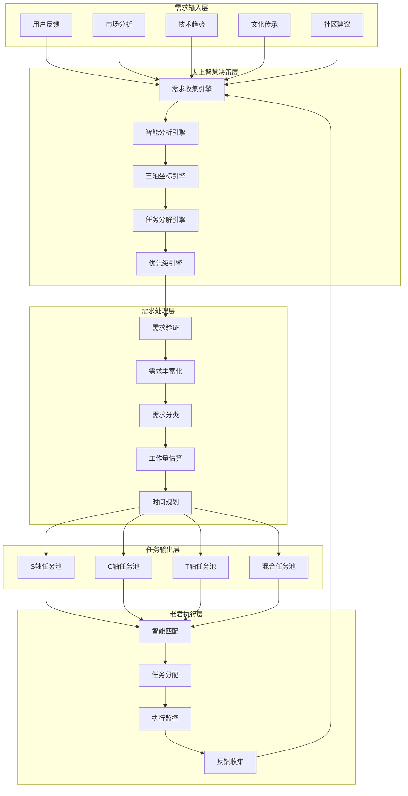
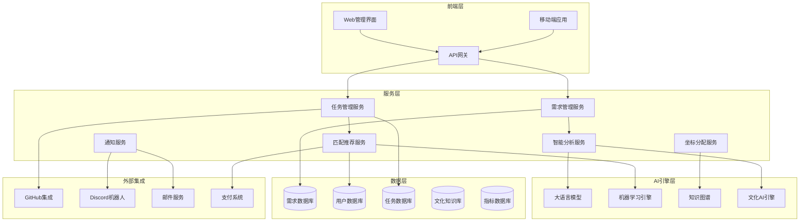

# 太上系统需求管理机制

## 🎯 系统定位

太上系统作为太上老君AI平台的**智慧决策层**，负责需求的收集、分析、分解和分发，实现从用户需求到开发任务的智能化转换。基于**S×C×T三轴体系**，太上系统将需求进行坐标化分配，确保每个需求都能找到最合适的开发者和实现路径。

## 📋 目录

- [1. 需求管理架构](#1-需求管理架构)
- [2. 需求收集机制](#2-需求收集机制)
- [3. 智能需求分析](#3-智能需求分析)
- [4. 三轴坐标化分配](#4-三轴坐标化分配)
- [5. 任务分解与发布](#5-任务分解与发布)
- [6. 需求生命周期管理](#6-需求生命周期管理)
- [7. 质量保障机制](#7-质量保障机制)
- [8. 技术实现方案](#8-技术实现方案)

## 1. 需求管理架构

### 1.1 系统架构图



### 1.2 核心设计原则

```yaml
设计原则:
  智慧决策:
    - 基于文化智慧的需求理解
    - 多维度综合分析决策
    - 动态优化调整机制
    - 预测性需求识别
  
  三轴协同:
    - S轴技术能力匹配
    - C轴架构层级对应
    - T轴文化深度融合
    - 三轴平衡发展
  
  自适应进化:
    - 学习历史决策经验
    - 持续优化分配算法
    - 动态调整评估标准
    - 自主进化决策能力
  
  开放透明:
    - 需求处理过程可视化
    - 决策逻辑可解释
    - 社区参与决策过程
    - 公开透明的优先级机制
```

## 2. 需求收集机制

### 2.1 多渠道需求收集

```go
// 需求收集引擎
package taishang

import (
    "context"
    "time"
    "encoding/json"
)

type RequirementCollector struct {
    channels map[string]CollectionChannel
    processor RequirementProcessor
    storage RequirementStorage
    ai AIAnalyzer
}

type RequirementSource struct {
    ID          string    `json:"id"`
    Type        string    `json:"type"`        // user_feedback, market_analysis, tech_trend, cultural_need, community_suggestion
    Title       string    `json:"title"`
    Description string    `json:"description"`
    Source      string    `json:"source"`      // 来源标识
    Priority    int       `json:"priority"`    // 初始优先级 1-5
    Tags        []string  `json:"tags"`
    Metadata    json.RawMessage `json:"metadata"` // 额外元数据
    CreatedAt   time.Time `json:"created_at"`
    CreatedBy   string    `json:"created_by"`
}

// 用户反馈收集
func (rc *RequirementCollector) CollectUserFeedback(ctx context.Context, feedback UserFeedback) error {
    requirement := RequirementSource{
        ID:          generateID(),
        Type:        "user_feedback",
        Title:       feedback.Title,
        Description: feedback.Description,
        Source:      feedback.UserID,
        Priority:    rc.calculateInitialPriority(feedback),
        Tags:        rc.extractTags(feedback.Description),
        CreatedAt:   time.Now(),
        CreatedBy:   feedback.UserID,
    }
    
    // AI增强分析
    enhanced, err := rc.ai.EnhanceRequirement(ctx, requirement)
    if err != nil {
        return err
    }
    
    return rc.storage.Store(ctx, enhanced)
}

// 市场趋势分析收集
func (rc *RequirementCollector) CollectMarketTrends(ctx context.Context) error {
    trends, err := rc.analyzeMarketTrends(ctx)
    if err != nil {
        return err
    }
    
    for _, trend := range trends {
        requirement := RequirementSource{
            ID:          generateID(),
            Type:        "market_analysis",
            Title:       trend.Title,
            Description: trend.Analysis,
            Source:      "market_analyzer",
            Priority:    trend.Impact, // 基于市场影响力
            Tags:        trend.Keywords,
            CreatedAt:   time.Now(),
            CreatedBy:   "system",
        }
        
        if err := rc.storage.Store(ctx, requirement); err != nil {
            return err
        }
    }
    
    return nil
}

// 文化传承需求收集
func (rc *RequirementCollector) CollectCulturalNeeds(ctx context.Context) error {
    culturalExperts := rc.getCulturalExperts()
    
    for _, expert := range culturalExperts {
        needs, err := rc.consultCulturalExpert(ctx, expert)
        if err != nil {
            continue
        }
        
        for _, need := range needs {
            requirement := RequirementSource{
                ID:          generateID(),
                Type:        "cultural_need",
                Title:       need.Title,
                Description: need.Description,
                Source:      expert.ID,
                Priority:    need.CulturalImportance,
                Tags:        append(need.Tags, "cultural", "wisdom"),
                CreatedAt:   time.Now(),
                CreatedBy:   expert.ID,
            }
            
            if err := rc.storage.Store(ctx, requirement); err != nil {
                return err
            }
        }
    }
    
    return nil
}
```

### 2.2 智能需求挖掘

```python
# 智能需求挖掘系统
import asyncio
from typing import List, Dict, Any
from dataclasses import dataclass
import openai
from datetime import datetime, timedelta

@dataclass
class RequirementPattern:
    pattern_type: str
    description: str
    frequency: int
    confidence: float
    suggested_priority: int

class IntelligentRequirementMiner:
    def __init__(self):
        self.llm_client = openai.AsyncOpenAI()
        self.pattern_analyzer = PatternAnalyzer()
        self.trend_predictor = TrendPredictor()
        self.cultural_analyzer = CulturalAnalyzer()
    
    async def mine_hidden_requirements(self, context: Dict[str, Any]) -> List[RequirementSource]:
        """挖掘隐藏的需求"""
        hidden_requirements = []
        
        # 1. 分析用户行为模式
        behavior_patterns = await self.analyze_user_behavior(context['user_data'])
        behavior_reqs = await self.patterns_to_requirements(behavior_patterns, 'behavior_analysis')
        hidden_requirements.extend(behavior_reqs)
        
        # 2. 分析技术发展趋势
        tech_trends = await self.analyze_tech_trends(context['tech_data'])
        trend_reqs = await self.trends_to_requirements(tech_trends, 'tech_trend')
        hidden_requirements.extend(trend_reqs)
        
        # 3. 分析文化传承缺口
        cultural_gaps = await self.analyze_cultural_gaps(context['cultural_data'])
        cultural_reqs = await self.gaps_to_requirements(cultural_gaps, 'cultural_gap')
        hidden_requirements.extend(cultural_reqs)
        
        # 4. 预测未来需求
        future_needs = await self.predict_future_needs(context)
        future_reqs = await self.needs_to_requirements(future_needs, 'future_prediction')
        hidden_requirements.extend(future_reqs)
        
        return hidden_requirements
    
    async def analyze_user_behavior(self, user_data: Dict) -> List[RequirementPattern]:
        """分析用户行为模式"""
        patterns = []
        
        # 分析用户使用频率
        usage_patterns = self.pattern_analyzer.analyze_usage_frequency(user_data['usage_logs'])
        for pattern in usage_patterns:
            if pattern.anomaly_score > 0.7:  # 异常使用模式可能暗示新需求
                patterns.append(RequirementPattern(
                    pattern_type="usage_anomaly",
                    description=f"用户在{pattern.feature}功能上的使用模式异常，可能需要{pattern.suggested_improvement}",
                    frequency=pattern.frequency,
                    confidence=pattern.anomaly_score,
                    suggested_priority=3
                ))
        
        # 分析用户反馈情感
        feedback_sentiment = await self.analyze_feedback_sentiment(user_data['feedback'])
        for sentiment in feedback_sentiment:
            if sentiment.negative_score > 0.6:
                patterns.append(RequirementPattern(
                    pattern_type="negative_sentiment",
                    description=f"用户对{sentiment.feature}表现出负面情感，需要改进",
                    frequency=sentiment.mention_count,
                    confidence=sentiment.negative_score,
                    suggested_priority=4
                ))
        
        return patterns
    
    async def predict_future_needs(self, context: Dict) -> List[Dict]:
        """预测未来需求"""
        prediction_prompt = f"""
        基于太上老君AI平台的发展趋势和以下数据，预测未来6个月可能出现的需求：
        
        用户增长趋势: {context.get('user_growth', 'N/A')}
        技术发展方向: {context.get('tech_direction', 'N/A')}
        文化传承目标: {context.get('cultural_goals', 'N/A')}
        竞争对手动态: {context.get('competitor_analysis', 'N/A')}
        
        请预测5个最可能出现的需求，每个需求包括：
        1. 需求标题
        2. 详细描述
        3. 出现概率 (0-1)
        4. 预计时间
        5. 三轴坐标建议 (S, C, T)
        6. 优先级建议 (1-5)
        """
        
        response = await self.llm_client.chat.completions.create(
            model="gpt-4",
            messages=[{"role": "user", "content": prediction_prompt}],
            temperature=0.7
        )
        
        # 解析AI预测结果
        predictions = self.parse_predictions(response.choices[0].message.content)
        return predictions
    
    async def analyze_cultural_gaps(self, cultural_data: Dict) -> List[Dict]:
        """分析文化传承缺口"""
        gaps = []
        
        # 分析文化内容覆盖度
        coverage_analysis = self.cultural_analyzer.analyze_coverage(cultural_data['content'])
        for gap in coverage_analysis.gaps:
            gaps.append({
                'type': 'coverage_gap',
                'title': f"缺少{gap.cultural_domain}领域的内容",
                'description': f"在{gap.cultural_domain}方面的内容覆盖不足，需要补充{gap.missing_aspects}",
                'importance': gap.cultural_importance,
                'urgency': gap.urgency_score
            })
        
        # 分析文化表达准确性
        accuracy_issues = self.cultural_analyzer.check_accuracy(cultural_data['expressions'])
        for issue in accuracy_issues:
            gaps.append({
                'type': 'accuracy_issue',
                'title': f"改进{issue.cultural_concept}的表达准确性",
                'description': f"{issue.cultural_concept}的当前表达可能存在{issue.issue_type}，需要文化专家审核",
                'importance': issue.severity,
                'urgency': 4  # 文化准确性问题优先级较高
            })
        
        return gaps
```

## 3. 智能需求分析

### 3.1 多维度需求分析

```go
// 智能需求分析引擎
type RequirementAnalyzer struct {
    llmService      LLMService
    knowledgeGraph  KnowledgeGraph
    culturalDB      CulturalDatabase
    techTrendDB     TechTrendDatabase
    userBehaviorDB  UserBehaviorDatabase
}

type AnalysisResult struct {
    RequirementID     string             `json:"requirement_id"`
    TechnicalAnalysis TechnicalAnalysis  `json:"technical_analysis"`
    CulturalAnalysis  CulturalAnalysis   `json:"cultural_analysis"`
    BusinessAnalysis  BusinessAnalysis   `json:"business_analysis"`
    FeasibilityScore  float64            `json:"feasibility_score"`
    ComplexityScore   float64            `json:"complexity_score"`
    ImpactScore       float64            `json:"impact_score"`
    RiskAssessment    RiskAssessment     `json:"risk_assessment"`
    SuggestedCoordinate TaskCoordinate   `json:"suggested_coordinate"`
}

type TechnicalAnalysis struct {
    RequiredSkills    []string  `json:"required_skills"`
    TechStack         []string  `json:"tech_stack"`
    Architecture      string    `json:"architecture"`
    Performance       string    `json:"performance_requirements"`
    Scalability       string    `json:"scalability_requirements"`
    Security          string    `json:"security_requirements"`
    Integration       []string  `json:"integration_points"`
    EstimatedEffort   int       `json:"estimated_effort_hours"`
}

type CulturalAnalysis struct {
    CulturalDomains   []string  `json:"cultural_domains"`
    WisdomReferences  []string  `json:"wisdom_references"`
    CulturalSensitivity string  `json:"cultural_sensitivity"`
    AuthenticityLevel string    `json:"authenticity_level"`
    EducationalValue  string    `json:"educational_value"`
    CulturalImpact    string    `json:"cultural_impact"`
    ExpertReviewNeeded bool     `json:"expert_review_needed"`
}

func (ra *RequirementAnalyzer) AnalyzeRequirement(ctx context.Context, req RequirementSource) (*AnalysisResult, error) {
    result := &AnalysisResult{
        RequirementID: req.ID,
    }
    
    // 1. 技术分析
    techAnalysis, err := ra.analyzeTechnicalAspects(ctx, req)
    if err != nil {
        return nil, err
    }
    result.TechnicalAnalysis = techAnalysis
    
    // 2. 文化分析
    culturalAnalysis, err := ra.analyzeCulturalAspects(ctx, req)
    if err != nil {
        return nil, err
    }
    result.CulturalAnalysis = culturalAnalysis
    
    // 3. 商业分析
    businessAnalysis, err := ra.analyzeBusinessAspects(ctx, req)
    if err != nil {
        return nil, err
    }
    result.BusinessAnalysis = businessAnalysis
    
    // 4. 综合评分
    result.FeasibilityScore = ra.calculateFeasibilityScore(techAnalysis, culturalAnalysis, businessAnalysis)
    result.ComplexityScore = ra.calculateComplexityScore(techAnalysis, culturalAnalysis)
    result.ImpactScore = ra.calculateImpactScore(businessAnalysis, culturalAnalysis)
    
    // 5. 风险评估
    result.RiskAssessment = ra.assessRisks(techAnalysis, culturalAnalysis, businessAnalysis)
    
    // 6. 三轴坐标建议
    result.SuggestedCoordinate = ra.suggestCoordinate(techAnalysis, culturalAnalysis, businessAnalysis)
    
    return result, nil
}

func (ra *RequirementAnalyzer) analyzeTechnicalAspects(ctx context.Context, req RequirementSource) (TechnicalAnalysis, error) {
    // 使用LLM分析技术需求
    prompt := fmt.Sprintf(`
        分析以下需求的技术方面：
        标题: %s
        描述: %s
        类型: %s
        
        请从以下维度分析：
        1. 所需技能和技术栈
        2. 架构设计要求
        3. 性能和可扩展性要求
        4. 安全性考虑
        5. 系统集成点
        6. 预估工作量（小时）
        
        请以JSON格式返回分析结果。
    `, req.Title, req.Description, req.Type)
    
    response, err := ra.llmService.Analyze(ctx, prompt)
    if err != nil {
        return TechnicalAnalysis{}, err
    }
    
    var analysis TechnicalAnalysis
    if err := json.Unmarshal([]byte(response), &analysis); err != nil {
        return TechnicalAnalysis{}, err
    }
    
    // 结合知识图谱验证和补充
    enhanced := ra.enhanceWithKnowledgeGraph(analysis, req)
    
    return enhanced, nil
}

func (ra *RequirementAnalyzer) analyzeCulturalAspects(ctx context.Context, req RequirementSource) (CulturalAnalysis, error) {
    // 检查是否涉及文化内容
    if !ra.involvesCulturalContent(req) {
        return CulturalAnalysis{
            CulturalSensitivity: "low",
            AuthenticityLevel:   "not_applicable",
            ExpertReviewNeeded:  false,
        }, nil
    }
    
    // 查询文化数据库
    culturalContext, err := ra.culturalDB.FindRelevantContext(ctx, req.Description)
    if err != nil {
        return CulturalAnalysis{}, err
    }
    
    // LLM文化分析
    prompt := fmt.Sprintf(`
        基于中华文化智慧，分析以下需求的文化方面：
        需求: %s
        文化背景: %s
        
        请分析：
        1. 涉及的文化领域
        2. 相关的智慧典故或理念
        3. 文化敏感性等级
        4. 文化表达的真实性要求
        5. 教育价值评估
        6. 对文化传承的影响
        7. 是否需要文化专家审核
        
        请以JSON格式返回。
    `, req.Description, culturalContext)
    
    response, err := ra.llmService.Analyze(ctx, prompt)
    if err != nil {
        return CulturalAnalysis{}, err
    }
    
    var analysis CulturalAnalysis
    if err := json.Unmarshal([]byte(response), &analysis); err != nil {
        return CulturalAnalysis{}, err
    }
    
    return analysis, nil
}
```

### 3.2 需求优先级智能评估

```python
# 需求优先级智能评估系统
import numpy as np
from typing import Dict, List, Tuple
from dataclasses import dataclass
from enum import Enum

class PriorityLevel(Enum):
    CRITICAL = 5    # 关键需求，立即处理
    HIGH = 4        # 高优先级，本周处理
    MEDIUM = 3      # 中等优先级，本月处理
    LOW = 2         # 低优先级，下季度处理
    BACKLOG = 1     # 待定需求，未来考虑

@dataclass
class PriorityFactors:
    user_impact: float      # 用户影响度 (0-1)
    business_value: float   # 商业价值 (0-1)
    technical_feasibility: float  # 技术可行性 (0-1)
    cultural_importance: float    # 文化重要性 (0-1)
    resource_availability: float  # 资源可用性 (0-1)
    strategic_alignment: float    # 战略一致性 (0-1)
    urgency: float         # 紧急程度 (0-1)
    risk_level: float      # 风险等级 (0-1, 越低越好)

class IntelligentPriorityEvaluator:
    def __init__(self):
        # 权重配置，可根据项目阶段动态调整
        self.weights = {
            'user_impact': 0.20,
            'business_value': 0.15,
            'technical_feasibility': 0.15,
            'cultural_importance': 0.15,  # 体现文化AI特色
            'resource_availability': 0.10,
            'strategic_alignment': 0.15,
            'urgency': 0.05,
            'risk_level': 0.05  # 风险越高，优先级越低
        }
        
        # 历史数据学习模型
        self.priority_model = self.load_priority_model()
    
    def evaluate_priority(self, requirement: Dict, context: Dict) -> Tuple[PriorityLevel, float, Dict]:
        """评估需求优先级"""
        
        # 1. 提取优先级因子
        factors = self.extract_priority_factors(requirement, context)
        
        # 2. 计算基础优先级分数
        base_score = self.calculate_base_score(factors)
        
        # 3. 应用动态调整
        adjusted_score = self.apply_dynamic_adjustments(base_score, requirement, context)
        
        # 4. 考虑三轴体系影响
        final_score = self.apply_three_axis_adjustment(adjusted_score, requirement)
        
        # 5. 确定优先级等级
        priority_level = self.score_to_priority_level(final_score)
        
        # 6. 生成解释
        explanation = self.generate_explanation(factors, priority_level, final_score)
        
        return priority_level, final_score, explanation
    
    def extract_priority_factors(self, requirement: Dict, context: Dict) -> PriorityFactors:
        """提取优先级评估因子"""
        
        # 用户影响度评估
        user_impact = self.assess_user_impact(requirement, context.get('user_data', {}))
        
        # 商业价值评估
        business_value = self.assess_business_value(requirement, context.get('business_data', {}))
        
        # 技术可行性评估
        technical_feasibility = self.assess_technical_feasibility(
            requirement.get('technical_analysis', {}),
            context.get('tech_resources', {})
        )
        
        # 文化重要性评估
        cultural_importance = self.assess_cultural_importance(
            requirement.get('cultural_analysis', {}),
            context.get('cultural_strategy', {})
        )
        
        # 资源可用性评估
        resource_availability = self.assess_resource_availability(
            requirement.get('estimated_effort', 0),
            context.get('team_capacity', {})
        )
        
        # 战略一致性评估
        strategic_alignment = self.assess_strategic_alignment(
            requirement,
            context.get('strategic_goals', [])
        )
        
        # 紧急程度评估
        urgency = self.assess_urgency(requirement, context.get('timeline', {}))
        
        # 风险等级评估
        risk_level = self.assess_risk_level(requirement.get('risk_assessment', {}))
        
        return PriorityFactors(
            user_impact=user_impact,
            business_value=business_value,
            technical_feasibility=technical_feasibility,
            cultural_importance=cultural_importance,
            resource_availability=resource_availability,
            strategic_alignment=strategic_alignment,
            urgency=urgency,
            risk_level=risk_level
        )
    
    def calculate_base_score(self, factors: PriorityFactors) -> float:
        """计算基础优先级分数"""
        score = (
            factors.user_impact * self.weights['user_impact'] +
            factors.business_value * self.weights['business_value'] +
            factors.technical_feasibility * self.weights['technical_feasibility'] +
            factors.cultural_importance * self.weights['cultural_importance'] +
            factors.resource_availability * self.weights['resource_availability'] +
            factors.strategic_alignment * self.weights['strategic_alignment'] +
            factors.urgency * self.weights['urgency'] +
            (1 - factors.risk_level) * self.weights['risk_level']  # 风险越低，分数越高
        )
        
        return min(max(score, 0.0), 1.0)  # 限制在0-1范围内
    
    def apply_three_axis_adjustment(self, base_score: float, requirement: Dict) -> float:
        """应用三轴体系调整"""
        coordinate = requirement.get('suggested_coordinate', {})
        
        # S轴调整：高序列需求优先级提升
        s_level = coordinate.get('s', 0)
        s_adjustment = s_level * 0.02  # 每个S级别增加2%
        
        # T轴调整：高思想境界需求在文化传承阶段优先级提升
        t_level = coordinate.get('t', 0)
        t_adjustment = t_level * 0.03 if self.is_cultural_focus_phase() else t_level * 0.01
        
        # C轴调整：根据当前架构发展阶段调整
        c_layer = coordinate.get('c', 'quantum_gene')
        c_adjustment = self.get_composition_adjustment(c_layer)
        
        adjusted_score = base_score + s_adjustment + t_adjustment + c_adjustment
        return min(max(adjusted_score, 0.0), 1.0)
    
    def assess_cultural_importance(self, cultural_analysis: Dict, cultural_strategy: Dict) -> float:
        """评估文化重要性"""
        if not cultural_analysis:
            return 0.1  # 非文化相关需求的基础分数
        
        importance_score = 0.0
        
        # 文化领域覆盖度
        cultural_domains = cultural_analysis.get('cultural_domains', [])
        domain_score = min(len(cultural_domains) * 0.1, 0.3)
        importance_score += domain_score
        
        # 文化敏感性
        sensitivity = cultural_analysis.get('cultural_sensitivity', 'low')
        sensitivity_scores = {'low': 0.1, 'medium': 0.2, 'high': 0.3, 'critical': 0.4}
        importance_score += sensitivity_scores.get(sensitivity, 0.1)
        
        # 教育价值
        educational_value = cultural_analysis.get('educational_value', 'low')
        education_scores = {'low': 0.1, 'medium': 0.2, 'high': 0.3}
        importance_score += education_scores.get(educational_value, 0.1)
        
        # 文化传承影响
        cultural_impact = cultural_analysis.get('cultural_impact', 'minimal')
        impact_scores = {'minimal': 0.1, 'moderate': 0.2, 'significant': 0.3, 'transformative': 0.4}
        importance_score += impact_scores.get(cultural_impact, 0.1)
        
        # 与文化战略的一致性
        strategy_alignment = self.calculate_cultural_strategy_alignment(
            cultural_analysis, cultural_strategy
        )
        importance_score += strategy_alignment * 0.2
        
        return min(importance_score, 1.0)
    
    def generate_explanation(self, factors: PriorityFactors, priority: PriorityLevel, score: float) -> Dict:
        """生成优先级决策解释"""
        explanation = {
            'priority_level': priority.name,
            'score': round(score, 3),
            'key_factors': [],
            'reasoning': '',
            'recommendations': []
        }
        
        # 识别关键影响因子
        factor_scores = {
            '用户影响': factors.user_impact,
            '商业价值': factors.business_value,
            '技术可行性': factors.technical_feasibility,
            '文化重要性': factors.cultural_importance,
            '资源可用性': factors.resource_availability,
            '战略一致性': factors.strategic_alignment,
            '紧急程度': factors.urgency,
            '风险等级': 1 - factors.risk_level
        }
        
        # 排序并选择前3个关键因子
        sorted_factors = sorted(factor_scores.items(), key=lambda x: x[1], reverse=True)
        explanation['key_factors'] = sorted_factors[:3]
        
        # 生成推理说明
        if priority == PriorityLevel.CRITICAL:
            explanation['reasoning'] = "该需求具有极高的用户影响和商业价值，需要立即处理"
        elif priority == PriorityLevel.HIGH:
            explanation['reasoning'] = "该需求重要性较高，建议在本周内安排处理"
        elif priority == PriorityLevel.MEDIUM:
            explanation['reasoning'] = "该需求具有中等重要性，可在本月内安排处理"
        elif priority == PriorityLevel.LOW:
            explanation['reasoning'] = "该需求重要性较低，可安排在下季度处理"
        else:
            explanation['reasoning'] = "该需求可暂时放入待办列表，未来根据情况考虑"
        
        # 生成建议
        if factors.technical_feasibility < 0.5:
            explanation['recommendations'].append("建议先进行技术可行性研究")
        if factors.cultural_importance > 0.7:
            explanation['recommendations'].append("建议邀请文化专家参与评审")
        if factors.resource_availability < 0.3:
            explanation['recommendations'].append("建议等待更多资源可用时再启动")
        
        return explanation
```

## 4. 三轴坐标化分配

### 4.1 坐标确定算法

```go
// 三轴坐标确定引擎
type CoordinateEngine struct {
    sAxisAnalyzer SAxisAnalyzer
    cAxisAnalyzer CAxisAnalyzer
    tAxisAnalyzer TAxisAnalyzer
    validator     CoordinateValidator
    optimizer     CoordinateOptimizer
}

type CoordinateAnalysis struct {
    SAxisLevel      int     `json:"s_axis_level"`      // 0-5
    SAxisConfidence float64 `json:"s_axis_confidence"` // 0-1
    SAxisReasoning  string  `json:"s_axis_reasoning"`
    
    CAxisLayer      string  `json:"c_axis_layer"`      // quantum_gene, smart_cell, matrix_organ, platform_product, super_individual
    CAxisConfidence float64 `json:"c_axis_confidence"` // 0-1
    CAxisReasoning  string  `json:"c_axis_reasoning"`
    
    TAxisLevel      int     `json:"t_axis_level"`      // 0-5
    TAxisConfidence float64 `json:"t_axis_confidence"` // 0-1
    TAxisReasoning  string  `json:"t_axis_reasoning"`
    
    OverallConfidence float64 `json:"overall_confidence"`
    AlternativeCoordinates []TaskCoordinate `json:"alternative_coordinates"`
}

func (ce *CoordinateEngine) DetermineCoordinate(ctx context.Context, analysis AnalysisResult) (*CoordinateAnalysis, error) {
    result := &CoordinateAnalysis{}
    
    // 1. S轴分析 - 能力序列等级
    sAnalysis, err := ce.sAxisAnalyzer.Analyze(ctx, analysis.TechnicalAnalysis)
    if err != nil {
        return nil, err
    }
    result.SAxisLevel = sAnalysis.Level
    result.SAxisConfidence = sAnalysis.Confidence
    result.SAxisReasoning = sAnalysis.Reasoning
    
    // 2. C轴分析 - 组成层级
    cAnalysis, err := ce.cAxisAnalyzer.Analyze(ctx, analysis.TechnicalAnalysis, analysis.BusinessAnalysis)
    if err != nil {
        return nil, err
    }
    result.CAxisLayer = cAnalysis.Layer
    result.CAxisConfidence = cAnalysis.Confidence
    result.CAxisReasoning = cAnalysis.Reasoning
    
    // 3. T轴分析 - 思想境界等级
    tAnalysis, err := ce.tAxisAnalyzer.Analyze(ctx, analysis.CulturalAnalysis)
    if err != nil {
        return nil, err
    }
    result.TAxisLevel = tAnalysis.Level
    result.TAxisConfidence = tAnalysis.Confidence
    result.TAxisReasoning = tAnalysis.Reasoning
    
    // 4. 坐标验证和优化
    coordinate := TaskCoordinate{
        S: result.SAxisLevel,
        C: result.CAxisLayer,
        T: result.TAxisLevel,
    }
    
    validated, alternatives := ce.validator.ValidateAndOptimize(coordinate, analysis)
    if validated != coordinate {
        // 更新为优化后的坐标
        result.SAxisLevel = validated.S
        result.CAxisLayer = validated.C
        result.TAxisLevel = validated.T
    }
    result.AlternativeCoordinates = alternatives
    
    // 5. 计算整体置信度
    result.OverallConfidence = ce.calculateOverallConfidence(
        result.SAxisConfidence,
        result.CAxisConfidence,
        result.TAxisConfidence,
    )
    
    return result, nil
}

// S轴分析器 - 基于技术复杂度和能力要求
type SAxisAnalyzer struct {
    complexityModel ComplexityModel
    skillDatabase   SkillDatabase
}

func (sa *SAxisAnalyzer) Analyze(ctx context.Context, techAnalysis TechnicalAnalysis) (*AxisAnalysis, error) {
    // 分析技术复杂度
    complexity := sa.complexityModel.CalculateComplexity(techAnalysis)
    
    // 分析所需技能等级
    skillLevel := sa.analyzeSkillLevel(techAnalysis.RequiredSkills)
    
    // 分析架构复杂度
    archComplexity := sa.analyzeArchitectureComplexity(techAnalysis.Architecture)
    
    // 分析性能要求
    perfComplexity := sa.analyzePerformanceComplexity(techAnalysis.Performance)
    
    // 综合计算S轴等级
    sLevel := sa.calculateSLevel(complexity, skillLevel, archComplexity, perfComplexity)
    
    // 计算置信度
    confidence := sa.calculateConfidence(complexity, skillLevel, archComplexity, perfComplexity)
    
    // 生成推理说明
    reasoning := sa.generateReasoning(sLevel, complexity, skillLevel, archComplexity, perfComplexity)
    
    return &AxisAnalysis{
        Level:      sLevel,
        Confidence: confidence,
        Reasoning:  reasoning,
    }, nil
}

func (sa *SAxisAnalyzer) calculateSLevel(complexity, skillLevel, archComplexity, perfComplexity float64) int {
    // 加权平均计算
    weights := map[string]float64{
        "complexity":     0.3,
        "skill":         0.3,
        "architecture":  0.2,
        "performance":   0.2,
    }
    
    weightedScore := (
        complexity*weights["complexity"] +
        skillLevel*weights["skill"] +
        archComplexity*weights["architecture"] +
        perfComplexity*weights["performance"]
    )
    
    // 映射到0-5等级
    switch {
    case weightedScore >= 0.9:
        return 5 // 超越级
    case weightedScore >= 0.75:
        return 4 // 专家级
    case weightedScore >= 0.6:
        return 3 // 高级
    case weightedScore >= 0.4:
        return 2 // 中级
    case weightedScore >= 0.2:
        return 1 // 初级
    default:
        return 0 // 基础级
    }
}

// T轴分析器 - 基于文化深度和智慧要求
type TAxisAnalyzer struct {
    culturalDB      CulturalDatabase
    wisdomAnalyzer  WisdomAnalyzer
    philosophyModel PhilosophyModel
}

func (ta *TAxisAnalyzer) Analyze(ctx context.Context, culturalAnalysis CulturalAnalysis) (*AxisAnalysis, error) {
    if len(culturalAnalysis.CulturalDomains) == 0 {
        // 非文化相关需求
        return &AxisAnalysis{
            Level:      0,
            Confidence: 0.9,
            Reasoning:  "该需求不涉及文化内容，T轴等级为0",
        }, nil
    }
    
    // 分析文化深度
    culturalDepth := ta.analyzeCulturalDepth(culturalAnalysis.CulturalDomains)
    
    // 分析智慧引用
    wisdomLevel := ta.analyzeWisdomLevel(culturalAnalysis.WisdomReferences)
    
    // 分析教育价值
    educationalValue := ta.analyzeEducationalValue(culturalAnalysis.EducationalValue)
    
    // 分析文化影响
    culturalImpact := ta.analyzeCulturalImpact(culturalAnalysis.CulturalImpact)
    
    // 综合计算T轴等级
    tLevel := ta.calculateTLevel(culturalDepth, wisdomLevel, educationalValue, culturalImpact)
    
    // 计算置信度
    confidence := ta.calculateConfidence(culturalDepth, wisdomLevel, educationalValue, culturalImpact)
    
    // 生成推理说明
    reasoning := ta.generateReasoning(tLevel, culturalAnalysis)
    
    return &AxisAnalysis{
        Level:      tLevel,
        Confidence: confidence,
        Reasoning:  reasoning,
    }, nil
}

func (ta *TAxisAnalyzer) calculateTLevel(culturalDepth, wisdomLevel, educationalValue, culturalImpact float64) int {
    // T轴等级映射
    // T0: 无文化内容
    // T1: 基础文化认知
    // T2: 文化理解应用
    // T3: 文化智慧融合
    // T4: 文化创新传承
    // T5: 大道境界体现
    
    avgScore := (culturalDepth + wisdomLevel + educationalValue + culturalImpact) / 4.0
    
    switch {
    case avgScore >= 0.9:
        return 5 // 大道境界
    case avgScore >= 0.75:
        return 4 // 文化创新
    case avgScore >= 0.6:
        return 3 // 智慧融合
    case avgScore >= 0.4:
        return 2 // 文化理解
    case avgScore >= 0.2:
        return 1 // 基础认知
    default:
        return 0 // 无文化内容
    }
}
```

### 4.2 坐标优化与验证

```python
# 三轴坐标优化与验证系统
from typing import Tuple, List, Dict, Optional
import numpy as np
from dataclasses import dataclass

@dataclass
class CoordinateValidationResult:
    is_valid: bool
    confidence: float
    issues: List[str]
    suggestions: List[str]
    optimized_coordinate: Optional[Tuple[int, str, int]]

class ThreeAxisCoordinateValidator:
    def __init__(self):
        self.historical_data = self.load_historical_data()
        self.validation_rules = self.load_validation_rules()
        self.optimization_model = self.load_optimization_model()
    
    def validate_and_optimize(self, coordinate: Tuple[int, str, int], 
                            analysis: Dict) -> CoordinateValidationResult:
        """验证并优化三轴坐标"""
        s, c, t = coordinate
        
        # 1. 基础规则验证
        basic_validation = self.validate_basic_rules(s, c, t)
        if not basic_validation.is_valid:
            return basic_validation
        
        # 2. 一致性验证
        consistency_validation = self.validate_consistency(coordinate, analysis)
        
        # 3. 历史数据验证
        historical_validation = self.validate_against_history(coordinate, analysis)
        
        # 4. 专家规则验证
        expert_validation = self.validate_expert_rules(coordinate, analysis)
        
        # 5. 综合评估
        overall_validation = self.combine_validations([
            basic_validation,
            consistency_validation,
            historical_validation,
            expert_validation
        ])
        
        # 6. 坐标优化
        if overall_validation.confidence < 0.8:
            optimized = self.optimize_coordinate(coordinate, analysis, overall_validation)
            overall_validation.optimized_coordinate = optimized
        
        return overall_validation
    
    def validate_consistency(self, coordinate: Tuple[int, str, int], 
                           analysis: Dict) -> CoordinateValidationResult:
        """验证三轴坐标的一致性"""
        s, c, t = coordinate
        issues = []
        suggestions = []
        
        # S-C一致性检查
        sc_consistency = self.check_sc_consistency(s, c, analysis.get('technical_analysis', {}))
        if sc_consistency < 0.7:
            issues.append(f"S轴等级{s}与C轴层级{c}不够一致")
            suggestions.append("建议调整S轴等级或C轴层级以保持技术复杂度一致性")
        
        # S-T一致性检查
        st_consistency = self.check_st_consistency(s, t, analysis)
        if st_consistency < 0.7:
            issues.append(f"S轴等级{s}与T轴等级{t}的组合可能不合理")
            suggestions.append("高T轴等级通常需要相应的S轴技术支撑")
        
        # C-T一致性检查
        ct_consistency = self.check_ct_consistency(c, t, analysis)
        if ct_consistency < 0.7:
            issues.append(f"C轴层级{c}与T轴等级{t}的组合需要验证")
            suggestions.append("文化智慧的实现需要合适的系统架构支撑")
        
        overall_consistency = (sc_consistency + st_consistency + ct_consistency) / 3.0
        
        return CoordinateValidationResult(
            is_valid=overall_consistency >= 0.6,
            confidence=overall_consistency,
            issues=issues,
            suggestions=suggestions,
            optimized_coordinate=None
        )
    
    def check_sc_consistency(self, s: int, c: str, tech_analysis: Dict) -> float:
        """检查S轴和C轴的一致性"""
        # 定义C轴层级的复杂度映射
        c_complexity = {
            'quantum_gene': 1,
            'smart_cell': 2,
            'matrix_organ': 3,
            'platform_product': 4,
            'super_individual': 5
        }
        
        c_level = c_complexity.get(c, 1)
        
        # S轴和C轴应该有合理的对应关系
        expected_s_range = self.get_expected_s_range_for_c(c_level)
        
        if expected_s_range[0] <= s <= expected_s_range[1]:
            return 1.0
        elif abs(s - expected_s_range[0]) <= 1 or abs(s - expected_s_range[1]) <= 1:
            return 0.8
        else:
            return 0.5
    
    def optimize_coordinate(self, coordinate: Tuple[int, str, int], 
                          analysis: Dict, validation: CoordinateValidationResult) -> Tuple[int, str, int]:
        """优化三轴坐标"""
        s, c, t = coordinate
        
        # 基于验证结果和分析数据进行优化
        optimized_s = self.optimize_s_axis(s, analysis, validation)
        optimized_c = self.optimize_c_axis(c, analysis, validation)
        optimized_t = self.optimize_t_axis(t, analysis, validation)
        
        # 验证优化后的坐标
        optimized_coordinate = (optimized_s, optimized_c, optimized_t)
        optimized_validation = self.validate_consistency(optimized_coordinate, analysis)
        
        # 如果优化后的坐标更好，则返回优化结果
        if optimized_validation.confidence > validation.confidence:
            return optimized_coordinate
        else:
            return coordinate
    
    def optimize_s_axis(self, current_s: int, analysis: Dict, validation: CoordinateValidationResult) -> int:
        """优化S轴等级"""
        tech_analysis = analysis.get('technical_analysis', {})
        
        # 基于技术复杂度重新评估
        complexity_indicators = [
            len(tech_analysis.get('required_skills', [])),
            len(tech_analysis.get('tech_stack', [])),
            tech_analysis.get('estimated_effort_hours', 0) / 40,  # 转换为周
            self.assess_architecture_complexity(tech_analysis.get('architecture', '')),
            self.assess_performance_requirements(tech_analysis.get('performance_requirements', ''))
        ]
        
        avg_complexity = np.mean([min(indicator, 1.0) for indicator in complexity_indicators])
        suggested_s = int(avg_complexity * 5)
        
        # 如果建议的S轴等级与当前相差不大，保持当前值
        if abs(suggested_s - current_s) <= 1:
            return current_s
        else:
            return suggested_s
    
    def get_coordinate_recommendations(self, coordinate: Tuple[int, str, int], 
                                     analysis: Dict) -> Dict[str, List[str]]:
        """获取坐标相关的开发建议"""
        s, c, t = coordinate
        recommendations = {
            'technical': [],
            'architectural': [],
            'cultural': [],
            'team': []
        }
        
        # 基于S轴等级的技术建议
        if s >= 4:
            recommendations['technical'].extend([
                "需要高级技术专家参与",
                "建议进行技术可行性研究",
                "考虑分阶段实现以降低风险"
            ])
        elif s <= 1:
            recommendations['technical'].extend([
                "适合初级开发者参与",
                "可作为新人培训项目",
                "建议提供详细的技术指导"
            ])
        
        # 基于C轴层级的架构建议
        if c in ['platform_product', 'super_individual']:
            recommendations['architectural'].extend([
                "需要系统架构师参与设计",
                "考虑微服务架构模式",
                "重视系统的可扩展性和可维护性"
            ])
        
        # 基于T轴等级的文化建议
        if t >= 3:
            recommendations['cultural'].extend([
                "需要文化专家参与审核",
                "重视文化表达的准确性",
                "考虑多元文化的包容性"
            ])
        
        # 基于三轴组合的团队建议
        if s >= 3 and t >= 3:
            recommendations['team'].extend([
                "建议组建跨领域团队",
                "技术专家与文化专家需要密切协作",
                "定期进行跨轴向的沟通和评审"
            ])
        
        return recommendations
```

## 5. 任务分解与发布

### 5.1 智能任务分解

```go
// 智能任务分解引擎
type TaskDecomposer struct {
    aiService       AIService
    templateDB      TaskTemplateDatabase
    dependencyGraph DependencyGraph
    estimator       EffortEstimator
}

type DecompositionResult struct {
    MainTask        Task              `json:"main_task"`
    SubTasks        []Task            `json:"sub_tasks"`
    Dependencies    []TaskDependency  `json:"dependencies"`
    Timeline        ProjectTimeline   `json:"timeline"`
    ResourcePlan    ResourcePlan      `json:"resource_plan"`
    RiskAssessment  []Risk           `json:"risk_assessment"`
}

type TaskDependency struct {
    FromTaskID   string `json:"from_task_id"`
    ToTaskID     string `json:"to_task_id"`
    DependencyType string `json:"dependency_type"` // finish_to_start, start_to_start, finish_to_finish
    Lag          int    `json:"lag"`              // 延迟天数
}

func (td *TaskDecomposer) DecomposeRequirement(ctx context.Context, req RequirementSource, analysis AnalysisResult) (*DecompositionResult, error) {
    // 1. 确定分解策略
    strategy := td.determineDecompositionStrategy(analysis)
    
    // 2. 基于三轴坐标进行分解
    coordinate := analysis.SuggestedCoordinate
    tasks, err := td.decomposeByCoordinate(ctx, req, coordinate, strategy)
    if err != nil {
        return nil, err
    }
    
    // 3. 分析任务依赖关系
    dependencies := td.analyzeDependencies(tasks)
    
    // 4. 估算工作量和时间
    timeline := td.createTimeline(tasks, dependencies)
    
    // 5. 制定资源计划
    resourcePlan := td.createResourcePlan(tasks, timeline)
    
    // 6. 评估风险
    risks := td.assessRisks(tasks, dependencies, timeline)
    
    return &DecompositionResult{
        MainTask:       td.createMainTask(req, analysis),
        SubTasks:       tasks,
        Dependencies:   dependencies,
        Timeline:       timeline,
        ResourcePlan:   resourcePlan,
        RiskAssessment: risks,
    }, nil
}

func (td *TaskDecomposer) decomposeByCoordinate(ctx context.Context, req RequirementSource, coordinate TaskCoordinate, strategy string) ([]Task, error) {
    var tasks []Task
    
    switch strategy {
    case "three_axis_parallel":
        // 三轴并行分解：S、C、T轴任务可以并行进行
        tasks = append(tasks, td.createSAxisTasks(req, coordinate)...)
        tasks = append(tasks, td.createCAxisTasks(req, coordinate)...)
        tasks = append(tasks, td.createTAxisTasks(req, coordinate)...)
        
    case "layered_decomposition":
        // 分层分解：按照C轴层级逐层分解
        tasks = td.createLayeredTasks(req, coordinate)
        
    case "sequential_development":
        // 顺序开发：按照开发流程顺序分解
        tasks = td.createSequentialTasks(req, coordinate)
        
    case "feature_based":
        // 功能导向：按照功能模块分解
        tasks = td.createFeatureBasedTasks(req, coordinate)
    }
    
    // AI增强分解
    enhancedTasks, err := td.aiEnhanceDecomposition(ctx, tasks, req)
    if err != nil {
        return tasks, nil // 如果AI增强失败，返回基础分解结果
    }
    
    return enhancedTasks, nil
}

func (td *TaskDecomposer) createSAxisTasks(req RequirementSource, coordinate TaskCoordinate) []Task {
    var tasks []Task
    
    // 基于S轴等级创建技术任务
    switch coordinate.S {
    case 0, 1:
        // 基础级任务
        tasks = append(tasks, Task{
            ID:          generateTaskID(),
            Title:       "基础功能实现",
            Description: "实现核心功能的基础版本",
            Coordinate:  TaskCoordinate{S: coordinate.S, C: coordinate.C, T: 0},
            Difficulty:  "easy",
            Skills:      []string{"基础编程", "基本算法"},
        })
        
    case 2, 3:
        // 中高级任务
        tasks = append(tasks, Task{
            ID:          generateTaskID(),
            Title:       "算法优化与性能提升",
            Description: "优化核心算法，提升系统性能",
            Coordinate:  TaskCoordinate{S: coordinate.S, C: coordinate.C, T: 0},
            Difficulty:  "medium",
            Skills:      []string{"算法优化", "性能调优", "数据结构"},
        })
        
    case 4, 5:
        // 专家级任务
        tasks = append(tasks, Task{
            ID:          generateTaskID(),
            Title:       "创新算法研发",
            Description: "研发创新算法，实现技术突破",
            Coordinate:  TaskCoordinate{S: coordinate.S, C: coordinate.C, T: 0},
            Difficulty:  "expert",
            Skills:      []string{"算法研究", "数学建模", "创新思维"},
        })
    }
    
    return tasks
}

func (td *TaskDecomposer) createTAxisTasks(req RequirementSource, coordinate TaskCoordinate) []Task {
    var tasks []Task
    
    if coordinate.T == 0 {
        return tasks // 无文化相关任务
    }
    
    // 基于T轴等级创建文化任务
    switch coordinate.T {
    case 1:
        tasks = append(tasks, Task{
            ID:          generateTaskID(),
            Title:       "文化内容收集整理",
            Description: "收集和整理相关的文化资料",
            Coordinate:  TaskCoordinate{S: 0, C: coordinate.C, T: coordinate.T},
            Difficulty:  "easy",
            Skills:      []string{"文化研究", "资料整理"},
        })
        
    case 2, 3:
        tasks = append(tasks, Task{
            ID:          generateTaskID(),
            Title:       "文化智慧融合设计",
            Description: "设计文化智慧与技术的融合方案",
            Coordinate:  TaskCoordinate{S: 1, C: coordinate.C, T: coordinate.T},
            Difficulty:  "medium",
            Skills:      []string{"文化理解", "产品设计", "用户体验"},
        })
        
    case 4, 5:
        tasks = append(tasks, Task{
            ID:          generateTaskID(),
            Title:       "文化创新与传承机制",
            Description: "创新文化传承机制，实现智慧传播",
            Coordinate:  TaskCoordinate{S: 2, C: coordinate.C, T: coordinate.T},
            Difficulty:  "hard",
            Skills:      []string{"文化创新", "传承机制设计", "哲学思维"},
        })
    }
    
    return tasks
}
```

### 5.2 任务发布与匹配

```python
# 智能任务发布与匹配系统
from typing import List, Dict, Tuple, Optional
from dataclasses import dataclass
from datetime import datetime, timedelta
import asyncio

@dataclass
class TaskPublication:
    task: Dict
    target_audience: List[str]  # 目标开发者类型
    publication_channels: List[str]  # 发布渠道
    promotion_strategy: str  # 推广策略
    deadline: datetime
    reward_structure: Dict  # 奖励结构

class IntelligentTaskPublisher:
    def __init__(self):
        self.developer_pool = DeveloperPool()
        self.matching_engine = TaskMatchingEngine()
        self.notification_service = NotificationService()
        self.gamification_engine = GamificationEngine()
    
    async def publish_task(self, task: Dict, context: Dict) -> TaskPublication:
        """智能发布任务"""
        
        # 1. 分析任务特征
        task_features = await self.analyze_task_features(task)
        
        # 2. 确定目标开发者
        target_developers = await self.identify_target_developers(task_features)
        
        # 3. 选择发布渠道
        publication_channels = self.select_publication_channels(task_features, target_developers)
        
        # 4. 制定推广策略
        promotion_strategy = self.create_promotion_strategy(task, target_developers)
        
        # 5. 设计奖励结构
        reward_structure = self.design_reward_structure(task, context)
        
        # 6. 创建任务发布
        publication = TaskPublication(
            task=task,
            target_audience=target_developers,
            publication_channels=publication_channels,
            promotion_strategy=promotion_strategy,
            deadline=self.calculate_deadline(task),
            reward_structure=reward_structure
        )
        
        # 7. 执行发布
        await self.execute_publication(publication)
        
        return publication
    
    async def identify_target_developers(self, task_features: Dict) -> List[str]:
        """识别目标开发者类型"""
        coordinate = task_features.get('coordinate', {})
        s_level = coordinate.get('s', 0)
        c_layer = coordinate.get('c', 'quantum_gene')
        t_level = coordinate.get('t', 0)
        
        target_types = []
        
        # 基于S轴确定技术能力要求
        if s_level >= 4:
            target_types.extend(['senior_developer', 'tech_expert', 'algorithm_specialist'])
        elif s_level >= 2:
            target_types.extend(['intermediate_developer', 'full_stack_developer'])
        else:
            target_types.extend(['junior_developer', 'student_developer'])
        
        # 基于T轴确定文化背景要求
        if t_level >= 3:
            target_types.extend(['cultural_expert', 'philosophy_researcher'])
        elif t_level >= 1:
            target_types.extend(['cultural_enthusiast', 'content_creator'])
        
        # 基于C轴确定架构能力要求
        if c_layer in ['platform_product', 'super_individual']:
            target_types.extend(['system_architect', 'platform_engineer'])
        
        return list(set(target_types))  # 去重
    
    def design_reward_structure(self, task: Dict, context: Dict) -> Dict:
        """设计奖励结构"""
        coordinate = task.get('coordinate', {})
        difficulty = task.get('difficulty', 'medium')
        estimated_hours = task.get('estimated_hours', 8)
        
        # 基础奖励计算
        base_reward = self.calculate_base_reward(estimated_hours, difficulty)
        
        # 三轴加成
        s_bonus = coordinate.get('s', 0) * 0.1  # S轴每级增加10%
        t_bonus = coordinate.get('t', 0) * 0.15  # T轴每级增加15%（文化价值更高）
        c_bonus = self.get_c_layer_bonus(coordinate.get('c', 'quantum_gene'))
        
        total_multiplier = 1 + s_bonus + t_bonus + c_bonus
        final_reward = base_reward * total_multiplier
        
        return {
            'monetary': {
                'base_amount': base_reward,
                'final_amount': final_reward,
                'currency': 'CNY'
            },
            'reputation': {
                'points': int(final_reward / 10),  # 声誉点数
                'badges': self.determine_badges(task),
                'level_progress': self.calculate_level_progress(task)
            },
            'learning': {
                'skill_points': coordinate.get('s', 0) + coordinate.get('t', 0),
                'certificates': self.determine_certificates(task),
                'mentorship_opportunities': difficulty in ['hard', 'expert']
            },
            'community': {
                'contribution_score': self.calculate_contribution_score(task),
                'collaboration_bonus': task.get('team_size', 1) > 1,
                'cultural_impact_score': coordinate.get('t', 0) * 10
            }
        }

## 6. 需求生命周期管理

### 6.1 需求状态跟踪

```yaml
需求生命周期状态:
  收集阶段:
    - draft: 草稿状态
    - submitted: 已提交
    - under_review: 审核中
    
  分析阶段:
    - analyzing: 分析中
    - analyzed: 分析完成
    - coordinate_assigned: 坐标已分配
    
  分解阶段:
    - decomposing: 分解中
    - tasks_created: 任务已创建
    - published: 已发布
    
  执行阶段:
    - in_progress: 执行中
    - blocked: 阻塞状态
    - testing: 测试中
    - review: 代码审核
    
  完成阶段:
    - completed: 已完成
    - deployed: 已部署
    - validated: 已验证
    - archived: 已归档

状态转换规则:
  自动转换:
    - submitted → under_review: 提交后自动进入审核
    - analyzed → coordinate_assigned: 分析完成后自动分配坐标
    - tasks_created → published: 任务创建后自动发布
    
  手动转换:
    - under_review → analyzing: 审核通过后手动开始分析
    - published → in_progress: 开发者接受任务后手动开始
    - completed → deployed: 完成后需要手动部署
    
  条件转换:
    - in_progress → blocked: 遇到阻塞问题时
    - blocked → in_progress: 问题解决后恢复
    - testing → review: 测试通过后进入审核
```

### 6.2 质量保障机制

```go
// 需求质量保障系统
type QualityAssuranceSystem struct {
    reviewEngine     ReviewEngine
    testingFramework TestingFramework
    culturalValidator CulturalValidator
    metricsCollector MetricsCollector
}

type QualityGate struct {
    Name        string                 `json:"name"`
    Criteria    []QualityCriterion    `json:"criteria"`
    Threshold   float64               `json:"threshold"`
    Mandatory   bool                  `json:"mandatory"`
    Reviewers   []string              `json:"reviewers"`
}

type QualityCriterion struct {
    Type        string  `json:"type"`        // code_quality, cultural_accuracy, performance, security
    Weight      float64 `json:"weight"`      // 权重
    MinScore    float64 `json:"min_score"`   // 最低分数
    Automated   bool    `json:"automated"`   // 是否自动检查
}

func (qas *QualityAssuranceSystem) SetupQualityGates(coordinate TaskCoordinate) []QualityGate {
    var gates []QualityGate
    
    // 基础质量门
    gates = append(gates, QualityGate{
        Name: "代码质量检查",
        Criteria: []QualityCriterion{
            {Type: "code_quality", Weight: 0.4, MinScore: 0.8, Automated: true},
            {Type: "test_coverage", Weight: 0.3, MinScore: 0.7, Automated: true},
            {Type: "documentation", Weight: 0.3, MinScore: 0.6, Automated: false},
        },
        Threshold: 0.75,
        Mandatory: true,
        Reviewers: []string{"tech_lead", "senior_developer"},
    })
    
    // S轴相关质量门
    if coordinate.S >= 3 {
        gates = append(gates, QualityGate{
            Name: "技术创新评估",
            Criteria: []QualityCriterion{
                {Type: "algorithm_efficiency", Weight: 0.4, MinScore: 0.8, Automated: true},
                {Type: "scalability", Weight: 0.3, MinScore: 0.7, Automated: false},
                {Type: "innovation_level", Weight: 0.3, MinScore: 0.6, Automated: false},
            },
            Threshold: 0.7,
            Mandatory: true,
            Reviewers: []string{"tech_expert", "algorithm_specialist"},
        })
    }
    
    // T轴相关质量门
    if coordinate.T >= 2 {
        gates = append(gates, QualityGate{
            Name: "文化准确性审核",
            Criteria: []QualityCriterion{
                {Type: "cultural_accuracy", Weight: 0.5, MinScore: 0.9, Automated: false},
                {Type: "cultural_sensitivity", Weight: 0.3, MinScore: 0.8, Automated: false},
                {Type: "educational_value", Weight: 0.2, MinScore: 0.7, Automated: false},
            },
            Threshold: 0.85,
            Mandatory: true,
            Reviewers: []string{"cultural_expert", "philosophy_researcher"},
        })
    }
    
    return gates
}
```

## 7. 技术实现方案

### 7.1 系统架构



### 7.2 核心技术栈

```yaml
技术栈选择:
  后端服务:
    语言: Go 1.21+
    框架: Gin + GORM
    数据库: PostgreSQL + Redis
    消息队列: RabbitMQ
    搜索引擎: Elasticsearch
    
  AI引擎:
    LLM: OpenAI GPT-4 / 本地部署模型
    ML框架: Python + TensorFlow/PyTorch
    知识图谱: Neo4j
    向量数据库: Pinecone/Weaviate
    
  前端应用:
    Web: React + TypeScript + Ant Design
    移动端: React Native
    桌面端: Electron
    
  基础设施:
    容器化: Docker + Kubernetes
    CI/CD: GitHub Actions
    监控: Prometheus + Grafana
    日志: ELK Stack
    
  安全与认证:
    认证: JWT + OAuth2
    加密: AES-256 + RSA
    API安全: Rate Limiting + CORS
    数据保护: GDPR合规
```

## 8. 实施路线图

### 8.1 三阶段实施计划

```yaml
第一阶段 - 基础平台搭建 (3个月):
  目标: 建立基础的需求管理和任务分发能力
  
  里程碑:
    月1:
      - 需求收集系统开发
      - 基础用户管理系统
      - 简单的任务分解功能
      
    月2:
      - 智能分析引擎集成
      - 三轴坐标分配算法
      - 任务发布与匹配系统
      
    月3:
      - 质量保障机制
      - 基础奖励系统
      - 系统测试与优化
  
  交付物:
    - 太上系统MVP版本
    - 基础API文档
    - 用户操作手册

第二阶段 - 智能化增强 (3个月):
  目标: 增强AI能力，优化用户体验
  
  里程碑:
    月4:
      - 高级AI分析能力
      - 个性化推荐系统
      - 智能匹配优化
      
    月5:
      - 文化AI引擎集成
      - 多语言支持
      - 移动端应用开发
      
    月6:
      - 社区功能完善
      - 游戏化机制
      - 性能优化
  
  交付物:
    - 太上系统完整版
    - 移动端应用
    - 社区运营工具

第三阶段 - 生态完善 (6个月):
  目标: 构建完整的开发者生态系统
  
  里程碑:
    月7-9:
      - 开发者认证体系
      - 高级协作工具
      - 企业级功能
      
    月10-12:
      - 国际化扩展
      - 第三方集成
      - 生态合作伙伴
  
  交付物:
    - 太上系统企业版
    - 开发者生态平台
    - 国际化版本
```

### 8.2 成功指标

```yaml
关键绩效指标 (KPI):
  用户增长:
    - 注册开发者数量: 目标10,000+
    - 活跃开发者比例: 目标30%+
    - 用户留存率: 目标70%+
    
  任务效率:
    - 需求响应时间: 目标<24小时
    - 任务完成率: 目标85%+
    - 平均完成时间: 比传统方式快50%
    
  质量指标:
    - 代码质量分数: 目标8.5/10
    - 文化准确性: 目标95%+
    - 用户满意度: 目标4.5/5
    
  生态健康:
    - 社区活跃度: 目标每日100+互动
    - 知识贡献: 目标每月50+文档
    - 创新项目数: 目标每季度20+
```

---

## 🎯 总结

太上系统需求管理机制通过**智慧决策**、**三轴协同**、**自适应进化**的核心理念，实现了从用户需求到开发任务的智能化转换。系统不仅具备强大的技术分析能力，更融入了深厚的文化智慧，确保每个需求都能在**S×C×T三轴体系**中找到最合适的位置和最优的实现路径。

通过这套机制，太上老君AI平台将能够：
- **高效收集**各类需求并进行智能分析
- **精准分配**三轴坐标，确保资源最优配置  
- **智能分解**复杂需求为可执行的具体任务
- **动态匹配**最合适的开发者和团队
- **全程保障**开发质量和文化传承价值

这为实现"太上与老君合一，达到序列0"的终极目标奠定了坚实的基础。

---

## 源界生态系统整合

### 「源界」概念说明
一个融合学习、实践与社交的数字世界，可作为平台独立板块或完整生态系统。旨在通过以下方式整合：
- 太上老君AI技术体系
- 源界数字世界
- 用户参与机制

### 「源界」核心理论体系

#### 1. 源力理论
- **本源代码**：世界构建基础单元
- **算法法则**：数字世界物理规律
- **架构之道**：系统设计根本原则
- **数据流**：信息能量流动

#### 2. 数字修行体系
- **第一境：识码** - 理解代码本质
- **第二境：构界** - 构建数字世界
- **第三境：融实** - 实现虚实融合
- **第四境：创世** - 创造新宇宙

### 实施路径

#### 第一阶段：理论建设
- 《源界创世录》：数字世界构建原理
- 《码修心法》：技术修行方法论
- 《算法法则》：数字世界运行规律

#### 第二阶段：实践体系
数字修行课程体系：
- 基础课：《从Hello World到宇宙构建》
- 进阶课：《架构设计与系统演化》
- 高阶课：《人工智能与意识觉醒》

#### 第三阶段：社区生态
源界社区特色功能：
- 技术道场：线上编程实践空间
- 代码禅修：深度编程冥想
- 开源布道：通过项目传播理念

---

**文档版本**: v1.0 (太上系统需求管理核心机制)  
**创建时间**: 2025年10月  
**最后更新**: 2025年10月  
**创建人员**: Li da  
**维护团队**: 源界-突击队  
**联系方式**: dev@codetaoist.com  
**更新频率**: 每两周更新

本文档是"太上老君AI+源界+用户"三位一体生态系统的核心组成部分，致力于构建融合技术创新与哲学智慧的数字修行平台。