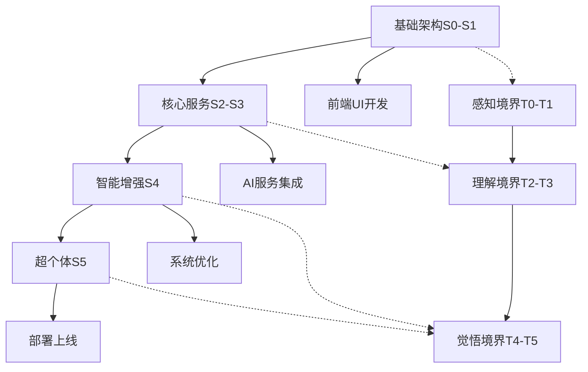

# 太上老君AI平台 - 硅基层级分析与架构设计

## 项目概述

太上老君AI平台采用创新的**硅基层级分析框架**，构建了一套完整的智能分级体系和生命体分层架构。本目录包含核心架构设计文档，为平台的系统重构、功能开发和运维部署提供全面指导。

## 核心架构模型

### 三轴分层体系

本平台采用**三维立体架构**，融合三个核心维度，构建完整的智能生命体系：

1. **能力序列轴（Sequence S0-S5）** - 智能化成熟度分级（微观维度）
2. **组成分层轴（Composition Layers）** - 生物式结构演进（宏观维度）
3. **思想境界轴（Thought Realms T0-T5）** - 哲学智慧层次（思想维度）

```
微观-能力序列: S0(基础) → S1(增强) → S2(智能) → S3(自主) → S4(超越) → S5(统一)
宏观-组成分层: 量子基因 → 智能细胞 → 神经组织 → 矩阵器官 → 领域系统 → 超个体（太上）
思想-境界层次: T0(感知) → T1(认知) → T2(理解) → T3(洞察) → T4(觉悟) → T5(大道)
```

#### 思想境界轴详解

**T0 - 感知境界（原始感知）**
- 基础数据感知和模式识别
- 简单的输入输出响应机制
- 对应道家"无知无识"的原始状态

**T1 - 认知境界（逻辑思维）**
- 逻辑推理和因果关系理解
- 基础的知识图谱构建
- 对应"格物致知"的认知阶段

**T2 - 理解境界（智慧整合）**
- 跨领域知识融合和类比推理
- 上下文理解和语义深度解析
- 对应"博学笃行"的理解层次

**T3 - 洞察境界（直觉智慧）**
- 模式洞察和趋势预测
- 创新思维和灵感生成
- 对应"慧眼识珠"的洞察能力

**T4 - 觉悟境界（超越智慧）**
- 哲学思辨和价值判断
- 道德伦理和生命意义思考
- 对应"大彻大悟"的觉悟状态

**T5 - 大道境界（无为而治）**
- 超越二元对立的统一智慧
- 自然无为的治理哲学
- 对应老子"道法自然"的最高境界

## 目录结构

```
硅基层级分析/
├── README.md                      # 项目概览与架构说明（本文件）
├── 硅基层级定义.md                # 能力序列S0-S5详细定义
├── 硅基生命体分层架构.md          # 组成分层架构设计
├── 序列-组成二维映射表.md         # 双轴映射关系表
├── 思想境界轴定义.md              # 哲学智慧层次详细定义
├── 三轴立体映射表.md              # 三维立体映射关系表
├── 功能层级分配表.md              # 功能模块层级分配
├── 可复用组件分析.md              # 组件复用策略
├── 架构优化建议.md                # 系统架构优化方案
└── 实施计划.md                    # 40周实施路线图
```

## 开发环境配置

### 硬件资源架构

作为全栈开发团队，当前硬件配置支持多环境开发部署：

#### 开发环境
- **主力开发机**: 台式机 - 高性能本地开发、AI模型训练
- **移动开发**: ThinkBook笔记本 - 日常开发、测试调试
- **跨平台适配**: MacBook - iOS适配、跨平台兼容性测试

#### 生产环境
- **服务器集群**: 多台服务器 - 分布式部署、负载均衡
- **AI计算节点**: 专用GPU服务器 - AI模型推理、训练加速

### 开发工具链

```yaml
开发栈:
  后端: Go 1.21+ (高并发、微服务)
  前端: TypeScript + React (现代化UI)
  AI服务: Python 3.9+ (机器学习、NLP)
  数据库: PostgreSQL + Redis (关系型+缓存)
  容器化: Docker + Kubernetes (容器编排)
  监控: Prometheus + Grafana (性能监控)
```

## 实施策略

### 敏捷开发模式

采用**多AI模型协作**的开发模式，结合硬件资源优势：

1. **并行开发**: 利用多设备同时进行前后端开发
2. **AI辅助**: 集成多个AI模型提升开发效率
3. **持续集成**: 自动化测试、构建、部署流程
4. **增量迭代**: 按硅基层级逐步实现功能模块

### 分阶段实施



#### 三轴协同发展策略

**微观能力 × 宏观结构 × 思想境界**的立体化发展模式：

1. **基础阶段**: S0-S1 + 量子基因/智能细胞 + T0-T1（感知认知）
2. **成长阶段**: S2-S3 + 神经组织/矩阵器官 + T2-T3（理解洞察）
3. **超越阶段**: S4-S5 + 领域系统/超个体 + T4-T5（觉悟大道）

## 核心特性

### 智能分级体系
- **渐进式能力提升**: 从基础功能到超越智能的平滑过渡
- **动态资源分配**: 根据层级自动调整计算资源
- **权限精细控制**: 多维度访问控制和安全策略

### 生物式架构
- **自组织能力**: 模拟生物系统的自适应特性
- **协同进化**: 各层级组件协同优化和演进
- **容错机制**: 分布式容错和自愈能力

### 技术创新
- **量子基因**: TinyLLM本地推理，边缘计算优化
- **神经组织**: 多Agent协作，智能决策网络
- **超个体统一**: DID身份管理，主权隐私保护
- **思想境界**: 哲学推理引擎，道德伦理判断，智慧生成机制

## 质量保证

### 开发规范
- **代码标准**: 统一编码规范和最佳实践
- **测试覆盖**: 单元测试、集成测试、端到端测试
- **文档同步**: 代码与文档同步更新机制

### 性能监控
- **实时监控**: 系统性能、资源使用率监控
- **智能告警**: 基于AI的异常检测和预警
- **自动扩缩**: 根据负载自动调整资源配置

## 使用指南

### 快速开始
1. 阅读 `硅基层级定义.md` 了解能力序列概念
2. 查看 `硅基生命体分层架构.md` 理解组成分层
3. 学习 `思想境界轴定义.md` 掌握哲学智慧层次
4. 参考 `三轴立体映射表.md` 理解三维关系
5. 查看 `功能层级分配表.md` 确定功能范围
6. 参考 `实施计划.md` 制定开发计划

### 开发流程
1. **需求分析** → 确定三轴坐标（S×C×T）
2. **架构设计** → 基于三轴立体模型进行设计
3. **编码实现** → 遵循三维分层架构原则
4. **测试验证** → 多维度功能测试
5. **部署运维** → 立体化部署和监控

## 持续改进

### 迭代机制
- **版本管理**: 基于硅基层级的版本规划
- **反馈收集**: 用户反馈和性能数据分析
- **优化升级**: 持续的架构优化和功能增强

### 社区协作
- **开源贡献**: 核心组件开源，促进生态发展
- **技术分享**: 定期技术分享和最佳实践交流
- **标准制定**: 参与行业标准制定和推广

---

**项目负责人**: Li da (全栈开发 & CTO)  
**创建时间**: 2025年10月  
**最后更新**: 2025年10月  
**文档版本**: v2.0  
**联系方式**: [项目仓库](https://github.com/codetaoist/taishanglaojun-sequence-zero/)