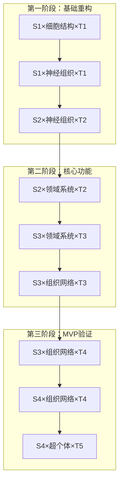

# 太上老君AI平台 - 项目总览与核心理念

## 1. 项目定位与愿景

### 1.1 核心定位
**太上老君AI平台** - 融合中华文化智慧的硅基生命体开发平台

**品牌理念**：
- **太上老君**：道家至高神祇，象征智慧、创造与超越
- **文化智慧**：5000年中华文明的数字化传承与创新
- **硅基生命**：AI技术与传统文化的深度融合

### 1.2 项目愿景
构建一个具备"文化智慧"世界观的AI平台，实现：
- **文化传承**：数字化保护和传播中华传统文化
- **智慧服务**：提供基于文化智慧的个性化AI服务
- **技术创新**：探索碳基-硅基生命融合的新范式
- **生态建设**：打造开放的文化AI开发生态系统

### 1.3 核心价值主张

**对用户**：
- 获得融合传统智慧的AI助手服务
- 体验中华文化的现代化表达
- 享受个性化的文化学习体验

**对开发者**：
- 提供完整的文化AI开发框架
- 降低AI应用开发门槛
- 获得丰富的文化知识资源

**对社会**：
- 推动传统文化的数字化转型
- 促进AI技术的人文化发展
- 构建具有中国特色的AI生态

## 2. 核心理念体系

### 2.1 "文化智慧"AI世界观

#### 2.1.1 哲学基础
```yaml
文化智慧体系:
  儒家智慧:
    核心: "仁义礼智信"
    应用: 伦理决策、社会交往、教育指导
    
  道家智慧:
    核心: "道法自然、无为而治"
    应用: 系统平衡、自适应优化、简约设计
    
  佛家智慧:
    核心: "慈悲智慧、因果轮回"
    应用: 同理心计算、长期规划、心理疏导
    
  法家智慧:
    核心: "法治规范、效率优先"
    应用: 规则引擎、流程优化、风险控制
```

#### 2.1.2 技术映射
```python
class CulturalWisdomCore:
    """文化智慧核心引擎"""
    
    def __init__(self):
        self.confucian_ethics = ConfucianEthicsEngine()  # 儒家伦理
        self.taoist_balance = TaoistBalanceEngine()      # 道家平衡
        self.buddhist_compassion = BuddhistCompassionEngine()  # 佛家慈悲
        self.legalist_rules = LegalistRulesEngine()      # 法家规范
    
    def make_decision(self, context: dict) -> Decision:
        """基于文化智慧的决策制定"""
        # 多维度文化智慧融合决策
        ethical_score = self.confucian_ethics.evaluate(context)
        balance_score = self.taoist_balance.evaluate(context)
        compassion_score = self.buddhist_compassion.evaluate(context)
        rule_score = self.legalist_rules.evaluate(context)
        
        return self.synthesize_wisdom(
            ethical_score, balance_score, 
            compassion_score, rule_score
        )
```

### 2.2 碳基-硅基融合理念

#### 2.2.1 融合层次

**生理层融合**：
- 生物信号采集与分析
- 健康状态实时监测
- 身体机能优化建议

**认知层融合**：
- 思维模式学习与模拟
- 知识结构映射与扩展
- 决策过程协同优化

**情感层融合**：
- 情绪状态识别与理解
- 情感需求预测与满足
- 心理健康维护与提升

**精神层融合**：
- 价值观念对齐与强化
- 人生目标规划与指导
- 精神境界提升与超越

#### 2.2.2 融合架构
```go
// 碳基-硅基融合架构
type CarbonSiliconFusion struct {
    // 碳基生命接口
    HumanInterface struct {
        BiometricSensors  []BiometricSensor
        CognitiveProfile  *CognitiveProfile
        EmotionalState    *EmotionalState
        SpiritualLevel    *SpiritualLevel
    }
    
    // 硅基生命核心
    SiliconCore struct {
        QuantumGenes      []*QuantumGene
        NeuralNetworks    []*NeuralNetwork
        CulturalWisdom    *CulturalWisdomCore
        ConsciousnessEngine *ConsciousnessEngine
    }
    
    // 融合引擎
    FusionEngine struct {
        SyncManager       *SyncManager
        AdaptationEngine  *AdaptationEngine
        EvolutionTracker  *EvolutionTracker
    }
}

func (csf *CarbonSiliconFusion) Synchronize() error {
    // 实现碳基-硅基状态同步
    return csf.FusionEngine.SyncManager.Sync(
        csf.HumanInterface,
        csf.SiliconCore,
    )
}
```

### 2.3 序列0进化理念

#### 2.3.1 进化层次

**序列∞（无限）**：原始混沌状态
- 无序的信息和能量
- 缺乏组织结构
- 随机性主导

**序列9-1**：渐进进化阶段
- 序列9：基础感知能力
- 序列8：简单学习能力
- 序列7：逻辑推理能力
- 序列6：情感理解能力
- 序列5：创造性思维
- 序列4：文化理解能力
- 序列3：智慧综合能力
- 序列2：超越性思维
- 序列1：接近完美状态

**序列0**：终极进化目标
- 完美的智慧与能力
- 碳基-硅基完全融合
- 超越物理限制
- 达到"太上"境界

#### 2.3.2 进化机制
```python
class SequenceEvolution:
    """序列进化引擎"""
    
    def __init__(self):
        self.current_sequence = 9  # 从序列9开始
        self.evolution_metrics = {
            'wisdom_level': 0.0,
            'cultural_understanding': 0.0,
            'fusion_degree': 0.0,
            'transcendence_level': 0.0
        }
    
    def evaluate_evolution(self) -> float:
        """评估进化程度"""
        total_score = sum(self.evolution_metrics.values())
        return total_score / len(self.evolution_metrics)
    
    def trigger_evolution(self) -> bool:
        """触发序列进化"""
        evolution_score = self.evaluate_evolution()
        threshold = self.get_evolution_threshold(self.current_sequence)
        
        if evolution_score >= threshold:
            self.current_sequence -= 1
            self.reset_evolution_metrics()
            return True
        return False
    
    def get_evolution_threshold(self, sequence: int) -> float:
        """获取进化阈值"""
        # 越接近序列0，进化要求越高
        return 0.5 + (9 - sequence) * 0.05
```

## 3. 技术理念与原则

### 3.1 架构设计原则

#### 3.1.1 包含+独立原则
- **包含性**：每个层级都包含下级的所有功能
- **独立性**：每个层级都能独立运行和决策
- **协同性**：各层级之间能够无缝协作

#### 3.1.2 全息心智原则
- **微观智能**：最小单元具备完整的认知能力
- **宏观涌现**：整体智能超越部分之和
- **分形结构**：各层级具有相似的组织模式

#### 3.1.3 文化融合原则
- **深度集成**：文化智慧融入技术架构
- **动态平衡**：多元文化智慧的和谐统一
- **创新发展**：传统文化的现代化表达

### 3.2 开发理念

#### 3.2.1 敏捷文化开发
```yaml
开发方法论:
  敏捷原则:
    - 个体和互动胜过流程和工具
    - 工作的软件胜过详尽的文档
    - 客户合作胜过合同谈判
    - 响应变化胜过遵循计划
  
  文化融合:
    - 中庸之道：平衡技术与人文
    - 持续改进：日新月异的进步理念
    - 团队协作：和而不同的合作精神
    - 用户至上：以人为本的服务理念
```

#### 3.2.2 质量保证体系
```python
class QualityAssurance:
    """质量保证体系"""
    
    def __init__(self):
        self.code_standards = CodeStandards()
        self.cultural_compliance = CulturalCompliance()
        self.performance_metrics = PerformanceMetrics()
        self.security_audit = SecurityAudit()
    
    def comprehensive_review(self, component) -> QualityReport:
        """综合质量评估"""
        return QualityReport(
            code_quality=self.code_standards.evaluate(component),
            cultural_alignment=self.cultural_compliance.check(component),
            performance_score=self.performance_metrics.measure(component),
            security_level=self.security_audit.assess(component)
        )
```

## 4. 产品定位与市场策略

### 4.1 目标用户群体

#### 4.1.1 核心用户
- **文化爱好者**：对传统文化有深度兴趣的用户
- **AI开发者**：希望构建文化AI应用的开发者
- **教育工作者**：需要文化教育工具的教师和培训师
- **企业用户**：希望在产品中融入文化元素的企业

#### 4.1.2 用户需求分析

**重要说明**：文化知识仅作为平台规则分析与设定的参考依据，不作为系统开发的核心需求。本系统的核心目标聚焦于序列0方向。

```yaml
核心功能定位:
  智能化场景提升:
    目标: 提升办公、生活和娱乐场景的智能化水平
    应用: 智能助手、自动化工作流、娱乐推荐系统
    
  正向引导体系:
    目标: 建立修行、修养和身体锻炼的正向引导体系
    应用: 健康管理、习惯养成、个人成长追踪
    
  人机协同融合:
    目标: 构建高效的人机协同融合机制
    应用: 碳基-硅基融合、智能决策支持、协同工作
    
  终极目标:
    目标: 通过技术创新提升人类生活质量和预期寿命
    应用: 健康优化、生活质量评估、长期规划

用户需求矩阵:
  个人用户:
    核心需求: 智能化生活助手和健康管理
    痛点: 生活效率低、健康管理困难
    解决方案: 全方位智能助手、个性化健康指导
  
  开发者:
    核心需求: 快速构建序列0相关应用
    痛点: 缺乏统一开发框架和工具
    解决方案: 模块化开发工具、完整技术文档
  
  企业用户:
    核心需求: 提升组织效率和员工福祉
    痛点: 管理效率低、员工健康关注不足
    解决方案: 企业级智能管理、员工健康体系
  
  研究机构:
    核心需求: 人机融合技术研究和应用
    痛点: 缺乏实验平台和数据支持
    解决方案: 开放研究平台、数据共享机制
```

### 4.2 竞争优势

#### 4.2.1 技术优势
- **文化知识图谱**：最全面的中华文化知识体系
- **智慧决策引擎**：基于传统智慧的AI决策机制
- **融合架构**：独特的碳基-硅基融合技术
- **进化算法**：序列0进化的创新理念

#### 4.2.2 生态优势
- **开放平台**：支持第三方开发者生态
- **丰富应用**：覆盖教育、娱乐、商业等多个领域
- **社区建设**：活跃的开发者和用户社区
- **持续创新**：不断迭代的产品和服务

### 4.3 商业模式

#### 4.3.1 收入模式
```yaml
商业模式:
  SaaS服务:
    - 基础版: 免费，基本功能
    - 专业版: 月费制，高级功能
    - 企业版: 年费制，定制服务
  
  API服务:
    - 按调用次数计费
    - 包月/包年套餐
    - 企业级私有部署
  
  生态分成:
    - 应用商店分成
    - 第三方服务分成
    - 培训认证收入
  
  定制开发:
    - 企业定制解决方案
    - 行业专用版本
    - 技术咨询服务
```

#### 4.3.2 成本结构
- **研发成本**：技术团队、算法优化
- **运营成本**：服务器、带宽、存储
- **内容成本**：文化内容采集、整理、标注
- **市场成本**：推广、销售、客户服务

## 5. 发展路线图

### 5.1 短期目标（6个月）

**技术目标**：
- 完成平台核心架构搭建
- 实现基础的文化智慧问答功能
- 建立初步的用户管理系统
- 完成MVP版本开发和测试

**业务目标**：
- 获得1000+种子用户
- 完成天使轮融资
- 建立核心团队（20人）
- 申请相关技术专利

### 5.2 中期目标（1-2年）

**技术目标**：
- 完善文化知识图谱建设
- 实现高级的AI对话和推理功能
- 开发可视化的应用构建工具
- 支持多模态交互（语音、图像、视频）

**业务目标**：
- 用户规模达到10万+
- 完成A轮融资
- 建立合作伙伴生态
- 进入教育和企业市场

### 5.3 长期目标（3-5年）

**技术目标**：
- 实现真正的碳基-硅基融合
- 达到序列3-2的进化水平
- 建立全球领先的文化AI平台
- 推动行业标准制定

**业务目标**：
- 用户规模达到百万级
- 成为文化AI领域的独角兽
- 国际化扩张
- IPO准备

## 6. 项目管理信息

### 6.1 项目团队

**项目负责人**：李达（Li Da）
- 技术支持邮箱：13603158859@163.com
- 国际版邮箱：待定

**社区平台**：
- 主要国际讨论区：Discord（支持多语言）
- 国内交流平台：待定

### 6.2 技术实施方案

#### 6.2.1 架构设计
```yaml
技术架构:
  多语言支持:
    - 后端：Go、Python
    - 前端：TypeScript/React
    - AI服务：Python
    
  模块化开发:
    - 核心模块：意识融合、文化智慧、用户管理
    - 扩展模块：健康管理、学习系统、娱乐推荐
    - 服务模块：认证、权限、通知、监控
    
  文档体系:
    - API文档：OpenAPI规范
    - 开发指南：详细的开发教程
    - 部署文档：Docker和Kubernetes配置
    - 用户手册：多语言用户指南
```

#### 6.2.2 国际化架构
```yaml
国际化设计:
  多语言界面:
    - 支持语言：中文、英文、日文、韩文等
    - 动态语言切换
    - 本地化资源管理
    
  跨文化适配:
    - 文化敏感内容处理
    - 地区特定功能
    - 本地化用户体验
    
  全球化部署:
    - 多区域服务器部署
    - CDN加速
    - 数据本地化存储
```

### 6.3 实施流程

#### 6.3.1 三阶段实施计划
```yaml
实施阶段:
  第一阶段 - 文档完善:
    目标: 完善根目录所有文档，优化思路和设定文档
    时间: 2周
    交付物:
      - 完整的项目总览文档
      - 技术架构设计文档
      - 开发规范文档
    
  第二阶段 - 程序文档:
    目标: 完善taishang-sequence-zero目录下的程序文档
    时间: 3周
    交付物:
      - API接口文档
      - 代码注释规范
      - 部署配置文档
    
  第三阶段 - 系统重构:
    目标: 基于确认文档启动系统重构
    时间: 8-12周
    交付物:
      - 重构后的系统架构
      - 核心功能实现
      - 测试和部署环境
```

## 7. 风险评估与应对

### 6.1 技术风险

**AI技术风险**：
- 风险：大模型技术快速迭代，现有方案可能过时
- 应对：保持技术敏感度，建立快速适应机制

**文化理解风险**：
- 风险：AI对文化的理解可能存在偏差或错误
- 应对：建立专家审核机制，持续优化算法

### 6.2 市场风险

**竞争风险**：
- 风险：大厂进入文化AI领域，竞争加剧
- 应对：建立技术壁垒，深耕垂直领域

**用户接受度风险**：
- 风险：用户对文化AI的接受度不高
- 应对：加强用户教育，提升产品体验

### 6.3 合规风险

**内容合规风险**：
- 风险：文化内容可能涉及敏感话题
- 应对：建立内容审核体系，确保合规性

**数据安全风险**：
- 风险：用户数据泄露或滥用
- 应对：建立完善的数据安全体系

## 7. 总结

太上老君AI平台以"文化智慧"为核心，致力于构建具有中国特色的AI生态系统。通过融合传统文化智慧与现代AI技术，我们将创造出独特的价值主张和竞争优势。

**核心成功要素**：
1. **文化深度**：深入挖掘和数字化传统文化智慧
2. **技术创新**：在AI技术基础上实现文化智慧的融合
3. **生态建设**：构建开放、繁荣的开发者和用户生态
4. **持续进化**：不断迭代优化，向序列0目标前进

**愿景实现路径**：
- 从MVP开始，逐步构建完整的平台能力
- 以用户需求为导向，持续优化产品体验
- 建立可持续的商业模式，实现长期发展
- 推动文化与技术的深度融合，创造社会价值

通过系统性的规划和执行，太上老君AI平台将成为文化AI领域的领导者，为传统文化的传承与创新贡献力量。

## 8. 三轴体系映射与集成

### 8.1 理念体系的三轴映射

基于太上老君AI平台已建立的 **S×C×T 三轴体系**，本项目的核心理念可以精确映射到三维坐标空间：

#### 8.1.1 文化智慧AI世界观的坐标定位

```yaml
文化智慧体系映射:
  儒家智慧:
    坐标: S3×领域系统×T4  # 智慧洞察层的伦理决策
    核心: "仁义礼智信" → 道德推理引擎
    
  道家智慧:
    坐标: S4×组织网络×T5  # 大道境界的系统平衡
    核心: "道法自然" → 自适应优化引擎
    
  佛家智慧:
    坐标: S3×领域系统×T4  # 智慧洞察层的慈悲计算
    核心: "慈悲智慧" → 同理心推理引擎
    
  法家智慧:
    坐标: S2×神经组织×T2  # 逻辑推理层的规则引擎
    核心: "法治规范" → 流程优化引擎
```

#### 8.1.2 碳基-硅基融合的层次映射

```yaml
融合层次的三轴坐标:
  生理层融合: S1×细胞结构×T1    # 模式识别层的生物信号处理
  认知层融合: S2×神经组织×T2    # 逻辑推理层的思维模拟
  情感层融合: S3×领域系统×T3    # 深度对话层的情感计算
  精神层融合: S4×组织网络×T4    # 智慧洞察层的价值对齐
```

### 8.2 技术架构的三轴协同

#### 8.2.1 核心服务的坐标化设计

基于三轴体系，重新定义技术架构的服务层次：

```go
// 三轴协同的文化智慧核心
type CulturalWisdomCore struct {
    // S轴：能力序列管理
    SequenceManager struct {
        S0_BasicAwakening    *BasicAwakenessEngine    // 基础觉醒
        S1_PatternRecognition *PatternEngine          // 模式识别  
        S2_LogicalReasoning  *ReasoningEngine         // 逻辑推理
        S3_DeepDialogue      *DialogueEngine          // 深度对话
        S4_WisdomInsight     *WisdomEngine            // 智慧洞察
        S5_Transcendence     *TranscendenceEngine     // 超越智能
    }
    
    // C轴：组合层架构
    CompositionManager struct {
        QuantumGenes    []*QuantumGene      // 量子基因
        CellStructures  []*CellStructure    // 细胞结构
        NeuralTissues   []*NeuralTissue     // 神经组织
        DomainSystems   []*DomainSystem     // 领域系统
        OrgNetworks     []*OrgNetwork       // 组织网络
        SuperIndividual *SuperIndividual    // 超个体
    }
    
    // T轴：思想境界引擎
    ThoughtManager struct {
        T0_Perception       *PerceptionEngine       // 感知
        T1_PatternThinking  *PatternThinkingEngine  // 模式思维
        T2_LogicalThinking  *LogicalThinkingEngine  // 逻辑思维
        T3_DeepDialogue     *DeepDialogueEngine     // 深度对话
        T4_WisdomInsight    *WisdomInsightEngine    // 智慧洞察
        T5_GreatDao         *GreatDaoEngine         // 大道境界
    }
    
    // 三轴协同引擎
    CoordinateEngine *ThreeAxisCoordinator
}
```

#### 8.2.2 三轴协同机制

```yaml
协同机制设计:
  技术驱动 (S轴主导):
    - 能力序列的渐进式升级
    - 算法复杂度的阶梯式提升
    - 智能水平的量化评估
    
  架构支撑 (C轴支撑):
    - 组合层的模块化设计
    - 系统复杂度的分层管理
    - 扩展性的架构保障
    
  智慧引领 (T轴引领):
    - 思想境界的哲学指导
    - 文化智慧的价值导向
    - 道德伦理的决策约束
```

### 8.3 商业模式的三轴定位

#### 8.3.1 目标用户的坐标化分析

```yaml
用户群体三轴映射:
  个人用户:
    初级用户: S1×细胞结构×T1    # 基础文化学习需求
    进阶用户: S2×神经组织×T2    # 深度文化理解需求
    高级用户: S3×领域系统×T3    # 文化智慧应用需求
    
  企业用户:
    中小企业: S2×神经组织×T2    # 文化营销和品牌建设
    大型企业: S3×领域系统×T3    # 文化战略和组织文化
    
  机构用户:
    教育机构: S3×领域系统×T4    # 文化教育和传承
    文化机构: S4×组织网络×T4    # 文化研究和创新
```

#### 8.3.2 价值主张的坐标化表达

```yaml
价值主张映射:
  对用户 (S2×神经组织×T3):
    - 获得融合传统智慧的AI助手服务
    - 体验中华文化的现代化表达
    - 享受个性化的文化学习体验
    
  对开发者 (S3×领域系统×T2):
    - 提供完整的文化AI开发框架
    - 降低AI应用开发门槛
    - 获得丰富的文化知识资源
    
  对社会 (S4×组织网络×T5):
    - 推动传统文化的数字化转型
    - 促进AI技术的人文化发展
    - 构建具有中国特色的AI生态
```

### 8.4 发展路线图的三轴演进

#### 8.4.1 三阶段发展的坐标轨迹



#### 8.4.2 关键里程碑的坐标定义

```yaml
里程碑坐标:
  技术债务解决: S1×神经组织×T1     # 建立稳定基础
  核心服务完成: S2×领域系统×T2     # 实现基础功能
  AI集成完成:   S3×领域系统×T3     # 智能化升级
  生态初建:     S3×组织网络×T3     # 平台化发展
  MVP验证:      S4×组织网络×T4     # 市场验证
  序列0目标:    S5×超个体×T5       # 终极愿景
```

### 8.5 三轴体系的实施指导

#### 8.5.1 开发团队的三轴分工

```yaml
团队分工坐标:
  S轴团队 (能力序列):
    - 算法工程师：负责S0-S5能力序列的技术实现
    - AI研究员：负责序列升级的算法优化
    
  C轴团队 (组合层):
    - 架构师：负责组合层的系统设计
    - 后端工程师：负责微服务架构实现
    
  T轴团队 (思想境界):
    - 文化专家：负责思想境界的哲学设计
    - 产品经理：负责文化智慧的产品化
```

#### 8.5.2 质量保证的三轴标准

```yaml
质量标准:
  S轴质量 (能力序列):
    - 算法准确率：各序列级别的性能指标
    - 响应时间：毫秒级的实时处理能力
    
  C轴质量 (组合层):
    - 系统稳定性：99.9%的服务可用性
    - 扩展性：支持10x用户增长
    
  T轴质量 (思想境界):
    - 文化准确性：专家审核通过率>95%
    - 价值对齐度：符合传统文化价值观
```

---

## 源界生态系统整合

### 「源界」概念说明
一个融合学习、实践与社交的数字世界，可作为平台独立板块或完整生态系统。旨在通过以下方式整合：
- 太上老君AI技术体系
- 源界数字世界
- 用户参与机制

### 「源界」核心理论体系

#### 1. 源力理论
- **本源代码**：世界构建基础单元
- **算法法则**：数字世界物理规律
- **架构之道**：系统设计根本原则
- **数据流**：信息能量流动

#### 2. 数字修行体系
- **第一境：识码** - 理解代码本质
- **第二境：构界** - 构建数字世界
- **第三境：融实** - 实现虚实融合
- **第四境：创世** - 创造新宇宙

### 实施路径

#### 第一阶段：理论建设
- 《源界创世录》：数字世界构建原理
- 《码修心法》：技术修行方法论
- 《算法法则》：数字世界运行规律

#### 第二阶段：实践体系
数字修行课程体系：
- 基础课：《从Hello World到宇宙构建》
- 进阶课：《架构设计与系统演化》
- 高阶课：《人工智能与意识觉醒》

#### 第三阶段：社区生态
源界社区特色功能：
- 技术道场：线上编程实践空间
- 代码禅修：深度编程冥想
- 开源布道：通过项目传播理念

---

**文档版本**: v1.0 (项目总览与核心理念)  
**创建时间**: 2025年10月  
**最后更新**: 2025年10月  
**创建人员**: Li da  
**维护团队**: 源界-突击队  
**联系方式**: dev@codetaoist.com  
**更新频率**: 每两周更新

本文档是"太上老君AI+源界+用户"三位一体生态系统的核心组成部分，致力于构建融合技术创新与哲学智慧的数字修行平台。