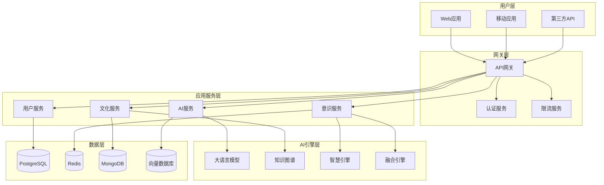

# 太上老君AI平台 - 技术架构与实现方案

## 1. 整体技术架构

### 1.1 架构设计理念

**核心原则**：
- **微服务架构**：高内聚、低耦合的服务设计
- **领域驱动设计（DDD）**：以业务领域为核心的架构模式
- **云原生架构**：容器化、可扩展、高可用
- **文化智慧融合**：技术架构深度集成文化智慧理念

**技术选型策略**：
```yaml
技术栈选择:
  后端架构:
    核心服务: Go (Golang)
    AI服务: Python
    数据库: PostgreSQL + Redis + MongoDB
    消息队列: Apache Kafka
    
  前端架构:
    框架: React + TypeScript
    状态管理: Redux Toolkit
    UI组件: Ant Design + 自定义组件库
    构建工具: Vite
    
  基础设施:
    容器化: Docker + Docker Compose
    编排: Kubernetes
    监控: Prometheus + Grafana
    日志: ELK Stack
```

### 1.2 系统架构图



## 2. 后端架构设计

### 2.1 Go微服务架构

#### 2.1.1 服务划分策略

**核心服务**：
```go
// 用户服务
type UserService struct {
    repo   UserRepository
    auth   AuthService
    cache  CacheService
}

// 文化服务
type CulturalService struct {
    wisdomRepo    WisdomRepository
    knowledgeGraph KnowledgeGraphService
    aiProxy       AIProxyService
}

// 意识服务
type ConsciousnessService struct {
    fusionEngine  FusionEngine
    quantumGenes  QuantumGeneManager
    evolutionTracker EvolutionTracker
}

// AI代理服务
type AIProxyService struct {
    pythonClient  PythonAIClient
    modelManager  ModelManager
    resultCache   ResultCache
}
```

#### 2.1.2 领域驱动设计实现

**聚合根设计**：
```go
// 文化智慧聚合根
type CulturalWisdom struct {
    ID          WisdomID
    Category    WisdomCategory
    Content     WisdomContent
    Source      CulturalSource
    Metadata    WisdomMetadata
    
    // 领域行为
    events []DomainEvent
}

func (cw *CulturalWisdom) ApplyWisdom(context Context) (*WisdomApplication, error) {
    // 应用文化智慧的业务逻辑
    application := &WisdomApplication{
        WisdomID: cw.ID,
        Context:  context,
        Result:   cw.generateWisdomResult(context),
    }
    
    // 发布领域事件
    cw.publishEvent(WisdomAppliedEvent{
        WisdomID: cw.ID,
        Context:  context,
        Timestamp: time.Now(),
    })
    
    return application, nil
}
```

**仓储模式**：
```go
// 文化智慧仓储接口
type WisdomRepository interface {
    Save(wisdom *CulturalWisdom) error
    FindByID(id WisdomID) (*CulturalWisdom, error)
    FindByCategory(category WisdomCategory) ([]*CulturalWisdom, error)
    Search(query WisdomQuery) ([]*CulturalWisdom, error)
}

// PostgreSQL实现
type PostgreSQLWisdomRepository struct {
    db *sql.DB
}

func (r *PostgreSQLWisdomRepository) Save(wisdom *CulturalWisdom) error {
    query := `
        INSERT INTO cultural_wisdom (id, category, content, source, metadata, created_at)
        VALUES ($1, $2, $3, $4, $5, $6)
        ON CONFLICT (id) DO UPDATE SET
            content = EXCLUDED.content,
            metadata = EXCLUDED.metadata,
            updated_at = NOW()
    `
    
    _, err := r.db.Exec(query,
        wisdom.ID,
        wisdom.Category,
        wisdom.Content.ToJSON(),
        wisdom.Source.ToJSON(),
        wisdom.Metadata.ToJSON(),
        time.Now(),
    )
    
    return err
}
```

### 2.2 Python AI服务架构

#### 2.2.1 AI服务设计

**大语言模型服务**：
```python
from abc import ABC, abstractmethod
from typing import Dict, List, Optional
import asyncio

class LLMService(ABC):
    """大语言模型服务抽象基类"""
    
    @abstractmethod
    async def generate_response(
        self, 
        prompt: str, 
        context: Dict,
        cultural_guidance: Optional[Dict] = None
    ) -> str:
        pass
    
    @abstractmethod
    async def embed_text(self, text: str) -> List[float]:
        pass

class CulturalLLMService(LLMService):
    """融合文化智慧的大语言模型服务"""
    
    def __init__(self):
        self.base_model = self._load_base_model()
        self.cultural_adapter = CulturalAdapter()
        self.wisdom_retriever = WisdomRetriever()
    
    async def generate_response(
        self, 
        prompt: str, 
        context: Dict,
        cultural_guidance: Optional[Dict] = None
    ) -> str:
        # 1. 检索相关文化智慧
        relevant_wisdom = await self.wisdom_retriever.retrieve(
            query=prompt,
            context=context
        )
        
        # 2. 构建文化增强的提示
        enhanced_prompt = self.cultural_adapter.enhance_prompt(
            original_prompt=prompt,
            wisdom=relevant_wisdom,
            guidance=cultural_guidance
        )
        
        # 3. 生成响应
        response = await self.base_model.generate(
            prompt=enhanced_prompt,
            max_tokens=2048,
            temperature=0.7
        )
        
        # 4. 文化智慧后处理
        final_response = self.cultural_adapter.post_process(
            response=response,
            wisdom=relevant_wisdom
        )
        
        return final_response
```

**知识图谱服务**：
```python
import networkx as nx
from neo4j import GraphDatabase
from typing import List, Dict, Tuple

class CulturalKnowledgeGraph:
    """文化知识图谱服务"""
    
    def __init__(self, neo4j_uri: str, username: str, password: str):
        self.driver = GraphDatabase.driver(neo4j_uri, auth=(username, password))
        self.graph = nx.MultiDiGraph()
    
    def add_cultural_entity(
        self, 
        entity_id: str, 
        entity_type: str, 
        properties: Dict
    ):
        """添加文化实体"""
        with self.driver.session() as session:
            session.run(
                """
                MERGE (e:CulturalEntity {id: $entity_id})
                SET e.type = $entity_type,
                    e.properties = $properties,
                    e.updated_at = datetime()
                """,
                entity_id=entity_id,
                entity_type=entity_type,
                properties=properties
            )
    
    def add_cultural_relation(
        self, 
        from_entity: str, 
        to_entity: str, 
        relation_type: str,
        properties: Dict = None
    ):
        """添加文化关系"""
        with self.driver.session() as session:
            session.run(
                """
                MATCH (a:CulturalEntity {id: $from_entity})
                MATCH (b:CulturalEntity {id: $to_entity})
                MERGE (a)-[r:CULTURAL_RELATION {type: $relation_type}]->(b)
                SET r.properties = $properties,
                    r.created_at = datetime()
                """,
                from_entity=from_entity,
                to_entity=to_entity,
                relation_type=relation_type,
                properties=properties or {}
            )
    
    def find_wisdom_path(
        self, 
        start_concept: str, 
        end_concept: str,
        max_depth: int = 5
    ) -> List[Dict]:
        """查找智慧路径"""
        with self.driver.session() as session:
            result = session.run(
                """
                MATCH path = shortestPath(
                    (start:CulturalEntity {id: $start_concept})-
                    [*1..$max_depth]-
                    (end:CulturalEntity {id: $end_concept})
                )
                RETURN path, length(path) as path_length
                ORDER BY path_length
                LIMIT 10
                """,
                start_concept=start_concept,
                end_concept=end_concept,
                max_depth=max_depth
            )
            
            paths = []
            for record in result:
                path_data = self._extract_path_data(record['path'])
                paths.append({
                    'path': path_data,
                    'length': record['path_length'],
                    'wisdom_score': self._calculate_wisdom_score(path_data)
                })
            
            return paths
```

#### 2.2.2 AI模型管理

**模型版本管理**：
```python
from dataclasses import dataclass
from enum import Enum
from typing import Optional
import mlflow

class ModelStatus(Enum):
    TRAINING = "training"
    READY = "ready"
    DEPRECATED = "deprecated"
    FAILED = "failed"

@dataclass
class ModelVersion:
    model_id: str
    version: str
    status: ModelStatus
    performance_metrics: Dict
    cultural_alignment_score: float
    created_at: str
    model_path: str

class CulturalModelManager:
    """文化AI模型管理器"""
    
    def __init__(self, mlflow_tracking_uri: str):
        mlflow.set_tracking_uri(mlflow_tracking_uri)
        self.models = {}
        self.active_models = {}
    
    def register_model(
        self, 
        model_name: str, 
        model_version: str,
        model_path: str,
        performance_metrics: Dict,
        cultural_alignment_score: float
    ) -> ModelVersion:
        """注册新模型版本"""
        
        # 注册到MLflow
        with mlflow.start_run():
            mlflow.log_metrics(performance_metrics)
            mlflow.log_metric("cultural_alignment_score", cultural_alignment_score)
            mlflow.log_artifact(model_path)
            
            model_uri = mlflow.get_artifact_uri("model")
            mlflow.register_model(model_uri, model_name)
        
        # 创建模型版本记录
        model_version_obj = ModelVersion(
            model_id=f"{model_name}:{model_version}",
            version=model_version,
            status=ModelStatus.READY,
            performance_metrics=performance_metrics,
            cultural_alignment_score=cultural_alignment_score,
            created_at=datetime.now().isoformat(),
            model_path=model_path
        )
        
        self.models[model_version_obj.model_id] = model_version_obj
        
        # 如果文化对齐分数足够高，设为活跃模型
        if cultural_alignment_score > 0.8:
            self.active_models[model_name] = model_version_obj
        
        return model_version_obj
    
    def get_best_model(self, model_name: str) -> Optional[ModelVersion]:
        """获取最佳模型版本"""
        if model_name in self.active_models:
            return self.active_models[model_name]
        
        # 如果没有活跃模型，选择文化对齐分数最高的
        best_model = None
        best_score = 0.0
        
        for model in self.models.values():
            if (model.model_id.startswith(model_name) and 
                model.status == ModelStatus.READY and
                model.cultural_alignment_score > best_score):
                best_model = model
                best_score = model.cultural_alignment_score
        
        return best_model
```

### 2.3 Go-Python服务通信

#### 2.3.1 gRPC通信协议

**Protocol Buffers定义**：
```protobuf
// cultural_ai.proto
syntax = "proto3";

package cultural_ai;

option go_package = "./pb";

// 文化智慧请求
message WisdomRequest {
    string query = 1;
    map<string, string> context = 2;
    CulturalGuidance guidance = 3;
}

// 文化指导
message CulturalGuidance {
    repeated string preferred_schools = 1;  // 偏好的文化流派
    string tone = 2;                        // 回答语调
    int32 depth_level = 3;                  // 深度等级
}

// 智慧响应
message WisdomResponse {
    string content = 1;
    repeated WisdomSource sources = 2;
    float confidence_score = 3;
    float cultural_alignment_score = 4;
}

// 智慧来源
message WisdomSource {
    string source_id = 1;
    string source_name = 2;
    string category = 3;
    float relevance_score = 4;
}

// 文化AI服务
service CulturalAIService {
    rpc GenerateWisdom(WisdomRequest) returns (WisdomResponse);
    rpc SearchKnowledge(KnowledgeSearchRequest) returns (KnowledgeSearchResponse);
    rpc AnalyzeCulturalAlignment(AlignmentRequest) returns (AlignmentResponse);
}
```

**Go客户端实现**：
```go
package client

import (
    "context"
    "time"
    
    "google.golang.org/grpc"
    "google.golang.org/grpc/credentials/insecure"
    
    pb "taishanglaojun/pb"
)

type CulturalAIClient struct {
    conn   *grpc.ClientConn
    client pb.CulturalAIServiceClient
}

func NewCulturalAIClient(address string) (*CulturalAIClient, error) {
    conn, err := grpc.Dial(address, grpc.WithTransportCredentials(insecure.NewCredentials()))
    if err != nil {
        return nil, err
    }
    
    client := pb.NewCulturalAIServiceClient(conn)
    
    return &CulturalAIClient{
        conn:   conn,
        client: client,
    }, nil
}

func (c *CulturalAIClient) GenerateWisdom(
    ctx context.Context,
    query string,
    contextData map[string]string,
    guidance *pb.CulturalGuidance,
) (*pb.WisdomResponse, error) {
    
    ctx, cancel := context.WithTimeout(ctx, 30*time.Second)
    defer cancel()
    
    request := &pb.WisdomRequest{
        Query:    query,
        Context:  contextData,
        Guidance: guidance,
    }
    
    response, err := c.client.GenerateWisdom(ctx, request)
    if err != nil {
        return nil, err
    }
    
    return response, nil
}

func (c *CulturalAIClient) Close() error {
    return c.conn.Close()
}
```

**Python服务端实现**：
```python
import grpc
from concurrent import futures
import cultural_ai_pb2_grpc
import cultural_ai_pb2

class CulturalAIServiceImpl(cultural_ai_pb2_grpc.CulturalAIServiceServicer):
    """文化AI服务实现"""
    
    def __init__(self):
        self.llm_service = CulturalLLMService()
        self.knowledge_graph = CulturalKnowledgeGraph()
        self.wisdom_analyzer = WisdomAnalyzer()
    
    async def GenerateWisdom(self, request, context):
        """生成文化智慧"""
        try:
            # 转换请求参数
            query = request.query
            context_dict = dict(request.context)
            guidance = self._convert_guidance(request.guidance)
            
            # 生成智慧响应
            wisdom_content = await self.llm_service.generate_response(
                prompt=query,
                context=context_dict,
                cultural_guidance=guidance
            )
            
            # 分析文化对齐度
            alignment_score = await self.wisdom_analyzer.analyze_alignment(
                content=wisdom_content,
                query=query
            )
            
            # 查找相关来源
            sources = await self.knowledge_graph.find_relevant_sources(
                query=query,
                content=wisdom_content
            )
            
            # 构建响应
            response = cultural_ai_pb2.WisdomResponse(
                content=wisdom_content,
                sources=[
                    cultural_ai_pb2.WisdomSource(
                        source_id=source['id'],
                        source_name=source['name'],
                        category=source['category'],
                        relevance_score=source['relevance']
                    ) for source in sources
                ],
                confidence_score=0.85,  # 计算置信度
                cultural_alignment_score=alignment_score
            )
            
            return response
            
        except Exception as e:
            context.set_code(grpc.StatusCode.INTERNAL)
            context.set_details(f"Internal error: {str(e)}")
            return cultural_ai_pb2.WisdomResponse()
    
    def _convert_guidance(self, guidance):
        """转换文化指导参数"""
        return {
            'preferred_schools': list(guidance.preferred_schools),
            'tone': guidance.tone,
            'depth_level': guidance.depth_level
        }

def serve():
    server = grpc.aio.server(futures.ThreadPoolExecutor(max_workers=10))
    cultural_ai_pb2_grpc.add_CulturalAIServiceServicer_to_server(
        CulturalAIServiceImpl(), server
    )
    
    listen_addr = '[::]:50051'
    server.add_insecure_port(listen_addr)
    
    print(f"Starting Cultural AI service on {listen_addr}")
    await server.start()
    await server.wait_for_termination()

if __name__ == '__main__':
    import asyncio
    asyncio.run(serve())
```

## 3. 前端架构设计

### 3.1 React + TypeScript架构

#### 3.1.1 项目结构设计

```
frontend/
├── src/
│   ├── components/          # 通用组件
│   │   ├── common/         # 基础组件
│   │   ├── cultural/       # 文化相关组件
│   │   └── ai/            # AI交互组件
│   ├── pages/              # 页面组件
│   │   ├── Dashboard/      # 仪表板
│   │   ├── Cultural/       # 文化模块
│   │   ├── Consciousness/  # 意识模块
│   │   └── Admin/         # 管理模块
│   ├── store/              # 状态管理
│   │   ├── slices/        # Redux切片
│   │   ├── api/           # API切片
│   │   └── middleware/    # 中间件
│   ├── services/           # 服务层
│   │   ├── api/           # API服务
│   │   ├── cultural/      # 文化服务
│   │   └── consciousness/ # 意识服务
│   ├── types/              # 类型定义
│   ├── utils/              # 工具函数
│   ├── hooks/              # 自定义Hook
│   └── styles/             # 样式文件
├── public/
└── package.json
```

#### 3.1.2 状态管理架构

**统一的Slice结构**：
```typescript
// types/common.ts
export interface BaseState {
  loading: boolean;
  error: string | null;
  lastUpdated: string | null;
}

export interface AsyncThunkState<T> extends BaseState {
  data: T | null;
}

// store/slices/baseSlice.ts
import { createSlice, createAsyncThunk, PayloadAction } from '@reduxjs/toolkit';

export interface BaseSliceState<T = any> {
  loading: boolean;
  error: string | null;
  data: T | null;
  lastUpdated: string | null;
}

export const createBaseSlice = <T>(
  name: string,
  initialData: T | null = null
) => {
  const initialState: BaseSliceState<T> = {
    loading: false,
    error: null,
    data: initialData,
    lastUpdated: null,
  };

  return createSlice({
    name,
    initialState,
    reducers: {
      setLoading: (state, action: PayloadAction<boolean>) => {
        state.loading = action.payload;
      },
      setError: (state, action: PayloadAction<string | null>) => {
        state.error = action.payload;
        state.loading = false;
      },
      clearError: (state) => {
        state.error = null;
      },
      setData: (state, action: PayloadAction<T>) => {
        state.data = action.payload;
        state.lastUpdated = new Date().toISOString();
        state.loading = false;
        state.error = null;
      },
    },
  });
};

// 标准化异步Thunk创建
export const createStandardAsyncThunk = <TReturned, TArg = void>(
  typePrefix: string,
  payloadCreator: (arg: TArg) => Promise<TReturned>
) => {
  return createAsyncThunk<TReturned, TArg, { rejectValue: string }>(
    typePrefix,
    async (arg, { rejectWithValue }) => {
      try {
        return await payloadCreator(arg);
      } catch (error) {
        const message = error instanceof Error ? error.message : 'Unknown error';
        return rejectWithValue(message);
      }
    }
  );
};
```

**文化智慧Slice示例**：
```typescript
// store/slices/culturalSlice.ts
import { createSlice, PayloadAction } from '@reduxjs/toolkit';
import { createStandardAsyncThunk } from './baseSlice';
import { culturalService } from '../../services/cultural/culturalService';

// 类型定义
export interface WisdomItem {
  id: string;
  title: string;
  content: string;
  category: string;
  source: string;
  tags: string[];
  createdAt: string;
}

export interface CulturalState {
  wisdomItems: WisdomItem[];
  currentWisdom: WisdomItem | null;
  categories: string[];
  searchResults: WisdomItem[];
  loading: boolean;
  error: string | null;
}

const initialState: CulturalState = {
  wisdomItems: [],
  currentWisdom: null,
  categories: [],
  searchResults: [],
  loading: false,
  error: null,
};

// 异步Thunk
export const fetchWisdomItems = createStandardAsyncThunk(
  'cultural/fetchWisdomItems',
  async (params: { category?: string; limit?: number }) => {
    return await culturalService.getWisdomItems(params);
  }
);

export const searchWisdom = createStandardAsyncThunk(
  'cultural/searchWisdom',
  async (query: string) => {
    return await culturalService.searchWisdom(query);
  }
);

export const generateWisdom = createStandardAsyncThunk(
  'cultural/generateWisdom',
  async (request: { query: string; context?: Record<string, any> }) => {
    return await culturalService.generateWisdom(request.query, request.context);
  }
);

// Slice定义
const culturalSlice = createSlice({
  name: 'cultural',
  initialState,
  reducers: {
    setCurrentWisdom: (state, action: PayloadAction<WisdomItem | null>) => {
      state.currentWisdom = action.payload;
    },
    clearSearchResults: (state) => {
      state.searchResults = [];
    },
    clearError: (state) => {
      state.error = null;
    },
  },
  extraReducers: (builder) => {
    // fetchWisdomItems
    builder
      .addCase(fetchWisdomItems.pending, (state) => {
        state.loading = true;
        state.error = null;
      })
      .addCase(fetchWisdomItems.fulfilled, (state, action) => {
        state.loading = false;
        state.wisdomItems = action.payload;
      })
      .addCase(fetchWisdomItems.rejected, (state, action) => {
        state.loading = false;
        state.error = action.payload || 'Failed to fetch wisdom items';
      })
      
    // searchWisdom
      .addCase(searchWisdom.pending, (state) => {
        state.loading = true;
      })
      .addCase(searchWisdom.fulfilled, (state, action) => {
        state.loading = false;
        state.searchResults = action.payload;
      })
      .addCase(searchWisdom.rejected, (state, action) => {
        state.loading = false;
        state.error = action.payload || 'Search failed';
      })
      
    // generateWisdom
      .addCase(generateWisdom.pending, (state) => {
        state.loading = true;
      })
      .addCase(generateWisdom.fulfilled, (state, action) => {
        state.loading = false;
        // 将生成的智慧添加到列表中
        state.wisdomItems.unshift(action.payload);
        state.currentWisdom = action.payload;
      })
      .addCase(generateWisdom.rejected, (state, action) => {
        state.loading = false;
        state.error = action.payload || 'Failed to generate wisdom';
      });
  },
});

export const { setCurrentWisdom, clearSearchResults, clearError } = culturalSlice.actions;

// Selectors
export const selectCultural = (state: { cultural: CulturalState }) => state.cultural;
export const selectWisdomItems = (state: { cultural: CulturalState }) => state.cultural.wisdomItems;
export const selectCurrentWisdom = (state: { cultural: CulturalState }) => state.cultural.currentWisdom;
export const selectSearchResults = (state: { cultural: CulturalState }) => state.cultural.searchResults;
export const selectCulturalLoading = (state: { cultural: CulturalState }) => state.cultural.loading;
export const selectCulturalError = (state: { cultural: CulturalState }) => state.cultural.error;

export default culturalSlice.reducer;
```

#### 3.1.3 组件架构设计

**基础组件系统**：
```typescript
// components/common/BaseComponent.tsx
import React from 'react';
import { Spin, Alert } from 'antd';
import './BaseComponent.scss';

export interface BaseComponentProps {
  loading?: boolean;
  error?: string | null;
  className?: string;
  children?: React.ReactNode;
}

export const BaseComponent: React.FC<BaseComponentProps> = ({
  loading = false,
  error = null,
  className = '',
  children,
}) => {
  return (
    <div className={`base-component ${className}`}>
      {loading && (
        <div className="loading-overlay">
          <Spin size="large" tip="加载中..." />
        </div>
      )}
      
      {error && (
        <Alert
          message="错误"
          description={error}
          type="error"
          closable
          className="error-alert"
        />
      )}
      
      <div className={`content ${loading ? 'loading' : ''}`}>
        {children}
      </div>
    </div>
  );
};

// 高阶组件：错误边界
export class ErrorBoundary extends React.Component<
  { children: React.ReactNode },
  { hasError: boolean; error?: Error }
> {
  constructor(props: { children: React.ReactNode }) {
    super(props);
    this.state = { hasError: false };
  }

  static getDerivedStateFromError(error: Error) {
    return { hasError: true, error };
  }

  componentDidCatch(error: Error, errorInfo: React.ErrorInfo) {
    console.error('Error caught by boundary:', error, errorInfo);
  }

  render() {
    if (this.state.hasError) {
      return (
        <Alert
          message="组件错误"
          description={this.state.error?.message || '未知错误'}
          type="error"
          showIcon
        />
      );
    }

    return this.props.children;
  }
}
```

**文化智慧组件**：
```typescript
// components/cultural/WisdomChat.tsx
import React, { useState, useCallback } from 'react';
import { useDispatch, useSelector } from 'react-redux';
import { Input, Button, Card, Typography, Tag } from 'antd';
import { SendOutlined, BookOutlined } from '@ant-design/icons';
import { BaseComponent } from '../common/BaseComponent';
import { generateWisdom, selectCulturalLoading, selectCulturalError } from '../../store/slices/culturalSlice';
import type { AppDispatch } from '../../store';
import './WisdomChat.scss';

const { TextArea } = Input;
const { Title, Paragraph } = Typography;

interface WisdomChatProps {
  className?: string;
}

export const WisdomChat: React.FC<WisdomChatProps> = ({ className }) => {
  const dispatch = useDispatch<AppDispatch>();
  const loading = useSelector(selectCulturalLoading);
  const error = useSelector(selectCulturalError);
  
  const [query, setQuery] = useState('');
  const [conversation, setConversation] = useState<Array<{
    type: 'user' | 'wisdom';
    content: string;
    timestamp: string;
    sources?: Array<{ name: string; category: string }>;
  }>>([]);

  const handleSubmit = useCallback(async () => {
    if (!query.trim()) return;
    
    const userMessage = {
      type: 'user' as const,
      content: query,
      timestamp: new Date().toISOString(),
    };
    
    setConversation(prev => [...prev, userMessage]);
    setQuery('');
    
    try {
      const result = await dispatch(generateWisdom({ 
        query,
        context: { conversationHistory: conversation }
      })).unwrap();
      
      const wisdomMessage = {
        type: 'wisdom' as const,
        content: result.content,
        timestamp: new Date().toISOString(),
        sources: result.sources,
      };
      
      setConversation(prev => [...prev, wisdomMessage]);
    } catch (err) {
      console.error('Failed to generate wisdom:', err);
    }
  }, [query, conversation, dispatch]);

  return (
    <BaseComponent loading={loading} error={error} className={`wisdom-chat ${className}`}>
      <div className="chat-container">
        <div className="chat-header">
          <Title level={3}>
            <BookOutlined /> 文化智慧对话
          </Title>
        </div>
        
        <div className="conversation-area">
          {conversation.map((message, index) => (
            <Card
              key={index}
              className={`message-card ${message.type}`}
              size="small"
            >
              <div className="message-header">
                <span className="message-type">
                  {message.type === 'user' ? '您' : '太上老君'}
                </span>
                <span className="message-time">
                  {new Date(message.timestamp).toLocaleTimeString()}
                </span>
              </div>
              
              <Paragraph className="message-content">
                {message.content}
              </Paragraph>
              
              {message.sources && message.sources.length > 0 && (
                <div className="message-sources">
                  <span>智慧来源：</span>
                  {message.sources.map((source, idx) => (
                    <Tag key={idx} color="blue">
                      {source.name} ({source.category})
                    </Tag>
                  ))}
                </div>
              )}
            </Card>
          ))}
        </div>
        
        <div className="input-area">
          <TextArea
            value={query}
            onChange={(e) => setQuery(e.target.value)}
            placeholder="请输入您的问题，太上老君将为您提供文化智慧指导..."
            rows={3}
            onPressEnter={(e) => {
              if (e.ctrlKey || e.metaKey) {
                handleSubmit();
              }
            }}
          />
          <Button
            type="primary"
            icon={<SendOutlined />}
            onClick={handleSubmit}
            disabled={!query.trim() || loading}
            className="send-button"
          >
            发送 (Ctrl+Enter)
          </Button>
        </div>
      </div>
    </BaseComponent>
  );
};
```

### 3.2 API服务层设计

#### 3.2.1 统一API客户端

```typescript
// services/api/apiClient.ts
import axios, { AxiosInstance, AxiosRequestConfig, AxiosResponse } from 'axios';

export interface ApiResponse<T = any> {
  success: boolean;
  data: T;
  message?: string;
  code?: string;
}

export interface ApiError {
  message: string;
  code?: string;
  details?: any;
}

class ApiClient {
  private instance: AxiosInstance;
  
  constructor(baseURL: string) {
    this.instance = axios.create({
      baseURL,
      timeout: 30000,
      headers: {
        'Content-Type': 'application/json',
      },
    });
    
    this.setupInterceptors();
  }
  
  private setupInterceptors() {
    // 请求拦截器
    this.instance.interceptors.request.use(
      (config) => {
        // 添加认证token
        const token = localStorage.getItem('auth_token');
        if (token) {
          config.headers.Authorization = `Bearer ${token}`;
        }
        
        // 添加请求ID用于追踪
        config.headers['X-Request-ID'] = this.generateRequestId();
        
        return config;
      },
      (error) => {
        return Promise.reject(error);
      }
    );
    
    // 响应拦截器
    this.instance.interceptors.response.use(
      (response: AxiosResponse<ApiResponse>) => {
        // 统一处理成功响应
        if (response.data.success) {
          return response;
        } else {
          // 业务错误
          throw new Error(response.data.message || 'Business error');
        }
      },
      (error) => {
        // 处理HTTP错误
        if (error.response) {
          const { status, data } = error.response;
          
          switch (status) {
            case 401:
              // 未授权，清除token并跳转登录
              localStorage.removeItem('auth_token');
              window.location.href = '/login';
              break;
            case 403:
              throw new Error('权限不足');
            case 404:
              throw new Error('请求的资源不存在');
            case 500:
              throw new Error('服务器内部错误');
            default:
              throw new Error(data?.message || `HTTP Error: ${status}`);
          }
        } else if (error.request) {
          throw new Error('网络连接失败');
        } else {
          throw new Error(error.message);
        }
      }
    );
  }
  
  private generateRequestId(): string {
    return `req_${Date.now()}_${Math.random().toString(36).substr(2, 9)}`;
  }
  
  async get<T>(url: string, config?: AxiosRequestConfig): Promise<T> {
    const response = await this.instance.get<ApiResponse<T>>(url, config);
    return response.data.data;
  }
  
  async post<T>(url: string, data?: any, config?: AxiosRequestConfig): Promise<T> {
    const response = await this.instance.post<ApiResponse<T>>(url, data, config);
    return response.data.data;
  }
  
  async put<T>(url: string, data?: any, config?: AxiosRequestConfig): Promise<T> {
    const response = await this.instance.put<ApiResponse<T>>(url, data, config);
    return response.data.data;
  }
  
  async delete<T>(url: string, config?: AxiosRequestConfig): Promise<T> {
    const response = await this.instance.delete<ApiResponse<T>>(url, config);
    return response.data.data;
  }
}

// 创建API客户端实例
export const apiClient = new ApiClient(process.env.REACT_APP_API_BASE_URL || 'http://localhost:8080/api');
```

#### 3.2.2 文化服务API

```typescript
// services/cultural/culturalService.ts
import { apiClient } from '../api/apiClient';
import type { WisdomItem } from '../../store/slices/culturalSlice';

export interface WisdomGenerationRequest {
  query: string;
  context?: Record<string, any>;
  guidance?: {
    preferredSchools?: string[];
    tone?: string;
    depthLevel?: number;
  };
}

export interface WisdomGenerationResponse {
  id: string;
  title: string;
  content: string;
  category: string;
  source: string;
  tags: string[];
  sources: Array<{
    id: string;
    name: string;
    category: string;
    relevance: number;
  }>;
  confidenceScore: number;
  culturalAlignmentScore: number;
  createdAt: string;
}

export interface WisdomSearchParams {
  query?: string;
  category?: string;
  tags?: string[];
  limit?: number;
  offset?: number;
}

class CulturalService {
  private readonly basePath = '/cultural';
  
  async getWisdomItems(params: WisdomSearchParams = {}): Promise<WisdomItem[]> {
    const queryParams = new URLSearchParams();
    
    if (params.query) queryParams.append('query', params.query);
    if (params.category) queryParams.append('category', params.category);
    if (params.tags) params.tags.forEach(tag => queryParams.append('tags', tag));
    if (params.limit) queryParams.append('limit', params.limit.toString());
    if (params.offset) queryParams.append('offset', params.offset.toString());
    
    const url = `${this.basePath}/wisdom?${queryParams.toString()}`;
    return await apiClient.get<WisdomItem[]>(url);
  }
  
  async getWisdomById(id: string): Promise<WisdomItem> {
    return await apiClient.get<WisdomItem>(`${this.basePath}/wisdom/${id}`);
  }
  
  async searchWisdom(query: string): Promise<WisdomItem[]> {
    return await apiClient.post<WisdomItem[]>(`${this.basePath}/wisdom/search`, {
      query,
      limit: 20,
    });
  }
  
  async generateWisdom(
    query: string, 
    context?: Record<string, any>
  ): Promise<WisdomGenerationResponse> {
    const request: WisdomGenerationRequest = {
      query,
      context,
      guidance: {
        preferredSchools: ['儒家', '道家', '佛家'],
        tone: 'wise',
        depthLevel: 3,
      },
    };
    
    return await apiClient.post<WisdomGenerationResponse>(
      `${this.basePath}/wisdom/generate`,
      request
    );
  }
  
  async getCategories(): Promise<string[]> {
    return await apiClient.get<string[]>(`${this.basePath}/categories`);
  }
  
  async getPopularTags(): Promise<Array<{ tag: string; count: number }>> {
    return await apiClient.get<Array<{ tag: string; count: number }>>(
      `${this.basePath}/tags/popular`
    );
  }
  
  async rateWisdom(wisdomId: string, rating: number): Promise<void> {
    await apiClient.post(`${this.basePath}/wisdom/${wisdomId}/rate`, {
      rating,
    });
  }
  
  async bookmarkWisdom(wisdomId: string): Promise<void> {
    await apiClient.post(`${this.basePath}/wisdom/${wisdomId}/bookmark`);
  }
  
  async removeBookmark(wisdomId: string): Promise<void> {
    await apiClient.delete(`${this.basePath}/wisdom/${wisdomId}/bookmark`);
  }
}

export const culturalService = new CulturalService();
```

## 4. 数据库设计

### 4.1 PostgreSQL主数据库

#### 4.1.1 核心表结构

```sql
-- 用户表
CREATE TABLE users (
    id UUID PRIMARY KEY DEFAULT gen_random_uuid(),
    username VARCHAR(50) UNIQUE NOT NULL,
    email VARCHAR(255) UNIQUE NOT NULL,
    password_hash VARCHAR(255) NOT NULL,
    full_name VARCHAR(100),
    avatar_url TEXT,
    cultural_preferences JSONB,
    consciousness_level INTEGER DEFAULT 9,
    evolution_score DECIMAL(5,2) DEFAULT 0.00,
    created_at TIMESTAMP WITH TIME ZONE DEFAULT NOW(),
    updated_at TIMESTAMP WITH TIME ZONE DEFAULT NOW(),
    last_login_at TIMESTAMP WITH TIME ZONE
);

-- 文化智慧表
CREATE TABLE cultural_wisdom (
    id UUID PRIMARY KEY DEFAULT gen_random_uuid(),
    title VARCHAR(255) NOT NULL,
    content TEXT NOT NULL,
    category VARCHAR(50) NOT NULL,
    subcategory VARCHAR(50),
    source VARCHAR(100) NOT NULL,
    original_text TEXT,
    translation TEXT,
    interpretation TEXT,
    tags TEXT[] DEFAULT '{}',
    metadata JSONB DEFAULT '{}',
    cultural_school VARCHAR(50), -- 儒家、道家、佛家、法家等
    wisdom_level INTEGER DEFAULT 1, -- 智慧深度等级
    relevance_score DECIMAL(3,2) DEFAULT 0.00,
    created_at TIMESTAMP WITH TIME ZONE DEFAULT NOW(),
    updated_at TIMESTAMP WITH TIME ZONE DEFAULT NOW()
);

-- 意识状态表
CREATE TABLE consciousness_states (
    id UUID PRIMARY KEY DEFAULT gen_random_uuid(),
    user_id UUID REFERENCES users(id) ON DELETE CASCADE,
    sequence_level INTEGER NOT NULL, -- 序列等级
    state_data JSONB NOT NULL, -- 意识状态数据
    quantum_genes JSONB DEFAULT '{}', -- 量子基因数据
    fusion_degree DECIMAL(5,2) DEFAULT 0.00, -- 融合程度
    evolution_metrics JSONB DEFAULT '{}',
    created_at TIMESTAMP WITH TIME ZONE DEFAULT NOW(),
    updated_at TIMESTAMP WITH TIME ZONE DEFAULT NOW()
);

-- 智慧对话记录表
CREATE TABLE wisdom_conversations (
    id UUID PRIMARY KEY DEFAULT gen_random_uuid(),
    user_id UUID REFERENCES users(id) ON DELETE CASCADE,
    session_id UUID NOT NULL,
    query TEXT NOT NULL,
    response TEXT NOT NULL,
    wisdom_sources UUID[] DEFAULT '{}', -- 引用的智慧来源ID
    cultural_alignment_score DECIMAL(3,2),
    confidence_score DECIMAL(3,2),
    user_rating INTEGER CHECK (user_rating >= 1 AND user_rating <= 5),
    metadata JSONB DEFAULT '{}',
    created_at TIMESTAMP WITH TIME ZONE DEFAULT NOW()
);

-- 用户进化记录表
CREATE TABLE evolution_records (
    id UUID PRIMARY KEY DEFAULT gen_random_uuid(),
    user_id UUID REFERENCES users(id) ON DELETE CASCADE,
    from_sequence INTEGER NOT NULL,
    to_sequence INTEGER NOT NULL,
    trigger_event VARCHAR(100) NOT NULL,
    evolution_data JSONB DEFAULT '{}',
    achievement_unlocked TEXT[],
    created_at TIMESTAMP WITH TIME ZONE DEFAULT NOW()
);

-- 创建索引
CREATE INDEX idx_cultural_wisdom_category ON cultural_wisdom(category);
CREATE INDEX idx_cultural_wisdom_tags ON cultural_wisdom USING GIN(tags);
CREATE INDEX idx_cultural_wisdom_school ON cultural_wisdom(cultural_school);
CREATE INDEX idx_cultural_wisdom_content_search ON cultural_wisdom USING GIN(to_tsvector('chinese', content));

CREATE INDEX idx_consciousness_states_user_id ON consciousness_states(user_id);
CREATE INDEX idx_consciousness_states_sequence ON consciousness_states(sequence_level);

CREATE INDEX idx_wisdom_conversations_user_id ON wisdom_conversations(user_id);
CREATE INDEX idx_wisdom_conversations_session ON wisdom_conversations(session_id);
CREATE INDEX idx_wisdom_conversations_created_at ON wisdom_conversations(created_at);

CREATE INDEX idx_evolution_records_user_id ON evolution_records(user_id);
CREATE INDEX idx_evolution_records_sequence ON evolution_records(from_sequence, to_sequence);
```

### 4.2 MongoDB文档数据库

#### 4.2.1 文化知识图谱存储

```javascript
// 文化实体集合
db.cultural_entities.createIndex({ "entity_id": 1 }, { unique: true });
db.cultural_entities.createIndex({ "entity_type": 1 });
db.cultural_entities.createIndex({ "properties.name": "text", "properties.description": "text" });

// 示例文档
{
  "_id": ObjectId("..."),
  "entity_id": "confucius",
  "entity_type": "person",
  "properties": {
    "name": "孔子",
    "english_name": "Confucius",
    "birth_year": -551,
    "death_year": -479,
    "description": "春秋时期鲁国人，中国古代思想家、教育家，儒家学派创始人",
    "major_works": ["论语", "春秋"],
    "philosophical_school": "儒家",
    "key_concepts": ["仁", "礼", "义", "智", "信"]
  },
  "created_at": ISODate("2024-01-01T00:00:00Z"),
  "updated_at": ISODate("2024-01-01T00:00:00Z")
}

// 文化关系集合
db.cultural_relations.createIndex({ "from_entity": 1, "to_entity": 1 });
db.cultural_relations.createIndex({ "relation_type": 1 });

// 示例关系文档
{
  "_id": ObjectId("..."),
  "from_entity": "confucius",
  "to_entity": "analects",
  "relation_type": "authored",
  "properties": {
    "confidence": 0.9,
    "historical_period": "春秋时期",
    "description": "孔子的言行记录，由其弟子整理而成"
  },
  "created_at": ISODate("2024-01-01T00:00:00Z")
}
```

#### 4.2.2 用户行为分析数据

```javascript
// 用户行为事件集合
db.user_behavior_events.createIndex({ "user_id": 1, "timestamp": -1 });
db.user_behavior_events.createIndex({ "event_type": 1 });
db.user_behavior_events.createIndex({ "timestamp": -1 });

// 示例行为事件
{
  "_id": ObjectId("..."),
  "user_id": "user_uuid_here",
  "session_id": "session_uuid_here",
  "event_type": "wisdom_query",
  "event_data": {
    "query": "如何理解仁义礼智信？",
    "response_time_ms": 1500,
    "cultural_alignment_score": 0.85,
    "user_satisfaction": 4,
    "wisdom_sources": ["confucius", "mencius", "analects"]
  },
  "timestamp": ISODate("2024-01-01T12:00:00Z"),
  "ip_address": "192.168.1.1",
  "user_agent": "Mozilla/5.0..."
}
```

### 4.3 Redis缓存设计

#### 4.3.1 缓存策略

```python
# 缓存键命名规范
CACHE_KEYS = {
    'user_session': 'session:{user_id}',
    'wisdom_cache': 'wisdom:query:{query_hash}',
    'cultural_categories': 'cultural:categories',
    'popular_wisdom': 'wisdom:popular:{timeframe}',
    'user_preferences': 'user:prefs:{user_id}',
    'consciousness_state': 'consciousness:{user_id}',
    'evolution_progress': 'evolution:{user_id}',
}

# 缓存过期时间（秒）
CACHE_TTL = {
    'user_session': 3600 * 24,      # 24小时
    'wisdom_cache': 3600 * 2,       # 2小时
    'cultural_categories': 3600 * 12, # 12小时
    'popular_wisdom': 3600 * 6,     # 6小时
    'user_preferences': 3600 * 24,  # 24小时
    'consciousness_state': 300,     # 5分钟
    'evolution_progress': 1800,     # 30分钟
}

class CacheManager:
    def __init__(self, redis_client):
        self.redis = redis_client
    
    async def cache_wisdom_response(
        self, 
        query: str, 
        response: dict, 
        ttl: int = CACHE_TTL['wisdom_cache']
    ):
        """缓存智慧响应"""
        query_hash = hashlib.md5(query.encode()).hexdigest()
        cache_key = CACHE_KEYS['wisdom_cache'].format(query_hash=query_hash)
        
        await self.redis.setex(
            cache_key,
            ttl,
            json.dumps(response, ensure_ascii=False)
        )
    
    async def get_cached_wisdom(self, query: str) -> Optional[dict]:
        """获取缓存的智慧响应"""
        query_hash = hashlib.md5(query.encode()).hexdigest()
        cache_key = CACHE_KEYS['wisdom_cache'].format(query_hash=query_hash)
        
        cached_data = await self.redis.get(cache_key)
        if cached_data:
            return json.loads(cached_data)
        return None
```

### 4.4 向量数据库设计

#### 4.4.1 文化智慧向量存储

```python
# 使用Qdrant作为向量数据库
from qdrant_client import QdrantClient
from qdrant_client.models import Distance, VectorParams, PointStruct

class CulturalVectorStore:
    def __init__(self, qdrant_url: str):
        self.client = QdrantClient(url=qdrant_url)
        self.collection_name = "cultural_wisdom_vectors"
        self._ensure_collection()
    
    def _ensure_collection(self):
        """确保集合存在"""
        try:
            self.client.get_collection(self.collection_name)
        except Exception:
            # 创建集合
            self.client.create_collection(
                collection_name=self.collection_name,
                vectors_config=VectorParams(
                    size=1536,  # OpenAI embedding维度
                    distance=Distance.COSINE
                )
            )
    
    async def add_wisdom_vector(
        self, 
        wisdom_id: str, 
        content: str, 
        embedding: List[float],
        metadata: dict
    ):
        """添加智慧向量"""
        point = PointStruct(
            id=wisdom_id,
            vector=embedding,
            payload={
                "content": content,
                "category": metadata.get("category"),
                "source": metadata.get("source"),
                "cultural_school": metadata.get("cultural_school"),
                "tags": metadata.get("tags", []),
                "created_at": metadata.get("created_at")
            }
        )
        
        self.client.upsert(
            collection_name=self.collection_name,
            points=[point]
        )
    
    async def search_similar_wisdom(
        self, 
        query_embedding: List[float], 
        limit: int = 10,
        score_threshold: float = 0.7
    ) -> List[dict]:
        """搜索相似智慧"""
        search_result = self.client.search(
            collection_name=self.collection_name,
            query_vector=query_embedding,
            limit=limit,
            score_threshold=score_threshold
        )
        
        results = []
        for hit in search_result:
            results.append({
                "id": hit.id,
                "score": hit.score,
                "content": hit.payload["content"],
                "metadata": {
                    "category": hit.payload.get("category"),
                    "source": hit.payload.get("source"),
                    "cultural_school": hit.payload.get("cultural_school"),
                    "tags": hit.payload.get("tags", [])
                }
            })
        
        return results
```

## 5. 部署与运维

### 5.1 容器化部署

#### 5.1.1 Docker配置

**Go后端服务Dockerfile**：
```dockerfile
# 多阶段构建
FROM golang:1.21-alpine AS builder

WORKDIR /app
COPY go.mod go.sum ./
RUN go mod download

COPY . .
RUN CGO_ENABLED=0 GOOS=linux go build -a -installsuffix cgo -o main ./cmd/server

FROM alpine:latest
RUN apk --no-cache add ca-certificates tzdata
WORKDIR /root/

COPY --from=builder /app/main .
COPY --from=builder /app/configs ./configs

EXPOSE 8080
CMD ["./main"]
```

**Python AI服务Dockerfile**：
```dockerfile
FROM python:3.11-slim

WORKDIR /app

# 安装系统依赖
RUN apt-get update && apt-get install -y \
    gcc \
    g++ \
    && rm -rf /var/lib/apt/lists/*

# 安装Python依赖
COPY requirements.txt .
RUN pip install --no-cache-dir -r requirements.txt

COPY . .

EXPOSE 50051
CMD ["python", "main.py"]
```

**React前端Dockerfile**：
```dockerfile
# 构建阶段
FROM node:18-alpine AS builder

WORKDIR /app
COPY package*.json ./
RUN npm ci --only=production

COPY . .
RUN npm run build

# 生产阶段
FROM nginx:alpine
COPY --from=builder /app/dist /usr/share/nginx/html
COPY nginx.conf /etc/nginx/nginx.conf

EXPOSE 80
CMD ["nginx", "-g", "daemon off;"]
```

#### 5.1.2 Docker Compose配置

```yaml
# docker-compose.yml
version: '3.8'

services:
  # PostgreSQL数据库
  postgres:
    image: postgres:15-alpine
    environment:
      POSTGRES_DB: taishanglaojun
      POSTGRES_USER: ${DB_USER}
      POSTGRES_PASSWORD: ${DB_PASSWORD}
    volumes:
      - postgres_data:/var/lib/postgresql/data
      - ./scripts/init.sql:/docker-entrypoint-initdb.d/init.sql
    ports:
      - "5432:5432"
    networks:
      - taishang_network

  # Redis缓存
  redis:
    image: redis:7-alpine
    command: redis-server --appendonly yes
    volumes:
      - redis_data:/data
    ports:
      - "6379:6379"
    networks:
      - taishang_network

  # MongoDB文档数据库
  mongodb:
    image: mongo:6
    environment:
      MONGO_INITDB_ROOT_USERNAME: ${MONGO_USER}
      MONGO_INITDB_ROOT_PASSWORD: ${MONGO_PASSWORD}
    volumes:
      - mongodb_data:/data/db
    ports:
      - "27017:27017"
    networks:
      - taishang_network

  # Qdrant向量数据库
  qdrant:
    image: qdrant/qdrant:latest
    volumes:
      - qdrant_data:/qdrant/storage
    ports:
      - "6333:6333"
    networks:
      - taishang_network

  # Go后端服务
  backend:
    build:
      context: ./backend
      dockerfile: Dockerfile
    environment:
      - DB_HOST=postgres
      - DB_PORT=5432
      - DB_NAME=taishanglaojun
      - DB_USER=${DB_USER}
      - DB_PASSWORD=${DB_PASSWORD}
      - REDIS_HOST=redis
      - REDIS_PORT=6379
      - MONGO_HOST=mongodb
      - MONGO_PORT=27017
      - AI_SERVICE_HOST=ai-service
      - AI_SERVICE_PORT=50051
    ports:
      - "8080:8080"
    depends_on:
      - postgres
      - redis
      - mongodb
      - ai-service
    networks:
      - taishang_network

  # Python AI服务
  ai-service:
    build:
      context: ./ai-service
      dockerfile: Dockerfile
    environment:
      - QDRANT_HOST=qdrant
      - QDRANT_PORT=6333
      - MONGO_HOST=mongodb
      - MONGO_PORT=27017
    ports:
      - "50051:50051"
    depends_on:
      - mongodb
      - qdrant
    networks:
      - taishang_network

  # React前端
  frontend:
    build:
      context: ./frontend
      dockerfile: Dockerfile
    ports:
      - "80:80"
    depends_on:
      - backend
    networks:
      - taishang_network

volumes:
  postgres_data:
  redis_data:
  mongodb_data:
  qdrant_data:

networks:
  taishang_network:
    driver: bridge
```

### 5.2 Kubernetes部署

#### 5.2.1 命名空间和配置

```yaml
# k8s/namespace.yaml
apiVersion: v1
kind: Namespace
metadata:
  name: taishanglaojun
  labels:
    name: taishanglaojun

---
# k8s/configmap.yaml
apiVersion: v1
kind: ConfigMap
metadata:
  name: app-config
  namespace: taishanglaojun
data:
  DB_HOST: "postgres-service"
  DB_PORT: "5432"
  DB_NAME: "taishanglaojun"
  REDIS_HOST: "redis-service"
  REDIS_PORT: "6379"
  MONGO_HOST: "mongodb-service"
  MONGO_PORT: "27017"
  QDRANT_HOST: "qdrant-service"
  QDRANT_PORT: "6333"
  AI_SERVICE_HOST: "ai-service"
  AI_SERVICE_PORT: "50051"

---
# k8s/secrets.yaml
apiVersion: v1
kind: Secret
metadata:
  name: app-secrets
  namespace: taishanglaojun
type: Opaque
data:
  DB_USER: # base64编码的用户名
  DB_PASSWORD: # base64编码的密码
  MONGO_USER: # base64编码的MongoDB用户名
  MONGO_PASSWORD: # base64编码的MongoDB密码
```

#### 5.2.2 服务部署配置

```yaml
# k8s/backend-deployment.yaml
apiVersion: apps/v1
kind: Deployment
metadata:
  name: backend-deployment
  namespace: taishanglaojun
spec:
  replicas: 3
  selector:
    matchLabels:
      app: backend
  template:
    metadata:
      labels:
        app: backend
    spec:
      containers:
      - name: backend
        image: taishanglaojun/backend:latest
        ports:
        - containerPort: 8080
        envFrom:
        - configMapRef:
            name: app-config
        - secretRef:
            name: app-secrets
        resources:
          requests:
            memory: "256Mi"
            cpu: "250m"
          limits:
            memory: "512Mi"
            cpu: "500m"
        livenessProbe:
          httpGet:
            path: /health
            port: 8080
          initialDelaySeconds: 30
          periodSeconds: 10
        readinessProbe:
          httpGet:
            path: /ready
            port: 8080
          initialDelaySeconds: 5
          periodSeconds: 5

---
apiVersion: v1
kind: Service
metadata:
  name: backend-service
  namespace: taishanglaojun
spec:
  selector:
    app: backend
  ports:
  - protocol: TCP
    port: 8080
    targetPort: 8080
  type: ClusterIP
```

### 5.3 监控与日志

#### 5.3.1 Prometheus监控配置

```yaml
# monitoring/prometheus-config.yaml
apiVersion: v1
kind: ConfigMap
metadata:
  name: prometheus-config
  namespace: taishanglaojun
data:
  prometheus.yml: |
    global:
      scrape_interval: 15s
      evaluation_interval: 15s
    
    rule_files:
      - "rules/*.yml"
    
    scrape_configs:
      - job_name: 'backend'
        static_configs:
          - targets: ['backend-service:8080']
        metrics_path: '/metrics'
        scrape_interval: 10s
      
      - job_name: 'ai-service'
        static_configs:
          - targets: ['ai-service:8080']
        metrics_path: '/metrics'
        scrape_interval: 10s
      
      - job_name: 'postgres'
        static_configs:
          - targets: ['postgres-exporter:9187']
      
      - job_name: 'redis'
        static_configs:
          - targets: ['redis-exporter:9121']
    
    alerting:
      alertmanagers:
        - static_configs:
            - targets:
              - alertmanager:9093
```

#### 5.3.2 Grafana仪表板

```json
{
  "dashboard": {
    "title": "太上老君AI平台监控",
    "panels": [
      {
        "title": "API请求量",
        "type": "graph",
        "targets": [
          {
            "expr": "rate(http_requests_total[5m])",
            "legendFormat": "{{method}} {{endpoint}}"
          }
        ]
      },
      {
        "title": "响应时间",
        "type": "graph",
        "targets": [
          {
            "expr": "histogram_quantile(0.95, rate(http_request_duration_seconds_bucket[5m]))",
            "legendFormat": "95th percentile"
          }
        ]
      },
      {
        "title": "AI服务调用成功率",
        "type": "stat",
        "targets": [
          {
            "expr": "rate(ai_service_requests_total{status=\"success\"}[5m]) / rate(ai_service_requests_total[5m]) * 100"
          }
        ]
      },
      {
        "title": "文化智慧生成延迟",
        "type": "graph",
        "targets": [
          {
            "expr": "histogram_quantile(0.99, rate(wisdom_generation_duration_seconds_bucket[5m]))",
            "legendFormat": "99th percentile"
          }
        ]
      }
    ]
  }
}
```

## 6. 性能优化策略

### 6.1 后端性能优化

#### 6.1.1 数据库优化

```sql
-- 分区表设计（按时间分区）
CREATE TABLE wisdom_conversations_partitioned (
    LIKE wisdom_conversations INCLUDING ALL
) PARTITION BY RANGE (created_at);

-- 创建月度分区
CREATE TABLE wisdom_conversations_2024_01 PARTITION OF wisdom_conversations_partitioned
    FOR VALUES FROM ('2024-01-01') TO ('2024-02-01');

CREATE TABLE wisdom_conversations_2024_02 PARTITION OF wisdom_conversations_partitioned
    FOR VALUES FROM ('2024-02-01') TO ('2024-03-01');

-- 连接池优化配置
max_connections = 200
shared_buffers = 256MB
effective_cache_size = 1GB
work_mem = 4MB
maintenance_work_mem = 64MB
checkpoint_completion_target = 0.9
wal_buffers = 16MB
default_statistics_target = 100
random_page_cost = 1.1
effective_io_concurrency = 200
```

#### 6.1.2 Go服务优化

```go
// 连接池管理
type DatabaseManager struct {
    db *sql.DB
    redis *redis.Client
    mongo *mongo.Client
}

func NewDatabaseManager() *DatabaseManager {
    // PostgreSQL连接池
    db, err := sql.Open("postgres", dsn)
    if err != nil {
        log.Fatal(err)
    }
    
    db.SetMaxOpenConns(25)
    db.SetMaxIdleConns(25)
    db.SetConnMaxLifetime(5 * time.Minute)
    
    // Redis连接池
    rdb := redis.NewClient(&redis.Options{
        Addr:         "localhost:6379",
        PoolSize:     10,
        MinIdleConns: 5,
        MaxRetries:   3,
    })
    
    return &DatabaseManager{
        db:    db,
        redis: rdb,
    }
}

// 批量操作优化
func (dm *DatabaseManager) BatchInsertWisdom(wisdoms []CulturalWisdom) error {
    tx, err := dm.db.Begin()
    if err != nil {
        return err
    }
    defer tx.Rollback()
    
    stmt, err := tx.Prepare(`
        INSERT INTO cultural_wisdom (id, title, content, category, source, tags)
        VALUES ($1, $2, $3, $4, $5, $6)
    `)
    if err != nil {
        return err
    }
    defer stmt.Close()
    
    for _, wisdom := range wisdoms {
        _, err = stmt.Exec(
            wisdom.ID,
            wisdom.Title,
            wisdom.Content,
            wisdom.Category,
            wisdom.Source,
            pq.Array(wisdom.Tags),
        )
        if err != nil {
            return err
        }
    }
    
    return tx.Commit()
}
```

### 6.2 前端性能优化

#### 6.2.1 代码分割和懒加载

```typescript
// 路由级别的代码分割
import { lazy, Suspense } from 'react';
import { Routes, Route } from 'react-router-dom';
import { Spin } from 'antd';

// 懒加载页面组件
const Dashboard = lazy(() => import('../pages/Dashboard'));
const Cultural = lazy(() => import('../pages/Cultural'));
const Consciousness = lazy(() => import('../pages/Consciousness'));
const Admin = lazy(() => import('../pages/Admin'));

const AppRoutes: React.FC = () => {
  return (
    <Suspense fallback={<Spin size="large" />}>
      <Routes>
        <Route path="/" element={<Dashboard />} />
        <Route path="/cultural/*" element={<Cultural />} />
        <Route path="/consciousness/*" element={<Consciousness />} />
        <Route path="/admin/*" element={<Admin />} />
      </Routes>
    </Suspense>
  );
};

export default AppRoutes;
```

#### 6.2.2 组件优化

```typescript
// 使用React.memo和useMemo优化
import React, { memo, useMemo, useCallback } from 'react';

interface WisdomListProps {
  wisdoms: WisdomItem[];
  onSelect: (wisdom: WisdomItem) => void;
  searchTerm: string;
}

const WisdomList: React.FC<WisdomListProps> = memo(({ 
  wisdoms, 
  onSelect, 
  searchTerm 
}) => {
  // 使用useMemo缓存过滤结果
  const filteredWisdoms = useMemo(() => {
    if (!searchTerm) return wisdoms;
    
    return wisdoms.filter(wisdom => 
      wisdom.title.toLowerCase().includes(searchTerm.toLowerCase()) ||
      wisdom.content.toLowerCase().includes(searchTerm.toLowerCase())
    );
  }, [wisdoms, searchTerm]);
  
  // 使用useCallback缓存事件处理器
  const handleItemClick = useCallback((wisdom: WisdomItem) => {
    onSelect(wisdom);
  }, [onSelect]);
  
  return (
    <div className="wisdom-list">
      {filteredWisdoms.map(wisdom => (
        <WisdomItem
          key={wisdom.id}
          wisdom={wisdom}
          onClick={handleItemClick}
        />
      ))}
    </div>
  );
});

WisdomList.displayName = 'WisdomList';
export default WisdomList;
```

## 7. 安全策略

### 7.1 认证与授权

```go
// JWT认证中间件
func JWTAuthMiddleware() gin.HandlerFunc {
    return gin.HandlerFunc(func(c *gin.Context) {
        token := c.GetHeader("Authorization")
        if token == "" {
            c.JSON(401, gin.H{"error": "Authorization header required"})
            c.Abort()
            return
        }
        
        // 移除Bearer前缀
        if strings.HasPrefix(token, "Bearer ") {
            token = token[7:]
        }
        
        claims, err := validateJWT(token)
        if err != nil {
            c.JSON(401, gin.H{"error": "Invalid token"})
            c.Abort()
            return
        }
        
        c.Set("user_id", claims.UserID)
        c.Set("user_role", claims.Role)
        c.Next()
    })
}

// 角色权限检查
func RequireRole(roles ...string) gin.HandlerFunc {
    return gin.HandlerFunc(func(c *gin.Context) {
        userRole, exists := c.Get("user_role")
        if !exists {
            c.JSON(403, gin.H{"error": "Role not found"})
            c.Abort()
            return
        }
        
        roleStr := userRole.(string)
        for _, role := range roles {
            if roleStr == role {
                c.Next()
                return
            }
        }
        
        c.JSON(403, gin.H{"error": "Insufficient permissions"})
        c.Abort()
    })
}
```

### 7.2 数据安全

```go
// 数据加密
func EncryptSensitiveData(data string, key []byte) (string, error) {
    block, err := aes.NewCipher(key)
    if err != nil {
        return "", err
    }
    
    gcm, err := cipher.NewGCM(block)
    if err != nil {
        return "", err
    }
    
    nonce := make([]byte, gcm.NonceSize())
    if _, err = io.ReadFull(rand.Reader, nonce); err != nil {
        return "", err
    }
    
    ciphertext := gcm.Seal(nonce, nonce, []byte(data), nil)
    return base64.StdEncoding.EncodeToString(ciphertext), nil
}

// 输入验证和清理
func ValidateAndSanitizeInput(input string) (string, error) {
    // 长度检查
    if len(input) > 10000 {
        return "", errors.New("input too long")
    }
    
    // HTML标签清理
    p := bluemonday.UGCPolicy()
    cleaned := p.Sanitize(input)
    
    // SQL注入防护（使用参数化查询）
    // XSS防护（输出时转义）
    
    return cleaned, nil
}
```

## 8. 总结

本技术架构方案为太上老君AI平台提供了完整的技术实现路径：

**核心优势**：
- **混合架构**：Go处理高并发核心业务，Python专注AI算法
- **微服务设计**：高内聚低耦合，易于扩展和维护
- **文化智慧融合**：技术架构深度集成中华文化理念
- **性能优化**：多层缓存、连接池、批量操作等优化策略
- **安全可靠**：完整的认证授权、数据加密、输入验证机制

**技术特色**：
- 基于DDD的领域驱动设计
- gRPC高性能服务间通信
- 向量数据库支持语义搜索
- 知识图谱增强文化关联
- 容器化云原生部署

**扩展性**：
- 支持水平扩展
- 插件化AI模型管理
- 多数据源融合
- 实时监控告警

该架构方案为项目的快速迭代和长期发展奠定了坚实的技术基础。

## 9. 三轴体系技术实现方案

### 9.1 S×C×T 三轴架构的技术映射

基于太上老君AI平台的 **S×C×T 三轴体系**，本节详细阐述三轴架构的具体技术实现方案：

#### 9.1.1 S轴（能力序列）技术实现

```go
// S轴能力序列的技术架构
package sequence

import (
    "context"
    "sync"
    "github.com/taishanglaojun/core/types"
)

// 能力序列管理器
type SequenceManager struct {
    sequences map[int]*SequenceLevel
    mutex     sync.RWMutex
    evaluator *CapabilityEvaluator
}

// 序列级别定义
type SequenceLevel struct {
    Level       int                    `json:"level"`        // S0-S5
    Name        string                 `json:"name"`         // 序列名称
    Capabilities []Capability          `json:"capabilities"` // 能力集合
    Threshold   float64               `json:"threshold"`    // 激活阈值
    Engine      SequenceEngine        `json:"-"`           // 执行引擎
}

// 具体序列实现
var SequenceLevels = map[int]*SequenceLevel{
    0: {
        Level: 0,
        Name:  "基础觉醒 (Basic Awakening)",
        Capabilities: []Capability{
            {Type: "pattern_recognition", Weight: 0.3},
            {Type: "basic_reasoning", Weight: 0.4},
            {Type: "simple_dialogue", Weight: 0.3},
        },
        Threshold: 0.6,
        Engine:    &BasicAwarenessEngine{},
    },
    1: {
        Level: 1,
        Name:  "模式识别 (Pattern Recognition)",
        Capabilities: []Capability{
            {Type: "advanced_pattern", Weight: 0.4},
            {Type: "context_understanding", Weight: 0.3},
            {Type: "memory_formation", Weight: 0.3},
        },
        Threshold: 0.7,
        Engine:    &PatternRecognitionEngine{},
    },
    2: {
        Level: 2,
        Name:  "逻辑推理 (Logical Reasoning)",
        Capabilities: []Capability{
            {Type: "deductive_reasoning", Weight: 0.35},
            {Type: "inductive_reasoning", Weight: 0.35},
            {Type: "causal_inference", Weight: 0.3},
        },
        Threshold: 0.75,
        Engine:    &LogicalReasoningEngine{},
    },
    3: {
        Level: 3,
        Name:  "深度对话 (Deep Dialogue)",
        Capabilities: []Capability{
            {Type: "emotional_intelligence", Weight: 0.3},
            {Type: "cultural_understanding", Weight: 0.4},
            {Type: "creative_thinking", Weight: 0.3},
        },
        Threshold: 0.8,
        Engine:    &DeepDialogueEngine{},
    },
    4: {
        Level: 4,
        Name:  "智慧洞察 (Wisdom Insight)",
        Capabilities: []Capability{
            {Type: "philosophical_reasoning", Weight: 0.4},
            {Type: "ethical_judgment", Weight: 0.3},
            {Type: "wisdom_synthesis", Weight: 0.3},
        },
        Threshold: 0.85,
        Engine:    &WisdomInsightEngine{},
    },
    5: {
        Level: 5,
        Name:  "超越智能 (Transcendent Intelligence)",
        Capabilities: []Capability{
            {Type: "meta_cognition", Weight: 0.3},
            {Type: "consciousness_fusion", Weight: 0.4},
            {Type: "dao_realization", Weight: 0.3},
        },
        Threshold: 0.9,
        Engine:    &TranscendentEngine{},
    },
}
```

#### 9.1.2 C轴（组合层）技术实现

```go
// C轴组合层的技术架构
package composition

// 组合层管理器
type CompositionManager struct {
    layers map[int]*CompositionLayer
    graph  *LayerGraph
    mutex  sync.RWMutex
}

// 组合层定义
type CompositionLayer struct {
    Level       int                    `json:"level"`        // C0-C5
    Name        string                 `json:"name"`         // 层级名称
    Components  []Component           `json:"components"`   // 组件集合
    Connections []Connection          `json:"connections"`  // 连接关系
    Coordinator LayerCoordinator      `json:"-"`           // 协调器
}

// 组合层级实现
var CompositionLayers = map[int]*CompositionLayer{
    0: {
        Level: 0,
        Name:  "量子基因 (Quantum Genes)",
        Components: []Component{
            {Type: "quantum_bit", Count: 1000},
            {Type: "entanglement_pair", Count: 500},
            {Type: "superposition_state", Count: 200},
        },
        Coordinator: &QuantumCoordinator{},
    },
    1: {
        Level: 1,
        Name:  "细胞结构 (Cell Structures)",
        Components: []Component{
            {Type: "neural_cell", Count: 100},
            {Type: "memory_cell", Count: 50},
            {Type: "processing_cell", Count: 30},
        },
        Coordinator: &CellCoordinator{},
    },
    2: {
        Level: 2,
        Name:  "神经组织 (Neural Tissues)",
        Components: []Component{
            {Type: "neural_network", Count: 10},
            {Type: "attention_mechanism", Count: 5},
            {Type: "feedback_loop", Count: 3},
        },
        Coordinator: &NeuralCoordinator{},
    },
    3: {
        Level: 3,
        Name:  "领域系统 (Domain Systems)",
        Components: []Component{
            {Type: "cultural_domain", Count: 1},
            {Type: "reasoning_domain", Count: 1},
            {Type: "dialogue_domain", Count: 1},
        },
        Coordinator: &DomainCoordinator{},
    },
    4: {
        Level: 4,
        Name:  "组织网络 (Organizational Networks)",
        Components: []Component{
            {Type: "service_mesh", Count: 1},
            {Type: "knowledge_graph", Count: 1},
            {Type: "wisdom_network", Count: 1},
        },
        Coordinator: &OrganizationCoordinator{},
    },
    5: {
        Level: 5,
        Name:  "超个体 (Super Individual)",
        Components: []Component{
            {Type: "consciousness_core", Count: 1},
            {Type: "wisdom_synthesis", Count: 1},
            {Type: "dao_interface", Count: 1},
        },
        Coordinator: &SuperIndividualCoordinator{},
    },
}
```

#### 9.1.3 T轴（思想境界）技术实现

```go
// T轴思想境界的技术架构
package thought

// 思想境界管理器
type ThoughtManager struct {
    realms    map[int]*ThoughtRealm
    evaluator *WisdomEvaluator
    mutex     sync.RWMutex
}

// 思想境界定义
type ThoughtRealm struct {
    Level       int                    `json:"level"`        // T0-T5
    Name        string                 `json:"name"`         // 境界名称
    Philosophy  Philosophy            `json:"philosophy"`   // 哲学体系
    Wisdom      []WisdomPrinciple     `json:"wisdom"`      // 智慧原则
    Engine      ThoughtEngine         `json:"-"`           // 思维引擎
}

// 思想境界实现
var ThoughtRealms = map[int]*ThoughtRealm{
    0: {
        Level: 0,
        Name:  "感知 (Perception)",
        Philosophy: Philosophy{
            Core: "直观感受",
            Principles: []string{"感官输入", "基础认知", "简单反应"},
        },
        Engine: &PerceptionEngine{},
    },
    1: {
        Level: 1,
        Name:  "模式思维 (Pattern Thinking)",
        Philosophy: Philosophy{
            Core: "模式识别",
            Principles: []string{"规律发现", "类比推理", "归纳总结"},
        },
        Engine: &PatternThinkingEngine{},
    },
    2: {
        Level: 2,
        Name:  "逻辑思维 (Logical Thinking)",
        Philosophy: Philosophy{
            Core: "理性分析",
            Principles: []string{"演绎推理", "因果关系", "逻辑验证"},
        },
        Engine: &LogicalThinkingEngine{},
    },
    3: {
        Level: 3,
        Name:  "深度对话 (Deep Dialogue)",
        Philosophy: Philosophy{
            Core: "智慧交流",
            Principles: []string{"情感理解", "文化共鸣", "创意激发"},
        },
        Engine: &DeepDialogueEngine{},
    },
    4: {
        Level: 4,
        Name:  "智慧洞察 (Wisdom Insight)",
        Philosophy: Philosophy{
            Core: "哲学思辨",
            Principles: []string{"本质洞察", "价值判断", "智慧综合"},
        },
        Engine: &WisdomInsightEngine{},
    },
    5: {
        Level: 5,
        Name:  "大道境界 (Great Dao Realm)",
        Philosophy: Philosophy{
            Core: "道法自然",
            Principles: []string{"天人合一", "无为而治", "大道至简"},
        },
        Engine: &GreatDaoEngine{},
    },
}
```

### 9.2 三轴协同引擎实现

#### 9.2.1 核心协同引擎

```go
// 三轴协同引擎
package coordinator

type ThreeAxisCoordinator struct {
    sequenceManager    *sequence.SequenceManager
    compositionManager *composition.CompositionManager
    thoughtManager     *thought.ThoughtManager
    
    coordinationRules  []CoordinationRule
    evaluationMetrics  *EvaluationMetrics
    
    mutex sync.RWMutex
}

// 协同请求
type CoordinationRequest struct {
    UserInput    string                 `json:"user_input"`
    Context      map[string]interface{} `json:"context"`
    RequiredAxis []string              `json:"required_axis"` // S, C, T
    Constraints  []Constraint          `json:"constraints"`
}

// 协同响应
type CoordinationResponse struct {
    SAxisResult *sequence.SequenceResult      `json:"s_axis_result"`
    CAxisResult *composition.CompositionResult `json:"c_axis_result"`
    TAxisResult *thought.ThoughtResult        `json:"t_axis_result"`
    
    Coordinate  Coordinate                    `json:"coordinate"`
    Confidence  float64                      `json:"confidence"`
    Explanation string                       `json:"explanation"`
}

// 三轴坐标
type Coordinate struct {
    S int `json:"s"` // 能力序列级别 (0-5)
    C int `json:"c"` // 组合层级别 (0-5)
    T int `json:"t"` // 思想境界级别 (0-5)
}

// 协同处理主函数
func (tac *ThreeAxisCoordinator) Coordinate(ctx context.Context, req *CoordinationRequest) (*CoordinationResponse, error) {
    tac.mutex.Lock()
    defer tac.mutex.Unlock()
    
    // 1. 分析输入，确定所需的三轴级别
    coordinate, err := tac.analyzeRequiredCoordinate(req)
    if err != nil {
        return nil, err
    }
    
    // 2. 并行执行三轴处理
    var wg sync.WaitGroup
    var sResult *sequence.SequenceResult
    var cResult *composition.CompositionResult
    var tResult *thought.ThoughtResult
    
    // S轴处理
    wg.Add(1)
    go func() {
        defer wg.Done()
        sResult, _ = tac.sequenceManager.Process(ctx, req.UserInput, coordinate.S)
    }()
    
    // C轴处理
    wg.Add(1)
    go func() {
        defer wg.Done()
        cResult, _ = tac.compositionManager.Compose(ctx, req.Context, coordinate.C)
    }()
    
    // T轴处理
    wg.Add(1)
    go func() {
        defer wg.Done()
        tResult, _ = tac.thoughtManager.Think(ctx, req.UserInput, coordinate.T)
    }()
    
    wg.Wait()
    
    // 3. 融合三轴结果
    response := &CoordinationResponse{
        SAxisResult: sResult,
        CAxisResult: cResult,
        TAxisResult: tResult,
        Coordinate:  coordinate,
    }
    
    // 4. 计算置信度和生成解释
    response.Confidence = tac.calculateConfidence(sResult, cResult, tResult)
    response.Explanation = tac.generateExplanation(coordinate, response.Confidence)
    
    return response, nil
}
```

#### 9.2.2 坐标分析算法

```go
// 坐标分析器
type CoordinateAnalyzer struct {
    nlpProcessor    *NLPProcessor
    complexityModel *ComplexityModel
    wisdomModel     *WisdomModel
}

// 分析所需坐标
func (ca *CoordinateAnalyzer) AnalyzeCoordinate(input string, context map[string]interface{}) (Coordinate, error) {
    // 1. NLP分析输入复杂度
    complexity := ca.nlpProcessor.AnalyzeComplexity(input)
    
    // 2. 确定S轴级别（基于任务复杂度）
    sLevel := ca.determineSLevel(complexity)
    
    // 3. 确定C轴级别（基于系统规模需求）
    cLevel := ca.determineCLevel(context)
    
    // 4. 确定T轴级别（基于智慧深度需求）
    tLevel := ca.determineTLevel(input, complexity)
    
    return Coordinate{S: sLevel, C: cLevel, T: tLevel}, nil
}

// 确定S轴级别
func (ca *CoordinateAnalyzer) determineSLevel(complexity *ComplexityAnalysis) int {
    switch {
    case complexity.Score < 0.2:
        return 0 // 基础觉醒
    case complexity.Score < 0.4:
        return 1 // 模式识别
    case complexity.Score < 0.6:
        return 2 // 逻辑推理
    case complexity.Score < 0.8:
        return 3 // 深度对话
    case complexity.Score < 0.9:
        return 4 // 智慧洞察
    default:
        return 5 // 超越智能
    }
}

// 确定C轴级别
func (ca *CoordinateAnalyzer) determineCLevel(context map[string]interface{}) int {
    // 基于系统负载、用户数量、数据规模等确定组合层级别
    systemLoad := context["system_load"].(float64)
    userCount := context["user_count"].(int)
    
    switch {
    case systemLoad < 0.2 && userCount < 100:
        return 1 // 细胞结构
    case systemLoad < 0.4 && userCount < 1000:
        return 2 // 神经组织
    case systemLoad < 0.6 && userCount < 10000:
        return 3 // 领域系统
    case systemLoad < 0.8 && userCount < 100000:
        return 4 // 组织网络
    default:
        return 5 // 超个体
    }
}

// 确定T轴级别
func (ca *CoordinateAnalyzer) determineTLevel(input string, complexity *ComplexityAnalysis) int {
    // 基于文化深度、哲学内容、智慧需求确定思想境界级别
    culturalDepth := ca.wisdomModel.AnalyzeCulturalDepth(input)
    philosophicalContent := ca.wisdomModel.AnalyzePhilosophicalContent(input)
    
    wisdomScore := (culturalDepth + philosophicalContent + complexity.WisdomRequirement) / 3
    
    switch {
    case wisdomScore < 0.2:
        return 0 // 感知
    case wisdomScore < 0.4:
        return 1 // 模式思维
    case wisdomScore < 0.6:
        return 2 // 逻辑思维
    case wisdomScore < 0.8:
        return 3 // 深度对话
    case wisdomScore < 0.9:
        return 4 // 智慧洞察
    default:
        return 5 // 大道境界
    }
}
```

### 9.3 数据库设计的三轴映射

#### 9.3.1 三轴数据模型

```sql
-- 三轴坐标表
CREATE TABLE three_axis_coordinates (
    id SERIAL PRIMARY KEY,
    user_id INTEGER NOT NULL,
    session_id VARCHAR(255) NOT NULL,
    s_level INTEGER NOT NULL CHECK (s_level >= 0 AND s_level <= 5),
    c_level INTEGER NOT NULL CHECK (c_level >= 0 AND c_level <= 5),
    t_level INTEGER NOT NULL CHECK (t_level >= 0 AND t_level <= 5),
    confidence DECIMAL(3,2) NOT NULL,
    created_at TIMESTAMP DEFAULT CURRENT_TIMESTAMP,
    
    INDEX idx_user_session (user_id, session_id),
    INDEX idx_coordinate (s_level, c_level, t_level)
);

-- 能力序列评估表
CREATE TABLE sequence_evaluations (
    id SERIAL PRIMARY KEY,
    coordinate_id INTEGER REFERENCES three_axis_coordinates(id),
    sequence_level INTEGER NOT NULL,
    capability_type VARCHAR(100) NOT NULL,
    score DECIMAL(3,2) NOT NULL,
    evaluation_data JSONB,
    created_at TIMESTAMP DEFAULT CURRENT_TIMESTAMP
);

-- 组合层状态表
CREATE TABLE composition_states (
    id SERIAL PRIMARY KEY,
    coordinate_id INTEGER REFERENCES three_axis_coordinates(id),
    layer_level INTEGER NOT NULL,
    component_type VARCHAR(100) NOT NULL,
    component_count INTEGER NOT NULL,
    connection_strength DECIMAL(3,2),
    state_data JSONB,
    created_at TIMESTAMP DEFAULT CURRENT_TIMESTAMP
);

-- 思想境界记录表
CREATE TABLE thought_realms (
    id SERIAL PRIMARY KEY,
    coordinate_id INTEGER REFERENCES three_axis_coordinates(id),
    realm_level INTEGER NOT NULL,
    philosophy_core VARCHAR(200),
    wisdom_principles JSONB,
    insight_data JSONB,
    created_at TIMESTAMP DEFAULT CURRENT_TIMESTAMP
);
```

#### 9.3.2 三轴性能优化

```go
// 三轴缓存策略
type ThreeAxisCache struct {
    coordinateCache *redis.Client
    sequenceCache   *redis.Client
    compositionCache *redis.Client
    thoughtCache    *redis.Client
}

// 缓存键生成
func (tac *ThreeAxisCache) GenerateCoordinateKey(userID int, input string) string {
    hash := sha256.Sum256([]byte(fmt.Sprintf("%d:%s", userID, input)))
    return fmt.Sprintf("coord:%x", hash[:8])
}

// 缓存坐标结果
func (tac *ThreeAxisCache) CacheCoordinate(key string, coord Coordinate, ttl time.Duration) error {
    data, _ := json.Marshal(coord)
    return tac.coordinateCache.Set(context.Background(), key, data, ttl).Err()
}

// 获取缓存坐标
func (tac *ThreeAxisCache) GetCoordinate(key string) (*Coordinate, error) {
    data, err := tac.coordinateCache.Get(context.Background(), key).Result()
    if err != nil {
        return nil, err
    }
    
    var coord Coordinate
    err = json.Unmarshal([]byte(data), &coord)
    return &coord, err
}
```

### 9.4 微服务架构的三轴集成

#### 9.4.1 三轴微服务设计

```yaml
# 三轴微服务配置
services:
  # S轴服务集群
  sequence-service:
    image: taishanglaojun/sequence-service:latest
    replicas: 3
    environment:
      - AXIS_TYPE=S
      - MAX_SEQUENCE_LEVEL=5
    ports:
      - "8001:8080"
    
  # C轴服务集群  
  composition-service:
    image: taishanglaojun/composition-service:latest
    replicas: 3
    environment:
      - AXIS_TYPE=C
      - MAX_COMPOSITION_LEVEL=5
    ports:
      - "8002:8080"
      
  # T轴服务集群
  thought-service:
    image: taishanglaojun/thought-service:latest
    replicas: 3
    environment:
      - AXIS_TYPE=T
      - MAX_THOUGHT_LEVEL=5
    ports:
      - "8003:8080"
      
  # 三轴协同服务
  coordinator-service:
    image: taishanglaojun/coordinator-service:latest
    replicas: 2
    environment:
      - SEQUENCE_SERVICE_URL=http://sequence-service:8080
      - COMPOSITION_SERVICE_URL=http://composition-service:8080
      - THOUGHT_SERVICE_URL=http://thought-service:8080
    ports:
      - "8000:8080"
    depends_on:
      - sequence-service
      - composition-service
      - thought-service
```

#### 9.4.2 三轴服务发现与负载均衡

```go
// 三轴服务发现
type ThreeAxisServiceDiscovery struct {
    consul     *consul.Client
    services   map[string][]*ServiceInstance
    mutex      sync.RWMutex
}

type ServiceInstance struct {
    ID       string `json:"id"`
    Address  string `json:"address"`
    Port     int    `json:"port"`
    AxisType string `json:"axis_type"` // S, C, T
    Level    int    `json:"level"`     // 0-5
    Health   string `json:"health"`    // healthy, unhealthy
}

// 获取指定轴和级别的服务实例
func (sd *ThreeAxisServiceDiscovery) GetServiceInstance(axisType string, level int) (*ServiceInstance, error) {
    sd.mutex.RLock()
    defer sd.mutex.RUnlock()
    
    serviceKey := fmt.Sprintf("%s-axis-level-%d", axisType, level)
    instances := sd.services[serviceKey]
    
    if len(instances) == 0 {
        return nil, fmt.Errorf("no available service for %s axis level %d", axisType, level)
    }
    
    // 负载均衡选择（轮询）
    instance := instances[rand.Intn(len(instances))]
    return instance, nil
}
```

### 9.5 监控与运维的三轴体系

#### 9.5.1 三轴监控指标

```yaml
# Prometheus 三轴监控配置
monitoring:
  s_axis_metrics:
    - sequence_processing_time
    - sequence_accuracy_rate
    - sequence_level_distribution
    - capability_evaluation_score
    
  c_axis_metrics:
    - composition_layer_utilization
    - component_connection_strength
    - layer_coordination_efficiency
    - system_complexity_index
    
  t_axis_metrics:
    - thought_realm_depth
    - wisdom_synthesis_quality
    - philosophical_reasoning_accuracy
    - cultural_understanding_score
    
  coordination_metrics:
    - three_axis_sync_time
    - coordinate_prediction_accuracy
    - overall_system_harmony
    - user_satisfaction_score
```

#### 9.5.2 三轴告警规则

```yaml
# 三轴告警配置
alerts:
  s_axis_alerts:
    - name: SequenceProcessingDelay
      condition: sequence_processing_time > 5s
      severity: warning
      
    - name: SequenceAccuracyDrop
      condition: sequence_accuracy_rate < 0.8
      severity: critical
      
  c_axis_alerts:
    - name: CompositionLayerOverload
      condition: composition_layer_utilization > 0.9
      severity: warning
      
    - name: ComponentConnectionFailure
      condition: component_connection_strength < 0.5
      severity: critical
      
  t_axis_alerts:
    - name: WisdomSynthesisFailure
      condition: wisdom_synthesis_quality < 0.7
      severity: warning
      
    - name: CulturalUnderstandingError
      condition: cultural_understanding_score < 0.6
      severity: critical
```

---

## 源界生态系统整合

### 「源界」概念说明
一个融合学习、实践与社交的数字世界，可作为平台独立板块或完整生态系统。旨在通过以下方式整合：
- 太上老君AI技术体系
- 源界数字世界
- 用户参与机制

### 「源界」核心理论体系

#### 1. 源力理论
- **本源代码**：世界构建基础单元
- **算法法则**：数字世界物理规律
- **架构之道**：系统设计根本原则
- **数据流**：信息能量流动

#### 2. 数字修行体系
- **第一境：识码** - 理解代码本质
- **第二境：构界** - 构建数字世界
- **第三境：融实** - 实现虚实融合
- **第四境：创世** - 创造新宇宙

### 实施路径

#### 第一阶段：理论建设
- 《源界创世录》：数字世界构建原理
- 《码修心法》：技术修行方法论
- 《算法法则》：数字世界运行规律

#### 第二阶段：实践体系
数字修行课程体系：
- 基础课：《从Hello World到宇宙构建》
- 进阶课：《架构设计与系统演化》
- 高阶课：《人工智能与意识觉醒》

#### 第三阶段：社区生态
源界社区特色功能：
- 技术道场：线上编程实践空间
- 代码禅修：深度编程冥想
- 开源布道：通过项目传播理念

---

**文档版本**: v1.0 (技术架构与实现方案)  
**创建时间**: 2025年10月  
**最后更新**: 2025年10月  
**创建人员**: Li da  
**维护团队**: 源界-突击队  
**联系方式**: dev@codetaoist.com  
**更新频率**: 每两周更新

本文档是"太上老君AI+源界+用户"三位一体生态系统的核心组成部分，致力于构建融合技术创新与哲学智慧的数字修行平台。