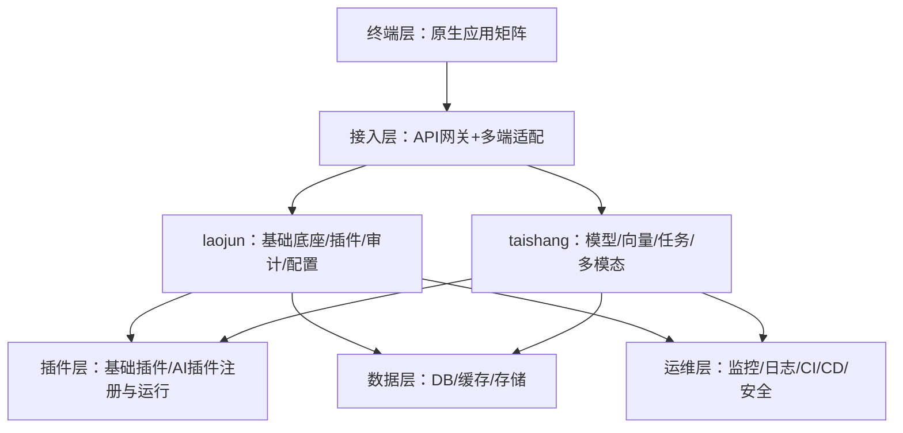

# CodeTaoist 项目启动包（Monorepo）

## 文档元信息
- 项目中文名称：太上老君
- 作者：Lida
- 域名：codetaoist.com
- 时间：2025.11
- Github： https://github.com/codetaoist/taishanglaojun

本启动包依据“重新制定开发方案”页面的完整清单与细节进行落地与扩展，调整为各终端使用原生语言，Web 管理后台使用 React。[0]

## 目录
- 项目定位与核心目标
- 技术栈总览（按终端）
- Monorepo 目录结构（规划）
- 核心文档集合（docs 与 openapi）
- 开发流程（五阶段）
- 关键设计原则
- 下一步
- 当前目录结构（已落地）
- 核心需求与合理性确认
- 文档与工具导航
- 我们的平台能做什么（Capability Map）
- 我们如何做（方法与实现路径）
- 功能架构与业务逻辑总览

## 项目定位与核心目标
- 面向多端的 AI 系统支撑平台：PC 管理后台（React）、移动端原生（iOS/Android）、机器人端原生 UI、手表端原生。[0]
- 插件化架构，B/S 为主、C/S 辅助，并贯穿 CI/CD 生命周期。[0]
- 后端以 Go 为核心（模块地址：`github.com/codetaoist/taishanglaojun`），数据库分库分表策略，数据缓存与向量库并存。[0]

## 技术栈总览（按终端）
- Web 管理后台：React + Vite + Ant Design（企业后台生态成熟，TypeScript 友好）。[0]
- iOS：Swift/SwiftUI 原生开发。
- Android：Kotlin/Jetpack Compose 原生开发。
- 机器人端：C++/Qt（含 QML）原生界面，或设备平台官方原生框架。
- 手表端：
  - Apple Watch：Swift/SwiftUI。
  - 微信小程序：原生小程序框架（不使用跨端框架）。
- 后端：Go（Gin 框架），OpenAPI 3.0，向量库（示例 Milvus/Faiss）、Redis 缓存、关系型数据库（MySQL/PostgreSQL）。[0]
- 插件：B/S 主导（Web 管理后台安装/启停/升级/卸载），C/S 辅助（本地插件开发工具），CI/CD 驱动全生命周期（GitLab CI）。[0]

## Monorepo 目录结构（规划）
```
codetaoist/
  apps/
    admin-react/         # React + Vite + Ant Design 管理后台（后续创建）
  clients/
    ios/                 # Swift/SwiftUI 原生（文档与模板占位）
    android/             # Kotlin/Jetpack Compose 原生（文档与模板占位）
    robot-qt/            # C++/Qt 原生（文档与模板占位）
    watch/               # Apple Watch 或 原生小程序（文档与模板占位）
  domain/
    laojun/              # 老君基础域：插件管理、审计、系统配置
    taishang/            # 太上域：AI模型、向量检索、任务编排
  services/
    api/                 # Go 后端服务（模块：github.com/codetaoist/taishanglaojun）
  packages/
    plugin-sdk/          # 插件SDK与规范（文档为主，后续实现）
  docs/                  # 核心文档集合
  openapi/               # OpenAPI 3.0 规范
  infra/
    ci/                  # CI/CD 配置（GitLab CI）
  db/                    # 数据模型与初始化SQL（含 lao_/tai_ 前缀表）
  scripts/               # 开发、部署、工具脚本
  README.md
  .gitignore
```

## 核心文档集合（`docs/` 与 `openapi/`）
- 接口规范：OpenAPI 3.0（后端内部、前后端、跨项目接口，含示例）。[0]
- 模块设计说明书：模块/子模块/核心逻辑/依赖/数据流向，附 mermaid 流程图代码。[0]
- 开发规范：语言、目录、数据库、接口、终端原生开发规范（React/Swift/Kotlin/C++）。[0]
- 部署基线：开发/测试/生产环境，硬件软件配置细至 CPU/GPU 显存。[0]
- 数据模型：库表/缓存/向量库，字段类型与索引设计，示例 SQL。[0]
- 终端规划：各终端页面结构、交互逻辑、接口对接（React 管理后台；原生移动/机器人/手表）。[0]
- 插件体系文档：架构、生命周期、使用流程（B/S 主 + CI/CD，C/S 补），含安装/启动/升级/卸载步骤与接口示例。[0]

## 开发流程（五阶段）
1. 准备期：落地后端骨架与文档、OpenAPI 草案、CI/CD 雏形；制定原生终端的模板与集成契约。[0]
2. 核心功能期：实现基础 API、React 管理后台页面骨架与插件基本管理能力。[0]
3. 功能扩展期：原生 iOS/Android/机器人/手表核心页面与控制流程；后端业务模块扩展、数据模型深化。[0]
4. 插件生态期：CI/CD 全流程完善、插件市场与管理后台联动；本地 C/S 工具与签名校验完善。[0]
5. 稳定交付期：环境与部署脚本完善、监控告警、性能与安全加固。

## 关键设计原则
- 插件管理以 Web 后台（React）为主：用户通过后台执行安装/启动/升级/卸载，后端提供安全校验与版本控制。[0]
- 本地插件工具（C/S）仅作为开发与调试辅助：本地构建、签名校验后再经 CI/CD 上行至仓库与部署。[0]
- 所有接口以 OpenAPI 3.0 为唯一事实源；前端类型、后端 DTO、SDK 以此派生。[0]
- 原生移动/机器人/手表端注重离线与权限模型；交互减重与网络不稳定场景的兼容。

## 下一步
- 对齐 Go 模块地址：`github.com/codetaoist/taishanglaojun`（后端实现开始前调整）。
- 细化 React 管理后台的信息架构与页面：仪表盘、插件管理、审计与日志、系统配置。
- 完善 OpenAPI 草案的请求/响应结构与错误码，驱动联调。

## 当前目录结构（已落地）
```
codetaoist/
  docs/                  # 全量文档（索引见 docs/README.md）
    data/                 # 数据模型与迁移文档
      migrations-explanation.md
    architecture/         # 架构设计文档
      root-structure-optimization.md
  openapi/               # 契约事实源与骨架示例
    laojun.yaml
    taishang.yaml
    laojun.skeleton.yaml
    taishang.skeleton.yaml
  scripts/               # 开发、部署、工具脚本
    db/                   # 数据库管理脚本
      init.sh             # 初始化脚本（执行V1/V2）
      migrate.sh          # 迁移脚本（执行时间戳迁移）
    tools/                # 开发工具脚本
      temp_hash.go        # 密码哈希工具
      test_vector_api.sh  # API测试脚本
    README.md
    requirements.txt
    manifest_validate.py
    manifest_sign.py
    openapi_validate.py
    openapi_contract_diff.py
  services/
    api/                 # Go 后端入口（Gin）
      tests/             # API服务测试目录
        integration/     # 集成测试
        unit/            # 单元测试
    auth/                # 认证服务
      tests/             # 认证服务测试目录
        integration/     # 集成测试
        unit/            # 单元测试
    gateway/             # 网关服务
      tests/             # 网关服务测试目录
        integration/     # 集成测试
        unit/            # 单元测试
  db/
    migrations/
      V1__init_lao.sql
      V2__init_tai.sql
    schema.sql
  tests/
    contracts/
      test_contracts.py
  .gitignore
  README.md
```

## 核心需求与合理性确认
- 双域分离与平台治理：laojun 负责插件生态（manifest/签名/生命周期/审计），taishang 负责模型/向量/任务与成本治理；平台层统一 IAM/网关/配置与审计，保证一致性与演进可控。
- 契约为事实源：OpenAPI 3.0 驱动前后端与 SDK 类型生成；统一响应包装（`{ code, data, message }`）、错误码（100x/200x/300x）、分页与幂等（`Idempotency-Key`），`bearerAuth` 安全契约贯通各域。
- 插件生态与安全：manifest 必填项、语义化版本、权限映射、依赖格式与签名一致性；公钥白名单与审计闭环；沙箱隔离与资源配额（容器化优先）。
- 任务编排与观测：taishang 的长任务（embedding/index/inference）暴露状态机、进度与成本指标；失败重试与降级；端到端 trace 与审计事件。
- CI 门禁与质量：合同一致性（规范校验+diff）、原生质量（lint/test/安全/性能基线）、插件生态门禁（清单校验/签名/依赖风险/配额）；发布与回滚策略明确。
- 多终端与权限：React 管理后台为主、原生端为辅；菜单与按钮级可见性由后端 `enabledActions` 驱动；域内资源授权按作用域（global/workspace/instance）。
- 数据与迁移：`lao_` 与 `tai_` 前缀表分域管理；迁移版本化与回滚（`db/migrations`）；缓存与向量库并存。

该需求集合符合“Domain-Driven Monorepo + Platform Governance”的最佳实践，合理化程度高，支持持续迭代与智能化扩展（特性开关、A/B、灰度）。

## 文档与工具导航
- 文档索引：`docs/README.md`（按“分域 → 接口 → 数据 → 安全 → 前端/原生 → 插件 → 测试 → 运维”导航）
- 接口标准与骨架：`docs/interfaces/standard.md`、`openapi/laojun.skeleton.yaml`、`openapi/taishang.skeleton.yaml`
- 插件开发与签名：`docs/plugins/development-manual.md`、`docs/plugins/plugin-manifest.md`、`scripts/*`
- 仓库结构策略：`docs/architecture/repo-structure.md`（事实依据）、`docs/architecture/repo-structure-strategy.md`（策略）
- 权限模型与安全：`docs/security/permission-model.md`、`docs/security/threat-model.md`、`docs/security/compliance.md`
- CI/CD 与测试：`docs/ops/ci-cd-pipeline.md`、`docs/testing/strategy.md`

## 下一步（落地建议）
- 整合migrations目录：将根目录migrations/合并到services/api/migrations/，保留db/migrations/作为参考文档
- 纠正目录文案：将规划中的 `infra/ci` 统一为现有 `ops/`（运维与 CI/CD）。
- 细化 `docs/interfaces/laojun-api-spec.md` 与 `docs/interfaces/taishang-api-spec.md` 字段级契约，生成客户端并用于联调。
- 集成脚本到 CI：新增合同校验与插件门禁作业（使用 `scripts/*`）。
- 搭建 React 管理后台骨架（`apps/admin-react` 规划目录），路由与菜单授权对齐后端。
- 完成 taishang 任务编排的状态与进度接口，落地长任务观测与成本指标。
- 对齐 Go 模块地址：`github.com/codetaoist/taishanglaojun`（后端实现开始前调整）。
- 细化 React 管理后台的信息架构与页面：仪表盘、插件管理、审计与日志、系统配置。
- 完善 OpenAPI 草案的请求/响应结构与错误码，驱动联调。


## 我们的平台能做什么（Capability Map）
- 多终端协同控制设备：Web/手机/手表/机器人原生接入，实时状态同步与控制指令下发（支持 HTTP/WS/MQTT/IPC）。
- AI 智能交互与任务自动化：语音/文本/图片等多模态意图识别，自动生成脚本与编排任务，过程可视化与通知推送。
- 插件生态扩展：基础/AI 插件按需安装、启动、升级、卸载；热插拔、资源隔离、版本兼容与安全校验。
- 数据治理与检索：结构化数据、缓存、文件存储与向量库协同；语义检索与上下文匹配，数据生命周期治理。
- 安全与合规：统一 IAM、RBAC 权限（角色/资源/动作），插件签名与来源校验、审计日志与威胁防护。
- 运维与交付：CI/CD 门禁（契约一致性/安全/测试/性能基线）、监控告警、版本回滚与灰度发布。

## 我们如何做（方法与实现路径）
- 契约驱动（OpenAPI 3.0）：以 `openapi/*.yaml` 为事实源，统一响应包装 `{ code, data, message }`、错误码（100x/200x/300x）、分页与幂等（`Idempotency-Key`），`bearerAuth` 贯通各域。
- 双域解耦（laojun/taishang）：`taishang` 通过标准化接口单向调用 `laojun`，接口边界清晰，避免代码耦合，面向治理演进。
- 插件生命周期与门禁：`manifest` 必填与语义化版本、权限映射、依赖格式与签名一致性；使用 `scripts/*` 在本地与 CI 校验/签名/合同 diff。
- 多终端原生适配：React Admin 为主，iOS/Android/机器人/手表原生为辅；接入层按 `X-Device-Type` 返回适配字段集。
- 任务编排与观测：`taishang` 暴露状态机（创建/队列/运行/完成/失败/取消）、进度与成本指标；失败重试与降级；端到端 trace 与审计事件。
- 数据与迁移：`lao_`/`tai_` 分域前缀，迁移版本化与回滚（`db/migrations`）；缓存与向量库并存，冷热数据分层治理。
- 安全与权限：RBAC 与作用域授权（global/workspace/instance），`enabledActions` 驱动前端菜单/按钮可见性；接口鉴权、限流与合规。

## 功能架构与业务逻辑总览
- 六层架构：终端层 → 接入层（网关/适配）→ 核心服务层（laojun/taishang）→ 插件层 → 数据层 → 运维层。
- 关键边界：`/api/laojun/*` 与 `/api/taishang/*` 路由分域；请求/响应统一包装与审计；插件与 AI 能力通过注册中心治理。



### 核心业务场景（摘要）
- 多终端协同控制设备：管理员在 Web 端配置设备→手机端绑定→手表端一键启动→机器人端执行并回传→Web 端记录日志（指令统一经 `laojun` 转发与鉴权）。
- AI 智能交互与任务自动化：手机端语音“生成巡检脚本”→`taishang` 识别意图并调用 AI 插件→脚本经 `laojun` 存储→用户在 Web 端确认并执行→结果推送至手机端。
- 插件扩展定制化：开发者基于插件 SDK 开发→CI 自动编译/测试/签名→上传插件仓库→管理员 Web 审核与安装→用户移动端调用能力。

## 文档约定（统一风格）
- 统一响应包装：`{ code, message, data, traceId }`；示例与契约对齐。
- 错误码集合：`OK | INVALID_ARGUMENT | UNAUTHENTICATED | PERMISSION_DENIED | NOT_FOUND | CONFLICT | FAILED_PRECONDITION | INTERNAL | UNAVAILABLE`。
- 分页与排序：查询参数 `page`, `pageSize`；`sort=field:asc,created_at:desc`；过滤示例 `status=active&name=foo`。
- 安全契约：`bearerAuth`（JWT）；可选头 `X-Workspace-Id`、`Idempotency-Key`；敏感写操作要求审计。
- 版本策略：路径或媒体类型（`Accept: application/vnd.codetaoist.v1+json`）；变更需评审与版本标记。
- 示例风格：接口文档统一使用 `curl` 示例，包含请求与响应；字段与枚举严格引用 OpenAPI。