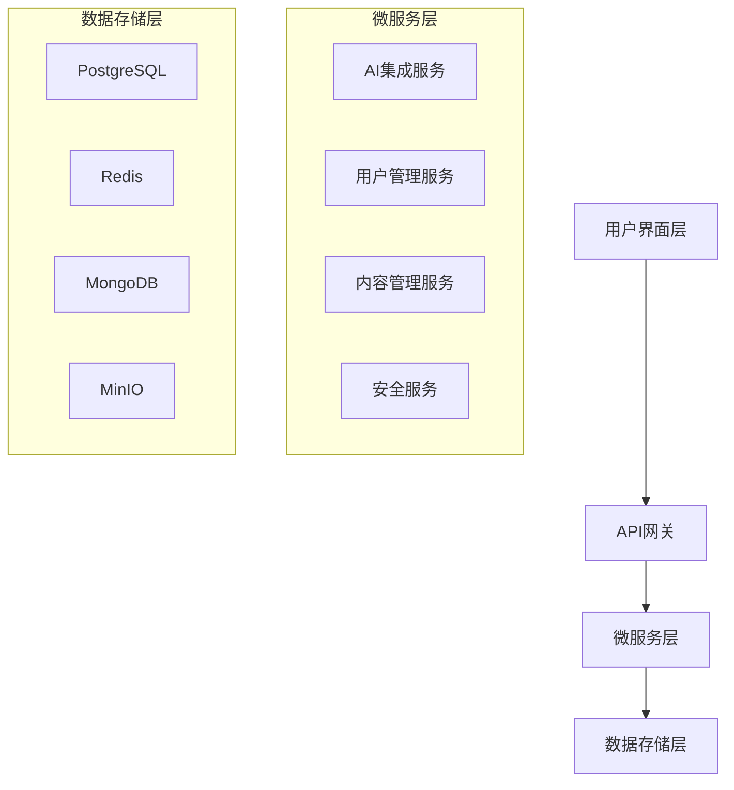

# 太上老君AI平台

<div align="center">


**一个现代化的AI驱动平台，提供智能对话、文档处理、知识管理等服务**

[🚀 快速开始](#快速开始) • [📖 文档](#文档) • [🛠️ 部署](#部署) • [🤝 贡献](#贡献)

</div>

## 🌟 项目简介

太上老君AI平台是一个现代化的人工智能服务平台，集成了智能对话、图像生成、文档分析等多种AI功能。平台采用微服务架构，支持多平台部署，为用户提供强大而易用的AI服务。

### 核心理念

- **智能化**: 集成最先进的AI技术，提供智能化的用户体验
- **多模态**: 支持文本、图像、语音等多种模态的AI处理
- **易用性**: 简洁直观的用户界面，降低AI技术的使用门槛
- **安全性**: 企业级安全保障，保护用户数据和隐私
- **可扩展**: 模块化设计，支持功能扩展和定制化

## ✨ 功能特性

### 🤖 智能对话
- **多模型支持**: 集成GPT-4、Claude、文心一言等主流AI模型
- **上下文记忆**: 支持长对话记忆，理解对话上下文
- **专业领域**: 代码生成、数据分析、创意写作等专业功能
- **多语言支持**: 支持中文、英文等多种语言交互

### 🎨 图像生成
- **文本生成图像**: 根据文字描述生成高质量图像
- **图像编辑**: 智能修改和优化现有图像
- **风格转换**: 支持多种艺术风格和画面风格
- **批量处理**: 支持批量生成和处理图像

### 📄 文档分析
- **多格式支持**: 支持PDF、Word、PowerPoint、Excel等格式
- **智能摘要**: 自动提取文档核心内容和要点
- **关键词提取**: 识别文档中的重要概念和术语
- **问答系统**: 基于文档内容的智能问答

### 📊 数据分析
- **可视化**: 自动生成图表和数据可视化报告
- **趋势分析**: 识别数据模式和发展趋势
- **预测建模**: 基于历史数据进行未来预测
- **自然语言查询**: 用自然语言查询和分析数据

## 🚀 快速开始

### 📋 环境要求

- **Node.js**: >= 16.0.0
- **Go**: >= 1.19
- **Docker**: >= 20.10
- **Kubernetes**: >= 1.20 (可选)

### ⚡ 本地开发

```bash
# 克隆项目
git clone https://github.com/codetaoist/taishanglaojun.git
cd taishanglaojun

# 安装依赖
pnpm install

# 启动开发服务器
pnpm run dev
```

### 🐳 Docker 部署

```bash
# 构建镜像
docker build -t taishanglaojun:latest .

# 运行容器
docker run -p 8080:8080 taishanglaojun:latest
```

### ☸️ Kubernetes 部署

```bash
# 应用配置
kubectl apply -f k8s/

# 查看状态
kubectl get pods -l app=taishanglaojun
```

## 🏗️ 架构设计

### 系统架构图


```mermaid
graph TB
    A[用户界面层] --> B[API网关]
    B --> C[微服务层]
    C --> D[数据存储层]
    
    subgraph "微服务层"
        C1[AI集成服务]
        C2[用户管理服务]
        C3[内容管理服务]
        C4[安全服务]
    end
    
    subgraph "数据存储层"
        D1[PostgreSQL]
        D2[Redis]
        D3[MongoDB]
        D4[MinIO]
    end
```

### 技术栈

**后端技术栈**
- **语言**: Go, Node.js
- **框架**: Gin, Express.js
- **数据库**: PostgreSQL, MongoDB, Redis
- **消息队列**: RabbitMQ
- **存储**: MinIO (S3兼容)

**前端技术栈**
- **Web**: React, TypeScript, Tailwind CSS
- **移动端**: React Native, Flutter
- **桌面端**: Electron

**基础设施**
- **容器化**: Docker, Kubernetes
- **CI/CD**: GitHub Actions, Jenkins
- **监控**: Prometheus, Grafana
- **日志**: ELK Stack

## 📚 文档导航

### 📋 项目概览
- [🎯 项目愿景与目标](docs/00-项目概览/项目愿景与目标.md)
- [🗺️ 开发路线图](docs/00-项目概览/开发路线图.md)
- [📝 版本发布记录](docs/00-项目概览/版本发布记录.md)
- [🤝 贡献指南](docs/00-项目概览/贡献指南.md)

### 🏃‍♂️ 快速开始
- [⚡ 环境搭建指南](docs/01-快速开始/环境搭建指南.md)
- [🚀 快速部署指南](docs/01-快速开始/快速部署指南.md)
- [💻 开发环境配置](docs/01-快速开始/开发环境配置.md)
- [🎯 第一个示例](docs/01-快速开始/第一个示例.md)

### 🏗️ 架构设计
- [🏛️ 总体架构设计](docs/02-架构设计/总体架构设计.md)
- [🔧 技术栈选型](docs/02-架构设计/技术栈选型.md)
- [🔄 微服务架构](docs/02-架构设计/微服务架构.md)
- [🗄️ 数据库设计](docs/02-架构设计/数据库设计.md)
- [🔒 安全架构设计](docs/02-架构设计/安全架构设计.md)
- [📱 多端架构设计](docs/02-架构设计/多端架构设计.md)

### ⚙️ 核心服务
- [🤖 AI集成服务](docs/03-核心服务/ai-integration/README.md)
- [👥 社区服务](docs/03-核心服务/community/README.md)
- [🧠 意识服务](docs/03-核心服务/consciousness/README.md)
- [📚 文化智慧服务](docs/03-核心服务/cultural-wisdom/README.md)
- [📍 位置跟踪服务](docs/03-核心服务/location-tracking/README.md)
- [📊 监控服务](docs/03-核心服务/monitoring/README.md)
- [📋 任务管理服务](docs/03-核心服务/task-management/README.md)
- [🔐 安全服务](docs/03-核心服务/security/README.md)

### 💻 前端应用
- [🌐 Web应用](docs/04-前端应用/web-app/README.md)
- [🖥️ 桌面应用](docs/04-前端应用/desktop-apps/README.md)
- [📱 移动应用](docs/04-前端应用/mobile-apps/README.md)
  - [🤖 Android应用](docs/04-前端应用/mobile-apps/android/README.md)
  - [🍎 iOS应用](docs/04-前端应用/mobile-apps/ios/README.md)
  - [🌸 HarmonyOS应用](docs/04-前端应用/mobile-apps/harmony/README.md)
- [⌚ 手表应用](docs/04-前端应用/watch-apps/README.md)

### 🔧 基础设施
- [🐳 Docker容器化](docs/05-基础设施/Docker容器化.md)
- [☸️ Kubernetes部署](docs/05-基础设施/Kubernetes部署.md)
- [🔄 CI/CD流水线](docs/05-基础设施/CI-CD流水线.md)
- [📊 监控告警](docs/05-基础设施/监控告警.md)
- [📝 日志管理](docs/05-基础设施/日志管理.md)

### 📡 API文档
- [🔗 API总览](docs/06-API文档/README.md)
- [🔐 认证授权](docs/06-API文档/认证授权.md)
- [⚙️ 核心服务API](docs/06-API文档/核心服务API/README.md)
- [❌ 错误码定义](docs/06-API文档/错误码定义.md)
- [📋 API变更记录](docs/06-API文档/API变更记录.md)

### 👨‍💻 开发指南
- [📏 代码规范](docs/07-开发指南/代码规范.md)
- [🌿 Git工作流](docs/07-开发指南/Git工作流.md)
- [🧪 测试指南](docs/07-开发指南/测试指南.md)
- [🐛 调试指南](docs/07-开发指南/调试指南.md)
- [⚡ 性能优化](docs/07-开发指南/性能优化.md)
- [🔧 故障排查](docs/07-开发指南/故障排查.md)

### 🚀 部署运维
- [🏭 生产环境部署](docs/08-部署运维/生产环境部署.md)
- [⚙️ 配置管理](docs/08-部署运维/配置管理.md)
- [💾 备份恢复](docs/08-部署运维/备份恢复.md)
- [📈 性能监控](docs/08-部署运维/性能监控.md)
- [🔒 安全加固](docs/08-部署运维/安全加固.md)
- [🚨 故障处理手册](docs/08-部署运维/故障处理手册.md)

### 📖 用户手册
- [✨ 功能介绍](docs/09-用户手册/功能介绍.md)
- [📚 使用教程](docs/09-用户手册/使用教程.md)
- [❓ 常见问题](docs/09-用户手册/常见问题.md)
- [📋 更新日志](docs/09-用户手册/更新日志.md)

### 📊 开发进度
- [📈 进度总览](docs/10-开发进度/README.md)
- [🎯 当前开发状态](docs/10-开发进度/当前开发状态.md)
- [📊 功能完成度统计](docs/10-开发进度/功能完成度统计.md)
- [🏁 里程碑跟踪](docs/10-开发进度/里程碑跟踪.md)
- [🐛 问题跟踪](docs/10-开发进度/问题跟踪.md)

## 📡 API示例

### 智能对话API

```bash
curl -X POST "https://api.taishanglaojun.com/v1/chat/completions" \
  -H "Authorization: Bearer YOUR_API_KEY" \
  -H "Content-Type: application/json" \
  -d '{
    "model": "gpt-4",
    "messages": [
      {"role": "user", "content": "你好，请介绍一下太上老君AI平台"}
    ]
  }'
```

### 图像生成API

```bash
curl -X POST "https://api.taishanglaojun.com/v1/images/generations" \
  -H "Authorization: Bearer YOUR_API_KEY" \
  -H "Content-Type: application/json" \
  -d '{
    "prompt": "一个现代化的AI平台界面设计",
    "size": "1024x1024",
    "quality": "hd"
  }'
```

### JavaScript SDK

```javascript
import { TaishanglaojunAI } from '@taishanglaojun/sdk';

const client = new TaishanglaojunAI({
  apiKey: 'YOUR_API_KEY'
});

// 智能对话
const response = await client.chat.completions.create({
  model: 'gpt-4',
  messages: [{ role: 'user', content: '你好' }]
});

// 图像生成
const image = await client.images.generate({
  prompt: '美丽的风景画',
  size: '1024x1024'
});
```

## 🤝 贡献指南

我们欢迎所有形式的贡献！请查看 [贡献指南](docs/00-项目概览/贡献指南.md) 了解详细信息。

### 开发流程

1. **Fork** 项目到你的GitHub账户
2. **创建** 功能分支 (`git checkout -b feature/AmazingFeature`)
3. **提交** 你的更改 (`git commit -m 'Add some AmazingFeature'`)
4. **推送** 到分支 (`git push origin feature/AmazingFeature`)
5. **创建** Pull Request

### 代码规范

- 遵循 [代码规范](docs/07-开发指南/代码规范.md)
- 编写单元测试
- 更新相关文档
- 确保CI/CD流水线通过

## 📊 项目状态

### 开发进度

- **核心功能**: 85% 完成
- **前端应用**: 70% 完成
- **API文档**: 90% 完成
- **测试覆盖**: 85%

### 最新版本

- **当前版本**: v1.0.0
- **发布日期**: 2024年12月
- **下个版本**: v1.1.0 (计划2025年1月)

## 📄 许可证

本项目采用 MIT 许可证 - 查看 [LICENSE](LICENSE) 文件了解详情。

## 🙏 致谢

感谢所有为这个项目做出贡献的开发者和用户！

特别感谢：
- OpenAI 提供的GPT模型支持
- 开源社区的各种优秀项目
- 所有测试用户的反馈和建议

## 📞 联系我们

- **项目主页**: https://github.com/your-org/taishanglaojun
- **官方网站**: https://taishanglaojun.com
- **技术支持**: support@taishanglaojun.com
- **商务合作**: business@taishanglaojun.com
- **社区讨论**: https://discord.gg/taishanglaojun

## 📈 更新日志

### v1.0.0 (2024-12-XX)
- ✨ 初始版本发布
- 🤖 集成多种AI模型
- 🎨 图像生成功能
- 📄 文档分析功能
- 📊 数据分析功能
- 🔒 企业级安全保障

---

<div align="center">

**[⬆ 回到顶部](#太上老君ai平台)**

Made with ❤️ by the Taishanglaojun Team

</div>

### 📱 多端支持
- **Web端**: React + TypeScript + Vite
- **桌面端**: Electron + React
- **移动端**: Android (Kotlin) + iOS (SwiftUI) + HarmonyOS (ArkTS)
- **手表端**: WatchOS + WearOS + HarmonyOS Watch

### 🏗️ 技术架构
- **后端**: Go微服务 + gRPC + RESTful API
- **数据库**: PostgreSQL + Redis + MongoDB + InfluxDB
- **基础设施**: Docker + Kubernetes + CI/CD
- **监控**: Prometheus + Grafana + ELK Stack

## 📈 当前开发状态

| 模块 | 状态 | 完成度 | 最后更新 |
|------|------|--------|----------|
| 🤖 AI集成服务 | ✅ 已完成 | 90% | 2024-12 |
| 👥 社区服务 | ✅ 已完成 | 85% | 2024-12 |
| 🧠 意识服务 | ✅ 已完成 | 80% | 2024-12 |
| 📚 文化智慧服务 | ✅ 已完成 | 85% | 2024-12 |
| 📍 位置跟踪服务 | ✅ 已完成 | 75% | 2024-12 |
| 📊 监控服务 | ✅ 已完成 | 90% | 2024-12 |
| 📋 任务管理服务 | ✅ 已完成 | 85% | 2024-12 |
| 🔐 安全服务 | ✅ 已完成 | 95% | 2024-12 |
| 🌐 Web应用 | ✅ 已完成 | 80% | 2024-12 |
| 📱 移动应用 | 🚧 开发中 | 70% | 2024-12 |
| 🖥️ 桌面应用 | 🚧 开发中 | 60% | 2024-12 |
| ⌚ 手表应用 | 📋 计划中 | 30% | 2024-12 |

## 🚀 快速开始

### 环境要求
- Go 1.21+
- Node.js 18+
- Docker & Docker Compose
- PostgreSQL 15+
- Redis 7+

### 一键启动
```bash
# 克隆项目
git clone https://github.com/your-org/taishanglaojun.git
cd taishanglaojun

# 启动开发环境
docker-compose up -d

# 访问应用
# Web应用: http://localhost:3000
# API文档: http://localhost:8080/docs
# 监控面板: http://localhost:3001
```

## 🤝 贡献指南

我们欢迎所有形式的贡献！请查看 [贡献指南](docs/00-项目概览/贡献指南.md) 了解详细信息。

### 开发流程
1. Fork 项目
2. 创建功能分支 (`git checkout -b feature/AmazingFeature`)
3. 提交更改 (`git commit -m 'Add some AmazingFeature'`)
4. 推送到分支 (`git push origin feature/AmazingFeature`)
5. 创建 Pull Request

## 📞 联系我们

- **项目负责人**: 开发团队
- **技术支持**: [技术文档](docs/07-开发指南/README.md)
- **问题反馈**: [GitHub Issues](https://github.com/your-org/taishanglaojun/issues)

## 📄 许可证

本项目采用 MIT 许可证 - 查看 [LICENSE](LICENSE) 文件了解详情。

---

**最后更新**: 2024年12月  
**文档版本**: v1.0  
**项目状态**: 积极开发中 🚀