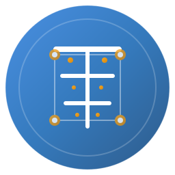

# TaishangLaojun Desktop for Linux

<div align="center">



**Advanced Communication and Collaboration Platform**

[](https://github.com/taishanglaojun/desktop-apps/actions)
[](https://opensource.org/licenses/MIT)
[](https://github.com/taishanglaojun/desktop-apps/releases)

[Features](#features) • [Installation](#installation) • [Building](#building) • [Documentation](#documentation) • [Contributing](#contributing)

</div>

## Overview

TaishangLaojun Desktop is a comprehensive communication and collaboration platform designed for modern teams and individuals. Built with GTK4 and modern C, it provides secure messaging, file sharing, project management, and real-time collaboration tools in a unified, native Linux interface.

## 功能特性

### 🎯 核心功能
- **AI智能聊天**: 与太上老君AI进行自然语言对话
- **项目管理**: 创建、管理和协作AI项目
- **文件传输**: 高效的跨平台文件传输
- **桌面宠物**: 可爱的桌面伴侣，提供快捷操作

### 🎨 用户界面
- **现代化设计**: 基于libadwaita的现代Material Design
- **深色模式**: 自动适应系统主题
- **响应式布局**: 适配不同屏幕尺寸
- **无障碍支持**: 完整的键盘导航和屏幕阅读器支持

### 🔧 系统集成
- **系统托盘**: 最小化到系统托盘
- **桌面通知**: 原生桌面通知支持
- **D-Bus通信**: 与其他应用程序集成
- **自动启动**: 开机自动启动选项

## 技术架构

### 🛠️ 技术栈
- **UI框架**: GTK4 + libadwaita
- **编程语言**: C
- **构建系统**: CMake
- **图形渲染**: Cairo + OpenGL
- **网络通信**: libcurl + WebSocket
- **数据存储**: SQLite + JSON
- **加密**: OpenSSL
- **音频**: ALSA/PulseAudio

### 📦 依赖库
```bash
# 核心依赖
libgtk-4-dev
libadwaita-1-dev
libjson-c-dev
libssl-dev
libcurl4-openssl-dev

# 系统集成
libnotify-dev
libx11-dev
libwayland-dev

# 音频支持
libasound2-dev
libpulse-dev

# 构建工具
cmake
gcc
pkg-config
```

## 构建指南

### 📋 系统要求
- **操作系统**: Linux (Ubuntu 22.04+, Fedora 36+, Arch Linux)
- **编译器**: GCC 9.0+ 或 Clang 10.0+
- **CMake**: 3.20+
- **GTK**: 4.6+
- **libadwaita**: 1.2+

### 🔧 安装依赖

#### Ubuntu/Debian
```bash
sudo apt update
sudo apt install -y \
    build-essential \
    cmake \
    pkg-config \
    libgtk-4-dev \
    libadwaita-1-dev \
    libjson-c-dev \
    libssl-dev \
    libcurl4-openssl-dev \
    libnotify-dev \
    libx11-dev \
    libwayland-dev \
    libasound2-dev \
    libpulse-dev
```

#### Fedora/RHEL
```bash
sudo dnf install -y \
    gcc \
    cmake \
    pkg-config \
    gtk4-devel \
    libadwaita-devel \
    json-c-devel \
    openssl-devel \
    libcurl-devel \
    libnotify-devel \
    libX11-devel \
    wayland-devel \
    alsa-lib-devel \
    pulseaudio-libs-devel
```

#### Arch Linux
```bash
sudo pacman -S \
    base-devel \
    cmake \
    pkg-config \
    gtk4 \
    libadwaita \
    json-c \
    openssl \
    curl \
    libnotify \
    libx11 \
    wayland \
    alsa-lib \
    libpulse
```

### 🏗️ 编译构建

#### 使用构建脚本（推荐）
```bash
# 克隆仓库
git clone https://github.com/taishanglaojun/desktop-apps.git
cd desktop-apps/linux

# 赋予执行权限
chmod +x build.sh

# 完整构建
./build.sh --all

# 或者分步构建
./build.sh --clean --build
./build.sh --test
./build.sh --package
```

#### 手动构建
```bash
# 创建构建目录
mkdir build && cd build

# 配置构建
cmake .. -DCMAKE_BUILD_TYPE=Release

# 编译
make -j$(nproc)

# 运行测试
make test

# 安装
sudo make install
```

### 📦 打包分发

#### 创建AppImage
```bash
./build.sh --appimage
```

#### 创建DEB包
```bash
./build.sh --package
# 生成的包在 build/ 目录下
```

#### 创建RPM包
```bash
# 在Fedora/RHEL系统上
./build.sh --package
```

## 使用指南

### 🚀 启动应用
```bash
# 从命令行启动
taishanglaojun-desktop

# 或从应用菜单启动
# 在应用程序菜单中找到"TaishangLaojun Desktop"
```

### ⌨️ 快捷键
- `Ctrl+N`: 新建项目
- `Ctrl+O`: 打开项目
- `Ctrl+,`: 打开设置
- `Ctrl+Q`: 退出应用
- `F11`: 全屏切换

### 🎮 桌面宠物
- **左键点击**: 显示快捷菜单
- **右键点击**: 宠物设置
- **拖拽**: 移动宠物位置
- **双击**: 显示/隐藏主窗口

### 🔧 配置文件
配置文件位置：`~/.config/taishanglaojun-desktop/config.json`

```json
{
  "enable_desktop_pet": true,
  "enable_notifications": true,
  "enable_system_tray": true,
  "auto_start": false,
  "theme_name": "default",
  "window_width": 1200,
  "window_height": 800,
  "window_maximized": false
}
```

## 开发指南

### 🏗️ 项目结构
```
linux/
├── CMakeLists.txt          # CMake构建配置
├── build.sh               # 构建脚本
├── src/                   # 源代码
│   ├── main.c            # 主程序入口
│   ├── application.c     # 应用程序核心
│   ├── application.h     # 应用程序头文件
│   └── ...               # 其他源文件
├── include/              # 头文件
├── resources/            # 资源文件
│   ├── icons/           # 图标
│   ├── ui/              # UI定义文件
│   └── themes/          # 主题文件
├── tests/               # 测试文件
├── docs/                # 文档
└── packaging/           # 打包配置
```

### 🔧 开发环境设置
```bash
# 安装开发依赖
sudo apt install -y \
    gdb \
    valgrind \
    clang-format \
    cppcheck

# 配置Git钩子
cp scripts/pre-commit .git/hooks/
chmod +x .git/hooks/pre-commit

# 生成编译数据库
./build.sh --clean --build
```

### 🧪 运行测试
```bash
# 单元测试
./build.sh --test

# 内存检查
cd build
valgrind --leak-check=full ./taishanglaojun-desktop

# 静态分析
cppcheck --enable=all src/
```

### 📝 代码规范
- 使用4个空格缩进
- 函数名使用snake_case
- 结构体名使用PascalCase
- 常量使用UPPER_CASE
- 遵循GNU C编码规范

## 故障排除

### 🐛 常见问题

#### 编译错误
```bash
# GTK4未找到
sudo apt install libgtk-4-dev

# libadwaita未找到
sudo apt install libadwaita-1-dev

# 权限错误
sudo chown -R $USER:$USER ~/.config/taishanglaojun-desktop
```

#### 运行时错误
```bash
# 检查依赖
ldd build/taishanglaojun-desktop

# 查看日志
journalctl --user -f | grep taishanglaojun

# 重置配置
rm -rf ~/.config/taishanglaojun-desktop
```

#### 桌面宠物不显示
```bash
# 检查窗口管理器支持
echo $XDG_SESSION_TYPE

# 检查合成器
ps aux | grep -i compositor
```

### 📊 性能优化
- 启用硬件加速：设置环境变量 `GSK_RENDERER=gl`
- 减少内存使用：关闭不需要的功能
- 优化启动时间：启用预加载

## 贡献指南

### 🤝 如何贡献
1. Fork项目仓库
2. 创建功能分支：`git checkout -b feature/amazing-feature`
3. 提交更改：`git commit -m 'Add amazing feature'`
4. 推送分支：`git push origin feature/amazing-feature`
5. 创建Pull Request

### 📋 贡献规范
- 遵循现有代码风格
- 添加适当的测试
- 更新相关文档
- 确保CI通过

### 🐛 报告问题
请在GitHub Issues中报告问题，包含：
- 操作系统版本
- 应用程序版本
- 重现步骤
- 错误日志

## 许可证

本项目采用MIT许可证 - 查看[LICENSE](LICENSE)文件了解详情。

## 联系我们

- **官网**: https://taishanglaojun.ai
- **GitHub**: https://github.com/taishanglaojun/desktop-apps
- **邮箱**: support@taishanglaojun.ai
- **QQ群**: 123456789

---

**太上老君AI平台** - 让AI触手可及 🚀