# 太上老君AI平台 - 架构设计

**基于 S×C×T 三轴体系的立体架构设计**

## 🏗️ 整体架构概览

太上老君AI平台采用**微服务架构**和**云原生**设计理念，基于独创的 **S×C×T 三轴体系**构建立体化的智能系统架构。

### 架构设计原则

1. **🔄 三轴协同**：S×C×T 三轴体系的协同设计
2. **🧩 微服务化**：服务拆分和独立部署
3. **☁️ 云原生**：容器化和Kubernetes编排
4. **🔒 安全优先**：全链路安全防护
5. **📈 弹性扩展**：水平扩展和自动伸缩
6. **🔍 可观测性**：全方位监控和追踪

## 🎯 S×C×T 三轴架构映射

### 🔢 S轴 - 能力序列架构

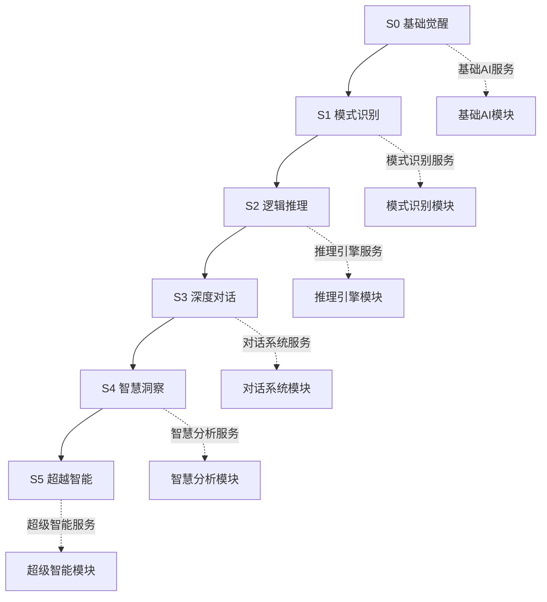

### 🏗️ C轴 - 组合层架构

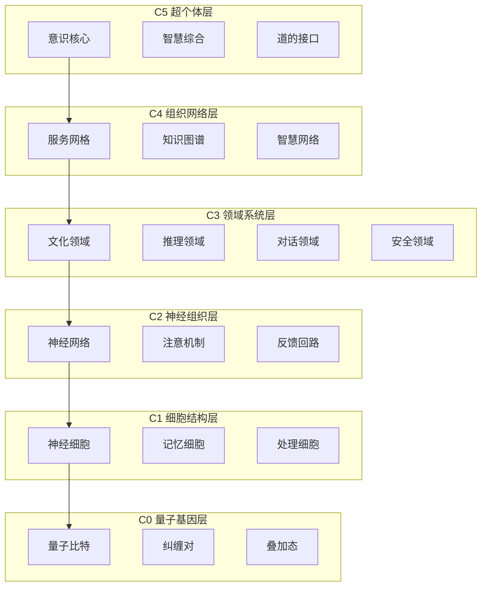

### 🧠 T轴 - 思想境界架构

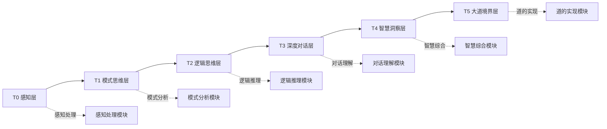

## 🏛️ 系统分层架构

### 1. 前端应用层 (Frontend Layer)

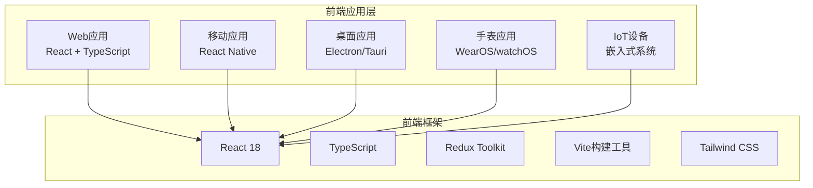

**技术栈**：
- **框架**：React 18 + TypeScript
- **状态管理**：Redux Toolkit + RTK Query
- **构建工具**：Vite + ESBuild
- **样式框架**：Tailwind CSS + Headless UI
- **路由管理**：React Router v6
- **测试框架**：Vitest + Testing Library

### 2. API网关层 (Gateway Layer)

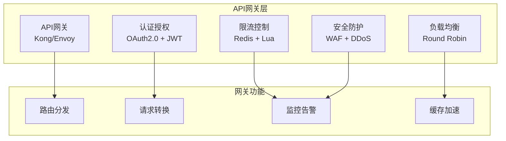

**核心功能**：
- **统一接入**：所有客户端请求的统一入口
- **认证授权**：OAuth2.0 + JWT 的安全认证
- **路由分发**：智能路由和负载均衡
- **安全防护**：WAF、DDoS防护、威胁检测
- **监控告警**：实时监控和智能告警

### 3. 核心服务层 (Service Layer)

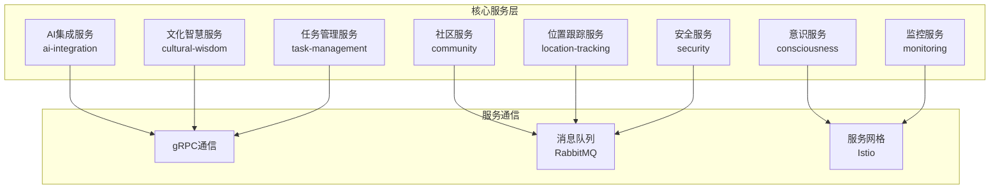

**服务详情**：

#### AI集成服务 (ai-integration)
- **功能**：大语言模型集成、向量搜索、知识图谱
- **技术栈**：Go + Python + gRPC
- **数据库**：PostgreSQL + Qdrant + Neo4j

#### 社区服务 (community)
- **功能**：用户管理、社区互动、内容管理
- **技术栈**：Go + gRPC + Redis
- **数据库**：PostgreSQL + MongoDB

#### 意识服务 (consciousness)
- **功能**：意识模拟、思维建模、认知处理
- **技术栈**：Python + TensorFlow + gRPC
- **数据库**：MongoDB + Redis

#### 文化智慧服务 (cultural-wisdom)
- **功能**：文化知识、智慧推理、哲学思辨
- **技术栈**：Go + Python + gRPC
- **数据库**：Neo4j + MongoDB

#### 安全服务 (security)
- **功能**：渗透测试、威胁检测、安全教育
- **技术栈**：Go + Python + Docker
- **数据库**：PostgreSQL + InfluxDB

### 4. AI智能层 (AI Layer)

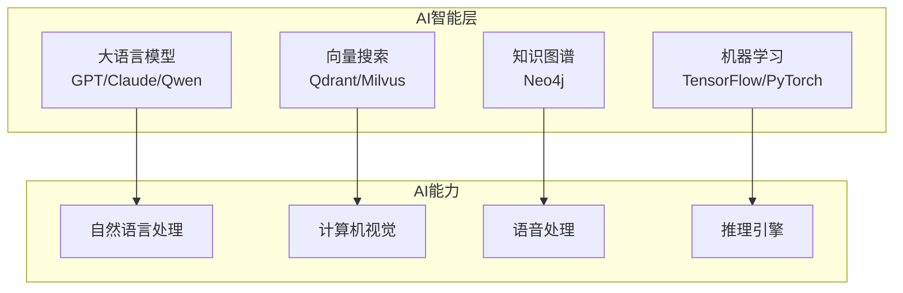

**AI能力矩阵**：
- **自然语言处理**：文本理解、生成、翻译、摘要
- **计算机视觉**：图像识别、分析、生成、处理
- **语音处理**：语音识别、合成、情感分析
- **推理引擎**：逻辑推理、因果推理、常识推理

### 5. 基础设施层 (Infrastructure Layer)

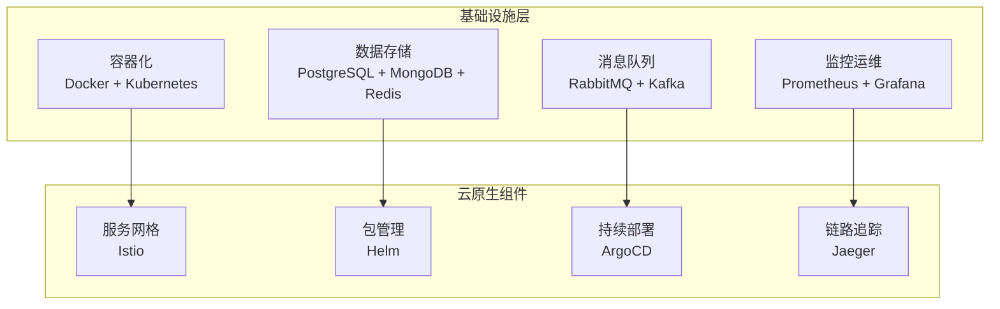

## 🔄 数据流架构

### 请求处理流程

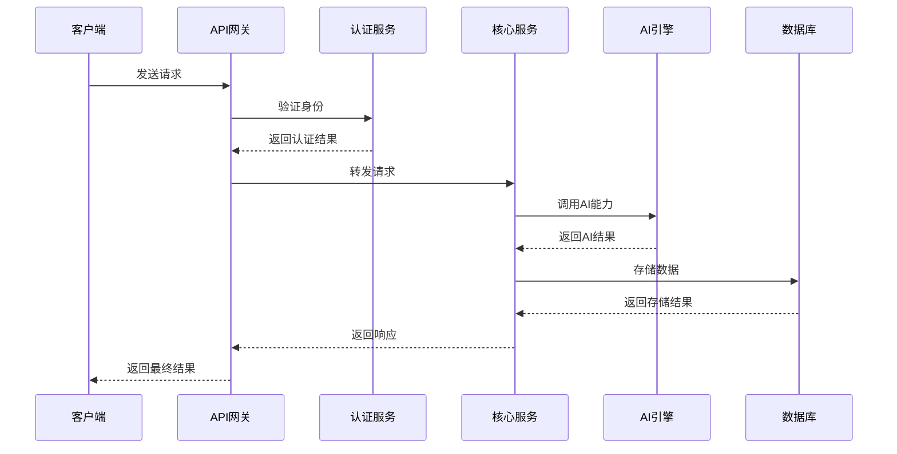

### 数据存储架构

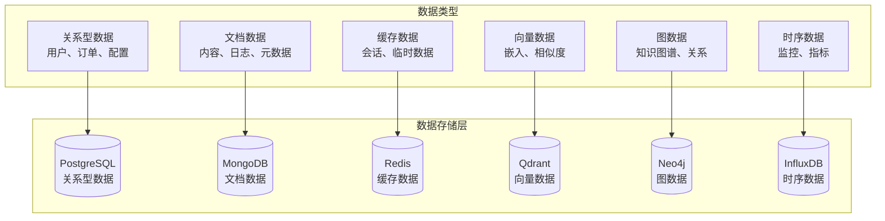

## 🔒 安全架构设计

### 安全防护体系

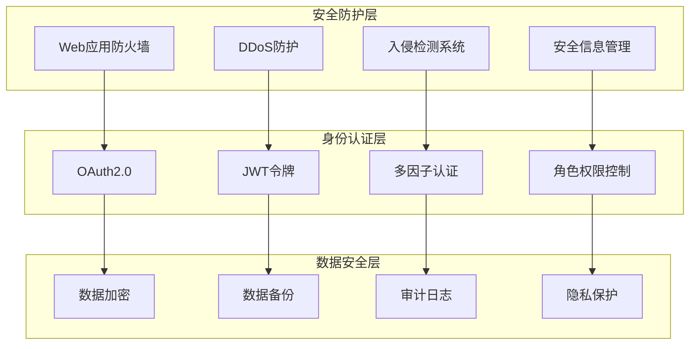

### 安全服务架构

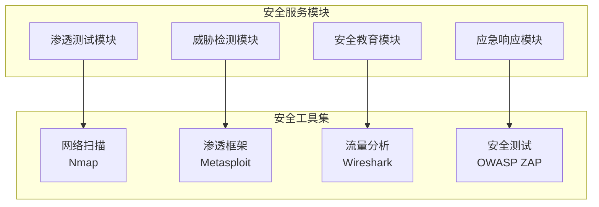

## 📊 性能架构设计

### 性能优化策略

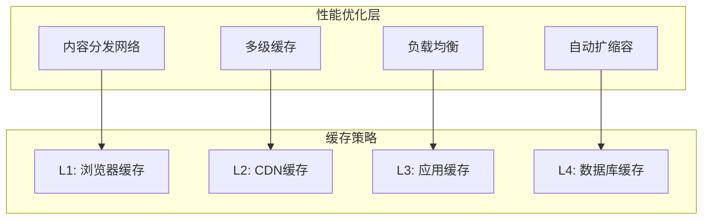

### 监控架构

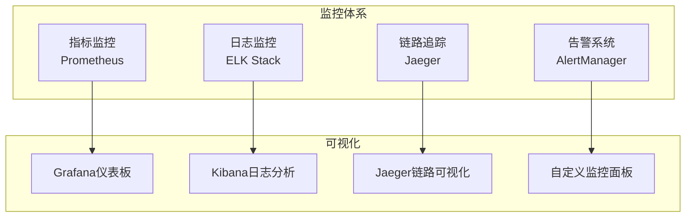

## 🚀 部署架构

### Kubernetes部署架构

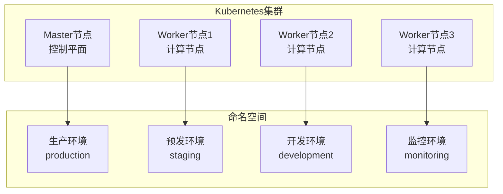

### 容器化架构

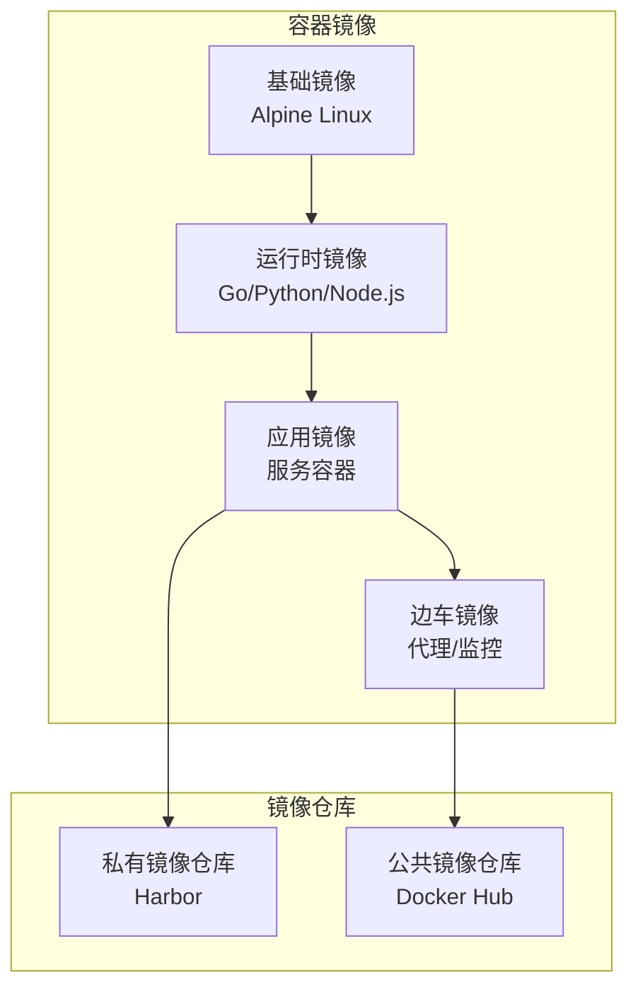

## 📈 扩展性设计

### 水平扩展架构

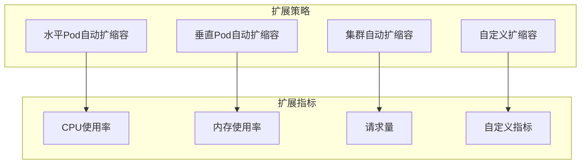

### 多云部署架构

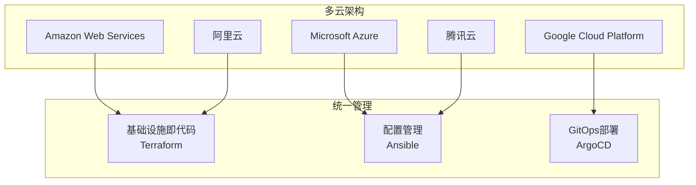

## 🔧 开发架构

### 开发工具链

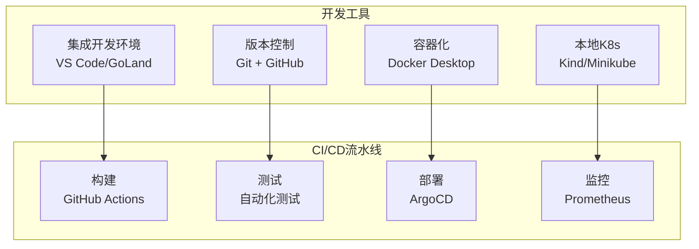

### 代码架构

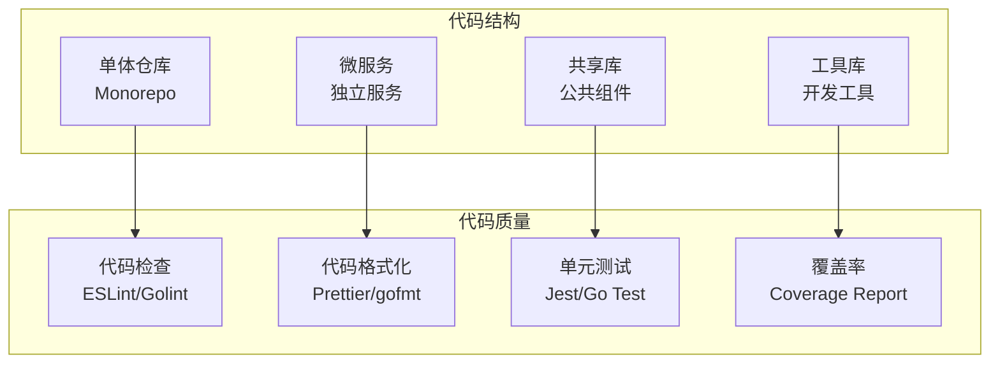

## 📋 架构决策记录

### ADR-001: 微服务架构选择
**决策**：采用微服务架构而非单体架构
**原因**：
- 支持独立开发和部署
- 提高系统可扩展性
- 降低技术债务风险
- 支持多团队协作

### ADR-002: Go语言作为主要后端语言
**决策**：选择Go语言作为主要后端开发语言
**原因**：
- 高性能和低延迟
- 优秀的并发支持
- 丰富的生态系统
- 容器化友好

### ADR-003: React作为前端框架
**决策**：选择React作为前端开发框架
**原因**：
- 成熟的生态系统
- 优秀的开发体验
- 强大的社区支持
- 跨平台能力

### ADR-004: Kubernetes作为容器编排平台
**决策**：选择Kubernetes作为容器编排平台
**原因**：
- 云原生标准
- 强大的扩展能力
- 丰富的生态工具
- 多云支持

## 🎯 架构演进路线图

### 第一阶段：基础架构 (2024 Q1-Q2)
- ✅ 微服务基础框架
- ✅ API网关和认证
- ✅ 基础数据存储
- 🔄 监控和日志系统

### 第二阶段：AI能力集成 (2024 Q3-Q4)
- 🔄 大语言模型集成
- 📋 向量搜索引擎
- 📋 知识图谱构建
- 📋 机器学习流水线

### 第三阶段：安全增强 (2025 Q1-Q2)
- 📋 安全服务模块
- 📋 威胁检测系统
- 📋 渗透测试平台
- 📋 安全教育系统

### 第四阶段：智能优化 (2025 Q3-Q4)
- 📋 自适应架构
- 📋 智能运维
- 📋 性能自优化
- 📋 成本智能控制

### 第五阶段：生态完善 (2026+)
- 📋 开放平台架构
- 📋 插件生态系统
- 📋 第三方集成
- 📋 社区驱动发展

---

## 📚 相关文档

- [项目概览](../00-项目概览/README.md)
- [核心服务文档](../03-核心服务/README.md)
- [前端应用文档](../04-前端应用/README.md)
- [基础设施文档](../05-基础设施/README.md)
- [API接口文档](../06-API文档/README.md)
- [部署指南](../08-部署指南/README.md)

---

**文档版本**：v1.0  
**创建时间**：2024年12月19日  
**最后更新**：2024年12月19日  
**维护团队**：太上老君AI平台架构团队

*本文档将根据架构演进持续更新，确保设计的前瞻性和实用性。*