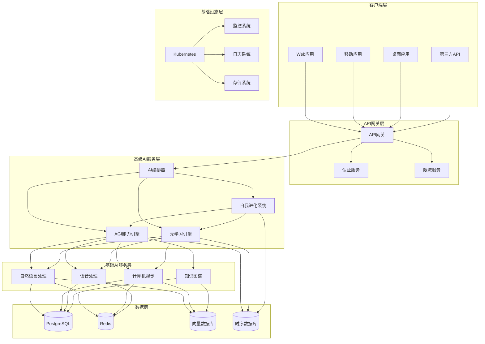
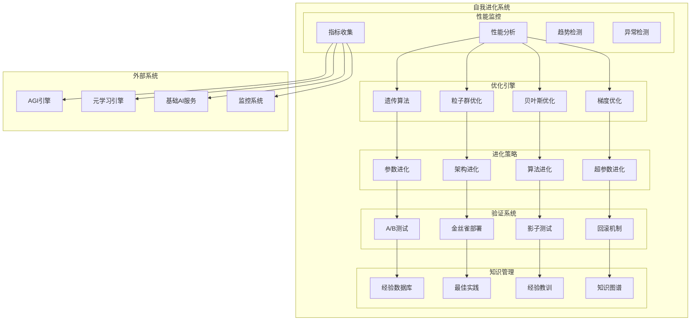
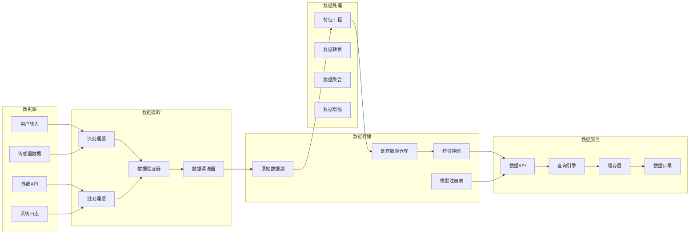
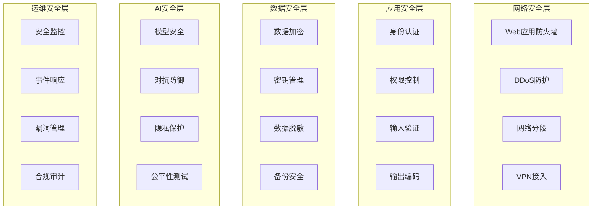
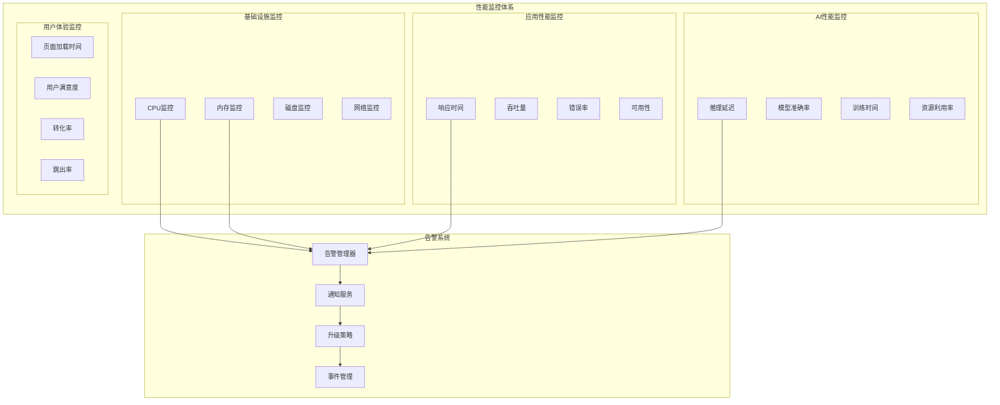
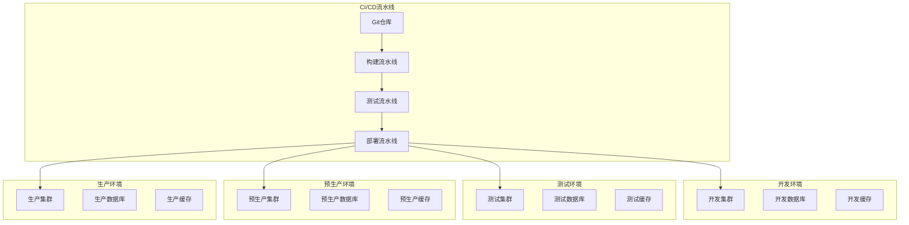

```mermaid
graph TB
    subgraph "AGI能力引擎"
        subgraph "推理模块"
            DeductiveReasoning[演绎推理]
            InductiveReasoning[归纳推理]
            AbductiveReasoning[溯因推理]
            CausalReasoning[因果推理]
        end
        
        subgraph "规划模块"
            TaskPlanning[任务规划]
            ResourcePlanning[资源规划]
            RiskAssessment[风险评估]
            PlanOptimization[计划优化]
        end
        
        subgraph "学习模块"
            OnlineLearning[在线学习]
            TransferLearning[迁移学习]
            FewShotLearning[少样本学习]
            ContinualLearning[持续学习]
        end
        
        subgraph "创造模块"
            ContentGeneration[内容生成]
            SolutionGeneration[解决方案生成]
            NoveltyDetection[新颖性检测]
            CreativityEvaluation[创造性评估]
        end
        
        subgraph "多模态模块"
            TextProcessing[文本处理]
            ImageProcessing[图像处理]
            AudioProcessing[音频处理]
            VideoProcessing[视频处理]
            CrossModalFusion[跨模态融合]
        end
        
        subgraph "元认知模块"
            SelfAwareness[自我意识]
            MetaCognition[元认知]
            ConfidenceEstimation[置信度估计]
            UncertaintyQuantification[不确定性量化]
        end
    end
    
    subgraph "外部接口"
        ReasoningAPI[推理API]
        PlanningAPI[规划API]
        LearningAPI[学习API]
        CreativityAPI[创造API]
        MultimodalAPI[多模态API]
        MetacognitionAPI[元认知API]
    end
    
    ReasoningAPI --> DeductiveReasoning
    ReasoningAPI --> InductiveReasoning
    ReasoningAPI --> AbductiveReasoning
    ReasoningAPI --> CausalReasoning
    
    PlanningAPI --> TaskPlanning
    PlanningAPI --> ResourcePlanning
    PlanningAPI --> RiskAssessment
    PlanningAPI --> PlanOptimization
    
    LearningAPI --> OnlineLearning
    LearningAPI --> TransferLearning
    LearningAPI --> FewShotLearning
    LearningAPI --> ContinualLearning
    
    CreativityAPI --> ContentGeneration
    CreativityAPI --> SolutionGeneration
    CreativityAPI --> NoveltyDetection
    CreativityAPI --> CreativityEvaluation
    
    MultimodalAPI --> TextProcessing
    MultimodalAPI --> ImageProcessing
    MultimodalAPI --> AudioProcessing
    MultimodalAPI --> VideoProcessing
    MultimodalAPI --> CrossModalFusion
    
    MetacognitionAPI --> SelfAwareness
    MetacognitionAPI --> MetaCognition
    MetacognitionAPI --> ConfidenceEstimation
    MetacognitionAPI --> UncertaintyQuantification
```

```mermaid
graph TB
    subgraph "元学习引擎"
        subgraph "策略学习"
            MAML[MAML算法]
            Reptile[Reptile算法]
            Prototypical[原型网络]
            Matching[匹配网络]
        end
        
        subgraph "快速适应"
            FewShotAdaptation[少样本适应]
            ZeroShotAdaptation[零样本适应]
            OnlineAdaptation[在线适应]
            ContinualAdaptation[持续适应]
        end
        
        subgraph "知识迁移"
            FeatureTransfer[特征迁移]
            ParameterTransfer[参数迁移]
            GradientTransfer[梯度迁移]
            StructureTransfer[结构迁移]
        end
        
        subgraph "性能优化"
            HyperparameterOptimization[超参数优化]
            ArchitectureSearch[架构搜索]
            LearningRateScheduling[学习率调度]
            RegularizationTuning[正则化调优]
        end
        
        subgraph "评估系统"
            PerformanceMetrics[性能指标]
            GeneralizationAssessment[泛化评估]
            AdaptationSpeed[适应速度]
            StabilityAnalysis[稳定性分析]
        end
    end
    
    subgraph "数据管理"
        TaskRepository[任务仓库]
        ModelRepository[模型仓库]
        MetaDatastore[元数据存储]
        ExperienceBuffer[经验缓冲区]
    end
    
    MAML --> TaskRepository
    Reptile --> TaskRepository
    Prototypical --> TaskRepository
    Matching --> TaskRepository
    
    FewShotAdaptation --> ModelRepository
    ZeroShotAdaptation --> ModelRepository
    OnlineAdaptation --> ExperienceBuffer
    ContinualAdaptation --> ExperienceBuffer
    
    FeatureTransfer --> MetaDatastore
    ParameterTransfer --> MetaDatastore
    GradientTransfer --> MetaDatastore
    StructureTransfer --> MetaDatastore
    
    HyperparameterOptimization --> PerformanceMetrics
    ArchitectureSearch --> PerformanceMetrics
    LearningRateScheduling --> PerformanceMetrics
    RegularizationTuning --> PerformanceMetrics
```

# 高级AI功能技术架构

## 概述

本文档详细描述了太上老君项目中高级AI功能的技术架构，包括AGI能力、元学习引擎和自我进化系统的设计理念、架构模式和实现细节。

## 架构原则

### 1. 设计原则

- **模块化设计**: 各AI组件独立开发、部署和扩展
- **可扩展性**: 支持水平和垂直扩展
- **高可用性**: 99.9%的服务可用性保证
- **实时性**: 毫秒级响应时间
- **自适应性**: 系统能够自主学习和优化
- **安全性**: 多层安全防护机制

### 2. 技术原则

- **云原生**: 基于Kubernetes的容器化部署
- **微服务**: 服务间松耦合，高内聚
- **事件驱动**: 异步消息处理机制
- **数据驱动**: 基于数据的决策和优化
- **API优先**: RESTful API和GraphQL支持

## 整体架构

## 核心组件架构

### 1. AGI能力引擎

#### 架构设计

#### 技术实现

**推理引擎**:
- **符号推理**: 基于逻辑规则的推理系统
- **神经推理**: 基于深度学习的推理网络
- **混合推理**: 符号和神经方法的结合
- **因果推理**: 基于因果图的推理机制

**规划系统**:
- **分层规划**: 多层次任务分解
- **动态规划**: 实时调整执行计划
- **多目标优化**: 平衡多个目标函数
- **不确定性处理**: 处理不完全信息

**学习机制**:
- **元学习**: 学会如何学习
- **终身学习**: 持续积累知识
- **多任务学习**: 同时学习多个任务
- **自监督学习**: 从无标签数据学习

### 2. 元学习引擎

#### 架构设计

#### 技术实现

**元学习算法**:
- **MAML**: 模型无关的元学习
- **Reptile**: 简化的元学习算法
- **原型网络**: 基于距离的分类
- **匹配网络**: 基于注意力的学习

**适应机制**:
- **梯度下降**: 基于梯度的快速适应
- **贝叶斯优化**: 基于概率的参数调优
- **进化算法**: 基于进化的结构搜索
- **强化学习**: 基于奖励的策略学习

### 3. 自我进化系统

#### 架构设计

#### 技术实现

**性能监控**:
- **实时指标**: CPU、内存、响应时间
- **业务指标**: 准确率、吞吐量、用户满意度
- **系统指标**: 错误率、可用性、延迟
- **AI指标**: 模型性能、推理质量

**优化算法**:
- **遗传算法**: 全局搜索优化
- **粒子群优化**: 群体智能优化
- **贝叶斯优化**: 概率模型优化
- **梯度优化**: 局部搜索优化

**进化机制**:
- **参数进化**: 自动调优模型参数
- **架构进化**: 自动设计网络结构
- **算法进化**: 自动选择最优算法
- **策略进化**: 自动优化决策策略

## 数据架构

### 1. 数据流设计

### 2. 存储策略

**关系型数据库 (PostgreSQL)**:
- 用户数据和配置信息
- 系统元数据和审计日志
- 事务性数据处理
- ACID特性保证

**缓存系统 (Redis)**:
- 会话数据和临时状态
- 频繁访问的计算结果
- 分布式锁和消息队列
- 实时数据缓存

**向量数据库**:
- 嵌入向量存储和检索
- 相似性搜索和推荐
- 知识图谱向量化
- 多模态数据索引

**时序数据库**:
- 性能指标和监控数据
- 系统日志和事件流
- 用户行为轨迹
- 实时分析和告警

## 安全架构

### 1. 安全层次

### 2. 安全机制

**身份认证**:
- JWT令牌认证
- OAuth 2.0集成
- 多因素认证
- 单点登录(SSO)

**权限控制**:
- 基于角色的访问控制(RBAC)
- 基于属性的访问控制(ABAC)
- 细粒度权限管理
- 动态权限调整

**数据保护**:
- 端到端加密
- 静态数据加密
- 传输数据加密
- 密钥轮换机制

**AI安全**:
- 模型水印和版权保护
- 对抗样本检测和防御
- 差分隐私保护
- 联邦学习安全

## 性能架构

### 1. 性能优化策略

**计算优化**:
- GPU加速计算
- 模型量化和剪枝
- 并行和分布式计算
- 异步处理机制

**存储优化**:
- 分层存储策略
- 数据压缩和去重
- 智能缓存策略
- 预取和预加载

**网络优化**:
- CDN内容分发
- 负载均衡策略
- 连接池管理
- 数据压缩传输

**系统优化**:
- 容器化部署
- 微服务架构
- 自动扩缩容
- 资源调度优化

### 2. 性能监控

## 部署架构

### 1. 容器化部署

**Docker容器**:
- 应用容器化封装
- 多阶段构建优化
- 镜像安全扫描
- 容器运行时安全

**Kubernetes编排**:
- 自动化部署和扩缩
- 服务发现和负载均衡
- 配置管理和密钥管理
- 健康检查和自愈机制

### 2. 多环境部署

## 监控和运维

### 1. 监控体系

**基础设施监控**:
- Prometheus + Grafana
- 节点和容器监控
- 资源使用情况
- 系统健康状态

**应用监控**:
- APM性能监控
- 分布式链路追踪
- 错误和异常监控
- 业务指标监控

**AI监控**:
- 模型性能监控
- 推理质量监控
- 训练进度监控
- 数据漂移检测

### 2. 日志管理

**日志收集**:
- 结构化日志格式
- 统一日志收集
- 实时日志流处理
- 日志聚合和索引

**日志分析**:
- ELK技术栈
- 日志搜索和查询
- 异常模式识别
- 日志可视化展示

## 扩展性设计

### 1. 水平扩展

**服务扩展**:
- 无状态服务设计
- 负载均衡策略
- 自动扩缩容机制
- 服务网格管理

**数据扩展**:
- 数据库分片
- 读写分离
- 缓存分布式
- 存储弹性扩展

### 2. 垂直扩展

**计算资源**:
- CPU和内存升级
- GPU加速支持
- 专用硬件优化
- 资源动态调整

**存储资源**:
- 高性能存储
- 存储容量扩展
- 存储性能优化
- 数据生命周期管理

## 技术栈总结

### 后端技术栈

- **编程语言**: Go, Python
- **框架**: Gin, FastAPI
- **数据库**: PostgreSQL, Redis
- **消息队列**: Apache Kafka, RabbitMQ
- **搜索引擎**: Elasticsearch
- **AI框架**: PyTorch, TensorFlow
- **容器化**: Docker, Kubernetes

### 前端技术栈

- **框架**: Vue.js 3, React
- **构建工具**: Vite, Webpack
- **UI库**: Element Plus, Ant Design
- **状态管理**: Pinia, Redux
- **类型检查**: TypeScript

### 基础设施技术栈

- **云平台**: AWS, Azure, GCP
- **容器编排**: Kubernetes
- **服务网格**: Istio
- **监控**: Prometheus, Grafana
- **日志**: ELK Stack
- **CI/CD**: GitLab CI, Jenkins

### AI/ML技术栈

- **深度学习**: PyTorch, TensorFlow
- **机器学习**: Scikit-learn, XGBoost
- **自然语言处理**: Transformers, spaCy
- **计算机视觉**: OpenCV, PIL
- **强化学习**: Stable Baselines3
- **MLOps**: MLflow, Kubeflow

## 未来发展规划

### 短期目标 (3-6个月)

1. **性能优化**: 提升推理速度和准确率
2. **功能增强**: 增加更多AI能力
3. **稳定性提升**: 提高系统可靠性
4. **用户体验**: 优化API和界面

### 中期目标 (6-12个月)

1. **多模态融合**: 深度整合多模态能力
2. **边缘计算**: 支持边缘设备部署
3. **联邦学习**: 实现分布式学习
4. **自动化运维**: 完全自动化的运维体系

### 长期目标 (1-2年)

1. **通用人工智能**: 接近AGI的能力
2. **量子计算**: 集成量子计算能力
3. **生物启发**: 融入生物神经网络
4. **意识模拟**: 探索人工意识实现

## 总结

本架构文档详细描述了高级AI功能的技术架构设计，涵盖了从系统架构到具体实现的各个层面。通过模块化、可扩展的设计，系统能够支持复杂的AI功能，同时保证高性能、高可用性和安全性。

随着技术的不断发展和需求的变化，架构将持续演进和优化，以适应未来的挑战和机遇。