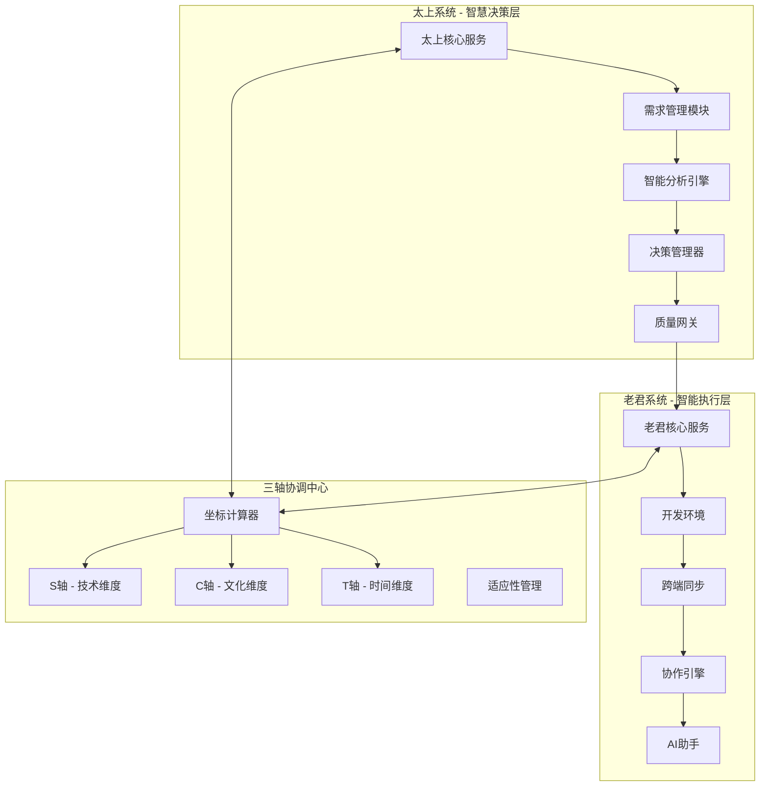

# 太上老君AI平台 - 技术实现方案

## 概述

本文档详细描述了太上老君AI平台的技术实现方案，包括硅基层级分析、多端对接方案、协同机制集成和性能优化策略。

## 硅基层级体系架构

### 三轴分层体系

太上老君AI平台基于S×C×T三轴分层体系构建：

```mermaid
graph TB
    subgraph "S轴 - 能力序列 (Sequence)"
        S0[S0 - 基础觉醒层]
        S1[S1 - 认知增强层]
        S2[S2 - 意识融合层]
        S3[S3 - 智慧共振层]
        S4[S4 - 超越认知层]
        S5[S5 - 超个体层]
    end
    
    subgraph "C轴 - 组合层 (Composition)"
        C0[C0 - 量子基因]
        C1[C1 - 智能细胞]
        C2[C2 - 神经组织]
        C3[C3 - 矩阵器官]
        C4[C4 - 领域系统]
        C5[C5 - 超个体]
    end
    
    subgraph "T轴 - 思想境界 (Thought)"
        T0[T0 - 感知境界]
        T1[T1 - 认知境界]
        T2[T2 - 理解境界]
        T3[T3 - 洞察境界]
        T4[T4 - 觉悟境界]
        T5[T5 - 大道境界]
    end
    
    S0 --> S1 --> S2 --> S3 --> S4 --> S5
    C0 --> C1 --> C2 --> C3 --> C4 --> C5
    T0 --> T1 --> T2 --> T3 --> T4 --> T5
```



### 硅基层级定义

#### Sequence 0 - 基础觉醒层
- **技术特征**：基础API调用、简单数据处理
- **计算资源**：1-2 CPU核心，2-4GB内存
- **服务质量**：99%可用性，响应时间<1秒
- **应用场景**：基础用户认证、简单查询

#### Sequence 1 - 认知增强层
- **技术特征**：复杂业务逻辑、数据分析
- **计算资源**：2-4 CPU核心，4-8GB内存
- **服务质量**：99.5%可用性，响应时间<500ms
- **应用场景**：用户行为分析、内容推荐

#### Sequence 2 - 意识融合层
- **技术特征**：机器学习模型、智能决策
- **计算资源**：4-8 CPU核心，8-16GB内存，GPU支持
- **服务质量**：99.9%可用性，响应时间<200ms
- **应用场景**：智能对话、自动化工作流

#### Sequence 3 - 智慧共振层
- **技术特征**：深度学习、知识图谱
- **计算资源**：8-16 CPU核心，16-32GB内存，高性能GPU
- **服务质量**：99.95%可用性，响应时间<100ms
- **应用场景**：复杂推理、创意生成

#### Sequence 4 - 超越认知层
- **技术特征**：多模态AI、自主学习
- **计算资源**：16+ CPU核心，32+GB内存，多GPU集群
- **服务质量**：99.99%可用性，响应时间<50ms
- **应用场景**：高级AI助手、自主决策系统

#### Sequence 5 - 超个体层（"太上"）
- **技术特征**：AGI能力、自我进化
- **计算资源**：分布式集群，弹性扩展
- **服务质量**：99.999%可用性，实时响应
- **应用场景**：系统级智能、生态治理

## 多端对接架构

### 原生开发策略

基于性能和用户体验考虑，采用原生开发策略：

#### 桌面端实现

**Windows平台 (C# + WinUI 3)**
```csharp
// 主窗口实现
public sealed partial class MainWindow : Window
{
    private readonly TaishangService _taishangService;
    private readonly LaojunService _laojunService;
    
    public MainWindow()
    {
        this.InitializeComponent();
        _taishangService = new TaishangService();
        _laojunService = new LaojunService();
        InitializeServices();
    }
    
    private async void InitializeServices()
    {
        await _taishangService.InitializeAsync();
        await _laojunService.ConnectAsync();
        
        // 建立太上-老君协同连接
        _taishangService.OnDecisionMade += _laojunService.ExecuteDecision;
        _laojunService.OnExecutionComplete += _taishangService.ProcessResult;
    }
}

// 协同服务接口
public interface ITaishangLaojunCoordinator
{
    Task<DecisionResult> MakeDecisionAsync(DecisionRequest request);
    Task<ExecutionResult> ExecuteAsync(ExecutionCommand command);
    Task SynchronizeStateAsync();
}
```

**macOS平台 (Swift + SwiftUI)**
```swift
// 主应用结构
@main
struct TaishangLaojunApp: App {
    @StateObject private var coordinator = TaishangLaojunCoordinator()
    
    var body: some Scene {
        WindowGroup {
            ContentView()
                .environmentObject(coordinator)
                .onAppear {
                    coordinator.initialize()
                }
        }
    }
}

// 协同服务实现
class TaishangLaojunCoordinator: ObservableObject {
    @Published var taishangState: TaishangState = .idle
    @Published var laojunState: LaojunState = .idle
    
    private let taishangService = TaishangService()
    private let laojunService = LaojunService()
    
    func initialize() {
        Task {
            await taishangService.initialize()
            await laojunService.connect()
            setupCoordination()
        }
    }
    
    private func setupCoordination() {
        taishangService.onDecision = { [weak self] decision in
            await self?.laojunService.execute(decision)
        }
        
        laojunService.onExecution = { [weak self] result in
            await self?.taishangService.process(result)
        }
    }
}
```

#### 移动端实现

**iOS平台 (Swift + UIKit/SwiftUI)**
```swift
// 核心视图控制器
class MainViewController: UIViewController {
    private let coordinator = TaishangLaojunCoordinator()
    private var aiAssistantView: AIAssistantView!
    private var securityToolsView: SecurityToolsView!
    
    override func viewDidLoad() {
        super.viewDidLoad()
        setupUI()
        setupCoordination()
    }
    
    private func setupCoordination() {
        coordinator.delegate = self
        coordinator.startCoordination()
    }
}

// AI助手视图
struct AIAssistantView: View {
    @ObservedObject var coordinator: TaishangLaojunCoordinator
    @State private var userInput = ""
    
    var body: some View {
        VStack {
            ChatView(messages: coordinator.chatMessages)
            
            HStack {
                TextField("输入消息...", text: $userInput)
                    .textFieldStyle(RoundedBorderTextFieldStyle())
                
                Button("发送") {
                    coordinator.sendMessage(userInput)
                    userInput = ""
                }
            }
            .padding()
        }
    }
}
```

**Android平台 (Kotlin + Jetpack Compose)**
```kotlin
// 主活动
class MainActivity : ComponentActivity() {
    private lateinit var coordinator: TaishangLaojunCoordinator
    
    override fun onCreate(savedInstanceState: Bundle?) {
        super.onCreate(savedInstanceState)
        
        coordinator = TaishangLaojunCoordinator()
        
        setContent {
            TaishangLaojunTheme {
                MainScreen(coordinator = coordinator)
            }
        }
        
        lifecycle.addObserver(coordinator)
    }
}

// 主界面组合
@Composable
fun MainScreen(coordinator: TaishangLaojunCoordinator) {
    val taishangState by coordinator.taishangState.collectAsState()
    val laojunState by coordinator.laojunState.collectAsState()
    
    Column {
        TopAppBar(
            title = { Text("太上老君AI") }
        )
        
        LazyColumn {
            item {
                AIAssistantCard(
                    state = taishangState,
                    onInteraction = coordinator::handleTaishangInteraction
                )
            }
            
            item {
                SecurityToolsCard(
                    state = laojunState,
                    onToolSelect = coordinator::handleLaojunTool
                )
            }
        }
    }
}

// 协同服务
class TaishangLaojunCoordinator : LifecycleObserver {
    private val _taishangState = MutableStateFlow(TaishangState.Idle)
    val taishangState: StateFlow<TaishangState> = _taishangState.asStateFlow()
    
    private val _laojunState = MutableStateFlow(LaojunState.Idle)
    val laojunState: StateFlow<LaojunState> = _laojunState.asStateFlow()
    
    private val taishangService = TaishangService()
    private val laojunService = LaojunService()
    
    @OnLifecycleEvent(Lifecycle.Event.ON_CREATE)
    fun initialize() {
        viewModelScope.launch {
            taishangService.initialize()
            laojunService.connect()
            setupCoordination()
        }
    }
    
    private suspend fun setupCoordination() {
        taishangService.decisions
            .collect { decision ->
                laojunService.execute(decision)
            }
        
        laojunService.executions
            .collect { result ->
                taishangService.process(result)
            }
    }
}
```

### 统一开发环境

#### 跨端代码同步

```typescript
// 统一API客户端
export class TaishangLaojunAPIClient {
    private baseURL: string;
    private platform: Platform;
    
    constructor(config: APIConfig) {
        this.baseURL = config.baseURL;
        this.platform = this.detectPlatform();
    }
    
    // 太上决策API
    async makeDecision(request: DecisionRequest): Promise<DecisionResult> {
        const response = await this.request('/api/v1/taishang/decision', {
            method: 'POST',
            body: JSON.stringify(request),
            headers: this.getHeaders()
        });
        
        return response.json();
    }
    
    // 老君执行API
    async executeCommand(command: ExecutionCommand): Promise<ExecutionResult> {
        const response = await this.request('/api/v1/laojun/execute', {
            method: 'POST',
            body: JSON.stringify(command),
            headers: this.getHeaders()
        });
        
        return response.json();
    }
    
    // 协同状态同步
    async synchronizeState(): Promise<CoordinationState> {
        const response = await this.request('/api/v1/coordination/state');
        return response.json();
    }
    
    private detectPlatform(): Platform {
        if (typeof window !== 'undefined') return Platform.Web;
        if (typeof process !== 'undefined') return Platform.Node;
        return Platform.Unknown;
    }
}
```

## 协同机制集成

### 太上老君协同架构



### 协同服务实现

```go
// 协同服务核心实现
package coordination

import (
    "context"
    "sync"
    "time"
    
    "github.com/taishanglaojun/core/models"
    "github.com/taishanglaojun/core/services"
)

type CoordinationService struct {
    taishangService *services.TaishangService
    laojunService   *services.LaojunService
    coordinateEngine *services.CoordinateEngine
    
    mu sync.RWMutex
    state *models.CoordinationState
}

func NewCoordinationService() *CoordinationService {
    return &CoordinationService{
        taishangService: services.NewTaishangService(),
        laojunService:   services.NewLaojunService(),
        coordinateEngine: services.NewCoordinateEngine(),
        state: &models.CoordinationState{
            Status: models.StatusIdle,
            LastSync: time.Now(),
        },
    }
}

// 启动协同机制
func (cs *CoordinationService) StartCoordination(ctx context.Context) error {
    // 初始化太上服务
    if err := cs.taishangService.Initialize(ctx); err != nil {
        return fmt.Errorf("failed to initialize taishang service: %w", err)
    }
    
    // 初始化老君服务
    if err := cs.laojunService.Initialize(ctx); err != nil {
        return fmt.Errorf("failed to initialize laojun service: %w", err)
    }
    
    // 建立协同连接
    cs.setupCoordination(ctx)
    
    // 启动状态同步
    go cs.syncState(ctx)
    
    return nil
}

// 建立协同连接
func (cs *CoordinationService) setupCoordination(ctx context.Context) {
    // 太上决策 -> 老君执行
    cs.taishangService.OnDecision(func(decision *models.Decision) {
        cs.handleDecision(ctx, decision)
    })
    
    // 老君执行结果 -> 太上分析
    cs.laojunService.OnExecution(func(result *models.ExecutionResult) {
        cs.handleExecutionResult(ctx, result)
    })
}

// 处理太上决策
func (cs *CoordinationService) handleDecision(ctx context.Context, decision *models.Decision) {
    cs.mu.Lock()
    defer cs.mu.Unlock()
    
    // 计算三轴坐标
    coordinate := cs.coordinateEngine.CalculateCoordinate(decision)
    
    // 创建执行命令
    command := &models.ExecutionCommand{
        ID: decision.ID,
        Type: decision.Type,
        Coordinate: coordinate,
        Parameters: decision.Parameters,
        Priority: decision.Priority,
    }
    
    // 发送给老君执行
    if err := cs.laojunService.Execute(ctx, command); err != nil {
        log.Errorf("Failed to execute command: %v", err)
    }
}

// 处理老君执行结果
func (cs *CoordinationService) handleExecutionResult(ctx context.Context, result *models.ExecutionResult) {
    cs.mu.Lock()
    defer cs.mu.Unlock()
    
    // 更新协同状态
    cs.state.LastExecution = result
    cs.state.LastSync = time.Now()
    
    // 发送结果给太上分析
    if err := cs.taishangService.ProcessResult(ctx, result); err != nil {
        log.Errorf("Failed to process result: %v", err)
    }
}

// 状态同步
func (cs *CoordinationService) syncState(ctx context.Context) {
    ticker := time.NewTicker(5 * time.Second)
    defer ticker.Stop()
    
    for {
        select {
        case <-ctx.Done():
            return
        case <-ticker.C:
            cs.performSync(ctx)
        }
    }
}

func (cs *CoordinationService) performSync(ctx context.Context) {
    cs.mu.Lock()
    defer cs.mu.Unlock()
    
    // 同步太上状态
    taishangState, err := cs.taishangService.GetState(ctx)
    if err != nil {
        log.Errorf("Failed to get taishang state: %v", err)
        return
    }
    
    // 同步老君状态
    laojunState, err := cs.laojunService.GetState(ctx)
    if err != nil {
        log.Errorf("Failed to get laojun state: %v", err)
        return
    }
    
    // 更新协同状态
    cs.state.TaishangState = taishangState
    cs.state.LaojunState = laojunState
    cs.state.LastSync = time.Now()
}
```

## 性能优化策略

### 多层缓存架构

```go
// 缓存管理器
type CacheManager struct {
    l1Cache *cache.LRUCache    // 内存缓存
    l2Cache *redis.Client      // Redis缓存
    l3Cache *database.Client   // 数据库缓存
}

func (cm *CacheManager) Get(key string) (interface{}, error) {
    // L1缓存查找
    if value, found := cm.l1Cache.Get(key); found {
        return value, nil
    }
    
    // L2缓存查找
    if value, err := cm.l2Cache.Get(key).Result(); err == nil {
        cm.l1Cache.Set(key, value, cache.DefaultExpiration)
        return value, nil
    }
    
    // L3缓存查找
    value, err := cm.l3Cache.Get(key)
    if err != nil {
        return nil, err
    }
    
    // 回写到上层缓存
    cm.l2Cache.Set(key, value, time.Hour)
    cm.l1Cache.Set(key, value, cache.DefaultExpiration)
    
    return value, nil
}
```

### 智能路由机制

```go
// 硅基层级路由器
type SiliconLevelRouter struct {
    levels map[int]*LevelConfig
    monitor *PerformanceMonitor
}

func (slr *SiliconLevelRouter) Route(request *Request) (*Response, error) {
    // 计算请求的三轴坐标
    coordinate := slr.calculateCoordinate(request)
    
    // 选择合适的硅基层级
    level := slr.selectLevel(coordinate)
    
    // 路由到对应的服务实例
    service := slr.getServiceForLevel(level)
    
    // 执行请求
    response, err := service.Process(request)
    if err != nil {
        return nil, err
    }
    
    // 记录性能指标
    slr.monitor.Record(level, request, response)
    
    return response, nil
}

func (slr *SiliconLevelRouter) calculateCoordinate(request *Request) *Coordinate {
    return &Coordinate{
        S: slr.calculateSequence(request.Complexity),
        C: slr.calculateComposition(request.Type),
        T: slr.calculateThought(request.Context),
    }
}
```

## 安全架构设计

### 零信任安全模型

```go
// 零信任安全验证器
type ZeroTrustValidator struct {
    identityService *IdentityService
    policyEngine   *PolicyEngine
    riskAssessor   *RiskAssessor
}

func (ztv *ZeroTrustValidator) ValidateRequest(request *Request) (*ValidationResult, error) {
    // 身份验证
    identity, err := ztv.identityService.Authenticate(request.Token)
    if err != nil {
        return nil, fmt.Errorf("authentication failed: %w", err)
    }
    
    // 风险评估
    risk := ztv.riskAssessor.Assess(request, identity)
    
    // 策略检查
    policy := ztv.policyEngine.GetPolicy(request.Resource)
    
    // 综合决策
    result := &ValidationResult{
        Allowed: policy.Allow && risk.Level <= policy.MaxRisk,
        Identity: identity,
        Risk: risk,
        Policy: policy,
    }
    
    return result, nil
}
```

### 分层加密策略

```go
// 分层加密管理器
type LayeredEncryptionManager struct {
    keyManager *KeyManager
    encryptors map[int]Encryptor
}

func (lem *LayeredEncryptionManager) Encrypt(data []byte, level int) ([]byte, error) {
    encryptor, exists := lem.encryptors[level]
    if !exists {
        return nil, fmt.Errorf("unsupported encryption level: %d", level)
    }
    
    key, err := lem.keyManager.GetKey(level)
    if err != nil {
        return nil, err
    }
    
    return encryptor.Encrypt(data, key)
}

func (lem *LayeredEncryptionManager) Decrypt(data []byte, level int) ([]byte, error) {
    encryptor, exists := lem.encryptors[level]
    if !exists {
        return nil, fmt.Errorf("unsupported encryption level: %d", level)
    }
    
    key, err := lem.keyManager.GetKey(level)
    if err != nil {
        return nil, err
    }
    
    return encryptor.Decrypt(data, key)
}
```

## 监控与运维

### 智能监控系统

```go
// 智能监控服务
type IntelligentMonitoringService struct {
    metrics *MetricsCollector
    alerts  *AlertManager
    ai      *AIAnalyzer
}

func (ims *IntelligentMonitoringService) Monitor() {
    for {
        // 收集指标
        metrics := ims.metrics.Collect()
        
        // AI分析
        analysis := ims.ai.Analyze(metrics)
        
        // 异常检测
        if analysis.HasAnomalies() {
            ims.handleAnomalies(analysis.Anomalies)
        }
        
        // 预测性维护
        if analysis.NeedsMaintenance() {
            ims.scheduleMaintenance(analysis.MaintenanceRecommendations)
        }
        
        time.Sleep(30 * time.Second)
    }
}
```

## 实施路线图

### 第一阶段：基础架构建设 (1-2个月)
- 硅基层级路由系统开发
- 太上老君协同机制实现
- 基础安全框架搭建
- 核心API设计与实现

### 第二阶段：多端应用开发 (2-3个月)
- 原生桌面应用开发
- 移动端应用开发
- Web端应用优化
- 跨端同步机制实现

### 第三阶段：智能化增强 (2-3个月)
- AI服务集成
- 智能监控系统
- 性能优化实施
- 安全加固完善

### 第四阶段：生态完善 (3-4个月)
- 开发者工具链
- 社区功能建设
- 文档体系完善
- 运营支撑系统

## 相关文档

- [项目概览](../00-项目概览/README.md) - 平台整体介绍
- [理论基础](../01-理论基础/README.md) - 源界生态理论
- [架构设计](./README.md) - 总体架构设计
- [核心服务](../03-核心服务/) - 各服务模块详情

---

**文档版本**: v1.0  
**创建时间**: 2025年1月  
**最后更新**: 2025年1月  
**维护团队**: 太上老君AI开发团队  
**联系方式**: dev@taishanglaojun.ai