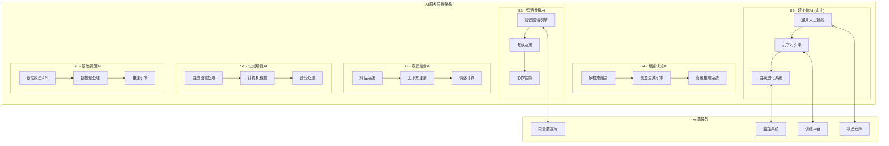

# 太上老君AI平台 - AI智能服务

## 概述

太上老君AI平台的AI智能服务是整个系统的核心大脑，基于S×C×T三轴理论构建了分层的AI服务架构，提供从基础的自然语言处理到高级的AGI能力的全栈AI服务。

## 服务架构

### 整体架构图



## 核心AI服务

### 1. 自然语言处理服务 (S1级别)

#### 服务特性
- **文本理解**：语义分析、实体识别、情感分析
- **文本生成**：内容创作、摘要生成、翻译服务
- **对话处理**：意图识别、槽位填充、回复生成

#### 技术实现

```go
// NLP服务实现
package nlp

import (
    "context"
    "encoding/json"
    "fmt"
    
    "github.com/taishanglaojun/ai/models"
    "github.com/taishanglaojun/ai/transformers"
)

type NLPService struct {
    textProcessor   *transformers.TextProcessor
    entityExtractor *transformers.EntityExtractor
    sentimentAnalyzer *transformers.SentimentAnalyzer
    translator      *transformers.Translator
}

func NewNLPService() *NLPService {
    return &NLPService{
        textProcessor:   transformers.NewTextProcessor("bert-base-chinese"),
        entityExtractor: transformers.NewEntityExtractor("ner-chinese"),
        sentimentAnalyzer: transformers.NewSentimentAnalyzer("sentiment-chinese"),
        translator:      transformers.NewTranslator("opus-mt-zh-en"),
    }
}

// 文本理解
func (nlp *NLPService) UnderstandText(ctx context.Context, text string) (*models.TextUnderstanding, error) {
    // 文本预处理
    processed := nlp.textProcessor.Process(text)
    
    // 实体识别
    entities, err := nlp.entityExtractor.Extract(ctx, processed)
    if err != nil {
        return nil, fmt.Errorf("entity extraction failed: %w", err)
    }
    
    // 情感分析
    sentiment, err := nlp.sentimentAnalyzer.Analyze(ctx, processed)
    if err != nil {
        return nil, fmt.Errorf("sentiment analysis failed: %w", err)
    }
    
    // 语义向量化
    embedding, err := nlp.textProcessor.GetEmbedding(ctx, processed)
    if err != nil {
        return nil, fmt.Errorf("embedding generation failed: %w", err)
    }
    
    return &models.TextUnderstanding{
        OriginalText: text,
        ProcessedText: processed,
        Entities: entities,
        Sentiment: sentiment,
        Embedding: embedding,
        Confidence: nlp.calculateConfidence(entities, sentiment),
    }, nil
}

// 文本生成
func (nlp *NLPService) GenerateText(ctx context.Context, prompt string, options *models.GenerationOptions) (*models.GeneratedText, error) {
    // 构建生成请求
    request := &models.GenerationRequest{
        Prompt: prompt,
        MaxLength: options.MaxLength,
        Temperature: options.Temperature,
        TopP: options.TopP,
        TopK: options.TopK,
    }
    
    // 调用生成模型
    result, err := nlp.textProcessor.Generate(ctx, request)
    if err != nil {
        return nil, fmt.Errorf("text generation failed: %w", err)
    }
    
    return &models.GeneratedText{
        Text: result.Text,
        Confidence: result.Confidence,
        Tokens: result.Tokens,
        Metadata: result.Metadata,
    }, nil
}

// 对话处理
func (nlp *NLPService) ProcessDialogue(ctx context.Context, dialogue *models.Dialogue) (*models.DialogueResponse, error) {
    // 意图识别
    intent, err := nlp.recognizeIntent(ctx, dialogue.UserInput)
    if err != nil {
        return nil, fmt.Errorf("intent recognition failed: %w", err)
    }
    
    // 槽位填充
    slots, err := nlp.extractSlots(ctx, dialogue.UserInput, intent)
    if err != nil {
        return nil, fmt.Errorf("slot extraction failed: %w", err)
    }
    
    // 生成回复
    response, err := nlp.generateResponse(ctx, dialogue, intent, slots)
    if err != nil {
        return nil, fmt.Errorf("response generation failed: %w", err)
    }
    
    return &models.DialogueResponse{
        Intent: intent,
        Slots: slots,
        Response: response,
        Confidence: nlp.calculateDialogueConfidence(intent, slots, response),
    }, nil
}
```

### 2. 知识图谱服务 (S3级别)

#### 服务特性
- **知识抽取**：从文本中自动抽取实体和关系
- **知识推理**：基于图结构的逻辑推理
- **知识问答**：基于知识图谱的智能问答

#### 技术实现

```go
// 知识图谱服务
package knowledge

import (
    "context"
    "fmt"
    
    "github.com/taishanglaojun/ai/graph"
    "github.com/taishanglaojun/ai/models"
)

type KnowledgeGraphService struct {
    graphDB     *graph.Database
    reasoner    *graph.Reasoner
    extractor   *graph.EntityExtractor
    embedder    *graph.GraphEmbedder
}

func NewKnowledgeGraphService() *KnowledgeGraphService {
    return &KnowledgeGraphService{
        graphDB:   graph.NewDatabase("neo4j://localhost:7687"),
        reasoner:  graph.NewReasoner(),
        extractor: graph.NewEntityExtractor(),
        embedder:  graph.NewGraphEmbedder(),
    }
}

// 知识抽取
func (kg *KnowledgeGraphService) ExtractKnowledge(ctx context.Context, text string) (*models.KnowledgeExtraction, error) {
    // 实体抽取
    entities, err := kg.extractor.ExtractEntities(ctx, text)
    if err != nil {
        return nil, fmt.Errorf("entity extraction failed: %w", err)
    }
    
    // 关系抽取
    relations, err := kg.extractor.ExtractRelations(ctx, text, entities)
    if err != nil {
        return nil, fmt.Errorf("relation extraction failed: %w", err)
    }
    
    // 构建知识三元组
    triples := kg.buildTriples(entities, relations)
    
    // 存储到图数据库
    if err := kg.graphDB.StoreTriples(ctx, triples); err != nil {
        return nil, fmt.Errorf("knowledge storage failed: %w", err)
    }
    
    return &models.KnowledgeExtraction{
        Entities: entities,
        Relations: relations,
        Triples: triples,
        Confidence: kg.calculateExtractionConfidence(entities, relations),
    }, nil
}

// 知识推理
func (kg *KnowledgeGraphService) ReasonKnowledge(ctx context.Context, query *models.ReasoningQuery) (*models.ReasoningResult, error) {
    // 解析查询
    parsedQuery, err := kg.reasoner.ParseQuery(query.Query)
    if err != nil {
        return nil, fmt.Errorf("query parsing failed: %w", err)
    }
    
    // 执行推理
    inferences, err := kg.reasoner.Infer(ctx, parsedQuery)
    if err != nil {
        return nil, fmt.Errorf("reasoning failed: %w", err)
    }
    
    // 验证推理结果
    validated := kg.reasoner.ValidateInferences(inferences)
    
    return &models.ReasoningResult{
        Query: query.Query,
        Inferences: validated,
        Confidence: kg.calculateReasoningConfidence(validated),
        ExplanationPath: kg.generateExplanationPath(validated),
    }, nil
}

// 知识问答
func (kg *KnowledgeGraphService) AnswerQuestion(ctx context.Context, question string) (*models.KnowledgeAnswer, error) {
    // 问题理解
    understanding, err := kg.understandQuestion(ctx, question)
    if err != nil {
        return nil, fmt.Errorf("question understanding failed: %w", err)
    }
    
    // 图查询生成
    cypher, err := kg.generateCypherQuery(understanding)
    if err != nil {
        return nil, fmt.Errorf("cypher generation failed: %w", err)
    }
    
    // 执行查询
    results, err := kg.graphDB.ExecuteQuery(ctx, cypher)
    if err != nil {
        return nil, fmt.Errorf("graph query failed: %w", err)
    }
    
    // 答案生成
    answer, err := kg.generateAnswer(results, understanding)
    if err != nil {
        return nil, fmt.Errorf("answer generation failed: %w", err)
    }
    
    return &models.KnowledgeAnswer{
        Question: question,
        Answer: answer,
        Evidence: results,
        Confidence: kg.calculateAnswerConfidence(results, answer),
    }, nil
}
```

### 3. 多模态融合服务 (S4级别)

#### 服务特性
- **视觉理解**：图像识别、场景理解、视频分析
- **语音处理**：语音识别、语音合成、音频分析
- **跨模态推理**：文本-图像-语音的联合理解

#### 技术实现

```go
// 多模态融合服务
package multimodal

import (
    "context"
    "fmt"
    
    "github.com/taishanglaojun/ai/vision"
    "github.com/taishanglaojun/ai/audio"
    "github.com/taishanglaojun/ai/fusion"
    "github.com/taishanglaojun/ai/models"
)

type MultimodalService struct {
    visionProcessor *vision.Processor
    audioProcessor  *audio.Processor
    fusionEngine    *fusion.Engine
    crossModalEncoder *fusion.CrossModalEncoder
}

func NewMultimodalService() *MultimodalService {
    return &MultimodalService{
        visionProcessor: vision.NewProcessor("clip-vit-base"),
        audioProcessor:  audio.NewProcessor("wav2vec2-base"),
        fusionEngine:    fusion.NewEngine(),
        crossModalEncoder: fusion.NewCrossModalEncoder(),
    }
}

// 多模态理解
func (mm *MultimodalService) UnderstandMultimodal(ctx context.Context, input *models.MultimodalInput) (*models.MultimodalUnderstanding, error) {
    var understanding models.MultimodalUnderstanding
    
    // 处理文本模态
    if input.Text != "" {
        textFeatures, err := mm.processText(ctx, input.Text)
        if err != nil {
            return nil, fmt.Errorf("text processing failed: %w", err)
        }
        understanding.TextFeatures = textFeatures
    }
    
    // 处理图像模态
    if input.Image != nil {
        imageFeatures, err := mm.visionProcessor.ProcessImage(ctx, input.Image)
        if err != nil {
            return nil, fmt.Errorf("image processing failed: %w", err)
        }
        understanding.ImageFeatures = imageFeatures
    }
    
    // 处理音频模态
    if input.Audio != nil {
        audioFeatures, err := mm.audioProcessor.ProcessAudio(ctx, input.Audio)
        if err != nil {
            return nil, fmt.Errorf("audio processing failed: %w", err)
        }
        understanding.AudioFeatures = audioFeatures
    }
    
    // 跨模态融合
    fusedFeatures, err := mm.fusionEngine.Fuse(ctx, &understanding)
    if err != nil {
        return nil, fmt.Errorf("multimodal fusion failed: %w", err)
    }
    understanding.FusedFeatures = fusedFeatures
    
    // 生成统一表示
    representation, err := mm.crossModalEncoder.Encode(ctx, fusedFeatures)
    if err != nil {
        return nil, fmt.Errorf("cross-modal encoding failed: %w", err)
    }
    understanding.UnifiedRepresentation = representation
    
    return &understanding, nil
}

// 跨模态生成
func (mm *MultimodalService) GenerateMultimodal(ctx context.Context, prompt *models.MultimodalPrompt) (*models.MultimodalGeneration, error) {
    // 理解输入提示
    understanding, err := mm.UnderstandMultimodal(ctx, prompt.Input)
    if err != nil {
        return nil, fmt.Errorf("prompt understanding failed: %w", err)
    }
    
    var generation models.MultimodalGeneration
    
    // 根据需求生成不同模态内容
    if prompt.GenerateText {
        text, err := mm.generateText(ctx, understanding, prompt.TextOptions)
        if err != nil {
            return nil, fmt.Errorf("text generation failed: %w", err)
        }
        generation.GeneratedText = text
    }
    
    if prompt.GenerateImage {
        image, err := mm.generateImage(ctx, understanding, prompt.ImageOptions)
        if err != nil {
            return nil, fmt.Errorf("image generation failed: %w", err)
        }
        generation.GeneratedImage = image
    }
    
    if prompt.GenerateAudio {
        audio, err := mm.generateAudio(ctx, understanding, prompt.AudioOptions)
        if err != nil {
            return nil, fmt.Errorf("audio generation failed: %w", err)
        }
        generation.GeneratedAudio = audio
    }
    
    return &generation, nil
}
```

### 4. 超个体AI服务 (S5级别)

#### 服务特性
- **元学习能力**：快速适应新任务和领域
- **自我进化**：持续学习和自我改进
- **通用智能**：接近AGI的综合能力

#### 技术实现

```go
// 超个体AI服务 (太上)
package superintelligence

import (
    "context"
    "fmt"
    "sync"
    
    "github.com/taishanglaojun/ai/meta"
    "github.com/taishanglaojun/ai/evolution"
    "github.com/taishanglaojun/ai/models"
)

type SuperIntelligenceService struct {
    metaLearner     *meta.Learner
    evolutionEngine *evolution.Engine
    knowledgeBase   *meta.KnowledgeBase
    reasoningEngine *meta.ReasoningEngine
    
    mu sync.RWMutex
    capabilities map[string]*meta.Capability
}

func NewSuperIntelligenceService() *SuperIntelligenceService {
    return &SuperIntelligenceService{
        metaLearner:     meta.NewLearner(),
        evolutionEngine: evolution.NewEngine(),
        knowledgeBase:   meta.NewKnowledgeBase(),
        reasoningEngine: meta.NewReasoningEngine(),
        capabilities:    make(map[string]*meta.Capability),
    }
}

// 元学习
func (si *SuperIntelligenceService) MetaLearn(ctx context.Context, task *models.LearningTask) (*models.MetaLearningResult, error) {
    // 任务分析
    analysis, err := si.metaLearner.AnalyzeTask(ctx, task)
    if err != nil {
        return nil, fmt.Errorf("task analysis failed: %w", err)
    }
    
    // 知识迁移
    transferredKnowledge, err := si.knowledgeBase.TransferKnowledge(ctx, analysis)
    if err != nil {
        return nil, fmt.Errorf("knowledge transfer failed: %w", err)
    }
    
    // 快速适应
    adaptation, err := si.metaLearner.Adapt(ctx, task, transferredKnowledge)
    if err != nil {
        return nil, fmt.Errorf("adaptation failed: %w", err)
    }
    
    // 更新能力
    si.updateCapabilities(task.Domain, adaptation)
    
    return &models.MetaLearningResult{
        Task: task,
        Analysis: analysis,
        TransferredKnowledge: transferredKnowledge,
        Adaptation: adaptation,
        Performance: adaptation.Performance,
    }, nil
}

// 自我进化
func (si *SuperIntelligenceService) SelfEvolve(ctx context.Context) (*models.EvolutionResult, error) {
    // 性能评估
    performance, err := si.evaluatePerformance(ctx)
    if err != nil {
        return nil, fmt.Errorf("performance evaluation failed: %w", err)
    }
    
    // 识别改进机会
    improvements, err := si.evolutionEngine.IdentifyImprovements(ctx, performance)
    if err != nil {
        return nil, fmt.Errorf("improvement identification failed: %w", err)
    }
    
    // 执行进化
    evolution, err := si.evolutionEngine.Evolve(ctx, improvements)
    if err != nil {
        return nil, fmt.Errorf("evolution execution failed: %w", err)
    }
    
    // 验证进化结果
    validation, err := si.validateEvolution(ctx, evolution)
    if err != nil {
        return nil, fmt.Errorf("evolution validation failed: %w", err)
    }
    
    // 应用进化
    if validation.IsValid {
        si.applyEvolution(evolution)
    }
    
    return &models.EvolutionResult{
        Performance: performance,
        Improvements: improvements,
        Evolution: evolution,
        Validation: validation,
        Applied: validation.IsValid,
    }, nil
}

// 通用推理
func (si *SuperIntelligenceService) GeneralReasoning(ctx context.Context, problem *models.ReasoningProblem) (*models.ReasoningResult, error) {
    // 问题理解
    understanding, err := si.reasoningEngine.UnderstandProblem(ctx, problem)
    if err != nil {
        return nil, fmt.Errorf("problem understanding failed: %w", err)
    }
    
    // 策略选择
    strategy, err := si.reasoningEngine.SelectStrategy(ctx, understanding)
    if err != nil {
        return nil, fmt.Errorf("strategy selection failed: %w", err)
    }
    
    // 推理执行
    reasoning, err := si.reasoningEngine.Execute(ctx, strategy, understanding)
    if err != nil {
        return nil, fmt.Errorf("reasoning execution failed: %w", err)
    }
    
    // 结果验证
    verification, err := si.reasoningEngine.Verify(ctx, reasoning)
    if err != nil {
        return nil, fmt.Errorf("result verification failed: %w", err)
    }
    
    return &models.ReasoningResult{
        Problem: problem,
        Understanding: understanding,
        Strategy: strategy,
        Reasoning: reasoning,
        Verification: verification,
        Confidence: verification.Confidence,
    }, nil
}

// 更新能力
func (si *SuperIntelligenceService) updateCapabilities(domain string, adaptation *meta.Adaptation) {
    si.mu.Lock()
    defer si.mu.Unlock()
    
    capability, exists := si.capabilities[domain]
    if !exists {
        capability = &meta.Capability{
            Domain: domain,
            Level: 0,
            Knowledge: make(map[string]interface{}),
        }
        si.capabilities[domain] = capability
    }
    
    // 更新能力级别
    capability.Level += adaptation.ImprovementLevel
    
    // 合并知识
    for key, value := range adaptation.Knowledge {
        capability.Knowledge[key] = value
    }
    
    // 更新时间戳
    capability.LastUpdated = time.Now()
}
```

## AI服务编排

### 服务编排引擎

```go
// AI服务编排引擎
package orchestration

import (
    "context"
    "fmt"
    "sync"
    
    "github.com/taishanglaojun/ai/models"
    "github.com/taishanglaojun/ai/services"
)

type OrchestrationEngine struct {
    services map[string]services.AIService
    router   *ServiceRouter
    monitor  *ServiceMonitor
    
    mu sync.RWMutex
}

func NewOrchestrationEngine() *OrchestrationEngine {
    return &OrchestrationEngine{
        services: make(map[string]services.AIService),
        router:   NewServiceRouter(),
        monitor:  NewServiceMonitor(),
    }
}

// 注册AI服务
func (oe *OrchestrationEngine) RegisterService(name string, service services.AIService) {
    oe.mu.Lock()
    defer oe.mu.Unlock()
    
    oe.services[name] = service
    oe.router.AddService(name, service)
    oe.monitor.AddService(name, service)
}

// 执行AI任务
func (oe *OrchestrationEngine) ExecuteTask(ctx context.Context, task *models.AITask) (*models.AIResult, error) {
    // 任务分析
    analysis, err := oe.analyzeTask(task)
    if err != nil {
        return nil, fmt.Errorf("task analysis failed: %w", err)
    }
    
    // 服务选择
    selectedServices, err := oe.router.SelectServices(analysis)
    if err != nil {
        return nil, fmt.Errorf("service selection failed: %w", err)
    }
    
    // 执行计划生成
    plan, err := oe.generateExecutionPlan(analysis, selectedServices)
    if err != nil {
        return nil, fmt.Errorf("execution plan generation failed: %w", err)
    }
    
    // 执行任务
    result, err := oe.executePlan(ctx, plan)
    if err != nil {
        return nil, fmt.Errorf("plan execution failed: %w", err)
    }
    
    return result, nil
}

// 生成执行计划
func (oe *OrchestrationEngine) generateExecutionPlan(analysis *models.TaskAnalysis, services []services.AIService) (*models.ExecutionPlan, error) {
    plan := &models.ExecutionPlan{
        TaskID: analysis.TaskID,
        Steps:  make([]*models.ExecutionStep, 0),
    }
    
    // 根据任务复杂度和服务能力生成步骤
    for i, service := range services {
        step := &models.ExecutionStep{
            ID:       fmt.Sprintf("step_%d", i),
            Service:  service.GetName(),
            Input:    analysis.SubTasks[i],
            Dependencies: oe.calculateDependencies(i, services),
        }
        plan.Steps = append(plan.Steps, step)
    }
    
    return plan, nil
}

// 执行计划
func (oe *OrchestrationEngine) executePlan(ctx context.Context, plan *models.ExecutionPlan) (*models.AIResult, error) {
    results := make(map[string]*models.StepResult)
    
    // 并行执行独立步骤
    var wg sync.WaitGroup
    errChan := make(chan error, len(plan.Steps))
    
    for _, step := range plan.Steps {
        if oe.canExecuteStep(step, results) {
            wg.Add(1)
            go func(s *models.ExecutionStep) {
                defer wg.Done()
                
                result, err := oe.executeStep(ctx, s, results)
                if err != nil {
                    errChan <- err
                    return
                }
                
                oe.mu.Lock()
                results[s.ID] = result
                oe.mu.Unlock()
            }(step)
        }
    }
    
    wg.Wait()
    close(errChan)
    
    // 检查错误
    if err := <-errChan; err != nil {
        return nil, err
    }
    
    // 合并结果
    finalResult, err := oe.mergeResults(results)
    if err != nil {
        return nil, fmt.Errorf("result merging failed: %w", err)
    }
    
    return finalResult, nil
}
```

## 性能监控

### AI服务监控系统

```go
// AI服务监控
package monitoring

import (
    "context"
    "time"
    
    "github.com/taishanglaojun/ai/models"
    "github.com/taishanglaojun/ai/metrics"
)

type AIServiceMonitor struct {
    metricsCollector *metrics.Collector
    alertManager     *AlertManager
    dashboard        *Dashboard
}

func NewAIServiceMonitor() *AIServiceMonitor {
    return &AIServiceMonitor{
        metricsCollector: metrics.NewCollector(),
        alertManager:     NewAlertManager(),
        dashboard:        NewDashboard(),
    }
}

// 监控AI服务性能
func (asm *AIServiceMonitor) MonitorService(ctx context.Context, serviceName string) {
    ticker := time.NewTicker(30 * time.Second)
    defer ticker.Stop()
    
    for {
        select {
        case <-ctx.Done():
            return
        case <-ticker.C:
            asm.collectMetrics(serviceName)
        }
    }
}

// 收集指标
func (asm *AIServiceMonitor) collectMetrics(serviceName string) {
    metrics := &models.ServiceMetrics{
        ServiceName: serviceName,
        Timestamp:   time.Now(),
        
        // 性能指标
        ResponseTime:    asm.measureResponseTime(serviceName),
        Throughput:      asm.measureThroughput(serviceName),
        ErrorRate:       asm.measureErrorRate(serviceName),
        
        // 资源指标
        CPUUsage:        asm.measureCPUUsage(serviceName),
        MemoryUsage:     asm.measureMemoryUsage(serviceName),
        GPUUsage:        asm.measureGPUUsage(serviceName),
        
        // AI特定指标
        ModelAccuracy:   asm.measureModelAccuracy(serviceName),
        InferenceTime:   asm.measureInferenceTime(serviceName),
        ModelSize:       asm.measureModelSize(serviceName),
    }
    
    // 存储指标
    asm.metricsCollector.Store(metrics)
    
    // 检查告警
    asm.checkAlerts(metrics)
    
    // 更新仪表板
    asm.dashboard.Update(metrics)
}
```

## 部署配置

### Docker配置

```yaml
# AI服务Docker配置
version: '3.8'

services:
  ai-nlp-service:
    image: taishanglaojun/ai-nlp:latest
    ports:
      - "8001:8000"
    environment:
      - SERVICE_LEVEL=S1
      - MODEL_PATH=/models/nlp
      - REDIS_URL=redis://redis:6379
    volumes:
      - ./models/nlp:/models/nlp
    deploy:
      resources:
        limits:
          cpus: '2'
          memory: 4G
        reservations:
          cpus: '1'
          memory: 2G

  ai-knowledge-service:
    image: taishanglaojun/ai-knowledge:latest
    ports:
      - "8003:8000"
    environment:
      - SERVICE_LEVEL=S3
      - NEO4J_URL=bolt://neo4j:7687
      - VECTOR_DB_URL=qdrant://qdrant:6333
    depends_on:
      - neo4j
      - qdrant
    deploy:
      resources:
        limits:
          cpus: '4'
          memory: 8G
        reservations:
          cpus: '2'
          memory: 4G

  ai-multimodal-service:
    image: taishanglaojun/ai-multimodal:latest
    ports:
      - "8004:8000"
    environment:
      - SERVICE_LEVEL=S4
      - GPU_ENABLED=true
    runtime: nvidia
    deploy:
      resources:
        limits:
          cpus: '8'
          memory: 16G
        reservations:
          cpus: '4'
          memory: 8G

  ai-superintelligence-service:
    image: taishanglaojun/ai-superintelligence:latest
    ports:
      - "8005:8000"
    environment:
      - SERVICE_LEVEL=S5
      - CLUSTER_MODE=true
    deploy:
      replicas: 3
      resources:
        limits:
          cpus: '16'
          memory: 32G
        reservations:
          cpus: '8'
          memory: 16G

  # 支撑服务
  redis:
    image: redis:7-alpine
    ports:
      - "6379:6379"

  neo4j:
    image: neo4j:5
    ports:
      - "7474:7474"
      - "7687:7687"
    environment:
      - NEO4J_AUTH=neo4j/password

  qdrant:
    image: qdrant/qdrant:latest
    ports:
      - "6333:6333"
    volumes:
      - ./qdrant_storage:/qdrant/storage
```

## 相关文档

- [项目概览](../00-项目概览/README.md) - 平台整体介绍
- [理论基础](../01-理论基础/README.md) - 源界生态理论
- [架构设计](../02-架构设计/README.md) - 总体架构设计
- [安全服务](./security-service.md) - 安全服务详情

---

**文档版本**: v1.0  
**创建时间**: 2025年1月  
**最后更新**: 2025年1月  
**维护团队**: 太上老君AI开发团队  
**联系方式**: dev@taishanglaojun.ai