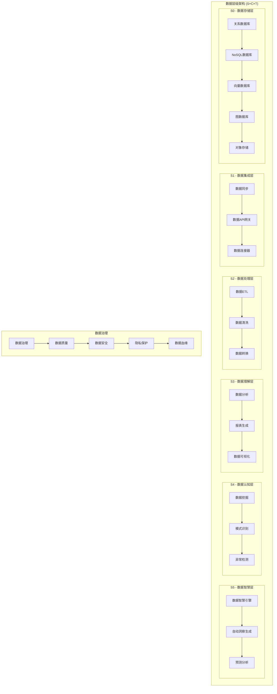

# 太上老君AI平台 - 数据管理服务

## 概述

太上老君AI平台的数据管理服务基于S×C×T三轴理论构建了分层的数据架构，提供从基础数据存储到高级数据智能的全栈数据服务，支撑整个AI平台的数据需求。

## 数据架构

### 整体数据架构图



## 核心数据服务

### 1. 数据存储服务 (S0级别)

#### 多元数据存储架构

```go
// 数据存储服务
package storage

import (
    "context"
    "fmt"
    "sync"
    
    "github.com/taishanglaojun/data/models"
    "github.com/taishanglaojun/data/drivers"
)

type DataStorageService struct {
    // 关系数据库
    postgres    *drivers.PostgreSQLDriver
    mysql       *drivers.MySQLDriver
    
    // NoSQL数据库
    mongodb     *drivers.MongoDBDriver
    redis       *drivers.RedisDriver
    elasticsearch *drivers.ElasticsearchDriver
    
    // 专用数据库
    vectorDB    *drivers.QdrantDriver
    graphDB     *drivers.Neo4jDriver
    
    // 对象存储
    objectStore *drivers.MinIODriver
    
    // 存储路由器
    router      *StorageRouter
    
    mu sync.RWMutex
}

func NewDataStorageService() *DataStorageService {
    return &DataStorageService{
        postgres:      drivers.NewPostgreSQLDriver("postgres://localhost:5432/taishang"),
        mysql:         drivers.NewMySQLDriver("mysql://localhost:3306/taishang"),
        mongodb:       drivers.NewMongoDBDriver("mongodb://localhost:27017/taishang"),
        redis:         drivers.NewRedisDriver("redis://localhost:6379"),
        elasticsearch: drivers.NewElasticsearchDriver("http://localhost:9200"),
        vectorDB:      drivers.NewQdrantDriver("http://localhost:6333"),
        graphDB:       drivers.NewNeo4jDriver("bolt://localhost:7687"),
        objectStore:   drivers.NewMinIODriver("localhost:9000"),
        router:        NewStorageRouter(),
    }
}

// 智能存储路由
func (dss *DataStorageService) Store(ctx context.Context, data *models.DataObject) error {
    // 分析数据特征
    characteristics := dss.analyzeDataCharacteristics(data)
    
    // 选择最优存储引擎
    storageEngine, err := dss.router.SelectOptimalStorage(characteristics)
    if err != nil {
        return fmt.Errorf("storage selection failed: %w", err)
    }
    
    // 执行存储
    switch storageEngine {
    case "postgresql":
        return dss.postgres.Store(ctx, data)
    case "mongodb":
        return dss.mongodb.Store(ctx, data)
    case "redis":
        return dss.redis.Store(ctx, data)
    case "elasticsearch":
        return dss.elasticsearch.Store(ctx, data)
    case "qdrant":
        return dss.vectorDB.Store(ctx, data)
    case "neo4j":
        return dss.graphDB.Store(ctx, data)
    case "minio":
        return dss.objectStore.Store(ctx, data)
    default:
        return fmt.Errorf("unsupported storage engine: %s", storageEngine)
    }
}

// 数据特征分析
func (dss *DataStorageService) analyzeDataCharacteristics(data *models.DataObject) *models.DataCharacteristics {
    return &models.DataCharacteristics{
        DataType:     data.Type,
        Size:         data.Size,
        Structure:    dss.analyzeStructure(data),
        AccessPattern: dss.predictAccessPattern(data),
        Consistency:  dss.analyzeConsistencyRequirement(data),
        Durability:   dss.analyzeDurabilityRequirement(data),
        Scalability:  dss.analyzeScalabilityRequirement(data),
    }
}

// 统一查询接口
func (dss *DataStorageService) Query(ctx context.Context, query *models.UnifiedQuery) (*models.QueryResult, error) {
    // 查询优化
    optimizedQuery, err := dss.optimizeQuery(query)
    if err != nil {
        return nil, fmt.Errorf("query optimization failed: %w", err)
    }
    
    // 确定查询引擎
    engines, err := dss.router.SelectQueryEngines(optimizedQuery)
    if err != nil {
        return nil, fmt.Errorf("query engine selection failed: %w", err)
    }
    
    // 并行查询
    results := make(chan *models.PartialResult, len(engines))
    errors := make(chan error, len(engines))
    
    var wg sync.WaitGroup
    for _, engine := range engines {
        wg.Add(1)
        go func(eng string) {
            defer wg.Done()
            
            result, err := dss.executeQuery(ctx, eng, optimizedQuery)
            if err != nil {
                errors <- err
                return
            }
            results <- result
        }(engine)
    }
    
    wg.Wait()
    close(results)
    close(errors)
    
    // 检查错误
    select {
    case err := <-errors:
        return nil, err
    default:
    }
    
    // 合并结果
    finalResult, err := dss.mergeQueryResults(results)
    if err != nil {
        return nil, fmt.Errorf("result merging failed: %w", err)
    }
    
    return finalResult, nil
}
```

### 2. 数据处理服务 (S2级别)

#### ETL数据处理引擎

```go
// 数据处理服务
package processing

import (
    "context"
    "fmt"
    "sync"
    
    "github.com/taishanglaojun/data/models"
    "github.com/taishanglaojun/data/pipeline"
)

type DataProcessingService struct {
    etlEngine       *pipeline.ETLEngine
    cleaningEngine  *pipeline.CleaningEngine
    transformEngine *pipeline.TransformEngine
    validationEngine *pipeline.ValidationEngine
    
    // 处理管道
    pipelines map[string]*pipeline.Pipeline
    
    mu sync.RWMutex
}

func NewDataProcessingService() *DataProcessingService {
    return &DataProcessingService{
        etlEngine:       pipeline.NewETLEngine(),
        cleaningEngine:  pipeline.NewCleaningEngine(),
        transformEngine: pipeline.NewTransformEngine(),
        validationEngine: pipeline.NewValidationEngine(),
        pipelines:       make(map[string]*pipeline.Pipeline),
    }
}

// 创建数据处理管道
func (dps *DataProcessingService) CreatePipeline(ctx context.Context, config *models.PipelineConfig) (*models.Pipeline, error) {
    // 构建处理步骤
    steps, err := dps.buildProcessingSteps(config)
    if err != nil {
        return nil, fmt.Errorf("pipeline step building failed: %w", err)
    }
    
    // 创建管道
    pipeline := &models.Pipeline{
        ID:       config.ID,
        Name:     config.Name,
        Steps:    steps,
        Config:   config,
        Status:   models.PipelineStatusCreated,
        Created:  time.Now(),
    }
    
    // 注册管道
    dps.mu.Lock()
    dps.pipelines[pipeline.ID] = pipeline
    dps.mu.Unlock()
    
    return pipeline, nil
}

// 执行数据处理
func (dps *DataProcessingService) ProcessData(ctx context.Context, pipelineID string, data *models.DataBatch) (*models.ProcessingResult, error) {
    // 获取管道
    dps.mu.RLock()
    pipeline, exists := dps.pipelines[pipelineID]
    dps.mu.RUnlock()
    
    if !exists {
        return nil, fmt.Errorf("pipeline not found: %s", pipelineID)
    }
    
    // 执行处理步骤
    result := &models.ProcessingResult{
        PipelineID: pipelineID,
        BatchID:    data.ID,
        StartTime:  time.Now(),
        Steps:      make([]*models.StepResult, 0),
    }
    
    currentData := data
    for i, step := range pipeline.Steps {
        stepResult, err := dps.executeStep(ctx, step, currentData)
        if err != nil {
            result.Status = models.ProcessingStatusFailed
            result.Error = err.Error()
            return result, fmt.Errorf("step %d execution failed: %w", i, err)
        }
        
        result.Steps = append(result.Steps, stepResult)
        currentData = stepResult.OutputData
    }
    
    result.OutputData = currentData
    result.EndTime = time.Now()
    result.Duration = result.EndTime.Sub(result.StartTime)
    result.Status = models.ProcessingStatusCompleted
    
    return result, nil
}

// 执行处理步骤
func (dps *DataProcessingService) executeStep(ctx context.Context, step *models.ProcessingStep, data *models.DataBatch) (*models.StepResult, error) {
    stepResult := &models.StepResult{
        StepID:    step.ID,
        StepType:  step.Type,
        StartTime: time.Now(),
    }
    
    var outputData *models.DataBatch
    var err error
    
    switch step.Type {
    case models.StepTypeExtract:
        outputData, err = dps.etlEngine.Extract(ctx, step.Config, data)
    case models.StepTypeTransform:
        outputData, err = dps.transformEngine.Transform(ctx, step.Config, data)
    case models.StepTypeLoad:
        outputData, err = dps.etlEngine.Load(ctx, step.Config, data)
    case models.StepTypeClean:
        outputData, err = dps.cleaningEngine.Clean(ctx, step.Config, data)
    case models.StepTypeValidate:
        outputData, err = dps.validationEngine.Validate(ctx, step.Config, data)
    default:
        err = fmt.Errorf("unsupported step type: %s", step.Type)
    }
    
    stepResult.EndTime = time.Now()
    stepResult.Duration = stepResult.EndTime.Sub(stepResult.StartTime)
    
    if err != nil {
        stepResult.Status = models.StepStatusFailed
        stepResult.Error = err.Error()
        return stepResult, err
    }
    
    stepResult.Status = models.StepStatusCompleted
    stepResult.OutputData = outputData
    stepResult.Metrics = dps.calculateStepMetrics(data, outputData)
    
    return stepResult, nil
}

// 数据清洗
func (dps *DataProcessingService) CleanData(ctx context.Context, data *models.DataBatch, rules *models.CleaningRules) (*models.CleaningResult, error) {
    result := &models.CleaningResult{
        BatchID:   data.ID,
        StartTime: time.Now(),
        Rules:     rules,
    }
    
    cleanedData := data.Clone()
    
    // 应用清洗规则
    for _, rule := range rules.Rules {
        switch rule.Type {
        case models.CleaningRuleTypeRemoveDuplicates:
            cleanedData, err := dps.cleaningEngine.RemoveDuplicates(ctx, cleanedData, rule)
            if err != nil {
                return nil, fmt.Errorf("duplicate removal failed: %w", err)
            }
            result.CleanedData = cleanedData
            
        case models.CleaningRuleTypeHandleMissing:
            cleanedData, err := dps.cleaningEngine.HandleMissingValues(ctx, cleanedData, rule)
            if err != nil {
                return nil, fmt.Errorf("missing value handling failed: %w", err)
            }
            result.CleanedData = cleanedData
            
        case models.CleaningRuleTypeNormalize:
            cleanedData, err := dps.cleaningEngine.Normalize(ctx, cleanedData, rule)
            if err != nil {
                return nil, fmt.Errorf("normalization failed: %w", err)
            }
            result.CleanedData = cleanedData
            
        case models.CleaningRuleTypeValidateFormat:
            validationResult, err := dps.cleaningEngine.ValidateFormat(ctx, cleanedData, rule)
            if err != nil {
                return nil, fmt.Errorf("format validation failed: %w", err)
            }
            result.ValidationResults = append(result.ValidationResults, validationResult)
        }
    }
    
    result.EndTime = time.Now()
    result.Duration = result.EndTime.Sub(result.StartTime)
    result.Statistics = dps.calculateCleaningStatistics(data, result.CleanedData)
    
    return result, nil
}
```

### 3. 数据分析服务 (S3级别)

#### 智能数据分析引擎

```go
// 数据分析服务
package analytics

import (
    "context"
    "fmt"
    "math"
    
    "github.com/taishanglaojun/data/models"
    "github.com/taishanglaojun/data/algorithms"
)

type DataAnalyticsService struct {
    statisticsEngine *algorithms.StatisticsEngine
    mlEngine        *algorithms.MLEngine
    visualEngine    *algorithms.VisualizationEngine
    reportEngine    *algorithms.ReportEngine
}

func NewDataAnalyticsService() *DataAnalyticsService {
    return &DataAnalyticsService{
        statisticsEngine: algorithms.NewStatisticsEngine(),
        mlEngine:        algorithms.NewMLEngine(),
        visualEngine:    algorithms.NewVisualizationEngine(),
        reportEngine:    algorithms.NewReportEngine(),
    }
}

// 描述性统计分析
func (das *DataAnalyticsService) DescriptiveAnalysis(ctx context.Context, data *models.Dataset) (*models.DescriptiveAnalysis, error) {
    analysis := &models.DescriptiveAnalysis{
        DatasetID: data.ID,
        Timestamp: time.Now(),
        Columns:   make(map[string]*models.ColumnAnalysis),
    }
    
    // 分析每个列
    for columnName, column := range data.Columns {
        columnAnalysis, err := das.analyzeColumn(ctx, column)
        if err != nil {
            return nil, fmt.Errorf("column analysis failed for %s: %w", columnName, err)
        }
        analysis.Columns[columnName] = columnAnalysis
    }
    
    // 计算整体统计
    analysis.OverallStatistics = das.calculateOverallStatistics(data)
    
    // 数据质量评估
    analysis.QualityScore = das.calculateDataQuality(data, analysis.Columns)
    
    return analysis, nil
}

// 列分析
func (das *DataAnalyticsService) analyzeColumn(ctx context.Context, column *models.Column) (*models.ColumnAnalysis, error) {
    analysis := &models.ColumnAnalysis{
        ColumnName: column.Name,
        DataType:   column.Type,
        Count:      len(column.Values),
    }
    
    switch column.Type {
    case models.DataTypeNumeric:
        numericAnalysis, err := das.statisticsEngine.AnalyzeNumeric(ctx, column.Values)
        if err != nil {
            return nil, err
        }
        analysis.NumericAnalysis = numericAnalysis
        
    case models.DataTypeCategorical:
        categoricalAnalysis, err := das.statisticsEngine.AnalyzeCategorical(ctx, column.Values)
        if err != nil {
            return nil, err
        }
        analysis.CategoricalAnalysis = categoricalAnalysis
        
    case models.DataTypeText:
        textAnalysis, err := das.statisticsEngine.AnalyzeText(ctx, column.Values)
        if err != nil {
            return nil, err
        }
        analysis.TextAnalysis = textAnalysis
        
    case models.DataTypeDateTime:
        timeAnalysis, err := das.statisticsEngine.AnalyzeDateTime(ctx, column.Values)
        if err != nil {
            return nil, err
        }
        analysis.DateTimeAnalysis = timeAnalysis
    }
    
    // 缺失值分析
    analysis.MissingValues = das.analyzeMissingValues(column.Values)
    
    // 异常值检测
    analysis.Outliers = das.detectOutliers(column.Values)
    
    return analysis, nil
}

// 相关性分析
func (das *DataAnalyticsService) CorrelationAnalysis(ctx context.Context, data *models.Dataset) (*models.CorrelationAnalysis, error) {
    // 提取数值列
    numericColumns := das.extractNumericColumns(data)
    if len(numericColumns) < 2 {
        return nil, fmt.Errorf("insufficient numeric columns for correlation analysis")
    }
    
    analysis := &models.CorrelationAnalysis{
        DatasetID: data.ID,
        Timestamp: time.Now(),
        Matrix:    make(map[string]map[string]float64),
    }
    
    // 计算相关性矩阵
    for i, col1 := range numericColumns {
        analysis.Matrix[col1.Name] = make(map[string]float64)
        
        for j, col2 := range numericColumns {
            correlation, err := das.statisticsEngine.CalculateCorrelation(col1.Values, col2.Values)
            if err != nil {
                return nil, fmt.Errorf("correlation calculation failed: %w", err)
            }
            analysis.Matrix[col1.Name][col2.Name] = correlation
        }
    }
    
    // 识别强相关性
    analysis.StrongCorrelations = das.identifyStrongCorrelations(analysis.Matrix, 0.7)
    
    return analysis, nil
}

// 趋势分析
func (das *DataAnalyticsService) TrendAnalysis(ctx context.Context, data *models.TimeSeries) (*models.TrendAnalysis, error) {
    analysis := &models.TrendAnalysis{
        SeriesID:  data.ID,
        Timestamp: time.Now(),
    }
    
    // 趋势检测
    trend, err := das.statisticsEngine.DetectTrend(data.Values)
    if err != nil {
        return nil, fmt.Errorf("trend detection failed: %w", err)
    }
    analysis.Trend = trend
    
    // 季节性分析
    seasonality, err := das.statisticsEngine.DetectSeasonality(data.Values, data.Frequency)
    if err != nil {
        return nil, fmt.Errorf("seasonality detection failed: %w", err)
    }
    analysis.Seasonality = seasonality
    
    // 周期性分析
    cycles, err := das.statisticsEngine.DetectCycles(data.Values)
    if err != nil {
        return nil, fmt.Errorf("cycle detection failed: %w", err)
    }
    analysis.Cycles = cycles
    
    // 异常点检测
    anomalies, err := das.statisticsEngine.DetectAnomalies(data.Values)
    if err != nil {
        return nil, fmt.Errorf("anomaly detection failed: %w", err)
    }
    analysis.Anomalies = anomalies
    
    return analysis, nil
}

// 生成分析报告
func (das *DataAnalyticsService) GenerateReport(ctx context.Context, analysisResults *models.AnalysisResults) (*models.AnalysisReport, error) {
    report := &models.AnalysisReport{
        ID:        generateReportID(),
        Timestamp: time.Now(),
        DatasetID: analysisResults.DatasetID,
    }
    
    // 生成执行摘要
    summary, err := das.reportEngine.GenerateExecutiveSummary(analysisResults)
    if err != nil {
        return nil, fmt.Errorf("executive summary generation failed: %w", err)
    }
    report.ExecutiveSummary = summary
    
    // 生成详细分析
    detailedAnalysis, err := das.reportEngine.GenerateDetailedAnalysis(analysisResults)
    if err != nil {
        return nil, fmt.Errorf("detailed analysis generation failed: %w", err)
    }
    report.DetailedAnalysis = detailedAnalysis
    
    // 生成可视化
    visualizations, err := das.visualEngine.GenerateVisualizations(analysisResults)
    if err != nil {
        return nil, fmt.Errorf("visualization generation failed: %w", err)
    }
    report.Visualizations = visualizations
    
    // 生成建议
    recommendations, err := das.reportEngine.GenerateRecommendations(analysisResults)
    if err != nil {
        return nil, fmt.Errorf("recommendation generation failed: %w", err)
    }
    report.Recommendations = recommendations
    
    return report, nil
}
```

### 4. 数据智慧服务 (S5级别)

#### 自动化数据洞察引擎

```go
// 数据智慧服务
package intelligence

import (
    "context"
    "fmt"
    
    "github.com/taishanglaojun/data/models"
    "github.com/taishanglaojun/data/ai"
)

type DataIntelligenceService struct {
    insightEngine     *ai.InsightEngine
    predictionEngine  *ai.PredictionEngine
    recommendationEngine *ai.RecommendationEngine
    autoMLEngine      *ai.AutoMLEngine
}

func NewDataIntelligenceService() *DataIntelligenceService {
    return &DataIntelligenceService{
        insightEngine:     ai.NewInsightEngine(),
        predictionEngine:  ai.NewPredictionEngine(),
        recommendationEngine: ai.NewRecommendationEngine(),
        autoMLEngine:      ai.NewAutoMLEngine(),
    }
}

// 自动洞察发现
func (dis *DataIntelligenceService) DiscoverInsights(ctx context.Context, data *models.Dataset) (*models.InsightDiscovery, error) {
    discovery := &models.InsightDiscovery{
        DatasetID: data.ID,
        Timestamp: time.Now(),
        Insights:  make([]*models.Insight, 0),
    }
    
    // 统计洞察
    statisticalInsights, err := dis.insightEngine.DiscoverStatisticalInsights(ctx, data)
    if err != nil {
        return nil, fmt.Errorf("statistical insight discovery failed: %w", err)
    }
    discovery.Insights = append(discovery.Insights, statisticalInsights...)
    
    // 模式洞察
    patternInsights, err := dis.insightEngine.DiscoverPatterns(ctx, data)
    if err != nil {
        return nil, fmt.Errorf("pattern insight discovery failed: %w", err)
    }
    discovery.Insights = append(discovery.Insights, patternInsights...)
    
    // 异常洞察
    anomalyInsights, err := dis.insightEngine.DiscoverAnomalies(ctx, data)
    if err != nil {
        return nil, fmt.Errorf("anomaly insight discovery failed: %w", err)
    }
    discovery.Insights = append(discovery.Insights, anomalyInsights...)
    
    // 关联洞察
    correlationInsights, err := dis.insightEngine.DiscoverCorrelations(ctx, data)
    if err != nil {
        return nil, fmt.Errorf("correlation insight discovery failed: %w", err)
    }
    discovery.Insights = append(discovery.Insights, correlationInsights...)
    
    // 洞察排序和过滤
    discovery.Insights = dis.rankAndFilterInsights(discovery.Insights)
    
    return discovery, nil
}

// 预测分析
func (dis *DataIntelligenceService) PredictiveAnalysis(ctx context.Context, request *models.PredictionRequest) (*models.PredictionResult, error) {
    // 数据预处理
    preprocessedData, err := dis.predictionEngine.PreprocessData(ctx, request.Data)
    if err != nil {
        return nil, fmt.Errorf("data preprocessing failed: %w", err)
    }
    
    // 特征工程
    features, err := dis.predictionEngine.EngineerFeatures(ctx, preprocessedData, request.Target)
    if err != nil {
        return nil, fmt.Errorf("feature engineering failed: %w", err)
    }
    
    // 模型选择
    bestModel, err := dis.autoMLEngine.SelectBestModel(ctx, features, request.Target, request.ProblemType)
    if err != nil {
        return nil, fmt.Errorf("model selection failed: %w", err)
    }
    
    // 模型训练
    trainedModel, err := dis.predictionEngine.TrainModel(ctx, bestModel, features, request.Target)
    if err != nil {
        return nil, fmt.Errorf("model training failed: %w", err)
    }
    
    // 生成预测
    predictions, err := dis.predictionEngine.GeneratePredictions(ctx, trainedModel, request.PredictionData)
    if err != nil {
        return nil, fmt.Errorf("prediction generation failed: %w", err)
    }
    
    // 模型评估
    evaluation, err := dis.predictionEngine.EvaluateModel(ctx, trainedModel, features, request.Target)
    if err != nil {
        return nil, fmt.Errorf("model evaluation failed: %w", err)
    }
    
    return &models.PredictionResult{
        RequestID:   request.ID,
        Model:       trainedModel,
        Predictions: predictions,
        Evaluation:  evaluation,
        Confidence:  evaluation.OverallScore,
        Timestamp:   time.Now(),
    }, nil
}

// 智能推荐
func (dis *DataIntelligenceService) GenerateRecommendations(ctx context.Context, context *models.RecommendationContext) (*models.RecommendationResult, error) {
    result := &models.RecommendationResult{
        ContextID:     context.ID,
        Timestamp:     time.Now(),
        Recommendations: make([]*models.Recommendation, 0),
    }
    
    // 数据质量推荐
    qualityRecs, err := dis.recommendationEngine.RecommendDataQualityImprovements(ctx, context.Data)
    if err != nil {
        return nil, fmt.Errorf("data quality recommendation failed: %w", err)
    }
    result.Recommendations = append(result.Recommendations, qualityRecs...)
    
    // 分析方法推荐
    analysisRecs, err := dis.recommendationEngine.RecommendAnalysisMethods(ctx, context.Data, context.Goals)
    if err != nil {
        return nil, fmt.Errorf("analysis method recommendation failed: %w", err)
    }
    result.Recommendations = append(result.Recommendations, analysisRecs...)
    
    // 可视化推荐
    visualizationRecs, err := dis.recommendationEngine.RecommendVisualizations(ctx, context.Data, context.Audience)
    if err != nil {
        return nil, fmt.Errorf("visualization recommendation failed: %w", err)
    }
    result.Recommendations = append(result.Recommendations, visualizationRecs...)
    
    // 模型推荐
    if context.Goals.IncludesPrediction {
        modelRecs, err := dis.recommendationEngine.RecommendModels(ctx, context.Data, context.PredictionTarget)
        if err != nil {
            return nil, fmt.Errorf("model recommendation failed: %w", err)
        }
        result.Recommendations = append(result.Recommendations, modelRecs...)
    }
    
    // 推荐排序
    result.Recommendations = dis.rankRecommendations(result.Recommendations, context.Preferences)
    
    return result, nil
}

// AutoML服务
func (dis *DataIntelligenceService) AutoML(ctx context.Context, request *models.AutoMLRequest) (*models.AutoMLResult, error) {
    result := &models.AutoMLResult{
        RequestID: request.ID,
        StartTime: time.Now(),
    }
    
    // 数据探索
    exploration, err := dis.autoMLEngine.ExploreData(ctx, request.Data)
    if err != nil {
        return nil, fmt.Errorf("data exploration failed: %w", err)
    }
    result.DataExploration = exploration
    
    // 自动特征工程
    features, err := dis.autoMLEngine.AutoFeatureEngineering(ctx, request.Data, request.Target)
    if err != nil {
        return nil, fmt.Errorf("auto feature engineering failed: %w", err)
    }
    result.Features = features
    
    // 模型搜索
    modelSearch, err := dis.autoMLEngine.SearchModels(ctx, features, request.Target, request.Constraints)
    if err != nil {
        return nil, fmt.Errorf("model search failed: %w", err)
    }
    result.ModelSearch = modelSearch
    
    // 超参数优化
    optimization, err := dis.autoMLEngine.OptimizeHyperparameters(ctx, modelSearch.BestModels, features, request.Target)
    if err != nil {
        return nil, fmt.Errorf("hyperparameter optimization failed: %w", err)
    }
    result.Optimization = optimization
    
    // 模型集成
    ensemble, err := dis.autoMLEngine.CreateEnsemble(ctx, optimization.OptimizedModels)
    if err != nil {
        return nil, fmt.Errorf("model ensemble creation failed: %w", err)
    }
    result.FinalModel = ensemble
    
    // 模型解释
    explanation, err := dis.autoMLEngine.ExplainModel(ctx, ensemble, features)
    if err != nil {
        return nil, fmt.Errorf("model explanation failed: %w", err)
    }
    result.ModelExplanation = explanation
    
    result.EndTime = time.Now()
    result.Duration = result.EndTime.Sub(result.StartTime)
    
    return result, nil
}
```

## 数据治理

### 数据治理框架

```go
// 数据治理服务
package governance

import (
    "context"
    "fmt"
    "time"
    
    "github.com/taishanglaojun/data/models"
    "github.com/taishanglaojun/data/governance"
)

type DataGovernanceService struct {
    qualityEngine   *governance.QualityEngine
    securityEngine  *governance.SecurityEngine
    privacyEngine   *governance.PrivacyEngine
    lineageEngine   *governance.LineageEngine
    catalogEngine   *governance.CatalogEngine
}

func NewDataGovernanceService() *DataGovernanceService {
    return &DataGovernanceService{
        qualityEngine:  governance.NewQualityEngine(),
        securityEngine: governance.NewSecurityEngine(),
        privacyEngine:  governance.NewPrivacyEngine(),
        lineageEngine:  governance.NewLineageEngine(),
        catalogEngine:  governance.NewCatalogEngine(),
    }
}

// 数据质量管理
func (dgs *DataGovernanceService) ManageDataQuality(ctx context.Context, data *models.Dataset) (*models.QualityReport, error) {
    report := &models.QualityReport{
        DatasetID: data.ID,
        Timestamp: time.Now(),
        Dimensions: make(map[string]*models.QualityDimension),
    }
    
    // 完整性检查
    completeness, err := dgs.qualityEngine.CheckCompleteness(ctx, data)
    if err != nil {
        return nil, fmt.Errorf("completeness check failed: %w", err)
    }
    report.Dimensions["completeness"] = completeness
    
    // 准确性检查
    accuracy, err := dgs.qualityEngine.CheckAccuracy(ctx, data)
    if err != nil {
        return nil, fmt.Errorf("accuracy check failed: %w", err)
    }
    report.Dimensions["accuracy"] = accuracy
    
    // 一致性检查
    consistency, err := dgs.qualityEngine.CheckConsistency(ctx, data)
    if err != nil {
        return nil, fmt.Errorf("consistency check failed: %w", err)
    }
    report.Dimensions["consistency"] = consistency
    
    // 及时性检查
    timeliness, err := dgs.qualityEngine.CheckTimeliness(ctx, data)
    if err != nil {
        return nil, fmt.Errorf("timeliness check failed: %w", err)
    }
    report.Dimensions["timeliness"] = timeliness
    
    // 唯一性检查
    uniqueness, err := dgs.qualityEngine.CheckUniqueness(ctx, data)
    if err != nil {
        return nil, fmt.Errorf("uniqueness check failed: %w", err)
    }
    report.Dimensions["uniqueness"] = uniqueness
    
    // 计算总体质量分数
    report.OverallScore = dgs.calculateOverallQualityScore(report.Dimensions)
    
    // 生成改进建议
    report.ImprovementSuggestions = dgs.generateQualityImprovementSuggestions(report.Dimensions)
    
    return report, nil
}

// 数据血缘追踪
func (dgs *DataGovernanceService) TrackDataLineage(ctx context.Context, datasetID string) (*models.DataLineage, error) {
    lineage := &models.DataLineage{
        DatasetID: datasetID,
        Timestamp: time.Now(),
        Upstream:  make([]*models.LineageNode, 0),
        Downstream: make([]*models.LineageNode, 0),
    }
    
    // 追踪上游数据源
    upstream, err := dgs.lineageEngine.TraceUpstream(ctx, datasetID)
    if err != nil {
        return nil, fmt.Errorf("upstream tracing failed: %w", err)
    }
    lineage.Upstream = upstream
    
    // 追踪下游数据消费
    downstream, err := dgs.lineageEngine.TraceDownstream(ctx, datasetID)
    if err != nil {
        return nil, fmt.Errorf("downstream tracing failed: %w", err)
    }
    lineage.Downstream = downstream
    
    // 构建血缘图
    lineageGraph, err := dgs.lineageEngine.BuildLineageGraph(ctx, lineage)
    if err != nil {
        return nil, fmt.Errorf("lineage graph building failed: %w", err)
    }
    lineage.Graph = lineageGraph
    
    // 影响分析
    impactAnalysis, err := dgs.lineageEngine.AnalyzeImpact(ctx, lineage)
    if err != nil {
        return nil, fmt.Errorf("impact analysis failed: %w", err)
    }
    lineage.ImpactAnalysis = impactAnalysis
    
    return lineage, nil
}

// 数据安全管理
func (dgs *DataGovernanceService) ManageDataSecurity(ctx context.Context, data *models.Dataset) (*models.SecurityAssessment, error) {
    assessment := &models.SecurityAssessment{
        DatasetID: data.ID,
        Timestamp: time.Now(),
        Checks:    make(map[string]*models.SecurityCheck),
    }
    
    // 访问控制检查
    accessControl, err := dgs.securityEngine.CheckAccessControl(ctx, data)
    if err != nil {
        return nil, fmt.Errorf("access control check failed: %w", err)
    }
    assessment.Checks["access_control"] = accessControl
    
    // 加密检查
    encryption, err := dgs.securityEngine.CheckEncryption(ctx, data)
    if err != nil {
        return nil, fmt.Errorf("encryption check failed: %w", err)
    }
    assessment.Checks["encryption"] = encryption
    
    // 审计日志检查
    auditLog, err := dgs.securityEngine.CheckAuditLog(ctx, data)
    if err != nil {
        return nil, fmt.Errorf("audit log check failed: %w", err)
    }
    assessment.Checks["audit_log"] = auditLog
    
    // 数据脱敏检查
    masking, err := dgs.securityEngine.CheckDataMasking(ctx, data)
    if err != nil {
        return nil, fmt.Errorf("data masking check failed: %w", err)
    }
    assessment.Checks["data_masking"] = masking
    
    // 计算安全分数
    assessment.SecurityScore = dgs.calculateSecurityScore(assessment.Checks)
    
    // 生成安全建议
    assessment.SecurityRecommendations = dgs.generateSecurityRecommendations(assessment.Checks)
    
    return assessment, nil
}
```

## 监控和运维

### 数据服务监控

```yaml
# 数据服务监控配置
apiVersion: v1
kind: ConfigMap
metadata:
  name: data-monitoring-config
data:
  prometheus.yml: |
    global:
      scrape_interval: 15s
    
    scrape_configs:
      - job_name: 'data-storage-service'
        static_configs:
          - targets: ['data-storage:8080']
        metrics_path: /metrics
        scrape_interval: 30s
        
      - job_name: 'data-processing-service'
        static_configs:
          - targets: ['data-processing:8080']
        metrics_path: /metrics
        scrape_interval: 30s
        
      - job_name: 'data-analytics-service'
        static_configs:
          - targets: ['data-analytics:8080']
        metrics_path: /metrics
        scrape_interval: 30s
        
      - job_name: 'data-intelligence-service'
        static_configs:
          - targets: ['data-intelligence:8080']
        metrics_path: /metrics
        scrape_interval: 30s

  grafana-dashboard.json: |
    {
      "dashboard": {
        "title": "太上老君数据服务监控",
        "panels": [
          {
            "title": "数据处理吞吐量",
            "type": "graph",
            "targets": [
              {
                "expr": "rate(data_processing_requests_total[5m])",
                "legendFormat": "{{service}}"
              }
            ]
          },
          {
            "title": "数据质量分数",
            "type": "singlestat",
            "targets": [
              {
                "expr": "avg(data_quality_score)",
                "legendFormat": "质量分数"
              }
            ]
          },
          {
            "title": "存储使用情况",
            "type": "graph",
            "targets": [
              {
                "expr": "data_storage_usage_bytes",
                "legendFormat": "{{storage_type}}"
              }
            ]
          }
        ]
      }
    }
```

## 部署配置

### Kubernetes部署

```yaml
# 数据管理服务部署
apiVersion: apps/v1
kind: Deployment
metadata:
  name: data-management-service
spec:
  replicas: 3
  selector:
    matchLabels:
      app: data-management
  template:
    metadata:
      labels:
        app: data-management
    spec:
      containers:
      - name: data-storage
        image: taishanglaojun/data-storage:latest
        ports:
        - containerPort: 8080
        env:
        - name: POSTGRES_URL
          value: "postgres://postgres:5432/taishang"
        - name: REDIS_URL
          value: "redis://redis:6379"
        resources:
          limits:
            cpu: 2
            memory: 4Gi
          requests:
            cpu: 1
            memory: 2Gi
            
      - name: data-processing
        image: taishanglaojun/data-processing:latest
        ports:
        - containerPort: 8081
        env:
        - name: KAFKA_BROKERS
          value: "kafka:9092"
        resources:
          limits:
            cpu: 4
            memory: 8Gi
          requests:
            cpu: 2
            memory: 4Gi
            
      - name: data-analytics
        image: taishanglaojun/data-analytics:latest
        ports:
        - containerPort: 8082
        resources:
          limits:
            cpu: 8
            memory: 16Gi
          requests:
            cpu: 4
            memory: 8Gi
            
      - name: data-intelligence
        image: taishanglaojun/data-intelligence:latest
        ports:
        - containerPort: 8083
        env:
        - name: GPU_ENABLED
          value: "true"
        resources:
          limits:
            nvidia.com/gpu: 1
            cpu: 16
            memory: 32Gi
          requests:
            cpu: 8
            memory: 16Gi

---
apiVersion: v1
kind: Service
metadata:
  name: data-management-service
spec:
  selector:
    app: data-management
  ports:
  - name: storage
    port: 8080
    targetPort: 8080
  - name: processing
    port: 8081
    targetPort: 8081
  - name: analytics
    port: 8082
    targetPort: 8082
  - name: intelligence
    port: 8083
    targetPort: 8083
  type: ClusterIP
```

## 相关文档

- [项目概览](../00-项目概览/README.md) - 平台整体介绍
- [理论基础](../01-理论基础/README.md) - 源界生态理论
- [架构设计](../02-架构设计/README.md) - 总体架构设计
- [AI服务](./ai-service.md) - AI智能服务
- [安全服务](./security-service.md) - 安全服务详情

---

**文档版本**: v1.0  
**创建时间**: 2025年1月  
**最后更新**: 2025年1月  
**维护团队**: 太上老君AI开发团队  
**联系方式**: dev@taishanglaojun.ai