# 安全服务 (Security Service)

<div align="center">


**太上老君AI平台的核心安全服务模块**

</div>

## 🛡️ 服务概览

安全服务是太上老君AI平台的核心安全防护模块，提供全方位的网络安全解决方案，包括渗透测试、威胁检测、安全教育和应急响应等功能。

### 核心特性

- **🔍 渗透测试**：自动化安全测试和漏洞发现
- **🚨 威胁检测**：实时威胁监控和智能分析
- **📚 安全教育**：互动式安全培训和认证
- **⚡ 应急响应**：快速事件响应和处置
- **🔒 多端防护**：支持Web、移动、桌面、IoT等多端安全

## 🏗️ 服务架构

### 整体架构图

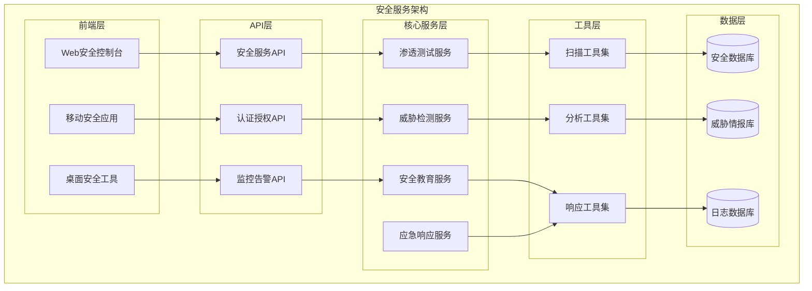

### S×C×T 三轴安全映射

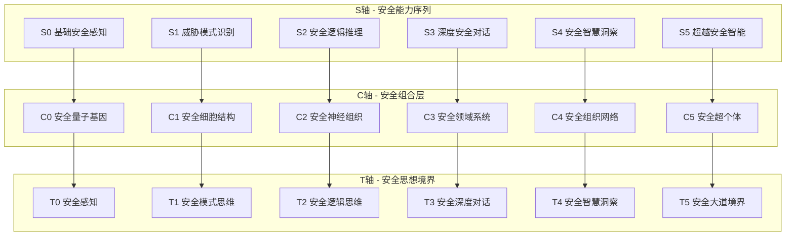

## 🔍 渗透测试服务

### 功能特性

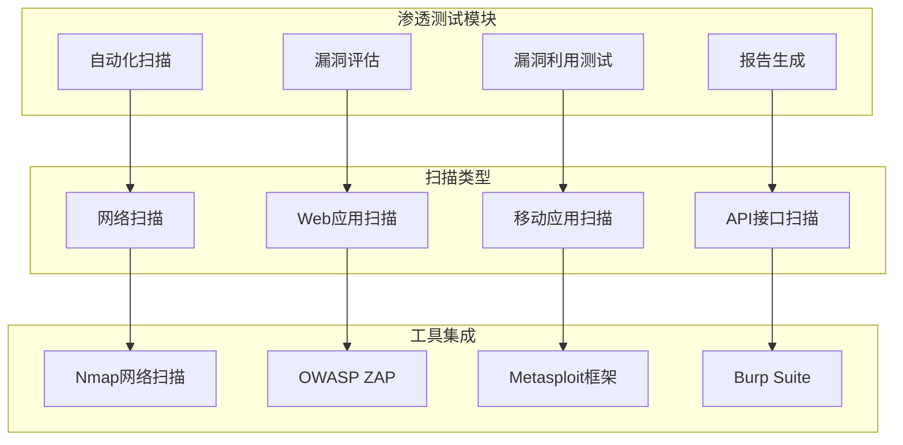

### 渗透测试流程

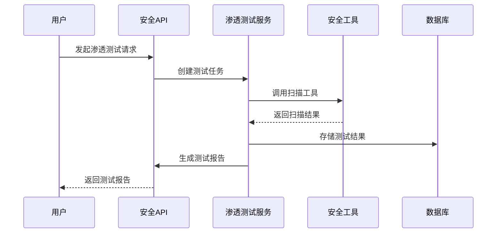

### 核心功能实现

#### 1. 网络扫描模块

```go
// NetworkScanner 网络扫描器
type NetworkScanner struct {
    config *ScanConfig
    tools  map[string]ScanTool
}

// ScanConfig 扫描配置
type ScanConfig struct {
    Target      string            `json:"target"`
    ScanType    string            `json:"scan_type"`
    Ports       []int             `json:"ports"`
    Timeout     time.Duration     `json:"timeout"`
    Options     map[string]string `json:"options"`
}

// ScanResult 扫描结果
type ScanResult struct {
    ID          string                 `json:"id"`
    Target      string                 `json:"target"`
    Status      string                 `json:"status"`
    StartTime   time.Time              `json:"start_time"`
    EndTime     time.Time              `json:"end_time"`
    Results     map[string]interface{} `json:"results"`
    Vulnerabilities []Vulnerability    `json:"vulnerabilities"`
}

// Vulnerability 漏洞信息
type Vulnerability struct {
    ID          string    `json:"id"`
    Name        string    `json:"name"`
    Severity    string    `json:"severity"`
    Description string    `json:"description"`
    Solution    string    `json:"solution"`
    CVSS        float64   `json:"cvss"`
    CVE         string    `json:"cve"`
}
```

#### 2. Web应用扫描模块

```go
// WebScanner Web应用扫描器
type WebScanner struct {
    config *WebScanConfig
    proxy  *ProxyConfig
}

// WebScanConfig Web扫描配置
type WebScanConfig struct {
    URL         string            `json:"url"`
    ScanTypes   []string          `json:"scan_types"`
    Headers     map[string]string `json:"headers"`
    Cookies     map[string]string `json:"cookies"`
    AuthConfig  *AuthConfig       `json:"auth_config"`
}

// AuthConfig 认证配置
type AuthConfig struct {
    Type     string `json:"type"`
    Username string `json:"username"`
    Password string `json:"password"`
    Token    string `json:"token"`
}
```

## 🚨 威胁检测服务

### 检测能力

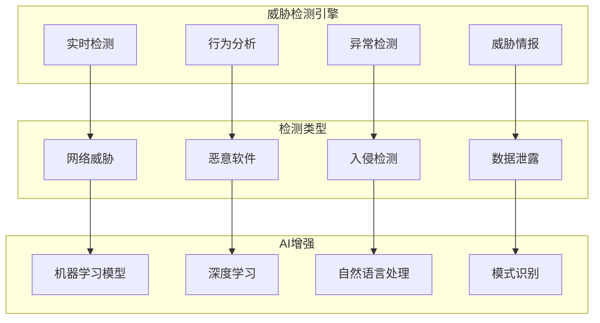

### 威胁检测流程

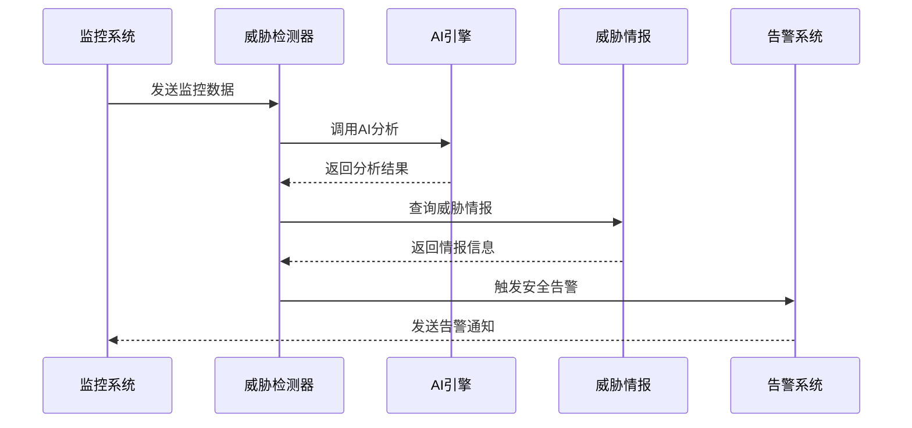

### 威胁检测实现

#### 1. 实时威胁检测

```go
// ThreatDetector 威胁检测器
type ThreatDetector struct {
    rules      []DetectionRule
    aiEngine   AIEngine
    intelDB    ThreatIntelDB
    alerter    AlertManager
}

// DetectionRule 检测规则
type DetectionRule struct {
    ID          string                 `json:"id"`
    Name        string                 `json:"name"`
    Type        string                 `json:"type"`
    Severity    string                 `json:"severity"`
    Conditions  []Condition            `json:"conditions"`
    Actions     []Action               `json:"actions"`
    Enabled     bool                   `json:"enabled"`
}

// ThreatEvent 威胁事件
type ThreatEvent struct {
    ID          string                 `json:"id"`
    Type        string                 `json:"type"`
    Severity    string                 `json:"severity"`
    Source      string                 `json:"source"`
    Target      string                 `json:"target"`
    Timestamp   time.Time              `json:"timestamp"`
    Description string                 `json:"description"`
    Evidence    map[string]interface{} `json:"evidence"`
    Status      string                 `json:"status"`
}
```

#### 2. 行为分析引擎

```go
// BehaviorAnalyzer 行为分析器
type BehaviorAnalyzer struct {
    models     map[string]MLModel
    baseline   BaselineProfile
    threshold  float64
}

// BaselineProfile 基线配置
type BaselineProfile struct {
    UserBehavior    map[string]interface{} `json:"user_behavior"`
    NetworkTraffic  map[string]interface{} `json:"network_traffic"`
    SystemActivity  map[string]interface{} `json:"system_activity"`
    UpdateTime      time.Time              `json:"update_time"`
}

// AnomalyScore 异常评分
type AnomalyScore struct {
    Score       float64                `json:"score"`
    Factors     map[string]float64     `json:"factors"`
    Threshold   float64                `json:"threshold"`
    IsAnomaly   bool                   `json:"is_anomaly"`
    Confidence  float64                `json:"confidence"`
}
```

## 📚 安全教育服务

### 教育体系

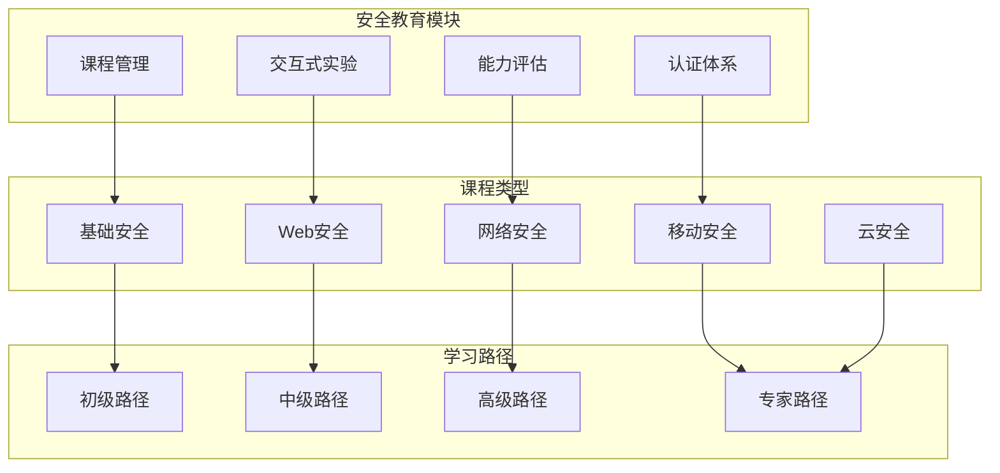

### 安全学习路径

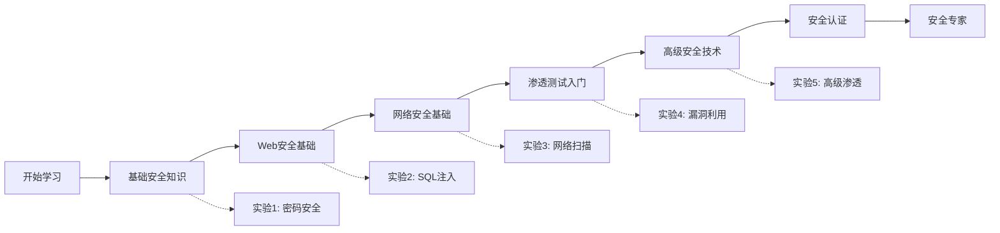

## ⚡ 应急响应服务

### 响应流程

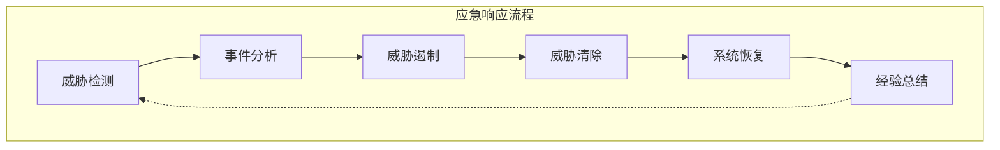

### 响应等级

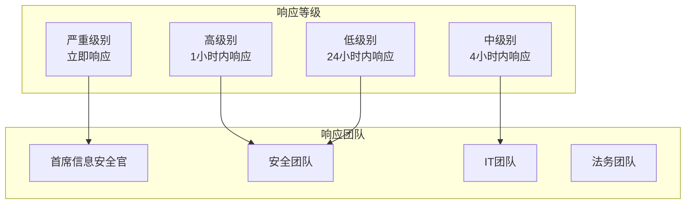

## 🔧 多端安全集成

### 多端架构

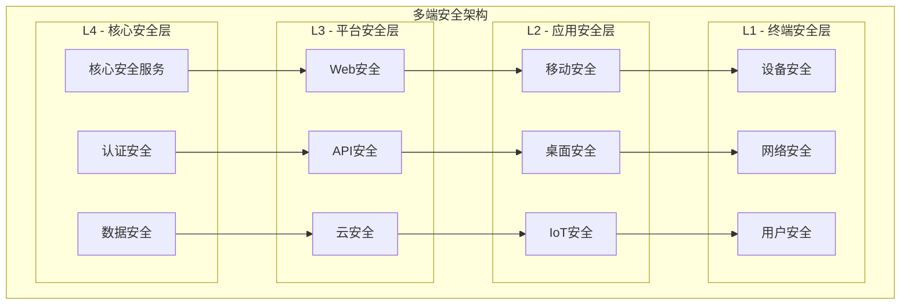

### 技术栈

#### 后端技术栈
```yaml
核心框架:
  - Go 1.21+ (主要后端语言)
  - Gin (Web框架)
  - gRPC (服务间通信)
  - Protocol Buffers (数据序列化)

数据存储:
  - PostgreSQL (关系型数据)
  - MongoDB (文档数据)
  - Redis (缓存和会话)
  - InfluxDB (时序数据)

安全工具:
  - Nmap (网络扫描)
  - OWASP ZAP (Web安全扫描)
  - Metasploit (渗透测试框架)
  - Wireshark (网络分析)

容器化:
  - Docker (容器化)
  - Kubernetes (容器编排)
  - Helm (包管理)
```

#### 前端技术栈
```yaml
Web前端:
  - React 18 (前端框架)
  - TypeScript (类型安全)
  - Redux Toolkit (状态管理)
  - Tailwind CSS (样式框架)

移动端:
  - React Native (跨平台)
  - Expo (开发工具)
  - Native Modules (原生功能)

桌面端:
  - Electron (跨平台桌面)
  - Tauri (轻量级替代)
  - Native APIs (系统集成)
```

## 📊 安全监控面板

### 监控指标

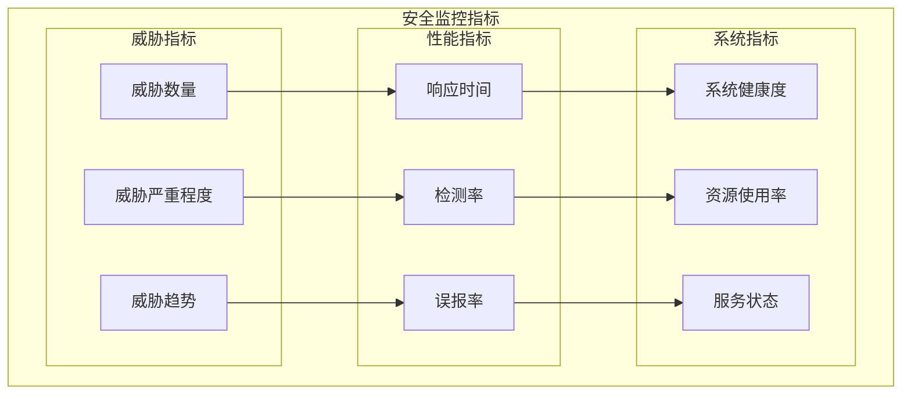

### 仪表板组件

```typescript
// 安全监控仪表板组件
interface SecurityDashboardProps {
  timeRange: TimeRange;
  refreshInterval: number;
}

interface SecurityMetrics {
  threatCount: number;
  criticalThreats: number;
  resolvedThreats: number;
  averageResponseTime: number;
  detectionAccuracy: number;
  systemHealth: number;
}

interface ThreatEvent {
  id: string;
  type: string;
  severity: 'low' | 'medium' | 'high' | 'critical';
  source: string;
  target: string;
  timestamp: Date;
  status: 'detected' | 'investigating' | 'contained' | 'resolved';
  description: string;
}
```

## 🚀 部署配置

### Docker配置

```dockerfile
# 安全服务Dockerfile
FROM golang:1.21-alpine AS builder

WORKDIR /app
COPY go.mod go.sum ./
RUN go mod download

COPY . .
RUN CGO_ENABLED=0 GOOS=linux go build -o security-service ./cmd/security

FROM alpine:latest
RUN apk --no-cache add ca-certificates tzdata
WORKDIR /root/

# 安装安全工具
RUN apk add --no-cache nmap nmap-scripts

COPY --from=builder /app/security-service .
COPY --from=builder /app/configs ./configs

EXPOSE 8080 9090
CMD ["./security-service"]
```

### Kubernetes配置

```yaml
# 安全服务部署配置
apiVersion: apps/v1
kind: Deployment
metadata:
  name: security-service
  namespace: taishang-security
spec:
  replicas: 3
  selector:
    matchLabels:
      app: security-service
  template:
    metadata:
      labels:
        app: security-service
    spec:
      containers:
      - name: security-service
        image: taishang/security-service:latest
        ports:
        - containerPort: 8080
        - containerPort: 9090
        env:
        - name: DATABASE_URL
          valueFrom:
            secretKeyRef:
              name: security-secrets
              key: database-url
        - name: REDIS_URL
          valueFrom:
            secretKeyRef:
              name: security-secrets
              key: redis-url
        resources:
          requests:
            memory: "256Mi"
            cpu: "250m"
          limits:
            memory: "512Mi"
            cpu: "500m"
        livenessProbe:
          httpGet:
            path: /health
            port: 8080
          initialDelaySeconds: 30
          periodSeconds: 10
        readinessProbe:
          httpGet:
            path: /ready
            port: 8080
          initialDelaySeconds: 5
          periodSeconds: 5
```

## 📈 性能指标

### 关键性能指标 (KPIs)

```yaml
安全检测指标:
  - 威胁检测准确率: > 95%
  - 误报率: < 5%
  - 平均检测时间: < 30秒
  - 事件响应时间: < 5分钟

系统性能指标:
  - API响应时间: < 200ms
  - 系统可用性: > 99.9%
  - 并发处理能力: > 1000 TPS
  - 数据处理延迟: < 100ms

用户体验指标:
  - 界面加载时间: < 2秒
  - 操作响应时间: < 1秒
  - 用户满意度: > 4.5/5.0
  - 培训完成率: > 80%
```

## 🔮 未来规划

### 短期目标 (3-6个月)
- ✅ 基础安全服务框架
- 🔄 渗透测试模块完善
- 📋 威胁检测引擎优化
- 📋 安全教育平台上线

### 中期目标 (6-12个月)
- 📋 AI增强的威胁检测
- 📋 自动化应急响应
- 📋 多端安全集成
- 📋 安全认证体系

### 长期目标 (1-2年)
- 📋 零信任安全架构
- 📋 量子安全加密
- 📋 自适应安全防护
- 📋 安全生态平台

---

## 📚 相关文档

- [项目概览](../00-项目概览/README.md)
- [架构设计](../02-架构设计/README.md)
- [API接口文档](../06-API文档/security-api.md)
- [部署指南](../08-部署指南/security-deployment.md)
- [开发指南](../07-开发指南/security-development.md)

---

**文档版本**：v1.0  
**创建时间**：2024年12月19日  
**最后更新**：2024年12月19日  
**维护团队**：太上老君AI平台安全团队

*本文档将根据安全服务发展持续更新，确保安全防护的有效性和先进性。*