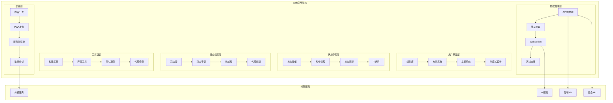

# 太上老君AI平台 - Web应用

## 概述

太上老君AI平台Web应用基于现代前端技术栈构建，提供响应式设计和渐进式Web应用(PWA)体验。集成了AI对话、安全工具、学习教育、数据可视化等核心功能，为用户提供全面的Web端AI安全服务。

## 技术架构

### 整体架构图



## 技术栈选择

### 核心技术栈

```typescript
// 技术栈配置
export const TechStack = {
  // 核心框架
  framework: 'React 18 + TypeScript',
  
  // 构建工具
  buildTool: 'Vite 4.0+',
  
  // 状态管理
  stateManagement: 'Redux Toolkit + RTK Query',
  
  // 路由管理
  routing: 'React Router 6',
  
  // UI组件库
  uiLibrary: 'Ant Design + Custom Components',
  
  // 样式方案
  styling: 'Styled Components + CSS Modules',
  
  // 数据可视化
  visualization: 'D3.js + ECharts + Three.js',
  
  // 网络请求
  networking: 'Axios + Socket.io',
  
  // 测试框架
  testing: 'Jest + React Testing Library + Cypress',
  
  // 代码质量
  quality: 'ESLint + Prettier + Husky',
  
  // 部署方案
  deployment: 'Docker + Nginx + CDN',
  
  // 监控分析
  monitoring: 'Sentry + Google Analytics + Custom'
};
```

### 项目结构

```
web/
├── public/                 # 静态资源
│   ├── index.html
│   ├── manifest.json      # PWA配置
│   └── icons/             # 应用图标
├── src/
│   ├── components/        # 通用组件
│   │   ├── common/        # 基础组件
│   │   ├── layout/        # 布局组件
│   │   └── business/      # 业务组件
│   ├── pages/             # 页面组件
│   │   ├── auth/          # 认证页面
│   │   ├── dashboard/     # 仪表板
│   │   ├── ai-chat/       # AI对话
│   │   ├── security/      # 安全工具
│   │   └── learning/      # 学习教育
│   ├── store/             # 状态管理
│   │   ├── slices/        # Redux切片
│   │   ├── api/           # API切片
│   │   └── middleware/    # 中间件
│   ├── services/          # 服务层
│   │   ├── api/           # API服务
│   │   ├── auth/          # 认证服务
│   │   └── utils/         # 工具函数
│   ├── hooks/             # 自定义Hook
│   ├── types/             # TypeScript类型
│   ├── styles/            # 样式文件
│   ├── assets/            # 资源文件
│   └── utils/             # 工具函数
├── tests/                 # 测试文件
├── docs/                  # 文档
├── scripts/               # 构建脚本
├── package.json
├── vite.config.ts         # Vite配置
├── tsconfig.json          # TypeScript配置
└── README.md
```

## 菜单系统架构

### 菜单配置系统

太上老君AI平台采用了基于配置的动态菜单系统，支持权限控制、状态管理和多级嵌套结构。

#### 菜单配置结构

```typescript
// 菜单项接口定义
export interface MenuItem {
  key: string;                    // 唯一标识
  icon?: React.ReactNode;         // 图标组件
  label: string;                  // 显示标签
  path?: string;                  // 路由路径
  children?: MenuItem[];          // 子菜单
  status: 'completed' | 'partial' | 'planned';  // 开发状态
  description?: string;           // 功能描述
  requiredRole?: string[];        // 所需角色
  requiredPermission?: string[];  // 所需权限
  badge?: string;                 // 徽章文本
  priority: 'high' | 'medium' | 'low';  // 优先级
}
```

#### 主菜单配置

系统主菜单包含以下核心模块：

1. **🏠 仪表板** - 系统概览和快捷操作
2. **🧠 AI智能服务** - AI对话、多模态AI、智能分析、内容生成
3. **📚 文化智慧** - 智慧库、搜索、推荐、分类管理
4. **🌐 社区交流** - 社区动态、实时聊天、兴趣小组、活动中心
5. **🎓 智能学习** - 课程中心、学习进度、能力评估、认证中心
6. **💼 项目管理** - 项目工作台、任务管理、团队协作、项目分析
7. **🏥 健康管理** - 健康监测、健康档案、健康分析、健康建议
8. **🔒 安全中心** - 安全扫描、安全监控、安全教育、安全工具
9. **⚙️ 系统管理** - 系统设置、用户管理、权限管理、系统监控
10. **📱 跨平台应用** - 移动应用、桌面应用、手表应用、Web应用

#### 权限控制系统

```typescript
// 权限过滤函数
export const filterMenuByPermissions = (
  menuItems: MenuItem[],
  userRoles: string[] = [],
  userPermissions: string[] = []
): MenuItem[] => {
  return menuItems.filter(item => {
    // 检查角色权限
    if (item.requiredRole && item.requiredRole.length > 0) {
      const hasRole = item.requiredRole.some(role => userRoles.includes(role));
      if (!hasRole) return false;
    }
    
    // 检查具体权限
    if (item.requiredPermission && item.requiredPermission.length > 0) {
      const hasPermission = item.requiredPermission.some(permission => 
        userPermissions.includes(permission)
      );
      if (!hasPermission) return false;
    }
    
    // 递归过滤子菜单
    if (item.children) {
      item.children = filterMenuByPermissions(item.children, userRoles, userPermissions);
    }
    
    return true;
  });
};
```

#### 状态管理

菜单系统支持基于开发状态的过滤：

- **✅ completed**: 已完成开发，可正常使用
- **🔄 partial**: 部分开发，功能有限
- **⏳ planned**: 规划中，暂未开发

```typescript
// 状态过滤函数
export const filterMenuByStatus = (
  menuItems: MenuItem[],
  includeStatuses: ('completed' | 'partial' | 'planned')[] = ['completed', 'partial']
): MenuItem[] => {
  return menuItems.filter(item => {
    if (!includeStatuses.includes(item.status)) {
      return false;
    }
    
    if (item.children) {
      item.children = filterMenuByStatus(item.children, includeStatuses);
    }
    
    return true;
  });
};
```

#### 菜单渲染组件

```typescript
// 侧边栏菜单组件
const Sidebar: React.FC = () => {
  const { user } = useAuth();
  const location = useLocation();
  
  // 根据用户权限过滤菜单
  const filteredMenu = useMemo(() => {
    let filtered = filterMenuByPermissions(
      mainMenuConfig,
      user?.roles || [],
      user?.permissions || []
    );
    
    // 根据开发状态过滤
    filtered = filterMenuByStatus(filtered, ['completed', 'partial']);
    
    return filtered;
  }, [user]);
  
  // 转换为Ant Design菜单格式
  const menuItems = useMemo(() => {
    return convertToAntdMenuItems(filteredMenu);
  }, [filteredMenu]);
  
  return (
    <Sider width={256} className="site-layout-background">
      <div className="logo">
        
      </div>
      <Menu
        mode="inline"
        selectedKeys={[location.pathname]}
        style={{ height: '100%', borderRight: 0 }}
        items={menuItems}
      />
    </Sider>
  );
};
```

## 核心功能模块

### 1. AI对话界面

#### 智能对话组件

```typescript
// AI对话主界面
import React, { useState, useEffect, useRef, useCallback } from 'react';
import { useDispatch, useSelector } from 'react-redux';
import { Layout, Input, Button, Avatar, Typography, Spin, Alert } from 'antd';
import { SendOutlined, RobotOutlined, UserOutlined } from '@ant-design/icons';
import styled from 'styled-components';
import { sendMessage, receiveMessage, clearMessages } from '../store/slices/chatSlice';
import { ChatMessage, MessageType, ChatState } from '../types/chat';
import { useWebSocket } from '../hooks/useWebSocket';
import MessageBubble from '../components/chat/MessageBubble';
import TypingIndicator from '../components/chat/TypingIndicator';
import ChatSettings from '../components/chat/ChatSettings';

const { Content, Sider } = Layout;
const { TextArea } = Input;
const { Title } = Typography;

interface AIChatPageProps {}

const AIChatPage: React.FC<AIChatPageProps> = () => {
  const dispatch = useDispatch();
  const { messages, isLoading, error, sessionId } = useSelector(
    (state: any) => state.chat as ChatState
  );
  
  const [inputValue, setInputValue] = useState('');
  const [isTyping, setIsTyping] = useState(false);
  const [showSettings, setShowSettings] = useState(false);
  const messagesEndRef = useRef<HTMLDivElement>(null);
  const inputRef = useRef<any>(null);

  // WebSocket连接
  const { 
    isConnected, 
    sendMessage: sendWebSocketMessage,
    lastMessage 
  } = useWebSocket('wss://api.taishanglaojun.ai/chat/ws', {
    onOpen: () => console.log('WebSocket连接已建立'),
    onClose: () => console.log('WebSocket连接已关闭'),
    onError: (error) => console.error('WebSocket错误:', error),
    shouldReconnect: () => true,
    reconnectAttempts: 5,
    reconnectInterval: 3000
  });

  // 处理AI响应
  useEffect(() => {
    if (lastMessage) {
      try {
        const data = JSON.parse(lastMessage.data);
        handleAIResponse(data);
      } catch (error) {
        console.error('解析WebSocket消息失败:', error);
      }
    }
  }, [lastMessage]);

  // 自动滚动到底部
  useEffect(() => {
    scrollToBottom();
  }, [messages, isTyping]);

  const scrollToBottom = () => {
    messagesEndRef.current?.scrollIntoView({ behavior: 'smooth' });
  };

  const handleSendMessage = useCallback(async () => {
    if (!inputValue.trim() || isLoading) return;

    const userMessage: ChatMessage = {
      id: Date.now().toString(),
      type: MessageType.USER,
      content: inputValue.trim(),
      timestamp: new Date(),
      status: 'sent'
    };

    // 添加用户消息到聊天记录
    dispatch(sendMessage(userMessage));
    setInputValue('');
    setIsTyping(true);

    // 发送消息到AI服务
    if (isConnected) {
      sendWebSocketMessage(JSON.stringify({
        type: 'chat',
        message: userMessage.content,
        sessionId,
        context: {
          userId: 'current_user_id',
          platform: 'web',
          timestamp: userMessage.timestamp.toISOString()
        }
      }));
    }

    // 聚焦输入框
    inputRef.current?.focus();
  }, [inputValue, isLoading, isConnected, sessionId, dispatch, sendWebSocketMessage]);

  const handleAIResponse = (data: any) => {
    setIsTyping(false);

    const aiMessage: ChatMessage = {
      id: Date.now().toString(),
      type: MessageType.AI,
      content: data.message,
      timestamp: new Date(),
      status: 'received',
      metadata: {
        confidence: data.confidence,
        processingTime: data.processingTime,
        model: data.model,
        tokens: data.tokens
      }
    };

    dispatch(receiveMessage(aiMessage));
  };

  const handleKeyPress = (e: React.KeyboardEvent) => {
    if (e.key === 'Enter' && !e.shiftKey) {
      e.preventDefault();
      handleSendMessage();
    }
  };

  const handleClearMessages = () => {
    dispatch(clearMessages());
  };

  return (
    <StyledLayout>
      <Content>
        <ChatContainer>
          <ChatHeader>
            <Title level={3}>
              <RobotOutlined /> 太上老君AI助手
            </Title>
            <HeaderActions>
              <Button 
                type="text" 
                onClick={() => setShowSettings(!showSettings)}
              >
                设置
              </Button>
              <Button 
                type="text" 
                onClick={handleClearMessages}
              >
                清空对话
              </Button>
            </HeaderActions>
          </ChatHeader>

          {error && (
            <Alert
              message="连接错误"
              description={error}
              type="error"
              closable
              style={{ margin: '16px 0' }}
            />
          )}

          <MessagesContainer>
            {messages.length === 0 ? (
              <WelcomeMessage>
                <RobotOutlined style={{ fontSize: '48px', color: '#1890ff' }} />
                <Title level={4}>欢迎使用太上老君AI助手</Title>
                <p>我是您的专业网络安全AI助手，可以帮您解答安全问题、分析威胁、提供建议。</p>
                <SuggestedQuestions>
                  <Button 
                    type="dashed" 
                    onClick={() => setInputValue('什么是SQL注入攻击？')}
                  >
                    什么是SQL注入攻击？
                  </Button>
                  <Button 
                    type="dashed" 
                    onClick={() => setInputValue('如何进行网络安全评估？')}
                  >
                    如何进行网络安全评估？
                  </Button>
                  <Button 
                    type="dashed" 
                    onClick={() => setInputValue('推荐一些安全工具')}
                  >
                    推荐一些安全工具
                  </Button>
                </SuggestedQuestions>
              </WelcomeMessage>
            ) : (
              <MessagesList>
                {messages.map((message) => (
                  <MessageBubble
                    key={message.id}
                    message={message}
                    onRetry={message.type === MessageType.USER ? handleSendMessage : undefined}
                  />
                ))}
                {isTyping && <TypingIndicator />}
                <div ref={messagesEndRef} />
              </MessagesList>
            )}
          </MessagesContainer>

          <InputContainer>
            <InputWrapper>
              <TextArea
                ref={inputRef}
                value={inputValue}
                onChange={(e) => setInputValue(e.target.value)}
                onKeyPress={handleKeyPress}
                placeholder="输入您的问题... (Shift+Enter换行，Enter发送)"
                autoSize={{ minRows: 1, maxRows: 4 }}
                disabled={!isConnected || isLoading}
              />
              <SendButton
                type="primary"
                icon={<SendOutlined />}
                onClick={handleSendMessage}
                disabled={!inputValue.trim() || !isConnected || isLoading}
                loading={isLoading}
              >
                发送
              </SendButton>
            </InputWrapper>
            
            <ConnectionStatus>
              <StatusIndicator connected={isConnected} />
              <span>{isConnected ? '已连接' : '连接中...'}</span>
            </ConnectionStatus>
          </InputContainer>
        </ChatContainer>
      </Content>

      {showSettings && (
        <Sider width={300} theme="light">
          <ChatSettings onClose={() => setShowSettings(false)} />
        </Sider>
      )}
    </StyledLayout>
  );
};

// 样式组件
const StyledLayout = styled(Layout)`
  height: 100vh;
  background: #f5f5f5;
`;

const ChatContainer = styled.div`
  display: flex;
  flex-direction: column;
  height: 100%;
  background: white;
  border-radius: 8px;
  margin: 16px;
  box-shadow: 0 2px 8px rgba(0, 0, 0, 0.1);
`;

const ChatHeader = styled.div`
  display: flex;
  justify-content: space-between;
  align-items: center;
  padding: 16px 24px;
  border-bottom: 1px solid #f0f0f0;
  background: white;
  border-radius: 8px 8px 0 0;
`;

const HeaderActions = styled.div`
  display: flex;
  gap: 8px;
`;

const MessagesContainer = styled.div`
  flex: 1;
  overflow-y: auto;
  padding: 16px 24px;
  background: #fafafa;
`;

const WelcomeMessage = styled.div`
  display: flex;
  flex-direction: column;
  align-items: center;
  justify-content: center;
  height: 100%;
  text-align: center;
  color: #666;
`;

const SuggestedQuestions = styled.div`
  display: flex;
  flex-direction: column;
  gap: 8px;
  margin-top: 24px;
  
  @media (min-width: 768px) {
    flex-direction: row;
  }
`;

const MessagesList = styled.div`
  display: flex;
  flex-direction: column;
  gap: 16px;
`;

const InputContainer = styled.div`
  padding: 16px 24px;
  border-top: 1px solid #f0f0f0;
  background: white;
  border-radius: 0 0 8px 8px;
`;

const InputWrapper = styled.div`
  display: flex;
  gap: 12px;
  align-items: flex-end;
`;

const SendButton = styled(Button)`
  height: auto;
  min-height: 32px;
`;

const ConnectionStatus = styled.div`
  display: flex;
  align-items: center;
  gap: 8px;
  margin-top: 8px;
  font-size: 12px;
  color: #666;
`;

const StatusIndicator = styled.div<{ connected: boolean }>`
  width: 8px;
  height: 8px;
  border-radius: 50%;
  background-color: ${props => props.connected ? '#52c41a' : '#ff4d4f'};
`;

export default AIChatPage;
```

#### 消息气泡组件

```typescript
// 消息气泡组件
import React from 'react';
import { Avatar, Typography, Tag, Button, Tooltip } from 'antd';
import { UserOutlined, RobotOutlined, ReloadOutlined, CopyOutlined } from '@ant-design/icons';
import styled from 'styled-components';
import { ChatMessage, MessageType } from '../../types/chat';
import { formatTime, copyToClipboard } from '../../utils/helpers';
import ReactMarkdown from 'react-markdown';
import { Prism as SyntaxHighlighter } from 'react-syntax-highlighter';
import { tomorrow } from 'react-syntax-highlighter/dist/esm/styles/prism';

const { Text } = Typography;

interface MessageBubbleProps {
  message: ChatMessage;
  onRetry?: () => void;
}

const MessageBubble: React.FC<MessageBubbleProps> = ({ message, onRetry }) => {
  const isUser = message.type === MessageType.USER;
  const isAI = message.type === MessageType.AI;

  const handleCopyMessage = () => {
    copyToClipboard(message.content);
  };

  const renderMessageContent = () => {
    if (isAI) {
      return (
        <ReactMarkdown
          components={{
            code({ node, inline, className, children, ...props }) {
              const match = /language-(\w+)/.exec(className || '');
              return !inline && match ? (
                <SyntaxHighlighter
                  style={tomorrow}
                  language={match[1]}
                  PreTag="div"
                  {...props}
                >
                  {String(children).replace(/\n$/, '')}
                </SyntaxHighlighter>
              ) : (
                <code className={className} {...props}>
                  {children}
                </code>
              );
            }
          }}
        >
          {message.content}
        </ReactMarkdown>
      );
    }
    
    return <Text>{message.content}</Text>;
  };

  return (
    <MessageContainer isUser={isUser}>
      <MessageWrapper isUser={isUser}>
        <AvatarContainer>
          <Avatar 
            icon={isUser ? <UserOutlined /> : <RobotOutlined />}
            style={{ 
              backgroundColor: isUser ? '#1890ff' : '#52c41a' 
            }}
          />
        </AvatarContainer>
        
        <MessageContent isUser={isUser}>
          <MessageBubbleContent isUser={isUser}>
            {renderMessageContent()}
          </MessageBubbleContent>
          
          <MessageFooter>
            <MessageTime>
              {formatTime(message.timestamp)}
            </MessageTime>
            
            {message.status === 'failed' && onRetry && (
              <Button 
                type="text" 
                size="small" 
                icon={<ReloadOutlined />}
                onClick={onRetry}
                danger
              >
                重试
              </Button>
            )}
            
            <Tooltip title="复制消息">
              <Button 
                type="text" 
                size="small" 
                icon={<CopyOutlined />}
                onClick={handleCopyMessage}
              />
            </Tooltip>
            
            {message.metadata?.confidence && (
              <Tag color="blue" size="small">
                置信度: {(message.metadata.confidence * 100).toFixed(1)}%
              </Tag>
            )}
            
            {message.metadata?.model && (
              <Tag color="green" size="small">
                {message.metadata.model}
              </Tag>
            )}
            
            {message.metadata?.processingTime && (
              <Tag color="orange" size="small">
                {message.metadata.processingTime}ms
              </Tag>
            )}
          </MessageFooter>
        </MessageContent>
      </MessageWrapper>
    </MessageContainer>
  );
};

// 样式组件
const MessageContainer = styled.div<{ isUser: boolean }>`
  display: flex;
  justify-content: ${props => props.isUser ? 'flex-end' : 'flex-start'};
  margin-bottom: 16px;
`;

const MessageWrapper = styled.div<{ isUser: boolean }>`
  display: flex;
  flex-direction: ${props => props.isUser ? 'row-reverse' : 'row'};
  align-items: flex-start;
  max-width: 70%;
  gap: 12px;
`;

const AvatarContainer = styled.div`
  flex-shrink: 0;
`;

const MessageContent = styled.div<{ isUser: boolean }>`
  display: flex;
  flex-direction: column;
  align-items: ${props => props.isUser ? 'flex-end' : 'flex-start'};
  gap: 8px;
`;

const MessageBubbleContent = styled.div<{ isUser: boolean }>`
  background: ${props => props.isUser ? '#1890ff' : '#ffffff'};
  color: ${props => props.isUser ? '#ffffff' : '#333333'};
  padding: 12px 16px;
  border-radius: 16px;
  border: ${props => props.isUser ? 'none' : '1px solid #f0f0f0'};
  box-shadow: 0 2px 4px rgba(0, 0, 0, 0.1);
  word-wrap: break-word;
  
  pre {
    background: ${props => props.isUser ? 'rgba(255, 255, 255, 0.1)' : '#f6f8fa'};
    border-radius: 4px;
    padding: 8px;
    margin: 8px 0;
    overflow-x: auto;
  }
  
  code {
    background: ${props => props.isUser ? 'rgba(255, 255, 255, 0.2)' : '#f1f3f4'};
    padding: 2px 4px;
    border-radius: 3px;
    font-family: 'Monaco', 'Menlo', 'Ubuntu Mono', monospace;
  }
`;

const MessageFooter = styled.div`
  display: flex;
  align-items: center;
  gap: 8px;
  flex-wrap: wrap;
`;

const MessageTime = styled(Text)`
  font-size: 12px;
  color: #999;
`;

export default MessageBubble;
```

### 2. 安全工具仪表板

#### 安全工具主界面

```typescript
// 安全工具仪表板
import React, { useState, useEffect } from 'react';
import { 
  Layout, 
  Card, 
  Row, 
  Col, 
  Statistic, 
  Table, 
  Tag, 
  Button, 
  Progress,
  Alert,
  Tabs,
  Space,
  Typography,
  Tooltip
} from 'antd';
import {
  SecurityScanOutlined,
  BugOutlined,
  ShieldOutlined,
  WarningOutlined,
  CheckCircleOutlined,
  ClockCircleOutlined,
  FireOutlined,
  EyeOutlined
} from '@ant-design/icons';
import styled from 'styled-components';
import { useDispatch, useSelector } from 'react-redux';
import { fetchSecurityOverview, fetchRecentScans } from '../store/slices/securitySlice';
import { SecurityOverview, ScanResult, ThreatLevel } from '../types/security';
import SecurityChart from '../components/security/SecurityChart';
import ThreatMap from '../components/security/ThreatMap';
import ScanResultModal from '../components/security/ScanResultModal';

const { Content } = Layout;
const { Title, Text } = Typography;
const { TabPane } = Tabs;

interface SecurityDashboardProps {}

const SecurityDashboard: React.FC<SecurityDashboardProps> = () => {
  const dispatch = useDispatch();
  const { 
    overview, 
    recentScans, 
    isLoading, 
    error 
  } = useSelector((state: any) => state.security);
  
  const [selectedScan, setSelectedScan] = useState<ScanResult | null>(null);
  const [showScanModal, setShowScanModal] = useState(false);

  useEffect(() => {
    dispatch(fetchSecurityOverview());
    dispatch(fetchRecentScans());
  }, [dispatch]);

  const getThreatLevelColor = (level: ThreatLevel): string => {
    switch (level) {
      case 'critical': return '#ff4d4f';
      case 'high': return '#ff7a45';
      case 'medium': return '#ffa940';
      case 'low': return '#52c41a';
      default: return '#d9d9d9';
    }
  };

  const getThreatLevelIcon = (level: ThreatLevel) => {
    switch (level) {
      case 'critical': return <FireOutlined style={{ color: '#ff4d4f' }} />;
      case 'high': return <WarningOutlined style={{ color: '#ff7a45' }} />;
      case 'medium': return <ClockCircleOutlined style={{ color: '#ffa940' }} />;
      case 'low': return <CheckCircleOutlined style={{ color: '#52c41a' }} />;
      default: return <ShieldOutlined style={{ color: '#d9d9d9' }} />;
    }
  };

  const scanColumns = [
    {
      title: '扫描目标',
      dataIndex: 'target',
      key: 'target',
      render: (target: string) => (
        <Text strong>{target}</Text>
      )
    },
    {
      title: '扫描类型',
      dataIndex: 'scanType',
      key: 'scanType',
      render: (type: string) => (
        <Tag color="blue">{type}</Tag>
      )
    },
    {
      title: '威胁等级',
      dataIndex: 'threatLevel',
      key: 'threatLevel',
      render: (level: ThreatLevel) => (
        <Tag color={getThreatLevelColor(level)} icon={getThreatLevelIcon(level)}>
          {level.toUpperCase()}
        </Tag>
      )
    },
    {
      title: '发现问题',
      dataIndex: 'issuesFound',
      key: 'issuesFound',
      render: (count: number) => (
        <Statistic 
          value={count} 
          valueStyle={{ fontSize: '14px' }}
          suffix="个"
        />
      )
    },
    {
      title: '扫描时间',
      dataIndex: 'scanTime',
      key: 'scanTime',
      render: (time: string) => (
        <Text type="secondary">{time}</Text>
      )
    },
    {
      title: '状态',
      dataIndex: 'status',
      key: 'status',
      render: (status: string) => {
        const statusConfig = {
          completed: { color: 'success', text: '已完成' },
          running: { color: 'processing', text: '进行中' },
          failed: { color: 'error', text: '失败' },
          pending: { color: 'default', text: '等待中' }
        };
        const config = statusConfig[status as keyof typeof statusConfig];
        return <Tag color={config.color}>{config.text}</Tag>;
      }
    },
    {
      title: '操作',
      key: 'actions',
      render: (_, record: ScanResult) => (
        <Space>
          <Button 
            type="link" 
            icon={<EyeOutlined />}
            onClick={() => {
              setSelectedScan(record);
              setShowScanModal(true);
            }}
          >
            查看详情
          </Button>
        </Space>
      )
    }
  ];

  if (error) {
    return (
      <Alert
        message="加载失败"
        description={error}
        type="error"
        showIcon
        style={{ margin: '24px' }}
      />
    );
  }

  return (
    <StyledContent>
      <DashboardHeader>
        <Title level={2}>
          <SecurityScanOutlined /> 安全工具仪表板
        </Title>
        <Text type="secondary">
          实时监控系统安全状态，快速识别和响应安全威胁
        </Text>
      </DashboardHeader>

      {/* 安全概览统计 */}
      <Row gutter={[16, 16]} style={{ marginBottom: '24px' }}>
        <Col xs={24} sm={12} md={6}>
          <Card>
            <Statistic
              title="总扫描次数"
              value={overview?.totalScans || 0}
              prefix={<SecurityScanOutlined />}
              valueStyle={{ color: '#1890ff' }}
            />
          </Card>
        </Col>
        
        <Col xs={24} sm={12} md={6}>
          <Card>
            <Statistic
              title="发现威胁"
              value={overview?.threatsFound || 0}
              prefix={<BugOutlined />}
              valueStyle={{ color: '#ff4d4f' }}
            />
          </Card>
        </Col>
        
        <Col xs={24} sm={12} md={6}>
          <Card>
            <Statistic
              title="已修复"
              value={overview?.threatsFixed || 0}
              prefix={<CheckCircleOutlined />}
              valueStyle={{ color: '#52c41a' }}
            />
          </Card>
        </Col>
        
        <Col xs={24} sm={12} md={6}>
          <Card>
            <Statistic
              title="安全评分"
              value={overview?.securityScore || 0}
              suffix="/ 100"
              prefix={<ShieldOutlined />}
              valueStyle={{ 
                color: (overview?.securityScore || 0) >= 80 ? '#52c41a' : 
                       (overview?.securityScore || 0) >= 60 ? '#ffa940' : '#ff4d4f'
              }}
            />
          </Card>
        </Col>
      </Row>

      {/* 威胁等级分布 */}
      <Row gutter={[16, 16]} style={{ marginBottom: '24px' }}>
        <Col xs={24} lg={12}>
          <Card title="威胁等级分布" loading={isLoading}>
            <Space direction="vertical" style={{ width: '100%' }}>
              <div>
                <Text>严重威胁</Text>
                <Progress 
                  percent={(overview?.threatDistribution?.critical || 0) * 10} 
                  strokeColor="#ff4d4f"
                  format={() => `${overview?.threatDistribution?.critical || 0}个`}
                />
              </div>
              <div>
                <Text>高危威胁</Text>
                <Progress 
                  percent={(overview?.threatDistribution?.high || 0) * 5} 
                  strokeColor="#ff7a45"
                  format={() => `${overview?.threatDistribution?.high || 0}个`}
                />
              </div>
              <div>
                <Text>中危威胁</Text>
                <Progress 
                  percent={(overview?.threatDistribution?.medium || 0) * 2} 
                  strokeColor="#ffa940"
                  format={() => `${overview?.threatDistribution?.medium || 0}个`}
                />
              </div>
              <div>
                <Text>低危威胁</Text>
                <Progress 
                  percent={overview?.threatDistribution?.low || 0} 
                  strokeColor="#52c41a"
                  format={() => `${overview?.threatDistribution?.low || 0}个`}
                />
              </div>
            </Space>
          </Card>
        </Col>
        
        <Col xs={24} lg={12}>
          <Card title="安全趋势图" loading={isLoading}>
            <SecurityChart data={overview?.securityTrend || []} />
          </Card>
        </Col>
      </Row>

      {/* 详细信息标签页 */}
      <Card>
        <Tabs defaultActiveKey="recent-scans">
          <TabPane tab="最近扫描" key="recent-scans">
            <Table
              columns={scanColumns}
              dataSource={recentScans}
              loading={isLoading}
              rowKey="id"
              pagination={{
                pageSize: 10,
                showSizeChanger: true,
                showQuickJumper: true,
                showTotal: (total) => `共 ${total} 条记录`
              }}
            />
          </TabPane>
          
          <TabPane tab="威胁地图" key="threat-map">
            <ThreatMap threats={overview?.threatMap || []} />
          </TabPane>
          
          <TabPane tab="安全工具" key="security-tools">
            <SecurityToolsGrid />
          </TabPane>
          
          <TabPane tab="安全报告" key="security-reports">
            <SecurityReports />
          </TabPane>
        </Tabs>
      </Card>

      {/* 扫描结果详情模态框 */}
      <ScanResultModal
        visible={showScanModal}
        scanResult={selectedScan}
        onClose={() => {
          setShowScanModal(false);
          setSelectedScan(null);
        }}
      />
    </StyledContent>
  );
};

// 安全工具网格组件
const SecurityToolsGrid: React.FC = () => {
  const securityTools = [
    {
      id: 'port-scan',
      name: '端口扫描',
      description: '扫描目标主机开放的端口',
      icon: <SecurityScanOutlined />,
      color: '#1890ff'
    },
    {
      id: 'vuln-scan',
      name: '漏洞扫描',
      description: '检测系统和应用程序漏洞',
      icon: <BugOutlined />,
      color: '#ff4d4f'
    },
    {
      id: 'ssl-check',
      name: 'SSL检查',
      description: '验证SSL证书和配置',
      icon: <ShieldOutlined />,
      color: '#52c41a'
    },
    {
      id: 'dns-lookup',
      name: 'DNS查询',
      description: '查询域名DNS记录信息',
      icon: <EyeOutlined />,
      color: '#722ed1'
    }
  ];

  return (
    <Row gutter={[16, 16]}>
      {securityTools.map(tool => (
        <Col xs={24} sm={12} md={8} lg={6} key={tool.id}>
          <ToolCard>
            <div style={{ textAlign: 'center', marginBottom: '16px' }}>
              <div style={{ 
                fontSize: '32px', 
                color: tool.color,
                marginBottom: '8px'
              }}>
                {tool.icon}
              </div>
              <Title level={4}>{tool.name}</Title>
              <Text type="secondary">{tool.description}</Text>
            </div>
            <Button type="primary" block>
              启动工具
            </Button>
          </ToolCard>
        </Col>
      ))}
    </Row>
  );
};

// 安全报告组件
const SecurityReports: React.FC = () => {
  return (
    <div>
      <Alert
        message="安全报告功能"
        description="详细的安全报告功能正在开发中，敬请期待。"
        type="info"
        showIcon
      />
    </div>
  );
};

// 样式组件
const StyledContent = styled(Content)`
  padding: 24px;
  background: #f5f5f5;
  min-height: 100vh;
`;

const DashboardHeader = styled.div`
  margin-bottom: 24px;
  text-align: center;
  
  @media (min-width: 768px) {
    text-align: left;
  }
`;

const ToolCard = styled(Card)`
  height: 200px;
  display: flex;
  flex-direction: column;
  justify-content: space-between;
  
  .ant-card-body {
    display: flex;
    flex-direction: column;
    justify-content: space-between;
    height: 100%;
  }
  
  &:hover {
    box-shadow: 0 4px 12px rgba(0, 0, 0, 0.15);
    transform: translateY(-2px);
    transition: all 0.3s ease;
  }
`;

export default SecurityDashboard;
```

### 3. 数据可视化组件

#### 安全趋势图表

```typescript
// 安全趋势图表组件
import React, { useEffect, useRef } from 'react';
import * as echarts from 'echarts';
import { Card, Spin } from 'antd';
import styled from 'styled-components';

interface SecurityChartProps {
  data: Array<{
    date: string;
    threats: number;
    scans: number;
    fixes: number;
  }>;
  loading?: boolean;
}

const SecurityChart: React.FC<SecurityChartProps> = ({ data, loading = false }) => {
  const chartRef = useRef<HTMLDivElement>(null);
  const chartInstance = useRef<echarts.ECharts | null>(null);

  useEffect(() => {
    if (!chartRef.current || loading) return;

    // 初始化图表
    chartInstance.current = echarts.init(chartRef.current);

    const option = {
      title: {
        text: '安全趋势分析',
        left: 'center',
        textStyle: {
          fontSize: 16,
          fontWeight: 'bold'
        }
      },
      tooltip: {
        trigger: 'axis',
        axisPointer: {
          type: 'cross',
          label: {
            backgroundColor: '#6a7985'
          }
        }
      },
      legend: {
        data: ['威胁数量', '扫描次数', '修复数量'],
        bottom: 10
      },
      grid: {
        left: '3%',
        right: '4%',
        bottom: '15%',
        containLabel: true
      },
      xAxis: {
        type: 'category',
        boundaryGap: false,
        data: data.map(item => item.date)
      },
      yAxis: {
        type: 'value'
      },
      series: [
        {
          name: '威胁数量',
          type: 'line',
          stack: 'Total',
          smooth: true,
          lineStyle: {
            color: '#ff4d4f'
          },
          areaStyle: {
            color: new echarts.graphic.LinearGradient(0, 0, 0, 1, [
              { offset: 0, color: 'rgba(255, 77, 79, 0.3)' },
              { offset: 1, color: 'rgba(255, 77, 79, 0.1)' }
            ])
          },
          data: data.map(item => item.threats)
        },
        {
          name: '扫描次数',
          type: 'line',
          stack: 'Total',
          smooth: true,
          lineStyle: {
            color: '#1890ff'
          },
          areaStyle: {
            color: new echarts.graphic.LinearGradient(0, 0, 0, 1, [
              { offset: 0, color: 'rgba(24, 144, 255, 0.3)' },
              { offset: 1, color: 'rgba(24, 144, 255, 0.1)' }
            ])
          },
          data: data.map(item => item.scans)
        },
        {
          name: '修复数量',
          type: 'line',
          stack: 'Total',
          smooth: true,
          lineStyle: {
            color: '#52c41a'
          },
          areaStyle: {
            color: new echarts.graphic.LinearGradient(0, 0, 0, 1, [
              { offset: 0, color: 'rgba(82, 196, 26, 0.3)' },
              { offset: 1, color: 'rgba(82, 196, 26, 0.1)' }
            ])
          },
          data: data.map(item => item.fixes)
        }
      ]
    };

    chartInstance.current.setOption(option);

    // 响应式处理
    const handleResize = () => {
      chartInstance.current?.resize();
    };

    window.addEventListener('resize', handleResize);

    return () => {
      window.removeEventListener('resize', handleResize);
      chartInstance.current?.dispose();
    };
  }, [data, loading]);

  if (loading) {
    return (
      <ChartContainer>
        <Spin size="large" />
      </ChartContainer>
    );
  }

  return (
    <ChartContainer>
      <div ref={chartRef} style={{ width: '100%', height: '400px' }} />
    </ChartContainer>
  );
};

const ChartContainer = styled.div`
  display: flex;
  justify-content: center;
  align-items: center;
  min-height: 400px;
`;

export default SecurityChart;
```

## PWA配置

### Service Worker配置

```typescript
// public/sw.js - Service Worker
const CACHE_NAME = 'taishang-laojun-v1.0.0';
const urlsToCache = [
  '/',
  '/static/js/bundle.js',
  '/static/css/main.css',
  '/manifest.json',
  '/icons/icon-192x192.png',
  '/icons/icon-512x512.png'
];

// 安装事件
self.addEventListener('install', (event) => {
  event.waitUntil(
    caches.open(CACHE_NAME)
      .then((cache) => {
        console.log('Opened cache');
        return cache.addAll(urlsToCache);
      })
  );
});

// 激活事件
self.addEventListener('activate', (event) => {
  event.waitUntil(
    caches.keys().then((cacheNames) => {
      return Promise.all(
        cacheNames.map((cacheName) => {
          if (cacheName !== CACHE_NAME) {
            console.log('Deleting old cache:', cacheName);
            return caches.delete(cacheName);
          }
        })
      );
    })
  );
});

// 拦截网络请求
self.addEventListener('fetch', (event) => {
  event.respondWith(
    caches.match(event.request)
      .then((response) => {
        // 如果缓存中有响应，则返回缓存的版本
        if (response) {
          return response;
        }
        
        // 否则，发起网络请求
        return fetch(event.request).then((response) => {
          // 检查是否收到有效响应
          if (!response || response.status !== 200 || response.type !== 'basic') {
            return response;
          }
          
          // 克隆响应
          const responseToCache = response.clone();
          
          caches.open(CACHE_NAME)
            .then((cache) => {
              cache.put(event.request, responseToCache);
            });
          
          return response;
        });
      })
  );
});

// 推送通知
self.addEventListener('push', (event) => {
  const options = {
    body: event.data ? event.data.text() : '您有新的安全警报',
    icon: '/icons/icon-192x192.png',
    badge: '/icons/badge-72x72.png',
    vibrate: [100, 50, 100],
    data: {
      dateOfArrival: Date.now(),
      primaryKey: 1
    },
    actions: [
      {
        action: 'explore',
        title: '查看详情',
        icon: '/icons/checkmark.png'
      },
      {
        action: 'close',
        title: '关闭',
        icon: '/icons/xmark.png'
      }
    ]
  };
  
  event.waitUntil(
    self.registration.showNotification('太上老君AI平台', options)
  );
});

// 通知点击事件
self.addEventListener('notificationclick', (event) => {
  event.notification.close();
  
  if (event.action === 'explore') {
    // 打开应用
    event.waitUntil(
      clients.openWindow('/')
    );
  }
});
```

### PWA Manifest配置

```json
{
  "name": "太上老君AI平台",
  "short_name": "太上老君",
  "description": "专业的AI驱动网络安全平台",
  "start_url": "/",
  "display": "standalone",
  "theme_color": "#1890ff",
  "background_color": "#ffffff",
  "orientation": "portrait-primary",
  "scope": "/",
  "lang": "zh-CN",
  "icons": [
    {
      "src": "/icons/icon-72x72.png",
      "sizes": "72x72",
      "type": "image/png",
      "purpose": "maskable any"
    },
    {
      "src": "/icons/icon-96x96.png",
      "sizes": "96x96",
      "type": "image/png",
      "purpose": "maskable any"
    },
    {
      "src": "/icons/icon-128x128.png",
      "sizes": "128x128",
      "type": "image/png",
      "purpose": "maskable any"
    },
    {
      "src": "/icons/icon-144x144.png",
      "sizes": "144x144",
      "type": "image/png",
      "purpose": "maskable any"
    },
    {
      "src": "/icons/icon-152x152.png",
      "sizes": "152x152",
      "type": "image/png",
      "purpose": "maskable any"
    },
    {
      "src": "/icons/icon-192x192.png",
      "sizes": "192x192",
      "type": "image/png",
      "purpose": "maskable any"
    },
    {
      "src": "/icons/icon-384x384.png",
      "sizes": "384x384",
      "type": "image/png",
      "purpose": "maskable any"
    },
    {
      "src": "/icons/icon-512x512.png",
      "sizes": "512x512",
      "type": "image/png",
      "purpose": "maskable any"
    }
  ],
  "screenshots": [
    {
      "src": "/screenshots/desktop-1.png",
      "sizes": "1280x720",
      "type": "image/png",
      "platform": "wide"
    },
    {
      "src": "/screenshots/mobile-1.png",
      "sizes": "375x667",
      "type": "image/png",
      "platform": "narrow"
    }
  ],
  "categories": ["security", "productivity", "education"],
  "shortcuts": [
    {
      "name": "AI对话",
      "short_name": "AI助手",
      "description": "快速启动AI安全助手",
      "url": "/chat",
      "icons": [
        {
          "src": "/icons/chat-96x96.png",
          "sizes": "96x96"
        }
      ]
    },
    {
      "name": "安全扫描",
      "short_name": "扫描",
      "description": "启动安全扫描工具",
      "url": "/security/scan",
      "icons": [
        {
          "src": "/icons/scan-96x96.png",
          "sizes": "96x96"
        }
      ]
    },
    {
      "name": "学习中心",
      "short_name": "学习",
      "description": "访问安全学习资源",
      "url": "/learning",
      "icons": [
        {
          "src": "/icons/learn-96x96.png",
          "sizes": "96x96"
        }
      ]
    }
  ],
  "related_applications": [
    {
      "platform": "play",
      "url": "https://play.google.com/store/apps/details?id=com.taishanglaojun.mobile",
      "id": "com.taishanglaojun.mobile"
    },
    {
      "platform": "itunes",
      "url": "https://apps.apple.com/app/taishang-laojun/id123456789",
      "id": "123456789"
    }
  ],
  "prefer_related_applications": false
}
```

## 部署配置

### Docker配置

```dockerfile
# Dockerfile
FROM node:18-alpine as builder

WORKDIR /app

# 复制package文件
COPY package*.json ./
RUN npm ci --only=production

# 复制源代码
COPY . .

# 构建应用
RUN npm run build

# 生产环境
FROM nginx:alpine

# 复制构建结果
COPY --from=builder /app/dist /usr/share/nginx/html

# 复制nginx配置
COPY nginx.conf /etc/nginx/nginx.conf

# 暴露端口
EXPOSE 80

# 启动nginx
CMD ["nginx", "-g", "daemon off;"]
```

### Nginx配置

```nginx
# nginx.conf
events {
    worker_connections 1024;
}

http {
    include       /etc/nginx/mime.types;
    default_type  application/octet-stream;
    
    # Gzip压缩
    gzip on;
    gzip_vary on;
    gzip_min_length 1024;
    gzip_types text/plain text/css text/xml text/javascript application/javascript application/xml+rss application/json;
    
    # 安全头
    add_header X-Frame-Options DENY;
    add_header X-Content-Type-Options nosniff;
    add_header X-XSS-Protection "1; mode=block";
    add_header Strict-Transport-Security "max-age=31536000; includeSubDomains" always;
    
    server {
        listen 80;
        server_name localhost;
        root /usr/share/nginx/html;
        index index.html;
        
        # 静态资源缓存
        location ~* \.(js|css|png|jpg|jpeg|gif|ico|svg|woff|woff2|ttf|eot)$ {
            expires 1y;
            add_header Cache-Control "public, immutable";
        }
        
        # PWA文件
        location = /manifest.json {
            add_header Cache-Control "public, max-age=0, must-revalidate";
        }
        
        location = /sw.js {
            add_header Cache-Control "public, max-age=0, must-revalidate";
        }
        
        # SPA路由支持
        location / {
            try_files $uri $uri/ /index.html;
        }
        
        # API代理
        location /api/ {
            proxy_pass http://backend:8080/;
            proxy_set_header Host $host;
            proxy_set_header X-Real-IP $remote_addr;
            proxy_set_header X-Forwarded-For $proxy_add_x_forwarded_for;
            proxy_set_header X-Forwarded-Proto $scheme;
        }
        
        # WebSocket代理
        location /ws/ {
            proxy_pass http://backend:8080/ws/;
            proxy_http_version 1.1;
            proxy_set_header Upgrade $http_upgrade;
            proxy_set_header Connection "upgrade";
            proxy_set_header Host $host;
            proxy_set_header X-Real-IP $remote_addr;
            proxy_set_header X-Forwarded-For $proxy_add_x_forwarded_for;
            proxy_set_header X-Forwarded-Proto $scheme;
        }
    }
}
```

## 性能优化

### Web性能优化策略

```typescript
// 性能优化配置
export const PerformanceConfig = {
  // 代码分割
  codeSplitting: {
    // 路由级别分割
    routeLevel: true,
    
    // 组件级别分割
    componentLevel: true,
    
    // 第三方库分割
    vendorSplit: {
      react: ['react', 'react-dom'],
      antd: ['antd'],
      charts: ['echarts', 'd3'],
      utils: ['lodash', 'moment']
    }
  },
  
  // 资源优化
  assets: {
    // 图片优化
    images: {
      format: 'webp',
      quality: 80,
      progressive: true,
      lazyLoading: true
    },
    
    // 字体优化
    fonts: {
      preload: ['main.woff2'],
      display: 'swap',
      subset: 'chinese'
    }
  },
  
  // 缓存策略
  caching: {
    // 静态资源缓存
    static: {
      maxAge: '1y',
      immutable: true
    },
    
    // API缓存
    api: {
      strategy: 'stale-while-revalidate',
      maxAge: '5m'
    },
    
    // 页面缓存
    pages: {
      strategy: 'network-first',
      maxAge: '1h'
    }
  },
  
  // 预加载策略
  preloading: {
    // 关键路由预加载
    criticalRoutes: ['/dashboard', '/chat'],
    
    // 资源预加载
    resources: ['fonts', 'critical-images'],
    
    // 预取策略
    prefetch: {
      enabled: true,
      routes: ['likely-next-pages'],
      threshold: 0.8
    }
  }
};
```

## 监控与分析

### Web应用监控

```typescript
// Web应用监控配置
import { init as sentryInit } from '@sentry/react';
import { Integrations } from '@sentry/tracing';

// 错误监控初始化
export const initErrorMonitoring = () => {
  sentryInit({
    dsn: process.env.REACT_APP_SENTRY_DSN,
    integrations: [
      new Integrations.BrowserTracing(),
    ],
    tracesSampleRate: 1.0,
    environment: process.env.NODE_ENV,
    beforeSend(event) {
      // 过滤敏感信息
      if (event.exception) {
        const error = event.exception.values?.[0];
        if (error?.value?.includes('password')) {
          return null;
        }
      }
      return event;
    }
  });
};

// 性能监控
export class WebPerformanceMonitor {
  private static instance: WebPerformanceMonitor;
  
  static getInstance(): WebPerformanceMonitor {
    if (!WebPerformanceMonitor.instance) {
      WebPerformanceMonitor.instance = new WebPerformanceMonitor();
    }
    return WebPerformanceMonitor.instance;
  }
  
  // 监控页面加载性能
  monitorPageLoad() {
    if ('performance' in window) {
      window.addEventListener('load', () => {
        setTimeout(() => {
          const perfData = performance.getEntriesByType('navigation')[0] as PerformanceNavigationTiming;
          
          const metrics = {
            // 首次内容绘制
            fcp: this.getFCP(),
            // 最大内容绘制
            lcp: this.getLCP(),
            // 首次输入延迟
            fid: this.getFID(),
            // 累积布局偏移
            cls: this.getCLS(),
            // 页面加载时间
            loadTime: perfData.loadEventEnd - perfData.navigationStart,
            // DOM解析时间
            domParseTime: perfData.domContentLoadedEventEnd - perfData.navigationStart,
            // 资源加载时间
            resourceLoadTime: perfData.loadEventEnd - perfData.domContentLoadedEventEnd
          };
          
          this.sendMetrics(metrics);
        }, 0);
      });
    }
  }
  
  // 获取首次内容绘制时间
  private getFCP(): number {
    const fcpEntry = performance.getEntriesByName('first-contentful-paint')[0];
    return fcpEntry ? fcpEntry.startTime : 0;
  }
  
  // 获取最大内容绘制时间
  private getLCP(): Promise<number> {
    return new Promise((resolve) => {
      new PerformanceObserver((entryList) => {
        const entries = entryList.getEntries();
        const lastEntry = entries[entries.length - 1];
        resolve(lastEntry.startTime);
      }).observe({ entryTypes: ['largest-contentful-paint'] });
    });
  }
  
  // 获取首次输入延迟
  private getFID(): Promise<number> {
    return new Promise((resolve) => {
      new PerformanceObserver((entryList) => {
        const entries = entryList.getEntries();
        const firstEntry = entries[0];
        resolve(firstEntry.processingStart - firstEntry.startTime);
      }).observe({ entryTypes: ['first-input'] });
    });
  }
  
  // 获取累积布局偏移
  private getCLS(): Promise<number> {
    return new Promise((resolve) => {
      let clsValue = 0;
      new PerformanceObserver((entryList) => {
        for (const entry of entryList.getEntries()) {
          if (!entry.hadRecentInput) {
            clsValue += entry.value;
          }
        }
        resolve(clsValue);
      }).observe({ entryTypes: ['layout-shift'] });
    });
  }
  
  // 发送性能指标
  private sendMetrics(metrics: any) {
    // 发送到分析服务
    fetch('/api/analytics/performance', {
      method: 'POST',
      headers: {
        'Content-Type': 'application/json',
      },
      body: JSON.stringify({
        ...metrics,
        timestamp: Date.now(),
        userAgent: navigator.userAgent,
        url: window.location.href
      })
    }).catch(console.error);
  }
  
  // 监控用户行为
  trackUserBehavior(action: string, data?: any) {
    // Google Analytics 4
    if (typeof gtag !== 'undefined') {
      gtag('event', action, {
        custom_parameter: data,
        timestamp: Date.now()
      });
    }
    
    // 自定义分析
    fetch('/api/analytics/behavior', {
      method: 'POST',
      headers: {
        'Content-Type': 'application/json',
      },
      body: JSON.stringify({
        action,
        data,
        timestamp: Date.now(),
        sessionId: this.getSessionId(),
        userId: this.getUserId(),
        page: window.location.pathname
      })
    }).catch(console.error);
  }
  
  private getSessionId(): string {
    return sessionStorage.getItem('sessionId') || 'anonymous';
  }
  
  private getUserId(): string {
    return localStorage.getItem('userId') || 'anonymous';
  }
}

// 初始化监控
export const initWebMonitoring = () => {
  const monitor = WebPerformanceMonitor.getInstance();
  monitor.monitorPageLoad();
  
  // 监控路由变化
  window.addEventListener('popstate', () => {
    monitor.trackUserBehavior('page_view', {
      page: window.location.pathname
    });
  });
  
  // 监控错误
  window.addEventListener('error', (event) => {
    monitor.trackUserBehavior('javascript_error', {
      message: event.message,
      filename: event.filename,
      lineno: event.lineno,
      colno: event.colno
    });
  });
  
  // 监控未处理的Promise拒绝
  window.addEventListener('unhandledrejection', (event) => {
    monitor.trackUserBehavior('unhandled_promise_rejection', {
      reason: event.reason
    });
  });
};
```

### Google Analytics 4配置

```typescript
// Google Analytics 4配置
declare global {
  interface Window {
    gtag: (...args: any[]) => void;
    dataLayer: any[];
  }
}

export const initGoogleAnalytics = (measurementId: string) => {
  // 加载gtag脚本
  const script1 = document.createElement('script');
  script1.async = true;
  script1.src = `https://www.googletagmanager.com/gtag/js?id=${measurementId}`;
  document.head.appendChild(script1);
  
  // 初始化gtag
  window.dataLayer = window.dataLayer || [];
  window.gtag = function() {
    window.dataLayer.push(arguments);
  };
  
  window.gtag('js', new Date());
  window.gtag('config', measurementId, {
    // 增强电子商务
    enhanced_ecommerce: true,
    // 自动页面视图跟踪
    send_page_view: false,
    // 自定义参数
    custom_map: {
      custom_parameter_1: 'user_type',
      custom_parameter_2: 'security_level'
    }
  });
};

// 自定义事件跟踪
export const trackEvent = (eventName: string, parameters?: any) => {
  if (typeof window.gtag !== 'undefined') {
    window.gtag('event', eventName, {
      event_category: 'engagement',
      event_label: parameters?.label,
      value: parameters?.value,
      ...parameters
    });
  }
};

// 页面视图跟踪
export const trackPageView = (pagePath: string, pageTitle?: string) => {
  if (typeof window.gtag !== 'undefined') {
    window.gtag('config', process.env.REACT_APP_GA_MEASUREMENT_ID, {
      page_path: pagePath,
      page_title: pageTitle
    });
  }
};
```

## 安全配置

### Web应用安全

```typescript
// Web应用安全配置
export const SecurityConfig = {
  // 内容安全策略
  csp: {
    'default-src': ["'self'"],
    'script-src': ["'self'", "'unsafe-inline'", 'https://www.googletagmanager.com'],
    'style-src': ["'self'", "'unsafe-inline'", 'https://fonts.googleapis.com'],
    'font-src': ["'self'", 'https://fonts.gstatic.com'],
    'img-src': ["'self'", 'data:', 'https:'],
    'connect-src': ["'self'", 'wss:', 'https://api.taishanglaojun.ai'],
    'frame-ancestors': ["'none'"],
    'base-uri': ["'self'"],
    'form-action': ["'self'"]
  },
  
  // HTTPS强制
  hsts: {
    maxAge: 31536000,
    includeSubDomains: true,
    preload: true
  },
  
  // XSS保护
  xssProtection: {
    enabled: true,
    mode: 'block'
  },
  
  // 内容类型嗅探保护
  noSniff: true,
  
  // 点击劫持保护
  frameOptions: 'DENY',
  
  // 引用者策略
  referrerPolicy: 'strict-origin-when-cross-origin'
};

// 输入验证和清理
export class InputSanitizer {
  // HTML清理
  static sanitizeHtml(input: string): string {
    const div = document.createElement('div');
    div.textContent = input;
    return div.innerHTML;
  }
  
  // SQL注入防护
  static sanitizeSql(input: string): string {
    return input.replace(/['"\\;]/g, '\\$&');
  }
  
  // XSS防护
  static sanitizeXss(input: string): string {
    return input
      .replace(/</g, '&lt;')
      .replace(/>/g, '&gt;')
      .replace(/"/g, '&quot;')
      .replace(/'/g, '&#x27;')
      .replace(/\//g, '&#x2F;');
  }
  
  // URL验证
  static validateUrl(url: string): boolean {
    try {
      const urlObj = new URL(url);
      return ['http:', 'https:'].includes(urlObj.protocol);
    } catch {
      return false;
    }
  }
  
  // 邮箱验证
  static validateEmail(email: string): boolean {
    const emailRegex = /^[^\s@]+@[^\s@]+\.[^\s@]+$/;
    return emailRegex.test(email);
  }
}

// 加密工具
export class CryptoUtils {
  // 生成随机字符串
  static generateRandomString(length: number): string {
    const chars = 'ABCDEFGHIJKLMNOPQRSTUVWXYZabcdefghijklmnopqrstuvwxyz0123456789';
    let result = '';
    for (let i = 0; i < length; i++) {
      result += chars.charAt(Math.floor(Math.random() * chars.length));
    }
    return result;
  }
  
  // 哈希函数
  static async hash(data: string): Promise<string> {
    const encoder = new TextEncoder();
    const dataBuffer = encoder.encode(data);
    const hashBuffer = await crypto.subtle.digest('SHA-256', dataBuffer);
    const hashArray = Array.from(new Uint8Array(hashBuffer));
    return hashArray.map(b => b.toString(16).padStart(2, '0')).join('');
  }
  
  // 生成CSRF令牌
  static generateCsrfToken(): string {
    return this.generateRandomString(32);
  }
}
```

## 测试配置

### 单元测试和集成测试

```typescript
// Jest配置 - jest.config.js
module.exports = {
  testEnvironment: 'jsdom',
  setupFilesAfterEnv: ['<rootDir>/src/setupTests.ts'],
  moduleNameMapping: {
    '^@/(.*)$': '<rootDir>/src/$1',
    '\\.(css|less|scss|sass)$': 'identity-obj-proxy'
  },
  collectCoverageFrom: [
    'src/**/*.{ts,tsx}',
    '!src/**/*.d.ts',
    '!src/index.tsx',
    '!src/reportWebVitals.ts'
  ],
  coverageThreshold: {
    global: {
      branches: 80,
      functions: 80,
      lines: 80,
      statements: 80
    }
  },
  testMatch: [
    '<rootDir>/src/**/__tests__/**/*.{js,jsx,ts,tsx}',
    '<rootDir>/src/**/*.(test|spec).{js,jsx,ts,tsx}'
  ]
};

// 测试工具设置 - setupTests.ts
import '@testing-library/jest-dom';
import { configure } from '@testing-library/react';

// 配置测试库
configure({ testIdAttribute: 'data-testid' });

// Mock全局对象
Object.defineProperty(window, 'matchMedia', {
  writable: true,
  value: jest.fn().mockImplementation(query => ({
    matches: false,
    media: query,
    onchange: null,
    addListener: jest.fn(),
    removeListener: jest.fn(),
    addEventListener: jest.fn(),
    removeEventListener: jest.fn(),
    dispatchEvent: jest.fn(),
  })),
});

// Mock IntersectionObserver
global.IntersectionObserver = class IntersectionObserver {
  constructor() {}
  observe() { return null; }
  disconnect() { return null; }
  unobserve() { return null; }
};
```

### E2E测试配置

```typescript
// Cypress配置 - cypress.config.ts
import { defineConfig } from 'cypress';

export default defineConfig({
  e2e: {
    baseUrl: 'http://localhost:3000',
    supportFile: 'cypress/support/e2e.ts',
    specPattern: 'cypress/e2e/**/*.cy.{js,jsx,ts,tsx}',
    video: true,
    screenshotOnRunFailure: true,
    viewportWidth: 1280,
    viewportHeight: 720,
    defaultCommandTimeout: 10000,
    requestTimeout: 10000,
    responseTimeout: 10000,
    env: {
      apiUrl: 'http://localhost:8080/api',
      testUser: {
        email: 'test@example.com',
        password: 'testpassword123'
      }
    }
  },
  component: {
    devServer: {
      framework: 'create-react-app',
      bundler: 'webpack',
    },
  },
});

// E2E测试示例 - cypress/e2e/ai-chat.cy.ts
describe('AI Chat功能测试', () => {
  beforeEach(() => {
    cy.visit('/chat');
    cy.login(); // 自定义登录命令
  });

  it('应该能够发送消息并接收AI回复', () => {
    const testMessage = '什么是SQL注入攻击？';
    
    // 输入消息
    cy.get('[data-testid="chat-input"]')
      .type(testMessage);
    
    // 发送消息
    cy.get('[data-testid="send-button"]')
      .click();
    
    // 验证用户消息显示
    cy.get('[data-testid="message-bubble"]')
      .last()
      .should('contain', testMessage);
    
    // 等待AI回复
    cy.get('[data-testid="typing-indicator"]', { timeout: 10000 })
      .should('be.visible');
    
    cy.get('[data-testid="typing-indicator"]', { timeout: 30000 })
      .should('not.exist');
    
    // 验证AI回复
    cy.get('[data-testid="message-bubble"]')
      .last()
      .should('contain', 'SQL注入');
  });

  it('应该能够清空对话历史', () => {
    // 发送一条消息
    cy.get('[data-testid="chat-input"]')
      .type('测试消息');
    cy.get('[data-testid="send-button"]')
      .click();
    
    // 清空对话
    cy.get('[data-testid="clear-chat-button"]')
      .click();
    
    // 确认清空
    cy.get('[data-testid="confirm-clear"]')
      .click();
    
    // 验证对话已清空
    cy.get('[data-testid="message-bubble"]')
      .should('not.exist');
    
    cy.get('[data-testid="welcome-message"]')
      .should('be.visible');
  });
});
```

## 构建和部署

### Vite构建配置

```typescript
// vite.config.ts
import { defineConfig } from 'vite';
import react from '@vitejs/plugin-react';
import { resolve } from 'path';
import { VitePWA } from 'vite-plugin-pwa';

export default defineConfig({
  plugins: [
    react(),
    VitePWA({
      registerType: 'autoUpdate',
      workbox: {
        globPatterns: ['**/*.{js,css,html,ico,png,svg}'],
        runtimeCaching: [
          {
            urlPattern: /^https:\/\/api\.taishanglaojun\.ai\/.*/i,
            handler: 'NetworkFirst',
            options: {
              cacheName: 'api-cache',
              expiration: {
                maxEntries: 10,
                maxAgeSeconds: 60 * 60 * 24 * 365 // 1年
              },
              cacheableResponse: {
                statuses: [0, 200]
              }
            }
          }
        ]
      },
      manifest: {
        name: '太上老君AI平台',
        short_name: '太上老君',
        description: '专业的AI驱动网络安全平台',
        theme_color: '#1890ff',
        icons: [
          {
            src: 'pwa-192x192.png',
            sizes: '192x192',
            type: 'image/png'
          },
          {
            src: 'pwa-512x512.png',
            sizes: '512x512',
            type: 'image/png'
          }
        ]
      }
    })
  ],
  resolve: {
    alias: {
      '@': resolve(__dirname, 'src'),
    },
  },
  build: {
    target: 'es2015',
    outDir: 'dist',
    assetsDir: 'assets',
    sourcemap: process.env.NODE_ENV === 'development',
    rollupOptions: {
      output: {
        manualChunks: {
          vendor: ['react', 'react-dom'],
          antd: ['antd'],
          charts: ['echarts', 'd3'],
          utils: ['lodash', 'moment']
        }
      }
    },
    chunkSizeWarningLimit: 1000
  },
  server: {
    port: 3000,
    proxy: {
      '/api': {
        target: 'http://localhost:8080',
        changeOrigin: true,
        secure: false
      },
      '/ws': {
        target: 'ws://localhost:8080',
        ws: true,
        changeOrigin: true
      }
    }
  },
  preview: {
    port: 3000
  }
});
```

### CI/CD配置

```yaml
# .github/workflows/web-deploy.yml
name: Web应用部署

on:
  push:
    branches: [ main, develop ]
    paths: [ 'web/**' ]
  pull_request:
    branches: [ main ]
    paths: [ 'web/**' ]

jobs:
  test:
    runs-on: ubuntu-latest
    
    steps:
    - uses: actions/checkout@v3
    
    - name: 设置Node.js
      uses: actions/setup-node@v3
      with:
        node-version: '18'
        cache: 'npm'
        cache-dependency-path: web/package-lock.json
    
    - name: 安装依赖
      working-directory: ./web
      run: npm ci
    
    - name: 代码检查
      working-directory: ./web
      run: npm run lint
    
    - name: 类型检查
      working-directory: ./web
      run: npm run type-check
    
    - name: 单元测试
      working-directory: ./web
      run: npm run test:coverage
    
    - name: 上传覆盖率报告
      uses: codecov/codecov-action@v3
      with:
        file: ./web/coverage/lcov.info
        flags: web
        name: web-coverage

  e2e-test:
    runs-on: ubuntu-latest
    needs: test
    
    steps:
    - uses: actions/checkout@v3
    
    - name: 设置Node.js
      uses: actions/setup-node@v3
      with:
        node-version: '18'
        cache: 'npm'
        cache-dependency-path: web/package-lock.json
    
    - name: 安装依赖
      working-directory: ./web
      run: npm ci
    
    - name: 构建应用
      working-directory: ./web
      run: npm run build
    
    - name: 启动应用
      working-directory: ./web
      run: npm run preview &
    
    - name: 等待应用启动
      run: npx wait-on http://localhost:3000
    
    - name: 运行E2E测试
      working-directory: ./web
      run: npm run test:e2e:headless
    
    - name: 上传测试截图
      uses: actions/upload-artifact@v3
      if: failure()
      with:
        name: cypress-screenshots
        path: web/cypress/screenshots

  build-and-deploy:
    runs-on: ubuntu-latest
    needs: [test, e2e-test]
    if: github.ref == 'refs/heads/main'
    
    steps:
    - uses: actions/checkout@v3
    
    - name: 设置Node.js
      uses: actions/setup-node@v3
      with:
        node-version: '18'
        cache: 'npm'
        cache-dependency-path: web/package-lock.json
    
    - name: 安装依赖
      working-directory: ./web
      run: npm ci
    
    - name: 构建生产版本
      working-directory: ./web
      run: npm run build
      env:
        REACT_APP_API_URL: ${{ secrets.PROD_API_URL }}
        REACT_APP_WS_URL: ${{ secrets.PROD_WS_URL }}
        REACT_APP_GA_MEASUREMENT_ID: ${{ secrets.GA_MEASUREMENT_ID }}
        REACT_APP_SENTRY_DSN: ${{ secrets.SENTRY_DSN }}
    
    - name: 构建Docker镜像
      working-directory: ./web
      run: |
        docker build -t taishang-web:${{ github.sha }} .
        docker tag taishang-web:${{ github.sha }} taishang-web:latest
    
    - name: 推送到容器注册表
      run: |
        echo ${{ secrets.DOCKER_PASSWORD }} | docker login -u ${{ secrets.DOCKER_USERNAME }} --password-stdin
        docker push taishang-web:${{ github.sha }}
        docker push taishang-web:latest
    
    - name: 部署到生产环境
      uses: appleboy/ssh-action@v0.1.5
      with:
        host: ${{ secrets.PROD_HOST }}
        username: ${{ secrets.PROD_USER }}
        key: ${{ secrets.PROD_SSH_KEY }}
        script: |
          docker pull taishang-web:latest
          docker stop taishang-web || true
          docker rm taishang-web || true
          docker run -d --name taishang-web -p 80:80 taishang-web:latest
    
    - name: 健康检查
      run: |
        sleep 30
        curl -f http://${{ secrets.PROD_HOST }}/health || exit 1
```

## 未来发展规划

### 短期目标（1-3个月）
- 完善PWA功能，支持离线使用
- 优化移动端响应式设计
- 集成更多AI安全工具
- 完善用户权限管理系统

### 中期目标（3-6个月）
- 实现实时协作功能
- 添加高级数据可视化
- 集成第三方安全API
- 支持多语言国际化

### 长期目标（6-12个月）
- 开发Web端AR/VR安全培训
- 实现AI驱动的自动化安全响应
- 构建开放API生态系统
- 支持企业级部署和定制

## 相关文档

- [移动应用文档](./mobile-app.md)
- [桌面应用文档](./desktop-app.md)
- [AI服务文档](../03-核心服务/ai-service.md)
- [数据管理文档](../03-核心服务/data-management.md)
- [架构设计文档](../02-架构设计/technical-implementation.md)