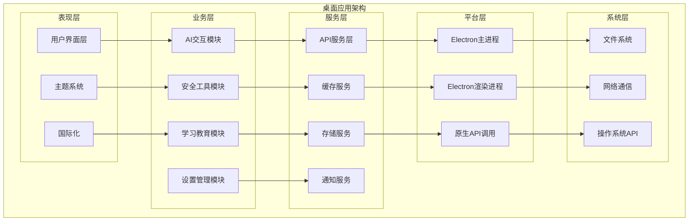
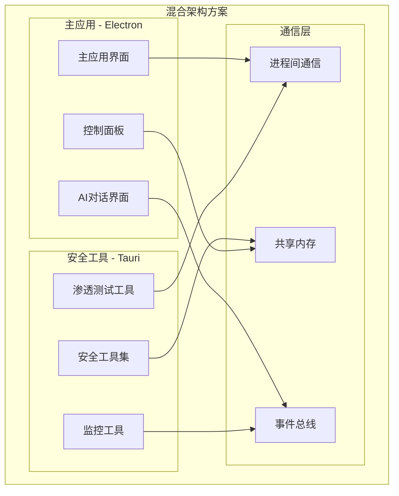
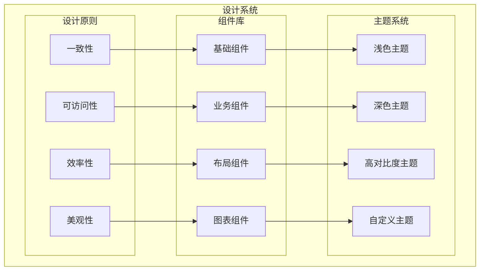
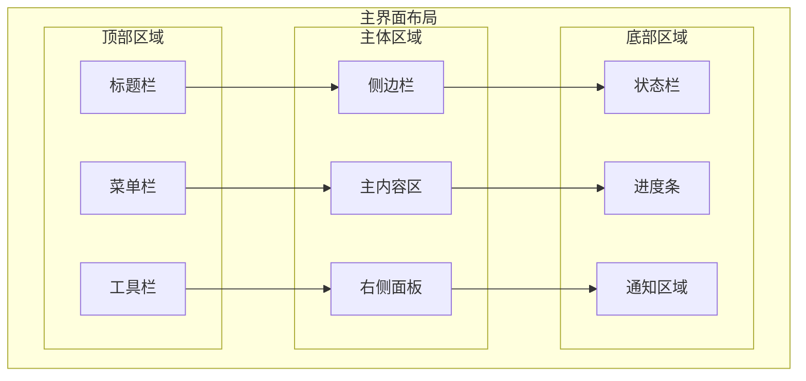
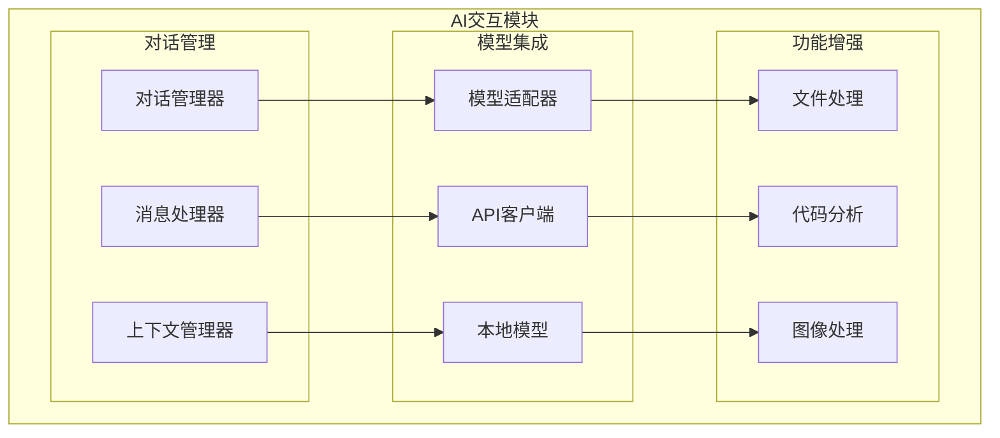
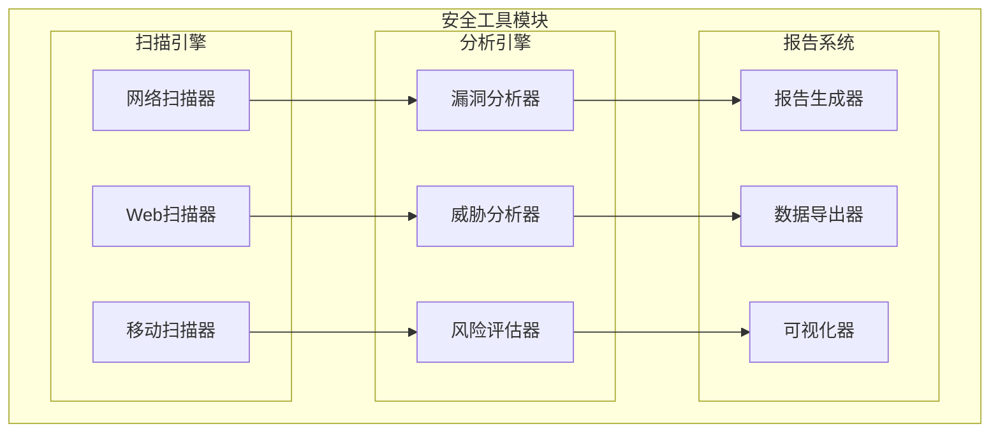
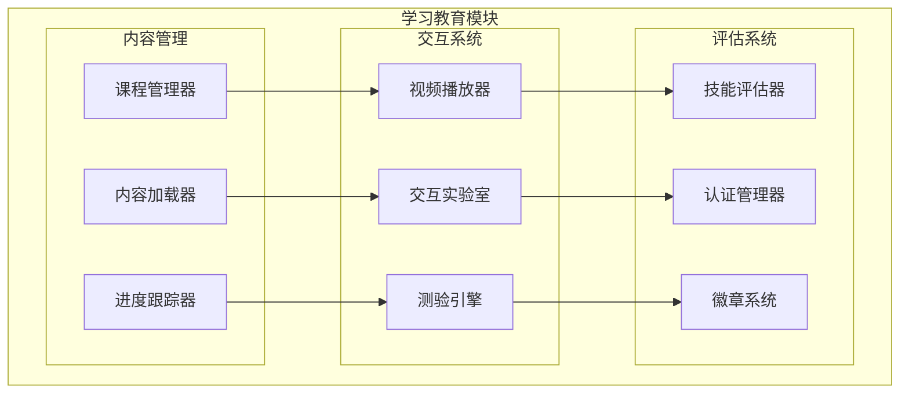

# 桌面应用 (Desktop Application)

<div align="center">


**太上老君AI平台的跨平台桌面应用**

</div>

## 🖥️ 应用概览

太上老君AI平台桌面应用是一个跨平台的桌面客户端，支持Windows、macOS和Linux系统，提供完整的AI交互、安全测试、学习教育等功能。

### 核心特性

- **🔄 跨平台支持**：Windows、macOS、Linux统一体验
- **🚀 高性能**：原生性能和流畅体验
- **🔒 安全集成**：内置安全工具和防护功能
- **🎨 现代UI**：Material Design和Fluent Design融合
- **⚡ 离线能力**：支持离线模式和本地数据

## 🏗️ 架构设计

### 整体架构



### 技术架构选择

#### 方案对比

| 特性 | Electron | Tauri | Native |
|------|----------|-------|--------|
| 开发效率 | ⭐⭐⭐⭐⭐ | ⭐⭐⭐⭐ | ⭐⭐ |
| 性能表现 | ⭐⭐⭐ | ⭐⭐⭐⭐⭐ | ⭐⭐⭐⭐⭐ |
| 包大小 | ⭐⭐ | ⭐⭐⭐⭐ | ⭐⭐⭐⭐⭐ |
| 跨平台 | ⭐⭐⭐⭐⭐ | ⭐⭐⭐⭐⭐ | ⭐⭐ |
| 生态系统 | ⭐⭐⭐⭐⭐ | ⭐⭐⭐ | ⭐⭐⭐⭐ |
| 安全性 | ⭐⭐⭐ | ⭐⭐⭐⭐⭐ | ⭐⭐⭐⭐⭐ |

#### 推荐方案：混合架构



## 🎨 用户界面设计

### 设计系统



### 界面布局



### 核心界面

#### 1. AI对话界面

```typescript
interface ChatInterface {
  // 对话区域
  chatArea: {
    messages: Message[];
    inputBox: InputBox;
    toolbar: ChatToolbar;
  };
  
  // 侧边栏
  sidebar: {
    conversationList: Conversation[];
    modelSelector: ModelSelector;
    settings: ChatSettings;
  };
  
  // 功能面板
  functionPanel: {
    fileUpload: FileUpload;
    codeEditor: CodeEditor;
    imageViewer: ImageViewer;
  };
}

interface Message {
  id: string;
  type: 'user' | 'assistant' | 'system';
  content: string;
  timestamp: Date;
  attachments?: Attachment[];
  metadata?: MessageMetadata;
}
```

#### 2. 安全工具界面

```typescript
interface SecurityInterface {
  // 工具栏
  toolbar: {
    scanTools: ScanTool[];
    analysisTools: AnalysisTool[];
    reportTools: ReportTool[];
  };
  
  // 主工作区
  workspace: {
    targetConfig: TargetConfig;
    scanResults: ScanResult[];
    reportViewer: ReportViewer;
  };
  
  // 监控面板
  monitorPanel: {
    realTimeMetrics: Metrics;
    alertList: Alert[];
    systemStatus: SystemStatus;
  };
}

interface ScanTool {
  id: string;
  name: string;
  type: 'network' | 'web' | 'mobile' | 'api';
  config: ToolConfig;
  status: 'idle' | 'running' | 'completed' | 'error';
}
```

#### 3. 学习教育界面

```typescript
interface LearningInterface {
  // 课程导航
  courseNav: {
    categories: CourseCategory[];
    searchBox: SearchBox;
    progressTracker: ProgressTracker;
  };
  
  // 学习区域
  learningArea: {
    courseContent: CourseContent;
    videoPlayer: VideoPlayer;
    interactiveLab: InteractiveLab;
  };
  
  // 评估系统
  assessmentSystem: {
    quizzes: Quiz[];
    assignments: Assignment[];
    certifications: Certification[];
  };
}

interface CourseContent {
  id: string;
  title: string;
  type: 'video' | 'text' | 'interactive' | 'quiz';
  content: string;
  duration: number;
  difficulty: 'beginner' | 'intermediate' | 'advanced';
}
```

## ⚙️ 核心功能模块

### 1. AI交互模块



#### 实现代码

```typescript
// AI交互模块核心类
class AIInteractionModule {
  private conversationManager: ConversationManager;
  private modelAdapter: ModelAdapter;
  private contextManager: ContextManager;

  constructor() {
    this.conversationManager = new ConversationManager();
    this.modelAdapter = new ModelAdapter();
    this.contextManager = new ContextManager();
  }

  async sendMessage(message: string, options?: MessageOptions): Promise<AIResponse> {
    // 处理用户消息
    const processedMessage = await this.preprocessMessage(message, options);
    
    // 获取上下文
    const context = await this.contextManager.getContext(options?.conversationId);
    
    // 调用AI模型
    const response = await this.modelAdapter.generateResponse(processedMessage, context);
    
    // 保存对话记录
    await this.conversationManager.saveMessage(processedMessage, response);
    
    return response;
  }

  private async preprocessMessage(message: string, options?: MessageOptions): Promise<ProcessedMessage> {
    // 文件处理
    if (options?.attachments) {
      const fileContents = await this.processAttachments(options.attachments);
      message = `${message}\n\n附件内容：\n${fileContents}`;
    }

    // 代码分析
    if (this.isCodeMessage(message)) {
      const codeAnalysis = await this.analyzeCode(message);
      message = `${message}\n\n代码分析：\n${codeAnalysis}`;
    }

    return {
      content: message,
      timestamp: new Date(),
      metadata: options?.metadata
    };
  }
}
```

### 2. 安全工具模块



#### 实现代码

```typescript
// 安全工具模块核心类
class SecurityToolsModule {
  private scanners: Map<string, Scanner>;
  private analyzers: Map<string, Analyzer>;
  private reportGenerator: ReportGenerator;

  constructor() {
    this.initializeScanners();
    this.initializeAnalyzers();
    this.reportGenerator = new ReportGenerator();
  }

  async startScan(config: ScanConfig): Promise<ScanResult> {
    const scanner = this.scanners.get(config.type);
    if (!scanner) {
      throw new Error(`Unsupported scan type: ${config.type}`);
    }

    // 开始扫描
    const scanResult = await scanner.scan(config);
    
    // 分析结果
    const analyzer = this.analyzers.get(config.type);
    const analysis = await analyzer?.analyze(scanResult);
    
    // 生成报告
    const report = await this.reportGenerator.generate(scanResult, analysis);
    
    return {
      ...scanResult,
      analysis,
      report
    };
  }

  private initializeScanners(): void {
    this.scanners.set('network', new NetworkScanner());
    this.scanners.set('web', new WebScanner());
    this.scanners.set('mobile', new MobileScanner());
  }

  private initializeAnalyzers(): void {
    this.analyzers.set('network', new VulnerabilityAnalyzer());
    this.analyzers.set('web', new WebThreatAnalyzer());
    this.analyzers.set('mobile', new MobileRiskAnalyzer());
  }
}
```

### 3. 学习教育模块



## 🔧 技术实现

### Electron主进程

```typescript
// 主进程入口文件
import { app, BrowserWindow, ipcMain, Menu } from 'electron';
import { SecurityService } from './services/security';
import { AIService } from './services/ai';
import { LearningService } from './services/learning';

class MainProcess {
  private mainWindow: BrowserWindow | null = null;
  private securityService: SecurityService;
  private aiService: AIService;
  private learningService: LearningService;

  constructor() {
    this.securityService = new SecurityService();
    this.aiService = new AIService();
    this.learningService = new LearningService();
    
    this.initializeApp();
    this.setupIPC();
  }

  private initializeApp(): void {
    app.whenReady().then(() => {
      this.createMainWindow();
      this.setupMenu();
    });

    app.on('window-all-closed', () => {
      if (process.platform !== 'darwin') {
        app.quit();
      }
    });

    app.on('activate', () => {
      if (BrowserWindow.getAllWindows().length === 0) {
        this.createMainWindow();
      }
    });
  }

  private createMainWindow(): void {
    this.mainWindow = new BrowserWindow({
      width: 1200,
      height: 800,
      minWidth: 800,
      minHeight: 600,
      webPreferences: {
        nodeIntegration: false,
        contextIsolation: true,
        preload: path.join(__dirname, 'preload.js')
      },
      titleBarStyle: 'hiddenInset',
      show: false
    });

    // 加载应用
    if (process.env.NODE_ENV === 'development') {
      this.mainWindow.loadURL('http://localhost:3000');
      this.mainWindow.webContents.openDevTools();
    } else {
      this.mainWindow.loadFile('dist/index.html');
    }

    this.mainWindow.once('ready-to-show', () => {
      this.mainWindow?.show();
    });
  }

  private setupIPC(): void {
    // AI服务IPC
    ipcMain.handle('ai:sendMessage', async (event, message, options) => {
      return await this.aiService.sendMessage(message, options);
    });

    // 安全服务IPC
    ipcMain.handle('security:startScan', async (event, config) => {
      return await this.securityService.startScan(config);
    });

    // 学习服务IPC
    ipcMain.handle('learning:getCourse', async (event, courseId) => {
      return await this.learningService.getCourse(courseId);
    });
  }
}

new MainProcess();
```

### 渲染进程

```typescript
// 渲染进程主应用
import React from 'react';
import ReactDOM from 'react-dom/client';
import { Provider } from 'react-redux';
import { BrowserRouter } from 'react-router-dom';
import { ThemeProvider } from '@mui/material/styles';
import CssBaseline from '@mui/material/CssBaseline';

import { store } from './store';
import { theme } from './theme';
import App from './App';
import { ElectronAPI } from './types/electron';

// 扩展Window接口
declare global {
  interface Window {
    electronAPI: ElectronAPI;
  }
}

const root = ReactDOM.createRoot(
  document.getElementById('root') as HTMLElement
);

root.render(
  <React.StrictMode>
    <Provider store={store}>
      <BrowserRouter>
        <ThemeProvider theme={theme}>
          <CssBaseline />
          <App />
        </ThemeProvider>
      </BrowserRouter>
    </Provider>
  </React.StrictMode>
);
```

### Preload脚本

```typescript
// preload.js - 安全的API暴露
import { contextBridge, ipcRenderer } from 'electron';

const electronAPI = {
  // AI服务API
  ai: {
    sendMessage: (message: string, options?: any) => 
      ipcRenderer.invoke('ai:sendMessage', message, options),
    getConversations: () => 
      ipcRenderer.invoke('ai:getConversations'),
    deleteConversation: (id: string) => 
      ipcRenderer.invoke('ai:deleteConversation', id)
  },

  // 安全服务API
  security: {
    startScan: (config: any) => 
      ipcRenderer.invoke('security:startScan', config),
    getScanResults: () => 
      ipcRenderer.invoke('security:getScanResults'),
    generateReport: (scanId: string) => 
      ipcRenderer.invoke('security:generateReport', scanId)
  },

  // 学习服务API
  learning: {
    getCourse: (courseId: string) => 
      ipcRenderer.invoke('learning:getCourse', courseId),
    updateProgress: (courseId: string, progress: number) => 
      ipcRenderer.invoke('learning:updateProgress', courseId, progress),
    submitQuiz: (quizId: string, answers: any[]) => 
      ipcRenderer.invoke('learning:submitQuiz', quizId, answers)
  },

  // 系统API
  system: {
    getVersion: () => ipcRenderer.invoke('system:getVersion'),
    checkUpdates: () => ipcRenderer.invoke('system:checkUpdates'),
    openExternal: (url: string) => ipcRenderer.invoke('system:openExternal', url)
  }
};

contextBridge.exposeInMainWorld('electronAPI', electronAPI);
```

## 📦 构建和打包

### 构建配置

```json
{
  "name": "taishang-desktop",
  "version": "1.0.0",
  "description": "太上老君AI平台桌面应用",
  "main": "dist/main.js",
  "scripts": {
    "dev": "concurrently \"npm run dev:renderer\" \"npm run dev:main\"",
    "dev:renderer": "vite",
    "dev:main": "tsc && electron dist/main.js",
    "build": "npm run build:renderer && npm run build:main",
    "build:renderer": "vite build",
    "build:main": "tsc",
    "pack": "electron-builder",
    "dist": "npm run build && electron-builder",
    "dist:win": "npm run build && electron-builder --win",
    "dist:mac": "npm run build && electron-builder --mac",
    "dist:linux": "npm run build && electron-builder --linux"
  },
  "build": {
    "appId": "com.taishang.desktop",
    "productName": "太上老君AI平台",
    "directories": {
      "output": "release"
    },
    "files": [
      "dist/**/*",
      "node_modules/**/*",
      "package.json"
    ],
    "win": {
      "target": [
        {
          "target": "nsis",
          "arch": ["x64", "arm64"]
        }
      ],
      "icon": "assets/icon.ico"
    },
    "mac": {
      "target": [
        {
          "target": "dmg",
          "arch": ["x64", "arm64"]
        }
      ],
      "icon": "assets/icon.icns",
      "category": "public.app-category.productivity"
    },
    "linux": {
      "target": [
        {
          "target": "AppImage",
          "arch": ["x64", "arm64"]
        },
        {
          "target": "deb",
          "arch": ["x64", "arm64"]
        }
      ],
      "icon": "assets/icon.png"
    }
  }
}
```

### 自动更新

```typescript
// 自动更新服务
import { autoUpdater } from 'electron-updater';
import { dialog } from 'electron';

class UpdateService {
  constructor() {
    this.setupAutoUpdater();
  }

  private setupAutoUpdater(): void {
    // 配置更新服务器
    autoUpdater.setFeedURL({
      provider: 'github',
      owner: 'taishang-ai',
      repo: 'desktop-app'
    });

    // 检查更新事件
    autoUpdater.on('checking-for-update', () => {
      console.log('Checking for update...');
    });

    autoUpdater.on('update-available', (info) => {
      console.log('Update available:', info);
      this.showUpdateDialog(info);
    });

    autoUpdater.on('update-not-available', (info) => {
      console.log('Update not available:', info);
    });

    autoUpdater.on('error', (err) => {
      console.error('Update error:', err);
    });

    autoUpdater.on('download-progress', (progressObj) => {
      console.log('Download progress:', progressObj);
    });

    autoUpdater.on('update-downloaded', (info) => {
      console.log('Update downloaded:', info);
      this.showRestartDialog();
    });
  }

  async checkForUpdates(): Promise<void> {
    try {
      await autoUpdater.checkForUpdatesAndNotify();
    } catch (error) {
      console.error('Check for updates failed:', error);
    }
  }

  private async showUpdateDialog(info: any): Promise<void> {
    const result = await dialog.showMessageBox({
      type: 'info',
      title: '发现新版本',
      message: `发现新版本 ${info.version}，是否立即下载？`,
      detail: info.releaseNotes,
      buttons: ['立即下载', '稍后提醒'],
      defaultId: 0
    });

    if (result.response === 0) {
      autoUpdater.downloadUpdate();
    }
  }

  private async showRestartDialog(): Promise<void> {
    const result = await dialog.showMessageBox({
      type: 'info',
      title: '更新已下载',
      message: '新版本已下载完成，是否立即重启应用？',
      buttons: ['立即重启', '稍后重启'],
      defaultId: 0
    });

    if (result.response === 0) {
      autoUpdater.quitAndInstall();
    }
  }
}
```

## 🔒 安全考虑

### 安全配置

```typescript
// 安全配置
const securityConfig = {
  // 禁用Node.js集成
  nodeIntegration: false,
  
  // 启用上下文隔离
  contextIsolation: true,
  
  // 禁用远程模块
  enableRemoteModule: false,
  
  // 沙箱模式
  sandbox: true,
  
  // 内容安全策略
  contentSecurityPolicy: {
    'default-src': "'self'",
    'script-src': "'self' 'unsafe-inline'",
    'style-src': "'self' 'unsafe-inline'",
    'img-src': "'self' data: https:",
    'connect-src': "'self' https://api.taishang.ai"
  }
};

// 安全验证
class SecurityValidator {
  static validateURL(url: string): boolean {
    const allowedDomains = [
      'api.taishang.ai',
      'cdn.taishang.ai',
      'docs.taishang.ai'
    ];
    
    try {
      const urlObj = new URL(url);
      return allowedDomains.includes(urlObj.hostname);
    } catch {
      return false;
    }
  }

  static sanitizeInput(input: string): string {
    return input
      .replace(/[<>]/g, '')
      .replace(/javascript:/gi, '')
      .replace(/data:/gi, '');
  }
}
```

## 📊 性能优化

### 性能监控

```typescript
// 性能监控服务
class PerformanceMonitor {
  private metrics: Map<string, number> = new Map();

  startTiming(label: string): void {
    this.metrics.set(label, performance.now());
  }

  endTiming(label: string): number {
    const startTime = this.metrics.get(label);
    if (!startTime) return 0;
    
    const duration = performance.now() - startTime;
    this.metrics.delete(label);
    
    console.log(`${label}: ${duration.toFixed(2)}ms`);
    return duration;
  }

  measureMemory(): MemoryInfo {
    return {
      usedJSHeapSize: (performance as any).memory?.usedJSHeapSize || 0,
      totalJSHeapSize: (performance as any).memory?.totalJSHeapSize || 0,
      jsHeapSizeLimit: (performance as any).memory?.jsHeapSizeLimit || 0
    };
  }

  measureCPU(): Promise<number> {
    return new Promise((resolve) => {
      const start = process.cpuUsage();
      setTimeout(() => {
        const usage = process.cpuUsage(start);
        const cpuPercent = (usage.user + usage.system) / 1000000 * 100;
        resolve(cpuPercent);
      }, 1000);
    });
  }
}
```

### 资源优化

```typescript
// 资源管理器
class ResourceManager {
  private cache: Map<string, any> = new Map();
  private maxCacheSize = 100;

  async loadResource(url: string): Promise<any> {
    // 检查缓存
    if (this.cache.has(url)) {
      return this.cache.get(url);
    }

    // 加载资源
    const resource = await this.fetchResource(url);
    
    // 缓存管理
    if (this.cache.size >= this.maxCacheSize) {
      const firstKey = this.cache.keys().next().value;
      this.cache.delete(firstKey);
    }
    
    this.cache.set(url, resource);
    return resource;
  }

  private async fetchResource(url: string): Promise<any> {
    const response = await fetch(url);
    return await response.json();
  }

  clearCache(): void {
    this.cache.clear();
  }

  getCacheSize(): number {
    return this.cache.size;
  }
}
```

## 🚀 部署和分发

### CI/CD配置

```yaml
# .github/workflows/build.yml
name: Build Desktop App

on:
  push:
    branches: [ main, develop ]
  pull_request:
    branches: [ main ]

jobs:
  build:
    strategy:
      matrix:
        os: [windows-latest, macos-latest, ubuntu-latest]
    
    runs-on: ${{ matrix.os }}
    
    steps:
    - uses: actions/checkout@v3
    
    - name: Setup Node.js
      uses: actions/setup-node@v3
      with:
        node-version: '18'
        cache: 'npm'
    
    - name: Install dependencies
      run: npm ci
    
    - name: Run tests
      run: npm test
    
    - name: Build application
      run: npm run build
    
    - name: Package application
      run: npm run dist
      env:
        GH_TOKEN: ${{ secrets.GITHUB_TOKEN }}
    
    - name: Upload artifacts
      uses: actions/upload-artifact@v3
      with:
        name: desktop-app-${{ matrix.os }}
        path: release/
```

### 代码签名

```typescript
// 代码签名配置
const codeSignConfig = {
  win: {
    certificateFile: process.env.WIN_CSC_LINK,
    certificatePassword: process.env.WIN_CSC_KEY_PASSWORD,
    signingHashAlgorithms: ['sha256'],
    timestampServer: 'http://timestamp.digicert.com'
  },
  mac: {
    identity: process.env.MAC_DEVELOPER_ID,
    entitlements: 'build/entitlements.mac.plist',
    entitlementsInherit: 'build/entitlements.mac.plist',
    hardenedRuntime: true,
    notarize: {
      teamId: process.env.APPLE_TEAM_ID
    }
  }
};
```

## 📈 监控和分析

### 错误监控

```typescript
// 错误监控服务
import * as Sentry from '@sentry/electron';

class ErrorMonitor {
  constructor() {
    this.initializeSentry();
    this.setupErrorHandlers();
  }

  private initializeSentry(): void {
    Sentry.init({
      dsn: process.env.SENTRY_DSN,
      environment: process.env.NODE_ENV,
      beforeSend(event) {
        // 过滤敏感信息
        if (event.user) {
          delete event.user.email;
          delete event.user.ip_address;
        }
        return event;
      }
    });
  }

  private setupErrorHandlers(): void {
    process.on('uncaughtException', (error) => {
      console.error('Uncaught Exception:', error);
      Sentry.captureException(error);
    });

    process.on('unhandledRejection', (reason, promise) => {
      console.error('Unhandled Rejection at:', promise, 'reason:', reason);
      Sentry.captureException(reason);
    });
  }

  captureError(error: Error, context?: any): void {
    Sentry.withScope((scope) => {
      if (context) {
        scope.setContext('additional', context);
      }
      Sentry.captureException(error);
    });
  }
}
```

### 使用分析

```typescript
// 使用分析服务
class AnalyticsService {
  private events: AnalyticsEvent[] = [];

  trackEvent(event: AnalyticsEvent): void {
    this.events.push({
      ...event,
      timestamp: new Date(),
      sessionId: this.getSessionId()
    });

    // 批量发送
    if (this.events.length >= 10) {
      this.sendEvents();
    }
  }

  trackPageView(page: string): void {
    this.trackEvent({
      type: 'page_view',
      properties: { page }
    });
  }

  trackFeatureUsage(feature: string, action: string): void {
    this.trackEvent({
      type: 'feature_usage',
      properties: { feature, action }
    });
  }

  private async sendEvents(): Promise<void> {
    if (this.events.length === 0) return;

    try {
      await fetch('/api/analytics', {
        method: 'POST',
        headers: { 'Content-Type': 'application/json' },
        body: JSON.stringify(this.events)
      });
      
      this.events = [];
    } catch (error) {
      console.error('Failed to send analytics:', error);
    }
  }

  private getSessionId(): string {
    return localStorage.getItem('sessionId') || 'unknown';
  }
}
```

## 🔮 未来规划

### 短期目标 (3-6个月)
- ✅ 基础桌面应用框架
- 🔄 AI对话功能完善
- 📋 安全工具集成
- 📋 学习模块开发

### 中期目标 (6-12个月)
- 📋 Tauri混合架构
- 📋 离线模式支持
- 📋 插件系统
- 📋 多语言支持

### 长期目标 (1-2年)
- 📋 原生性能优化
- 📋 AI本地化部署
- 📋 跨设备同步
- 📋 企业级功能

---

## 📚 相关文档

- [项目概览](../00-项目概览/README.md)
- [架构设计](../02-架构设计/README.md)
- [前端应用](../04-前端应用/README.md)
- [开发指南](../07-开发指南/frontend-development.md)
- [部署指南](../08-部署指南/desktop-deployment.md)

---

**文档版本**：v1.0  
**创建时间**：2024年12月19日  
**最后更新**：2024年12月19日  
**维护团队**：太上老君AI平台前端团队

*本文档将根据桌面应用发展持续更新，确保技术方案的先进性和实用性。*