# 太上老君AI平台 - 移动端应用

## 概述

太上老君AI平台移动端应用基于React Native和Flutter混合架构开发，提供iOS和Android双平台支持，集成了AI对话、安全工具、学习教育等核心功能，为用户提供随时随地的AI安全服务体验。

## 应用架构

### 整体架构图

```mermaid
graph TB
    subgraph "移动端应用架构"
        subgraph "用户界面层"
            UI_COMPONENTS[UI组件库]
            NAVIGATION[导航系统]
            THEME[主题系统]
            RESPONSIVE[响应式布局]
        end
        
        subgraph "业务逻辑层"
            AI_MODULE[AI对话模块]
            SECURITY_MODULE[安全工具模块]
            LEARNING_MODULE[学习教育模块]
            PROFILE_MODULE[用户中心模块]
        end
        
        subgraph "数据管理层"
            STATE_MGMT[状态管理]
            LOCAL_STORAGE[本地存储]
            CACHE_MGMT[缓存管理]
            OFFLINE_SYNC[离线同步]
        end
        
        subgraph "网络通信层"
            API_CLIENT[API客户端]
            WEBSOCKET[WebSocket连接]
            HTTP_CLIENT[HTTP客户端]
            AUTH_INTERCEPTOR[认证拦截器]
        end
        
        subgraph "平台适配层"
            IOS_ADAPTER[iOS适配器]
            ANDROID_ADAPTER[Android适配器]
            NATIVE_BRIDGE[原生桥接]
            PERMISSIONS[权限管理]
        end
        
        subgraph "基础服务层"
            PUSH_SERVICE[推送服务]
            ANALYTICS[数据分析]
            CRASH_REPORT[崩溃报告]
            SECURITY_SERVICE[安全服务]
        end
    end
    
    subgraph "外部服务"
        BACKEND_API[后端API]
        AI_SERVICE[AI服务]
        SECURITY_API[安全API]
        PUSH_GATEWAY[推送网关]
    end
    
    UI_COMPONENTS --> NAVIGATION --> THEME --> RESPONSIVE
    AI_MODULE --> SECURITY_MODULE --> LEARNING_MODULE --> PROFILE_MODULE
    STATE_MGMT --> LOCAL_STORAGE --> CACHE_MGMT --> OFFLINE_SYNC
    API_CLIENT --> WEBSOCKET --> HTTP_CLIENT --> AUTH_INTERCEPTOR
    IOS_ADAPTER --> ANDROID_ADAPTER --> NATIVE_BRIDGE --> PERMISSIONS
    PUSH_SERVICE --> ANALYTICS --> CRASH_REPORT --> SECURITY_SERVICE
    
    API_CLIENT --> BACKEND_API
    WEBSOCKET --> AI_SERVICE
    HTTP_CLIENT --> SECURITY_API
    PUSH_SERVICE --> PUSH_GATEWAY
```



## 技术栈选择

### 跨平台框架对比

| 框架 | 优势 | 劣势 | 适用场景 |
|------|------|------|----------|
| **React Native** | 代码复用率高、生态丰富、热更新 | 性能略逊原生、包体积大 | 快速开发、跨平台一致性 |
| **Flutter** | 性能接近原生、UI一致性好 | 学习成本高、生态相对较小 | 高性能要求、复杂UI |
| **原生开发** | 性能最优、平台特性完整 | 开发成本高、维护复杂 | 性能敏感、平台特定功能 |

### 推荐架构：React Native + 原生模块

```typescript
// 技术栈配置
export const TechStack = {
  // 核心框架
  framework: 'React Native 0.72+',
  
  // 状态管理
  stateManagement: 'Redux Toolkit + RTK Query',
  
  // 导航
  navigation: 'React Navigation 6',
  
  // UI组件库
  uiLibrary: 'NativeBase + Custom Components',
  
  // 网络请求
  networking: 'Axios + WebSocket',
  
  // 本地存储
  storage: 'AsyncStorage + SQLite + Realm',
  
  // 推送通知
  push: 'Firebase Cloud Messaging',
  
  // 分析统计
  analytics: 'Firebase Analytics + Custom',
  
  // 崩溃报告
  crashReporting: 'Crashlytics + Sentry',
  
  // 安全
  security: 'Keychain + Biometric + SSL Pinning',
  
  // 测试
  testing: 'Jest + Detox + Flipper',
  
  // 构建部署
  cicd: 'Fastlane + CodePush + App Center'
};
```

## 核心功能模块

### 1. AI对话模块

#### 智能对话界面

```typescript
// AI对话组件
import React, { useState, useEffect, useRef } from 'react';
import {
  View,
  Text,
  TextInput,
  TouchableOpacity,
  FlatList,
  KeyboardAvoidingView,
  Platform,
  Alert
} from 'react-native';
import { useDispatch, useSelector } from 'react-redux';
import { sendMessage, receiveMessage } from '../store/chatSlice';
import { ChatMessage, MessageType } from '../types/chat';

interface AIChatScreenProps {
  navigation: any;
}

const AIChatScreen: React.FC<AIChatScreenProps> = ({ navigation }) => {
  const dispatch = useDispatch();
  const { messages, isLoading, error } = useSelector((state: any) => state.chat);
  const [inputText, setInputText] = useState('');
  const [isTyping, setIsTyping] = useState(false);
  const flatListRef = useRef<FlatList>(null);
  const webSocketRef = useRef<WebSocket | null>(null);

  useEffect(() => {
    // 初始化WebSocket连接
    initializeWebSocket();
    
    return () => {
      // 清理WebSocket连接
      if (webSocketRef.current) {
        webSocketRef.current.close();
      }
    };
  }, []);

  const initializeWebSocket = () => {
    const wsUrl = 'wss://api.taishanglaojun.ai/chat/ws';
    webSocketRef.current = new WebSocket(wsUrl);
    
    webSocketRef.current.onopen = () => {
      console.log('WebSocket连接已建立');
    };
    
    webSocketRef.current.onmessage = (event) => {
      const data = JSON.parse(event.data);
      handleAIResponse(data);
    };
    
    webSocketRef.current.onerror = (error) => {
      console.error('WebSocket错误:', error);
      Alert.alert('连接错误', '无法连接到AI服务，请检查网络连接');
    };
    
    webSocketRef.current.onclose = () => {
      console.log('WebSocket连接已关闭');
      // 尝试重连
      setTimeout(initializeWebSocket, 3000);
    };
  };

  const handleSendMessage = async () => {
    if (!inputText.trim()) return;
    
    const userMessage: ChatMessage = {
      id: Date.now().toString(),
      type: MessageType.USER,
      content: inputText.trim(),
      timestamp: new Date(),
      status: 'sent'
    };
    
    // 添加用户消息到聊天记录
    dispatch(sendMessage(userMessage));
    setInputText('');
    setIsTyping(true);
    
    // 发送消息到AI服务
    if (webSocketRef.current?.readyState === WebSocket.OPEN) {
      webSocketRef.current.send(JSON.stringify({
        type: 'chat',
        message: userMessage.content,
        context: {
          userId: 'current_user_id',
          sessionId: 'current_session_id',
          platform: 'mobile'
        }
      }));
    }
    
    // 滚动到底部
    setTimeout(() => {
      flatListRef.current?.scrollToEnd({ animated: true });
    }, 100);
  };

  const handleAIResponse = (data: any) => {
    setIsTyping(false);
    
    const aiMessage: ChatMessage = {
      id: Date.now().toString(),
      type: MessageType.AI,
      content: data.message,
      timestamp: new Date(),
      status: 'received',
      metadata: {
        confidence: data.confidence,
        processingTime: data.processingTime,
        model: data.model
      }
    };
    
    dispatch(receiveMessage(aiMessage));
    
    // 滚动到底部
    setTimeout(() => {
      flatListRef.current?.scrollToEnd({ animated: true });
    }, 100);
  };

  const renderMessage = ({ item }: { item: ChatMessage }) => (
    <MessageBubble
      message={item}
      onRetry={item.type === MessageType.USER ? handleSendMessage : undefined}
    />
  );

  const renderTypingIndicator = () => (
    isTyping ? (
      <View style={styles.typingContainer}>
        <TypingIndicator />
        <Text style={styles.typingText}>AI正在思考中...</Text>
      </View>
    ) : null
  );

  return (
    <KeyboardAvoidingView 
      style={styles.container}
      behavior={Platform.OS === 'ios' ? 'padding' : 'height'}
    >
      <View style={styles.header}>
        <TouchableOpacity onPress={() => navigation.goBack()}>
          <Icon name="arrow-back" size={24} color="#333" />
        </TouchableOpacity>
        <Text style={styles.headerTitle}>太上老君AI助手</Text>
        <TouchableOpacity onPress={() => navigation.navigate('ChatSettings')}>
          <Icon name="settings" size={24} color="#333" />
        </TouchableOpacity>
      </View>
      
      <FlatList
        ref={flatListRef}
        data={messages}
        renderItem={renderMessage}
        keyExtractor={(item) => item.id}
        style={styles.messagesList}
        showsVerticalScrollIndicator={false}
        ListFooterComponent={renderTypingIndicator}
      />
      
      <View style={styles.inputContainer}>
        <TextInput
          style={styles.textInput}
          value={inputText}
          onChangeText={setInputText}
          placeholder="输入您的问题..."
          multiline
          maxLength={1000}
          returnKeyType="send"
          onSubmitEditing={handleSendMessage}
        />
        <TouchableOpacity
          style={[styles.sendButton, { opacity: inputText.trim() ? 1 : 0.5 }]}
          onPress={handleSendMessage}
          disabled={!inputText.trim() || isLoading}
        >
          <Icon name="send" size={20} color="#fff" />
        </TouchableOpacity>
      </View>
    </KeyboardAvoidingView>
  );
};

// 消息气泡组件
const MessageBubble: React.FC<{ message: ChatMessage; onRetry?: () => void }> = ({ 
  message, 
  onRetry 
}) => {
  const isUser = message.type === MessageType.USER;
  
  return (
    <View style={[
      styles.messageBubble,
      isUser ? styles.userBubble : styles.aiBubble
    ]}>
      <Text style={[
        styles.messageText,
        isUser ? styles.userText : styles.aiText
      ]}>
        {message.content}
      </Text>
      
      <View style={styles.messageFooter}>
        <Text style={styles.timestamp}>
          {formatTime(message.timestamp)}
        </Text>
        
        {message.status === 'failed' && onRetry && (
          <TouchableOpacity onPress={onRetry} style={styles.retryButton}>
            <Text style={styles.retryText}>重试</Text>
          </TouchableOpacity>
        )}
        
        {message.metadata?.confidence && (
          <Text style={styles.confidence}>
            置信度: {(message.metadata.confidence * 100).toFixed(1)}%
          </Text>
        )}
      </View>
    </View>
  );
};

// 打字指示器组件
const TypingIndicator: React.FC = () => {
  const [dots, setDots] = useState('');
  
  useEffect(() => {
    const interval = setInterval(() => {
      setDots(prev => prev.length >= 3 ? '' : prev + '.');
    }, 500);
    
    return () => clearInterval(interval);
  }, []);
  
  return (
    <View style={styles.typingDots}>
      <Text style={styles.dotsText}>{dots}</Text>
    </View>
  );
};

const styles = StyleSheet.create({
  container: {
    flex: 1,
    backgroundColor: '#f5f5f5',
  },
  header: {
    flexDirection: 'row',
    alignItems: 'center',
    justifyContent: 'space-between',
    paddingHorizontal: 16,
    paddingVertical: 12,
    backgroundColor: '#fff',
    borderBottomWidth: 1,
    borderBottomColor: '#e0e0e0',
  },
  headerTitle: {
    fontSize: 18,
    fontWeight: 'bold',
    color: '#333',
  },
  messagesList: {
    flex: 1,
    paddingHorizontal: 16,
    paddingVertical: 8,
  },
  messageBubble: {
    maxWidth: '80%',
    marginVertical: 4,
    padding: 12,
    borderRadius: 16,
  },
  userBubble: {
    alignSelf: 'flex-end',
    backgroundColor: '#007AFF',
  },
  aiBubble: {
    alignSelf: 'flex-start',
    backgroundColor: '#fff',
    borderWidth: 1,
    borderColor: '#e0e0e0',
  },
  messageText: {
    fontSize: 16,
    lineHeight: 20,
  },
  userText: {
    color: '#fff',
  },
  aiText: {
    color: '#333',
  },
  messageFooter: {
    flexDirection: 'row',
    alignItems: 'center',
    marginTop: 4,
  },
  timestamp: {
    fontSize: 12,
    color: '#999',
  },
  confidence: {
    fontSize: 12,
    color: '#666',
    marginLeft: 8,
  },
  retryButton: {
    marginLeft: 8,
    paddingHorizontal: 8,
    paddingVertical: 2,
    backgroundColor: '#ff4444',
    borderRadius: 4,
  },
  retryText: {
    fontSize: 12,
    color: '#fff',
  },
  typingContainer: {
    flexDirection: 'row',
    alignItems: 'center',
    paddingVertical: 8,
  },
  typingDots: {
    width: 40,
    height: 20,
    justifyContent: 'center',
    alignItems: 'center',
  },
  dotsText: {
    fontSize: 16,
    color: '#666',
  },
  typingText: {
    fontSize: 14,
    color: '#666',
    marginLeft: 8,
  },
  inputContainer: {
    flexDirection: 'row',
    alignItems: 'flex-end',
    paddingHorizontal: 16,
    paddingVertical: 8,
    backgroundColor: '#fff',
    borderTopWidth: 1,
    borderTopColor: '#e0e0e0',
  },
  textInput: {
    flex: 1,
    borderWidth: 1,
    borderColor: '#e0e0e0',
    borderRadius: 20,
    paddingHorizontal: 16,
    paddingVertical: 8,
    maxHeight: 100,
    fontSize: 16,
  },
  sendButton: {
    marginLeft: 8,
    width: 40,
    height: 40,
    borderRadius: 20,
    backgroundColor: '#007AFF',
    justifyContent: 'center',
    alignItems: 'center',
  },
});

export default AIChatScreen;
```

### 2. 安全工具模块

#### 移动端安全工具

```typescript
// 安全工具主界面
import React, { useState, useEffect } from 'react';
import {
  View,
  Text,
  ScrollView,
  TouchableOpacity,
  Alert,
  ActivityIndicator,
  RefreshControl
} from 'react-native';
import { useNavigation } from '@react-navigation/native';
import { SecurityService } from '../services/SecurityService';
import { SecurityTool, SecurityScanResult } from '../types/security';

const SecurityToolsScreen: React.FC = () => {
  const navigation = useNavigation();
  const [tools, setTools] = useState<SecurityTool[]>([]);
  const [isLoading, setIsLoading] = useState(true);
  const [refreshing, setRefreshing] = useState(false);
  const [scanResults, setScanResults] = useState<SecurityScanResult[]>([]);

  useEffect(() => {
    loadSecurityTools();
  }, []);

  const loadSecurityTools = async () => {
    try {
      setIsLoading(true);
      const securityTools = await SecurityService.getAvailableTools();
      setTools(securityTools);
      
      // 加载最近的扫描结果
      const recentScans = await SecurityService.getRecentScanResults();
      setScanResults(recentScans);
    } catch (error) {
      console.error('加载安全工具失败:', error);
      Alert.alert('错误', '无法加载安全工具，请稍后重试');
    } finally {
      setIsLoading(false);
    }
  };

  const handleRefresh = async () => {
    setRefreshing(true);
    await loadSecurityTools();
    setRefreshing(false);
  };

  const handleToolPress = (tool: SecurityTool) => {
    switch (tool.type) {
      case 'network_scan':
        navigation.navigate('NetworkScan', { tool });
        break;
      case 'vulnerability_scan':
        navigation.navigate('VulnerabilityScan', { tool });
        break;
      case 'port_scan':
        navigation.navigate('PortScan', { tool });
        break;
      case 'ssl_check':
        navigation.navigate('SSLCheck', { tool });
        break;
      case 'dns_lookup':
        navigation.navigate('DNSLookup', { tool });
        break;
      default:
        Alert.alert('提示', '该工具暂未实现');
    }
  };

  const renderSecurityTool = (tool: SecurityTool) => (
    <TouchableOpacity
      key={tool.id}
      style={styles.toolCard}
      onPress={() => handleToolPress(tool)}
    >
      <View style={styles.toolHeader}>
        <View style={styles.toolIcon}>
          <Icon name={tool.icon} size={24} color={tool.color} />
        </View>
        <View style={styles.toolInfo}>
          <Text style={styles.toolName}>{tool.name}</Text>
          <Text style={styles.toolDescription}>{tool.description}</Text>
        </View>
        <View style={styles.toolStatus}>
          <View style={[
            styles.statusIndicator,
            { backgroundColor: tool.isAvailable ? '#4CAF50' : '#FF5722' }
          ]} />
        </View>
      </View>
      
      <View style={styles.toolFooter}>
        <Text style={styles.toolCategory}>{tool.category}</Text>
        <Text style={styles.toolDifficulty}>
          难度: {tool.difficulty}
        </Text>
      </View>
    </TouchableOpacity>
  );

  const renderRecentScan = (scan: SecurityScanResult) => (
    <TouchableOpacity
      key={scan.id}
      style={styles.scanCard}
      onPress={() => navigation.navigate('ScanResult', { scanId: scan.id })}
    >
      <View style={styles.scanHeader}>
        <Text style={styles.scanTarget}>{scan.target}</Text>
        <Text style={styles.scanTime}>
          {formatRelativeTime(scan.timestamp)}
        </Text>
      </View>
      
      <View style={styles.scanResults}>
        <View style={styles.resultItem}>
          <Text style={styles.resultLabel}>风险等级:</Text>
          <Text style={[
            styles.resultValue,
            { color: getRiskColor(scan.riskLevel) }
          ]}>
            {scan.riskLevel}
          </Text>
        </View>
        
        <View style={styles.resultItem}>
          <Text style={styles.resultLabel}>发现问题:</Text>
          <Text style={styles.resultValue}>
            {scan.issuesFound} 个
          </Text>
        </View>
      </View>
    </TouchableOpacity>
  );

  if (isLoading) {
    return (
      <View style={styles.loadingContainer}>
        <ActivityIndicator size="large" color="#007AFF" />
        <Text style={styles.loadingText}>加载安全工具中...</Text>
      </View>
    );
  }

  return (
    <ScrollView
      style={styles.container}
      refreshControl={
        <RefreshControl refreshing={refreshing} onRefresh={handleRefresh} />
      }
    >
      <View style={styles.header}>
        <Text style={styles.headerTitle}>安全工具箱</Text>
        <Text style={styles.headerSubtitle}>
          专业的移动端安全检测工具
        </Text>
      </View>

      <View style={styles.section}>
        <Text style={styles.sectionTitle}>可用工具</Text>
        <View style={styles.toolsGrid}>
          {tools.map(renderSecurityTool)}
        </View>
      </View>

      {scanResults.length > 0 && (
        <View style={styles.section}>
          <View style={styles.sectionHeader}>
            <Text style={styles.sectionTitle}>最近扫描</Text>
            <TouchableOpacity
              onPress={() => navigation.navigate('ScanHistory')}
            >
              <Text style={styles.viewAllText}>查看全部</Text>
            </TouchableOpacity>
          </View>
          
          <View style={styles.scansList}>
            {scanResults.slice(0, 3).map(renderRecentScan)}
          </View>
        </View>
      )}

      <View style={styles.section}>
        <Text style={styles.sectionTitle}>快速操作</Text>
        <View style={styles.quickActions}>
          <TouchableOpacity
            style={styles.quickActionButton}
            onPress={() => navigation.navigate('QuickScan')}
          >
            <Icon name="flash" size={20} color="#fff" />
            <Text style={styles.quickActionText}>快速扫描</Text>
          </TouchableOpacity>
          
          <TouchableOpacity
            style={styles.quickActionButton}
            onPress={() => navigation.navigate('CustomScan')}
          >
            <Icon name="settings" size={20} color="#fff" />
            <Text style={styles.quickActionText}>自定义扫描</Text>
          </TouchableOpacity>
        </View>
      </View>
    </ScrollView>
  );
};

// 网络扫描工具
const NetworkScanScreen: React.FC<{ route: any }> = ({ route }) => {
  const { tool } = route.params;
  const [target, setTarget] = useState('');
  const [isScanning, setIsScanning] = useState(false);
  const [scanProgress, setScanProgress] = useState(0);
  const [results, setResults] = useState<any>(null);

  const startNetworkScan = async () => {
    if (!target.trim()) {
      Alert.alert('错误', '请输入扫描目标');
      return;
    }

    try {
      setIsScanning(true);
      setScanProgress(0);
      
      // 创建扫描任务
      const scanTask = await SecurityService.createNetworkScan({
        target: target.trim(),
        scanType: 'comprehensive',
        options: {
          portRange: '1-1000',
          timeout: 5000,
          threads: 10
        }
      });

      // 监听扫描进度
      const progressInterval = setInterval(async () => {
        const progress = await SecurityService.getScanProgress(scanTask.id);
        setScanProgress(progress.percentage);
        
        if (progress.completed) {
          clearInterval(progressInterval);
          const scanResults = await SecurityService.getScanResults(scanTask.id);
          setResults(scanResults);
          setIsScanning(false);
        }
      }, 1000);

    } catch (error) {
      console.error('网络扫描失败:', error);
      Alert.alert('扫描失败', '网络扫描过程中发生错误');
      setIsScanning(false);
    }
  };

  return (
    <View style={styles.scanContainer}>
      <View style={styles.scanHeader}>
        <Text style={styles.scanTitle}>{tool.name}</Text>
        <Text style={styles.scanDescription}>{tool.description}</Text>
      </View>

      <View style={styles.inputSection}>
        <Text style={styles.inputLabel}>扫描目标</Text>
        <TextInput
          style={styles.targetInput}
          value={target}
          onChangeText={setTarget}
          placeholder="输入IP地址或域名 (例: 192.168.1.1)"
          autoCapitalize="none"
          autoCorrect={false}
        />
      </View>

      {isScanning ? (
        <View style={styles.scanningSection}>
          <ActivityIndicator size="large" color="#007AFF" />
          <Text style={styles.scanningText}>正在扫描中...</Text>
          <View style={styles.progressBar}>
            <View 
              style={[
                styles.progressFill,
                { width: `${scanProgress}%` }
              ]} 
            />
          </View>
          <Text style={styles.progressText}>{scanProgress.toFixed(1)}%</Text>
        </View>
      ) : (
        <TouchableOpacity
          style={styles.scanButton}
          onPress={startNetworkScan}
        >
          <Text style={styles.scanButtonText}>开始扫描</Text>
        </TouchableOpacity>
      )}

      {results && (
        <ScrollView style={styles.resultsSection}>
          <Text style={styles.resultsTitle}>扫描结果</Text>
          <NetworkScanResults results={results} />
        </ScrollView>
      )}
    </View>
  );
};

const styles = StyleSheet.create({
  container: {
    flex: 1,
    backgroundColor: '#f5f5f5',
  },
  loadingContainer: {
    flex: 1,
    justifyContent: 'center',
    alignItems: 'center',
  },
  loadingText: {
    marginTop: 16,
    fontSize: 16,
    color: '#666',
  },
  header: {
    padding: 20,
    backgroundColor: '#fff',
    borderBottomWidth: 1,
    borderBottomColor: '#e0e0e0',
  },
  headerTitle: {
    fontSize: 24,
    fontWeight: 'bold',
    color: '#333',
  },
  headerSubtitle: {
    fontSize: 14,
    color: '#666',
    marginTop: 4,
  },
  section: {
    marginTop: 16,
    backgroundColor: '#fff',
    paddingHorizontal: 20,
    paddingVertical: 16,
  },
  sectionHeader: {
    flexDirection: 'row',
    justifyContent: 'space-between',
    alignItems: 'center',
    marginBottom: 16,
  },
  sectionTitle: {
    fontSize: 18,
    fontWeight: 'bold',
    color: '#333',
  },
  viewAllText: {
    fontSize: 14,
    color: '#007AFF',
  },
  toolsGrid: {
    gap: 12,
  },
  toolCard: {
    backgroundColor: '#f8f9fa',
    borderRadius: 12,
    padding: 16,
    borderWidth: 1,
    borderColor: '#e9ecef',
  },
  toolHeader: {
    flexDirection: 'row',
    alignItems: 'center',
  },
  toolIcon: {
    width: 40,
    height: 40,
    borderRadius: 20,
    backgroundColor: '#fff',
    justifyContent: 'center',
    alignItems: 'center',
    marginRight: 12,
  },
  toolInfo: {
    flex: 1,
  },
  toolName: {
    fontSize: 16,
    fontWeight: 'bold',
    color: '#333',
  },
  toolDescription: {
    fontSize: 14,
    color: '#666',
    marginTop: 2,
  },
  toolStatus: {
    alignItems: 'center',
  },
  statusIndicator: {
    width: 8,
    height: 8,
    borderRadius: 4,
  },
  toolFooter: {
    flexDirection: 'row',
    justifyContent: 'space-between',
    marginTop: 12,
  },
  toolCategory: {
    fontSize: 12,
    color: '#007AFF',
    backgroundColor: '#e3f2fd',
    paddingHorizontal: 8,
    paddingVertical: 2,
    borderRadius: 4,
  },
  toolDifficulty: {
    fontSize: 12,
    color: '#666',
  },
  scanCard: {
    backgroundColor: '#f8f9fa',
    borderRadius: 8,
    padding: 12,
    marginBottom: 8,
    borderLeftWidth: 4,
    borderLeftColor: '#007AFF',
  },
  scanHeader: {
    flexDirection: 'row',
    justifyContent: 'space-between',
    alignItems: 'center',
    marginBottom: 8,
  },
  scanTarget: {
    fontSize: 14,
    fontWeight: 'bold',
    color: '#333',
  },
  scanTime: {
    fontSize: 12,
    color: '#666',
  },
  scanResults: {
    flexDirection: 'row',
    justifyContent: 'space-between',
  },
  resultItem: {
    flexDirection: 'row',
    alignItems: 'center',
  },
  resultLabel: {
    fontSize: 12,
    color: '#666',
    marginRight: 4,
  },
  resultValue: {
    fontSize: 12,
    fontWeight: 'bold',
  },
  quickActions: {
    flexDirection: 'row',
    gap: 12,
  },
  quickActionButton: {
    flex: 1,
    flexDirection: 'row',
    alignItems: 'center',
    justifyContent: 'center',
    backgroundColor: '#007AFF',
    paddingVertical: 12,
    borderRadius: 8,
  },
  quickActionText: {
    color: '#fff',
    fontSize: 14,
    fontWeight: 'bold',
    marginLeft: 8,
  },
  scanContainer: {
    flex: 1,
    backgroundColor: '#f5f5f5',
  },
  scanHeader: {
    padding: 20,
    backgroundColor: '#fff',
  },
  scanTitle: {
    fontSize: 20,
    fontWeight: 'bold',
    color: '#333',
  },
  scanDescription: {
    fontSize: 14,
    color: '#666',
    marginTop: 4,
  },
  inputSection: {
    padding: 20,
    backgroundColor: '#fff',
    marginTop: 16,
  },
  inputLabel: {
    fontSize: 16,
    fontWeight: 'bold',
    color: '#333',
    marginBottom: 8,
  },
  targetInput: {
    borderWidth: 1,
    borderColor: '#e0e0e0',
    borderRadius: 8,
    paddingHorizontal: 12,
    paddingVertical: 10,
    fontSize: 16,
  },
  scanningSection: {
    padding: 20,
    alignItems: 'center',
  },
  scanningText: {
    fontSize: 16,
    color: '#666',
    marginTop: 16,
    marginBottom: 20,
  },
  progressBar: {
    width: '100%',
    height: 8,
    backgroundColor: '#e0e0e0',
    borderRadius: 4,
    overflow: 'hidden',
  },
  progressFill: {
    height: '100%',
    backgroundColor: '#007AFF',
  },
  progressText: {
    fontSize: 14,
    color: '#666',
    marginTop: 8,
  },
  scanButton: {
    margin: 20,
    backgroundColor: '#007AFF',
    paddingVertical: 16,
    borderRadius: 8,
    alignItems: 'center',
  },
  scanButtonText: {
    color: '#fff',
    fontSize: 16,
    fontWeight: 'bold',
  },
  resultsSection: {
    flex: 1,
    margin: 20,
    backgroundColor: '#fff',
    borderRadius: 8,
    padding: 16,
  },
  resultsTitle: {
    fontSize: 18,
    fontWeight: 'bold',
    color: '#333',
    marginBottom: 16,
  },
});

export default SecurityToolsScreen;
```

### 3. 学习教育模块

#### 移动端学习系统

```typescript
// 学习教育主界面
import React, { useState, useEffect } from 'react';
import {
  View,
  Text,
  ScrollView,
  TouchableOpacity,
  Image,
  FlatList,
  Dimensions
} from 'react-native';
import { useNavigation } from '@react-navigation/native';
import { LearningService } from '../services/LearningService';
import { Course, LearningProgress, Achievement } from '../types/learning';

const { width } = Dimensions.get('window');

const LearningScreen: React.FC = () => {
  const navigation = useNavigation();
  const [courses, setCourses] = useState<Course[]>([]);
  const [progress, setProgress] = useState<LearningProgress | null>(null);
  const [achievements, setAchievements] = useState<Achievement[]>([]);
  const [isLoading, setIsLoading] = useState(true);

  useEffect(() => {
    loadLearningData();
  }, []);

  const loadLearningData = async () => {
    try {
      setIsLoading(true);
      
      const [coursesData, progressData, achievementsData] = await Promise.all([
        LearningService.getCourses(),
        LearningService.getUserProgress(),
        LearningService.getUserAchievements()
      ]);
      
      setCourses(coursesData);
      setProgress(progressData);
      setAchievements(achievementsData);
    } catch (error) {
      console.error('加载学习数据失败:', error);
    } finally {
      setIsLoading(false);
    }
  };

  const renderCourse = ({ item }: { item: Course }) => (
    <TouchableOpacity
      style={styles.courseCard}
      onPress={() => navigation.navigate('CourseDetail', { courseId: item.id })}
    >
      <Image source={{ uri: item.thumbnail }} style={styles.courseThumbnail} />
      <View style={styles.courseInfo}>
        <Text style={styles.courseTitle}>{item.title}</Text>
        <Text style={styles.courseDescription}>{item.description}</Text>
        
        <View style={styles.courseStats}>
          <View style={styles.statItem}>
            <Icon name="time" size={14} color="#666" />
            <Text style={styles.statText}>{item.duration}</Text>
          </View>
          
          <View style={styles.statItem}>
            <Icon name="star" size={14} color="#FFD700" />
            <Text style={styles.statText}>{item.rating}</Text>
          </View>
          
          <View style={styles.statItem}>
            <Icon name="people" size={14} color="#666" />
            <Text style={styles.statText}>{item.enrolledCount}</Text>
          </View>
        </View>
        
        <View style={styles.courseProgress}>
          <View style={styles.progressBar}>
            <View 
              style={[
                styles.progressFill,
                { width: `${item.progress || 0}%` }
              ]} 
            />
          </View>
          <Text style={styles.progressText}>
            {item.progress || 0}% 完成
          </Text>
        </View>
        
        <View style={styles.courseTags}>
          {item.tags.slice(0, 3).map((tag, index) => (
            <Text key={index} style={styles.courseTag}>
              {tag}
            </Text>
          ))}
        </View>
      </View>
    </TouchableOpacity>
  );

  const renderAchievement = ({ item }: { item: Achievement }) => (
    <TouchableOpacity style={styles.achievementCard}>
      <View style={styles.achievementIcon}>
        <Icon name={item.icon} size={24} color={item.color} />
      </View>
      <View style={styles.achievementInfo}>
        <Text style={styles.achievementTitle}>{item.title}</Text>
        <Text style={styles.achievementDescription}>{item.description}</Text>
        <Text style={styles.achievementDate}>
          {formatDate(item.unlockedAt)}
        </Text>
      </View>
    </TouchableOpacity>
  );

  return (
    <ScrollView style={styles.container}>
      {/* 学习进度概览 */}
      <View style={styles.progressOverview}>
        <Text style={styles.sectionTitle}>学习进度</Text>
        
        {progress && (
          <View style={styles.progressStats}>
            <View style={styles.progressItem}>
              <Text style={styles.progressNumber}>{progress.completedCourses}</Text>
              <Text style={styles.progressLabel}>已完成课程</Text>
            </View>
            
            <View style={styles.progressItem}>
              <Text style={styles.progressNumber}>{progress.totalHours}</Text>
              <Text style={styles.progressLabel}>学习时长(小时)</Text>
            </View>
            
            <View style={styles.progressItem}>
              <Text style={styles.progressNumber}>{progress.currentStreak}</Text>
              <Text style={styles.progressLabel}>连续学习(天)</Text>
            </View>
          </View>
        )}
        
        <TouchableOpacity
          style={styles.viewProgressButton}
          onPress={() => navigation.navigate('LearningProgress')}
        >
          <Text style={styles.viewProgressText}>查看详细进度</Text>
        </TouchableOpacity>
      </View>

      {/* 推荐课程 */}
      <View style={styles.section}>
        <View style={styles.sectionHeader}>
          <Text style={styles.sectionTitle}>推荐课程</Text>
          <TouchableOpacity
            onPress={() => navigation.navigate('AllCourses')}
          >
            <Text style={styles.viewAllText}>查看全部</Text>
          </TouchableOpacity>
        </View>
        
        <FlatList
          data={courses.filter(course => course.isRecommended)}
          renderItem={renderCourse}
          keyExtractor={(item) => item.id}
          horizontal
          showsHorizontalScrollIndicator={false}
          contentContainerStyle={styles.coursesList}
        />
      </View>

      {/* 继续学习 */}
      {courses.some(course => course.progress > 0 && course.progress < 100) && (
        <View style={styles.section}>
          <Text style={styles.sectionTitle}>继续学习</Text>
          
          <FlatList
            data={courses.filter(course => course.progress > 0 && course.progress < 100)}
            renderItem={renderCourse}
            keyExtractor={(item) => item.id}
            horizontal
            showsHorizontalScrollIndicator={false}
            contentContainerStyle={styles.coursesList}
          />
        </View>
      )}

      {/* 学习路径 */}
      <View style={styles.section}>
        <Text style={styles.sectionTitle}>学习路径</Text>
        
        <View style={styles.learningPaths}>
          <TouchableOpacity
            style={styles.pathCard}
            onPress={() => navigation.navigate('LearningPath', { pathId: 'beginner' })}
          >
            <View style={styles.pathIcon}>
              <Icon name="school" size={24} color="#4CAF50" />
            </View>
            <Text style={styles.pathTitle}>网络安全入门</Text>
            <Text style={styles.pathDescription}>
              从零开始学习网络安全基础知识
            </Text>
          </TouchableOpacity>
          
          <TouchableOpacity
            style={styles.pathCard}
            onPress={() => navigation.navigate('LearningPath', { pathId: 'intermediate' })}
          >
            <View style={styles.pathIcon}>
              <Icon name="security" size={24} color="#FF9800" />
            </View>
            <Text style={styles.pathTitle}>渗透测试进阶</Text>
            <Text style={styles.pathDescription}>
              深入学习渗透测试技术和工具
            </Text>
          </TouchableOpacity>
          
          <TouchableOpacity
            style={styles.pathCard}
            onPress={() => navigation.navigate('LearningPath', { pathId: 'advanced' })}
          >
            <View style={styles.pathIcon}>
              <Icon name="shield" size={24} color="#F44336" />
            </View>
            <Text style={styles.pathTitle}>高级安全架构</Text>
            <Text style={styles.pathDescription}>
              企业级安全架构设计与实施
            </Text>
          </TouchableOpacity>
        </View>
      </View>

      {/* 最新成就 */}
      {achievements.length > 0 && (
        <View style={styles.section}>
          <View style={styles.sectionHeader}>
            <Text style={styles.sectionTitle}>最新成就</Text>
            <TouchableOpacity
              onPress={() => navigation.navigate('Achievements')}
            >
              <Text style={styles.viewAllText}>查看全部</Text>
            </TouchableOpacity>
          </View>
          
          <FlatList
            data={achievements.slice(0, 3)}
            renderItem={renderAchievement}
            keyExtractor={(item) => item.id}
            horizontal
            showsHorizontalScrollIndicator={false}
            contentContainerStyle={styles.achievementsList}
          />
        </View>
      )}

      {/* 学习工具 */}
      <View style={styles.section}>
        <Text style={styles.sectionTitle}>学习工具</Text>
        
        <View style={styles.toolsGrid}>
          <TouchableOpacity
            style={styles.toolCard}
            onPress={() => navigation.navigate('StudyNotes')}
          >
            <Icon name="note" size={24} color="#2196F3" />
            <Text style={styles.toolTitle}>学习笔记</Text>
          </TouchableOpacity>
          
          <TouchableOpacity
            style={styles.toolCard}
            onPress={() => navigation.navigate('PracticeTests')}
          >
            <Icon name="quiz" size={24} color="#9C27B0" />
            <Text style={styles.toolTitle}>练习测试</Text>
          </TouchableOpacity>
          
          <TouchableOpacity
            style={styles.toolCard}
            onPress={() => navigation.navigate('StudyGroups')}
          >
            <Icon name="group" size={24} color="#FF5722" />
            <Text style={styles.toolTitle}>学习小组</Text>
          </TouchableOpacity>
          
          <TouchableOpacity
            style={styles.toolCard}
            onPress={() => navigation.navigate('Certificates')}
          >
            <Icon name="certificate" size={24} color="#795548" />
            <Text style={styles.toolTitle}>证书管理</Text>
          </TouchableOpacity>
        </View>
      </View>
    </ScrollView>
  );
};

const styles = StyleSheet.create({
  container: {
    flex: 1,
    backgroundColor: '#f5f5f5',
  },
  progressOverview: {
    backgroundColor: '#fff',
    padding: 20,
    marginBottom: 16,
  },
  sectionTitle: {
    fontSize: 20,
    fontWeight: 'bold',
    color: '#333',
    marginBottom: 16,
  },
  progressStats: {
    flexDirection: 'row',
    justifyContent: 'space-around',
    marginBottom: 20,
  },
  progressItem: {
    alignItems: 'center',
  },
  progressNumber: {
    fontSize: 24,
    fontWeight: 'bold',
    color: '#007AFF',
  },
  progressLabel: {
    fontSize: 12,
    color: '#666',
    marginTop: 4,
  },
  viewProgressButton: {
    backgroundColor: '#007AFF',
    paddingVertical: 12,
    borderRadius: 8,
    alignItems: 'center',
  },
  viewProgressText: {
    color: '#fff',
    fontSize: 16,
    fontWeight: 'bold',
  },
  section: {
    backgroundColor: '#fff',
    padding: 20,
    marginBottom: 16,
  },
  sectionHeader: {
    flexDirection: 'row',
    justifyContent: 'space-between',
    alignItems: 'center',
    marginBottom: 16,
  },
  viewAllText: {
    fontSize: 14,
    color: '#007AFF',
  },
  coursesList: {
    paddingRight: 20,
  },
  courseCard: {
    width: width * 0.7,
    backgroundColor: '#f8f9fa',
    borderRadius: 12,
    marginRight: 16,
    overflow: 'hidden',
  },
  courseThumbnail: {
    width: '100%',
    height: 120,
    resizeMode: 'cover',
  },
  courseInfo: {
    padding: 16,
  },
  courseTitle: {
    fontSize: 16,
    fontWeight: 'bold',
    color: '#333',
    marginBottom: 4,
  },
  courseDescription: {
    fontSize: 14,
    color: '#666',
    marginBottom: 12,
    lineHeight: 20,
  },
  courseStats: {
    flexDirection: 'row',
    justifyContent: 'space-between',
    marginBottom: 12,
  },
  statItem: {
    flexDirection: 'row',
    alignItems: 'center',
  },
  statText: {
    fontSize: 12,
    color: '#666',
    marginLeft: 4,
  },
  courseProgress: {
    marginBottom: 12,
  },
  progressBar: {
    height: 4,
    backgroundColor: '#e0e0e0',
    borderRadius: 2,
    overflow: 'hidden',
    marginBottom: 4,
  },
  progressFill: {
    height: '100%',
    backgroundColor: '#4CAF50',
  },
  progressText: {
    fontSize: 12,
    color: '#666',
  },
  courseTags: {
    flexDirection: 'row',
    flexWrap: 'wrap',
  },
  courseTag: {
    fontSize: 10,
    color: '#007AFF',
    backgroundColor: '#e3f2fd',
    paddingHorizontal: 6,
    paddingVertical: 2,
    borderRadius: 4,
    marginRight: 4,
    marginBottom: 4,
  },
  learningPaths: {
    gap: 12,
  },
  pathCard: {
    flexDirection: 'row',
    alignItems: 'center',
    backgroundColor: '#f8f9fa',
    padding: 16,
    borderRadius: 12,
    borderWidth: 1,
    borderColor: '#e9ecef',
  },
  pathIcon: {
    width: 48,
    height: 48,
    borderRadius: 24,
    backgroundColor: '#fff',
    justifyContent: 'center',
    alignItems: 'center',
    marginRight: 16,
  },
  pathTitle: {
    fontSize: 16,
    fontWeight: 'bold',
    color: '#333',
    marginBottom: 4,
  },
  pathDescription: {
    fontSize: 14,
    color: '#666',
    flex: 1,
  },
  achievementsList: {
    paddingRight: 20,
  },
  achievementCard: {
    width: width * 0.6,
    backgroundColor: '#f8f9fa',
    borderRadius: 12,
    padding: 16,
    marginRight: 16,
    flexDirection: 'row',
    alignItems: 'center',
  },
  achievementIcon: {
    width: 40,
    height: 40,
    borderRadius: 20,
    backgroundColor: '#fff',
    justifyContent: 'center',
    alignItems: 'center',
    marginRight: 12,
  },
  achievementInfo: {
    flex: 1,
  },
  achievementTitle: {
    fontSize: 14,
    fontWeight: 'bold',
    color: '#333',
    marginBottom: 2,
  },
  achievementDescription: {
    fontSize: 12,
    color: '#666',
    marginBottom: 4,
  },
  achievementDate: {
    fontSize: 10,
    color: '#999',
  },
  toolsGrid: {
    flexDirection: 'row',
    flexWrap: 'wrap',
    gap: 12,
  },
  toolCard: {
    width: (width - 64) / 2,
    backgroundColor: '#f8f9fa',
    borderRadius: 12,
    padding: 20,
    alignItems: 'center',
    borderWidth: 1,
    borderColor: '#e9ecef',
  },
  toolTitle: {
    fontSize: 14,
    fontWeight: 'bold',
    color: '#333',
    marginTop: 8,
    textAlign: 'center',
  },
});

export default LearningScreen;
```

## 性能优化

### 移动端性能优化策略

```typescript
// 性能监控和优化
import { Performance } from 'react-native-performance';
import { InteractionManager } from 'react-native';

class MobilePerformanceOptimizer {
  private static instance: MobilePerformanceOptimizer;
  private performanceMetrics: Map<string, number> = new Map();

  static getInstance(): MobilePerformanceOptimizer {
    if (!MobilePerformanceOptimizer.instance) {
      MobilePerformanceOptimizer.instance = new MobilePerformanceOptimizer();
    }
    return MobilePerformanceOptimizer.instance;
  }

  // 图片懒加载优化
  optimizeImageLoading() {
    return {
      // 使用WebP格式
      format: 'webp',
      
      // 渐进式加载
      progressive: true,
      
      // 缓存策略
      cache: 'force-cache',
      
      // 预加载关键图片
      preload: ['logo', 'avatar', 'banner'],
      
      // 响应式图片
      responsive: {
        small: { width: 300, quality: 70 },
        medium: { width: 600, quality: 80 },
        large: { width: 1200, quality: 90 }
      }
    };
  }

  // 列表性能优化
  optimizeListPerformance() {
    return {
      // 虚拟化长列表
      windowSize: 10,
      initialNumToRender: 5,
      maxToRenderPerBatch: 5,
      updateCellsBatchingPeriod: 50,
      
      // 使用getItemLayout避免动态测量
      getItemLayout: (data: any, index: number) => ({
        length: 80,
        offset: 80 * index,
        index,
      }),
      
      // 键提取器优化
      keyExtractor: (item: any) => item.id,
      
      // 移除clippedSubviews优化内存
      removeClippedSubviews: true,
    };
  }

  // 动画性能优化
  optimizeAnimations() {
    return {
      // 使用原生驱动
      useNativeDriver: true,
      
      // 避免在动画期间进行布局计算
      isInteraction: false,
      
      // 使用InteractionManager延迟非关键操作
      deferNonCriticalTasks: () => {
        InteractionManager.runAfterInteractions(() => {
          // 执行非关键任务
        });
      },
      
      // 动画配置优化
      animationConfig: {
        duration: 250,
        useNativeDriver: true,
        isInteraction: false,
      }
    };
  }

  // 内存管理优化
  optimizeMemoryUsage() {
    return {
      // 组件卸载时清理
      cleanup: () => {
        // 清理定时器
        // 取消网络请求
        // 移除事件监听器
      },
      
      // 图片缓存管理
      imageCache: {
        maxSize: 100 * 1024 * 1024, // 100MB
        maxAge: 7 * 24 * 60 * 60 * 1000, // 7天
      },
      
      // 数据缓存策略
      dataCache: {
        strategy: 'LRU',
        maxSize: 50,
        ttl: 5 * 60 * 1000, // 5分钟
      }
    };
  }

  // 网络请求优化
  optimizeNetworking() {
    return {
      // 请求合并
      batchRequests: true,
      
      // 请求缓存
      cacheStrategy: 'cache-first',
      
      // 超时设置
      timeout: 10000,
      
      // 重试机制
      retry: {
        attempts: 3,
        delay: 1000,
        backoff: 'exponential'
      },
      
      // 请求优先级
      priority: {
        high: ['user', 'auth'],
        medium: ['data', 'content'],
        low: ['analytics', 'logs']
      }
    };
  }

  // 启动时间优化
  optimizeStartupTime() {
    return {
      // 延迟加载非关键模块
      lazyLoad: [
        'analytics',
        'crashReporting',
        'pushNotifications'
      ],
      
      // 预加载关键数据
      preload: [
        'userProfile',
        'appConfig',
        'criticalAssets'
      ],
      
      // 启动屏优化
      splashScreen: {
        duration: 2000,
        fadeOut: 500,
        preloadCritical: true
      }
    };
  }

  // 性能监控
  monitorPerformance() {
    // 监控应用启动时间
    Performance.mark('app-start');
    
    // 监控屏幕渲染时间
    Performance.measure('screen-render', 'navigation-start', 'screen-ready');
    
    // 监控API响应时间
    Performance.measure('api-response', 'request-start', 'request-end');
    
    // 监控内存使用
    const memoryUsage = Performance.memory;
    this.performanceMetrics.set('memory', memoryUsage.usedJSHeapSize);
    
    // 监控帧率
    const frameRate = Performance.now();
    this.performanceMetrics.set('frameRate', frameRate);
  }

  // 获取性能报告
  getPerformanceReport() {
    return {
      metrics: Object.fromEntries(this.performanceMetrics),
      recommendations: this.generateRecommendations(),
      timestamp: new Date().toISOString()
    };
  }

  private generateRecommendations() {
    const recommendations = [];
    
    const memoryUsage = this.performanceMetrics.get('memory') || 0;
    if (memoryUsage > 100 * 1024 * 1024) { // 100MB
      recommendations.push('内存使用过高，建议优化图片缓存和数据缓存');
    }
    
    const frameRate = this.performanceMetrics.get('frameRate') || 60;
    if (frameRate < 50) {
      recommendations.push('帧率较低，建议优化动画和列表渲染');
    }
    
    return recommendations;
  }
}

export default MobilePerformanceOptimizer;
```

## 部署配置

### 移动端CI/CD配置

```yaml
# .github/workflows/mobile-ci-cd.yml
name: Mobile App CI/CD

on:
  push:
    branches: [main, develop]
    paths: ['mobile/**']
  pull_request:
    branches: [main]
    paths: ['mobile/**']

jobs:
  test:
    runs-on: ubuntu-latest
    steps:
      - uses: actions/checkout@v3
      
      - name: Setup Node.js
        uses: actions/setup-node@v3
        with:
          node-version: '18'
          cache: 'npm'
          cache-dependency-path: mobile/package-lock.json
      
      - name: Install dependencies
        run: |
          cd mobile
          npm ci
      
      - name: Run tests
        run: |
          cd mobile
          npm run test:ci
      
      - name: Run linting
        run: |
          cd mobile
          npm run lint
      
      - name: Type checking
        run: |
          cd mobile
          npm run type-check

  build-ios:
    needs: test
    runs-on: macos-latest
    if: github.ref == 'refs/heads/main'
    steps:
      - uses: actions/checkout@v3
      
      - name: Setup Node.js
        uses: actions/setup-node@v3
        with:
          node-version: '18'
          cache: 'npm'
          cache-dependency-path: mobile/package-lock.json
      
      - name: Install dependencies
        run: |
          cd mobile
          npm ci
      
      - name: Setup Ruby
        uses: ruby/setup-ruby@v1
        with:
          ruby-version: '3.0'
          bundler-cache: true
          working-directory: mobile/ios
      
      - name: Install CocoaPods
        run: |
          cd mobile/ios
          pod install
      
      - name: Build iOS app
        run: |
          cd mobile
          npx react-native run-ios --configuration Release
      
      - name: Archive iOS app
        run: |
          cd mobile/ios
          xcodebuild -workspace TaishangLaojun.xcworkspace \
            -scheme TaishangLaojun \
            -configuration Release \
            -archivePath build/TaishangLaojun.xcarchive \
            archive
      
      - name: Export IPA
        run: |
          cd mobile/ios
          xcodebuild -exportArchive \
            -archivePath build/TaishangLaojun.xcarchive \
            -exportPath build \
            -exportOptionsPlist ExportOptions.plist
      
      - name: Upload to App Store Connect
        uses: apple-actions/upload-testflight-build@v1
        with:
          app-path: mobile/ios/build/TaishangLaojun.ipa
          issuer-id: ${{ secrets.APPSTORE_ISSUER_ID }}
          api-key-id: ${{ secrets.APPSTORE_API_KEY_ID }}
          api-private-key: ${{ secrets.APPSTORE_API_PRIVATE_KEY }}

  build-android:
    needs: test
    runs-on: ubuntu-latest
    if: github.ref == 'refs/heads/main'
    steps:
      - uses: actions/checkout@v3
      
      - name: Setup Node.js
        uses: actions/setup-node@v3
        with:
          node-version: '18'
          cache: 'npm'
          cache-dependency-path: mobile/package-lock.json
      
      - name: Setup Java
        uses: actions/setup-java@v3
        with:
          distribution: 'temurin'
          java-version: '11'
      
      - name: Setup Android SDK
        uses: android-actions/setup-android@v2
      
      - name: Install dependencies
        run: |
          cd mobile
          npm ci
      
      - name: Build Android APK
        run: |
          cd mobile/android
          ./gradlew assembleRelease
      
      - name: Sign APK
        uses: r0adkll/sign-android-release@v1
        with:
          releaseDirectory: mobile/android/app/build/outputs/apk/release
          signingKeyBase64: ${{ secrets.ANDROID_SIGNING_KEY }}
          alias: ${{ secrets.ANDROID_KEY_ALIAS }}
          keyStorePassword: ${{ secrets.ANDROID_KEYSTORE_PASSWORD }}
          keyPassword: ${{ secrets.ANDROID_KEY_PASSWORD }}
      
      - name: Upload to Google Play
        uses: r0adkll/upload-google-play@v1
        with:
          serviceAccountJsonPlainText: ${{ secrets.GOOGLE_PLAY_SERVICE_ACCOUNT }}
          packageName: com.taishanglaojun.mobile
          releaseFiles: mobile/android/app/build/outputs/apk/release/app-release-signed.apk
          track: internal
```

## 安全考虑

### 移动端安全配置

```typescript
// 移动端安全配置
export const MobileSecurityConfig = {
  // SSL证书固定
  sslPinning: {
    enabled: true,
    certificates: [
      'sha256/AAAAAAAAAAAAAAAAAAAAAAAAAAAAAAAAAAAAAAAAAAA=',
      'sha256/BBBBBBBBBBBBBBBBBBBBBBBBBBBBBBBBBBBBBBBBBBB='
    ],
    includeSubdomains: true,
    enforceBackup: true
  },

  // 生物识别认证
  biometricAuth: {
    enabled: true,
    fallbackToPasscode: true,
    invalidateOnBiometryChange: true,
    promptMessage: '请使用生物识别验证身份',
    cancelButtonText: '取消',
    fallbackButtonText: '使用密码'
  },

  // 数据加密
  encryption: {
    algorithm: 'AES-256-GCM',
    keyDerivation: 'PBKDF2',
    iterations: 100000,
    saltLength: 32,
    ivLength: 12
  },

  // 应用完整性检查
  integrityCheck: {
    enabled: true,
    checkSignature: true,
    checkDebugger: true,
    checkEmulator: true,
    checkRoot: true,
    checkHook: true
  },

  // 网络安全
  networkSecurity: {
    allowHTTP: false,
    certificateTransparency: true,
    publicKeyPinning: true,
    trustUserCerts: false
  },

  // 数据保护
  dataProtection: {
    preventScreenshot: true,
    preventScreenRecording: true,
    hideInAppSwitcher: true,
    disableCopyPaste: false,
    watermark: true
  }
};
```

## 监控与分析

### 移动端监控配置

```typescript
// 移动端监控和分析
import crashlytics from '@react-native-firebase/crashlytics';
import analytics from '@react-native-firebase/analytics';
import perf from '@react-native-firebase/perf';

class MobileAnalytics {
  // 错误监控
  static setupCrashReporting() {
    crashlytics().setCrashlyticsCollectionEnabled(true);
    
    // 设置用户标识符
    crashlytics().setUserId('user_id');
    
    // 设置自定义键值
    crashlytics().setAttributes({
      platform: 'mobile',
      version: '1.0.0',
      environment: 'production'
    });
  }

  // 性能监控
  static setupPerformanceMonitoring() {
    // 自动收集性能数据
    perf().setPerformanceCollectionEnabled(true);
    
    // 自定义性能追踪
    const trace = perf().newTrace('api_call');
    trace.start();
    
    // API调用完成后
    trace.stop();
  }

  // 用户行为分析
  static trackUserBehavior(event: string, parameters?: any) {
    analytics().logEvent(event, {
      timestamp: Date.now(),
      platform: 'mobile',
      ...parameters
    });
  }

  // 屏幕访问追踪
  static trackScreenView(screenName: string, screenClass?: string) {
    analytics().logScreenView({
      screen_name: screenName,
      screen_class: screenClass || screenName
    });
  }

  // 自定义事件追踪
  static trackCustomEvent(eventName: string, properties: any) {
    analytics().logEvent(eventName, {
      ...properties,
      timestamp: Date.now(),
      platform: 'mobile'
    });
  }
}

export default MobileAnalytics;
```

## 未来发展路线图

### 短期目标（1-3个月）
- [ ] 完成React Native基础架构搭建
- [ ] 实现核心AI对话功能
- [ ] 集成基础安全工具
- [ ] 完成iOS和Android双平台适配
- [ ] 实现用户认证和数据同步

### 中期目标（3-6个月）
- [ ] 优化应用性能和用户体验
- [ ] 增加高级安全工具和功能
- [ ] 实现离线模式和数据缓存
- [ ] 集成推送通知和实时更新
- [ ] 完善学习教育模块

### 长期目标（6-12个月）
- [ ] 实现跨平台数据同步
- [ ] 集成AR/VR安全可视化
- [ ] 支持多语言国际化
- [ ] 实现智能推荐和个性化
- [ ] 构建移动端生态系统

## 相关文档

- [桌面应用文档](./desktop-app.md)
- [Web应用文档](./web-app.md)
- [AI服务文档](../03-核心服务/ai-service.md)
- [安全服务文档](../03-核心服务/security-service.md)
- [架构设计文档](../02-架构设计/README.md)