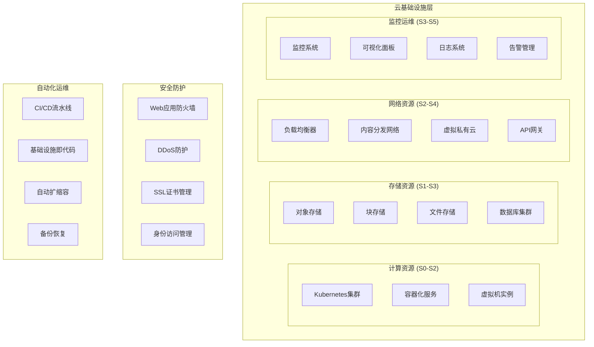

# 太上老君AI平台 - 云基础设施

## 概述

太上老君AI平台的云基础设施基于S×C×T三轴理论设计，提供高可用、可扩展、安全的云原生基础设施服务。

## 基础设施架构



## 核心组件

### 1. Kubernetes集群管理

```yaml
# k8s-cluster-config.yaml
apiVersion: v1
kind: ConfigMap
metadata:
  name: cluster-config
  namespace: taishang-system
data:
  cluster.yaml: |
    cluster:
      name: taishang-production
      version: "1.28"
      nodes:
        master:
          count: 3
          instance_type: "c5.xlarge"
          zones: ["us-west-2a", "us-west-2b", "us-west-2c"]
        worker:
          count: 6
          instance_type: "c5.2xlarge"
          auto_scaling:
            min: 3
            max: 20
            target_cpu: 70
      networking:
        pod_cidr: "10.244.0.0/16"
        service_cidr: "10.96.0.0/12"
        cni: "calico"
      addons:
        - name: "aws-load-balancer-controller"
        - name: "cluster-autoscaler"
        - name: "metrics-server"
        - name: "cert-manager"

---
apiVersion: apps/v1
kind: Deployment
metadata:
  name: cluster-manager
  namespace: taishang-system
spec:
  replicas: 2
  selector:
    matchLabels:
      app: cluster-manager
  template:
    metadata:
      labels:
        app: cluster-manager
    spec:
      containers:
      - name: manager
        image: taishang/cluster-manager:v1.0.0
        ports:
        - containerPort: 8080
        env:
        - name: CLUSTER_NAME
          value: "taishang-production"
        - name: MONITORING_ENABLED
          value: "true"
        resources:
          requests:
            memory: "256Mi"
            cpu: "250m"
          limits:
            memory: "512Mi"
            cpu: "500m"
```

### 2. 存储系统配置

```yaml
# storage-config.yaml
apiVersion: storage.k8s.io/v1
kind: StorageClass
metadata:
  name: taishang-ssd
provisioner: kubernetes.io/aws-ebs
parameters:
  type: gp3
  iops: "3000"
  throughput: "125"
  encrypted: "true"
allowVolumeExpansion: true
reclaimPolicy: Retain

---
apiVersion: v1
kind: PersistentVolumeClaim
metadata:
  name: ai-model-storage
  namespace: taishang-ai
spec:
  accessModes:
    - ReadWriteOnce
  storageClassName: taishang-ssd
  resources:
    requests:
      storage: 100Gi

---
apiVersion: v1
kind: ConfigMap
metadata:
  name: storage-config
  namespace: taishang-system
data:
  minio.yaml: |
    minio:
      endpoint: "minio.taishang-storage.svc.cluster.local:9000"
      access_key: "${MINIO_ACCESS_KEY}"
      secret_key: "${MINIO_SECRET_KEY}"
      buckets:
        - name: "ai-models"
          policy: "private"
        - name: "user-data"
          policy: "private"
        - name: "static-assets"
          policy: "public-read"
        - name: "backups"
          policy: "private"
          lifecycle:
            expiration_days: 90
```

### 3. 网络配置

```yaml
# network-config.yaml
apiVersion: networking.k8s.io/v1
kind: NetworkPolicy
metadata:
  name: taishang-network-policy
  namespace: taishang-production
spec:
  podSelector: {}
  policyTypes:
  - Ingress
  - Egress
  ingress:
  - from:
    - namespaceSelector:
        matchLabels:
          name: taishang-system
    - namespaceSelector:
        matchLabels:
          name: taishang-monitoring
  egress:
  - to:
    - namespaceSelector:
        matchLabels:
          name: taishang-database
    ports:
    - protocol: TCP
      port: 5432
  - to:
    - namespaceSelector:
        matchLabels:
          name: taishang-cache
    ports:
    - protocol: TCP
      port: 6379

---
apiVersion: networking.k8s.io/v1
kind: Ingress
metadata:
  name: taishang-ingress
  namespace: taishang-production
  annotations:
    kubernetes.io/ingress.class: "nginx"
    cert-manager.io/cluster-issuer: "letsencrypt-prod"
    nginx.ingress.kubernetes.io/rate-limit: "100"
    nginx.ingress.kubernetes.io/ssl-redirect: "true"
spec:
  tls:
  - hosts:
    - api.taishang.ai
    - app.taishang.ai
    secretName: taishang-tls
  rules:
  - host: api.taishang.ai
    http:
      paths:
      - path: /
        pathType: Prefix
        backend:
          service:
            name: taishang-api
            port:
              number: 80
  - host: app.taishang.ai
    http:
      paths:
      - path: /
        pathType: Prefix
        backend:
          service:
            name: taishang-frontend
            port:
              number: 80
```

## 监控与运维

### 1. Prometheus监控配置

```yaml
# monitoring-config.yaml
apiVersion: v1
kind: ConfigMap
metadata:
  name: prometheus-config
  namespace: taishang-monitoring
data:
  prometheus.yml: |
    global:
      scrape_interval: 15s
      evaluation_interval: 15s
    
    rule_files:
      - "/etc/prometheus/rules/*.yml"
    
    alerting:
      alertmanagers:
        - static_configs:
            - targets:
              - alertmanager:9093
    
    scrape_configs:
      - job_name: 'kubernetes-apiservers'
        kubernetes_sd_configs:
        - role: endpoints
        scheme: https
        tls_config:
          ca_file: /var/run/secrets/kubernetes.io/serviceaccount/ca.crt
        bearer_token_file: /var/run/secrets/kubernetes.io/serviceaccount/token
        relabel_configs:
        - source_labels: [__meta_kubernetes_namespace, __meta_kubernetes_service_name, __meta_kubernetes_endpoint_port_name]
          action: keep
          regex: default;kubernetes;https
      
      - job_name: 'taishang-services'
        kubernetes_sd_configs:
        - role: pod
        relabel_configs:
        - source_labels: [__meta_kubernetes_pod_annotation_prometheus_io_scrape]
          action: keep
          regex: true
        - source_labels: [__meta_kubernetes_pod_annotation_prometheus_io_path]
          action: replace
          target_label: __metrics_path__
          regex: (.+)
        - source_labels: [__address__, __meta_kubernetes_pod_annotation_prometheus_io_port]
          action: replace
          regex: ([^:]+)(?::\d+)?;(\d+)
          replacement: $1:$2
          target_label: __address__

  alerts.yml: |
    groups:
    - name: taishang.rules
      rules:
      - alert: HighCPUUsage
        expr: 100 - (avg by(instance) (irate(node_cpu_seconds_total{mode="idle"}[5m])) * 100) > 80
        for: 5m
        labels:
          severity: warning
        annotations:
          summary: "High CPU usage detected"
          description: "CPU usage is above 80% for more than 5 minutes"
      
      - alert: HighMemoryUsage
        expr: (node_memory_MemTotal_bytes - node_memory_MemAvailable_bytes) / node_memory_MemTotal_bytes * 100 > 85
        for: 5m
        labels:
          severity: warning
        annotations:
          summary: "High memory usage detected"
          description: "Memory usage is above 85% for more than 5 minutes"
      
      - alert: PodCrashLooping
        expr: rate(kube_pod_container_status_restarts_total[15m]) > 0
        for: 5m
        labels:
          severity: critical
        annotations:
          summary: "Pod is crash looping"
          description: "Pod {{ $labels.pod }} in namespace {{ $labels.namespace }} is crash looping"
```

### 2. Grafana仪表板配置

```json
{
  "dashboard": {
    "id": null,
    "title": "太上老君AI平台 - 基础设施监控",
    "tags": ["taishang", "infrastructure"],
    "timezone": "browser",
    "panels": [
      {
        "id": 1,
        "title": "集群资源使用率",
        "type": "stat",
        "targets": [
          {
            "expr": "100 - (avg(irate(node_cpu_seconds_total{mode=\"idle\"}[5m])) * 100)",
            "legendFormat": "CPU使用率"
          },
          {
            "expr": "(1 - (node_memory_MemAvailable_bytes / node_memory_MemTotal_bytes)) * 100",
            "legendFormat": "内存使用率"
          }
        ],
        "fieldConfig": {
          "defaults": {
            "unit": "percent",
            "min": 0,
            "max": 100,
            "thresholds": {
              "steps": [
                {"color": "green", "value": 0},
                {"color": "yellow", "value": 70},
                {"color": "red", "value": 85}
              ]
            }
          }
        }
      },
      {
        "id": 2,
        "title": "Pod状态分布",
        "type": "piechart",
        "targets": [
          {
            "expr": "sum by (phase) (kube_pod_status_phase{namespace=~\"taishang.*\"})",
            "legendFormat": "{{phase}}"
          }
        ]
      },
      {
        "id": 3,
        "title": "网络流量",
        "type": "timeseries",
        "targets": [
          {
            "expr": "sum(rate(container_network_receive_bytes_total[5m]))",
            "legendFormat": "入站流量"
          },
          {
            "expr": "sum(rate(container_network_transmit_bytes_total[5m]))",
            "legendFormat": "出站流量"
          }
        ],
        "fieldConfig": {
          "defaults": {
            "unit": "binBps"
          }
        }
      }
    ],
    "time": {
      "from": "now-1h",
      "to": "now"
    },
    "refresh": "30s"
  }
}
```

## 自动化运维

### 1. Terraform基础设施即代码

```hcl
# main.tf
terraform {
  required_version = ">= 1.0"
  required_providers {
    aws = {
      source  = "hashicorp/aws"
      version = "~> 5.0"
    }
    kubernetes = {
      source  = "hashicorp/kubernetes"
      version = "~> 2.0"
    }
  }
}

provider "aws" {
  region = var.aws_region
}

# VPC配置
resource "aws_vpc" "taishang_vpc" {
  cidr_block           = "10.0.0.0/16"
  enable_dns_hostnames = true
  enable_dns_support   = true
  
  tags = {
    Name = "taishang-vpc"
    Environment = var.environment
  }
}

# 子网配置
resource "aws_subnet" "private_subnets" {
  count             = length(var.availability_zones)
  vpc_id            = aws_vpc.taishang_vpc.id
  cidr_block        = "10.0.${count.index + 1}.0/24"
  availability_zone = var.availability_zones[count.index]
  
  tags = {
    Name = "taishang-private-${count.index + 1}"
    Type = "private"
  }
}

resource "aws_subnet" "public_subnets" {
  count                   = length(var.availability_zones)
  vpc_id                  = aws_vpc.taishang_vpc.id
  cidr_block              = "10.0.${count.index + 10}.0/24"
  availability_zone       = var.availability_zones[count.index]
  map_public_ip_on_launch = true
  
  tags = {
    Name = "taishang-public-${count.index + 1}"
    Type = "public"
  }
}

# EKS集群
resource "aws_eks_cluster" "taishang_cluster" {
  name     = "taishang-${var.environment}"
  role_arn = aws_iam_role.cluster_role.arn
  version  = "1.28"

  vpc_config {
    subnet_ids              = concat(aws_subnet.private_subnets[*].id, aws_subnet.public_subnets[*].id)
    endpoint_private_access = true
    endpoint_public_access  = true
    public_access_cidrs     = ["0.0.0.0/0"]
  }

  encryption_config {
    provider {
      key_arn = aws_kms_key.cluster_encryption.arn
    }
    resources = ["secrets"]
  }

  enabled_cluster_log_types = ["api", "audit", "authenticator", "controllerManager", "scheduler"]

  depends_on = [
    aws_iam_role_policy_attachment.cluster_policy,
    aws_iam_role_policy_attachment.vpc_resource_controller,
  ]

  tags = {
    Environment = var.environment
  }
}

# 节点组
resource "aws_eks_node_group" "taishang_nodes" {
  cluster_name    = aws_eks_cluster.taishang_cluster.name
  node_group_name = "taishang-nodes"
  node_role_arn   = aws_iam_role.node_role.arn
  subnet_ids      = aws_subnet.private_subnets[*].id
  instance_types  = ["c5.xlarge"]

  scaling_config {
    desired_size = 3
    max_size     = 10
    min_size     = 1
  }

  update_config {
    max_unavailable = 1
  }

  depends_on = [
    aws_iam_role_policy_attachment.node_policy,
    aws_iam_role_policy_attachment.cni_policy,
    aws_iam_role_policy_attachment.registry_policy,
  ]

  tags = {
    Environment = var.environment
  }
}
```

### 2. Ansible自动化配置

```yaml
# ansible/playbooks/infrastructure-setup.yml
---
- name: 太上老君AI平台基础设施配置
  hosts: all
  become: yes
  vars:
    k8s_version: "1.28.0"
    docker_version: "24.0.0"
    
  tasks:
    - name: 更新系统包
      apt:
        update_cache: yes
        upgrade: dist
        
    - name: 安装Docker
      block:
        - name: 添加Docker GPG密钥
          apt_key:
            url: https://download.docker.com/linux/ubuntu/gpg
            state: present
            
        - name: 添加Docker仓库
          apt_repository:
            repo: "deb [arch=amd64] https://download.docker.com/linux/ubuntu {{ ansible_distribution_release }} stable"
            state: present
            
        - name: 安装Docker CE
          apt:
            name: 
              - docker-ce={{ docker_version }}*
              - docker-ce-cli={{ docker_version }}*
              - containerd.io
            state: present
            
    - name: 配置Kubernetes
      block:
        - name: 添加Kubernetes GPG密钥
          apt_key:
            url: https://packages.cloud.google.com/apt/doc/apt-key.gpg
            state: present
            
        - name: 添加Kubernetes仓库
          apt_repository:
            repo: "deb https://apt.kubernetes.io/ kubernetes-xenial main"
            state: present
            
        - name: 安装Kubernetes组件
          apt:
            name:
              - kubelet={{ k8s_version }}*
              - kubeadm={{ k8s_version }}*
              - kubectl={{ k8s_version }}*
            state: present
            
        - name: 标记Kubernetes包为保持
          dpkg_selections:
            name: "{{ item }}"
            selection: hold
          loop:
            - kubelet
            - kubeadm
            - kubectl
            
    - name: 配置系统参数
      block:
        - name: 禁用swap
          command: swapoff -a
          
        - name: 永久禁用swap
          lineinfile:
            path: /etc/fstab
            regexp: '.*swap.*'
            state: absent
            
        - name: 加载内核模块
          modprobe:
            name: "{{ item }}"
          loop:
            - br_netfilter
            - ip_vs
            - ip_vs_rr
            - ip_vs_wrr
            - ip_vs_sh
            
        - name: 配置内核参数
          sysctl:
            name: "{{ item.name }}"
            value: "{{ item.value }}"
            sysctl_set: yes
            state: present
            reload: yes
          loop:
            - { name: 'net.bridge.bridge-nf-call-iptables', value: '1' }
            - { name: 'net.bridge.bridge-nf-call-ip6tables', value: '1' }
            - { name: 'net.ipv4.ip_forward', value: '1' }
```

## 安全配置

### 1. 网络安全策略

```yaml
# security-policies.yaml
apiVersion: networking.k8s.io/v1
kind: NetworkPolicy
metadata:
  name: deny-all-ingress
  namespace: taishang-production
spec:
  podSelector: {}
  policyTypes:
  - Ingress

---
apiVersion: networking.k8s.io/v1
kind: NetworkPolicy
metadata:
  name: allow-frontend-to-api
  namespace: taishang-production
spec:
  podSelector:
    matchLabels:
      app: taishang-api
  policyTypes:
  - Ingress
  ingress:
  - from:
    - podSelector:
        matchLabels:
          app: taishang-frontend
    ports:
    - protocol: TCP
      port: 8080

---
apiVersion: v1
kind: Secret
metadata:
  name: taishang-tls-secret
  namespace: taishang-production
type: kubernetes.io/tls
data:
  tls.crt: LS0tLS1CRUdJTi... # Base64编码的证书
  tls.key: LS0tLS1CRUdJTi... # Base64编码的私钥
```

### 2. RBAC权限控制

```yaml
# rbac-config.yaml
apiVersion: rbac.authorization.k8s.io/v1
kind: ClusterRole
metadata:
  name: taishang-admin
rules:
- apiGroups: [""]
  resources: ["*"]
  verbs: ["*"]
- apiGroups: ["apps"]
  resources: ["*"]
  verbs: ["*"]
- apiGroups: ["networking.k8s.io"]
  resources: ["*"]
  verbs: ["*"]

---
apiVersion: rbac.authorization.k8s.io/v1
kind: ClusterRole
metadata:
  name: taishang-developer
rules:
- apiGroups: [""]
  resources: ["pods", "services", "configmaps", "secrets"]
  verbs: ["get", "list", "watch", "create", "update", "patch"]
- apiGroups: ["apps"]
  resources: ["deployments", "replicasets"]
  verbs: ["get", "list", "watch", "create", "update", "patch"]

---
apiVersion: rbac.authorization.k8s.io/v1
kind: ClusterRoleBinding
metadata:
  name: taishang-admin-binding
subjects:
- kind: User
  name: admin@taishang.ai
  apiGroup: rbac.authorization.k8s.io
roleRef:
  kind: ClusterRole
  name: taishang-admin
  apiGroup: rbac.authorization.k8s.io
```

## 备份与恢复

### 1. 数据备份策略

```yaml
# backup-config.yaml
apiVersion: batch/v1
kind: CronJob
metadata:
  name: database-backup
  namespace: taishang-system
spec:
  schedule: "0 2 * * *"  # 每天凌晨2点执行
  jobTemplate:
    spec:
      template:
        spec:
          containers:
          - name: backup
            image: postgres:15
            command:
            - /bin/bash
            - -c
            - |
              TIMESTAMP=$(date +%Y%m%d_%H%M%S)
              pg_dump -h $DB_HOST -U $DB_USER -d $DB_NAME > /backup/backup_$TIMESTAMP.sql
              aws s3 cp /backup/backup_$TIMESTAMP.sql s3://taishang-backups/database/
              find /backup -name "backup_*.sql" -mtime +7 -delete
            env:
            - name: DB_HOST
              value: "postgres.taishang-database.svc.cluster.local"
            - name: DB_USER
              valueFrom:
                secretKeyRef:
                  name: postgres-credentials
                  key: username
            - name: DB_NAME
              value: "taishang"
            - name: PGPASSWORD
              valueFrom:
                secretKeyRef:
                  name: postgres-credentials
                  key: password
            volumeMounts:
            - name: backup-storage
              mountPath: /backup
          volumes:
          - name: backup-storage
            persistentVolumeClaim:
              claimName: backup-pvc
          restartPolicy: OnFailure

---
apiVersion: batch/v1
kind: CronJob
metadata:
  name: etcd-backup
  namespace: kube-system
spec:
  schedule: "0 3 * * *"  # 每天凌晨3点执行
  jobTemplate:
    spec:
      template:
        spec:
          containers:
          - name: etcd-backup
            image: k8s.gcr.io/etcd:3.5.9-0
            command:
            - /bin/sh
            - -c
            - |
              TIMESTAMP=$(date +%Y%m%d_%H%M%S)
              etcdctl snapshot save /backup/etcd-snapshot-$TIMESTAMP.db
              aws s3 cp /backup/etcd-snapshot-$TIMESTAMP.db s3://taishang-backups/etcd/
              find /backup -name "etcd-snapshot-*.db" -mtime +3 -delete
            env:
            - name: ETCDCTL_API
              value: "3"
            - name: ETCDCTL_ENDPOINTS
              value: "https://127.0.0.1:2379"
            - name: ETCDCTL_CACERT
              value: "/etc/kubernetes/pki/etcd/ca.crt"
            - name: ETCDCTL_CERT
              value: "/etc/kubernetes/pki/etcd/server.crt"
            - name: ETCDCTL_KEY
              value: "/etc/kubernetes/pki/etcd/server.key"
            volumeMounts:
            - name: etcd-certs
              mountPath: /etc/kubernetes/pki/etcd
              readOnly: true
            - name: backup-storage
              mountPath: /backup
          volumes:
          - name: etcd-certs
            hostPath:
              path: /etc/kubernetes/pki/etcd
          - name: backup-storage
            persistentVolumeClaim:
              claimName: backup-pvc
          restartPolicy: OnFailure
          hostNetwork: true
```

## 性能优化

### 1. 资源配额管理

```yaml
# resource-quotas.yaml
apiVersion: v1
kind: ResourceQuota
metadata:
  name: taishang-production-quota
  namespace: taishang-production
spec:
  hard:
    requests.cpu: "20"
    requests.memory: 40Gi
    limits.cpu: "40"
    limits.memory: 80Gi
    persistentvolumeclaims: "10"
    services: "20"
    secrets: "50"
    configmaps: "50"

---
apiVersion: v1
kind: LimitRange
metadata:
  name: taishang-production-limits
  namespace: taishang-production
spec:
  limits:
  - default:
      cpu: "500m"
      memory: "1Gi"
    defaultRequest:
      cpu: "100m"
      memory: "256Mi"
    type: Container
  - max:
      cpu: "2"
      memory: "4Gi"
    min:
      cpu: "50m"
      memory: "128Mi"
    type: Container
```

### 2. 水平Pod自动扩缩容

```yaml
# hpa-config.yaml
apiVersion: autoscaling/v2
kind: HorizontalPodAutoscaler
metadata:
  name: taishang-api-hpa
  namespace: taishang-production
spec:
  scaleTargetRef:
    apiVersion: apps/v1
    kind: Deployment
    name: taishang-api
  minReplicas: 3
  maxReplicas: 20
  metrics:
  - type: Resource
    resource:
      name: cpu
      target:
        type: Utilization
        averageUtilization: 70
  - type: Resource
    resource:
      name: memory
      target:
        type: Utilization
        averageUtilization: 80
  - type: Pods
    pods:
      metric:
        name: http_requests_per_second
      target:
        type: AverageValue
        averageValue: "100"
  behavior:
    scaleDown:
      stabilizationWindowSeconds: 300
      policies:
      - type: Percent
        value: 10
        periodSeconds: 60
    scaleUp:
      stabilizationWindowSeconds: 60
      policies:
      - type: Percent
        value: 50
        periodSeconds: 60
      - type: Pods
        value: 2
        periodSeconds: 60
      selectPolicy: Max
```

## 灾难恢复

### 1. 多区域部署

```yaml
# multi-region-config.yaml
apiVersion: v1
kind: ConfigMap
metadata:
  name: multi-region-config
  namespace: taishang-system
data:
  regions.yaml: |
    primary_region: "us-west-2"
    secondary_regions:
      - "us-east-1"
      - "eu-west-1"
    
    replication:
      database:
        type: "async"
        lag_threshold: "5s"
      storage:
        type: "cross-region"
        consistency: "eventual"
    
    failover:
      automatic: true
      rto: "5m"  # Recovery Time Objective
      rpo: "1m"  # Recovery Point Objective
      
    traffic_routing:
      primary_weight: 100
      secondary_weight: 0
      health_check_interval: "30s"
```

### 2. 灾难恢复脚本

```bash
#!/bin/bash
# disaster-recovery.sh

set -e

BACKUP_BUCKET="s3://taishang-backups"
REGION=${1:-"us-west-2"}
RECOVERY_TYPE=${2:-"full"}

echo "开始灾难恢复流程..."
echo "目标区域: $REGION"
echo "恢复类型: $RECOVERY_TYPE"

# 1. 恢复基础设施
echo "恢复基础设施..."
terraform init -backend-config="region=$REGION"
terraform plan -var="aws_region=$REGION" -var="environment=disaster-recovery"
terraform apply -auto-approve

# 2. 恢复Kubernetes集群
echo "配置Kubernetes集群..."
aws eks update-kubeconfig --region $REGION --name taishang-disaster-recovery

# 3. 恢复数据库
echo "恢复数据库..."
LATEST_DB_BACKUP=$(aws s3 ls $BACKUP_BUCKET/database/ --recursive | sort | tail -n 1 | awk '{print $4}')
aws s3 cp $BACKUP_BUCKET/$LATEST_DB_BACKUP /tmp/latest_backup.sql

kubectl create secret generic postgres-restore \
  --from-file=backup.sql=/tmp/latest_backup.sql \
  --namespace=taishang-database

kubectl apply -f - <<EOF
apiVersion: batch/v1
kind: Job
metadata:
  name: database-restore
  namespace: taishang-database
spec:
  template:
    spec:
      containers:
      - name: restore
        image: postgres:15
        command:
        - /bin/bash
        - -c
        - |
          psql -h \$DB_HOST -U \$DB_USER -d \$DB_NAME < /backup/backup.sql
        env:
        - name: DB_HOST
          value: "postgres.taishang-database.svc.cluster.local"
        - name: DB_USER
          valueFrom:
            secretKeyRef:
              name: postgres-credentials
              key: username
        - name: DB_NAME
          value: "taishang"
        - name: PGPASSWORD
          valueFrom:
            secretKeyRef:
              name: postgres-credentials
              key: password
        volumeMounts:
        - name: backup-data
          mountPath: /backup
      volumes:
      - name: backup-data
        secret:
          secretName: postgres-restore
      restartPolicy: Never
EOF

# 4. 部署应用服务
echo "部署应用服务..."
kubectl apply -f k8s/production/

# 5. 验证恢复状态
echo "验证恢复状态..."
kubectl wait --for=condition=available --timeout=600s deployment/taishang-api -n taishang-production
kubectl wait --for=condition=available --timeout=600s deployment/taishang-frontend -n taishang-production

# 6. 运行健康检查
echo "运行健康检查..."
kubectl run health-check --image=curlimages/curl --rm -it --restart=Never -- \
  curl -f http://taishang-api.taishang-production.svc.cluster.local:8080/health

echo "灾难恢复完成！"
echo "请验证所有服务正常运行后，更新DNS记录指向新的区域。"
```

## 相关文档

- [容器化部署](../08-部署运维/container-deployment.md)
- [监控告警](../08-部署运维/monitoring-alerting.md)
- [安全配置](../08-部署运维/security-config.md)
- [性能优化](../02-架构设计/performance-optimization.md)