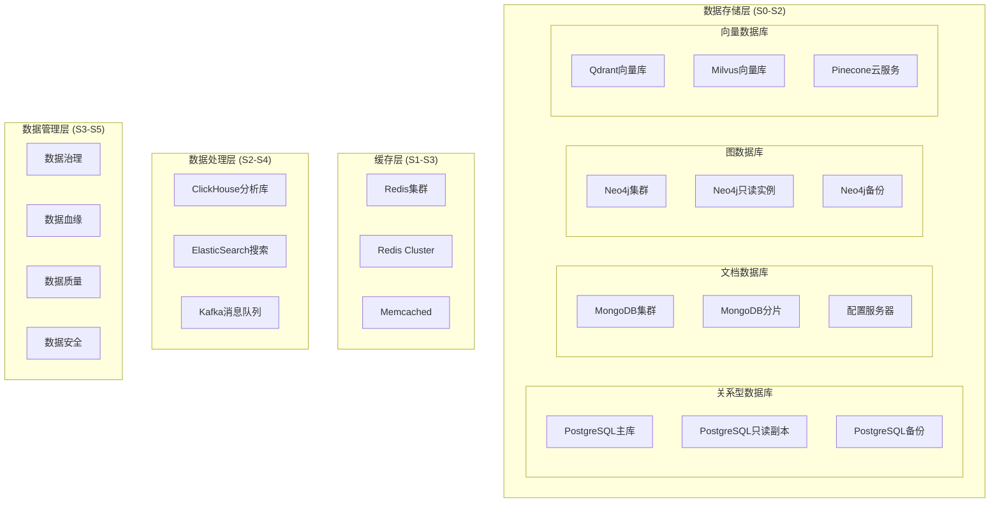

# 太上老君AI平台 - 数据库管理

## 概述

太上老君AI平台采用多数据库架构，基于S×C×T三轴理论设计，支持关系型、文档型、图数据库和向量数据库，满足不同层级的数据存储和处理需求。

## 数据库架构



## PostgreSQL配置

### 1. 主从复制配置

```sql
-- postgresql.conf 主库配置
-- 基础配置
listen_addresses = '*'
port = 5432
max_connections = 200
shared_buffers = 256MB
effective_cache_size = 1GB
work_mem = 4MB
maintenance_work_mem = 64MB

-- WAL配置
wal_level = replica
max_wal_senders = 3
max_replication_slots = 3
wal_keep_size = 1GB
archive_mode = on
archive_command = 'cp %p /var/lib/postgresql/archive/%f'

-- 日志配置
logging_collector = on
log_directory = 'log'
log_filename = 'postgresql-%Y-%m-%d_%H%M%S.log'
log_statement = 'all'
log_min_duration_statement = 1000

-- 性能优化
checkpoint_completion_target = 0.9
wal_buffers = 16MB
default_statistics_target = 100
random_page_cost = 1.1
effective_io_concurrency = 200
```

```sql
-- pg_hba.conf 访问控制
# TYPE  DATABASE        USER            ADDRESS                 METHOD
local   all             postgres                                peer
local   all             all                                     md5
host    all             all             127.0.0.1/32            md5
host    all             all             ::1/128                 md5
host    replication     replicator      10.0.0.0/8              md5
host    all             taishang_user   10.0.0.0/8              md5
```

### 2. 数据库初始化脚本

```sql
-- init-database.sql
-- 创建数据库
CREATE DATABASE taishang_users;
CREATE DATABASE taishang_ai;
CREATE DATABASE taishang_data;
CREATE DATABASE taishang_analytics;

-- 创建用户和权限
CREATE USER taishang_user WITH PASSWORD 'secure_password';
CREATE USER taishang_ai_user WITH PASSWORD 'secure_password';
CREATE USER taishang_analytics_user WITH PASSWORD 'secure_password';
CREATE USER replicator WITH REPLICATION PASSWORD 'replication_password';

-- 授权
GRANT ALL PRIVILEGES ON DATABASE taishang_users TO taishang_user;
GRANT ALL PRIVILEGES ON DATABASE taishang_ai TO taishang_ai_user;
GRANT ALL PRIVILEGES ON DATABASE taishang_data TO taishang_user;
GRANT SELECT ON DATABASE taishang_analytics TO taishang_analytics_user;

-- 创建扩展
\c taishang_users;
CREATE EXTENSION IF NOT EXISTS "uuid-ossp";
CREATE EXTENSION IF NOT EXISTS "pgcrypto";
CREATE EXTENSION IF NOT EXISTS "pg_trgm";

\c taishang_ai;
CREATE EXTENSION IF NOT EXISTS "vector";
CREATE EXTENSION IF NOT EXISTS "pg_trgm";
CREATE EXTENSION IF NOT EXISTS "btree_gin";

\c taishang_data;
CREATE EXTENSION IF NOT EXISTS "postgis";
CREATE EXTENSION IF NOT EXISTS "pg_stat_statements";
```

### 3. 用户表结构

```sql
-- users-schema.sql
\c taishang_users;

-- 用户基础信息表
CREATE TABLE users (
    id UUID PRIMARY KEY DEFAULT uuid_generate_v4(),
    username VARCHAR(50) UNIQUE NOT NULL,
    email VARCHAR(255) UNIQUE NOT NULL,
    password_hash VARCHAR(255) NOT NULL,
    full_name VARCHAR(100),
    avatar_url TEXT,
    phone VARCHAR(20),
    status VARCHAR(20) DEFAULT 'active',
    silicon_level INTEGER DEFAULT 1,
    consciousness_level INTEGER DEFAULT 1,
    thinking_level INTEGER DEFAULT 1,
    created_at TIMESTAMP WITH TIME ZONE DEFAULT NOW(),
    updated_at TIMESTAMP WITH TIME ZONE DEFAULT NOW(),
    last_login_at TIMESTAMP WITH TIME ZONE,
    metadata JSONB DEFAULT '{}'::jsonb
);

-- 用户配置表
CREATE TABLE user_preferences (
    id UUID PRIMARY KEY DEFAULT uuid_generate_v4(),
    user_id UUID REFERENCES users(id) ON DELETE CASCADE,
    preference_key VARCHAR(100) NOT NULL,
    preference_value JSONB NOT NULL,
    created_at TIMESTAMP WITH TIME ZONE DEFAULT NOW(),
    updated_at TIMESTAMP WITH TIME ZONE DEFAULT NOW(),
    UNIQUE(user_id, preference_key)
);

-- 用户会话表
CREATE TABLE user_sessions (
    id UUID PRIMARY KEY DEFAULT uuid_generate_v4(),
    user_id UUID REFERENCES users(id) ON DELETE CASCADE,
    session_token VARCHAR(255) UNIQUE NOT NULL,
    device_info JSONB,
    ip_address INET,
    user_agent TEXT,
    expires_at TIMESTAMP WITH TIME ZONE NOT NULL,
    created_at TIMESTAMP WITH TIME ZONE DEFAULT NOW(),
    last_accessed_at TIMESTAMP WITH TIME ZONE DEFAULT NOW()
);

-- 用户权限表
CREATE TABLE user_permissions (
    id UUID PRIMARY KEY DEFAULT uuid_generate_v4(),
    user_id UUID REFERENCES users(id) ON DELETE CASCADE,
    permission_name VARCHAR(100) NOT NULL,
    resource_type VARCHAR(50),
    resource_id VARCHAR(100),
    granted_at TIMESTAMP WITH TIME ZONE DEFAULT NOW(),
    granted_by UUID REFERENCES users(id),
    expires_at TIMESTAMP WITH TIME ZONE,
    UNIQUE(user_id, permission_name, resource_type, resource_id)
);

-- 创建索引
CREATE INDEX idx_users_email ON users(email);
CREATE INDEX idx_users_username ON users(username);
CREATE INDEX idx_users_status ON users(status);
CREATE INDEX idx_users_silicon_level ON users(silicon_level);
CREATE INDEX idx_user_sessions_token ON user_sessions(session_token);
CREATE INDEX idx_user_sessions_user_id ON user_sessions(user_id);
CREATE INDEX idx_user_sessions_expires ON user_sessions(expires_at);
CREATE INDEX idx_user_permissions_user_id ON user_permissions(user_id);
CREATE INDEX idx_user_preferences_user_id ON user_preferences(user_id);

-- 创建触发器
CREATE OR REPLACE FUNCTION update_updated_at_column()
RETURNS TRIGGER AS $$
BEGIN
    NEW.updated_at = NOW();
    RETURN NEW;
END;
$$ language 'plpgsql';

CREATE TRIGGER update_users_updated_at BEFORE UPDATE ON users
    FOR EACH ROW EXECUTE FUNCTION update_updated_at_column();

CREATE TRIGGER update_user_preferences_updated_at BEFORE UPDATE ON user_preferences
    FOR EACH ROW EXECUTE FUNCTION update_updated_at_column();
```

## MongoDB配置

### 1. 副本集配置

```javascript
// mongodb-replica-init.js
rs.initiate({
  _id: "taishang-replica",
  members: [
    { _id: 0, host: "mongo-primary:27017", priority: 2 },
    { _id: 1, host: "mongo-secondary1:27017", priority: 1 },
    { _id: 2, host: "mongo-secondary2:27017", priority: 1 },
    { _id: 3, host: "mongo-arbiter:27017", arbiterOnly: true }
  ]
});

// 创建数据库和集合
use taishang_content;

// 创建用户内容集合
db.createCollection("user_contents", {
  validator: {
    $jsonSchema: {
      bsonType: "object",
      required: ["user_id", "content_type", "title", "created_at"],
      properties: {
        user_id: {
          bsonType: "string",
          description: "用户ID，必须是字符串"
        },
        content_type: {
          bsonType: "string",
          enum: ["article", "note", "bookmark", "comment"],
          description: "内容类型"
        },
        title: {
          bsonType: "string",
          maxLength: 200,
          description: "内容标题"
        },
        content: {
          bsonType: "string",
          description: "内容正文"
        },
        tags: {
          bsonType: "array",
          items: {
            bsonType: "string"
          },
          description: "标签数组"
        },
        metadata: {
          bsonType: "object",
          description: "元数据对象"
        },
        silicon_level: {
          bsonType: "int",
          minimum: 0,
          maximum: 5,
          description: "硅基层级"
        },
        created_at: {
          bsonType: "date",
          description: "创建时间"
        },
        updated_at: {
          bsonType: "date",
          description: "更新时间"
        }
      }
    }
  }
});

// 创建AI对话集合
db.createCollection("ai_conversations", {
  validator: {
    $jsonSchema: {
      bsonType: "object",
      required: ["user_id", "session_id", "created_at"],
      properties: {
        user_id: {
          bsonType: "string",
          description: "用户ID"
        },
        session_id: {
          bsonType: "string",
          description: "会话ID"
        },
        messages: {
          bsonType: "array",
          items: {
            bsonType: "object",
            required: ["role", "content", "timestamp"],
            properties: {
              role: {
                bsonType: "string",
                enum: ["user", "assistant", "system"]
              },
              content: {
                bsonType: "string"
              },
              timestamp: {
                bsonType: "date"
              },
              metadata: {
                bsonType: "object"
              }
            }
          }
        },
        context: {
          bsonType: "object",
          description: "对话上下文"
        },
        created_at: {
          bsonType: "date"
        },
        updated_at: {
          bsonType: "date"
        }
      }
    }
  }
});

// 创建索引
db.user_contents.createIndex({ "user_id": 1, "created_at": -1 });
db.user_contents.createIndex({ "content_type": 1, "created_at": -1 });
db.user_contents.createIndex({ "tags": 1 });
db.user_contents.createIndex({ "title": "text", "content": "text" });
db.user_contents.createIndex({ "silicon_level": 1 });

db.ai_conversations.createIndex({ "user_id": 1, "created_at": -1 });
db.ai_conversations.createIndex({ "session_id": 1 });
db.ai_conversations.createIndex({ "created_at": -1 });

// 创建分片键
sh.enableSharding("taishang_content");
sh.shardCollection("taishang_content.user_contents", { "user_id": 1, "created_at": 1 });
sh.shardCollection("taishang_content.ai_conversations", { "user_id": 1, "session_id": 1 });
```

### 2. 数据管理脚本

```javascript
// mongodb-management.js
// 数据清理脚本
function cleanupOldData() {
    const thirtyDaysAgo = new Date(Date.now() - 30 * 24 * 60 * 60 * 1000);
    
    // 清理过期的AI对话
    const result = db.ai_conversations.deleteMany({
        "created_at": { $lt: thirtyDaysAgo },
        "metadata.keep": { $ne: true }
    });
    
    print(`删除了 ${result.deletedCount} 条过期对话记录`);
    
    // 清理临时内容
    const tempResult = db.user_contents.deleteMany({
        "content_type": "temp",
        "created_at": { $lt: thirtyDaysAgo }
    });
    
    print(`删除了 ${tempResult.deletedCount} 条临时内容`);
}

// 数据统计脚本
function generateDataStats() {
    const stats = {
        timestamp: new Date(),
        collections: {}
    };
    
    // 用户内容统计
    stats.collections.user_contents = {
        total: db.user_contents.countDocuments(),
        by_type: {},
        by_silicon_level: {}
    };
    
    // 按类型统计
    db.user_contents.aggregate([
        { $group: { _id: "$content_type", count: { $sum: 1 } } }
    ]).forEach(doc => {
        stats.collections.user_contents.by_type[doc._id] = doc.count;
    });
    
    // 按硅基层级统计
    db.user_contents.aggregate([
        { $group: { _id: "$silicon_level", count: { $sum: 1 } } }
    ]).forEach(doc => {
        stats.collections.user_contents.by_silicon_level[doc._id] = doc.count;
    });
    
    // AI对话统计
    stats.collections.ai_conversations = {
        total: db.ai_conversations.countDocuments(),
        active_sessions: db.ai_conversations.distinct("session_id").length,
        avg_messages_per_session: 0
    };
    
    const avgResult = db.ai_conversations.aggregate([
        { $project: { message_count: { $size: "$messages" } } },
        { $group: { _id: null, avg: { $avg: "$message_count" } } }
    ]).toArray();
    
    if (avgResult.length > 0) {
        stats.collections.ai_conversations.avg_messages_per_session = avgResult[0].avg;
    }
    
    // 保存统计结果
    db.data_statistics.insertOne(stats);
    
    return stats;
}

// 数据备份脚本
function backupCollection(collectionName, outputPath) {
    const command = `mongodump --db taishang_content --collection ${collectionName} --out ${outputPath}`;
    print(`执行备份命令: ${command}`);
    
    // 记录备份日志
    db.backup_logs.insertOne({
        collection: collectionName,
        backup_path: outputPath,
        timestamp: new Date(),
        status: "completed"
    });
}
```

## Neo4j配置

### 1. 集群配置

```properties
# neo4j.conf
# 网络配置
dbms.default_listen_address=0.0.0.0
dbms.default_advertised_address=neo4j-core-1

# 集群配置
causal_clustering.minimum_core_cluster_size_at_formation=3
causal_clustering.minimum_core_cluster_size_at_runtime=3
causal_clustering.initial_discovery_members=neo4j-core-1:5000,neo4j-core-2:5000,neo4j-core-3:5000

# 内存配置
dbms.memory.heap.initial_size=2G
dbms.memory.heap.max_size=2G
dbms.memory.pagecache.size=1G

# 安全配置
dbms.security.auth_enabled=true
dbms.security.procedures.unrestricted=apoc.*,algo.*

# 日志配置
dbms.logs.query.enabled=true
dbms.logs.query.threshold=1000ms
dbms.logs.query.parameter_logging_enabled=true

# 性能配置
cypher.default_language_version=4
cypher.forbid_exhaustive_shortestpath=true
cypher.hints_error=true
```

### 2. 知识图谱初始化

```cypher
// knowledge-graph-init.cypher
// 创建约束
CREATE CONSTRAINT user_id_unique IF NOT EXISTS FOR (u:User) REQUIRE u.id IS UNIQUE;
CREATE CONSTRAINT concept_name_unique IF NOT EXISTS FOR (c:Concept) REQUIRE c.name IS UNIQUE;
CREATE CONSTRAINT knowledge_id_unique IF NOT EXISTS FOR (k:Knowledge) REQUIRE k.id IS UNIQUE;

// 创建索引
CREATE INDEX user_silicon_level IF NOT EXISTS FOR (u:User) ON (u.silicon_level);
CREATE INDEX concept_category IF NOT EXISTS FOR (c:Concept) ON (c.category);
CREATE INDEX knowledge_created_at IF NOT EXISTS FOR (k:Knowledge) ON (k.created_at);

// 创建基础节点类型
// 用户节点
CREATE (u:User {
    id: 'system',
    name: '系统用户',
    silicon_level: 5,
    consciousness_level: 5,
    thinking_level: 5,
    created_at: datetime()
});

// 核心概念节点
CREATE (c1:Concept {
    name: '硅基生命',
    category: 'core',
    description: 'S×C×T三轴理论中的硅基层级概念',
    silicon_level: 3,
    created_at: datetime()
});

CREATE (c2:Concept {
    name: '意识层级',
    category: 'core',
    description: '意识发展的不同阶段',
    silicon_level: 4,
    created_at: datetime()
});

CREATE (c3:Concept {
    name: '思维模式',
    category: 'core',
    description: '思维发展的不同模式',
    silicon_level: 4,
    created_at: datetime()
});

// 创建关系
MATCH (c1:Concept {name: '硅基生命'}), (c2:Concept {name: '意识层级'})
CREATE (c1)-[:RELATES_TO {strength: 0.8, type: 'conceptual'}]->(c2);

MATCH (c2:Concept {name: '意识层级'}), (c3:Concept {name: '思维模式'})
CREATE (c2)-[:INFLUENCES {strength: 0.9, type: 'developmental'}]->(c3);

// 创建知识节点
CREATE (k1:Knowledge {
    id: 'k001',
    title: 'S×C×T三轴理论基础',
    content: '硅基生命、意识层级、思维模式的三维映射理论',
    silicon_level: 3,
    knowledge_type: 'theory',
    created_at: datetime(),
    updated_at: datetime()
});

// 连接知识与概念
MATCH (k:Knowledge {id: 'k001'}), (c:Concept {name: '硅基生命'})
CREATE (k)-[:ABOUT {relevance: 1.0}]->(c);
```

### 3. 图数据库查询优化

```cypher
// graph-queries.cypher
// 用户知识图谱查询
MATCH (u:User {id: $userId})-[:LEARNED]->(k:Knowledge)-[:ABOUT]->(c:Concept)
WHERE k.silicon_level <= u.silicon_level
RETURN c.name, c.category, count(k) as knowledge_count
ORDER BY knowledge_count DESC
LIMIT 20;

// 推荐相关概念
MATCH (u:User {id: $userId})-[:INTERESTED_IN]->(c1:Concept)
MATCH (c1)-[:RELATES_TO*1..2]-(c2:Concept)
WHERE NOT (u)-[:INTERESTED_IN]->(c2)
  AND c2.silicon_level <= u.silicon_level
RETURN c2.name, c2.description, 
       count(DISTINCT c1) as connection_strength
ORDER BY connection_strength DESC
LIMIT 10;

// 学习路径推荐
MATCH path = (start:Concept {name: $startConcept})-[:PREREQUISITE*1..5]->(end:Concept {name: $endConcept})
WHERE ALL(c IN nodes(path) WHERE c.silicon_level <= $userSiliconLevel)
RETURN path, length(path) as path_length
ORDER BY path_length ASC
LIMIT 5;

// 知识网络分析
MATCH (c:Concept)-[r:RELATES_TO]-(other:Concept)
WHERE c.silicon_level = $level
RETURN c.name, 
       count(r) as connections,
       avg(r.strength) as avg_strength,
       collect(other.name)[0..5] as related_concepts
ORDER BY connections DESC;
```

## Redis配置

### 1. 集群配置

```conf
# redis.conf
# 网络配置
bind 0.0.0.0
port 6379
protected-mode yes
requirepass secure_redis_password

# 集群配置
cluster-enabled yes
cluster-config-file nodes.conf
cluster-node-timeout 15000
cluster-announce-ip 10.0.1.10
cluster-announce-port 6379
cluster-announce-bus-port 16379

# 内存配置
maxmemory 2gb
maxmemory-policy allkeys-lru

# 持久化配置
save 900 1
save 300 10
save 60 10000
rdbcompression yes
rdbchecksum yes
dbfilename dump.rdb
dir /var/lib/redis

# AOF配置
appendonly yes
appendfilename "appendonly.aof"
appendfsync everysec
no-appendfsync-on-rewrite no
auto-aof-rewrite-percentage 100
auto-aof-rewrite-min-size 64mb

# 日志配置
loglevel notice
logfile /var/log/redis/redis-server.log

# 性能优化
tcp-keepalive 300
timeout 0
tcp-backlog 511
databases 16
```

### 2. 缓存策略配置

```go
// cache-strategy.go
package cache

import (
    "context"
    "encoding/json"
    "fmt"
    "time"
    
    "github.com/go-redis/redis/v8"
)

type CacheManager struct {
    client *redis.Client
}

// 用户缓存策略
func (c *CacheManager) CacheUser(ctx context.Context, userID string, user interface{}) error {
    key := fmt.Sprintf("user:%s", userID)
    data, err := json.Marshal(user)
    if err != nil {
        return err
    }
    
    // 用户信息缓存1小时
    return c.client.Set(ctx, key, data, time.Hour).Err()
}

// AI对话缓存策略
func (c *CacheManager) CacheConversation(ctx context.Context, sessionID string, conversation interface{}) error {
    key := fmt.Sprintf("conversation:%s", sessionID)
    data, err := json.Marshal(conversation)
    if err != nil {
        return err
    }
    
    // 对话缓存30分钟
    return c.client.Set(ctx, key, data, 30*time.Minute).Err()
}

// 知识图谱缓存策略
func (c *CacheManager) CacheKnowledgeGraph(ctx context.Context, userID string, graphData interface{}) error {
    key := fmt.Sprintf("knowledge_graph:%s", userID)
    data, err := json.Marshal(graphData)
    if err != nil {
        return err
    }
    
    // 知识图谱缓存6小时
    return c.client.Set(ctx, key, data, 6*time.Hour).Err()
}

// 分布式锁实现
func (c *CacheManager) AcquireLock(ctx context.Context, lockKey string, expiration time.Duration) (bool, error) {
    result := c.client.SetNX(ctx, lockKey, "locked", expiration)
    return result.Val(), result.Err()
}

func (c *CacheManager) ReleaseLock(ctx context.Context, lockKey string) error {
    return c.client.Del(ctx, lockKey).Err()
}

// 缓存预热
func (c *CacheManager) WarmupCache(ctx context.Context) error {
    // 预热热门用户数据
    hotUsers := []string{"user1", "user2", "user3"} // 从数据库获取热门用户
    
    for _, userID := range hotUsers {
        // 预加载用户数据到缓存
        go func(uid string) {
            // 从数据库加载用户数据并缓存
            // user := loadUserFromDB(uid)
            // c.CacheUser(ctx, uid, user)
        }(userID)
    }
    
    return nil
}
```

## 向量数据库配置

### 1. Qdrant配置

```yaml
# qdrant-config.yaml
apiVersion: v1
kind: ConfigMap
metadata:
  name: qdrant-config
  namespace: taishang-vector
data:
  config.yaml: |
    log_level: INFO
    
    storage:
      storage_path: /qdrant/storage
      snapshots_path: /qdrant/snapshots
      
    service:
      host: 0.0.0.0
      http_port: 6333
      grpc_port: 6334
      enable_cors: true
      
    cluster:
      enabled: true
      p2p:
        port: 6335
      consensus:
        tick_period_ms: 100
        
    telemetry_disabled: true

---
apiVersion: apps/v1
kind: StatefulSet
metadata:
  name: qdrant
  namespace: taishang-vector
spec:
  serviceName: qdrant
  replicas: 3
  selector:
    matchLabels:
      app: qdrant
  template:
    metadata:
      labels:
        app: qdrant
    spec:
      containers:
      - name: qdrant
        image: qdrant/qdrant:v1.7.0
        ports:
        - containerPort: 6333
          name: http
        - containerPort: 6334
          name: grpc
        - containerPort: 6335
          name: p2p
        volumeMounts:
        - name: qdrant-storage
          mountPath: /qdrant/storage
        - name: qdrant-config
          mountPath: /qdrant/config
        resources:
          requests:
            memory: "1Gi"
            cpu: "500m"
          limits:
            memory: "2Gi"
            cpu: "1000m"
      volumes:
      - name: qdrant-config
        configMap:
          name: qdrant-config
  volumeClaimTemplates:
  - metadata:
      name: qdrant-storage
    spec:
      accessModes: ["ReadWriteOnce"]
      resources:
        requests:
          storage: 50Gi
```

### 2. 向量数据管理

```python
# vector-database-manager.py
import asyncio
from typing import List, Dict, Any
from qdrant_client import QdrantClient
from qdrant_client.models import Distance, VectorParams, PointStruct
import numpy as np

class VectorDatabaseManager:
    def __init__(self, host: str = "localhost", port: int = 6333):
        self.client = QdrantClient(host=host, port=port)
        
    async def create_collection(self, collection_name: str, vector_size: int):
        """创建向量集合"""
        try:
            self.client.create_collection(
                collection_name=collection_name,
                vectors_config=VectorParams(
                    size=vector_size,
                    distance=Distance.COSINE
                )
            )
            print(f"集合 {collection_name} 创建成功")
        except Exception as e:
            print(f"创建集合失败: {e}")
    
    async def insert_vectors(self, collection_name: str, vectors: List[Dict[str, Any]]):
        """插入向量数据"""
        points = []
        for i, vector_data in enumerate(vectors):
            point = PointStruct(
                id=vector_data.get("id", i),
                vector=vector_data["vector"],
                payload=vector_data.get("payload", {})
            )
            points.append(point)
        
        try:
            self.client.upsert(
                collection_name=collection_name,
                points=points
            )
            print(f"成功插入 {len(points)} 个向量")
        except Exception as e:
            print(f"插入向量失败: {e}")
    
    async def search_similar(self, collection_name: str, query_vector: List[float], 
                           limit: int = 10, score_threshold: float = 0.7):
        """搜索相似向量"""
        try:
            search_result = self.client.search(
                collection_name=collection_name,
                query_vector=query_vector,
                limit=limit,
                score_threshold=score_threshold
            )
            return search_result
        except Exception as e:
            print(f"搜索失败: {e}")
            return []
    
    async def create_knowledge_vectors(self):
        """创建知识向量集合"""
        await self.create_collection("knowledge_vectors", 768)  # BERT向量维度
        
        # 示例知识向量数据
        knowledge_data = [
            {
                "id": "k001",
                "vector": np.random.rand(768).tolist(),
                "payload": {
                    "title": "S×C×T三轴理论",
                    "content": "硅基生命理论的核心概念",
                    "silicon_level": 3,
                    "category": "theory"
                }
            },
            {
                "id": "k002", 
                "vector": np.random.rand(768).tolist(),
                "payload": {
                    "title": "意识层级发展",
                    "content": "从基础意识到超个体意识的发展路径",
                    "silicon_level": 4,
                    "category": "development"
                }
            }
        ]
        
        await self.insert_vectors("knowledge_vectors", knowledge_data)
    
    async def create_user_vectors(self):
        """创建用户向量集合"""
        await self.create_collection("user_vectors", 512)  # 用户特征向量维度
        
        # 示例用户向量数据
        user_data = [
            {
                "id": "u001",
                "vector": np.random.rand(512).tolist(),
                "payload": {
                    "user_id": "user123",
                    "silicon_level": 2,
                    "interests": ["AI", "philosophy", "technology"],
                    "learning_style": "visual"
                }
            }
        ]
        
        await self.insert_vectors("user_vectors", user_data)

# 使用示例
async def main():
    manager = VectorDatabaseManager()
    await manager.create_knowledge_vectors()
    await manager.create_user_vectors()
    
    # 搜索相似知识
    query_vector = np.random.rand(768).tolist()
    results = await manager.search_similar("knowledge_vectors", query_vector)
    
    for result in results:
        print(f"ID: {result.id}, Score: {result.score}, Payload: {result.payload}")

if __name__ == "__main__":
    asyncio.run(main())
```

## 数据备份与恢复

### 1. 自动备份脚本

```bash
#!/bin/bash
# backup-databases.sh

set -e

BACKUP_DIR="/var/backups/taishang"
TIMESTAMP=$(date +%Y%m%d_%H%M%S)
S3_BUCKET="s3://taishang-backups"

echo "开始数据库备份流程 - $TIMESTAMP"

# 创建备份目录
mkdir -p $BACKUP_DIR/$TIMESTAMP

# PostgreSQL备份
echo "备份PostgreSQL数据库..."
PGPASSWORD=$POSTGRES_PASSWORD pg_dump -h $POSTGRES_HOST -U $POSTGRES_USER -d taishang_users > $BACKUP_DIR/$TIMESTAMP/users.sql
PGPASSWORD=$POSTGRES_PASSWORD pg_dump -h $POSTGRES_HOST -U $POSTGRES_USER -d taishang_ai > $BACKUP_DIR/$TIMESTAMP/ai.sql
PGPASSWORD=$POSTGRES_PASSWORD pg_dump -h $POSTGRES_HOST -U $POSTGRES_USER -d taishang_data > $BACKUP_DIR/$TIMESTAMP/data.sql

# MongoDB备份
echo "备份MongoDB数据库..."
mongodump --host $MONGO_HOST --username $MONGO_USER --password $MONGO_PASSWORD --db taishang_content --out $BACKUP_DIR/$TIMESTAMP/mongodb

# Neo4j备份
echo "备份Neo4j数据库..."
neo4j-admin dump --database=neo4j --to=$BACKUP_DIR/$TIMESTAMP/neo4j-backup.dump

# Redis备份
echo "备份Redis数据..."
redis-cli --rdb $BACKUP_DIR/$TIMESTAMP/redis-backup.rdb

# Qdrant备份
echo "备份Qdrant向量数据库..."
curl -X POST "http://$QDRANT_HOST:6333/collections/knowledge_vectors/snapshots" > $BACKUP_DIR/$TIMESTAMP/qdrant-knowledge.snapshot
curl -X POST "http://$QDRANT_HOST:6333/collections/user_vectors/snapshots" > $BACKUP_DIR/$TIMESTAMP/qdrant-users.snapshot

# 压缩备份文件
echo "压缩备份文件..."
cd $BACKUP_DIR
tar -czf taishang-backup-$TIMESTAMP.tar.gz $TIMESTAMP/

# 上传到S3
echo "上传备份到S3..."
aws s3 cp taishang-backup-$TIMESTAMP.tar.gz $S3_BUCKET/database-backups/

# 清理本地备份文件（保留最近7天）
find $BACKUP_DIR -name "taishang-backup-*.tar.gz" -mtime +7 -delete
find $BACKUP_DIR -type d -name "20*" -mtime +7 -exec rm -rf {} +

echo "备份完成 - $TIMESTAMP"

# 发送备份状态通知
curl -X POST $WEBHOOK_URL -H "Content-Type: application/json" -d "{
  \"text\": \"数据库备份完成\",
  \"timestamp\": \"$TIMESTAMP\",
  \"status\": \"success\"
}"
```

### 2. 恢复脚本

```bash
#!/bin/bash
# restore-databases.sh

set -e

BACKUP_FILE=$1
RESTORE_DIR="/var/restore/taishang"

if [ -z "$BACKUP_FILE" ]; then
    echo "使用方法: $0 <backup-file>"
    exit 1
fi

echo "开始数据库恢复流程..."

# 创建恢复目录
mkdir -p $RESTORE_DIR
cd $RESTORE_DIR

# 下载备份文件
if [[ $BACKUP_FILE == s3://* ]]; then
    aws s3 cp $BACKUP_FILE ./
    BACKUP_FILE=$(basename $BACKUP_FILE)
fi

# 解压备份文件
tar -xzf $BACKUP_FILE

BACKUP_TIMESTAMP=$(echo $BACKUP_FILE | sed 's/taishang-backup-\(.*\)\.tar\.gz/\1/')

echo "恢复时间戳: $BACKUP_TIMESTAMP"

# 恢复PostgreSQL
echo "恢复PostgreSQL数据库..."
PGPASSWORD=$POSTGRES_PASSWORD psql -h $POSTGRES_HOST -U $POSTGRES_USER -c "DROP DATABASE IF EXISTS taishang_users_restore;"
PGPASSWORD=$POSTGRES_PASSWORD psql -h $POSTGRES_HOST -U $POSTGRES_USER -c "CREATE DATABASE taishang_users_restore;"
PGPASSWORD=$POSTGRES_PASSWORD psql -h $POSTGRES_HOST -U $POSTGRES_USER -d taishang_users_restore < $BACKUP_TIMESTAMP/users.sql

# 恢复MongoDB
echo "恢复MongoDB数据库..."
mongorestore --host $MONGO_HOST --username $MONGO_USER --password $MONGO_PASSWORD --db taishang_content_restore $BACKUP_TIMESTAMP/mongodb/taishang_content

# 恢复Neo4j
echo "恢复Neo4j数据库..."
neo4j-admin load --from=$BACKUP_TIMESTAMP/neo4j-backup.dump --database=neo4j_restore --force

# 恢复Redis
echo "恢复Redis数据..."
redis-cli --rdb $BACKUP_TIMESTAMP/redis-backup.rdb

# 恢复Qdrant
echo "恢复Qdrant向量数据库..."
curl -X PUT "http://$QDRANT_HOST:6333/collections/knowledge_vectors_restore/snapshots/upload" \
     -H "Content-Type: application/octet-stream" \
     --data-binary @$BACKUP_TIMESTAMP/qdrant-knowledge.snapshot

echo "数据库恢复完成"

# 验证恢复结果
echo "验证恢复结果..."
PGPASSWORD=$POSTGRES_PASSWORD psql -h $POSTGRES_HOST -U $POSTGRES_USER -d taishang_users_restore -c "SELECT COUNT(*) FROM users;"
mongo --host $MONGO_HOST --username $MONGO_USER --password $MONGO_PASSWORD taishang_content_restore --eval "db.user_contents.count()"

echo "恢复验证完成"
```

## 数据监控

### 1. 数据库性能监控

```yaml
# monitoring/database-monitoring.yaml
apiVersion: v1
kind: ConfigMap
metadata:
  name: database-monitoring-config
  namespace: taishang-monitoring
data:
  prometheus.yml: |
    global:
      scrape_interval: 15s
    
    scrape_configs:
      # PostgreSQL监控
      - job_name: 'postgres-exporter'
        static_configs:
          - targets: ['postgres-exporter:9187']
        scrape_interval: 30s
        
      # MongoDB监控
      - job_name: 'mongodb-exporter'
        static_configs:
          - targets: ['mongodb-exporter:9216']
        scrape_interval: 30s
        
      # Redis监控
      - job_name: 'redis-exporter'
        static_configs:
          - targets: ['redis-exporter:9121']
        scrape_interval: 30s
        
      # Neo4j监控
      - job_name: 'neo4j'
        static_configs:
          - targets: ['neo4j:2004']
        scrape_interval: 30s

  alerts.yml: |
    groups:
    - name: database.rules
      rules:
      - alert: PostgreSQLDown
        expr: pg_up == 0
        for: 5m
        labels:
          severity: critical
        annotations:
          summary: "PostgreSQL实例宕机"
          description: "PostgreSQL实例 {{ $labels.instance }} 已宕机超过5分钟"
          
      - alert: PostgreSQLHighConnections
        expr: pg_stat_database_numbackends / pg_settings_max_connections * 100 > 80
        for: 5m
        labels:
          severity: warning
        annotations:
          summary: "PostgreSQL连接数过高"
          description: "PostgreSQL连接使用率超过80%"
          
      - alert: MongoDBReplicationLag
        expr: mongodb_mongod_replset_member_replication_lag > 10
        for: 5m
        labels:
          severity: warning
        annotations:
          summary: "MongoDB复制延迟过高"
          description: "MongoDB复制延迟超过10秒"
          
      - alert: RedisMemoryUsageHigh
        expr: redis_memory_used_bytes / redis_memory_max_bytes * 100 > 90
        for: 5m
        labels:
          severity: critical
        annotations:
          summary: "Redis内存使用率过高"
          description: "Redis内存使用率超过90%"
```

### 2. 数据质量监控

```python
# data-quality-monitor.py
import asyncio
import asyncpg
import pymongo
from neo4j import GraphDatabase
import redis
import logging
from datetime import datetime, timedelta

class DataQualityMonitor:
    def __init__(self):
        self.logger = logging.getLogger(__name__)
        
    async def check_postgresql_quality(self):
        """检查PostgreSQL数据质量"""
        conn = await asyncpg.connect(
            host="postgres",
            database="taishang_users",
            user="taishang_user",
            password="secure_password"
        )
        
        try:
            # 检查数据完整性
            null_emails = await conn.fetchval(
                "SELECT COUNT(*) FROM users WHERE email IS NULL"
            )
            
            # 检查数据一致性
            duplicate_emails = await conn.fetchval(
                "SELECT COUNT(*) - COUNT(DISTINCT email) FROM users"
            )
            
            # 检查数据时效性
            stale_sessions = await conn.fetchval(
                "SELECT COUNT(*) FROM user_sessions WHERE expires_at < NOW()"
            )
            
            quality_report = {
                "timestamp": datetime.now(),
                "database": "postgresql",
                "metrics": {
                    "null_emails": null_emails,
                    "duplicate_emails": duplicate_emails,
                    "stale_sessions": stale_sessions
                }
            }
            
            self.logger.info(f"PostgreSQL质量报告: {quality_report}")
            return quality_report
            
        finally:
            await conn.close()
    
    def check_mongodb_quality(self):
        """检查MongoDB数据质量"""
        client = pymongo.MongoClient("mongodb://mongo:27017")
        db = client.taishang_content
        
        # 检查文档完整性
        incomplete_contents = db.user_contents.count_documents({
            "$or": [
                {"title": {"$exists": False}},
                {"content": {"$exists": False}},
                {"user_id": {"$exists": False}}
            ]
        })
        
        # 检查数据一致性
        invalid_silicon_levels = db.user_contents.count_documents({
            "silicon_level": {"$not": {"$gte": 0, "$lte": 5}}
        })
        
        # 检查数据时效性
        old_conversations = db.ai_conversations.count_documents({
            "created_at": {"$lt": datetime.now() - timedelta(days=90)}
        })
        
        quality_report = {
            "timestamp": datetime.now(),
            "database": "mongodb",
            "metrics": {
                "incomplete_contents": incomplete_contents,
                "invalid_silicon_levels": invalid_silicon_levels,
                "old_conversations": old_conversations
            }
        }
        
        self.logger.info(f"MongoDB质量报告: {quality_report}")
        return quality_report
    
    def check_neo4j_quality(self):
        """检查Neo4j数据质量"""
        driver = GraphDatabase.driver("bolt://neo4j:7687", auth=("neo4j", "password"))
        
        with driver.session() as session:
            # 检查孤立节点
            orphaned_nodes = session.run(
                "MATCH (n) WHERE NOT (n)--() RETURN count(n) as count"
            ).single()["count"]
            
            # 检查重复关系
            duplicate_relations = session.run(
                "MATCH (a)-[r]->(b) "
                "WITH a, b, type(r) as rel_type, count(r) as rel_count "
                "WHERE rel_count > 1 "
                "RETURN sum(rel_count - 1) as duplicates"
            ).single()["duplicates"] or 0
            
            # 检查数据一致性
            invalid_silicon_levels = session.run(
                "MATCH (n) WHERE exists(n.silicon_level) AND "
                "(n.silicon_level < 0 OR n.silicon_level > 5) "
                "RETURN count(n) as count"
            ).single()["count"]
            
        quality_report = {
            "timestamp": datetime.now(),
            "database": "neo4j",
            "metrics": {
                "orphaned_nodes": orphaned_nodes,
                "duplicate_relations": duplicate_relations,
                "invalid_silicon_levels": invalid_silicon_levels
            }
        }
        
        self.logger.info(f"Neo4j质量报告: {quality_report}")
        driver.close()
        return quality_report
    
    def check_redis_quality(self):
        """检查Redis数据质量"""
        r = redis.Redis(host='redis', port=6379, decode_responses=True)
        
        # 检查过期键
        expired_keys = 0
        for key in r.scan_iter():
            ttl = r.ttl(key)
            if ttl == -1:  # 没有设置过期时间
                expired_keys += 1
        
        # 检查内存使用
        memory_info = r.info('memory')
        memory_usage = memory_info['used_memory']
        max_memory = memory_info.get('maxmemory', 0)
        
        quality_report = {
            "timestamp": datetime.now(),
            "database": "redis",
            "metrics": {
                "keys_without_ttl": expired_keys,
                "memory_usage_bytes": memory_usage,
                "max_memory_bytes": max_memory,
                "memory_usage_percent": (memory_usage / max_memory * 100) if max_memory > 0 else 0
            }
        }
        
        self.logger.info(f"Redis质量报告: {quality_report}")
        return quality_report
    
    async def run_quality_checks(self):
        """运行所有数据质量检查"""
        reports = []
        
        # PostgreSQL检查
        try:
            pg_report = await self.check_postgresql_quality()
            reports.append(pg_report)
        except Exception as e:
            self.logger.error(f"PostgreSQL质量检查失败: {e}")
        
        # MongoDB检查
        try:
            mongo_report = self.check_mongodb_quality()
            reports.append(mongo_report)
        except Exception as e:
            self.logger.error(f"MongoDB质量检查失败: {e}")
        
        # Neo4j检查
        try:
            neo4j_report = self.check_neo4j_quality()
            reports.append(neo4j_report)
        except Exception as e:
            self.logger.error(f"Neo4j质量检查失败: {e}")
        
        # Redis检查
        try:
            redis_report = self.check_redis_quality()
            reports.append(redis_report)
        except Exception as e:
            self.logger.error(f"Redis质量检查失败: {e}")
        
        return reports

# 定时任务
async def main():
    monitor = DataQualityMonitor()
    
    while True:
        try:
            reports = await monitor.run_quality_checks()
            
            # 发送报告到监控系统
            for report in reports:
                # 这里可以发送到Prometheus、Grafana或其他监控系统
                print(f"数据质量报告: {report}")
            
            # 每小时检查一次
            await asyncio.sleep(3600)
            
        except Exception as e:
            logging.error(f"数据质量监控失败: {e}")
            await asyncio.sleep(300)  # 出错时5分钟后重试

if __name__ == "__main__":
    logging.basicConfig(level=logging.INFO)
    asyncio.run(main())
```

## 相关文档

- [云基础设施](./cloud-infrastructure.md)
- [容器化服务](./container-services.md)
- [数据服务](../03-核心服务/data-management.md)
- [监控告警](../08-部署运维/monitoring-alerting.md)