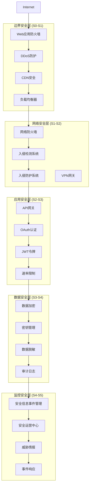

# 太上老君AI平台 - 网络安全

## 概述

太上老君AI平台采用多层次网络安全架构，基于S×C×T三轴理论设计，实现从网络边界到应用层的全方位安全防护，确保硅基生命体系的安全运行。

## 网络安全架构



## 网络防火墙配置

### 1. iptables规则配置

```bash
#!/bin/bash
# firewall-rules.sh

# 清空现有规则
iptables -F
iptables -X
iptables -t nat -F
iptables -t nat -X
iptables -t mangle -F
iptables -t mangle -X

# 设置默认策略
iptables -P INPUT DROP
iptables -P FORWARD DROP
iptables -P OUTPUT ACCEPT

# 允许本地回环
iptables -A INPUT -i lo -j ACCEPT
iptables -A OUTPUT -o lo -j ACCEPT

# 允许已建立的连接
iptables -A INPUT -m state --state ESTABLISHED,RELATED -j ACCEPT

# SSH访问（限制IP范围）
iptables -A INPUT -p tcp --dport 22 -s 10.0.0.0/8 -j ACCEPT
iptables -A INPUT -p tcp --dport 22 -s 172.16.0.0/12 -j ACCEPT
iptables -A INPUT -p tcp --dport 22 -s 192.168.0.0/16 -j ACCEPT

# HTTP/HTTPS访问
iptables -A INPUT -p tcp --dport 80 -j ACCEPT
iptables -A INPUT -p tcp --dport 443 -j ACCEPT

# API网关端口
iptables -A INPUT -p tcp --dport 8080 -s 10.0.0.0/8 -j ACCEPT

# 数据库端口（仅内网访问）
iptables -A INPUT -p tcp --dport 5432 -s 10.0.1.0/24 -j ACCEPT  # PostgreSQL
iptables -A INPUT -p tcp --dport 27017 -s 10.0.1.0/24 -j ACCEPT # MongoDB
iptables -A INPUT -p tcp --dport 7687 -s 10.0.1.0/24 -j ACCEPT  # Neo4j
iptables -A INPUT -p tcp --dport 6379 -s 10.0.1.0/24 -j ACCEPT  # Redis

# 监控端口
iptables -A INPUT -p tcp --dport 9090 -s 10.0.2.0/24 -j ACCEPT  # Prometheus
iptables -A INPUT -p tcp --dport 3000 -s 10.0.2.0/24 -j ACCEPT  # Grafana

# 防止端口扫描
iptables -A INPUT -p tcp --tcp-flags ALL NONE -j DROP
iptables -A INPUT -p tcp --tcp-flags ALL ALL -j DROP
iptables -A INPUT -p tcp --tcp-flags ALL FIN,URG,PSH -j DROP
iptables -A INPUT -p tcp --tcp-flags ALL SYN,RST,ACK,FIN,URG -j DROP

# 防止SYN洪水攻击
iptables -A INPUT -p tcp --syn -m limit --limit 1/s --limit-burst 3 -j ACCEPT
iptables -A INPUT -p tcp --syn -j DROP

# 防止ping洪水攻击
iptables -A INPUT -p icmp --icmp-type echo-request -m limit --limit 1/s -j ACCEPT
iptables -A INPUT -p icmp --icmp-type echo-request -j DROP

# 记录被丢弃的包
iptables -A INPUT -j LOG --log-prefix "IPTABLES-DROPPED: " --log-level 4
iptables -A INPUT -j DROP

# 保存规则
iptables-save > /etc/iptables/rules.v4

echo "防火墙规则配置完成"
```

### 2. UFW配置（Ubuntu）

```bash
#!/bin/bash
# ufw-setup.sh

# 重置UFW
ufw --force reset

# 设置默认策略
ufw default deny incoming
ufw default allow outgoing

# SSH访问
ufw allow from 10.0.0.0/8 to any port 22
ufw allow from 172.16.0.0/12 to any port 22
ufw allow from 192.168.0.0/16 to any port 22

# HTTP/HTTPS
ufw allow 80/tcp
ufw allow 443/tcp

# API网关
ufw allow from 10.0.0.0/8 to any port 8080

# 数据库端口
ufw allow from 10.0.1.0/24 to any port 5432
ufw allow from 10.0.1.0/24 to any port 27017
ufw allow from 10.0.1.0/24 to any port 7687
ufw allow from 10.0.1.0/24 to any port 6379

# 监控端口
ufw allow from 10.0.2.0/24 to any port 9090
ufw allow from 10.0.2.0/24 to any port 3000

# 启用UFW
ufw --force enable

# 显示状态
ufw status verbose

echo "UFW防火墙配置完成"
```

## WAF配置

### 1. Nginx ModSecurity配置

```nginx
# nginx-modsecurity.conf
load_module modules/ngx_http_modsecurity_module.so;

http {
    # ModSecurity配置
    modsecurity on;
    modsecurity_rules_file /etc/nginx/modsec/main.conf;
    
    # 日志格式
    log_format security '$remote_addr - $remote_user [$time_local] '
                       '"$request" $status $body_bytes_sent '
                       '"$http_referer" "$http_user_agent" '
                       '$request_time $upstream_response_time '
                       '$modsec_transaction_id';
    
    # 限制请求大小
    client_max_body_size 10M;
    client_body_buffer_size 128k;
    client_header_buffer_size 1k;
    large_client_header_buffers 4 4k;
    
    # 超时设置
    client_body_timeout 12;
    client_header_timeout 12;
    keepalive_timeout 15;
    send_timeout 10;
    
    # 隐藏版本信息
    server_tokens off;
    
    # 安全头
    add_header X-Frame-Options "SAMEORIGIN" always;
    add_header X-XSS-Protection "1; mode=block" always;
    add_header X-Content-Type-Options "nosniff" always;
    add_header Referrer-Policy "no-referrer-when-downgrade" always;
    add_header Content-Security-Policy "default-src 'self' http: https: data: blob: 'unsafe-inline'" always;
    add_header Strict-Transport-Security "max-age=31536000; includeSubDomains" always;
    
    # 速率限制
    limit_req_zone $binary_remote_addr zone=api:10m rate=10r/s;
    limit_req_zone $binary_remote_addr zone=login:10m rate=1r/s;
    
    server {
        listen 443 ssl http2;
        server_name api.taishanglaojun.com;
        
        # SSL配置
        ssl_certificate /etc/ssl/certs/taishanglaojun.crt;
        ssl_certificate_key /etc/ssl/private/taishanglaojun.key;
        ssl_protocols TLSv1.2 TLSv1.3;
        ssl_ciphers ECDHE-RSA-AES256-GCM-SHA512:DHE-RSA-AES256-GCM-SHA512:ECDHE-RSA-AES256-GCM-SHA384:DHE-RSA-AES256-GCM-SHA384;
        ssl_prefer_server_ciphers off;
        ssl_session_cache shared:SSL:10m;
        ssl_session_timeout 10m;
        
        # 访问日志
        access_log /var/log/nginx/security.log security;
        error_log /var/log/nginx/error.log;
        
        # API路由
        location /api/ {
            limit_req zone=api burst=20 nodelay;
            
            # 代理设置
            proxy_pass http://api-backend;
            proxy_set_header Host $host;
            proxy_set_header X-Real-IP $remote_addr;
            proxy_set_header X-Forwarded-For $proxy_add_x_forwarded_for;
            proxy_set_header X-Forwarded-Proto $scheme;
            
            # 超时设置
            proxy_connect_timeout 30s;
            proxy_send_timeout 30s;
            proxy_read_timeout 30s;
        }
        
        # 登录接口
        location /api/auth/login {
            limit_req zone=login burst=5 nodelay;
            
            proxy_pass http://auth-backend;
            proxy_set_header Host $host;
            proxy_set_header X-Real-IP $remote_addr;
            proxy_set_header X-Forwarded-For $proxy_add_x_forwarded_for;
            proxy_set_header X-Forwarded-Proto $scheme;
        }
        
        # 静态文件
        location /static/ {
            alias /var/www/static/;
            expires 1y;
            add_header Cache-Control "public, immutable";
        }
        
        # 健康检查
        location /health {
            access_log off;
            return 200 "healthy\n";
            add_header Content-Type text/plain;
        }
    }
}
```

### 2. ModSecurity规则配置

```apache
# /etc/nginx/modsec/main.conf
Include /etc/nginx/modsec/modsecurity.conf
Include /opt/owasp-modsecurity-crs/crs-setup.conf
Include /opt/owasp-modsecurity-crs/rules/*.conf

# 自定义规则
SecRule REQUEST_HEADERS:User-Agent "@contains bot" \
    "id:1001,\
    phase:1,\
    block,\
    msg:'Bot detected',\
    logdata:'User-Agent: %{REQUEST_HEADERS.User-Agent}'"

# SQL注入防护
SecRule ARGS "@detectSQLi" \
    "id:1002,\
    phase:2,\
    block,\
    msg:'SQL Injection Attack Detected',\
    logdata:'Matched Data: %{MATCHED_VAR} found within %{MATCHED_VAR_NAME}'"

# XSS防护
SecRule ARGS "@detectXSS" \
    "id:1003,\
    phase:2,\
    block,\
    msg:'XSS Attack Detected',\
    logdata:'Matched Data: %{MATCHED_VAR} found within %{MATCHED_VAR_NAME}'"

# 文件上传限制
SecRule FILES_TMPNAMES "@inspectFile /opt/modsecurity/bin/runav.pl" \
    "id:1004,\
    phase:2,\
    block,\
    msg:'Malware detected in uploaded file'"

# IP白名单
SecRule REMOTE_ADDR "!@ipMatch 10.0.0.0/8,172.16.0.0/12,192.168.0.0/16" \
    "id:1005,\
    phase:1,\
    pass,\
    setvar:'tx.suspicious_ip=1'"

# 异常评分
SecRule TX:ANOMALY_SCORE "@gt 5" \
    "id:1006,\
    phase:5,\
    deny,\
    msg:'Anomaly Score Exceeded (Total Score: %{TX.ANOMALY_SCORE})',\
    tag:'POLICY/SIZE_LIMIT'"
```

## 入侵检测系统

### 1. Suricata配置

```yaml
# suricata.yaml
vars:
  address-groups:
    HOME_NET: "[10.0.0.0/8,172.16.0.0/12,192.168.0.0/16]"
    EXTERNAL_NET: "!$HOME_NET"
    HTTP_SERVERS: "$HOME_NET"
    SMTP_SERVERS: "$HOME_NET"
    SQL_SERVERS: "$HOME_NET"
    DNS_SERVERS: "$HOME_NET"
    TELNET_SERVERS: "$HOME_NET"
    AIM_SERVERS: "$EXTERNAL_NET"
    DC_SERVERS: "$HOME_NET"
    DNP3_SERVER: "$HOME_NET"
    DNP3_CLIENT: "$HOME_NET"
    MODBUS_CLIENT: "$HOME_NET"
    MODBUS_SERVER: "$HOME_NET"
    ENIP_CLIENT: "$HOME_NET"
    ENIP_SERVER: "$HOME_NET"

  port-groups:
    HTTP_PORTS: "80"
    SHELLCODE_PORTS: "!80"
    ORACLE_PORTS: 1521
    SSH_PORTS: 22
    DNP3_PORTS: 20000
    MODBUS_PORTS: 502
    FILE_DATA_PORTS: "[$HTTP_PORTS,110,143]"
    FTP_PORTS: 21
    GENEVE_PORTS: 6081
    VXLAN_PORTS: 4789
    TEREDO_PORTS: 3544

default-log-dir: /var/log/suricata/

stats:
  enabled: yes
  interval: 8

outputs:
  - fast:
      enabled: yes
      filename: fast.log
      append: yes

  - eve-log:
      enabled: yes
      filetype: regular
      filename: eve.json
      types:
        - alert:
            payload: yes
            payload-buffer-size: 4kb
            payload-printable: yes
            packet: yes
            metadata: yes
            http-body: yes
            http-body-printable: yes
            tagged-packets: yes
        - http:
            extended: yes
        - dns:
            query: yes
            answer: yes
        - tls:
            extended: yes
        - files:
            force-magic: no
        - smtp:
        - ssh
        - stats:
            totals: yes
            threads: no
            deltas: no
        - flow

logging:
  default-log-level: notice
  default-output-filter:
  outputs:
  - console:
      enabled: yes
  - file:
      enabled: yes
      level: info
      filename: /var/log/suricata/suricata.log
  - syslog:
      enabled: no
      facility: local5
      format: "[%i] <%d> -- "

af-packet:
  - interface: eth0
    cluster-id: 99
    cluster-type: cluster_flow
    defrag: yes
  - interface: eth1
    cluster-id: 98
    cluster-type: cluster_flow
    defrag: yes

pcap:
  - interface: eth0
  - interface: eth1

pcap-file:
  checksum-checks: auto

app-layer:
  protocols:
    tls:
      enabled: yes
      detection-ports:
        dp: 443
    http:
      enabled: yes
      libhtp:
        default-config:
          personality: IDS
          request-body-limit: 100kb
          response-body-limit: 100kb
          request-body-minimal-inspect-size: 32kb
          request-body-inspect-window: 4kb
          response-body-minimal-inspect-size: 40kb
          response-body-inspect-window: 16kb
          response-body-decompress-layer-limit: 2
          http-body-inline: auto
          swf-decompression:
            enabled: yes
            type: both
            compress-depth: 100kb
            decompress-depth: 100kb
          double-decode-path: no
          double-decode-query: no

asn1-max-frames: 256

run-as:
  user: suricata
  group: suricata

coredump:
  max-dump: unlimited

host-mode: auto

unix-command:
  enabled: auto

legacy:
  uricontent: enabled

engine-analysis:
  rules-fast-pattern: yes
  rules: yes

pcre:
  match-limit: 3500
  match-limit-recursion: 1500

host-os-policy:
  windows: [0.0.0.0/0]
  bsd: []
  bsd-right: []
  old-linux: []
  linux: []
  old-solaris: []
  solaris: []
  hpux10: []
  hpux11: []
  irix: []
  macos: []
  vista: []
  windows2k3: []

defrag:
  memcap: 32mb
  hash-size: 65536
  trackers: 65535
  max-frags: 65535
  prealloc: yes
  timeout: 60

flow:
  memcap: 128mb
  hash-size: 65536
  prealloc: 10000
  emergency-recovery: 30
  managers: 1
  recyclers: 1

vlan:
  use-for-tracking: true

flow-timeouts:
  default:
    new: 30
    established: 300
    closed: 0
    bypassed: 100
    emergency-new: 10
    emergency-established: 100
    emergency-closed: 0
    emergency-bypassed: 50
  tcp:
    new: 60
    established: 600
    closed: 60
    bypassed: 100
    emergency-new: 5
    emergency-established: 100
    emergency-closed: 10
    emergency-bypassed: 50
  udp:
    new: 30
    established: 300
    bypassed: 100
    emergency-new: 10
    emergency-established: 100
    emergency-bypassed: 50
  icmp:
    new: 30
    established: 300
    bypassed: 100
    emergency-new: 10
    emergency-established: 100
    emergency-bypassed: 50

stream:
  memcap: 64mb
  checksum-validation: yes
  inline: auto
  reassembly:
    memcap: 256mb
    depth: 1mb
    toserver-chunk-size: 2560
    toclient-chunk-size: 2560
    randomize-chunk-size: yes

host:
  hash-size: 4096
  prealloc: 1000
  memcap: 32mb

decoder:
  teredo:
    enabled: true
    ports:
      dp: $TEREDO_PORTS
  vxlan:
    enabled: true
    ports:
      dp: $VXLAN_PORTS
  geneve:
    enabled: true
    ports:
      dp: $GENEVE_PORTS

detect:
  profile: medium
  custom-values:
    toclient-groups: 3
    toserver-groups: 25
  sgh-mpm-context: auto
  inspection-recursion-limit: 3000
  prefilter:
    default: mpm
  grouping:
  rules:

mpm-algo: auto

spm-algo: auto

threading:
  set-cpu-affinity: no
  cpu-affinity:
    - management-cpu-set:
        cpu: [ 0 ]
    - receive-cpu-set:
        cpu: [ 0 ]
    - worker-cpu-set:
        cpu: [ "all" ]
        mode: "exclusive"
        prio:
          low: [ 0 ]
          medium: [ "1-2" ]
          high: [ 3 ]
          default: "medium"

luajit:
  states: 128

profiling:
  rules:
    enabled: yes
    filename: rule_perf.log
    append: yes
    sort: avgticks
    limit: 100
    json: yes

  keywords:
    enabled: yes
    filename: keyword_perf.log
    append: yes

  prefilter:
    enabled: yes
    filename: prefilter_perf.log
    append: yes

  rulegroups:
    enabled: yes
    filename: rule_group_perf.log
    append: yes

  packets:
    enabled: yes
    filename: packet_stats.log
    append: yes
    csv:
      enabled: no
      filename: packet_stats.csv

  locks:
    enabled: no
    filename: lock_stats.log
    append: yes

  pcap-log:
    enabled: no
    filename: pcaplog_stats.log
    append: yes

nfq:

nflog:
  - group: 2
    buffer-size: 18432
  - group: default
    qthreshold: 1
    qtimeout: 100
    max-size: 20000

capture:

netmap:
 - interface: eth2
 - interface: eth3

pfring:
  - interface: eth0
    threads: auto
    cluster-id: 99
    cluster-type: cluster_flow
  - interface: eth1
    threads: auto
    cluster-id: 98
    cluster-type: cluster_flow

ipfw:

napatech:
    streams: ["0-3"]

mpipe:
  load-balance: packets
  iqueue-packets: 2048
  inputs:
  - interface: xgbe2
  - interface: xgbe3
  - interface: xgbe4
  stack:
    size128: 0
    size256: 9
    size512: 0
    size1024: 0
    size1664: 7
    size4096: 0
    size10386: 0
    size16384: 0

default-rule-path: /var/lib/suricata/rules

rule-files:
  - suricata.rules
  - /etc/suricata/rules/botcc.rules
  - /etc/suricata/rules/ciarmy.rules
  - /etc/suricata/rules/compromised.rules
  - /etc/suricata/rules/drop.rules
  - /etc/suricata/rules/dshield.rules
  - /etc/suricata/rules/emerging-activex.rules
  - /etc/suricata/rules/emerging-attack_response.rules
  - /etc/suricata/rules/emerging-chat.rules
  - /etc/suricata/rules/emerging-current_events.rules
  - /etc/suricata/rules/emerging-dns.rules
  - /etc/suricata/rules/emerging-dos.rules
  - /etc/suricata/rules/emerging-exploit.rules
  - /etc/suricata/rules/emerging-ftp.rules
  - /etc/suricata/rules/emerging-imap.rules
  - /etc/suricata/rules/emerging-inappropriate.rules
  - /etc/suricata/rules/emerging-malware.rules
  - /etc/suricata/rules/emerging-misc.rules
  - /etc/suricata/rules/emerging-mobile_malware.rules
  - /etc/suricata/rules/emerging-netbios.rules
  - /etc/suricata/rules/emerging-p2p.rules
  - /etc/suricata/rules/emerging-policy.rules
  - /etc/suricata/rules/emerging-pop3.rules
  - /etc/suricata/rules/emerging-rpc.rules
  - /etc/suricata/rules/emerging-scada.rules
  - /etc/suricata/rules/emerging-scan.rules
  - /etc/suricata/rules/emerging-shellcode.rules
  - /etc/suricata/rules/emerging-smtp.rules
  - /etc/suricata/rules/emerging-snmp.rules
  - /etc/suricata/rules/emerging-sql.rules
  - /etc/suricata/rules/emerging-telnet.rules
  - /etc/suricata/rules/emerging-tftp.rules
  - /etc/suricata/rules/emerging-trojan.rules
  - /etc/suricata/rules/emerging-user_agents.rules
  - /etc/suricata/rules/emerging-voip.rules
  - /etc/suricata/rules/emerging-web_client.rules
  - /etc/suricata/rules/emerging-web_server.rules
  - /etc/suricata/rules/emerging-worm.rules
  - /etc/suricata/rules/tor.rules
  - /etc/suricata/rules/decoder-events.rules
  - /etc/suricata/rules/stream-events.rules
  - /etc/suricata/rules/http-events.rules
  - /etc/suricata/rules/smtp-events.rules
  - /etc/suricata/rules/dns-events.rules
  - /etc/suricata/rules/tls-events.rules
  - /etc/suricata/rules/modbus-events.rules
  - /etc/suricata/rules/app-layer-events.rules
  - /etc/suricata/rules/dnp3-events.rules
  - /etc/suricata/rules/nfs-events.rules
  - /etc/suricata/rules/smb-events.rules
  - /etc/suricata/rules/tftp-events.rules
  - /etc/suricata/rules/krb5-events.rules
  - /etc/suricata/rules/ikev2-events.rules
  - /etc/suricata/rules/dcerpc-events.rules
  - /etc/suricata/rules/dhcp-events.rules
  - /etc/suricata/rules/ssh-events.rules
  - /etc/suricata/rules/files.rules
  - /etc/suricata/rules/file-events.rules

classification-file: /etc/suricata/classification.config
reference-config-file: /etc/suricata/reference.config
threshold-file: /etc/suricata/threshold.config
```

### 2. 自定义IDS规则

```bash
# custom-ids-rules.rules
# 太上老君AI平台自定义IDS规则

# API异常访问检测
alert http $EXTERNAL_NET any -> $HTTP_SERVERS $HTTP_PORTS (msg:"Suspicious API access pattern"; flow:established,to_server; content:"POST"; http_method; content:"/api/"; http_uri; pcre:"/\/api\/[^\/]+\/[^\/]+\/[^\/]+\/[^\/]+/"; threshold:type both, track by_src, count 10, seconds 60; classtype:web-application-attack; sid:2001001; rev:1;)

# SQL注入尝试
alert http $EXTERNAL_NET any -> $HTTP_SERVERS $HTTP_PORTS (msg:"SQL Injection attempt in AI platform"; flow:established,to_server; content:"POST"; http_method; pcre:"/(\%27)|(\')|(\-\-)|(\%23)|(#)/i"; classtype:web-application-attack; sid:2001002; rev:1;)

# 异常用户代理
alert http $EXTERNAL_NET any -> $HTTP_SERVERS $HTTP_PORTS (msg:"Suspicious User-Agent for AI platform"; flow:established,to_server; content:"User-Agent|3a 20|"; http_header; pcre:"/User-Agent\x3a\x20(sqlmap|nikto|nessus|openvas|nmap|masscan)/i"; classtype:web-application-attack; sid:2001003; rev:1;)

# 暴力破解检测
alert http $EXTERNAL_NET any -> $HTTP_SERVERS $HTTP_PORTS (msg:"Brute force login attempt"; flow:established,to_server; content:"POST"; http_method; content:"/api/auth/login"; http_uri; threshold:type both, track by_src, count 5, seconds 300; classtype:attempted-user; sid:2001004; rev:1;)

# 异常文件上传
alert http $EXTERNAL_NET any -> $HTTP_SERVERS $HTTP_PORTS (msg:"Suspicious file upload"; flow:established,to_server; content:"POST"; http_method; content:"Content-Type|3a 20|multipart/form-data"; http_header; pcre:"/filename=.*\.(php|jsp|asp|exe|sh|py|pl)/i"; classtype:web-application-attack; sid:2001005; rev:1;)

# 目录遍历攻击
alert http $EXTERNAL_NET any -> $HTTP_SERVERS $HTTP_PORTS (msg:"Directory traversal attempt"; flow:established,to_server; pcre:"/(\.\.)|(\.\.\/)|(\.\.\x5c)/i"; classtype:web-application-attack; sid:2001006; rev:1;)

# XSS攻击检测
alert http $EXTERNAL_NET any -> $HTTP_SERVERS $HTTP_PORTS (msg:"XSS attack attempt"; flow:established,to_server; pcre:"/<script|javascript:|vbscript:|onload=|onerror=/i"; classtype:web-application-attack; sid:2001007; rev:1;)

# 异常API调用频率
alert http $EXTERNAL_NET any -> $HTTP_SERVERS $HTTP_PORTS (msg:"High frequency API calls"; flow:established,to_server; content:"/api/"; http_uri; threshold:type both, track by_src, count 100, seconds 60; classtype:attempted-dos; sid:2001008; rev:1;)

# 敏感信息泄露检测
alert http $HTTP_SERVERS $HTTP_PORTS -> $EXTERNAL_NET any (msg:"Potential sensitive data leak"; flow:established,from_server; content:"200"; http_stat_code; pcre:"/(password|token|secret|key|api_key)/i"; classtype:policy-violation; sid:2001009; rev:1;)

# 异常数据库连接
alert tcp $EXTERNAL_NET any -> $SQL_SERVERS 5432 (msg:"External PostgreSQL connection attempt"; flow:to_server,established; classtype:attempted-recon; sid:2001010; rev:1;)

alert tcp $EXTERNAL_NET any -> $SQL_SERVERS 27017 (msg:"External MongoDB connection attempt"; flow:to_server,established; classtype:attempted-recon; sid:2001011; rev:1;)

alert tcp $EXTERNAL_NET any -> $SQL_SERVERS 7687 (msg:"External Neo4j connection attempt"; flow:to_server,established; classtype:attempted-recon; sid:2001012; rev:1;)

# 恶意IP检测
alert ip [192.168.1.100,10.0.0.50] any -> $HOME_NET any (msg:"Known malicious IP detected"; classtype:trojan-activity; sid:2001013; rev:1;)

# 异常端口扫描
alert tcp $EXTERNAL_NET any -> $HOME_NET [1:1023,3389,5432,27017,6379,7687] (msg:"Port scan detected"; flags:S,12; threshold:type both, track by_src, count 10, seconds 60; classtype:attempted-recon; sid:2001014; rev:1;)

# DDoS攻击检测
alert tcp $EXTERNAL_NET any -> $HTTP_SERVERS $HTTP_PORTS (msg:"Potential DDoS attack"; flags:S; threshold:type both, track by_src, count 50, seconds 10; classtype:attempted-dos; sid:2001015; rev:1;)

# 异常SSL/TLS连接
alert tls $EXTERNAL_NET any -> $HTTP_SERVERS 443 (msg:"Suspicious TLS connection"; tls.version:!1.2,!1.3; classtype:protocol-command-decode; sid:2001016; rev:1;)

# 数据外泄检测
alert http $HTTP_SERVERS $HTTP_PORTS -> $EXTERNAL_NET any (msg:"Large data transfer detected"; flow:established,from_server; dsize:>1000000; threshold:type limit, track by_src, count 1, seconds 300; classtype:policy-violation; sid:2001017; rev:1;)

# 异常时间访问
alert http $EXTERNAL_NET any -> $HTTP_SERVERS $HTTP_PORTS (msg:"Off-hours access detected"; flow:established,to_server; content:"/api/"; http_uri; detection_filter:track by_src, count 1, seconds 3600; classtype:policy-violation; sid:2001018; rev:1;)

# 管理接口访问
alert http $EXTERNAL_NET any -> $HTTP_SERVERS $HTTP_PORTS (msg:"Admin interface access from external"; flow:established,to_server; content:"/admin"; http_uri; classtype:web-application-attack; sid:2001019; rev:1;)

# 异常Cookie操作
alert http $EXTERNAL_NET any -> $HTTP_SERVERS $HTTP_PORTS (msg:"Cookie manipulation attempt"; flow:established,to_server; content:"Cookie|3a 20|"; http_header; pcre:"/Cookie\x3a\x20.*(\x27|\x22|<|>|script)/i"; classtype:web-application-attack; sid:2001020; rev:1;)
```

## VPN配置

### 1. OpenVPN服务器配置

```bash
# openvpn-server.conf
port 1194
proto udp
dev tun

ca ca.crt
cert server.crt
key server.key
dh dh2048.pem
tls-auth ta.key 0

server 10.8.0.0 255.255.255.0
ifconfig-pool-persist ipp.txt

# 推送路由
push "route 10.0.0.0 255.0.0.0"
push "route 172.16.0.0 255.240.0.0"
push "route 192.168.0.0 255.255.0.0"

# DNS设置
push "dhcp-option DNS 10.0.1.10"
push "dhcp-option DNS 8.8.8.8"

# 客户端配置
client-config-dir ccd
client-to-client
duplicate-cn

# 安全设置
keepalive 10 120
tls-version-min 1.2
cipher AES-256-GCM
auth SHA256
comp-lzo

# 用户权限
user nobody
group nogroup
persist-key
persist-tun

# 日志
status openvpn-status.log
log-append /var/log/openvpn.log
verb 3
mute 20

# 脚本
script-security 2
up /etc/openvpn/up.sh
down /etc/openvpn/down.sh
client-connect /etc/openvpn/client-connect.sh
client-disconnect /etc/openvpn/client-disconnect.sh

# 最大客户端数
max-clients 100

# CRL检查
crl-verify crl.pem
```

### 2. WireGuard配置

```ini
# /etc/wireguard/wg0.conf
[Interface]
PrivateKey = SERVER_PRIVATE_KEY
Address = 10.9.0.1/24
ListenPort = 51820
PostUp = iptables -A FORWARD -i %i -j ACCEPT; iptables -A FORWARD -o %i -j ACCEPT; iptables -t nat -A POSTROUTING -o eth0 -j MASQUERADE
PostDown = iptables -D FORWARD -i %i -j ACCEPT; iptables -D FORWARD -o %i -j ACCEPT; iptables -t nat -D POSTROUTING -o eth0 -j MASQUERADE

# 管理员客户端
[Peer]
PublicKey = ADMIN_PUBLIC_KEY
AllowedIPs = 10.9.0.2/32

# 开发者客户端
[Peer]
PublicKey = DEV_PUBLIC_KEY
AllowedIPs = 10.9.0.3/32

# 运维客户端
[Peer]
PublicKey = OPS_PUBLIC_KEY
AllowedIPs = 10.9.0.4/32
```

## API安全

### 1. API网关安全配置

```go
// api-gateway-security.go
package security

import (
    "context"
    "crypto/hmac"
    "crypto/sha256"
    "encoding/hex"
    "fmt"
    "net/http"
    "strconv"
    "strings"
    "time"
    
    "github.com/gin-gonic/gin"
    "github.com/golang-jwt/jwt/v4"
    "golang.org/x/time/rate"
)

type SecurityMiddleware struct {
    jwtSecret     []byte
    rateLimiters  map[string]*rate.Limiter
    apiKeys       map[string]string
    trustedIPs    []string
}

// JWT认证中间件
func (s *SecurityMiddleware) JWTAuth() gin.HandlerFunc {
    return func(c *gin.Context) {
        authHeader := c.GetHeader("Authorization")
        if authHeader == "" {
            c.JSON(http.StatusUnauthorized, gin.H{"error": "Authorization header required"})
            c.Abort()
            return
        }
        
        tokenString := strings.TrimPrefix(authHeader, "Bearer ")
        if tokenString == authHeader {
            c.JSON(http.StatusUnauthorized, gin.H{"error": "Bearer token required"})
            c.Abort()
            return
        }
        
        token, err := jwt.Parse(tokenString, func(token *jwt.Token) (interface{}, error) {
            if _, ok := token.Method.(*jwt.SigningMethodHMAC); !ok {
                return nil, fmt.Errorf("unexpected signing method: %v", token.Header["alg"])
            }
            return s.jwtSecret, nil
        })
        
        if err != nil || !token.Valid {
            c.JSON(http.StatusUnauthorized, gin.H{"error": "Invalid token"})
            c.Abort()
            return
        }
        
        if claims, ok := token.Claims.(jwt.MapClaims); ok {
            c.Set("user_id", claims["user_id"])
            c.Set("silicon_level", claims["silicon_level"])
            c.Set("permissions", claims["permissions"])
        }
        
        c.Next()
    }
}

// API密钥认证中间件
func (s *SecurityMiddleware) APIKeyAuth() gin.HandlerFunc {
    return func(c *gin.Context) {
        apiKey := c.GetHeader("X-API-Key")
        if apiKey == "" {
            c.JSON(http.StatusUnauthorized, gin.H{"error": "API key required"})
            c.Abort()
            return
        }
        
        if clientID, exists := s.apiKeys[apiKey]; exists {
            c.Set("client_id", clientID)
            c.Next()
        } else {
            c.JSON(http.StatusUnauthorized, gin.H{"error": "Invalid API key"})
            c.Abort()
        }
    }
}

// 速率限制中间件
func (s *SecurityMiddleware) RateLimit(requestsPerSecond int) gin.HandlerFunc {
    return func(c *gin.Context) {
        clientIP := c.ClientIP()
        
        limiter, exists := s.rateLimiters[clientIP]
        if !exists {
            limiter = rate.NewLimiter(rate.Limit(requestsPerSecond), requestsPerSecond*2)
            s.rateLimiters[clientIP] = limiter
        }
        
        if !limiter.Allow() {
            c.JSON(http.StatusTooManyRequests, gin.H{
                "error": "Rate limit exceeded",
                "retry_after": "60",
            })
            c.Abort()
            return
        }
        
        c.Next()
    }
}

// IP白名单中间件
func (s *SecurityMiddleware) IPWhitelist() gin.HandlerFunc {
    return func(c *gin.Context) {
        clientIP := c.ClientIP()
        
        for _, trustedIP := range s.trustedIPs {
            if clientIP == trustedIP || strings.HasPrefix(clientIP, trustedIP) {
                c.Next()
                return
            }
        }
        
        c.JSON(http.StatusForbidden, gin.H{"error": "IP not allowed"})
        c.Abort()
    }
}

// 请求签名验证中间件
func (s *SecurityMiddleware) SignatureAuth() gin.HandlerFunc {
    return func(c *gin.Context) {
        signature := c.GetHeader("X-Signature")
        timestamp := c.GetHeader("X-Timestamp")
        
        if signature == "" || timestamp == "" {
            c.JSON(http.StatusUnauthorized, gin.H{"error": "Signature and timestamp required"})
            c.Abort()
            return
        }
        
        // 验证时间戳（5分钟内有效）
        ts, err := strconv.ParseInt(timestamp, 10, 64)
        if err != nil || time.Now().Unix()-ts > 300 {
            c.JSON(http.StatusUnauthorized, gin.H{"error": "Invalid or expired timestamp"})
            c.Abort()
            return
        }
        
        // 获取请求体
        body, _ := c.GetRawData()
        
        // 计算签名
        message := fmt.Sprintf("%s%s%s", c.Request.Method, c.Request.URL.Path, string(body))
        expectedSignature := s.calculateSignature(message, timestamp)
        
        if !hmac.Equal([]byte(signature), []byte(expectedSignature)) {
            c.JSON(http.StatusUnauthorized, gin.H{"error": "Invalid signature"})
            c.Abort()
            return
        }
        
        c.Next()
    }
}

// 计算HMAC签名
func (s *SecurityMiddleware) calculateSignature(message, timestamp string) string {
    h := hmac.New(sha256.New, s.jwtSecret)
    h.Write([]byte(message + timestamp))
    return hex.EncodeToString(h.Sum(nil))
}

// CORS中间件
func (s *SecurityMiddleware) CORS() gin.HandlerFunc {
    return func(c *gin.Context) {
        origin := c.GetHeader("Origin")
        
        // 允许的域名列表
        allowedOrigins := []string{
            "https://taishanglaojun.com",
            "https://app.taishanglaojun.com",
            "https://admin.taishanglaojun.com",
        }
        
        for _, allowedOrigin := range allowedOrigins {
            if origin == allowedOrigin {
                c.Header("Access-Control-Allow-Origin", origin)
                break
            }
        }
        
        c.Header("Access-Control-Allow-Methods", "GET, POST, PUT, DELETE, OPTIONS")
        c.Header("Access-Control-Allow-Headers", "Origin, Content-Type, Authorization, X-API-Key, X-Signature, X-Timestamp")
        c.Header("Access-Control-Allow-Credentials", "true")
        c.Header("Access-Control-Max-Age", "86400")
        
        if c.Request.Method == "OPTIONS" {
            c.AbortWithStatus(http.StatusNoContent)
            return
        }
        
        c.Next()
    }
}

// 安全头中间件
func (s *SecurityMiddleware) SecurityHeaders() gin.HandlerFunc {
    return func(c *gin.Context) {
        c.Header("X-Frame-Options", "DENY")
        c.Header("X-Content-Type-Options", "nosniff")
        c.Header("X-XSS-Protection", "1; mode=block")
        c.Header("Strict-Transport-Security", "max-age=31536000; includeSubDomains")
        c.Header("Content-Security-Policy", "default-src 'self'; script-src 'self' 'unsafe-inline'; style-src 'self' 'unsafe-inline'")
        c.Header("Referrer-Policy", "strict-origin-when-cross-origin")
        c.Header("Permissions-Policy", "geolocation=(), microphone=(), camera=()")
        
        c.Next()
    }
}

// 输入验证中间件
func (s *SecurityMiddleware) InputValidation() gin.HandlerFunc {
    return func(c *gin.Context) {
        // 检查请求大小
        if c.Request.ContentLength > 10*1024*1024 { // 10MB限制
            c.JSON(http.StatusRequestEntityTooLarge, gin.H{"error": "Request too large"})
            c.Abort()
            return
        }
        
        // 检查Content-Type
        contentType := c.GetHeader("Content-Type")
        if c.Request.Method == "POST" || c.Request.Method == "PUT" {
            if !strings.Contains(contentType, "application/json") && 
               !strings.Contains(contentType, "multipart/form-data") {
                c.JSON(http.StatusUnsupportedMediaType, gin.H{"error": "Unsupported content type"})
                c.Abort()
                return
            }
        }
        
        c.Next()
    }
}

// 硅基层级权限验证
func (s *SecurityMiddleware) SiliconLevelAuth(requiredLevel int) gin.HandlerFunc {
    return func(c *gin.Context) {
        userLevel, exists := c.Get("silicon_level")
        if !exists {
            c.JSON(http.StatusUnauthorized, gin.H{"error": "Silicon level not found"})
            c.Abort()
            return
        }
        
        level, ok := userLevel.(float64)
        if !ok || int(level) < requiredLevel {
            c.JSON(http.StatusForbidden, gin.H{
                "error": "Insufficient silicon level",
                "required": requiredLevel,
                "current": int(level),
            })
            c.Abort()
            return
        }
        
        c.Next()
    }
}
```

### 2. OAuth2.0配置

```go
// oauth2-config.go
package oauth

import (
    "context"
    "crypto/rand"
    "encoding/base64"
    "fmt"
    "net/http"
    "time"
    
    "github.com/gin-gonic/gin"
    "golang.org/x/oauth2"
    "golang.org/x/oauth2/google"
    "golang.org/x/oauth2/github"
)

type OAuth2Config struct {
    GoogleConfig *oauth2.Config
    GitHubConfig *oauth2.Config
    states       map[string]time.Time
}

func NewOAuth2Config() *OAuth2Config {
    return &OAuth2Config{
        GoogleConfig: &oauth2.Config{
            ClientID:     "your-google-client-id",
            ClientSecret: "your-google-client-secret",
            RedirectURL:  "https://api.taishanglaojun.com/auth/google/callback",
            Scopes:       []string{"openid", "profile", "email"},
            Endpoint:     google.Endpoint,
        },
        GitHubConfig: &oauth2.Config{
            ClientID:     "your-github-client-id",
            ClientSecret: "your-github-client-secret",
            RedirectURL:  "https://api.taishanglaojun.com/auth/github/callback",
            Scopes:       []string{"user:email"},
            Endpoint:     github.Endpoint,
        },
        states: make(map[string]time.Time),
    }
}

// 生成随机状态码
func (o *OAuth2Config) generateState() string {
    b := make([]byte, 32)
    rand.Read(b)
    state := base64.URLEncoding.EncodeToString(b)
    o.states[state] = time.Now().Add(10 * time.Minute)
    return state
}

// 验证状态码
func (o *OAuth2Config) validateState(state string) bool {
    expiry, exists := o.states[state]
    if !exists {
        return false
    }
    
    if time.Now().After(expiry) {
        delete(o.states, state)
        return false
    }
    
    delete(o.states, state)
    return true
}

// Google OAuth登录
func (o *OAuth2Config) GoogleLogin(c *gin.Context) {
    state := o.generateState()
    url := o.GoogleConfig.AuthCodeURL(state, oauth2.AccessTypeOffline)
    c.Redirect(http.StatusTemporaryRedirect, url)
}

// Google OAuth回调
func (o *OAuth2Config) GoogleCallback(c *gin.Context) {
    state := c.Query("state")
    if !o.validateState(state) {
        c.JSON(http.StatusBadRequest, gin.H{"error": "Invalid state"})
        return
    }
    
    code := c.Query("code")
    token, err := o.GoogleConfig.Exchange(context.Background(), code)
    if err != nil {
        c.JSON(http.StatusInternalServerError, gin.H{"error": "Failed to exchange token"})
        return
    }
    
    // 获取用户信息
    client := o.GoogleConfig.Client(context.Background(), token)
    resp, err := client.Get("https://www.googleapis.com/oauth2/v2/userinfo")
    if err != nil {
        c.JSON(http.StatusInternalServerError, gin.H{"error": "Failed to get user info"})
        return
    }
    defer resp.Body.Close()
    
    // 处理用户信息并创建JWT令牌
    // userInfo := parseUserInfo(resp.Body)
    // jwtToken := createJWTToken(userInfo)
    
    c.JSON(http.StatusOK, gin.H{
        "message": "Login successful",
        "token": "jwt-token-here",
    })
}

// GitHub OAuth登录
func (o *OAuth2Config) GitHubLogin(c *gin.Context) {
    state := o.generateState()
    url := o.GitHubConfig.AuthCodeURL(state)
    c.Redirect(http.StatusTemporaryRedirect, url)
}

// GitHub OAuth回调
func (o *OAuth2Config) GitHubCallback(c *gin.Context) {
    state := c.Query("state")
    if !o.validateState(state) {
        c.JSON(http.StatusBadRequest, gin.H{"error": "Invalid state"})
        return
    }
    
    code := c.Query("code")
    token, err := o.GitHubConfig.Exchange(context.Background(), code)
    if err != nil {
        c.JSON(http.StatusInternalServerError, gin.H{"error": "Failed to exchange token"})
        return
    }
    
    // 获取用户信息
    client := o.GitHubConfig.Client(context.Background(), token)
    resp, err := client.Get("https://api.github.com/user")
    if err != nil {
        c.JSON(http.StatusInternalServerError, gin.H{"error": "Failed to get user info"})
        return
    }
    defer resp.Body.Close()
    
    // 处理用户信息并创建JWT令牌
    c.JSON(http.StatusOK, gin.H{
        "message": "Login successful",
        "token": "jwt-token-here",
    })
}

// 清理过期状态码
func (o *OAuth2Config) cleanupExpiredStates() {
    ticker := time.NewTicker(5 * time.Minute)
    go func() {
        for range ticker.C {
            now := time.Now()
            for state, expiry := range o.states {
                if now.After(expiry) {
                    delete(o.states, state)
                }
            }
        }
    }()
}
```

## 安全监控

### 1. 安全事件监控

```python
# security-monitor.py
import asyncio
import json
import logging
import re
from datetime import datetime, timedelta
from typing import Dict, List, Any
import aioredis
import asyncpg
from elasticsearch import AsyncElasticsearch

class SecurityMonitor:
    def __init__(self):
        self.logger = logging.getLogger(__name__)
        self.redis = None
        self.postgres = None
        self.elasticsearch = None
        
        # 威胁检测规则
        self.threat_patterns = {
            'sql_injection': [
                r"(\%27)|(\')|(\-\-)|(\%23)|(#)",
                r"((\%3D)|(=))[^\n]*((\%27)|(\')|(\-\-)|(\%23)|(#))",
                r"w*((\%27)|(\'))((\%6F)|o|(\%4F))((\%72)|r|(\%52))"
            ],
            'xss': [
                r"<script[^>]*>.*?</script>",
                r"javascript:",
                r"vbscript:",
                r"onload\s*=",
                r"onerror\s*="
            ],
            'path_traversal': [
                r"(\.\.)|(\.\.\/)|(\.\.\x5c)",
                r"(\%2e\%2e\%2f)|(\%2e\%2e\/)|(\%2e\%2e\x5c)"
            ],
            'command_injection': [
                r"(\||;|&|\$\(|\`)",
                r"(nc|netcat|wget|curl)\s",
                r"(rm|del|format)\s"
            ]
        }
        
        # 异常行为阈值
        self.thresholds = {
            'login_attempts': 5,
            'api_calls_per_minute': 100,
            'failed_requests_per_minute': 20,
            'large_response_size': 10 * 1024 * 1024,  # 10MB
            'unusual_hours': (22, 6)  # 22:00 - 06:00
        }
    
    async def initialize(self):
        """初始化连接"""
        self.redis = await aioredis.from_url("redis://redis:6379")
        self.postgres = await asyncpg.connect(
            host="postgres",
            database="taishang_security",
            user="security_user",
            password="secure_password"
        )
        self.elasticsearch = AsyncElasticsearch([{"host": "elasticsearch", "port": 9200}])
    
    async def analyze_request(self, request_data: Dict[str, Any]) -> Dict[str, Any]:
        """分析HTTP请求"""
        threats = []
        risk_score = 0
        
        # 检测威胁模式
        for threat_type, patterns in self.threat_patterns.items():
            for pattern in patterns:
                if re.search(pattern, request_data.get('url', ''), re.IGNORECASE) or \
                   re.search(pattern, request_data.get('body', ''), re.IGNORECASE):
                    threats.append(threat_type)
                    risk_score += 10
                    break
        
        # 检测异常行为
        client_ip = request_data.get('client_ip')
        user_agent = request_data.get('user_agent', '')
        
        # 检查请求频率
        request_count = await self.get_request_count(client_ip)
        if request_count > self.thresholds['api_calls_per_minute']:
            threats.append('high_frequency_requests')
            risk_score += 15
        
        # 检查失败请求频率
        if request_data.get('status_code', 200) >= 400:
            failed_count = await self.get_failed_request_count(client_ip)
            if failed_count > self.thresholds['failed_requests_per_minute']:
                threats.append('high_failure_rate')
                risk_score += 20
        
        # 检查异常User-Agent
        if self.is_suspicious_user_agent(user_agent):
            threats.append('suspicious_user_agent')
            risk_score += 5
        
        # 检查访问时间
        if self.is_unusual_hour():
            threats.append('unusual_access_time')
            risk_score += 3
        
        return {
            'timestamp': datetime.now(),
            'client_ip': client_ip,
            'threats': threats,
            'risk_score': risk_score,
            'request_data': request_data
        }
    
    async def get_request_count(self, client_ip: str) -> int:
        """获取客户端请求计数"""
        key = f"request_count:{client_ip}"
        count = await self.redis.get(key)
        if count is None:
            await self.redis.setex(key, 60, 1)
            return 1
        else:
            await self.redis.incr(key)
            return int(count) + 1
    
    async def get_failed_request_count(self, client_ip: str) -> int:
        """获取客户端失败请求计数"""
        key = f"failed_count:{client_ip}"
        count = await self.redis.get(key)
        if count is None:
            await self.redis.setex(key, 60, 1)
            return 1
        else:
            await self.redis.incr(key)
            return int(count) + 1
    
    def is_suspicious_user_agent(self, user_agent: str) -> bool:
        """检查可疑的User-Agent"""
        suspicious_patterns = [
            r'sqlmap', r'nikto', r'nessus', r'openvas',
            r'nmap', r'masscan', r'dirb', r'gobuster',
            r'python-requests', r'curl', r'wget'
        ]
        
        for pattern in suspicious_patterns:
            if re.search(pattern, user_agent, re.IGNORECASE):
                return True
        return False
    
    def is_unusual_hour(self) -> bool:
        """检查是否为异常访问时间"""
        current_hour = datetime.now().hour
        start_hour, end_hour = self.thresholds['unusual_hours']
        
        if start_hour > end_hour:  # 跨午夜
            return current_hour >= start_hour or current_hour <= end_hour
        else:
            return start_hour <= current_hour <= end_hour
    
    async def detect_brute_force(self, user_id: str, success: bool) -> bool:
        """检测暴力破解攻击"""
        key = f"login_attempts:{user_id}"
        
        if success:
            # 登录成功，清除计数
            await self.redis.delete(key)
            return False
        
        # 登录失败，增加计数
        attempts = await self.redis.get(key)
        if attempts is None:
            await self.redis.setex(key, 300, 1)  # 5分钟过期
            return False
        else:
            new_attempts = int(attempts) + 1
            await self.redis.setex(key, 300, new_attempts)
            
            if new_attempts >= self.thresholds['login_attempts']:
                await self.create_security_alert({
                    'type': 'brute_force_attack',
                    'user_id': user_id,
                    'attempts': new_attempts,
                    'timestamp': datetime.now()
                })
                return True
        
        return False
    
    async def create_security_alert(self, alert_data: Dict[str, Any]):
        """创建安全告警"""
        # 存储到PostgreSQL
        await self.postgres.execute("""
            INSERT INTO security_alerts (type, data, created_at, status)
            VALUES ($1, $2, $3, 'open')
        """, alert_data['type'], json.dumps(alert_data), datetime.now())
        
        # 存储到Elasticsearch
        await self.elasticsearch.index(
            index="security-alerts",
            body=alert_data
        )
        
        # 发送实时通知
        await self.send_alert_notification(alert_data)
    
    async def send_alert_notification(self, alert_data: Dict[str, Any]):
        """发送告警通知"""
        # 这里可以集成邮件、短信、Slack等通知方式
        self.logger.warning(f"Security Alert: {alert_data}")
    
    async def analyze_traffic_patterns(self):
        """分析流量模式"""
        # 获取最近1小时的请求数据
        end_time = datetime.now()
        start_time = end_time - timedelta(hours=1)
        
        query = {
            "query": {
                "range": {
                    "timestamp": {
                        "gte": start_time.isoformat(),
                        "lte": end_time.isoformat()
                    }
                }
            },
            "aggs": {
                "requests_per_minute": {
                    "date_histogram": {
                        "field": "timestamp",
                        "interval": "1m"
                    }
                },
                "top_ips": {
                    "terms": {
                        "field": "client_ip",
                        "size": 10
                    }
                },
                "status_codes": {
                    "terms": {
                        "field": "status_code"
                    }
                }
            }
        }
        
        result = await self.elasticsearch.search(
            index="access-logs",
            body=query
        )
        
        # 分析结果并检测异常
        await self.detect_traffic_anomalies(result)
    
    async def detect_traffic_anomalies(self, traffic_data: Dict[str, Any]):
        """检测流量异常"""
        aggregations = traffic_data.get('aggregations', {})
        
        # 检测流量峰值
        requests_per_minute = aggregations.get('requests_per_minute', {}).get('buckets', [])
        if requests_per_minute:
            max_requests = max(bucket['doc_count'] for bucket in requests_per_minute)
            avg_requests = sum(bucket['doc_count'] for bucket in requests_per_minute) / len(requests_per_minute)
            
            if max_requests > avg_requests * 3:  # 超过平均值3倍
                await self.create_security_alert({
                    'type': 'traffic_spike',
                    'max_requests': max_requests,
                    'avg_requests': avg_requests,
                    'timestamp': datetime.now()
                })
        
        # 检测异常IP
        top_ips = aggregations.get('top_ips', {}).get('buckets', [])
        for ip_bucket in top_ips:
            if ip_bucket['doc_count'] > 1000:  # 单个IP超过1000次请求
                await self.create_security_alert({
                    'type': 'suspicious_ip_activity',
                    'client_ip': ip_bucket['key'],
                    'request_count': ip_bucket['doc_count'],
                    'timestamp': datetime.now()
                })

# 使用示例
async def main():
    monitor = SecurityMonitor()
    await monitor.initialize()
    
    # 模拟请求分析
    request_data = {
        'url': '/api/users?id=1\' OR 1=1--',
        'method': 'GET',
        'client_ip': '192.168.1.100',
        'user_agent': 'sqlmap/1.0',
        'status_code': 200,
        'body': ''
    }
    
    analysis_result = await monitor.analyze_request(request_data)
    print(f"威胁分析结果: {analysis_result}")
    
    # 定期分析流量模式
    while True:
        await monitor.analyze_traffic_patterns()
        await asyncio.sleep(300)  # 每5分钟分析一次

if __name__ == "__main__":
    logging.basicConfig(level=logging.INFO)
    asyncio.run(main())
```

## 6. 安全合规与审计

### 6.1 合规框架配置

```yaml
# compliance-config.yaml
apiVersion: v1
kind: ConfigMap
metadata:
  name: compliance-config
  namespace: security
data:
  gdpr.yaml: |
    gdpr:
      enabled: true
      data_retention_days: 365
      consent_tracking: true
      right_to_be_forgotten: true
      data_portability: true
      breach_notification_hours: 72
      
  iso27001.yaml: |
    iso27001:
      enabled: true
      risk_assessment_interval: 90
      security_controls:
        - access_control
        - cryptography
        - operations_security
        - communications_security
        - system_acquisition
        - supplier_relationships
        - incident_management
        - business_continuity
        
  pci_dss.yaml: |
    pci_dss:
      enabled: false  # 如果处理支付卡数据则启用
      requirements:
        - firewall_configuration
        - default_passwords
        - cardholder_data_protection
        - encrypted_transmission
        - antivirus_software
        - secure_systems
        - access_control
        - unique_ids
        - physical_access
        - network_monitoring
        - regular_testing
        - information_security_policy
```

### 6.2 审计日志系统

```go
// audit-logger.go
package audit

import (
    "context"
    "encoding/json"
    "time"
    
    "github.com/elastic/go-elasticsearch/v8"
    "github.com/sirupsen/logrus"
)

type AuditEvent struct {
    ID          string                 `json:"id"`
    Timestamp   time.Time             `json:"timestamp"`
    UserID      string                `json:"user_id"`
    Action      string                `json:"action"`
    Resource    string                `json:"resource"`
    Result      string                `json:"result"`
    IPAddress   string                `json:"ip_address"`
    UserAgent   string                `json:"user_agent"`
    Details     map[string]interface{} `json:"details"`
    Severity    string                `json:"severity"`
    Category    string                `json:"category"`
}

type AuditLogger struct {
    elasticsearch *elasticsearch.Client
    logger        *logrus.Logger
}

func NewAuditLogger(esClient *elasticsearch.Client) *AuditLogger {
    return &AuditLogger{
        elasticsearch: esClient,
        logger:        logrus.New(),
    }
}

func (al *AuditLogger) LogEvent(ctx context.Context, event AuditEvent) error {
    // 设置时间戳
    event.Timestamp = time.Now()
    
    // 生成事件ID
    if event.ID == "" {
        event.ID = generateEventID()
    }
    
    // 序列化事件
    eventJSON, err := json.Marshal(event)
    if err != nil {
        return err
    }
    
    // 存储到Elasticsearch
    _, err = al.elasticsearch.Index(
        "audit-logs",
        strings.NewReader(string(eventJSON)),
        al.elasticsearch.Index.WithDocumentID(event.ID),
        al.elasticsearch.Index.WithContext(ctx),
    )
    
    if err != nil {
        al.logger.WithError(err).Error("Failed to store audit event")
        return err
    }
    
    // 根据严重程度记录日志
    switch event.Severity {
    case "critical":
        al.logger.WithFields(logrus.Fields{
            "event_id": event.ID,
            "user_id":  event.UserID,
            "action":   event.Action,
        }).Error("Critical audit event")
    case "high":
        al.logger.WithFields(logrus.Fields{
            "event_id": event.ID,
            "user_id":  event.UserID,
            "action":   event.Action,
        }).Warn("High severity audit event")
    default:
        al.logger.WithFields(logrus.Fields{
            "event_id": event.ID,
            "user_id":  event.UserID,
            "action":   event.Action,
        }).Info("Audit event logged")
    }
    
    return nil
}

func (al *AuditLogger) LogUserAction(ctx context.Context, userID, action, resource string, details map[string]interface{}) error {
    event := AuditEvent{
        UserID:   userID,
        Action:   action,
        Resource: resource,
        Result:   "success",
        Details:  details,
        Severity: "info",
        Category: "user_action",
    }
    
    return al.LogEvent(ctx, event)
}

func (al *AuditLogger) LogSecurityEvent(ctx context.Context, userID, action string, severity string, details map[string]interface{}) error {
    event := AuditEvent{
        UserID:   userID,
        Action:   action,
        Resource: "security",
        Result:   "detected",
        Details:  details,
        Severity: severity,
        Category: "security",
    }
    
    return al.LogEvent(ctx, event)
}

func (al *AuditLogger) LogSystemEvent(ctx context.Context, action, resource string, details map[string]interface{}) error {
    event := AuditEvent{
        UserID:   "system",
        Action:   action,
        Resource: resource,
        Result:   "success",
        Details:  details,
        Severity: "info",
        Category: "system",
    }
    
    return al.LogEvent(ctx, event)
}

func generateEventID() string {
    return fmt.Sprintf("audit_%d_%s", time.Now().Unix(), generateRandomString(8))
}

func generateRandomString(length int) string {
    const charset = "abcdefghijklmnopqrstuvwxyzABCDEFGHIJKLMNOPQRSTUVWXYZ0123456789"
    b := make([]byte, length)
    for i := range b {
        b[i] = charset[rand.Intn(len(charset))]
    }
    return string(b)
}
```

### 6.3 安全策略管理

```yaml
# security-policies.yaml
apiVersion: v1
kind: ConfigMap
metadata:
  name: security-policies
  namespace: security
data:
  password-policy.yaml: |
    password_policy:
      min_length: 12
      require_uppercase: true
      require_lowercase: true
      require_numbers: true
      require_special_chars: true
      max_age_days: 90
      history_count: 12
      lockout_attempts: 5
      lockout_duration_minutes: 30
      
  access-policy.yaml: |
    access_policy:
      session_timeout_minutes: 30
      max_concurrent_sessions: 3
      require_mfa: true
      ip_whitelist_enabled: false
      geo_blocking_enabled: true
      allowed_countries:
        - CN
        - US
        - GB
        - DE
        - JP
        
  data-classification.yaml: |
    data_classification:
      levels:
        - name: "public"
          color: "green"
          retention_days: 365
          encryption_required: false
        - name: "internal"
          color: "yellow"
          retention_days: 2555  # 7 years
          encryption_required: true
        - name: "confidential"
          color: "orange"
          retention_days: 2555
          encryption_required: true
        - name: "restricted"
          color: "red"
          retention_days: 1825  # 5 years
          encryption_required: true
          access_approval_required: true
```

### 6.4 漏洞扫描与管理

```python
# vulnerability-scanner.py
import asyncio
import aiohttp
import json
import subprocess
from datetime import datetime
from typing import List, Dict, Any

class VulnerabilityScanner:
    def __init__(self):
        self.scan_results = []
        self.severity_levels = ['critical', 'high', 'medium', 'low', 'info']
        
    async def scan_web_application(self, target_url: str) -> Dict[str, Any]:
        """Web应用漏洞扫描"""
        scan_result = {
            'target': target_url,
            'scan_type': 'web_application',
            'timestamp': datetime.now().isoformat(),
            'vulnerabilities': []
        }
        
        # OWASP ZAP扫描
        zap_results = await self.run_zap_scan(target_url)
        scan_result['vulnerabilities'].extend(zap_results)
        
        # Nikto扫描
        nikto_results = await self.run_nikto_scan(target_url)
        scan_result['vulnerabilities'].extend(nikto_results)
        
        # 自定义安全检查
        custom_results = await self.run_custom_checks(target_url)
        scan_result['vulnerabilities'].extend(custom_results)
        
        return scan_result
    
    async def run_zap_scan(self, target_url: str) -> List[Dict[str, Any]]:
        """运行OWASP ZAP扫描"""
        try:
            # 启动ZAP代理
            zap_cmd = [
                'zap-baseline.py',
                '-t', target_url,
                '-J', f'/tmp/zap_report_{int(datetime.now().timestamp())}.json'
            ]
            
            process = await asyncio.create_subprocess_exec(
                *zap_cmd,
                stdout=asyncio.subprocess.PIPE,
                stderr=asyncio.subprocess.PIPE
            )
            
            stdout, stderr = await process.communicate()
            
            # 解析ZAP结果
            vulnerabilities = []
            if process.returncode == 0:
                # 解析JSON报告
                vulnerabilities = self.parse_zap_results(stdout.decode())
            
            return vulnerabilities
            
        except Exception as e:
            print(f"ZAP扫描失败: {e}")
            return []
    
    async def run_nikto_scan(self, target_url: str) -> List[Dict[str, Any]]:
        """运行Nikto扫描"""
        try:
            nikto_cmd = [
                'nikto',
                '-h', target_url,
                '-Format', 'json',
                '-output', f'/tmp/nikto_report_{int(datetime.now().timestamp())}.json'
            ]
            
            process = await asyncio.create_subprocess_exec(
                *nikto_cmd,
                stdout=asyncio.subprocess.PIPE,
                stderr=asyncio.subprocess.PIPE
            )
            
            stdout, stderr = await process.communicate()
            
            vulnerabilities = []
            if process.returncode == 0:
                vulnerabilities = self.parse_nikto_results(stdout.decode())
            
            return vulnerabilities
            
        except Exception as e:
            print(f"Nikto扫描失败: {e}")
            return []
    
    async def run_custom_checks(self, target_url: str) -> List[Dict[str, Any]]:
        """运行自定义安全检查"""
        vulnerabilities = []
        
        async with aiohttp.ClientSession() as session:
            # 检查安全头
            security_headers = await self.check_security_headers(session, target_url)
            vulnerabilities.extend(security_headers)
            
            # 检查SSL/TLS配置
            ssl_issues = await self.check_ssl_configuration(session, target_url)
            vulnerabilities.extend(ssl_issues)
            
            # 检查敏感信息泄露
            info_disclosure = await self.check_information_disclosure(session, target_url)
            vulnerabilities.extend(info_disclosure)
        
        return vulnerabilities
    
    async def check_security_headers(self, session: aiohttp.ClientSession, url: str) -> List[Dict[str, Any]]:
        """检查安全头"""
        vulnerabilities = []
        
        try:
            async with session.get(url) as response:
                headers = response.headers
                
                # 检查必要的安全头
                required_headers = {
                    'X-Content-Type-Options': 'nosniff',
                    'X-Frame-Options': ['DENY', 'SAMEORIGIN'],
                    'X-XSS-Protection': '1; mode=block',
                    'Strict-Transport-Security': None,
                    'Content-Security-Policy': None
                }
                
                for header, expected_value in required_headers.items():
                    if header not in headers:
                        vulnerabilities.append({
                            'title': f'Missing Security Header: {header}',
                            'severity': 'medium',
                            'description': f'The {header} security header is missing',
                            'recommendation': f'Add the {header} header to improve security'
                        })
                    elif expected_value and headers[header] not in expected_value:
                        vulnerabilities.append({
                            'title': f'Insecure {header} Header',
                            'severity': 'low',
                            'description': f'The {header} header has an insecure value: {headers[header]}',
                            'recommendation': f'Set {header} to a secure value'
                        })
        
        except Exception as e:
            print(f"安全头检查失败: {e}")
        
        return vulnerabilities
    
    async def check_ssl_configuration(self, session: aiohttp.ClientSession, url: str) -> List[Dict[str, Any]]:
        """检查SSL/TLS配置"""
        vulnerabilities = []
        
        if not url.startswith('https://'):
            vulnerabilities.append({
                'title': 'Unencrypted Connection',
                'severity': 'high',
                'description': 'The application does not use HTTPS',
                'recommendation': 'Implement HTTPS with a valid SSL certificate'
            })
        
        # 这里可以添加更多SSL/TLS检查
        # 例如证书有效性、加密强度等
        
        return vulnerabilities
    
    async def check_information_disclosure(self, session: aiohttp.ClientSession, url: str) -> List[Dict[str, Any]]:
        """检查信息泄露"""
        vulnerabilities = []
        
        # 检查常见的敏感文件
        sensitive_paths = [
            '/.env',
            '/config.json',
            '/admin',
            '/debug',
            '/test',
            '/.git/config',
            '/robots.txt'
        ]
        
        for path in sensitive_paths:
            try:
                test_url = url.rstrip('/') + path
                async with session.get(test_url) as response:
                    if response.status == 200:
                        vulnerabilities.append({
                            'title': f'Sensitive File Accessible: {path}',
                            'severity': 'medium',
                            'description': f'Sensitive file {path} is accessible',
                            'recommendation': f'Restrict access to {path} or remove it'
                        })
            except:
                pass
        
        return vulnerabilities
    
    def parse_zap_results(self, zap_output: str) -> List[Dict[str, Any]]:
        """解析ZAP扫描结果"""
        vulnerabilities = []
        try:
            # 这里需要根据实际的ZAP输出格式进行解析
            # 示例解析逻辑
            pass
        except Exception as e:
            print(f"ZAP结果解析失败: {e}")
        
        return vulnerabilities
    
    def parse_nikto_results(self, nikto_output: str) -> List[Dict[str, Any]]:
        """解析Nikto扫描结果"""
        vulnerabilities = []
        try:
            # 这里需要根据实际的Nikto输出格式进行解析
            # 示例解析逻辑
            pass
        except Exception as e:
            print(f"Nikto结果解析失败: {e}")
        
        return vulnerabilities
    
    async def generate_report(self, scan_results: List[Dict[str, Any]]) -> str:
        """生成漏洞扫描报告"""
        report = {
            'scan_summary': {
                'total_scans': len(scan_results),
                'scan_date': datetime.now().isoformat(),
                'total_vulnerabilities': sum(len(result['vulnerabilities']) for result in scan_results)
            },
            'vulnerability_summary': {},
            'detailed_results': scan_results
        }
        
        # 统计漏洞严重程度
        for severity in self.severity_levels:
            count = 0
            for result in scan_results:
                count += len([v for v in result['vulnerabilities'] if v.get('severity') == severity])
            report['vulnerability_summary'][severity] = count
        
        return json.dumps(report, indent=2, ensure_ascii=False)

# 使用示例
async def main():
    scanner = VulnerabilityScanner()
    
    # 扫描目标应用
    targets = [
        'https://api.taishanglaojun.com',
        'https://admin.taishanglaojun.com',
        'https://app.taishanglaojun.com'
    ]
    
    all_results = []
    for target in targets:
        print(f"扫描目标: {target}")
        result = await scanner.scan_web_application(target)
        all_results.append(result)
    
    # 生成报告
    report = await scanner.generate_report(all_results)
    
    # 保存报告
    with open(f'vulnerability_report_{datetime.now().strftime("%Y%m%d_%H%M%S")}.json', 'w', encoding='utf-8') as f:
        f.write(report)
    
    print("漏洞扫描完成，报告已生成")

if __name__ == "__main__":
    asyncio.run(main())
```

## 7. 应急响应与恢复

### 7.1 安全事件响应流程

```yaml
# incident-response-playbook.yaml
apiVersion: v1
kind: ConfigMap
metadata:
  name: incident-response-playbook
  namespace: security
data:
  playbook.yaml: |
    incident_response:
      phases:
        - name: "detection"
          duration_minutes: 15
          actions:
            - "确认安全事件"
            - "评估影响范围"
            - "启动应急响应团队"
            - "通知相关人员"
            
        - name: "containment"
          duration_minutes: 60
          actions:
            - "隔离受影响系统"
            - "阻止攻击传播"
            - "保护关键资产"
            - "收集初步证据"
            
        - name: "eradication"
          duration_minutes: 120
          actions:
            - "清除恶意软件"
            - "修复漏洞"
            - "更新安全策略"
            - "加强监控"
            
        - name: "recovery"
          duration_minutes: 240
          actions:
            - "恢复系统服务"
            - "验证系统安全性"
            - "监控异常活动"
            - "逐步恢复正常运营"
            
        - name: "lessons_learned"
          duration_minutes: 480
          actions:
            - "事件分析总结"
            - "更新应急预案"
            - "改进安全措施"
            - "培训团队成员"
      
      severity_levels:
        critical:
          response_time_minutes: 15
          escalation_level: "C-level"
          communication_channels:
            - "emergency_hotline"
            - "executive_team"
            - "security_team"
            - "legal_team"
            
        high:
          response_time_minutes: 30
          escalation_level: "Director"
          communication_channels:
            - "security_team"
            - "operations_team"
            - "management"
            
        medium:
          response_time_minutes: 60
          escalation_level: "Manager"
          communication_channels:
            - "security_team"
            - "operations_team"
            
        low:
          response_time_minutes: 240
          escalation_level: "Team Lead"
          communication_channels:
            - "security_team"
```

### 7.2 自动化响应脚本

```bash
#!/bin/bash
# incident-response.sh

set -euo pipefail

# 配置变量
INCIDENT_ID=""
SEVERITY=""
AFFECTED_SYSTEMS=""
RESPONSE_TEAM=""
LOG_FILE="/var/log/incident-response.log"

# 日志函数
log() {
    echo "[$(date '+%Y-%m-%d %H:%M:%S')] $1" | tee -a "$LOG_FILE"
}

# 发送通知
send_notification() {
    local message="$1"
    local channel="$2"
    
    case "$channel" in
        "slack")
            curl -X POST -H 'Content-type: application/json' \
                --data "{\"text\":\"$message\"}" \
                "$SLACK_WEBHOOK_URL"
            ;;
        "email")
            echo "$message" | mail -s "Security Incident Alert" "$SECURITY_EMAIL"
            ;;
        "sms")
            # 集成短信服务
            curl -X POST "$SMS_API_URL" \
                -d "message=$message" \
                -d "phone=$SECURITY_PHONE"
            ;;
    esac
}

# 隔离受影响系统
isolate_system() {
    local system_ip="$1"
    
    log "隔离系统: $system_ip"
    
    # 阻止网络访问
    iptables -A INPUT -s "$system_ip" -j DROP
    iptables -A OUTPUT -d "$system_ip" -j DROP
    
    # 停止相关服务
    if systemctl is-active --quiet docker; then
        docker ps --filter "label=system.ip=$system_ip" -q | xargs -r docker stop
    fi
    
    # 记录隔离操作
    log "系统 $system_ip 已被隔离"
}

# 收集证据
collect_evidence() {
    local evidence_dir="/tmp/incident-$INCIDENT_ID"
    mkdir -p "$evidence_dir"
    
    log "开始收集证据到: $evidence_dir"
    
    # 收集系统信息
    ps aux > "$evidence_dir/processes.txt"
    netstat -tulpn > "$evidence_dir/network_connections.txt"
    ss -tulpn > "$evidence_dir/socket_stats.txt"
    
    # 收集日志
    journalctl --since "1 hour ago" > "$evidence_dir/system_logs.txt"
    
    # 收集网络流量
    if command -v tcpdump >/dev/null; then
        timeout 300 tcpdump -i any -w "$evidence_dir/network_traffic.pcap" &
    fi
    
    # 收集内存转储（如果需要）
    if [[ "$SEVERITY" == "critical" ]]; then
        if command -v gcore >/dev/null; then
            for pid in $(pgrep -f "suspicious_process"); do
                gcore -o "$evidence_dir/memory_dump_$pid" "$pid"
            done
        fi
    fi
    
    # 创建证据包
    tar -czf "/tmp/evidence-$INCIDENT_ID.tar.gz" -C "/tmp" "incident-$INCIDENT_ID"
    
    log "证据收集完成: /tmp/evidence-$INCIDENT_ID.tar.gz"
}

# 恢复系统
restore_system() {
    local system_ip="$1"
    
    log "开始恢复系统: $system_ip"
    
    # 移除网络隔离
    iptables -D INPUT -s "$system_ip" -j DROP 2>/dev/null || true
    iptables -D OUTPUT -d "$system_ip" -j DROP 2>/dev/null || true
    
    # 重启服务
    if systemctl is-active --quiet docker; then
        docker ps -a --filter "label=system.ip=$system_ip" -q | xargs -r docker start
    fi
    
    # 验证系统状态
    if ping -c 3 "$system_ip" >/dev/null; then
        log "系统 $system_ip 网络连接正常"
    else
        log "警告: 系统 $system_ip 网络连接异常"
    fi
    
    log "系统 $system_ip 恢复完成"
}

# 主要响应流程
main() {
    case "${1:-}" in
        "detect")
            INCIDENT_ID="${2:-$(date +%Y%m%d_%H%M%S)}"
            SEVERITY="${3:-medium}"
            
            log "检测到安全事件: $INCIDENT_ID (严重程度: $SEVERITY)"
            send_notification "安全事件检测: $INCIDENT_ID" "slack"
            ;;
            
        "contain")
            INCIDENT_ID="${2:-}"
            AFFECTED_SYSTEMS="${3:-}"
            
            if [[ -z "$INCIDENT_ID" || -z "$AFFECTED_SYSTEMS" ]]; then
                echo "用法: $0 contain <incident_id> <affected_systems>"
                exit 1
            fi
            
            log "开始遏制事件: $INCIDENT_ID"
            
            IFS=',' read -ra SYSTEMS <<< "$AFFECTED_SYSTEMS"
            for system in "${SYSTEMS[@]}"; do
                isolate_system "$system"
            done
            
            collect_evidence
            ;;
            
        "recover")
            INCIDENT_ID="${2:-}"
            AFFECTED_SYSTEMS="${3:-}"
            
            if [[ -z "$INCIDENT_ID" || -z "$AFFECTED_SYSTEMS" ]]; then
                echo "用法: $0 recover <incident_id> <affected_systems>"
                exit 1
            fi
            
            log "开始恢复事件: $INCIDENT_ID"
            
            IFS=',' read -ra SYSTEMS <<< "$AFFECTED_SYSTEMS"
            for system in "${SYSTEMS[@]}"; do
                restore_system "$system"
            done
            
            send_notification "事件恢复完成: $INCIDENT_ID" "slack"
            ;;
            
        "status")
            INCIDENT_ID="${2:-}"
            
            if [[ -z "$INCIDENT_ID" ]]; then
                echo "用法: $0 status <incident_id>"
                exit 1
            fi
            
            # 显示事件状态
            grep "$INCIDENT_ID" "$LOG_FILE" | tail -20
            ;;
            
        *)
            echo "用法: $0 {detect|contain|recover|status} [参数...]"
            echo "  detect <incident_id> <severity>     - 检测安全事件"
            echo "  contain <incident_id> <systems>     - 遏制安全事件"
            echo "  recover <incident_id> <systems>     - 恢复系统"
            echo "  status <incident_id>                - 查看事件状态"
            exit 1
            ;;
    esac
}

# 执行主函数
main "$@"
```

## 8. 相关文档链接

- [云基础设施文档](./cloud-infrastructure.md)
- [容器服务文档](./container-services.md)
- [数据库管理文档](./database-management.md)
- [监控运维文档](../07-部署运维/monitoring-operations.md)
- [API安全文档](../06-API文档/api-security.md)