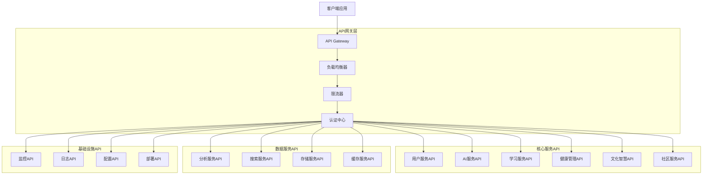

# 太上老君AI平台 - API概览文档

## 1. API架构概述

### 1.1 整体架构

太上老君AI平台采用微服务架构，基于S×C×T三轴理论设计，提供RESTful API和GraphQL API两种接口形式，支持多种认证方式和数据格式。



### 1.2 API设计原则

#### 1.2.1 RESTful设计原则

```yaml
# api-design-principles.yaml
rest_principles:
  resource_oriented: true
  http_methods:
    GET: "获取资源"
    POST: "创建资源"
    PUT: "更新整个资源"
    PATCH: "部分更新资源"
    DELETE: "删除资源"
  
  status_codes:
    success:
      200: "请求成功"
      201: "资源创建成功"
      204: "请求成功，无返回内容"
    client_error:
      400: "请求参数错误"
      401: "未授权"
      403: "禁止访问"
      404: "资源不存在"
      409: "资源冲突"
      422: "请求参数验证失败"
    server_error:
      500: "服务器内部错误"
      502: "网关错误"
      503: "服务不可用"
      504: "网关超时"
  
  url_conventions:
    base_url: "https://api.taishanglaojun.com/v1"
    resource_naming: "使用复数名词"
    nested_resources: "支持嵌套资源"
    query_parameters: "用于过滤、排序、分页"
```

#### 1.2.2 GraphQL设计原则

```graphql
# GraphQL Schema 设计原则
"""
太上老君AI平台 GraphQL Schema
基于S×C×T三轴理论设计的统一数据查询接口
"""

# 根查询类型
type Query {
  # 用户相关查询
  user(id: ID!): User
  users(filter: UserFilter, pagination: Pagination): UserConnection
  
  # AI服务查询
  aiModel(id: ID!): AIModel
  aiModels(type: AIModelType): [AIModel]
  
  # 学习系统查询
  learningPath(id: ID!): LearningPath
  learningPaths(userId: ID): [LearningPath]
  
  # 健康管理查询
  healthProfile(userId: ID!): HealthProfile
  healthMetrics(userId: ID!, timeRange: TimeRange): [HealthMetric]
  
  # 文化智慧查询
  culturalContent(id: ID!): CulturalContent
  culturalContents(category: String): [CulturalContent]
  
  # 社区查询
  community(id: ID!): Community
  communities(type: CommunityType): [Community]
}

# 根变更类型
type Mutation {
  # 用户操作
  createUser(input: CreateUserInput!): User
  updateUser(id: ID!, input: UpdateUserInput!): User
  deleteUser(id: ID!): Boolean
  
  # AI服务操作
  generateContent(input: GenerateContentInput!): GeneratedContent
  trainModel(input: TrainModelInput!): TrainingJob
  
  # 学习系统操作
  enrollLearningPath(userId: ID!, pathId: ID!): Enrollment
  submitAssignment(input: SubmitAssignmentInput!): AssignmentResult
  
  # 健康管理操作
  recordHealthMetric(input: HealthMetricInput!): HealthMetric
  updateHealthGoal(input: HealthGoalInput!): HealthGoal
  
  # 文化智慧操作
  createCulturalContent(input: CulturalContentInput!): CulturalContent
  
  # 社区操作
  createPost(input: CreatePostInput!): Post
  joinCommunity(userId: ID!, communityId: ID!): Membership
}

# 订阅类型（实时更新）
type Subscription {
  # 用户状态更新
  userStatusChanged(userId: ID!): UserStatus
  
  # AI服务状态
  aiModelTrainingProgress(jobId: ID!): TrainingProgress
  
  # 学习进度更新
  learningProgressUpdated(userId: ID!): LearningProgress
  
  # 健康数据更新
  healthMetricUpdated(userId: ID!): HealthMetric
  
  # 社区活动
  communityActivityUpdated(communityId: ID!): CommunityActivity
}
```

## 2. 认证与授权

### 2.1 认证方式

```go
// auth-types.go
package auth

import (
    "time"
    "github.com/golang-jwt/jwt/v4"
)

// 支持的认证方式
type AuthMethod string

const (
    AuthMethodJWT        AuthMethod = "jwt"
    AuthMethodAPIKey     AuthMethod = "api_key"
    AuthMethodOAuth2     AuthMethod = "oauth2"
    AuthMethodBasic      AuthMethod = "basic"
    AuthMethodBearer     AuthMethod = "bearer"
)

// JWT Claims结构
type JWTClaims struct {
    UserID      string   `json:"user_id"`
    Username    string   `json:"username"`
    Email       string   `json:"email"`
    Roles       []string `json:"roles"`
    Permissions []string `json:"permissions"`
    TenantID    string   `json:"tenant_id"`
    SessionID   string   `json:"session_id"`
    jwt.RegisteredClaims
}

// API Key结构
type APIKey struct {
    ID          string    `json:"id"`
    Key         string    `json:"key"`
    Name        string    `json:"name"`
    UserID      string    `json:"user_id"`
    Permissions []string  `json:"permissions"`
    RateLimit   int       `json:"rate_limit"`
    ExpiresAt   time.Time `json:"expires_at"`
    CreatedAt   time.Time `json:"created_at"`
    LastUsedAt  time.Time `json:"last_used_at"`
    IsActive    bool      `json:"is_active"`
}

// OAuth2配置
type OAuth2Config struct {
    ClientID     string   `json:"client_id"`
    ClientSecret string   `json:"client_secret"`
    RedirectURI  string   `json:"redirect_uri"`
    Scopes       []string `json:"scopes"`
    AuthURL      string   `json:"auth_url"`
    TokenURL     string   `json:"token_url"`
    UserInfoURL  string   `json:"user_info_url"`
}
```

### 2.2 权限控制

```yaml
# rbac-config.yaml
rbac:
  roles:
    - name: "super_admin"
      description: "超级管理员"
      permissions:
        - "*"
      
    - name: "admin"
      description: "管理员"
      permissions:
        - "users:read"
        - "users:write"
        - "system:read"
        - "system:write"
        - "analytics:read"
        
    - name: "teacher"
      description: "教师"
      permissions:
        - "learning:read"
        - "learning:write"
        - "students:read"
        - "content:write"
        - "assessment:write"
        
    - name: "student"
      description: "学生"
      permissions:
        - "learning:read"
        - "profile:write"
        - "community:read"
        - "community:write"
        
    - name: "health_advisor"
      description: "健康顾问"
      permissions:
        - "health:read"
        - "health:write"
        - "users:read"
        - "analytics:read"
        
    - name: "culture_expert"
      description: "文化专家"
      permissions:
        - "culture:read"
        - "culture:write"
        - "content:write"
        - "community:read"
        
    - name: "user"
      description: "普通用户"
      permissions:
        - "profile:read"
        - "profile:write"
        - "learning:read"
        - "health:read"
        - "culture:read"
        - "community:read"

  permissions:
    - name: "users:read"
      description: "读取用户信息"
      resources: ["users", "profiles"]
      actions: ["get", "list"]
      
    - name: "users:write"
      description: "修改用户信息"
      resources: ["users", "profiles"]
      actions: ["create", "update", "delete"]
      
    - name: "learning:read"
      description: "读取学习内容"
      resources: ["courses", "lessons", "progress"]
      actions: ["get", "list"]
      
    - name: "learning:write"
      description: "修改学习内容"
      resources: ["courses", "lessons", "progress"]
      actions: ["create", "update", "delete"]
      
    - name: "health:read"
      description: "读取健康数据"
      resources: ["health_profiles", "health_metrics"]
      actions: ["get", "list"]
      
    - name: "health:write"
      description: "修改健康数据"
      resources: ["health_profiles", "health_metrics"]
      actions: ["create", "update", "delete"]
      
    - name: "culture:read"
      description: "读取文化内容"
      resources: ["cultural_content", "wisdom"]
      actions: ["get", "list"]
      
    - name: "culture:write"
      description: "修改文化内容"
      resources: ["cultural_content", "wisdom"]
      actions: ["create", "update", "delete"]
      
    - name: "community:read"
      description: "读取社区内容"
      resources: ["communities", "posts", "comments"]
      actions: ["get", "list"]
      
    - name: "community:write"
      description: "修改社区内容"
      resources: ["communities", "posts", "comments"]
      actions: ["create", "update", "delete"]
      
    - name: "system:read"
      description: "读取系统信息"
      resources: ["system", "logs", "metrics"]
      actions: ["get", "list"]
      
    - name: "system:write"
      description: "修改系统配置"
      resources: ["system", "config"]
      actions: ["create", "update", "delete"]
      
    - name: "analytics:read"
      description: "读取分析数据"
      resources: ["analytics", "reports"]
      actions: ["get", "list"]
```

## 3. API版本管理

### 3.1 版本策略

```yaml
# api-versioning.yaml
versioning:
  strategy: "url_path"  # url_path, header, query_parameter
  current_version: "v1"
  supported_versions:
    - version: "v1"
      status: "stable"
      release_date: "2024-01-01"
      deprecation_date: null
      sunset_date: null
      
  version_format: "v{major}"
  
  compatibility:
    backward_compatible: true
    breaking_changes_policy: "major_version_only"
    deprecation_notice_period: "6_months"
    
  migration:
    auto_migration: false
    migration_guides: true
    migration_tools: true
```

### 3.2 API变更管理

```json
{
  "api_changelog": {
    "v1.0.0": {
      "release_date": "2024-01-01",
      "type": "initial_release",
      "changes": [
        {
          "type": "feature",
          "description": "初始API发布",
          "endpoints": ["*"]
        }
      ]
    },
    "v1.1.0": {
      "release_date": "2024-02-01",
      "type": "minor_update",
      "changes": [
        {
          "type": "feature",
          "description": "新增GraphQL支持",
          "endpoints": ["/graphql"]
        },
        {
          "type": "enhancement",
          "description": "优化分页性能",
          "endpoints": ["/users", "/courses", "/communities"]
        }
      ]
    },
    "v1.2.0": {
      "release_date": "2024-03-01",
      "type": "minor_update",
      "changes": [
        {
          "type": "feature",
          "description": "新增实时通知API",
          "endpoints": ["/notifications", "/websocket"]
        },
        {
          "type": "deprecation",
          "description": "废弃旧的认证端点",
          "endpoints": ["/auth/login_old"],
          "replacement": "/auth/login",
          "sunset_date": "2024-09-01"
        }
      ]
    }
  }
}
```

## 4. 数据格式与标准

### 4.1 请求/响应格式

```typescript
// api-types.ts

// 标准API响应格式
interface APIResponse<T = any> {
  success: boolean;
  data?: T;
  error?: APIError;
  meta?: ResponseMeta;
  links?: ResponseLinks;
}

// 错误信息格式
interface APIError {
  code: string;
  message: string;
  details?: Record<string, any>;
  trace_id?: string;
  timestamp: string;
}

// 响应元数据
interface ResponseMeta {
  pagination?: PaginationMeta;
  total_count?: number;
  execution_time?: number;
  api_version: string;
  request_id: string;
}

// 分页信息
interface PaginationMeta {
  page: number;
  per_page: number;
  total_pages: number;
  total_count: number;
  has_next: boolean;
  has_prev: boolean;
}

// 响应链接
interface ResponseLinks {
  self: string;
  next?: string;
  prev?: string;
  first?: string;
  last?: string;
}

// 标准查询参数
interface QueryParams {
  page?: number;
  per_page?: number;
  sort?: string;
  order?: 'asc' | 'desc';
  filter?: Record<string, any>;
  include?: string[];
  fields?: string[];
}

// 批量操作请求
interface BulkRequest<T> {
  operations: BulkOperation<T>[];
  options?: BulkOptions;
}

interface BulkOperation<T> {
  action: 'create' | 'update' | 'delete';
  resource_id?: string;
  data?: T;
}

interface BulkOptions {
  continue_on_error: boolean;
  return_details: boolean;
}

// 批量操作响应
interface BulkResponse<T> {
  success_count: number;
  error_count: number;
  results: BulkResult<T>[];
}

interface BulkResult<T> {
  success: boolean;
  resource_id?: string;
  data?: T;
  error?: APIError;
}
```

### 4.2 数据验证规则

```yaml
# validation-rules.yaml
validation:
  common_patterns:
    email: "^[a-zA-Z0-9._%+-]+@[a-zA-Z0-9.-]+\\.[a-zA-Z]{2,}$"
    phone: "^\\+?[1-9]\\d{1,14}$"
    username: "^[a-zA-Z0-9_]{3,30}$"
    password: "^(?=.*[a-z])(?=.*[A-Z])(?=.*\\d)(?=.*[@$!%*?&])[A-Za-z\\d@$!%*?&]{8,}$"
    uuid: "^[0-9a-f]{8}-[0-9a-f]{4}-[1-5][0-9a-f]{3}-[89ab][0-9a-f]{3}-[0-9a-f]{12}$"
    
  field_constraints:
    string:
      min_length: 1
      max_length: 255
      trim_whitespace: true
      
    text:
      min_length: 1
      max_length: 10000
      
    integer:
      min_value: -2147483648
      max_value: 2147483647
      
    float:
      min_value: -3.4028235e+38
      max_value: 3.4028235e+38
      precision: 2
      
    array:
      min_items: 0
      max_items: 1000
      
    object:
      max_properties: 100
      
  custom_validators:
    - name: "chinese_name"
      pattern: "^[\\u4e00-\\u9fa5]{2,10}$"
      message: "请输入2-10个中文字符"
      
    - name: "id_card"
      pattern: "^[1-9]\\d{5}(18|19|20)\\d{2}((0[1-9])|(1[0-2]))(([0-2][1-9])|10|20|30|31)\\d{3}[0-9Xx]$"
      message: "请输入有效的身份证号码"
      
    - name: "learning_level"
      enum: ["beginner", "intermediate", "advanced", "expert"]
      message: "学习等级必须是指定值之一"
```

## 5. 限流与配额

### 5.1 限流策略

```go
// rate-limiting.go
package ratelimit

import (
    "time"
    "context"
)

// 限流策略类型
type LimitType string

const (
    LimitTypeUser    LimitType = "user"
    LimitTypeIP      LimitType = "ip"
    LimitTypeAPIKey  LimitType = "api_key"
    LimitTypeGlobal  LimitType = "global"
)

// 限流配置
type RateLimit struct {
    Type        LimitType     `json:"type"`
    Identifier  string        `json:"identifier"`
    Requests    int           `json:"requests"`
    Window      time.Duration `json:"window"`
    BurstSize   int           `json:"burst_size"`
    Enabled     bool          `json:"enabled"`
}

// 限流规则
type RateLimitRule struct {
    Path        string      `json:"path"`
    Method      string      `json:"method"`
    UserType    string      `json:"user_type"`
    Limits      []RateLimit `json:"limits"`
    Priority    int         `json:"priority"`
}

// 默认限流配置
var DefaultRateLimits = []RateLimitRule{
    {
        Path:     "/api/v1/auth/login",
        Method:   "POST",
        UserType: "*",
        Limits: []RateLimit{
            {
                Type:      LimitTypeIP,
                Requests:  5,
                Window:    time.Minute,
                BurstSize: 2,
                Enabled:   true,
            },
        },
        Priority: 1,
    },
    {
        Path:     "/api/v1/users",
        Method:   "GET",
        UserType: "user",
        Limits: []RateLimit{
            {
                Type:      LimitTypeUser,
                Requests:  100,
                Window:    time.Minute,
                BurstSize: 10,
                Enabled:   true,
            },
        },
        Priority: 2,
    },
    {
        Path:     "/api/v1/ai/generate",
        Method:   "POST",
        UserType: "user",
        Limits: []RateLimit{
            {
                Type:      LimitTypeUser,
                Requests:  10,
                Window:    time.Minute,
                BurstSize: 2,
                Enabled:   true,
            },
        },
        Priority: 1,
    },
    {
        Path:     "/api/v1/*",
        Method:   "*",
        UserType: "admin",
        Limits: []RateLimit{
            {
                Type:      LimitTypeUser,
                Requests:  1000,
                Window:    time.Minute,
                BurstSize: 100,
                Enabled:   true,
            },
        },
        Priority: 3,
    },
}

// 限流器接口
type RateLimiter interface {
    Allow(ctx context.Context, key string, rule RateLimitRule) (bool, error)
    GetRemaining(ctx context.Context, key string, rule RateLimitRule) (int, error)
    Reset(ctx context.Context, key string) error
}

// 限流结果
type LimitResult struct {
    Allowed     bool          `json:"allowed"`
    Remaining   int           `json:"remaining"`
    ResetTime   time.Time     `json:"reset_time"`
    RetryAfter  time.Duration `json:"retry_after"`
}
```

### 5.2 配额管理

```yaml
# quota-config.yaml
quotas:
  user_types:
    free:
      daily_limits:
        api_calls: 1000
        ai_generations: 10
        storage_mb: 100
        bandwidth_mb: 1000
      monthly_limits:
        api_calls: 30000
        ai_generations: 300
        storage_mb: 1000
        bandwidth_mb: 10000
        
    premium:
      daily_limits:
        api_calls: 10000
        ai_generations: 100
        storage_mb: 1000
        bandwidth_mb: 10000
      monthly_limits:
        api_calls: 300000
        ai_generations: 3000
        storage_mb: 10000
        bandwidth_mb: 100000
        
    enterprise:
      daily_limits:
        api_calls: 100000
        ai_generations: 1000
        storage_mb: 10000
        bandwidth_mb: 100000
      monthly_limits:
        api_calls: 3000000
        ai_generations: 30000
        storage_mb: 100000
        bandwidth_mb: 1000000
        
  enforcement:
    soft_limit_threshold: 0.8  # 80%时发出警告
    hard_limit_action: "block"  # block, throttle, charge
    reset_schedule: "daily"     # daily, monthly, custom
    
  monitoring:
    track_usage: true
    alert_thresholds:
      warning: 0.8
      critical: 0.95
    notification_channels:
      - email
      - webhook
```

## 6. 错误处理

### 6.1 错误代码规范

```typescript
// error-codes.ts

// 错误代码枚举
enum ErrorCode {
  // 通用错误 (1000-1999)
  UNKNOWN_ERROR = 'E1000',
  INVALID_REQUEST = 'E1001',
  INVALID_PARAMETER = 'E1002',
  MISSING_PARAMETER = 'E1003',
  VALIDATION_FAILED = 'E1004',
  RATE_LIMIT_EXCEEDED = 'E1005',
  QUOTA_EXCEEDED = 'E1006',
  
  // 认证错误 (2000-2999)
  UNAUTHORIZED = 'E2000',
  INVALID_TOKEN = 'E2001',
  TOKEN_EXPIRED = 'E2002',
  INSUFFICIENT_PERMISSIONS = 'E2003',
  ACCOUNT_LOCKED = 'E2004',
  ACCOUNT_SUSPENDED = 'E2005',
  
  // 资源错误 (3000-3999)
  RESOURCE_NOT_FOUND = 'E3000',
  RESOURCE_ALREADY_EXISTS = 'E3001',
  RESOURCE_CONFLICT = 'E3002',
  RESOURCE_LOCKED = 'E3003',
  RESOURCE_DELETED = 'E3004',
  
  // 业务逻辑错误 (4000-4999)
  BUSINESS_RULE_VIOLATION = 'E4000',
  INVALID_STATE_TRANSITION = 'E4001',
  DEPENDENCY_NOT_MET = 'E4002',
  OPERATION_NOT_ALLOWED = 'E4003',
  
  // 系统错误 (5000-5999)
  INTERNAL_SERVER_ERROR = 'E5000',
  DATABASE_ERROR = 'E5001',
  EXTERNAL_SERVICE_ERROR = 'E5002',
  NETWORK_ERROR = 'E5003',
  TIMEOUT_ERROR = 'E5004',
  STORAGE_ERROR = 'E5005',
  
  // AI服务错误 (6000-6999)
  AI_MODEL_NOT_AVAILABLE = 'E6000',
  AI_GENERATION_FAILED = 'E6001',
  AI_MODEL_OVERLOADED = 'E6002',
  AI_CONTENT_FILTERED = 'E6003',
  
  // 学习系统错误 (7000-7999)
  COURSE_NOT_AVAILABLE = 'E7000',
  ENROLLMENT_FAILED = 'E7001',
  ASSESSMENT_FAILED = 'E7002',
  PROGRESS_SYNC_FAILED = 'E7003',
  
  // 健康管理错误 (8000-8999)
  HEALTH_DATA_INVALID = 'E8000',
  HEALTH_GOAL_CONFLICT = 'E8001',
  HEALTH_METRIC_OUT_OF_RANGE = 'E8002',
  
  // 社区服务错误 (9000-9999)
  COMMUNITY_ACCESS_DENIED = 'E9000',
  POST_MODERATION_FAILED = 'E9001',
  COMMENT_BLOCKED = 'E9002',
}

// 错误信息映射
const ErrorMessages: Record<ErrorCode, string> = {
  [ErrorCode.UNKNOWN_ERROR]: '未知错误',
  [ErrorCode.INVALID_REQUEST]: '无效的请求',
  [ErrorCode.INVALID_PARAMETER]: '参数无效',
  [ErrorCode.MISSING_PARAMETER]: '缺少必需参数',
  [ErrorCode.VALIDATION_FAILED]: '数据验证失败',
  [ErrorCode.RATE_LIMIT_EXCEEDED]: '请求频率超限',
  [ErrorCode.QUOTA_EXCEEDED]: '配额已用完',
  
  [ErrorCode.UNAUTHORIZED]: '未授权访问',
  [ErrorCode.INVALID_TOKEN]: '无效的访问令牌',
  [ErrorCode.TOKEN_EXPIRED]: '访问令牌已过期',
  [ErrorCode.INSUFFICIENT_PERMISSIONS]: '权限不足',
  [ErrorCode.ACCOUNT_LOCKED]: '账户已锁定',
  [ErrorCode.ACCOUNT_SUSPENDED]: '账户已暂停',
  
  [ErrorCode.RESOURCE_NOT_FOUND]: '资源不存在',
  [ErrorCode.RESOURCE_ALREADY_EXISTS]: '资源已存在',
  [ErrorCode.RESOURCE_CONFLICT]: '资源冲突',
  [ErrorCode.RESOURCE_LOCKED]: '资源已锁定',
  [ErrorCode.RESOURCE_DELETED]: '资源已删除',
  
  [ErrorCode.BUSINESS_RULE_VIOLATION]: '违反业务规则',
  [ErrorCode.INVALID_STATE_TRANSITION]: '无效的状态转换',
  [ErrorCode.DEPENDENCY_NOT_MET]: '依赖条件未满足',
  [ErrorCode.OPERATION_NOT_ALLOWED]: '操作不被允许',
  
  [ErrorCode.INTERNAL_SERVER_ERROR]: '服务器内部错误',
  [ErrorCode.DATABASE_ERROR]: '数据库错误',
  [ErrorCode.EXTERNAL_SERVICE_ERROR]: '外部服务错误',
  [ErrorCode.NETWORK_ERROR]: '网络错误',
  [ErrorCode.TIMEOUT_ERROR]: '请求超时',
  [ErrorCode.STORAGE_ERROR]: '存储错误',
  
  [ErrorCode.AI_MODEL_NOT_AVAILABLE]: 'AI模型不可用',
  [ErrorCode.AI_GENERATION_FAILED]: 'AI生成失败',
  [ErrorCode.AI_MODEL_OVERLOADED]: 'AI模型过载',
  [ErrorCode.AI_CONTENT_FILTERED]: 'AI内容被过滤',
  
  [ErrorCode.COURSE_NOT_AVAILABLE]: '课程不可用',
  [ErrorCode.ENROLLMENT_FAILED]: '注册失败',
  [ErrorCode.ASSESSMENT_FAILED]: '评估失败',
  [ErrorCode.PROGRESS_SYNC_FAILED]: '进度同步失败',
  
  [ErrorCode.HEALTH_DATA_INVALID]: '健康数据无效',
  [ErrorCode.HEALTH_GOAL_CONFLICT]: '健康目标冲突',
  [ErrorCode.HEALTH_METRIC_OUT_OF_RANGE]: '健康指标超出范围',
  
  [ErrorCode.COMMUNITY_ACCESS_DENIED]: '社区访问被拒绝',
  [ErrorCode.POST_MODERATION_FAILED]: '帖子审核失败',
  [ErrorCode.COMMENT_BLOCKED]: '评论被屏蔽',
};

// 错误处理工具类
class APIError extends Error {
  public readonly code: ErrorCode;
  public readonly statusCode: number;
  public readonly details?: Record<string, any>;
  public readonly traceId?: string;

  constructor(
    code: ErrorCode,
    message?: string,
    statusCode: number = 500,
    details?: Record<string, any>,
    traceId?: string
  ) {
    super(message || ErrorMessages[code]);
    this.code = code;
    this.statusCode = statusCode;
    this.details = details;
    this.traceId = traceId;
    this.name = 'APIError';
  }

  toJSON() {
    return {
      code: this.code,
      message: this.message,
      details: this.details,
      trace_id: this.traceId,
      timestamp: new Date().toISOString(),
    };
  }
}
```

## 7. API监控与分析

### 7.1 监控指标

```yaml
# api-monitoring.yaml
monitoring:
  metrics:
    performance:
      - name: "response_time"
        description: "API响应时间"
        unit: "milliseconds"
        thresholds:
          warning: 1000
          critical: 3000
          
      - name: "throughput"
        description: "API吞吐量"
        unit: "requests_per_second"
        thresholds:
          warning: 100
          critical: 50
          
      - name: "error_rate"
        description: "错误率"
        unit: "percentage"
        thresholds:
          warning: 5
          critical: 10
          
    availability:
      - name: "uptime"
        description: "服务可用性"
        unit: "percentage"
        target: 99.9
        
      - name: "health_check"
        description: "健康检查状态"
        endpoints:
          - "/health"
          - "/ready"
          - "/live"
          
    business:
      - name: "active_users"
        description: "活跃用户数"
        unit: "count"
        
      - name: "api_usage_by_endpoint"
        description: "各端点使用情况"
        unit: "requests"
        
      - name: "quota_utilization"
        description: "配额使用率"
        unit: "percentage"
        
  alerting:
    channels:
      - type: "email"
        recipients: ["admin@taishanglaojun.com"]
        
      - type: "slack"
        webhook_url: "${SLACK_WEBHOOK_URL}"
        channel: "#api-alerts"
        
      - type: "webhook"
        url: "${ALERT_WEBHOOK_URL}"
        
    rules:
      - name: "high_error_rate"
        condition: "error_rate > 5"
        severity: "warning"
        duration: "5m"
        
      - name: "critical_error_rate"
        condition: "error_rate > 10"
        severity: "critical"
        duration: "2m"
        
      - name: "slow_response"
        condition: "response_time > 3000"
        severity: "warning"
        duration: "10m"
        
      - name: "service_down"
        condition: "uptime < 99"
        severity: "critical"
        duration: "1m"
```

### 7.2 日志记录

```go
// api-logging.go
package logging

import (
    "context"
    "time"
    "encoding/json"
    
    "github.com/sirupsen/logrus"
    "github.com/gin-gonic/gin"
)

// API日志结构
type APILog struct {
    Timestamp    time.Time              `json:"timestamp"`
    RequestID    string                 `json:"request_id"`
    Method       string                 `json:"method"`
    Path         string                 `json:"path"`
    StatusCode   int                    `json:"status_code"`
    ResponseTime time.Duration          `json:"response_time"`
    UserID       string                 `json:"user_id,omitempty"`
    UserAgent    string                 `json:"user_agent"`
    ClientIP     string                 `json:"client_ip"`
    RequestSize  int64                  `json:"request_size"`
    ResponseSize int64                  `json:"response_size"`
    Error        string                 `json:"error,omitempty"`
    Metadata     map[string]interface{} `json:"metadata,omitempty"`
}

// 日志级别
type LogLevel string

const (
    LogLevelDebug LogLevel = "debug"
    LogLevelInfo  LogLevel = "info"
    LogLevelWarn  LogLevel = "warn"
    LogLevelError LogLevel = "error"
    LogLevelFatal LogLevel = "fatal"
)

// API日志记录器
type APILogger struct {
    logger *logrus.Logger
    config LogConfig
}

type LogConfig struct {
    Level           LogLevel `json:"level"`
    Format          string   `json:"format"` // json, text
    Output          string   `json:"output"` // stdout, file, elasticsearch
    FilePath        string   `json:"file_path,omitempty"`
    MaxSize         int      `json:"max_size"`         // MB
    MaxBackups      int      `json:"max_backups"`
    MaxAge          int      `json:"max_age"`          // days
    Compress        bool     `json:"compress"`
    ElasticsearchURL string  `json:"elasticsearch_url,omitempty"`
    IndexPattern    string   `json:"index_pattern"`
}

func NewAPILogger(config LogConfig) *APILogger {
    logger := logrus.New()
    
    // 设置日志级别
    switch config.Level {
    case LogLevelDebug:
        logger.SetLevel(logrus.DebugLevel)
    case LogLevelInfo:
        logger.SetLevel(logrus.InfoLevel)
    case LogLevelWarn:
        logger.SetLevel(logrus.WarnLevel)
    case LogLevelError:
        logger.SetLevel(logrus.ErrorLevel)
    case LogLevelFatal:
        logger.SetLevel(logrus.FatalLevel)
    }
    
    // 设置日志格式
    if config.Format == "json" {
        logger.SetFormatter(&logrus.JSONFormatter{
            TimestampFormat: time.RFC3339,
        })
    } else {
        logger.SetFormatter(&logrus.TextFormatter{
            FullTimestamp:   true,
            TimestampFormat: time.RFC3339,
        })
    }
    
    return &APILogger{
        logger: logger,
        config: config,
    }
}

// Gin中间件
func (al *APILogger) GinMiddleware() gin.HandlerFunc {
    return func(c *gin.Context) {
        start := time.Now()
        
        // 处理请求
        c.Next()
        
        // 记录日志
        apiLog := APILog{
            Timestamp:    start,
            RequestID:    c.GetString("request_id"),
            Method:       c.Request.Method,
            Path:         c.Request.URL.Path,
            StatusCode:   c.Writer.Status(),
            ResponseTime: time.Since(start),
            UserAgent:    c.Request.UserAgent(),
            ClientIP:     c.ClientIP(),
            RequestSize:  c.Request.ContentLength,
            ResponseSize: int64(c.Writer.Size()),
        }
        
        // 获取用户ID
        if userID, exists := c.Get("user_id"); exists {
            apiLog.UserID = userID.(string)
        }
        
        // 获取错误信息
        if len(c.Errors) > 0 {
            apiLog.Error = c.Errors.String()
        }
        
        // 记录日志
        al.LogRequest(apiLog)
    }
}

func (al *APILogger) LogRequest(apiLog APILog) {
    logData := map[string]interface{}{
        "timestamp":     apiLog.Timestamp,
        "request_id":    apiLog.RequestID,
        "method":        apiLog.Method,
        "path":          apiLog.Path,
        "status_code":   apiLog.StatusCode,
        "response_time": apiLog.ResponseTime.Milliseconds(),
        "user_agent":    apiLog.UserAgent,
        "client_ip":     apiLog.ClientIP,
        "request_size":  apiLog.RequestSize,
        "response_size": apiLog.ResponseSize,
    }
    
    if apiLog.UserID != "" {
        logData["user_id"] = apiLog.UserID
    }
    
    if apiLog.Error != "" {
        logData["error"] = apiLog.Error
    }
    
    if apiLog.Metadata != nil {
        logData["metadata"] = apiLog.Metadata
    }
    
    // 根据状态码选择日志级别
    switch {
    case apiLog.StatusCode >= 500:
        al.logger.WithFields(logData).Error("API request failed")
    case apiLog.StatusCode >= 400:
        al.logger.WithFields(logData).Warn("API request error")
    default:
        al.logger.WithFields(logData).Info("API request completed")
    }
}

// 业务日志记录
func (al *APILogger) LogBusiness(ctx context.Context, event string, data map[string]interface{}) {
    logData := map[string]interface{}{
        "event":     event,
        "timestamp": time.Now(),
        "data":      data,
    }
    
    if requestID := ctx.Value("request_id"); requestID != nil {
        logData["request_id"] = requestID
    }
    
    if userID := ctx.Value("user_id"); userID != nil {
        logData["user_id"] = userID
    }
    
    al.logger.WithFields(logData).Info("Business event")
}

// 安全日志记录
func (al *APILogger) LogSecurity(ctx context.Context, event string, severity string, data map[string]interface{}) {
    logData := map[string]interface{}{
        "event":     event,
        "severity":  severity,
        "timestamp": time.Now(),
        "data":      data,
    }
    
    if requestID := ctx.Value("request_id"); requestID != nil {
        logData["request_id"] = requestID
    }
    
    if userID := ctx.Value("user_id"); userID != nil {
        logData["user_id"] = userID
    }
    
    switch severity {
    case "critical", "high":
        al.logger.WithFields(logData).Error("Security event")
    case "medium":
        al.logger.WithFields(logData).Warn("Security event")
    default:
        al.logger.WithFields(logData).Info("Security event")
    }
}
```

## 8. 相关文档链接

- [用户服务API](./核心服务API/user-service-api.md)
- [AI服务API](./核心服务API/ai-service-api.md)
- [学习服务API](./核心服务API/learning-service-api.md)
- [健康管理API](./核心服务API/health-service-api.md)
- [文化智慧API](./核心服务API/culture-service-api.md)
- [社区服务API](./核心服务API/community-service-api.md)
- [GraphQL Schema](./graphql-schema.md)
- [API安全文档](./api-security.md)
- [SDK文档](./sdk-documentation.md)