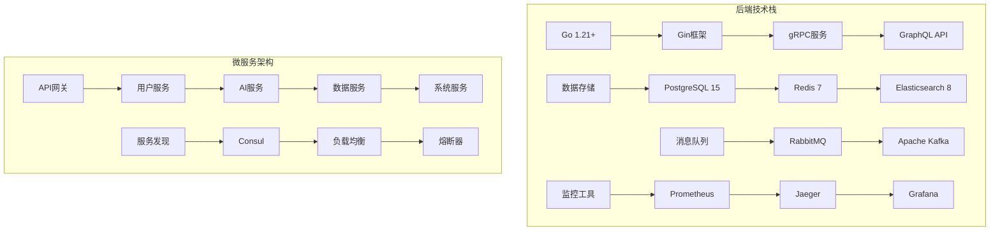

# 太上老君AI平台 - 后端开发指南

## 概述

太上老君AI平台后端采用Go语言和微服务架构，提供高性能、可扩展的API服务。本指南涵盖后端架构设计、开发规范、数据库设计和性能优化等方面。

## 技术栈架构



## 项目结构

```go
// 后端项目结构
type ProjectStructure struct {
    Cmd struct {
        Server   string `json:"server"`   // 主服务入口
        Migrate  string `json:"migrate"`  // 数据库迁移
        Worker   string `json:"worker"`   // 后台任务
        CLI      string `json:"cli"`      // 命令行工具
    } `json:"cmd"`
    
    Internal struct {
        Config     string `json:"config"`     // 配置管理
        Server     string `json:"server"`     // 服务器配置
        Handler    string `json:"handler"`    // HTTP处理器
        Service    string `json:"service"`    // 业务逻辑
        Repository string `json:"repository"` // 数据访问
        Model      string `json:"model"`      // 数据模型
        Middleware string `json:"middleware"` // 中间件
        Utils      string `json:"utils"`      // 工具函数
    } `json:"internal"`
    
    Pkg struct {
        Database string `json:"database"` // 数据库工具
        Cache    string `json:"cache"`    // 缓存工具
        Logger   string `json:"logger"`   // 日志工具
        Auth     string `json:"auth"`     // 认证工具
        Validator string `json:"validator"` // 验证工具
    } `json:"pkg"`
    
    API struct {
        Proto  string `json:"proto"`  // gRPC定义
        Schema string `json:"schema"` // GraphQL模式
        Docs   string `json:"docs"`   // API文档
    } `json:"api"`
    
    Scripts struct {
        Build   string `json:"build"`   // 构建脚本
        Deploy  string `json:"deploy"`  // 部署脚本
        Test    string `json:"test"`    // 测试脚本
        Migrate string `json:"migrate"` // 迁移脚本
    } `json:"scripts"`
}
```

## 核心配置

### 1. 项目配置

```go
// internal/config/config.go
package config

import (
    "fmt"
    "os"
    "strconv"
    "time"
    
    "github.com/joho/godotenv"
)

type Config struct {
    Server   ServerConfig   `json:"server"`
    Database DatabaseConfig `json:"database"`
    Redis    RedisConfig    `json:"redis"`
    JWT      JWTConfig      `json:"jwt"`
    Logger   LoggerConfig   `json:"logger"`
    AI       AIConfig       `json:"ai"`
}

type ServerConfig struct {
    Host         string        `json:"host"`
    Port         string        `json:"port"`
    Mode         string        `json:"mode"`
    ReadTimeout  time.Duration `json:"readTimeout"`
    WriteTimeout time.Duration `json:"writeTimeout"`
    IdleTimeout  time.Duration `json:"idleTimeout"`
}

type DatabaseConfig struct {
    Host         string `json:"host"`
    Port         string `json:"port"`
    User         string `json:"user"`
    Password     string `json:"password"`
    DBName       string `json:"dbName"`
    SSLMode      string `json:"sslMode"`
    MaxOpenConns int    `json:"maxOpenConns"`
    MaxIdleConns int    `json:"maxIdleConns"`
    MaxLifetime  time.Duration `json:"maxLifetime"`
}

type RedisConfig struct {
    Host     string `json:"host"`
    Port     string `json:"port"`
    Password string `json:"password"`
    DB       int    `json:"db"`
    PoolSize int    `json:"poolSize"`
}

type JWTConfig struct {
    Secret     string        `json:"secret"`
    ExpiresIn  time.Duration `json:"expiresIn"`
    RefreshIn  time.Duration `json:"refreshIn"`
    Issuer     string        `json:"issuer"`
}

type LoggerConfig struct {
    Level      string `json:"level"`
    Format     string `json:"format"`
    Output     string `json:"output"`
    MaxSize    int    `json:"maxSize"`
    MaxBackups int    `json:"maxBackups"`
    MaxAge     int    `json:"maxAge"`
    Compress   bool   `json:"compress"`
}

type AIConfig struct {
    OpenAIAPIKey  string `json:"openaiApiKey"`
    OpenAIBaseURL string `json:"openaiBaseUrl"`
    ModelCacheDir string `json:"modelCacheDir"`
    MaxTokens     int    `json:"maxTokens"`
    Temperature   float64 `json:"temperature"`
}

func Load() (*Config, error) {
    // 加载环境变量
    if err := godotenv.Load(); err != nil {
        // 生产环境可能没有.env文件，这是正常的
        fmt.Println("Warning: .env file not found")
    }
    
    config := &Config{
        Server: ServerConfig{
            Host:         getEnv("SERVER_HOST", "0.0.0.0"),
            Port:         getEnv("SERVER_PORT", "8080"),
            Mode:         getEnv("GIN_MODE", "debug"),
            ReadTimeout:  getDurationEnv("SERVER_READ_TIMEOUT", 30*time.Second),
            WriteTimeout: getDurationEnv("SERVER_WRITE_TIMEOUT", 30*time.Second),
            IdleTimeout:  getDurationEnv("SERVER_IDLE_TIMEOUT", 60*time.Second),
        },
        Database: DatabaseConfig{
            Host:         getEnv("DB_HOST", "localhost"),
            Port:         getEnv("DB_PORT", "5432"),
            User:         getEnv("DB_USER", "postgres"),
            Password:     getEnv("DB_PASSWORD", ""),
            DBName:       getEnv("DB_NAME", "taishanglaojun"),
            SSLMode:      getEnv("DB_SSLMODE", "disable"),
            MaxOpenConns: getIntEnv("DB_MAX_OPEN_CONNS", 25),
            MaxIdleConns: getIntEnv("DB_MAX_IDLE_CONNS", 5),
            MaxLifetime:  getDurationEnv("DB_MAX_LIFETIME", 5*time.Minute),
        },
        Redis: RedisConfig{
            Host:     getEnv("REDIS_HOST", "localhost"),
            Port:     getEnv("REDIS_PORT", "6379"),
            Password: getEnv("REDIS_PASSWORD", ""),
            DB:       getIntEnv("REDIS_DB", 0),
            PoolSize: getIntEnv("REDIS_POOL_SIZE", 10),
        },
        JWT: JWTConfig{
            Secret:    getEnv("JWT_SECRET", "your-secret-key"),
            ExpiresIn: getDurationEnv("JWT_EXPIRES_IN", 24*time.Hour),
            RefreshIn: getDurationEnv("JWT_REFRESH_IN", 7*24*time.Hour),
            Issuer:    getEnv("JWT_ISSUER", "taishanglaojun"),
        },
        Logger: LoggerConfig{
            Level:      getEnv("LOG_LEVEL", "info"),
            Format:     getEnv("LOG_FORMAT", "json"),
            Output:     getEnv("LOG_OUTPUT", "stdout"),
            MaxSize:    getIntEnv("LOG_MAX_SIZE", 100),
            MaxBackups: getIntEnv("LOG_MAX_BACKUPS", 3),
            MaxAge:     getIntEnv("LOG_MAX_AGE", 28),
            Compress:   getBoolEnv("LOG_COMPRESS", true),
        },
        AI: AIConfig{
            OpenAIAPIKey:  getEnv("OPENAI_API_KEY", ""),
            OpenAIBaseURL: getEnv("OPENAI_BASE_URL", "https://api.openai.com/v1"),
            ModelCacheDir: getEnv("MODEL_CACHE_DIR", "./models"),
            MaxTokens:     getIntEnv("AI_MAX_TOKENS", 4096),
            Temperature:   getFloat64Env("AI_TEMPERATURE", 0.7),
        },
    }
    
    return config, nil
}

func getEnv(key, defaultValue string) string {
    if value := os.Getenv(key); value != "" {
        return value
    }
    return defaultValue
}

func getIntEnv(key string, defaultValue int) int {
    if value := os.Getenv(key); value != "" {
        if intValue, err := strconv.Atoi(value); err == nil {
            return intValue
        }
    }
    return defaultValue
}

func getBoolEnv(key string, defaultValue bool) bool {
    if value := os.Getenv(key); value != "" {
        if boolValue, err := strconv.ParseBool(value); err == nil {
            return boolValue
        }
    }
    return defaultValue
}

func getFloat64Env(key string, defaultValue float64) float64 {
    if value := os.Getenv(key); value != "" {
        if floatValue, err := strconv.ParseFloat(value, 64); err == nil {
            return floatValue
        }
    }
    return defaultValue
}

func getDurationEnv(key string, defaultValue time.Duration) time.Duration {
    if value := os.Getenv(key); value != "" {
        if duration, err := time.ParseDuration(value); err == nil {
            return duration
        }
    }
    return defaultValue
}
```

### 2. 数据库配置

```go
// pkg/database/postgres.go
package database

import (
    "database/sql"
    "fmt"
    "time"
    
    "github.com/jmoiron/sqlx"
    _ "github.com/lib/pq"
    "go.uber.org/zap"
    
    "github.com/taishanglaojun/platform/internal/config"
)

type DB struct {
    *sqlx.DB
    logger *zap.Logger
}

func NewPostgres(cfg config.DatabaseConfig, logger *zap.Logger) (*DB, error) {
    dsn := fmt.Sprintf(
        "host=%s port=%s user=%s password=%s dbname=%s sslmode=%s",
        cfg.Host, cfg.Port, cfg.User, cfg.Password, cfg.DBName, cfg.SSLMode,
    )
    
    db, err := sqlx.Connect("postgres", dsn)
    if err != nil {
        return nil, fmt.Errorf("failed to connect to database: %w", err)
    }
    
    // 配置连接池
    db.SetMaxOpenConns(cfg.MaxOpenConns)
    db.SetMaxIdleConns(cfg.MaxIdleConns)
    db.SetConnMaxLifetime(cfg.MaxLifetime)
    
    // 测试连接
    if err := db.Ping(); err != nil {
        return nil, fmt.Errorf("failed to ping database: %w", err)
    }
    
    logger.Info("Connected to PostgreSQL database",
        zap.String("host", cfg.Host),
        zap.String("port", cfg.Port),
        zap.String("database", cfg.DBName),
    )
    
    return &DB{
        DB:     db,
        logger: logger,
    }, nil
}

func (db *DB) Close() error {
    db.logger.Info("Closing database connection")
    return db.DB.Close()
}

// 事务处理
func (db *DB) WithTransaction(fn func(*sqlx.Tx) error) error {
    tx, err := db.Beginx()
    if err != nil {
        return fmt.Errorf("failed to begin transaction: %w", err)
    }
    
    defer func() {
        if p := recover(); p != nil {
            tx.Rollback()
            panic(p)
        } else if err != nil {
            tx.Rollback()
        } else {
            err = tx.Commit()
        }
    }()
    
    err = fn(tx)
    return err
}

// 健康检查
func (db *DB) HealthCheck() error {
    ctx, cancel := context.WithTimeout(context.Background(), 5*time.Second)
    defer cancel()
    
    return db.PingContext(ctx)
}
```

### 3. Redis配置

```go
// pkg/cache/redis.go
package cache

import (
    "context"
    "encoding/json"
    "fmt"
    "time"
    
    "github.com/go-redis/redis/v8"
    "go.uber.org/zap"
    
    "github.com/taishanglaojun/platform/internal/config"
)

type Redis struct {
    client *redis.Client
    logger *zap.Logger
}

func NewRedis(cfg config.RedisConfig, logger *zap.Logger) (*Redis, error) {
    client := redis.NewClient(&redis.Options{
        Addr:     fmt.Sprintf("%s:%s", cfg.Host, cfg.Port),
        Password: cfg.Password,
        DB:       cfg.DB,
        PoolSize: cfg.PoolSize,
    })
    
    // 测试连接
    ctx, cancel := context.WithTimeout(context.Background(), 5*time.Second)
    defer cancel()
    
    if err := client.Ping(ctx).Err(); err != nil {
        return nil, fmt.Errorf("failed to connect to Redis: %w", err)
    }
    
    logger.Info("Connected to Redis",
        zap.String("host", cfg.Host),
        zap.String("port", cfg.Port),
        zap.Int("db", cfg.DB),
    )
    
    return &Redis{
        client: client,
        logger: logger,
    }, nil
}

func (r *Redis) Set(ctx context.Context, key string, value interface{}, expiration time.Duration) error {
    data, err := json.Marshal(value)
    if err != nil {
        return fmt.Errorf("failed to marshal value: %w", err)
    }
    
    return r.client.Set(ctx, key, data, expiration).Err()
}

func (r *Redis) Get(ctx context.Context, key string, dest interface{}) error {
    data, err := r.client.Get(ctx, key).Result()
    if err != nil {
        if err == redis.Nil {
            return ErrCacheNotFound
        }
        return fmt.Errorf("failed to get value: %w", err)
    }
    
    return json.Unmarshal([]byte(data), dest)
}

func (r *Redis) Delete(ctx context.Context, keys ...string) error {
    return r.client.Del(ctx, keys...).Err()
}

func (r *Redis) Exists(ctx context.Context, key string) (bool, error) {
    count, err := r.client.Exists(ctx, key).Result()
    return count > 0, err
}

func (r *Redis) SetNX(ctx context.Context, key string, value interface{}, expiration time.Duration) (bool, error) {
    data, err := json.Marshal(value)
    if err != nil {
        return false, fmt.Errorf("failed to marshal value: %w", err)
    }
    
    return r.client.SetNX(ctx, key, data, expiration).Result()
}

func (r *Redis) Close() error {
    r.logger.Info("Closing Redis connection")
    return r.client.Close()
}

var ErrCacheNotFound = fmt.Errorf("cache not found")
```

## 数据模型设计

### 1. 用户模型

```go
// internal/model/user.go
package model

import (
    "time"
    "database/sql/driver"
    "encoding/json"
    "fmt"
    
    "github.com/google/uuid"
    "golang.org/x/crypto/bcrypt"
)

type User struct {
    ID          uuid.UUID  `json:"id" db:"id"`
    Email       string     `json:"email" db:"email"`
    Username    string     `json:"username" db:"username"`
    PasswordHash string    `json:"-" db:"password_hash"`
    FirstName   *string    `json:"firstName" db:"first_name"`
    LastName    *string    `json:"lastName" db:"last_name"`
    Avatar      *string    `json:"avatar" db:"avatar"`
    Role        UserRole   `json:"role" db:"role"`
    Status      UserStatus `json:"status" db:"status"`
    Permissions Permissions `json:"permissions" db:"permissions"`
    Settings    UserSettings `json:"settings" db:"settings"`
    LastLoginAt *time.Time `json:"lastLoginAt" db:"last_login_at"`
    CreatedAt   time.Time  `json:"createdAt" db:"created_at"`
    UpdatedAt   time.Time  `json:"updatedAt" db:"updated_at"`
    DeletedAt   *time.Time `json:"deletedAt" db:"deleted_at"`
}

type UserRole string

const (
    RoleUser  UserRole = "user"
    RoleAdmin UserRole = "admin"
    RoleSuper UserRole = "super"
)

type UserStatus string

const (
    StatusActive   UserStatus = "active"
    StatusInactive UserStatus = "inactive"
    StatusSuspended UserStatus = "suspended"
)

type Permissions []string

func (p Permissions) Value() (driver.Value, error) {
    return json.Marshal(p)
}

func (p *Permissions) Scan(value interface{}) error {
    if value == nil {
        *p = nil
        return nil
    }
    
    bytes, ok := value.([]byte)
    if !ok {
        return fmt.Errorf("cannot scan %T into Permissions", value)
    }
    
    return json.Unmarshal(bytes, p)
}

type UserSettings struct {
    Theme        string `json:"theme"`
    Language     string `json:"language"`
    Timezone     string `json:"timezone"`
    Notifications map[string]bool `json:"notifications"`
}

func (s UserSettings) Value() (driver.Value, error) {
    return json.Marshal(s)
}

func (s *UserSettings) Scan(value interface{}) error {
    if value == nil {
        return nil
    }
    
    bytes, ok := value.([]byte)
    if !ok {
        return fmt.Errorf("cannot scan %T into UserSettings", value)
    }
    
    return json.Unmarshal(bytes, s)
}

// 密码相关方法
func (u *User) SetPassword(password string) error {
    hash, err := bcrypt.GenerateFromPassword([]byte(password), bcrypt.DefaultCost)
    if err != nil {
        return fmt.Errorf("failed to hash password: %w", err)
    }
    u.PasswordHash = string(hash)
    return nil
}

func (u *User) CheckPassword(password string) bool {
    err := bcrypt.CompareHashAndPassword([]byte(u.PasswordHash), []byte(password))
    return err == nil
}

// 权限检查
func (u *User) HasPermission(permission string) bool {
    for _, p := range u.Permissions {
        if p == permission {
            return true
        }
    }
    return false
}

func (u *User) HasRole(role UserRole) bool {
    return u.Role == role
}

// 表名
func (User) TableName() string {
    return "users"
}

// 创建用户请求
type CreateUserRequest struct {
    Email     string   `json:"email" validate:"required,email"`
    Username  string   `json:"username" validate:"required,min=3,max=50"`
    Password  string   `json:"password" validate:"required,min=6"`
    FirstName *string  `json:"firstName" validate:"omitempty,max=50"`
    LastName  *string  `json:"lastName" validate:"omitempty,max=50"`
    Role      UserRole `json:"role" validate:"omitempty,oneof=user admin"`
}

// 更新用户请求
type UpdateUserRequest struct {
    Username  *string      `json:"username" validate:"omitempty,min=3,max=50"`
    FirstName *string      `json:"firstName" validate:"omitempty,max=50"`
    LastName  *string      `json:"lastName" validate:"omitempty,max=50"`
    Avatar    *string      `json:"avatar" validate:"omitempty,url"`
    Settings  *UserSettings `json:"settings"`
}

// 用户响应
type UserResponse struct {
    ID          uuid.UUID    `json:"id"`
    Email       string       `json:"email"`
    Username    string       `json:"username"`
    FirstName   *string      `json:"firstName"`
    LastName    *string      `json:"lastName"`
    Avatar      *string      `json:"avatar"`
    Role        UserRole     `json:"role"`
    Status      UserStatus   `json:"status"`
    Permissions Permissions  `json:"permissions"`
    Settings    UserSettings `json:"settings"`
    LastLoginAt *time.Time   `json:"lastLoginAt"`
    CreatedAt   time.Time    `json:"createdAt"`
    UpdatedAt   time.Time    `json:"updatedAt"`
}

func (u *User) ToResponse() *UserResponse {
    return &UserResponse{
        ID:          u.ID,
        Email:       u.Email,
        Username:    u.Username,
        FirstName:   u.FirstName,
        LastName:    u.LastName,
        Avatar:      u.Avatar,
        Role:        u.Role,
        Status:      u.Status,
        Permissions: u.Permissions,
        Settings:    u.Settings,
        LastLoginAt: u.LastLoginAt,
        CreatedAt:   u.CreatedAt,
        UpdatedAt:   u.UpdatedAt,
    }
}
```

### 2. AI模型

```go
// internal/model/ai.go
package model

import (
    "time"
    "database/sql/driver"
    "encoding/json"
    "fmt"
    
    "github.com/google/uuid"
)

type AIModel struct {
    ID          uuid.UUID   `json:"id" db:"id"`
    Name        string      `json:"name" db:"name"`
    Description string      `json:"description" db:"description"`
    Type        ModelType   `json:"type" db:"type"`
    Provider    string      `json:"provider" db:"provider"`
    Version     string      `json:"version" db:"version"`
    Config      ModelConfig `json:"config" db:"config"`
    Status      ModelStatus `json:"status" db:"status"`
    Metrics     ModelMetrics `json:"metrics" db:"metrics"`
    CreatedBy   uuid.UUID   `json:"createdBy" db:"created_by"`
    CreatedAt   time.Time   `json:"createdAt" db:"created_at"`
    UpdatedAt   time.Time   `json:"updatedAt" db:"updated_at"`
}

type ModelType string

const (
    ModelTypeText  ModelType = "text"
    ModelTypeImage ModelType = "image"
    ModelTypeAudio ModelType = "audio"
    ModelTypeVideo ModelType = "video"
    ModelTypeMultimodal ModelType = "multimodal"
)

type ModelStatus string

const (
    ModelStatusActive   ModelStatus = "active"
    ModelStatusInactive ModelStatus = "inactive"
    ModelStatusTraining ModelStatus = "training"
    ModelStatusError    ModelStatus = "error"
)

type ModelConfig struct {
    MaxTokens   int     `json:"maxTokens"`
    Temperature float64 `json:"temperature"`
    TopP        float64 `json:"topP"`
    TopK        int     `json:"topK"`
    Parameters  map[string]interface{} `json:"parameters"`
}

func (c ModelConfig) Value() (driver.Value, error) {
    return json.Marshal(c)
}

func (c *ModelConfig) Scan(value interface{}) error {
    if value == nil {
        return nil
    }
    
    bytes, ok := value.([]byte)
    if !ok {
        return fmt.Errorf("cannot scan %T into ModelConfig", value)
    }
    
    return json.Unmarshal(bytes, c)
}

type ModelMetrics struct {
    TotalRequests   int64   `json:"totalRequests"`
    SuccessRate     float64 `json:"successRate"`
    AvgLatency      float64 `json:"avgLatency"`
    ErrorRate       float64 `json:"errorRate"`
    LastUsedAt      *time.Time `json:"lastUsedAt"`
}

func (m ModelMetrics) Value() (driver.Value, error) {
    return json.Marshal(m)
}

func (m *ModelMetrics) Scan(value interface{}) error {
    if value == nil {
        return nil
    }
    
    bytes, ok := value.([]byte)
    if !ok {
        return fmt.Errorf("cannot scan %T into ModelMetrics", value)
    }
    
    return json.Unmarshal(bytes, m)
}

// AI对话会话
type ChatSession struct {
    ID        uuid.UUID `json:"id" db:"id"`
    UserID    uuid.UUID `json:"userId" db:"user_id"`
    ModelID   uuid.UUID `json:"modelId" db:"model_id"`
    Title     string    `json:"title" db:"title"`
    Messages  []ChatMessage `json:"messages" db:"messages"`
    Settings  ChatSettings `json:"settings" db:"settings"`
    CreatedAt time.Time `json:"createdAt" db:"created_at"`
    UpdatedAt time.Time `json:"updatedAt" db:"updated_at"`
}

type ChatMessage struct {
    ID        uuid.UUID   `json:"id"`
    Role      MessageRole `json:"role"`
    Content   string      `json:"content"`
    Metadata  map[string]interface{} `json:"metadata"`
    CreatedAt time.Time   `json:"createdAt"`
}

type MessageRole string

const (
    RoleSystem    MessageRole = "system"
    RoleUser      MessageRole = "user"
    RoleAssistant MessageRole = "assistant"
)

type ChatSettings struct {
    Temperature float64 `json:"temperature"`
    MaxTokens   int     `json:"maxTokens"`
    SystemPrompt string `json:"systemPrompt"`
}

func (s ChatSettings) Value() (driver.Value, error) {
    return json.Marshal(s)
}

func (s *ChatSettings) Scan(value interface{}) error {
    if value == nil {
        return nil
    }
    
    bytes, ok := value.([]byte)
    if !ok {
        return fmt.Errorf("cannot scan %T into ChatSettings", value)
    }
    
    return json.Unmarshal(bytes, s)
}
```

## 服务层架构

### 1. 用户服务

```go
// internal/service/user.go
package service

import (
    "context"
    "fmt"
    "time"
    
    "github.com/google/uuid"
    "go.uber.org/zap"
    
    "github.com/taishanglaojun/platform/internal/model"
    "github.com/taishanglaojun/platform/internal/repository"
    "github.com/taishanglaojun/platform/pkg/cache"
    "github.com/taishanglaojun/platform/pkg/validator"
)

type UserService interface {
    CreateUser(ctx context.Context, req *model.CreateUserRequest) (*model.User, error)
    GetUserByID(ctx context.Context, id uuid.UUID) (*model.User, error)
    GetUserByEmail(ctx context.Context, email string) (*model.User, error)
    UpdateUser(ctx context.Context, id uuid.UUID, req *model.UpdateUserRequest) (*model.User, error)
    DeleteUser(ctx context.Context, id uuid.UUID) error
    ListUsers(ctx context.Context, filter *UserFilter) ([]*model.User, int64, error)
    ChangePassword(ctx context.Context, id uuid.UUID, oldPassword, newPassword string) error
    UpdateLastLogin(ctx context.Context, id uuid.UUID) error
}

type userService struct {
    userRepo  repository.UserRepository
    cache     cache.Redis
    validator *validator.Validator
    logger    *zap.Logger
}

type UserFilter struct {
    Search   string
    Role     *model.UserRole
    Status   *model.UserStatus
    Page     int
    PageSize int
    SortBy   string
    SortDir  string
}

func NewUserService(
    userRepo repository.UserRepository,
    cache cache.Redis,
    validator *validator.Validator,
    logger *zap.Logger,
) UserService {
    return &userService{
        userRepo:  userRepo,
        cache:     cache,
        validator: validator,
        logger:    logger,
    }
}

func (s *userService) CreateUser(ctx context.Context, req *model.CreateUserRequest) (*model.User, error) {
    // 验证请求
    if err := s.validator.Validate(req); err != nil {
        return nil, fmt.Errorf("validation failed: %w", err)
    }
    
    // 检查邮箱是否已存在
    existingUser, err := s.userRepo.GetByEmail(ctx, req.Email)
    if err != nil && err != repository.ErrUserNotFound {
        return nil, fmt.Errorf("failed to check existing user: %w", err)
    }
    if existingUser != nil {
        return nil, ErrEmailAlreadyExists
    }
    
    // 检查用户名是否已存在
    existingUser, err = s.userRepo.GetByUsername(ctx, req.Username)
    if err != nil && err != repository.ErrUserNotFound {
        return nil, fmt.Errorf("failed to check existing username: %w", err)
    }
    if existingUser != nil {
        return nil, ErrUsernameAlreadyExists
    }
    
    // 创建用户
    user := &model.User{
        ID:        uuid.New(),
        Email:     req.Email,
        Username:  req.Username,
        FirstName: req.FirstName,
        LastName:  req.LastName,
        Role:      req.Role,
        Status:    model.StatusActive,
        Permissions: []string{"user:read", "user:update"},
        Settings: model.UserSettings{
            Theme:     "light",
            Language:  "zh-CN",
            Timezone:  "Asia/Shanghai",
            Notifications: map[string]bool{
                "email": true,
                "push":  true,
            },
        },
        CreatedAt: time.Now(),
        UpdatedAt: time.Now(),
    }
    
    // 设置密码
    if err := user.SetPassword(req.Password); err != nil {
        return nil, fmt.Errorf("failed to set password: %w", err)
    }
    
    // 保存到数据库
    if err := s.userRepo.Create(ctx, user); err != nil {
        return nil, fmt.Errorf("failed to create user: %w", err)
    }
    
    s.logger.Info("User created successfully",
        zap.String("user_id", user.ID.String()),
        zap.String("email", user.Email),
    )
    
    return user, nil
}

func (s *userService) GetUserByID(ctx context.Context, id uuid.UUID) (*model.User, error) {
    // 尝试从缓存获取
    cacheKey := fmt.Sprintf("user:%s", id.String())
    var user model.User
    if err := s.cache.Get(ctx, cacheKey, &user); err == nil {
        return &user, nil
    }
    
    // 从数据库获取
    user, err := s.userRepo.GetByID(ctx, id)
    if err != nil {
        return nil, fmt.Errorf("failed to get user: %w", err)
    }
    
    // 写入缓存
    if err := s.cache.Set(ctx, cacheKey, user, 10*time.Minute); err != nil {
        s.logger.Warn("Failed to cache user", zap.Error(err))
    }
    
    return user, nil
}

func (s *userService) UpdateUser(ctx context.Context, id uuid.UUID, req *model.UpdateUserRequest) (*model.User, error) {
    // 验证请求
    if err := s.validator.Validate(req); err != nil {
        return nil, fmt.Errorf("validation failed: %w", err)
    }
    
    // 获取现有用户
    user, err := s.userRepo.GetByID(ctx, id)
    if err != nil {
        return nil, fmt.Errorf("failed to get user: %w", err)
    }
    
    // 检查用户名是否已被其他用户使用
    if req.Username != nil && *req.Username != user.Username {
        existingUser, err := s.userRepo.GetByUsername(ctx, *req.Username)
        if err != nil && err != repository.ErrUserNotFound {
            return nil, fmt.Errorf("failed to check existing username: %w", err)
        }
        if existingUser != nil && existingUser.ID != id {
            return nil, ErrUsernameAlreadyExists
        }
        user.Username = *req.Username
    }
    
    // 更新字段
    if req.FirstName != nil {
        user.FirstName = req.FirstName
    }
    if req.LastName != nil {
        user.LastName = req.LastName
    }
    if req.Avatar != nil {
        user.Avatar = req.Avatar
    }
    if req.Settings != nil {
        user.Settings = *req.Settings
    }
    
    user.UpdatedAt = time.Now()
    
    // 保存到数据库
    if err := s.userRepo.Update(ctx, user); err != nil {
        return nil, fmt.Errorf("failed to update user: %w", err)
    }
    
    // 清除缓存
    cacheKey := fmt.Sprintf("user:%s", id.String())
    if err := s.cache.Delete(ctx, cacheKey); err != nil {
        s.logger.Warn("Failed to delete user cache", zap.Error(err))
    }
    
    s.logger.Info("User updated successfully",
        zap.String("user_id", user.ID.String()),
    )
    
    return user, nil
}

func (s *userService) ChangePassword(ctx context.Context, id uuid.UUID, oldPassword, newPassword string) error {
    user, err := s.userRepo.GetByID(ctx, id)
    if err != nil {
        return fmt.Errorf("failed to get user: %w", err)
    }
    
    // 验证旧密码
    if !user.CheckPassword(oldPassword) {
        return ErrInvalidPassword
    }
    
    // 设置新密码
    if err := user.SetPassword(newPassword); err != nil {
        return fmt.Errorf("failed to set new password: %w", err)
    }
    
    user.UpdatedAt = time.Now()
    
    // 保存到数据库
    if err := s.userRepo.Update(ctx, user); err != nil {
        return fmt.Errorf("failed to update password: %w", err)
    }
    
    s.logger.Info("Password changed successfully",
        zap.String("user_id", user.ID.String()),
    )
    
    return nil
}

// 错误定义
var (
    ErrEmailAlreadyExists    = fmt.Errorf("email already exists")
    ErrUsernameAlreadyExists = fmt.Errorf("username already exists")
    ErrInvalidPassword       = fmt.Errorf("invalid password")
)
```

### 2. 认证服务

```go
// internal/service/auth.go
package service

import (
    "context"
    "fmt"
    "time"
    
    "github.com/golang-jwt/jwt/v5"
    "github.com/google/uuid"
    "go.uber.org/zap"
    
    "github.com/taishanglaojun/platform/internal/config"
    "github.com/taishanglaojun/platform/internal/model"
    "github.com/taishanglaojun/platform/pkg/cache"
)

type AuthService interface {
    Login(ctx context.Context, email, password string) (*AuthResponse, error)
    RefreshToken(ctx context.Context, refreshToken string) (*AuthResponse, error)
    Logout(ctx context.Context, userID uuid.UUID, token string) error
    ValidateToken(ctx context.Context, token string) (*TokenClaims, error)
    RevokeAllTokens(ctx context.Context, userID uuid.UUID) error
}

type authService struct {
    userService UserService
    cache       cache.Redis
    jwtConfig   config.JWTConfig
    logger      *zap.Logger
}

type AuthResponse struct {
    AccessToken  string           `json:"accessToken"`
    RefreshToken string           `json:"refreshToken"`
    ExpiresIn    int64            `json:"expiresIn"`
    User         *model.UserResponse `json:"user"`
}

type TokenClaims struct {
    UserID      uuid.UUID       `json:"userId"`
    Email       string          `json:"email"`
    Role        model.UserRole  `json:"role"`
    Permissions []string        `json:"permissions"`
    TokenType   string          `json:"tokenType"`
    jwt.RegisteredClaims
}

func NewAuthService(
    userService UserService,
    cache cache.Redis,
    jwtConfig config.JWTConfig,
    logger *zap.Logger,
) AuthService {
    return &authService{
        userService: userService,
        cache:       cache,
        jwtConfig:   jwtConfig,
        logger:      logger,
    }
}

func (s *authService) Login(ctx context.Context, email, password string) (*AuthResponse, error) {
    // 获取用户
    user, err := s.userService.GetUserByEmail(ctx, email)
    if err != nil {
        return nil, ErrInvalidCredentials
    }
    
    // 检查用户状态
    if user.Status != model.StatusActive {
        return nil, ErrUserInactive
    }
    
    // 验证密码
    if !user.CheckPassword(password) {
        return nil, ErrInvalidCredentials
    }
    
    // 生成令牌
    accessToken, err := s.generateAccessToken(user)
    if err != nil {
        return nil, fmt.Errorf("failed to generate access token: %w", err)
    }
    
    refreshToken, err := s.generateRefreshToken(user)
    if err != nil {
        return nil, fmt.Errorf("failed to generate refresh token: %w", err)
    }
    
    // 更新最后登录时间
    if err := s.userService.UpdateLastLogin(ctx, user.ID); err != nil {
        s.logger.Warn("Failed to update last login", zap.Error(err))
    }
    
    // 缓存刷新令牌
    refreshKey := fmt.Sprintf("refresh_token:%s", user.ID.String())
    if err := s.cache.Set(ctx, refreshKey, refreshToken, s.jwtConfig.RefreshIn); err != nil {
        s.logger.Warn("Failed to cache refresh token", zap.Error(err))
    }
    
    s.logger.Info("User logged in successfully",
        zap.String("user_id", user.ID.String()),
        zap.String("email", user.Email),
    )
    
    return &AuthResponse{
        AccessToken:  accessToken,
        RefreshToken: refreshToken,
        ExpiresIn:    int64(s.jwtConfig.ExpiresIn.Seconds()),
        User:         user.ToResponse(),
    }, nil
}

func (s *authService) generateAccessToken(user *model.User) (string, error) {
    claims := &TokenClaims{
        UserID:      user.ID,
        Email:       user.Email,
        Role:        user.Role,
        Permissions: user.Permissions,
        TokenType:   "access",
        RegisteredClaims: jwt.RegisteredClaims{
            Issuer:    s.jwtConfig.Issuer,
            Subject:   user.ID.String(),
            ExpiresAt: jwt.NewNumericDate(time.Now().Add(s.jwtConfig.ExpiresIn)),
            IssuedAt:  jwt.NewNumericDate(time.Now()),
            NotBefore: jwt.NewNumericDate(time.Now()),
        },
    }
    
    token := jwt.NewWithClaims(jwt.SigningMethodHS256, claims)
    return token.SignedString([]byte(s.jwtConfig.Secret))
}

func (s *authService) generateRefreshToken(user *model.User) (string, error) {
    claims := &TokenClaims{
        UserID:    user.ID,
        Email:     user.Email,
        TokenType: "refresh",
        RegisteredClaims: jwt.RegisteredClaims{
            Issuer:    s.jwtConfig.Issuer,
            Subject:   user.ID.String(),
            ExpiresAt: jwt.NewNumericDate(time.Now().Add(s.jwtConfig.RefreshIn)),
            IssuedAt:  jwt.NewNumericDate(time.Now()),
            NotBefore: jwt.NewNumericDate(time.Now()),
        },
    }
    
    token := jwt.NewWithClaims(jwt.SigningMethodHS256, claims)
    return token.SignedString([]byte(s.jwtConfig.Secret))
}

func (s *authService) ValidateToken(ctx context.Context, tokenString string) (*TokenClaims, error) {
    // 检查令牌是否被撤销
    tokenKey := fmt.Sprintf("revoked_token:%s", tokenString)
    if exists, _ := s.cache.Exists(ctx, tokenKey); exists {
        return nil, ErrTokenRevoked
    }
    
    token, err := jwt.ParseWithClaims(tokenString, &TokenClaims{}, func(token *jwt.Token) (interface{}, error) {
        if _, ok := token.Method.(*jwt.SigningMethodHMAC); !ok {
            return nil, fmt.Errorf("unexpected signing method: %v", token.Header["alg"])
        }
        return []byte(s.jwtConfig.Secret), nil
    })
    
    if err != nil {
        return nil, fmt.Errorf("failed to parse token: %w", err)
    }
    
    claims, ok := token.Claims.(*TokenClaims)
    if !ok || !token.Valid {
        return nil, ErrInvalidToken
    }
    
    return claims, nil
}

// 错误定义
var (
    ErrInvalidCredentials = fmt.Errorf("invalid credentials")
    ErrUserInactive      = fmt.Errorf("user is inactive")
    ErrInvalidToken      = fmt.Errorf("invalid token")
    ErrTokenRevoked      = fmt.Errorf("token has been revoked")
)
```

## 中间件

### 1. 认证中间件

```go
// internal/middleware/auth.go
package middleware

import (
    "net/http"
    "strings"
    
    "github.com/gin-gonic/gin"
    "go.uber.org/zap"
    
    "github.com/taishanglaojun/platform/internal/service"
)

func AuthMiddleware(authService service.AuthService, logger *zap.Logger) gin.HandlerFunc {
    return func(c *gin.Context) {
        token := extractTokenFromHeader(c.GetHeader("Authorization"))
        if token == "" {
            c.JSON(http.StatusUnauthorized, gin.H{
                "error": "missing authorization token",
                "code":  "MISSING_TOKEN",
            })
            c.Abort()
            return
        }
        
        claims, err := authService.ValidateToken(c.Request.Context(), token)
        if err != nil {
            logger.Warn("Invalid token", zap.Error(err))
            c.JSON(http.StatusUnauthorized, gin.H{
                "error": "invalid token",
                "code":  "INVALID_TOKEN",
            })
            c.Abort()
            return
        }
        
        // 将用户信息存储到上下文
        c.Set("user_id", claims.UserID)
        c.Set("user_email", claims.Email)
        c.Set("user_role", claims.Role)
        c.Set("user_permissions", claims.Permissions)
        
        c.Next()
    }
}

func extractTokenFromHeader(header string) string {
    if header == "" {
        return ""
    }
    
    parts := strings.SplitN(header, " ", 2)
    if len(parts) != 2 || parts[0] != "Bearer" {
        return ""
    }
    
    return parts[1]
}
```

### 2. 权限中间件

```go
// internal/middleware/permission.go
package middleware

import (
    "net/http"
    
    "github.com/gin-gonic/gin"
    
    "github.com/taishanglaojun/platform/internal/model"
)

func RequirePermission(permission string) gin.HandlerFunc {
    return func(c *gin.Context) {
        permissions, exists := c.Get("user_permissions")
        if !exists {
            c.JSON(http.StatusForbidden, gin.H{
                "error": "no permissions found",
                "code":  "NO_PERMISSIONS",
            })
            c.Abort()
            return
        }
        
        userPermissions, ok := permissions.([]string)
        if !ok {
            c.JSON(http.StatusForbidden, gin.H{
                "error": "invalid permissions format",
                "code":  "INVALID_PERMISSIONS",
            })
            c.Abort()
            return
        }
        
        if !hasPermission(userPermissions, permission) {
            c.JSON(http.StatusForbidden, gin.H{
                "error": "insufficient permissions",
                "code":  "INSUFFICIENT_PERMISSIONS",
            })
            c.Abort()
            return
        }
        
        c.Next()
    }
}

func RequireRole(role model.UserRole) gin.HandlerFunc {
    return func(c *gin.Context) {
        userRole, exists := c.Get("user_role")
        if !exists {
            c.JSON(http.StatusForbidden, gin.H{
                "error": "no role found",
                "code":  "NO_ROLE",
            })
            c.Abort()
            return
        }
        
        if userRole != role {
            c.JSON(http.StatusForbidden, gin.H{
                "error": "insufficient role",
                "code":  "INSUFFICIENT_ROLE",
            })
            c.Abort()
            return
        }
        
        c.Next()
    }
}

func hasPermission(permissions []string, required string) bool {
    for _, p := range permissions {
        if p == required || p == "*" {
            return true
        }
    }
    return false
}
```

### 3. 日志中间件

```go
// internal/middleware/logger.go
package middleware

import (
    "time"
    
    "github.com/gin-gonic/gin"
    "go.uber.org/zap"
)

func LoggerMiddleware(logger *zap.Logger) gin.HandlerFunc {
    return gin.LoggerWithFormatter(func(param gin.LogFormatterParams) string {
        logger.Info("HTTP Request",
            zap.String("method", param.Method),
            zap.String("path", param.Path),
            zap.Int("status", param.StatusCode),
            zap.Duration("latency", param.Latency),
            zap.String("ip", param.ClientIP),
            zap.String("user_agent", param.Request.UserAgent()),
            zap.String("error", param.ErrorMessage),
        )
        return ""
    })
}

func StructuredLoggerMiddleware(logger *zap.Logger) gin.HandlerFunc {
    return func(c *gin.Context) {
        start := time.Now()
        path := c.Request.URL.Path
        raw := c.Request.URL.RawQuery
        
        c.Next()
        
        latency := time.Since(start)
        clientIP := c.ClientIP()
        method := c.Request.Method
        statusCode := c.Writer.Status()
        bodySize := c.Writer.Size()
        
        if raw != "" {
            path = path + "?" + raw
        }
        
        fields := []zap.Field{
            zap.String("method", method),
            zap.String("path", path),
            zap.Int("status", statusCode),
            zap.Duration("latency", latency),
            zap.String("ip", clientIP),
            zap.Int("size", bodySize),
        }
        
        // 添加用户信息（如果存在）
        if userID, exists := c.Get("user_id"); exists {
            fields = append(fields, zap.Any("user_id", userID))
        }
        
        // 添加错误信息（如果存在）
        if len(c.Errors) > 0 {
            fields = append(fields, zap.String("error", c.Errors.String()))
        }
        
        if statusCode >= 500 {
            logger.Error("HTTP Request", fields...)
        } else if statusCode >= 400 {
            logger.Warn("HTTP Request", fields...)
        } else {
            logger.Info("HTTP Request", fields...)
        }
    }
}
```

## 相关文档链接

- [开发指南概览](./development-overview.md)
- [环境搭建指南](./environment-setup.md)
- [前端开发指南](./frontend-development.md)
- [AI开发指南](./ai-development.md)
- [测试指南](./testing-guide.md)
- [API文档](../06-API文档/api-overview.md)
- [数据库设计](./database-design.md)