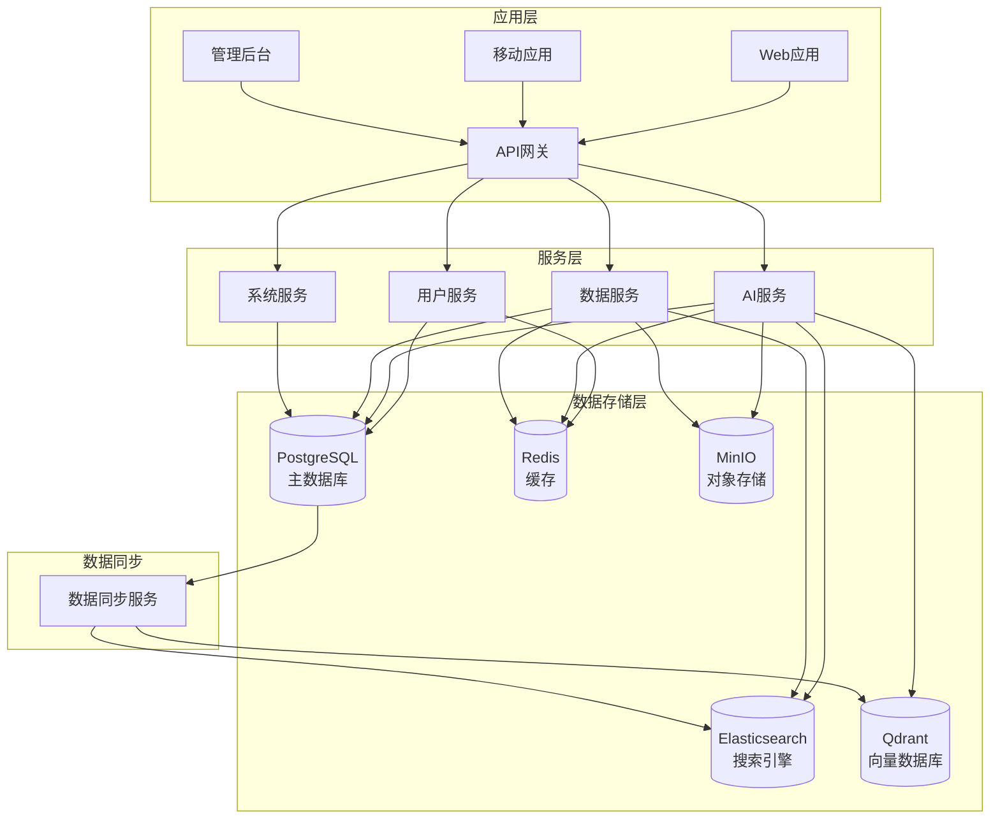

# 太上老君AI平台 - 数据库设计

## 概述

太上老君AI平台采用多数据库架构，结合关系型数据库、缓存数据库、搜索引擎和对象存储，以满足不同业务场景的需求。

## 数据库架构



## 技术选型

### 主数据库 - PostgreSQL
- **版本**: PostgreSQL 15+
- **用途**: 主要业务数据存储
- **特性**: ACID事务、JSON支持、全文搜索、扩展性

### 缓存数据库 - Redis
- **版本**: Redis 7+
- **用途**: 缓存、会话存储、消息队列
- **特性**: 高性能、多数据结构、持久化

### 搜索引擎 - Elasticsearch
- **版本**: Elasticsearch 8+
- **用途**: 全文搜索、日志分析、数据聚合
- **特性**: 分布式、实时搜索、分析能力

### 向量数据库 - Qdrant
- **版本**: Qdrant 1.7+
- **用途**: 向量存储、相似性搜索
- **特性**: 高性能向量搜索、实时更新

### 对象存储 - MinIO
- **版本**: MinIO RELEASE.2024+
- **用途**: 文件存储、模型存储
- **特性**: S3兼容、分布式、高可用

## PostgreSQL 数据库设计

### 1. 用户管理模块

#### users 表
```sql
CREATE TABLE users (
    id UUID PRIMARY KEY DEFAULT uuid_generate_v4(),
    email VARCHAR(255) UNIQUE NOT NULL,
    username VARCHAR(255) UNIQUE NOT NULL,
    password_hash VARCHAR(255) NOT NULL,
    first_name VARCHAR(255),
    last_name VARCHAR(255),
    avatar VARCHAR(255),
    role VARCHAR(50) NOT NULL DEFAULT 'user',
    status VARCHAR(50) NOT NULL DEFAULT 'active',
    permissions JSONB DEFAULT '[]',
    settings JSONB DEFAULT '{}',
    last_login_at TIMESTAMP,
    created_at TIMESTAMP NOT NULL DEFAULT NOW(),
    updated_at TIMESTAMP NOT NULL DEFAULT NOW(),
    deleted_at TIMESTAMP
);

-- 索引
CREATE INDEX idx_users_email ON users(email);
CREATE INDEX idx_users_username ON users(username);
CREATE INDEX idx_users_role ON users(role);
CREATE INDEX idx_users_status ON users(status);
CREATE INDEX idx_users_created_at ON users(created_at);
CREATE INDEX idx_users_deleted_at ON users(deleted_at) WHERE deleted_at IS NULL;

-- 触发器：自动更新 updated_at
CREATE OR REPLACE FUNCTION update_updated_at_column()
RETURNS TRIGGER AS $$
BEGIN
    NEW.updated_at = NOW();
    RETURN NEW;
END;
$$ language 'plpgsql';

CREATE TRIGGER update_users_updated_at 
    BEFORE UPDATE ON users 
    FOR EACH ROW 
    EXECUTE FUNCTION update_updated_at_column();
```

#### user_sessions 表
```sql
CREATE TABLE user_sessions (
    id UUID PRIMARY KEY DEFAULT uuid_generate_v4(),
    user_id UUID NOT NULL REFERENCES users(id) ON DELETE CASCADE,
    token_hash VARCHAR(255) NOT NULL,
    refresh_token_hash VARCHAR(255),
    device_info JSONB,
    ip_address INET,
    user_agent TEXT,
    expires_at TIMESTAMP NOT NULL,
    created_at TIMESTAMP NOT NULL DEFAULT NOW(),
    last_used_at TIMESTAMP NOT NULL DEFAULT NOW()
);

-- 索引
CREATE INDEX idx_user_sessions_user_id ON user_sessions(user_id);
CREATE INDEX idx_user_sessions_token_hash ON user_sessions(token_hash);
CREATE INDEX idx_user_sessions_expires_at ON user_sessions(expires_at);
```

### 2. AI模型管理模块

#### ai_models 表
```sql
CREATE TABLE ai_models (
    id UUID PRIMARY KEY DEFAULT uuid_generate_v4(),
    name VARCHAR(255) NOT NULL,
    provider VARCHAR(100) NOT NULL,
    model_type VARCHAR(100) NOT NULL,
    version VARCHAR(50) NOT NULL,
    description TEXT,
    config JSONB NOT NULL DEFAULT '{}',
    pricing JSONB,
    capabilities JSONB DEFAULT '[]',
    status VARCHAR(50) NOT NULL DEFAULT 'active',
    max_tokens INTEGER,
    context_window INTEGER,
    created_at TIMESTAMP NOT NULL DEFAULT NOW(),
    updated_at TIMESTAMP NOT NULL DEFAULT NOW(),
    
    UNIQUE(name, version)
);

-- 索引
CREATE INDEX idx_ai_models_provider ON ai_models(provider);
CREATE INDEX idx_ai_models_type ON ai_models(model_type);
CREATE INDEX idx_ai_models_status ON ai_models(status);
CREATE INDEX idx_ai_models_name ON ai_models(name);
```

#### model_usage_logs 表
```sql
CREATE TABLE model_usage_logs (
    id UUID PRIMARY KEY DEFAULT uuid_generate_v4(),
    user_id UUID NOT NULL REFERENCES users(id),
    model_id UUID NOT NULL REFERENCES ai_models(id),
    session_id UUID,
    request_type VARCHAR(50) NOT NULL,
    input_tokens INTEGER,
    output_tokens INTEGER,
    total_tokens INTEGER,
    cost DECIMAL(10, 6),
    duration_ms INTEGER,
    status VARCHAR(50) NOT NULL,
    error_message TEXT,
    metadata JSONB,
    created_at TIMESTAMP NOT NULL DEFAULT NOW()
);

-- 索引
CREATE INDEX idx_model_usage_logs_user_id ON model_usage_logs(user_id);
CREATE INDEX idx_model_usage_logs_model_id ON model_usage_logs(model_id);
CREATE INDEX idx_model_usage_logs_session_id ON model_usage_logs(session_id);
CREATE INDEX idx_model_usage_logs_created_at ON model_usage_logs(created_at);
CREATE INDEX idx_model_usage_logs_status ON model_usage_logs(status);

-- 分区表（按月分区）
CREATE TABLE model_usage_logs_y2024m01 PARTITION OF model_usage_logs
    FOR VALUES FROM ('2024-01-01') TO ('2024-02-01');
```

### 3. 聊天会话模块

#### chat_sessions 表
```sql
CREATE TABLE chat_sessions (
    id UUID PRIMARY KEY DEFAULT uuid_generate_v4(),
    user_id UUID NOT NULL REFERENCES users(id) ON DELETE CASCADE,
    model_id UUID NOT NULL REFERENCES ai_models(id),
    title VARCHAR(255),
    system_prompt TEXT,
    config JSONB DEFAULT '{}',
    status VARCHAR(50) NOT NULL DEFAULT 'active',
    message_count INTEGER DEFAULT 0,
    total_tokens INTEGER DEFAULT 0,
    created_at TIMESTAMP NOT NULL DEFAULT NOW(),
    updated_at TIMESTAMP NOT NULL DEFAULT NOW(),
    deleted_at TIMESTAMP
);

-- 索引
CREATE INDEX idx_chat_sessions_user_id ON chat_sessions(user_id);
CREATE INDEX idx_chat_sessions_model_id ON chat_sessions(model_id);
CREATE INDEX idx_chat_sessions_status ON chat_sessions(status);
CREATE INDEX idx_chat_sessions_created_at ON chat_sessions(created_at);
CREATE INDEX idx_chat_sessions_deleted_at ON chat_sessions(deleted_at) WHERE deleted_at IS NULL;
```

#### chat_messages 表
```sql
CREATE TABLE chat_messages (
    id UUID PRIMARY KEY DEFAULT uuid_generate_v4(),
    session_id UUID NOT NULL REFERENCES chat_sessions(id) ON DELETE CASCADE,
    role VARCHAR(50) NOT NULL,
    content TEXT NOT NULL,
    content_type VARCHAR(50) DEFAULT 'text',
    metadata JSONB,
    tokens INTEGER,
    sequence_number INTEGER NOT NULL,
    parent_message_id UUID REFERENCES chat_messages(id),
    created_at TIMESTAMP NOT NULL DEFAULT NOW(),
    
    UNIQUE(session_id, sequence_number)
);

-- 索引
CREATE INDEX idx_chat_messages_session_id ON chat_messages(session_id);
CREATE INDEX idx_chat_messages_role ON chat_messages(role);
CREATE INDEX idx_chat_messages_created_at ON chat_messages(created_at);
CREATE INDEX idx_chat_messages_parent_id ON chat_messages(parent_message_id);
```

### 4. 文件管理模块

#### files 表
```sql
CREATE TABLE files (
    id UUID PRIMARY KEY DEFAULT uuid_generate_v4(),
    user_id UUID NOT NULL REFERENCES users(id),
    filename VARCHAR(255) NOT NULL,
    original_filename VARCHAR(255) NOT NULL,
    file_type VARCHAR(100) NOT NULL,
    file_size BIGINT NOT NULL,
    mime_type VARCHAR(255),
    storage_path VARCHAR(500) NOT NULL,
    storage_provider VARCHAR(100) NOT NULL DEFAULT 'minio',
    checksum VARCHAR(255),
    metadata JSONB,
    status VARCHAR(50) NOT NULL DEFAULT 'uploaded',
    created_at TIMESTAMP NOT NULL DEFAULT NOW(),
    updated_at TIMESTAMP NOT NULL DEFAULT NOW(),
    deleted_at TIMESTAMP
);

-- 索引
CREATE INDEX idx_files_user_id ON files(user_id);
CREATE INDEX idx_files_file_type ON files(file_type);
CREATE INDEX idx_files_status ON files(status);
CREATE INDEX idx_files_created_at ON files(created_at);
CREATE INDEX idx_files_checksum ON files(checksum);
```

### 5. 系统配置模块

#### system_configs 表
```sql
CREATE TABLE system_configs (
    id UUID PRIMARY KEY DEFAULT uuid_generate_v4(),
    key VARCHAR(255) UNIQUE NOT NULL,
    value JSONB NOT NULL,
    description TEXT,
    category VARCHAR(100),
    is_public BOOLEAN DEFAULT FALSE,
    is_encrypted BOOLEAN DEFAULT FALSE,
    created_at TIMESTAMP NOT NULL DEFAULT NOW(),
    updated_at TIMESTAMP NOT NULL DEFAULT NOW()
);

-- 索引
CREATE INDEX idx_system_configs_key ON system_configs(key);
CREATE INDEX idx_system_configs_category ON system_configs(category);
CREATE INDEX idx_system_configs_is_public ON system_configs(is_public);
```

#### audit_logs 表
```sql
CREATE TABLE audit_logs (
    id UUID PRIMARY KEY DEFAULT uuid_generate_v4(),
    user_id UUID REFERENCES users(id),
    action VARCHAR(100) NOT NULL,
    resource_type VARCHAR(100) NOT NULL,
    resource_id VARCHAR(255),
    old_values JSONB,
    new_values JSONB,
    ip_address INET,
    user_agent TEXT,
    created_at TIMESTAMP NOT NULL DEFAULT NOW()
);

-- 索引
CREATE INDEX idx_audit_logs_user_id ON audit_logs(user_id);
CREATE INDEX idx_audit_logs_action ON audit_logs(action);
CREATE INDEX idx_audit_logs_resource_type ON audit_logs(resource_type);
CREATE INDEX idx_audit_logs_resource_id ON audit_logs(resource_id);
CREATE INDEX idx_audit_logs_created_at ON audit_logs(created_at);

-- 分区表（按月分区）
CREATE TABLE audit_logs_y2024m01 PARTITION OF audit_logs
    FOR VALUES FROM ('2024-01-01') TO ('2024-02-01');
```

## Redis 数据结构设计

### 1. 缓存策略

```redis
# 用户信息缓存
user:{user_id} -> JSON (TTL: 1小时)

# 用户会话缓存
session:{token_hash} -> JSON (TTL: 根据会话过期时间)

# 聊天会话缓存
chat_session:{session_id} -> JSON (TTL: 24小时)

# 模型配置缓存
model:{model_id} -> JSON (TTL: 6小时)

# 系统配置缓存
config:{key} -> JSON (TTL: 1小时)
```

### 2. 计数器和统计

```redis
# 用户使用统计
user_stats:{user_id}:tokens:daily:{date} -> INTEGER (TTL: 7天)
user_stats:{user_id}:requests:daily:{date} -> INTEGER (TTL: 7天)

# 模型使用统计
model_stats:{model_id}:requests:hourly:{hour} -> INTEGER (TTL: 24小时)
model_stats:{model_id}:tokens:hourly:{hour} -> INTEGER (TTL: 24小时)

# 系统统计
system_stats:active_users -> SET (TTL: 1小时)
system_stats:active_sessions -> SET (TTL: 1小时)
```

### 3. 队列和消息

```redis
# 任务队列
queue:ai_requests -> LIST
queue:file_processing -> LIST
queue:notifications -> LIST

# 发布订阅
channel:chat:{session_id} -> PUB/SUB (实时聊天)
channel:notifications:{user_id} -> PUB/SUB (用户通知)
```

### 4. 限流和防护

```redis
# 用户请求限流
rate_limit:user:{user_id}:requests -> STRING (TTL: 1分钟)
rate_limit:user:{user_id}:tokens -> STRING (TTL: 1小时)

# IP限流
rate_limit:ip:{ip_address} -> STRING (TTL: 1分钟)

# 模型限流
rate_limit:model:{model_id} -> STRING (TTL: 1分钟)
```

## Elasticsearch 索引设计

### 1. 聊天消息索引

```json
{
  "mappings": {
    "properties": {
      "session_id": {
        "type": "keyword"
      },
      "user_id": {
        "type": "keyword"
      },
      "role": {
        "type": "keyword"
      },
      "content": {
        "type": "text",
        "analyzer": "ik_max_word",
        "search_analyzer": "ik_smart"
      },
      "content_type": {
        "type": "keyword"
      },
      "tokens": {
        "type": "integer"
      },
      "created_at": {
        "type": "date"
      },
      "metadata": {
        "type": "object",
        "enabled": false
      }
    }
  },
  "settings": {
    "number_of_shards": 3,
    "number_of_replicas": 1,
    "analysis": {
      "analyzer": {
        "ik_max_word": {
          "type": "ik_max_word"
        },
        "ik_smart": {
          "type": "ik_smart"
        }
      }
    }
  }
}
```

### 2. 系统日志索引

```json
{
  "mappings": {
    "properties": {
      "timestamp": {
        "type": "date"
      },
      "level": {
        "type": "keyword"
      },
      "service": {
        "type": "keyword"
      },
      "message": {
        "type": "text"
      },
      "user_id": {
        "type": "keyword"
      },
      "request_id": {
        "type": "keyword"
      },
      "error": {
        "type": "object",
        "properties": {
          "type": {
            "type": "keyword"
          },
          "message": {
            "type": "text"
          },
          "stack": {
            "type": "text",
            "index": false
          }
        }
      }
    }
  },
  "settings": {
    "number_of_shards": 2,
    "number_of_replicas": 1,
    "index.lifecycle.name": "logs-policy",
    "index.lifecycle.rollover_alias": "logs"
  }
}
```

## Qdrant 向量数据库设计

### 1. 文档向量集合

```python
# 创建文档向量集合
from qdrant_client import QdrantClient
from qdrant_client.models import Distance, VectorParams, CreateCollection

client = QdrantClient("localhost", port=6333)

client.create_collection(
    collection_name="documents",
    vectors_config=VectorParams(
        size=1536,  # OpenAI embedding 维度
        distance=Distance.COSINE
    ),
    optimizers_config=models.OptimizersConfig(
        default_segment_number=2,
        max_segment_size=20000,
        memmap_threshold=20000,
        indexing_threshold=20000,
        flush_interval_sec=5,
        max_optimization_threads=1
    ),
    hnsw_config=models.HnswConfig(
        m=16,
        ef_construct=100,
        full_scan_threshold=10000,
        max_indexing_threads=0,
        on_disk=False
    )
)
```

### 2. 聊天历史向量集合

```python
client.create_collection(
    collection_name="chat_history",
    vectors_config=VectorParams(
        size=1536,
        distance=Distance.COSINE
    ),
    optimizers_config=models.OptimizersConfig(
        default_segment_number=1,
        max_segment_size=10000
    )
)
```

## 数据库优化策略

### 1. PostgreSQL 优化

#### 连接池配置
```yaml
# postgresql.conf
max_connections = 200
shared_buffers = 256MB
effective_cache_size = 1GB
work_mem = 4MB
maintenance_work_mem = 64MB
checkpoint_completion_target = 0.9
wal_buffers = 16MB
default_statistics_target = 100
random_page_cost = 1.1
effective_io_concurrency = 200
```

#### 查询优化
```sql
-- 分析查询计划
EXPLAIN (ANALYZE, BUFFERS) SELECT * FROM users WHERE email = 'test@example.com';

-- 创建复合索引
CREATE INDEX idx_chat_messages_session_created ON chat_messages(session_id, created_at);

-- 分区表优化
CREATE INDEX idx_model_usage_logs_y2024m01_user_created 
    ON model_usage_logs_y2024m01(user_id, created_at);
```

### 2. Redis 优化

#### 内存优化
```redis
# redis.conf
maxmemory 2gb
maxmemory-policy allkeys-lru
save 900 1
save 300 10
save 60 10000
```

#### 持久化配置
```redis
# AOF持久化
appendonly yes
appendfsync everysec
auto-aof-rewrite-percentage 100
auto-aof-rewrite-min-size 64mb
```

### 3. Elasticsearch 优化

#### 索引模板
```json
{
  "index_patterns": ["logs-*"],
  "template": {
    "settings": {
      "number_of_shards": 1,
      "number_of_replicas": 0,
      "refresh_interval": "30s",
      "index.lifecycle.name": "logs-policy"
    }
  }
}
```

#### 生命周期管理
```json
{
  "policy": {
    "phases": {
      "hot": {
        "actions": {
          "rollover": {
            "max_size": "50gb",
            "max_age": "30d"
          }
        }
      },
      "warm": {
        "min_age": "30d",
        "actions": {
          "allocate": {
            "number_of_replicas": 0
          }
        }
      },
      "delete": {
        "min_age": "90d"
      }
    }
  }
}
```

## 数据迁移和备份

### 1. 数据库迁移

```go
// migrations/001_create_users_table.up.sql
CREATE EXTENSION IF NOT EXISTS "uuid-ossp";

CREATE TABLE users (
    id UUID PRIMARY KEY DEFAULT uuid_generate_v4(),
    email VARCHAR(255) UNIQUE NOT NULL,
    username VARCHAR(255) UNIQUE NOT NULL,
    password_hash VARCHAR(255) NOT NULL,
    created_at TIMESTAMP NOT NULL DEFAULT NOW(),
    updated_at TIMESTAMP NOT NULL DEFAULT NOW()
);

// migrations/001_create_users_table.down.sql
DROP TABLE IF EXISTS users;
```

### 2. 备份策略

#### PostgreSQL 备份
```bash
#!/bin/bash
# 每日备份脚本
BACKUP_DIR="/backup/postgresql"
DATE=$(date +%Y%m%d_%H%M%S)

# 全量备份
pg_dump -h localhost -U postgres -d taishanglaojun > "$BACKUP_DIR/full_backup_$DATE.sql"

# 压缩备份
gzip "$BACKUP_DIR/full_backup_$DATE.sql"

# 清理7天前的备份
find $BACKUP_DIR -name "*.gz" -mtime +7 -delete
```

#### Redis 备份
```bash
#!/bin/bash
# Redis备份脚本
BACKUP_DIR="/backup/redis"
DATE=$(date +%Y%m%d_%H%M%S)

# 创建RDB快照
redis-cli BGSAVE

# 等待备份完成
while [ $(redis-cli LASTSAVE) -eq $(redis-cli LASTSAVE) ]; do
    sleep 1
done

# 复制备份文件
cp /var/lib/redis/dump.rdb "$BACKUP_DIR/dump_$DATE.rdb"
```

## 监控和告警

### 1. 数据库监控指标

```yaml
# Prometheus 监控配置
- job_name: 'postgresql'
  static_configs:
    - targets: ['localhost:9187']
  metrics_path: /metrics

- job_name: 'redis'
  static_configs:
    - targets: ['localhost:9121']

- job_name: 'elasticsearch'
  static_configs:
    - targets: ['localhost:9114']
```

### 2. 告警规则

```yaml
# PostgreSQL 告警
- alert: PostgreSQLDown
  expr: pg_up == 0
  for: 5m
  labels:
    severity: critical
  annotations:
    summary: "PostgreSQL is down"

- alert: PostgreSQLHighConnections
  expr: pg_stat_database_numbackends / pg_settings_max_connections > 0.8
  for: 5m
  labels:
    severity: warning
  annotations:
    summary: "PostgreSQL connection usage is high"

# Redis 告警
- alert: RedisDown
  expr: redis_up == 0
  for: 5m
  labels:
    severity: critical
  annotations:
    summary: "Redis is down"

- alert: RedisHighMemoryUsage
  expr: redis_memory_used_bytes / redis_memory_max_bytes > 0.9
  for: 5m
  labels:
    severity: warning
  annotations:
    summary: "Redis memory usage is high"
```

## 相关文档链接

- [开发指南概览](./development-overview.md)
- [环境搭建指南](./environment-setup.md)
- [后端开发指南](./backend-development.md)
- [AI开发指南](./ai-development.md)
- [测试指南](./testing-guide.md)
- [部署运维指南](../08-部署运维/deployment-overview.md)