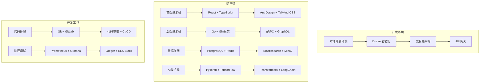

# 太上老君AI平台 - 开发指南概览

## 概述

太上老君AI平台开发指南为开发者提供全面的技术文档和最佳实践，帮助开发者快速上手平台开发、理解系统架构、掌握开发流程。

## 开发环境架构



## 核心开发原则

### 1. 代码质量原则

```typescript
// 代码规范示例
interface CodeQualityPrinciples {
  // 可读性优先
  readability: {
    naming: 'semantic_naming';
    comments: 'meaningful_comments';
    structure: 'clear_organization';
  };
  
  // 可维护性
  maintainability: {
    modularity: 'loose_coupling';
    testability: 'unit_test_coverage';
    documentation: 'comprehensive_docs';
  };
  
  // 性能优化
  performance: {
    efficiency: 'algorithm_optimization';
    scalability: 'horizontal_scaling';
    caching: 'multi_level_cache';
  };
  
  // 安全性
  security: {
    authentication: 'jwt_oauth2';
    authorization: 'rbac_system';
    dataProtection: 'encryption_sanitization';
  };
}
```

### 2. 开发流程规范

```yaml
development_workflow:
  planning:
    - requirement_analysis
    - technical_design
    - task_breakdown
    
  development:
    - feature_branch_creation
    - test_driven_development
    - code_review_process
    
  testing:
    - unit_testing
    - integration_testing
    - e2e_testing
    
  deployment:
    - staging_deployment
    - production_deployment
    - monitoring_setup
```

## 技术栈详解

### 前端开发技术栈

```typescript
// 前端技术栈配置
interface FrontendStack {
  framework: 'React 18+';
  language: 'TypeScript 5+';
  stateManagement: 'Redux Toolkit + RTK Query';
  uiLibrary: 'Ant Design 5+ + Tailwind CSS';
  routing: 'React Router 6+';
  testing: 'Jest + React Testing Library';
  bundler: 'Vite + SWC';
  linting: 'ESLint + Prettier';
}

// 项目结构示例
const projectStructure = {
  src: {
    components: '可复用组件',
    pages: '页面组件',
    hooks: '自定义Hooks',
    services: 'API服务',
    store: '状态管理',
    utils: '工具函数',
    types: 'TypeScript类型定义'
  }
};
```

### 后端开发技术栈

```go
// 后端技术栈配置
type BackendStack struct {
    Framework    string `json:"framework"`    // Gin + gRPC
    Language     string `json:"language"`     // Go 1.21+
    Database     string `json:"database"`     // PostgreSQL 15+
    Cache        string `json:"cache"`        // Redis 7+
    MessageQueue string `json:"messageQueue"` // RabbitMQ
    Monitoring   string `json:"monitoring"`   // Prometheus + Grafana
    Logging      string `json:"logging"`      // Zap + ELK Stack
    Testing      string `json:"testing"`      // Testify + GoMock
}

// 微服务架构示例
type MicroserviceArchitecture struct {
    APIGateway    string `json:"apiGateway"`    // Kong + JWT
    UserService   string `json:"userService"`   // 用户管理服务
    AIService     string `json:"aiService"`     // AI核心服务
    DataService   string `json:"dataService"`   // 数据处理服务
    SystemService string `json:"systemService"` // 系统管理服务
}
```

### AI开发技术栈

```python
# AI技术栈配置
ai_stack = {
    'deep_learning': {
        'frameworks': ['PyTorch 2.0+', 'TensorFlow 2.13+'],
        'libraries': ['Transformers', 'LangChain', 'OpenAI'],
        'models': ['GPT', 'BERT', 'T5', 'Stable Diffusion']
    },
    'data_processing': {
        'libraries': ['Pandas', 'NumPy', 'Scikit-learn'],
        'vector_db': ['Pinecone', 'Weaviate', 'Chroma'],
        'preprocessing': ['spaCy', 'NLTK', 'OpenCV']
    },
    'deployment': {
        'serving': ['FastAPI', 'TorchServe', 'TensorFlow Serving'],
        'containerization': ['Docker', 'Kubernetes'],
        'monitoring': ['MLflow', 'Weights & Biases']
    }
}
```

## 开发环境配置

### 1. 本地开发环境

```yaml
# docker-compose.dev.yml
version: '3.8'
services:
  # 数据库服务
  postgres:
    image: postgres:15
    environment:
      POSTGRES_DB: taishanglaojun_dev
      POSTGRES_USER: dev_user
      POSTGRES_PASSWORD: dev_password
    ports:
      - "5432:5432"
    volumes:
      - postgres_data:/var/lib/postgresql/data
      
  # 缓存服务
  redis:
    image: redis:7-alpine
    ports:
      - "6379:6379"
    command: redis-server --appendonly yes
    volumes:
      - redis_data:/data
      
  # 搜索引擎
  elasticsearch:
    image: elasticsearch:8.8.0
    environment:
      - discovery.type=single-node
      - xpack.security.enabled=false
    ports:
      - "9200:9200"
    volumes:
      - es_data:/usr/share/elasticsearch/data
      
  # 对象存储
  minio:
    image: minio/minio:latest
    ports:
      - "9000:9000"
      - "9001:9001"
    environment:
      MINIO_ROOT_USER: minioadmin
      MINIO_ROOT_PASSWORD: minioadmin
    command: server /data --console-address ":9001"
    volumes:
      - minio_data:/data

volumes:
  postgres_data:
  redis_data:
  es_data:
  minio_data:
```

### 2. 开发工具配置

```json
// .vscode/settings.json
{
  "go.toolsManagement.checkForUpdates": "local",
  "go.useLanguageServer": true,
  "go.gopath": "",
  "go.goroot": "",
  "go.lintTool": "golangci-lint",
  "go.formatTool": "goimports",
  "typescript.preferences.importModuleSpecifier": "relative",
  "editor.formatOnSave": true,
  "editor.codeActionsOnSave": {
    "source.fixAll.eslint": true,
    "source.organizeImports": true
  }
}
```

## 代码规范和最佳实践

### 1. Go代码规范

```go
// 包命名规范
package userservice

// 接口定义规范
type UserRepository interface {
    CreateUser(ctx context.Context, user *User) error
    GetUserByID(ctx context.Context, id string) (*User, error)
    UpdateUser(ctx context.Context, user *User) error
    DeleteUser(ctx context.Context, id string) error
}

// 错误处理规范
func (s *UserService) CreateUser(ctx context.Context, req *CreateUserRequest) (*User, error) {
    if err := s.validateCreateUserRequest(req); err != nil {
        return nil, fmt.Errorf("validate request: %w", err)
    }
    
    user, err := s.repo.CreateUser(ctx, req.ToUser())
    if err != nil {
        return nil, fmt.Errorf("create user in repository: %w", err)
    }
    
    return user, nil
}

// 日志记录规范
func (s *UserService) loginUser(ctx context.Context, email, password string) error {
    logger := s.logger.With(
        zap.String("operation", "login_user"),
        zap.String("email", email),
        zap.String("trace_id", getTraceID(ctx)),
    )
    
    logger.Info("attempting user login")
    
    if err := s.authenticateUser(email, password); err != nil {
        logger.Error("login failed", zap.Error(err))
        return err
    }
    
    logger.Info("user login successful")
    return nil
}
```

### 2. TypeScript代码规范

```typescript
// 类型定义规范
interface User {
  readonly id: string;
  email: string;
  username: string;
  profile: UserProfile;
  createdAt: Date;
  updatedAt: Date;
}

// 组件定义规范
interface UserCardProps {
  user: User;
  onEdit?: (user: User) => void;
  onDelete?: (userId: string) => void;
  className?: string;
}

export const UserCard: React.FC<UserCardProps> = ({
  user,
  onEdit,
  onDelete,
  className
}) => {
  const handleEdit = useCallback(() => {
    onEdit?.(user);
  }, [user, onEdit]);

  const handleDelete = useCallback(() => {
    onDelete?.(user.id);
  }, [user.id, onDelete]);

  return (
    <Card className={className}>
      <Card.Meta
        title={user.username}
        description={user.email}
      />
      <div className="mt-4 flex gap-2">
        {onEdit && (
          <Button onClick={handleEdit}>编辑</Button>
        )}
        {onDelete && (
          <Button danger onClick={handleDelete}>删除</Button>
        )}
      </div>
    </Card>
  );
};
```

## 测试策略

### 1. 测试金字塔

```yaml
testing_pyramid:
  unit_tests:
    coverage: 80%+
    tools: [Jest, Go Test, Testify]
    focus: 业务逻辑、工具函数、组件
    
  integration_tests:
    coverage: 60%+
    tools: [Supertest, Go Integration Tests]
    focus: API端点、数据库交互、服务集成
    
  e2e_tests:
    coverage: 30%+
    tools: [Playwright, Cypress]
    focus: 用户流程、关键业务场景
    
  performance_tests:
    tools: [K6, Artillery, Go Benchmark]
    focus: 负载测试、压力测试、性能基准
```

### 2. 测试示例

```go
// Go单元测试示例
func TestUserService_CreateUser(t *testing.T) {
    tests := []struct {
        name    string
        request *CreateUserRequest
        mockFn  func(*mocks.UserRepository)
        want    *User
        wantErr bool
    }{
        {
            name: "successful user creation",
            request: &CreateUserRequest{
                Email:    "test@example.com",
                Username: "testuser",
                Password: "password123",
            },
            mockFn: func(repo *mocks.UserRepository) {
                repo.On("CreateUser", mock.Anything, mock.AnythingOfType("*User")).
                    Return(&User{ID: "123", Email: "test@example.com"}, nil)
            },
            want: &User{ID: "123", Email: "test@example.com"},
            wantErr: false,
        },
    }

    for _, tt := range tests {
        t.Run(tt.name, func(t *testing.T) {
            repo := &mocks.UserRepository{}
            tt.mockFn(repo)
            
            service := NewUserService(repo)
            got, err := service.CreateUser(context.Background(), tt.request)
            
            if tt.wantErr {
                assert.Error(t, err)
                return
            }
            
            assert.NoError(t, err)
            assert.Equal(t, tt.want, got)
            repo.AssertExpectations(t)
        })
    }
}
```

```typescript
// React组件测试示例
describe('UserCard', () => {
  const mockUser: User = {
    id: '1',
    email: 'test@example.com',
    username: 'testuser',
    profile: { firstName: 'Test', lastName: 'User' },
    createdAt: new Date(),
    updatedAt: new Date(),
  };

  it('renders user information correctly', () => {
    render(<UserCard user={mockUser} />);
    
    expect(screen.getByText('testuser')).toBeInTheDocument();
    expect(screen.getByText('test@example.com')).toBeInTheDocument();
  });

  it('calls onEdit when edit button is clicked', () => {
    const onEdit = jest.fn();
    render(<UserCard user={mockUser} onEdit={onEdit} />);
    
    fireEvent.click(screen.getByText('编辑'));
    expect(onEdit).toHaveBeenCalledWith(mockUser);
  });

  it('calls onDelete when delete button is clicked', () => {
    const onDelete = jest.fn();
    render(<UserCard user={mockUser} onDelete={onDelete} />);
    
    fireEvent.click(screen.getByText('删除'));
    expect(onDelete).toHaveBeenCalledWith('1');
  });
});
```

## 性能优化指南

### 1. 前端性能优化

```typescript
// 代码分割和懒加载
const UserManagement = lazy(() => import('./pages/UserManagement'));
const AIWorkspace = lazy(() => import('./pages/AIWorkspace'));

// 组件优化
const OptimizedUserList = memo(({ users, onUserSelect }: UserListProps) => {
  const virtualizer = useVirtualizer({
    count: users.length,
    getScrollElement: () => parentRef.current,
    estimateSize: () => 50,
  });

  return (
    <div ref={parentRef} className="h-400 overflow-auto">
      {virtualizer.getVirtualItems().map((virtualItem) => (
        <UserItem
          key={virtualItem.key}
          user={users[virtualItem.index]}
          onSelect={onUserSelect}
        />
      ))}
    </div>
  );
});

// 状态管理优化
const useOptimizedUserData = () => {
  return useQuery({
    queryKey: ['users'],
    queryFn: fetchUsers,
    staleTime: 5 * 60 * 1000, // 5分钟
    cacheTime: 10 * 60 * 1000, // 10分钟
    select: useCallback((data) => data.filter(user => user.active), []),
  });
};
```

### 2. 后端性能优化

```go
// 数据库查询优化
func (r *UserRepository) GetUsersWithPagination(ctx context.Context, limit, offset int) ([]*User, error) {
    query := `
        SELECT u.id, u.email, u.username, u.created_at,
               p.first_name, p.last_name, p.avatar_url
        FROM users u
        LEFT JOIN user_profiles p ON u.id = p.user_id
        WHERE u.deleted_at IS NULL
        ORDER BY u.created_at DESC
        LIMIT $1 OFFSET $2
    `
    
    rows, err := r.db.QueryContext(ctx, query, limit, offset)
    if err != nil {
        return nil, fmt.Errorf("query users: %w", err)
    }
    defer rows.Close()
    
    var users []*User
    for rows.Next() {
        user := &User{}
        err := rows.Scan(
            &user.ID, &user.Email, &user.Username, &user.CreatedAt,
            &user.Profile.FirstName, &user.Profile.LastName, &user.Profile.AvatarURL,
        )
        if err != nil {
            return nil, fmt.Errorf("scan user: %w", err)
        }
        users = append(users, user)
    }
    
    return users, nil
}

// 缓存策略
func (s *UserService) GetUserByID(ctx context.Context, id string) (*User, error) {
    cacheKey := fmt.Sprintf("user:%s", id)
    
    // 尝试从缓存获取
    if cached, err := s.cache.Get(ctx, cacheKey); err == nil {
        var user User
        if err := json.Unmarshal([]byte(cached), &user); err == nil {
            return &user, nil
        }
    }
    
    // 从数据库获取
    user, err := s.repo.GetUserByID(ctx, id)
    if err != nil {
        return nil, err
    }
    
    // 写入缓存
    if data, err := json.Marshal(user); err == nil {
        s.cache.Set(ctx, cacheKey, string(data), 10*time.Minute)
    }
    
    return user, nil
}
```

## 安全开发指南

### 1. 身份认证和授权

```go
// JWT中间件
func JWTAuthMiddleware(secret string) gin.HandlerFunc {
    return gin.HandlerFunc(func(c *gin.Context) {
        token := extractTokenFromHeader(c.GetHeader("Authorization"))
        if token == "" {
            c.JSON(http.StatusUnauthorized, gin.H{"error": "missing token"})
            c.Abort()
            return
        }
        
        claims, err := validateJWTToken(token, secret)
        if err != nil {
            c.JSON(http.StatusUnauthorized, gin.H{"error": "invalid token"})
            c.Abort()
            return
        }
        
        c.Set("user_id", claims.UserID)
        c.Set("user_role", claims.Role)
        c.Next()
    })
}

// RBAC权限检查
func RequirePermission(permission string) gin.HandlerFunc {
    return gin.HandlerFunc(func(c *gin.Context) {
        userRole, exists := c.Get("user_role")
        if !exists {
            c.JSON(http.StatusForbidden, gin.H{"error": "no role found"})
            c.Abort()
            return
        }
        
        if !hasPermission(userRole.(string), permission) {
            c.JSON(http.StatusForbidden, gin.H{"error": "insufficient permissions"})
            c.Abort()
            return
        }
        
        c.Next()
    })
}
```

### 2. 数据安全

```go
// 数据加密
func EncryptSensitiveData(data string, key []byte) (string, error) {
    block, err := aes.NewCipher(key)
    if err != nil {
        return "", err
    }
    
    gcm, err := cipher.NewGCM(block)
    if err != nil {
        return "", err
    }
    
    nonce := make([]byte, gcm.NonceSize())
    if _, err := io.ReadFull(rand.Reader, nonce); err != nil {
        return "", err
    }
    
    ciphertext := gcm.Seal(nonce, nonce, []byte(data), nil)
    return base64.StdEncoding.EncodeToString(ciphertext), nil
}

// 输入验证和清理
func ValidateAndSanitizeInput(input string) (string, error) {
    // 长度检查
    if len(input) > 1000 {
        return "", errors.New("input too long")
    }
    
    // HTML标签清理
    p := bluemonday.UGCPolicy()
    cleaned := p.Sanitize(input)
    
    // SQL注入防护（使用参数化查询）
    // XSS防护（输出时转义）
    
    return cleaned, nil
}
```

## 监控和调试

### 1. 应用监控

```yaml
# prometheus配置
monitoring:
  metrics:
    - name: http_requests_total
      type: counter
      labels: [method, endpoint, status]
      
    - name: http_request_duration_seconds
      type: histogram
      labels: [method, endpoint]
      buckets: [0.1, 0.5, 1.0, 2.5, 5.0, 10.0]
      
    - name: active_users
      type: gauge
      labels: [service]
      
    - name: database_connections
      type: gauge
      labels: [database, status]

  alerts:
    - name: HighErrorRate
      condition: rate(http_requests_total{status=~"5.."}[5m]) > 0.1
      severity: critical
      
    - name: HighLatency
      condition: histogram_quantile(0.95, http_request_duration_seconds) > 2
      severity: warning
```

### 2. 日志管理

```go
// 结构化日志
func setupLogger() *zap.Logger {
    config := zap.NewProductionConfig()
    config.OutputPaths = []string{"stdout", "/var/log/app.log"}
    config.ErrorOutputPaths = []string{"stderr", "/var/log/app_error.log"}
    
    logger, _ := config.Build()
    return logger
}

// 请求日志中间件
func RequestLoggingMiddleware(logger *zap.Logger) gin.HandlerFunc {
    return gin.HandlerFunc(func(c *gin.Context) {
        start := time.Now()
        path := c.Request.URL.Path
        
        c.Next()
        
        latency := time.Since(start)
        status := c.Writer.Status()
        
        logger.Info("request completed",
            zap.String("method", c.Request.Method),
            zap.String("path", path),
            zap.Int("status", status),
            zap.Duration("latency", latency),
            zap.String("user_agent", c.Request.UserAgent()),
            zap.String("ip", c.ClientIP()),
        )
    })
}
```

## 相关文档链接

- [环境搭建指南](./environment-setup.md)
- [前端开发指南](./frontend-development.md)
- [后端开发指南](./backend-development.md)
- [AI开发指南](./ai-development.md)
- [测试指南](./testing-guide.md)
- [部署指南](../08-部署运维/deployment-guide.md)
- [API文档](../06-API文档/api-overview.md)