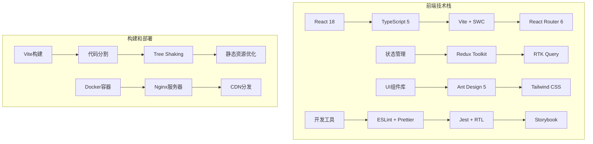

# 太上老君AI平台 - 前端开发指南

## 概述

太上老君AI平台前端采用现代化的React技术栈，提供高性能、可维护的用户界面。本指南涵盖前端架构设计、开发规范、组件库使用和性能优化等方面。

## 技术栈架构



## 项目结构

```typescript
// 前端项目结构
interface ProjectStructure {
  src: {
    components: {
      common: '通用组件';
      business: '业务组件';
      layout: '布局组件';
      forms: '表单组件';
    };
    pages: {
      auth: '认证页面';
      dashboard: '仪表板';
      workspace: 'AI工作空间';
      settings: '设置页面';
    };
    hooks: {
      api: 'API相关Hooks';
      business: '业务逻辑Hooks';
      common: '通用Hooks';
    };
    services: {
      api: 'API服务';
      auth: '认证服务';
      storage: '存储服务';
      websocket: 'WebSocket服务';
    };
    store: {
      slices: 'Redux切片';
      api: 'RTK Query API';
      middleware: '中间件';
    };
    utils: {
      helpers: '辅助函数';
      constants: '常量定义';
      validators: '验证器';
    };
    types: {
      api: 'API类型定义';
      common: '通用类型';
      components: '组件类型';
    };
    styles: {
      globals: '全局样式';
      components: '组件样式';
      themes: '主题配置';
    };
  };
}
```

## 核心配置

### 1. Vite配置

```typescript
// vite.config.ts
import { defineConfig } from 'vite';
import react from '@vitejs/plugin-react-swc';
import { resolve } from 'path';

export default defineConfig({
  plugins: [
    react({
      // SWC配置
      jsxImportSource: '@emotion/react',
      plugins: [
        ['@swc/plugin-emotion', {}]
      ]
    })
  ],
  
  resolve: {
    alias: {
      '@': resolve(__dirname, 'src'),
      '@components': resolve(__dirname, 'src/components'),
      '@pages': resolve(__dirname, 'src/pages'),
      '@hooks': resolve(__dirname, 'src/hooks'),
      '@services': resolve(__dirname, 'src/services'),
      '@store': resolve(__dirname, 'src/store'),
      '@utils': resolve(__dirname, 'src/utils'),
      '@types': resolve(__dirname, 'src/types'),
      '@styles': resolve(__dirname, 'src/styles'),
    },
  },
  
  server: {
    port: 3000,
    host: true,
    proxy: {
      '/api': {
        target: 'http://localhost:8080',
        changeOrigin: true,
        rewrite: (path) => path.replace(/^\/api/, ''),
      },
      '/ws': {
        target: 'ws://localhost:8080',
        ws: true,
        changeOrigin: true,
      },
    },
  },
  
  build: {
    target: 'es2020',
    outDir: 'dist',
    sourcemap: true,
    rollupOptions: {
      output: {
        manualChunks: {
          // 第三方库分包
          vendor: ['react', 'react-dom'],
          antd: ['antd', '@ant-design/icons'],
          router: ['react-router-dom'],
          state: ['@reduxjs/toolkit', 'react-redux'],
          utils: ['lodash-es', 'dayjs', 'classnames'],
        },
      },
    },
    chunkSizeWarningLimit: 1000,
  },
  
  optimizeDeps: {
    include: [
      'react',
      'react-dom',
      'antd',
      '@ant-design/icons',
      'react-router-dom',
      '@reduxjs/toolkit',
      'react-redux',
    ],
  },
});
```

### 2. TypeScript配置

```json
// tsconfig.json
{
  "compilerOptions": {
    "target": "ES2020",
    "lib": ["ES2020", "DOM", "DOM.Iterable"],
    "module": "ESNext",
    "skipLibCheck": true,
    "allowJs": false,
    
    /* Bundler mode */
    "moduleResolution": "bundler",
    "allowImportingTsExtensions": true,
    "resolveJsonModule": true,
    "isolatedModules": true,
    "noEmit": true,
    "jsx": "react-jsx",
    
    /* Linting */
    "strict": true,
    "noUnusedLocals": true,
    "noUnusedParameters": true,
    "noFallthroughCasesInSwitch": true,
    "exactOptionalPropertyTypes": true,
    "noImplicitReturns": true,
    "noImplicitOverride": true,
    
    /* Path mapping */
    "baseUrl": ".",
    "paths": {
      "@/*": ["src/*"],
      "@components/*": ["src/components/*"],
      "@pages/*": ["src/pages/*"],
      "@hooks/*": ["src/hooks/*"],
      "@services/*": ["src/services/*"],
      "@store/*": ["src/store/*"],
      "@utils/*": ["src/utils/*"],
      "@types/*": ["src/types/*"],
      "@styles/*": ["src/styles/*"]
    }
  },
  "include": ["src"],
  "references": [{ "path": "./tsconfig.node.json" }]
}
```

### 3. ESLint和Prettier配置

```json
// .eslintrc.json
{
  "extends": [
    "eslint:recommended",
    "@typescript-eslint/recommended",
    "react-hooks/recommended",
    "prettier"
  ],
  "parser": "@typescript-eslint/parser",
  "plugins": ["react-refresh", "@typescript-eslint", "react-hooks"],
  "rules": {
    "react-refresh/only-export-components": [
      "warn",
      { "allowConstantExport": true }
    ],
    "@typescript-eslint/no-unused-vars": ["error", { "argsIgnorePattern": "^_" }],
    "@typescript-eslint/explicit-function-return-type": "off",
    "@typescript-eslint/explicit-module-boundary-types": "off",
    "@typescript-eslint/no-explicit-any": "warn",
    "react-hooks/rules-of-hooks": "error",
    "react-hooks/exhaustive-deps": "warn",
    "prefer-const": "error",
    "no-var": "error"
  },
  "ignorePatterns": ["dist", ".eslintrc.cjs"]
}
```

```json
// .prettierrc
{
  "semi": true,
  "trailingComma": "es5",
  "singleQuote": true,
  "printWidth": 80,
  "tabWidth": 2,
  "useTabs": false,
  "bracketSpacing": true,
  "arrowParens": "avoid",
  "endOfLine": "lf"
}
```

## 状态管理

### 1. Redux Toolkit配置

```typescript
// src/store/index.ts
import { configureStore } from '@reduxjs/toolkit';
import { setupListeners } from '@reduxjs/toolkit/query';
import { authSlice } from './slices/authSlice';
import { uiSlice } from './slices/uiSlice';
import { apiSlice } from './api/apiSlice';

export const store = configureStore({
  reducer: {
    auth: authSlice.reducer,
    ui: uiSlice.reducer,
    api: apiSlice.reducer,
  },
  middleware: getDefaultMiddleware =>
    getDefaultMiddleware({
      serializableCheck: {
        ignoredActions: ['persist/PERSIST', 'persist/REHYDRATE'],
      },
    }).concat(apiSlice.middleware),
  devTools: process.env.NODE_ENV !== 'production',
});

setupListeners(store.dispatch);

export type RootState = ReturnType<typeof store.getState>;
export type AppDispatch = typeof store.dispatch;
```

### 2. 认证状态管理

```typescript
// src/store/slices/authSlice.ts
import { createSlice, PayloadAction } from '@reduxjs/toolkit';

interface User {
  id: string;
  email: string;
  username: string;
  avatar?: string;
  role: string;
  permissions: string[];
}

interface AuthState {
  user: User | null;
  token: string | null;
  isAuthenticated: boolean;
  isLoading: boolean;
  error: string | null;
}

const initialState: AuthState = {
  user: null,
  token: localStorage.getItem('token'),
  isAuthenticated: false,
  isLoading: false,
  error: null,
};

export const authSlice = createSlice({
  name: 'auth',
  initialState,
  reducers: {
    loginStart: state => {
      state.isLoading = true;
      state.error = null;
    },
    loginSuccess: (state, action: PayloadAction<{ user: User; token: string }>) => {
      state.isLoading = false;
      state.isAuthenticated = true;
      state.user = action.payload.user;
      state.token = action.payload.token;
      state.error = null;
      localStorage.setItem('token', action.payload.token);
    },
    loginFailure: (state, action: PayloadAction<string>) => {
      state.isLoading = false;
      state.isAuthenticated = false;
      state.user = null;
      state.token = null;
      state.error = action.payload;
      localStorage.removeItem('token');
    },
    logout: state => {
      state.isAuthenticated = false;
      state.user = null;
      state.token = null;
      state.error = null;
      localStorage.removeItem('token');
    },
    updateUser: (state, action: PayloadAction<Partial<User>>) => {
      if (state.user) {
        state.user = { ...state.user, ...action.payload };
      }
    },
  },
});

export const { loginStart, loginSuccess, loginFailure, logout, updateUser } = authSlice.actions;

// Selectors
export const selectAuth = (state: { auth: AuthState }) => state.auth;
export const selectUser = (state: { auth: AuthState }) => state.auth.user;
export const selectIsAuthenticated = (state: { auth: AuthState }) => state.auth.isAuthenticated;
```

### 3. RTK Query API配置

```typescript
// src/store/api/apiSlice.ts
import { createApi, fetchBaseQuery } from '@reduxjs/toolkit/query/react';
import type { RootState } from '../index';

const baseQuery = fetchBaseQuery({
  baseUrl: '/api',
  prepareHeaders: (headers, { getState }) => {
    const token = (getState() as RootState).auth.token;
    if (token) {
      headers.set('authorization', `Bearer ${token}`);
    }
    headers.set('content-type', 'application/json');
    return headers;
  },
});

export const apiSlice = createApi({
  reducerPath: 'api',
  baseQuery,
  tagTypes: ['User', 'Project', 'AIModel', 'Dataset'],
  endpoints: builder => ({}),
});
```

```typescript
// src/store/api/userApi.ts
import { apiSlice } from './apiSlice';

interface User {
  id: string;
  email: string;
  username: string;
  avatar?: string;
  role: string;
  createdAt: string;
  updatedAt: string;
}

interface CreateUserRequest {
  email: string;
  username: string;
  password: string;
}

interface UpdateUserRequest {
  username?: string;
  avatar?: string;
}

export const userApi = apiSlice.injectEndpoints({
  endpoints: builder => ({
    getUsers: builder.query<User[], { page?: number; limit?: number; search?: string }>({
      query: ({ page = 1, limit = 10, search }) => ({
        url: '/users',
        params: { page, limit, search },
      }),
      providesTags: ['User'],
    }),
    
    getUserById: builder.query<User, string>({
      query: id => `/users/${id}`,
      providesTags: (result, error, id) => [{ type: 'User', id }],
    }),
    
    createUser: builder.mutation<User, CreateUserRequest>({
      query: userData => ({
        url: '/users',
        method: 'POST',
        body: userData,
      }),
      invalidatesTags: ['User'],
    }),
    
    updateUser: builder.mutation<User, { id: string; data: UpdateUserRequest }>({
      query: ({ id, data }) => ({
        url: `/users/${id}`,
        method: 'PUT',
        body: data,
      }),
      invalidatesTags: (result, error, { id }) => [{ type: 'User', id }],
    }),
    
    deleteUser: builder.mutation<void, string>({
      query: id => ({
        url: `/users/${id}`,
        method: 'DELETE',
      }),
      invalidatesTags: ['User'],
    }),
  }),
});

export const {
  useGetUsersQuery,
  useGetUserByIdQuery,
  useCreateUserMutation,
  useUpdateUserMutation,
  useDeleteUserMutation,
} = userApi;
```

## 组件开发

### 1. 组件设计原则

```typescript
// 组件设计原则示例
interface ComponentDesignPrinciples {
  // 单一职责原则
  singleResponsibility: '每个组件只负责一个功能';
  
  // 可复用性
  reusability: '组件应该是通用的，可在多个地方使用';
  
  // 可组合性
  composability: '小组件可以组合成大组件';
  
  // 可测试性
  testability: '组件应该易于测试';
  
  // 性能优化
  performance: '使用memo、useMemo、useCallback优化性能';
}
```

### 2. 通用组件示例

```typescript
// src/components/common/Button/Button.tsx
import React, { forwardRef } from 'react';
import { Button as AntButton, ButtonProps as AntButtonProps } from 'antd';
import { LoadingOutlined } from '@ant-design/icons';
import classNames from 'classnames';
import './Button.scss';

export interface ButtonProps extends Omit<AntButtonProps, 'loading'> {
  variant?: 'primary' | 'secondary' | 'danger' | 'ghost';
  size?: 'small' | 'medium' | 'large';
  loading?: boolean;
  fullWidth?: boolean;
  children: React.ReactNode;
}

export const Button = forwardRef<HTMLButtonElement, ButtonProps>(
  (
    {
      variant = 'primary',
      size = 'medium',
      loading = false,
      fullWidth = false,
      className,
      children,
      disabled,
      ...props
    },
    ref
  ) => {
    const buttonClasses = classNames(
      'custom-button',
      `custom-button--${variant}`,
      `custom-button--${size}`,
      {
        'custom-button--full-width': fullWidth,
        'custom-button--loading': loading,
      },
      className
    );

    return (
      <AntButton
        ref={ref}
        className={buttonClasses}
        disabled={disabled || loading}
        icon={loading ? <LoadingOutlined /> : undefined}
        {...props}
      >
        {children}
      </AntButton>
    );
  }
);

Button.displayName = 'Button';
```

```typescript
// src/components/common/Modal/Modal.tsx
import React, { useCallback } from 'react';
import { Modal as AntModal, ModalProps as AntModalProps } from 'antd';
import { Button } from '../Button/Button';
import './Modal.scss';

export interface ModalProps extends Omit<AntModalProps, 'footer'> {
  title: string;
  children: React.ReactNode;
  onConfirm?: () => void | Promise<void>;
  onCancel?: () => void;
  confirmText?: string;
  cancelText?: string;
  confirmLoading?: boolean;
  showFooter?: boolean;
  footerContent?: React.ReactNode;
}

export const Modal: React.FC<ModalProps> = ({
  title,
  children,
  onConfirm,
  onCancel,
  confirmText = '确认',
  cancelText = '取消',
  confirmLoading = false,
  showFooter = true,
  footerContent,
  ...props
}) => {
  const handleConfirm = useCallback(async () => {
    if (onConfirm) {
      await onConfirm();
    }
  }, [onConfirm]);

  const footer = showFooter ? (
    footerContent || (
      <div className="modal-footer">
        <Button variant="secondary" onClick={onCancel}>
          {cancelText}
        </Button>
        <Button
          variant="primary"
          loading={confirmLoading}
          onClick={handleConfirm}
        >
          {confirmText}
        </Button>
      </div>
    )
  ) : null;

  return (
    <AntModal
      title={title}
      footer={footer}
      onCancel={onCancel}
      className="custom-modal"
      {...props}
    >
      {children}
    </AntModal>
  );
};
```

### 3. 业务组件示例

```typescript
// src/components/business/UserCard/UserCard.tsx
import React, { memo, useCallback } from 'react';
import { Card, Avatar, Tag, Dropdown, MenuProps } from 'antd';
import { MoreOutlined, EditOutlined, DeleteOutlined } from '@ant-design/icons';
import { User } from '@types/user';
import { Button } from '@components/common/Button/Button';
import './UserCard.scss';

interface UserCardProps {
  user: User;
  onEdit?: (user: User) => void;
  onDelete?: (userId: string) => void;
  onView?: (userId: string) => void;
  loading?: boolean;
  className?: string;
}

export const UserCard = memo<UserCardProps>(({
  user,
  onEdit,
  onDelete,
  onView,
  loading = false,
  className,
}) => {
  const handleEdit = useCallback(() => {
    onEdit?.(user);
  }, [user, onEdit]);

  const handleDelete = useCallback(() => {
    onDelete?.(user.id);
  }, [user.id, onDelete]);

  const handleView = useCallback(() => {
    onView?.(user.id);
  }, [user.id, onView]);

  const menuItems: MenuProps['items'] = [
    {
      key: 'edit',
      label: '编辑',
      icon: <EditOutlined />,
      onClick: handleEdit,
    },
    {
      key: 'delete',
      label: '删除',
      icon: <DeleteOutlined />,
      onClick: handleDelete,
      danger: true,
    },
  ];

  return (
    <Card
      className={`user-card ${className || ''}`}
      loading={loading}
      actions={[
        <Button key="view" variant="ghost" onClick={handleView}>
          查看详情
        </Button>,
      ]}
      extra={
        <Dropdown menu={{ items: menuItems }} trigger={['click']}>
          <Button variant="ghost" size="small">
            <MoreOutlined />
          </Button>
        </Dropdown>
      }
    >
      <Card.Meta
        avatar={
          <Avatar
            size={64}
            src={user.avatar}
            alt={user.username}
          >
            {user.username.charAt(0).toUpperCase()}
          </Avatar>
        }
        title={
          <div className="user-card__title">
            <span>{user.username}</span>
            <Tag color={user.role === 'admin' ? 'red' : 'blue'}>
              {user.role}
            </Tag>
          </div>
        }
        description={
          <div className="user-card__description">
            <p>{user.email}</p>
            <p className="user-card__date">
              注册时间: {new Date(user.createdAt).toLocaleDateString()}
            </p>
          </div>
        }
      />
    </Card>
  );
});

UserCard.displayName = 'UserCard';
```

## 自定义Hooks

### 1. API相关Hooks

```typescript
// src/hooks/api/useApi.ts
import { useState, useCallback } from 'react';
import { message } from 'antd';

interface UseApiOptions<T> {
  onSuccess?: (data: T) => void;
  onError?: (error: Error) => void;
  showSuccessMessage?: boolean;
  showErrorMessage?: boolean;
  successMessage?: string;
}

export function useApi<T = any, P = any>(
  apiFunction: (params: P) => Promise<T>,
  options: UseApiOptions<T> = {}
) {
  const [loading, setLoading] = useState(false);
  const [error, setError] = useState<Error | null>(null);
  const [data, setData] = useState<T | null>(null);

  const execute = useCallback(
    async (params: P) => {
      try {
        setLoading(true);
        setError(null);
        
        const result = await apiFunction(params);
        setData(result);
        
        if (options.showSuccessMessage) {
          message.success(options.successMessage || '操作成功');
        }
        
        options.onSuccess?.(result);
        return result;
      } catch (err) {
        const error = err as Error;
        setError(error);
        
        if (options.showErrorMessage !== false) {
          message.error(error.message || '操作失败');
        }
        
        options.onError?.(error);
        throw error;
      } finally {
        setLoading(false);
      }
    },
    [apiFunction, options]
  );

  return {
    loading,
    error,
    data,
    execute,
  };
}
```

### 2. 表单相关Hooks

```typescript
// src/hooks/common/useForm.ts
import { useState, useCallback, useMemo } from 'react';

interface ValidationRule<T> {
  required?: boolean;
  minLength?: number;
  maxLength?: number;
  pattern?: RegExp;
  custom?: (value: T) => string | null;
}

interface FieldConfig<T> {
  initialValue: T;
  validation?: ValidationRule<T>;
}

type FormConfig<T> = {
  [K in keyof T]: FieldConfig<T[K]>;
};

export function useForm<T extends Record<string, any>>(config: FormConfig<T>) {
  const initialValues = useMemo(
    () =>
      Object.keys(config).reduce(
        (acc, key) => ({
          ...acc,
          [key]: config[key].initialValue,
        }),
        {} as T
      ),
    [config]
  );

  const [values, setValues] = useState<T>(initialValues);
  const [errors, setErrors] = useState<Partial<Record<keyof T, string>>>({});
  const [touched, setTouched] = useState<Partial<Record<keyof T, boolean>>>({});

  const validateField = useCallback(
    (name: keyof T, value: T[keyof T]) => {
      const fieldConfig = config[name];
      if (!fieldConfig?.validation) return null;

      const { required, minLength, maxLength, pattern, custom } = fieldConfig.validation;

      if (required && (!value || (typeof value === 'string' && !value.trim()))) {
        return '此字段为必填项';
      }

      if (typeof value === 'string') {
        if (minLength && value.length < minLength) {
          return `最少需要 ${minLength} 个字符`;
        }
        if (maxLength && value.length > maxLength) {
          return `最多允许 ${maxLength} 个字符`;
        }
        if (pattern && !pattern.test(value)) {
          return '格式不正确';
        }
      }

      if (custom) {
        return custom(value);
      }

      return null;
    },
    [config]
  );

  const setValue = useCallback(
    (name: keyof T, value: T[keyof T]) => {
      setValues(prev => ({ ...prev, [name]: value }));
      
      // 实时验证
      const error = validateField(name, value);
      setErrors(prev => ({ ...prev, [name]: error || undefined }));
    },
    [validateField]
  );

  const setFieldTouched = useCallback((name: keyof T, isTouched = true) => {
    setTouched(prev => ({ ...prev, [name]: isTouched }));
  }, []);

  const validateAll = useCallback(() => {
    const newErrors: Partial<Record<keyof T, string>> = {};
    let isValid = true;

    Object.keys(config).forEach(key => {
      const error = validateField(key as keyof T, values[key as keyof T]);
      if (error) {
        newErrors[key as keyof T] = error;
        isValid = false;
      }
    });

    setErrors(newErrors);
    setTouched(
      Object.keys(config).reduce(
        (acc, key) => ({ ...acc, [key]: true }),
        {} as Record<keyof T, boolean>
      )
    );

    return isValid;
  }, [config, values, validateField]);

  const reset = useCallback(() => {
    setValues(initialValues);
    setErrors({});
    setTouched({});
  }, [initialValues]);

  const getFieldProps = useCallback(
    (name: keyof T) => ({
      value: values[name],
      onChange: (value: T[keyof T]) => setValue(name, value),
      onBlur: () => setFieldTouched(name),
      error: touched[name] ? errors[name] : undefined,
    }),
    [values, errors, touched, setValue, setFieldTouched]
  );

  return {
    values,
    errors,
    touched,
    setValue,
    setFieldTouched,
    validateAll,
    reset,
    getFieldProps,
    isValid: Object.keys(errors).length === 0,
  };
}
```

### 3. 业务逻辑Hooks

```typescript
// src/hooks/business/useAuth.ts
import { useCallback } from 'react';
import { useDispatch, useSelector } from 'react-redux';
import { useNavigate } from 'react-router-dom';
import { loginStart, loginSuccess, loginFailure, logout } from '@store/slices/authSlice';
import { selectAuth } from '@store/slices/authSlice';
import { authService } from '@services/auth';

interface LoginCredentials {
  email: string;
  password: string;
}

export function useAuth() {
  const dispatch = useDispatch();
  const navigate = useNavigate();
  const auth = useSelector(selectAuth);

  const login = useCallback(
    async (credentials: LoginCredentials) => {
      try {
        dispatch(loginStart());
        const response = await authService.login(credentials);
        dispatch(loginSuccess(response));
        navigate('/dashboard');
      } catch (error) {
        dispatch(loginFailure((error as Error).message));
        throw error;
      }
    },
    [dispatch, navigate]
  );

  const logoutUser = useCallback(() => {
    dispatch(logout());
    authService.logout();
    navigate('/login');
  }, [dispatch, navigate]);

  const hasPermission = useCallback(
    (permission: string) => {
      return auth.user?.permissions.includes(permission) || false;
    },
    [auth.user?.permissions]
  );

  const hasRole = useCallback(
    (role: string) => {
      return auth.user?.role === role;
    },
    [auth.user?.role]
  );

  return {
    ...auth,
    login,
    logout: logoutUser,
    hasPermission,
    hasRole,
  };
}
```

## 路由配置

### 1. 路由结构

```typescript
// src/router/index.tsx
import React, { Suspense } from 'react';
import { createBrowserRouter, Navigate } from 'react-router-dom';
import { Spin } from 'antd';
import { ProtectedRoute } from './ProtectedRoute';
import { Layout } from '@components/layout/Layout';

// 懒加载页面组件
const LoginPage = React.lazy(() => import('@pages/auth/LoginPage'));
const RegisterPage = React.lazy(() => import('@pages/auth/RegisterPage'));
const DashboardPage = React.lazy(() => import('@pages/dashboard/DashboardPage'));
const WorkspacePage = React.lazy(() => import('@pages/workspace/WorkspacePage'));
const SettingsPage = React.lazy(() => import('@pages/settings/SettingsPage'));
const UserManagementPage = React.lazy(() => import('@pages/admin/UserManagementPage'));

const LoadingFallback = () => (
  <div className="flex items-center justify-center h-64">
    <Spin size="large" />
  </div>
);

export const router = createBrowserRouter([
  {
    path: '/',
    element: <Navigate to="/dashboard" replace />,
  },
  {
    path: '/login',
    element: (
      <Suspense fallback={<LoadingFallback />}>
        <LoginPage />
      </Suspense>
    ),
  },
  {
    path: '/register',
    element: (
      <Suspense fallback={<LoadingFallback />}>
        <RegisterPage />
      </Suspense>
    ),
  },
  {
    path: '/',
    element: (
      <ProtectedRoute>
        <Layout />
      </ProtectedRoute>
    ),
    children: [
      {
        path: 'dashboard',
        element: (
          <Suspense fallback={<LoadingFallback />}>
            <DashboardPage />
          </Suspense>
        ),
      },
      {
        path: 'workspace',
        element: (
          <Suspense fallback={<LoadingFallback />}>
            <WorkspacePage />
          </Suspense>
        ),
      },
      {
        path: 'settings',
        element: (
          <Suspense fallback={<LoadingFallback />}>
            <SettingsPage />
          </Suspense>
        ),
      },
      {
        path: 'admin',
        element: (
          <ProtectedRoute requiredRole="admin">
            <div />
          </ProtectedRoute>
        ),
        children: [
          {
            path: 'users',
            element: (
              <Suspense fallback={<LoadingFallback />}>
                <UserManagementPage />
              </Suspense>
            ),
          },
        ],
      },
    ],
  },
]);
```

### 2. 路由守卫

```typescript
// src/router/ProtectedRoute.tsx
import React from 'react';
import { Navigate, useLocation } from 'react-router-dom';
import { useAuth } from '@hooks/business/useAuth';
import { Spin } from 'antd';

interface ProtectedRouteProps {
  children: React.ReactNode;
  requiredRole?: string;
  requiredPermission?: string;
}

export const ProtectedRoute: React.FC<ProtectedRouteProps> = ({
  children,
  requiredRole,
  requiredPermission,
}) => {
  const { isAuthenticated, isLoading, hasRole, hasPermission } = useAuth();
  const location = useLocation();

  if (isLoading) {
    return (
      <div className="flex items-center justify-center h-screen">
        <Spin size="large" />
      </div>
    );
  }

  if (!isAuthenticated) {
    return <Navigate to="/login" state={{ from: location }} replace />;
  }

  if (requiredRole && !hasRole(requiredRole)) {
    return <Navigate to="/dashboard" replace />;
  }

  if (requiredPermission && !hasPermission(requiredPermission)) {
    return <Navigate to="/dashboard" replace />;
  }

  return <>{children}</>;
};
```

## 样式管理

### 1. Tailwind CSS配置

```javascript
// tailwind.config.js
/** @type {import('tailwindcss').Config} */
export default {
  content: [
    "./index.html",
    "./src/**/*.{js,ts,jsx,tsx}",
  ],
  theme: {
    extend: {
      colors: {
        primary: {
          50: '#f0f9ff',
          500: '#3b82f6',
          600: '#2563eb',
          700: '#1d4ed8',
        },
        gray: {
          50: '#f9fafb',
          100: '#f3f4f6',
          200: '#e5e7eb',
          500: '#6b7280',
          900: '#111827',
        },
      },
      fontFamily: {
        sans: ['Inter', 'system-ui', 'sans-serif'],
      },
      spacing: {
        '18': '4.5rem',
        '88': '22rem',
      },
      animation: {
        'fade-in': 'fadeIn 0.5s ease-in-out',
        'slide-up': 'slideUp 0.3s ease-out',
      },
      keyframes: {
        fadeIn: {
          '0%': { opacity: '0' },
          '100%': { opacity: '1' },
        },
        slideUp: {
          '0%': { transform: 'translateY(10px)', opacity: '0' },
          '100%': { transform: 'translateY(0)', opacity: '1' },
        },
      },
    },
  },
  plugins: [
    require('@tailwindcss/forms'),
    require('@tailwindcss/typography'),
  ],
  corePlugins: {
    preflight: false, // 禁用Tailwind的reset，避免与Ant Design冲突
  },
}
```

### 2. 主题配置

```typescript
// src/styles/theme.ts
import { theme } from 'antd';

export const customTheme = {
  token: {
    // 主色调
    colorPrimary: '#1890ff',
    colorSuccess: '#52c41a',
    colorWarning: '#faad14',
    colorError: '#ff4d4f',
    colorInfo: '#1890ff',
    
    // 字体
    fontFamily: 'Inter, -apple-system, BlinkMacSystemFont, "Segoe UI", Roboto, sans-serif',
    fontSize: 14,
    fontSizeHeading1: 38,
    fontSizeHeading2: 30,
    fontSizeHeading3: 24,
    
    // 圆角
    borderRadius: 6,
    borderRadiusLG: 8,
    borderRadiusSM: 4,
    
    // 间距
    padding: 16,
    paddingLG: 24,
    paddingSM: 12,
    paddingXS: 8,
    
    // 阴影
    boxShadow: '0 2px 8px rgba(0, 0, 0, 0.15)',
    boxShadowSecondary: '0 4px 12px rgba(0, 0, 0, 0.15)',
  },
  components: {
    Button: {
      borderRadius: 6,
      controlHeight: 40,
      paddingContentHorizontal: 16,
    },
    Input: {
      borderRadius: 6,
      controlHeight: 40,
      paddingInline: 12,
    },
    Card: {
      borderRadius: 8,
      paddingLG: 24,
    },
    Modal: {
      borderRadius: 8,
    },
  },
  algorithm: theme.defaultAlgorithm,
};
```

## 性能优化

### 1. 组件优化

```typescript
// 使用React.memo优化组件渲染
export const OptimizedComponent = memo(({ data, onAction }: Props) => {
  // 使用useMemo缓存计算结果
  const processedData = useMemo(() => {
    return data.map(item => ({
      ...item,
      processed: expensiveCalculation(item),
    }));
  }, [data]);

  // 使用useCallback缓存事件处理函数
  const handleAction = useCallback((id: string) => {
    onAction(id);
  }, [onAction]);

  return (
    <div>
      {processedData.map(item => (
        <ItemComponent
          key={item.id}
          item={item}
          onAction={handleAction}
        />
      ))}
    </div>
  );
});
```

### 2. 虚拟滚动

```typescript
// src/components/common/VirtualList/VirtualList.tsx
import React, { useMemo } from 'react';
import { FixedSizeList as List } from 'react-window';

interface VirtualListProps<T> {
  items: T[];
  itemHeight: number;
  height: number;
  renderItem: (item: T, index: number) => React.ReactNode;
}

export function VirtualList<T>({
  items,
  itemHeight,
  height,
  renderItem,
}: VirtualListProps<T>) {
  const Row = useMemo(
    () =>
      ({ index, style }: { index: number; style: React.CSSProperties }) => (
        <div style={style}>
          {renderItem(items[index], index)}
        </div>
      ),
    [items, renderItem]
  );

  return (
    <List
      height={height}
      itemCount={items.length}
      itemSize={itemHeight}
      width="100%"
    >
      {Row}
    </List>
  );
}
```

### 3. 图片懒加载

```typescript
// src/components/common/LazyImage/LazyImage.tsx
import React, { useState, useRef, useEffect } from 'react';

interface LazyImageProps {
  src: string;
  alt: string;
  placeholder?: string;
  className?: string;
}

export const LazyImage: React.FC<LazyImageProps> = ({
  src,
  alt,
  placeholder = '/placeholder.png',
  className,
}) => {
  const [isLoaded, setIsLoaded] = useState(false);
  const [isInView, setIsInView] = useState(false);
  const imgRef = useRef<HTMLImageElement>(null);

  useEffect(() => {
    const observer = new IntersectionObserver(
      ([entry]) => {
        if (entry.isIntersecting) {
          setIsInView(true);
          observer.disconnect();
        }
      },
      { threshold: 0.1 }
    );

    if (imgRef.current) {
      observer.observe(imgRef.current);
    }

    return () => observer.disconnect();
  }, []);

  return (
     setIsLoaded(true)}
      style={{
        opacity: isLoaded ? 1 : 0.7,
        transition: 'opacity 0.3s ease',
      }}
    />
  );
};
```

## 测试策略

### 1. 组件测试

```typescript
// src/components/common/Button/Button.test.tsx
import React from 'react';
import { render, screen, fireEvent } from '@testing-library/react';
import { Button } from './Button';

describe('Button', () => {
  it('renders with correct text', () => {
    render(<Button>Click me</Button>);
    expect(screen.getByText('Click me')).toBeInTheDocument();
  });

  it('calls onClick when clicked', () => {
    const handleClick = jest.fn();
    render(<Button onClick={handleClick}>Click me</Button>);
    
    fireEvent.click(screen.getByText('Click me'));
    expect(handleClick).toHaveBeenCalledTimes(1);
  });

  it('shows loading state', () => {
    render(<Button loading>Loading</Button>);
    expect(screen.getByRole('button')).toBeDisabled();
  });

  it('applies custom className', () => {
    render(<Button className="custom-class">Button</Button>);
    expect(screen.getByRole('button')).toHaveClass('custom-class');
  });
});
```

### 2. Hook测试

```typescript
// src/hooks/common/useForm.test.ts
import { renderHook, act } from '@testing-library/react';
import { useForm } from './useForm';

describe('useForm', () => {
  const formConfig = {
    email: {
      initialValue: '',
      validation: {
        required: true,
        pattern: /^[^\s@]+@[^\s@]+\.[^\s@]+$/,
      },
    },
    password: {
      initialValue: '',
      validation: {
        required: true,
        minLength: 6,
      },
    },
  };

  it('initializes with correct values', () => {
    const { result } = renderHook(() => useForm(formConfig));
    
    expect(result.current.values).toEqual({
      email: '',
      password: '',
    });
    expect(result.current.isValid).toBe(true);
  });

  it('validates required fields', () => {
    const { result } = renderHook(() => useForm(formConfig));
    
    act(() => {
      result.current.validateAll();
    });
    
    expect(result.current.errors.email).toBe('此字段为必填项');
    expect(result.current.errors.password).toBe('此字段为必填项');
    expect(result.current.isValid).toBe(false);
  });

  it('validates email format', () => {
    const { result } = renderHook(() => useForm(formConfig));
    
    act(() => {
      result.current.setValue('email', 'invalid-email');
    });
    
    expect(result.current.errors.email).toBe('格式不正确');
  });
});
```

## 相关文档链接

- [开发指南概览](./development-overview.md)
- [环境搭建指南](./environment-setup.md)
- [后端开发指南](./backend-development.md)
- [AI开发指南](./ai-development.md)
- [测试指南](./testing-guide.md)
- [API文档](../06-API文档/api-overview.md)
- [组件库文档](./component-library.md)