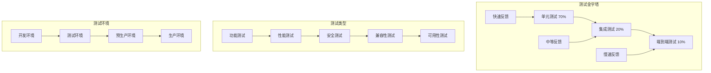

# 太上老君AI平台 - 测试指南

## 概述

太上老君AI平台采用全面的测试策略，确保代码质量和系统稳定性。本指南涵盖单元测试、集成测试、端到端测试和性能测试等方面。

## 测试策略



## 测试框架和工具

### 前端测试
- **Jest**: JavaScript测试框架
- **React Testing Library**: React组件测试
- **Cypress**: 端到端测试
- **Storybook**: 组件可视化测试
- **MSW**: API模拟

### 后端测试
- **Go Testing**: Go内置测试框架
- **Testify**: Go测试断言库
- **Ginkgo**: BDD测试框架
- **Gomega**: 匹配器库
- **Testcontainers**: 集成测试容器

### AI服务测试
- **pytest**: Python测试框架
- **pytest-asyncio**: 异步测试支持
- **httpx**: HTTP客户端测试
- **factory_boy**: 测试数据工厂
- **responses**: HTTP响应模拟

## 前端测试

### 1. 组件单元测试

```typescript
// src/components/Button/__tests__/Button.test.tsx
import React from 'react';
import { render, screen, fireEvent } from '@testing-library/react';
import '@testing-library/jest-dom';
import { Button } from '../Button';

describe('Button Component', () => {
  it('renders button with text', () => {
    render(<Button>Click me</Button>);
    expect(screen.getByRole('button')).toHaveTextContent('Click me');
  });

  it('handles click events', () => {
    const handleClick = jest.fn();
    render(<Button onClick={handleClick}>Click me</Button>);
    
    fireEvent.click(screen.getByRole('button'));
    expect(handleClick).toHaveBeenCalledTimes(1);
  });

  it('applies correct variant styles', () => {
    render(<Button variant="primary">Primary Button</Button>);
    expect(screen.getByRole('button')).toHaveClass('btn-primary');
  });

  it('disables button when loading', () => {
    render(<Button loading>Loading Button</Button>);
    expect(screen.getByRole('button')).toBeDisabled();
    expect(screen.getByTestId('loading-spinner')).toBeInTheDocument();
  });

  it('renders with correct size', () => {
    render(<Button size="large">Large Button</Button>);
    expect(screen.getByRole('button')).toHaveClass('btn-large');
  });
});
```

### 2. Hook测试

```typescript
// src/hooks/__tests__/useAuth.test.ts
import { renderHook, act } from '@testing-library/react';
import { useAuth } from '../useAuth';
import { AuthProvider } from '../../contexts/AuthContext';
import { QueryClient, QueryClientProvider } from '@tanstack/react-query';

const createWrapper = () => {
  const queryClient = new QueryClient({
    defaultOptions: {
      queries: { retry: false },
      mutations: { retry: false },
    },
  });

  return ({ children }: { children: React.ReactNode }) => (
    <QueryClientProvider client={queryClient}>
      <AuthProvider>{children}</AuthProvider>
    </QueryClientProvider>
  );
};

describe('useAuth Hook', () => {
  it('should login successfully', async () => {
    const { result } = renderHook(() => useAuth(), {
      wrapper: createWrapper(),
    });

    await act(async () => {
      await result.current.login('test@example.com', 'password');
    });

    expect(result.current.user).toBeDefined();
    expect(result.current.isAuthenticated).toBe(true);
  });

  it('should handle login error', async () => {
    const { result } = renderHook(() => useAuth(), {
      wrapper: createWrapper(),
    });

    await act(async () => {
      try {
        await result.current.login('invalid@example.com', 'wrongpassword');
      } catch (error) {
        expect(error).toBeDefined();
      }
    });

    expect(result.current.user).toBeNull();
    expect(result.current.isAuthenticated).toBe(false);
  });

  it('should logout successfully', async () => {
    const { result } = renderHook(() => useAuth(), {
      wrapper: createWrapper(),
    });

    // 先登录
    await act(async () => {
      await result.current.login('test@example.com', 'password');
    });

    // 再登出
    await act(async () => {
      await result.current.logout();
    });

    expect(result.current.user).toBeNull();
    expect(result.current.isAuthenticated).toBe(false);
  });
});
```

### 3. 页面集成测试

```typescript
// src/pages/__tests__/ChatPage.test.tsx
import React from 'react';
import { render, screen, fireEvent, waitFor } from '@testing-library/react';
import { BrowserRouter } from 'react-router-dom';
import { QueryClient, QueryClientProvider } from '@tanstack/react-query';
import { ChatPage } from '../ChatPage';
import { AuthProvider } from '../../contexts/AuthContext';
import { server } from '../../mocks/server';

const createWrapper = () => {
  const queryClient = new QueryClient({
    defaultOptions: {
      queries: { retry: false },
      mutations: { retry: false },
    },
  });

  return ({ children }: { children: React.ReactNode }) => (
    <QueryClientProvider client={queryClient}>
      <BrowserRouter>
        <AuthProvider>{children}</AuthProvider>
      </BrowserRouter>
    </QueryClientProvider>
  );
};

describe('ChatPage', () => {
  beforeAll(() => server.listen());
  afterEach(() => server.resetHandlers());
  afterAll(() => server.close());

  it('renders chat interface', async () => {
    render(<ChatPage />, { wrapper: createWrapper() });

    expect(screen.getByPlaceholderText('输入消息...')).toBeInTheDocument();
    expect(screen.getByRole('button', { name: '发送' })).toBeInTheDocument();
  });

  it('sends message and receives response', async () => {
    render(<ChatPage />, { wrapper: createWrapper() });

    const input = screen.getByPlaceholderText('输入消息...');
    const sendButton = screen.getByRole('button', { name: '发送' });

    fireEvent.change(input, { target: { value: 'Hello, AI!' } });
    fireEvent.click(sendButton);

    await waitFor(() => {
      expect(screen.getByText('Hello, AI!')).toBeInTheDocument();
    });

    await waitFor(() => {
      expect(screen.getByText(/AI response/)).toBeInTheDocument();
    });
  });

  it('handles message sending error', async () => {
    // 模拟API错误
    server.use(
      rest.post('/api/v1/chat/sessions/:sessionId/messages', (req, res, ctx) => {
        return res(ctx.status(500), ctx.json({ error: 'Server error' }));
      })
    );

    render(<ChatPage />, { wrapper: createWrapper() });

    const input = screen.getByPlaceholderText('输入消息...');
    const sendButton = screen.getByRole('button', { name: '发送' });

    fireEvent.change(input, { target: { value: 'Hello, AI!' } });
    fireEvent.click(sendButton);

    await waitFor(() => {
      expect(screen.getByText(/发送失败/)).toBeInTheDocument();
    });
  });
});
```

### 4. E2E测试 (Cypress)

```typescript
// cypress/e2e/chat.cy.ts
describe('Chat Functionality', () => {
  beforeEach(() => {
    // 登录
    cy.login('test@example.com', 'password');
    cy.visit('/chat');
  });

  it('should create new chat session and send message', () => {
    // 创建新会话
    cy.get('[data-testid="new-chat-button"]').click();
    cy.get('[data-testid="model-select"]').select('gpt-3.5-turbo');
    cy.get('[data-testid="create-session-button"]').click();

    // 发送消息
    cy.get('[data-testid="message-input"]').type('Hello, how are you?');
    cy.get('[data-testid="send-button"]').click();

    // 验证消息显示
    cy.get('[data-testid="message-list"]').should('contain', 'Hello, how are you?');
    
    // 等待AI回复
    cy.get('[data-testid="ai-message"]', { timeout: 10000 }).should('be.visible');
  });

  it('should handle stream response', () => {
    cy.get('[data-testid="new-chat-button"]').click();
    cy.get('[data-testid="stream-toggle"]').check();
    cy.get('[data-testid="create-session-button"]').click();

    cy.get('[data-testid="message-input"]').type('Tell me a story');
    cy.get('[data-testid="send-button"]').click();

    // 验证流式响应
    cy.get('[data-testid="streaming-indicator"]').should('be.visible');
    cy.get('[data-testid="ai-message"]').should('contain.text', 'Once upon a time');
  });

  it('should save and load chat history', () => {
    // 发送消息
    cy.get('[data-testid="message-input"]').type('Remember this: test message');
    cy.get('[data-testid="send-button"]').click();

    // 刷新页面
    cy.reload();

    // 验证历史记录
    cy.get('[data-testid="message-list"]').should('contain', 'Remember this: test message');
  });
});
```

## 后端测试

### 1. 单元测试

```go
// internal/service/user_service_test.go
package service

import (
    "context"
    "testing"
    "time"

    "github.com/google/uuid"
    "github.com/stretchr/testify/assert"
    "github.com/stretchr/testify/mock"
    "github.com/stretchr/testify/suite"

    "github.com/taishanglaojun/platform/internal/model"
    "github.com/taishanglaojun/platform/internal/repository/mocks"
    "github.com/taishanglaojun/platform/pkg/cache/mocks"
    "github.com/taishanglaojun/platform/pkg/validator"
)

type UserServiceTestSuite struct {
    suite.Suite
    userRepo    *mocks.UserRepository
    cache       *mocks.Redis
    validator   *validator.Validator
    userService UserService
}

func (suite *UserServiceTestSuite) SetupTest() {
    suite.userRepo = new(mocks.UserRepository)
    suite.cache = new(mocks.Redis)
    suite.validator = validator.New()
    suite.userService = NewUserService(
        suite.userRepo,
        suite.cache,
        suite.validator,
        logger,
    )
}

func (suite *UserServiceTestSuite) TestCreateUser_Success() {
    // Arrange
    req := &model.CreateUserRequest{
        Email:    "test@example.com",
        Username: "testuser",
        Password: "password123",
        Role:     model.RoleUser,
    }

    suite.userRepo.On("GetByEmail", mock.Anything, req.Email).
        Return(nil, repository.ErrUserNotFound)
    suite.userRepo.On("GetByUsername", mock.Anything, req.Username).
        Return(nil, repository.ErrUserNotFound)
    suite.userRepo.On("Create", mock.Anything, mock.AnythingOfType("*model.User")).
        Return(nil)

    // Act
    user, err := suite.userService.CreateUser(context.Background(), req)

    // Assert
    assert.NoError(suite.T(), err)
    assert.NotNil(suite.T(), user)
    assert.Equal(suite.T(), req.Email, user.Email)
    assert.Equal(suite.T(), req.Username, user.Username)
    assert.Equal(suite.T(), req.Role, user.Role)
    assert.NotEmpty(suite.T(), user.PasswordHash)
    
    suite.userRepo.AssertExpectations(suite.T())
}

func (suite *UserServiceTestSuite) TestCreateUser_EmailExists() {
    // Arrange
    req := &model.CreateUserRequest{
        Email:    "existing@example.com",
        Username: "testuser",
        Password: "password123",
        Role:     model.RoleUser,
    }

    existingUser := &model.User{
        ID:    uuid.New(),
        Email: req.Email,
    }

    suite.userRepo.On("GetByEmail", mock.Anything, req.Email).
        Return(existingUser, nil)

    // Act
    user, err := suite.userService.CreateUser(context.Background(), req)

    // Assert
    assert.Error(suite.T(), err)
    assert.Nil(suite.T(), user)
    assert.Equal(suite.T(), ErrEmailAlreadyExists, err)
    
    suite.userRepo.AssertExpectations(suite.T())
}

func (suite *UserServiceTestSuite) TestGetUserByID_FromCache() {
    // Arrange
    userID := uuid.New()
    cachedUser := &model.User{
        ID:       userID,
        Email:    "test@example.com",
        Username: "testuser",
    }

    suite.cache.On("Get", mock.Anything, fmt.Sprintf("user:%s", userID.String()), mock.Anything).
        Run(func(args mock.Arguments) {
            user := args.Get(2).(*model.User)
            *user = *cachedUser
        }).
        Return(nil)

    // Act
    user, err := suite.userService.GetUserByID(context.Background(), userID)

    // Assert
    assert.NoError(suite.T(), err)
    assert.NotNil(suite.T(), user)
    assert.Equal(suite.T(), cachedUser.ID, user.ID)
    assert.Equal(suite.T(), cachedUser.Email, user.Email)
    
    suite.cache.AssertExpectations(suite.T())
    suite.userRepo.AssertNotCalled(suite.T(), "GetByID")
}

func (suite *UserServiceTestSuite) TestGetUserByID_FromDatabase() {
    // Arrange
    userID := uuid.New()
    dbUser := &model.User{
        ID:       userID,
        Email:    "test@example.com",
        Username: "testuser",
    }

    suite.cache.On("Get", mock.Anything, fmt.Sprintf("user:%s", userID.String()), mock.Anything).
        Return(cache.ErrCacheNotFound)
    suite.userRepo.On("GetByID", mock.Anything, userID).
        Return(dbUser, nil)
    suite.cache.On("Set", mock.Anything, fmt.Sprintf("user:%s", userID.String()), dbUser, 10*time.Minute).
        Return(nil)

    // Act
    user, err := suite.userService.GetUserByID(context.Background(), userID)

    // Assert
    assert.NoError(suite.T(), err)
    assert.NotNil(suite.T(), user)
    assert.Equal(suite.T(), dbUser.ID, user.ID)
    assert.Equal(suite.T(), dbUser.Email, user.Email)
    
    suite.userRepo.AssertExpectations(suite.T())
    suite.cache.AssertExpectations(suite.T())
}

func TestUserServiceTestSuite(t *testing.T) {
    suite.Run(t, new(UserServiceTestSuite))
}
```

### 2. 集成测试

```go
// internal/handler/user_handler_integration_test.go
package handler

import (
    "bytes"
    "context"
    "encoding/json"
    "net/http"
    "net/http/httptest"
    "testing"

    "github.com/gin-gonic/gin"
    "github.com/stretchr/testify/assert"
    "github.com/stretchr/testify/suite"
    "github.com/testcontainers/testcontainers-go"
    "github.com/testcontainers/testcontainers-go/modules/postgres"
    "github.com/testcontainers/testcontainers-go/modules/redis"

    "github.com/taishanglaojun/platform/internal/config"
    "github.com/taishanglaojun/platform/internal/model"
    "github.com/taishanglaojun/platform/pkg/database"
    "github.com/taishanglaojun/platform/pkg/cache"
)

type UserHandlerIntegrationTestSuite struct {
    suite.Suite
    db          *database.DB
    cache       *cache.Redis
    router      *gin.Engine
    pgContainer testcontainers.Container
    redisContainer testcontainers.Container
}

func (suite *UserHandlerIntegrationTestSuite) SetupSuite() {
    ctx := context.Background()

    // 启动PostgreSQL容器
    pgContainer, err := postgres.RunContainer(ctx,
        testcontainers.WithImage("postgres:15"),
        postgres.WithDatabase("testdb"),
        postgres.WithUsername("testuser"),
        postgres.WithPassword("testpass"),
    )
    suite.Require().NoError(err)
    suite.pgContainer = pgContainer

    // 启动Redis容器
    redisContainer, err := redis.RunContainer(ctx,
        testcontainers.WithImage("redis:7-alpine"),
    )
    suite.Require().NoError(err)
    suite.redisContainer = redisContainer

    // 获取连接信息
    pgHost, err := pgContainer.Host(ctx)
    suite.Require().NoError(err)
    pgPort, err := pgContainer.MappedPort(ctx, "5432")
    suite.Require().NoError(err)

    redisHost, err := redisContainer.Host(ctx)
    suite.Require().NoError(err)
    redisPort, err := redisContainer.MappedPort(ctx, "6379")
    suite.Require().NoError(err)

    // 初始化数据库连接
    dbConfig := config.DatabaseConfig{
        Host:     pgHost,
        Port:     pgPort.Port(),
        User:     "testuser",
        Password: "testpass",
        DBName:   "testdb",
        SSLMode:  "disable",
    }
    suite.db, err = database.NewPostgres(dbConfig, logger)
    suite.Require().NoError(err)

    // 初始化Redis连接
    redisConfig := config.RedisConfig{
        Host: redisHost,
        Port: redisPort.Port(),
        DB:   0,
    }
    suite.cache, err = cache.NewRedis(redisConfig, logger)
    suite.Require().NoError(err)

    // 运行数据库迁移
    err = suite.runMigrations()
    suite.Require().NoError(err)

    // 设置路由
    suite.setupRouter()
}

func (suite *UserHandlerIntegrationTestSuite) TearDownSuite() {
    ctx := context.Background()
    
    if suite.db != nil {
        suite.db.Close()
    }
    if suite.cache != nil {
        suite.cache.Close()
    }
    if suite.pgContainer != nil {
        suite.pgContainer.Terminate(ctx)
    }
    if suite.redisContainer != nil {
        suite.redisContainer.Terminate(ctx)
    }
}

func (suite *UserHandlerIntegrationTestSuite) SetupTest() {
    // 清理测试数据
    suite.db.Exec("TRUNCATE TABLE users CASCADE")
    suite.cache.FlushAll(context.Background())
}

func (suite *UserHandlerIntegrationTestSuite) TestCreateUser_Success() {
    // Arrange
    req := model.CreateUserRequest{
        Email:    "test@example.com",
        Username: "testuser",
        Password: "password123",
        Role:     model.RoleUser,
    }
    
    body, _ := json.Marshal(req)

    // Act
    w := httptest.NewRecorder()
    request, _ := http.NewRequest("POST", "/api/v1/users", bytes.NewBuffer(body))
    request.Header.Set("Content-Type", "application/json")
    suite.router.ServeHTTP(w, request)

    // Assert
    assert.Equal(suite.T(), http.StatusCreated, w.Code)
    
    var response model.UserResponse
    err := json.Unmarshal(w.Body.Bytes(), &response)
    assert.NoError(suite.T(), err)
    assert.Equal(suite.T(), req.Email, response.Email)
    assert.Equal(suite.T(), req.Username, response.Username)
    assert.NotEmpty(suite.T(), response.ID)
}

func (suite *UserHandlerIntegrationTestSuite) TestCreateUser_DuplicateEmail() {
    // Arrange - 先创建一个用户
    req1 := model.CreateUserRequest{
        Email:    "test@example.com",
        Username: "testuser1",
        Password: "password123",
        Role:     model.RoleUser,
    }
    body1, _ := json.Marshal(req1)
    
    w1 := httptest.NewRecorder()
    request1, _ := http.NewRequest("POST", "/api/v1/users", bytes.NewBuffer(body1))
    request1.Header.Set("Content-Type", "application/json")
    suite.router.ServeHTTP(w1, request1)
    assert.Equal(suite.T(), http.StatusCreated, w1.Code)

    // Act - 尝试创建相同邮箱的用户
    req2 := model.CreateUserRequest{
        Email:    "test@example.com", // 相同邮箱
        Username: "testuser2",
        Password: "password123",
        Role:     model.RoleUser,
    }
    body2, _ := json.Marshal(req2)
    
    w2 := httptest.NewRecorder()
    request2, _ := http.NewRequest("POST", "/api/v1/users", bytes.NewBuffer(body2))
    request2.Header.Set("Content-Type", "application/json")
    suite.router.ServeHTTP(w2, request2)

    // Assert
    assert.Equal(suite.T(), http.StatusConflict, w2.Code)
    
    var errorResponse map[string]interface{}
    err := json.Unmarshal(w2.Body.Bytes(), &errorResponse)
    assert.NoError(suite.T(), err)
    assert.Contains(suite.T(), errorResponse["error"], "email already exists")
}

func (suite *UserHandlerIntegrationTestSuite) runMigrations() error {
    // 这里运行数据库迁移脚本
    migrations := []string{
        `CREATE EXTENSION IF NOT EXISTS "uuid-ossp";`,
        `CREATE TABLE IF NOT EXISTS users (
            id UUID PRIMARY KEY DEFAULT uuid_generate_v4(),
            email VARCHAR(255) UNIQUE NOT NULL,
            username VARCHAR(255) UNIQUE NOT NULL,
            password_hash VARCHAR(255) NOT NULL,
            first_name VARCHAR(255),
            last_name VARCHAR(255),
            avatar VARCHAR(255),
            role VARCHAR(50) NOT NULL DEFAULT 'user',
            status VARCHAR(50) NOT NULL DEFAULT 'active',
            permissions JSONB DEFAULT '[]',
            settings JSONB DEFAULT '{}',
            last_login_at TIMESTAMP,
            created_at TIMESTAMP NOT NULL DEFAULT NOW(),
            updated_at TIMESTAMP NOT NULL DEFAULT NOW(),
            deleted_at TIMESTAMP
        );`,
    }
    
    for _, migration := range migrations {
        if _, err := suite.db.Exec(migration); err != nil {
            return err
        }
    }
    
    return nil
}

func (suite *UserHandlerIntegrationTestSuite) setupRouter() {
    gin.SetMode(gin.TestMode)
    suite.router = gin.New()
    
    // 设置依赖注入和路由
    // 这里需要根据实际的依赖注入设置来配置
}

func TestUserHandlerIntegrationTestSuite(t *testing.T) {
    suite.Run(t, new(UserHandlerIntegrationTestSuite))
}
```

## AI服务测试

### 1. 单元测试

```python
# tests/test_services/test_chat_service.py
import pytest
import asyncio
from unittest.mock import AsyncMock, MagicMock, patch
from datetime import datetime
import uuid

from core.services.chat_service import ChatService
from core.models.chat import ChatSession, ChatHistory
from core.providers.base import ChatRequest, ChatResponse, ChatMessage

class TestChatService:
    @pytest.fixture
    def mock_providers(self):
        return {
            "gpt-3.5-turbo": AsyncMock(),
            "gpt-4": AsyncMock()
        }
    
    @pytest.fixture
    def mock_cache(self):
        return AsyncMock()
    
    @pytest.fixture
    def mock_metrics(self):
        return AsyncMock()
    
    @pytest.fixture
    def chat_service(self, mock_providers, mock_cache, mock_metrics):
        return ChatService(mock_providers, mock_cache, mock_metrics)
    
    @pytest.mark.asyncio
    async def test_create_session_success(self, chat_service, mock_cache):
        # Arrange
        user_id = str(uuid.uuid4())
        model = "gpt-3.5-turbo"
        system_prompt = "You are a helpful assistant"
        
        mock_cache.set.return_value = None
        
        # Act
        session = await chat_service.create_session(user_id, model, system_prompt)
        
        # Assert
        assert session.user_id == user_id
        assert session.model == model
        assert session.system_prompt == system_prompt
        assert isinstance(session.id, str)
        assert isinstance(session.created_at, datetime)
        
        mock_cache.set.assert_called_once()
    
    @pytest.mark.asyncio
    async def test_chat_success(self, chat_service, mock_providers, mock_cache, mock_metrics):
        # Arrange
        session_id = str(uuid.uuid4())
        user_id = str(uuid.uuid4())
        message = "Hello, AI!"
        
        session = ChatSession(
            id=session_id,
            user_id=user_id,
            model="gpt-3.5-turbo",
            system_prompt="You are helpful",
            history=[],
            created_at=datetime.utcnow(),
            updated_at=datetime.utcnow()
        )
        
        mock_response = ChatResponse(
            id="response-id",
            model="gpt-3.5-turbo",
            choices=[{
                "index": 0,
                "message": {
                    "role": "assistant",
                    "content": "Hello! How can I help you?"
                },
                "finish_reason": "stop"
            }],
            usage={"total_tokens": 20},
            created=1234567890
        )
        
        mock_cache.get.return_value = session.dict()
        mock_providers["gpt-3.5-turbo"].chat_completion.return_value = mock_response
        mock_cache.set.return_value = None
        mock_metrics.record_chat_request.return_value = None
        
        # Act
        response = await chat_service.chat(session_id, message)
        
        # Assert
        assert response.id == "response-id"
        assert response.choices[0]["message"]["content"] == "Hello! How can I help you?"
        
        mock_providers["gpt-3.5-turbo"].chat_completion.assert_called_once()
        mock_metrics.record_chat_request.assert_called_once()
    
    @pytest.mark.asyncio
    async def test_chat_session_not_found(self, chat_service, mock_cache):
        # Arrange
        session_id = str(uuid.uuid4())
        message = "Hello"
        
        mock_cache.get.return_value = None
        
        # Act & Assert
        with pytest.raises(ValueError, match="Session .* not found"):
            await chat_service.chat(session_id, message)
    
    @pytest.mark.asyncio
    async def test_chat_provider_not_found(self, chat_service, mock_cache):
        # Arrange
        session_id = str(uuid.uuid4())
        user_id = str(uuid.uuid4())
        message = "Hello"
        
        session = ChatSession(
            id=session_id,
            user_id=user_id,
            model="unknown-model",  # 不存在的模型
            system_prompt="",
            history=[],
            created_at=datetime.utcnow(),
            updated_at=datetime.utcnow()
        )
        
        mock_cache.get.return_value = session.dict()
        
        # Act & Assert
        with pytest.raises(ValueError, match="Provider for model .* not found"):
            await chat_service.chat(session_id, message)
    
    @pytest.mark.asyncio
    async def test_get_chat_history(self, chat_service, mock_cache):
        # Arrange
        session_id = str(uuid.uuid4())
        user_id = str(uuid.uuid4())
        
        history = [
            ChatHistory(
                role="user",
                content="Hello",
                timestamp=datetime.utcnow()
            ),
            ChatHistory(
                role="assistant",
                content="Hi there!",
                timestamp=datetime.utcnow()
            )
        ]
        
        session = ChatSession(
            id=session_id,
            user_id=user_id,
            model="gpt-3.5-turbo",
            system_prompt="",
            history=history,
            created_at=datetime.utcnow(),
            updated_at=datetime.utcnow()
        )
        
        mock_cache.get.return_value = session.dict()
        
        # Act
        result = await chat_service.get_chat_history(session_id, limit=10)
        
        # Assert
        assert len(result) == 2
        assert result[0].role == "user"
        assert result[0].content == "Hello"
        assert result[1].role == "assistant"
        assert result[1].content == "Hi there!"
```

### 2. 集成测试

```python
# tests/test_integration/test_chat_api.py
import pytest
import asyncio
from httpx import AsyncClient
from fastapi.testclient import TestClient
import json

from app.main import app
from core.models.chat import ChatSession

class TestChatAPI:
    @pytest.fixture
    def client(self):
        return TestClient(app)
    
    @pytest.fixture
    async def async_client(self):
        async with AsyncClient(app=app, base_url="http://test") as ac:
            yield ac
    
    @pytest.fixture
    def auth_headers(self):
        # 这里应该返回有效的认证头
        return {"Authorization": "Bearer test-token"}
    
    @pytest.mark.asyncio
    async def test_create_chat_session(self, async_client, auth_headers):
        # Act
        response = await async_client.post(
            "/api/v1/chat/sessions",
            json={"model": "gpt-3.5-turbo", "system_prompt": "You are helpful"},
            headers=auth_headers
        )
        
        # Assert
        assert response.status_code == 200
        data = response.json()
        assert "session_id" in data
        assert isinstance(data["session_id"], str)
    
    @pytest.mark.asyncio
    async def test_send_message(self, async_client, auth_headers):
        # Arrange - 先创建会话
        session_response = await async_client.post(
            "/api/v1/chat/sessions",
            json={"model": "gpt-3.5-turbo"},
            headers=auth_headers
        )
        session_id = session_response.json()["session_id"]
        
        # Act
        response = await async_client.post(
            f"/api/v1/chat/sessions/{session_id}/messages",
            json={"message": "Hello, AI!", "stream": False},
            headers=auth_headers
        )
        
        # Assert
        assert response.status_code == 200
        data = response.json()
        assert "choices" in data
        assert len(data["choices"]) > 0
        assert "message" in data["choices"][0]
    
    @pytest.mark.asyncio
    async def test_send_message_stream(self, async_client, auth_headers):
        # Arrange
        session_response = await async_client.post(
            "/api/v1/chat/sessions",
            json={"model": "gpt-3.5-turbo"},
            headers=auth_headers
        )
        session_id = session_response.json()["session_id"]
        
        # Act
        response = await async_client.post(
            f"/api/v1/chat/sessions/{session_id}/messages",
            json={"message": "Tell me a story", "stream": True},
            headers=auth_headers
        )
        
        # Assert
        assert response.status_code == 200
        assert response.headers["content-type"] == "text/plain; charset=utf-8"
        
        # 验证流式响应
        content = response.text
        assert "data:" in content
        assert "[DONE]" in content
    
    @pytest.mark.asyncio
    async def test_get_chat_history(self, async_client, auth_headers):
        # Arrange - 创建会话并发送消息
        session_response = await async_client.post(
            "/api/v1/chat/sessions",
            json={"model": "gpt-3.5-turbo"},
            headers=auth_headers
        )
        session_id = session_response.json()["session_id"]
        
        await async_client.post(
            f"/api/v1/chat/sessions/{session_id}/messages",
            json={"message": "Hello", "stream": False},
            headers=auth_headers
        )
        
        # Act
        response = await async_client.get(
            f"/api/v1/chat/sessions/{session_id}/history",
            headers=auth_headers
        )
        
        # Assert
        assert response.status_code == 200
        data = response.json()
        assert "history" in data
        assert len(data["history"]) >= 2  # 用户消息 + AI回复
    
    @pytest.mark.asyncio
    async def test_unauthorized_access(self, async_client):
        # Act
        response = await async_client.post(
            "/api/v1/chat/sessions",
            json={"model": "gpt-3.5-turbo"}
        )
        
        # Assert
        assert response.status_code == 401
    
    @pytest.mark.asyncio
    async def test_invalid_session_id(self, async_client, auth_headers):
        # Act
        response = await async_client.post(
            "/api/v1/chat/sessions/invalid-session-id/messages",
            json={"message": "Hello"},
            headers=auth_headers
        )
        
        # Assert
        assert response.status_code == 404
```

## 性能测试

### 1. 负载测试

```python
# tests/performance/test_load.py
import asyncio
import aiohttp
import time
import statistics
from concurrent.futures import ThreadPoolExecutor
import pytest

class LoadTester:
    def __init__(self, base_url: str, auth_token: str):
        self.base_url = base_url
        self.auth_token = auth_token
        self.session = None
    
    async def setup(self):
        self.session = aiohttp.ClientSession(
            headers={"Authorization": f"Bearer {self.auth_token}"}
        )
    
    async def teardown(self):
        if self.session:
            await self.session.close()
    
    async def create_chat_session(self):
        """创建聊天会话"""
        async with self.session.post(
            f"{self.base_url}/api/v1/chat/sessions",
            json={"model": "gpt-3.5-turbo"}
        ) as response:
            if response.status == 200:
                data = await response.json()
                return data["session_id"]
            return None
    
    async def send_message(self, session_id: str, message: str):
        """发送消息"""
        start_time = time.time()
        async with self.session.post(
            f"{self.base_url}/api/v1/chat/sessions/{session_id}/messages",
            json={"message": message, "stream": False}
        ) as response:
            end_time = time.time()
            return {
                "status": response.status,
                "duration": end_time - start_time,
                "success": response.status == 200
            }
    
    async def run_single_user_test(self, messages_count: int = 10):
        """单用户测试"""
        session_id = await self.create_chat_session()
        if not session_id:
            return {"error": "Failed to create session"}
        
        results = []
        for i in range(messages_count):
            result = await self.send_message(session_id, f"Test message {i}")
            results.append(result)
        
        return results
    
    async def run_concurrent_test(self, concurrent_users: int, messages_per_user: int):
        """并发测试"""
        tasks = []
        for _ in range(concurrent_users):
            task = asyncio.create_task(self.run_single_user_test(messages_per_user))
            tasks.append(task)
        
        results = await asyncio.gather(*tasks, return_exceptions=True)
        return results

@pytest.mark.performance
class TestPerformance:
    @pytest.fixture
    def load_tester(self):
        return LoadTester("http://localhost:8000", "test-token")
    
    @pytest.mark.asyncio
    async def test_single_user_performance(self, load_tester):
        """单用户性能测试"""
        await load_tester.setup()
        
        try:
            results = await load_tester.run_single_user_test(10)
            
            # 分析结果
            durations = [r["duration"] for r in results if r["success"]]
            success_rate = sum(1 for r in results if r["success"]) / len(results)
            
            avg_duration = statistics.mean(durations)
            p95_duration = statistics.quantiles(durations, n=20)[18]  # 95th percentile
            
            print(f"Success Rate: {success_rate:.2%}")
            print(f"Average Duration: {avg_duration:.3f}s")
            print(f"95th Percentile: {p95_duration:.3f}s")
            
            # 断言性能要求
            assert success_rate >= 0.95  # 95%成功率
            assert avg_duration <= 5.0   # 平均响应时间5秒内
            assert p95_duration <= 10.0  # 95%请求10秒内完成
            
        finally:
            await load_tester.teardown()
    
    @pytest.mark.asyncio
    async def test_concurrent_users_performance(self, load_tester):
        """并发用户性能测试"""
        await load_tester.setup()
        
        try:
            concurrent_users = 50
            messages_per_user = 5
            
            start_time = time.time()
            results = await load_tester.run_concurrent_test(concurrent_users, messages_per_user)
            end_time = time.time()
            
            # 分析结果
            total_requests = 0
            successful_requests = 0
            all_durations = []
            
            for user_results in results:
                if isinstance(user_results, list):
                    total_requests += len(user_results)
                    for result in user_results:
                        if result["success"]:
                            successful_requests += 1
                            all_durations.append(result["duration"])
            
            success_rate = successful_requests / total_requests if total_requests > 0 else 0
            total_duration = end_time - start_time
            throughput = successful_requests / total_duration
            
            if all_durations:
                avg_duration = statistics.mean(all_durations)
                p95_duration = statistics.quantiles(all_durations, n=20)[18]
            else:
                avg_duration = 0
                p95_duration = 0
            
            print(f"Concurrent Users: {concurrent_users}")
            print(f"Total Requests: {total_requests}")
            print(f"Success Rate: {success_rate:.2%}")
            print(f"Throughput: {throughput:.2f} req/s")
            print(f"Average Duration: {avg_duration:.3f}s")
            print(f"95th Percentile: {p95_duration:.3f}s")
            
            # 断言性能要求
            assert success_rate >= 0.90  # 90%成功率（并发下要求稍低）
            assert throughput >= 5.0     # 至少5 req/s吞吐量
            assert avg_duration <= 10.0  # 平均响应时间10秒内
            
        finally:
            await load_tester.teardown()
```

### 2. 压力测试

```python
# tests/performance/test_stress.py
import asyncio
import aiohttp
import time
import psutil
import pytest
from typing import List, Dict

class StressTester:
    def __init__(self, base_url: str, auth_token: str):
        self.base_url = base_url
        self.auth_token = auth_token
        self.sessions: List[aiohttp.ClientSession] = []
    
    async def setup_sessions(self, count: int):
        """创建多个HTTP会话"""
        for _ in range(count):
            session = aiohttp.ClientSession(
                headers={"Authorization": f"Bearer {self.auth_token}"},
                timeout=aiohttp.ClientTimeout(total=30)
            )
            self.sessions.append(session)
    
    async def teardown_sessions(self):
        """关闭所有会话"""
        for session in self.sessions:
            await session.close()
        self.sessions.clear()
    
    async def stress_test_endpoint(
        self,
        endpoint: str,
        method: str = "GET",
        payload: dict = None,
        duration: int = 60,
        ramp_up: int = 10
    ):
        """压力测试特定端点"""
        results = []
        start_time = time.time()
        end_time = start_time + duration
        
        # 逐步增加负载
        current_load = 1
        max_load = len(self.sessions)
        ramp_step = max_load / ramp_up
        
        while time.time() < end_time:
            # 计算当前应该使用的会话数
            elapsed = time.time() - start_time
            if elapsed < ramp_up:
                current_load = min(max_load, int(elapsed * ramp_step) + 1)
            else:
                current_load = max_load
            
            # 创建并发请求
            tasks = []
            for i in range(current_load):
                session = self.sessions[i % len(self.sessions)]
                task = asyncio.create_task(
                    self._make_request(session, endpoint, method, payload)
                )
                tasks.append(task)
            
            # 等待请求完成
            batch_results = await asyncio.gather(*tasks, return_exceptions=True)
            results.extend([r for r in batch_results if not isinstance(r, Exception)])
            
            # 短暂休息
            await asyncio.sleep(0.1)
        
        return results
    
    async def _make_request(
        self,
        session: aiohttp.ClientSession,
        endpoint: str,
        method: str,
        payload: dict
    ):
        """发送单个请求"""
        start_time = time.time()
        try:
            if method.upper() == "POST":
                async with session.post(f"{self.base_url}{endpoint}", json=payload) as response:
                    await response.text()  # 读取响应内容
                    return {
                        "status": response.status,
                        "duration": time.time() - start_time,
                        "success": 200 <= response.status < 300
                    }
            else:
                async with session.get(f"{self.base_url}{endpoint}") as response:
                    await response.text()
                    return {
                        "status": response.status,
                        "duration": time.time() - start_time,
                        "success": 200 <= response.status < 300
                    }
        except Exception as e:
            return {
                "status": 0,
                "duration": time.time() - start_time,
                "success": False,
                "error": str(e)
            }

@pytest.mark.stress
class TestStress:
    @pytest.fixture
    def stress_tester(self):
        return StressTester("http://localhost:8000", "test-token")
    
    @pytest.mark.asyncio
    async def test_chat_endpoint_stress(self, stress_tester):
        """聊天端点压力测试"""
        await stress_tester.setup_sessions(100)  # 100个并发会话
        
        try:
            # 监控系统资源
            initial_cpu = psutil.cpu_percent()
            initial_memory = psutil.virtual_memory().percent
            
            # 运行压力测试
            results = await stress_tester.stress_test_endpoint(
                endpoint="/api/v1/chat/sessions",
                method="POST",
                payload={"model": "gpt-3.5-turbo"},
                duration=120,  # 2分钟
                ramp_up=30     # 30秒内逐步增加负载
            )
            
            # 检查系统资源
            final_cpu = psutil.cpu_percent()
            final_memory = psutil.virtual_memory().percent
            
            # 分析结果
            total_requests = len(results)
            successful_requests = sum(1 for r in results if r["success"])
            success_rate = successful_requests / total_requests if total_requests > 0 else 0
            
            durations = [r["duration"] for r in results if r["success"]]
            avg_duration = sum(durations) / len(durations) if durations else 0
            
            error_rates = {}
            for result in results:
                if not result["success"]:
                    status = result.get("status", "unknown")
                    error_rates[status] = error_rates.get(status, 0) + 1
            
            print(f"Total Requests: {total_requests}")
            print(f"Success Rate: {success_rate:.2%}")
            print(f"Average Duration: {avg_duration:.3f}s")
            print(f"CPU Usage: {initial_cpu:.1f}% -> {final_cpu:.1f}%")
            print(f"Memory Usage: {initial_memory:.1f}% -> {final_memory:.1f}%")
            print(f"Error Rates: {error_rates}")
            
            # 断言系统稳定性
            assert success_rate >= 0.80  # 80%成功率（压力测试下）
            assert final_cpu < 90         # CPU使用率不超过90%
            assert final_memory < 90      # 内存使用率不超过90%
            
        finally:
            await stress_tester.teardown_sessions()
```

## 测试配置和工具

### 1. Jest配置

```javascript
// jest.config.js
module.exports = {
  preset: 'ts-jest',
  testEnvironment: 'jsdom',
  setupFilesAfterEnv: ['<rootDir>/src/setupTests.ts'],
  moduleNameMapping: {
    '^@/(.*)$': '<rootDir>/src/$1',
    '\\.(css|less|scss|sass)$': 'identity-obj-proxy',
  },
  collectCoverageFrom: [
    'src/**/*.{ts,tsx}',
    '!src/**/*.d.ts',
    '!src/main.tsx',
    '!src/vite-env.d.ts',
  ],
  coverageThreshold: {
    global: {
      branches: 80,
      functions: 80,
      lines: 80,
      statements: 80,
    },
  },
  testMatch: [
    '<rootDir>/src/**/__tests__/**/*.{ts,tsx}',
    '<rootDir>/src/**/*.{test,spec}.{ts,tsx}',
  ],
  transform: {
    '^.+\\.(ts|tsx)$': 'ts-jest',
  },
  moduleFileExtensions: ['ts', 'tsx', 'js', 'jsx', 'json'],
};
```

### 2. Pytest配置

```ini
# pytest.ini
[tool:pytest]
minversion = 6.0
addopts = 
    -ra
    --strict-markers
    --strict-config
    --cov=core
    --cov=api
    --cov-report=term-missing
    --cov-report=html
    --cov-report=xml
    --cov-fail-under=80
testpaths = tests
python_files = test_*.py
python_classes = Test*
python_functions = test_*
markers =
    unit: Unit tests
    integration: Integration tests
    performance: Performance tests
    stress: Stress tests
    slow: Slow running tests
asyncio_mode = auto
```

### 3. 测试数据工厂

```python
# tests/factories.py
import factory
from factory import fuzzy
from datetime import datetime, timezone
import uuid

from core.models.chat import ChatSession, ChatHistory
from core.models.user import User, UserRole, UserStatus

class UserFactory(factory.Factory):
    class Meta:
        model = User
    
    id = factory.LazyFunction(uuid.uuid4)
    email = factory.Sequence(lambda n: f"user{n}@example.com")
    username = factory.Sequence(lambda n: f"user{n}")
    password_hash = "$2b$12$example_hash"
    first_name = factory.Faker("first_name")
    last_name = factory.Faker("last_name")
    role = fuzzy.FuzzyChoice([UserRole.USER, UserRole.ADMIN])
    status = UserStatus.ACTIVE
    permissions = ["user:read", "user:update"]
    settings = {
        "theme": "light",
        "language": "zh-CN",
        "timezone": "Asia/Shanghai"
    }
    created_at = factory.LazyFunction(lambda: datetime.now(timezone.utc))
    updated_at = factory.LazyFunction(lambda: datetime.now(timezone.utc))

class ChatSessionFactory(factory.Factory):
    class Meta:
        model = ChatSession
    
    id = factory.LazyFunction(lambda: str(uuid.uuid4()))
    user_id = factory.LazyFunction(lambda: str(uuid.uuid4()))
    model = fuzzy.FuzzyChoice(["gpt-3.5-turbo", "gpt-4", "claude-2"])
    system_prompt = "You are a helpful assistant"
    history = []
    created_at = factory.LazyFunction(lambda: datetime.now(timezone.utc))
    updated_at = factory.LazyFunction(lambda: datetime.now(timezone.utc))

class ChatHistoryFactory(factory.Factory):
    class Meta:
        model = ChatHistory
    
    role = fuzzy.FuzzyChoice(["user", "assistant"])
    content = factory.Faker("text", max_nb_chars=200)
    timestamp = factory.LazyFunction(lambda: datetime.now(timezone.utc))
```

## 相关文档链接

- [开发指南概览](./development-overview.md)
- [环境搭建指南](./environment-setup.md)
- [前端开发指南](./frontend-development.md)
- [后端开发指南](./backend-development.md)
- [AI开发指南](./ai-development.md)
- [数据库设计](./database-design.md)
- [API文档](../06-API文档/api-overview.md)