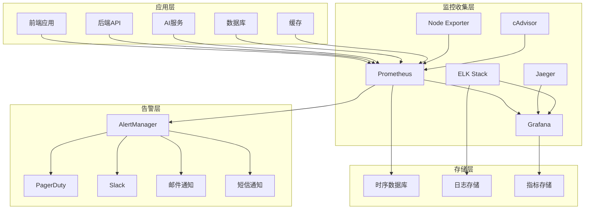
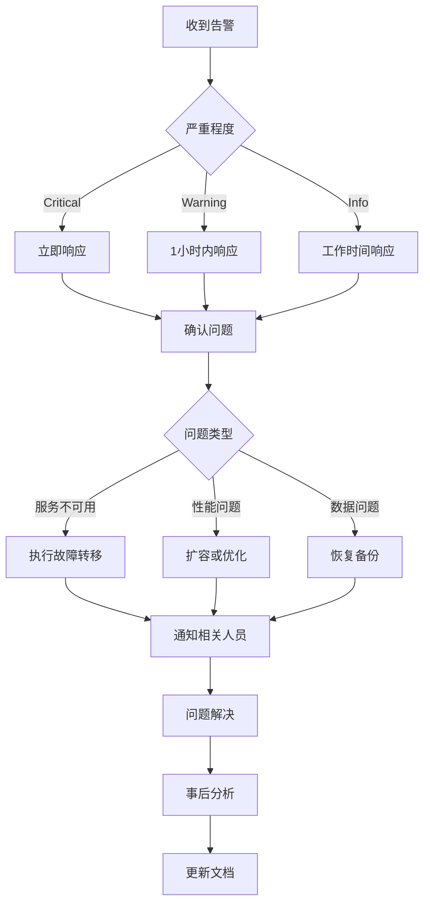

# 太上老君AI平台 - 监控运维指南

## 概述

本文档详细介绍太上老君AI平台的监控运维体系，包括监控系统架构、指标收集、告警配置、日志管理、性能优化等内容。

## 监控架构



## Prometheus配置

### 1. 核心配置

```yaml
# monitoring/prometheus.yml
global:
  scrape_interval: 15s
  evaluation_interval: 15s
  external_labels:
    cluster: 'taishanglaojun-prod'
    environment: 'production'

rule_files:
  - "rules/*.yml"

alerting:
  alertmanagers:
    - static_configs:
        - targets:
          - alertmanager:9093

scrape_configs:
  # Prometheus自身监控
  - job_name: 'prometheus'
    static_configs:
      - targets: ['localhost:9090']

  # Kubernetes API Server
  - job_name: 'kubernetes-apiservers'
    kubernetes_sd_configs:
      - role: endpoints
    scheme: https
    tls_config:
      ca_file: /var/run/secrets/kubernetes.io/serviceaccount/ca.crt
    bearer_token_file: /var/run/secrets/kubernetes.io/serviceaccount/token
    relabel_configs:
      - source_labels: [__meta_kubernetes_namespace, __meta_kubernetes_service_name, __meta_kubernetes_endpoint_port_name]
        action: keep
        regex: default;kubernetes;https

  # Kubernetes节点监控
  - job_name: 'kubernetes-nodes'
    kubernetes_sd_configs:
      - role: node
    scheme: https
    tls_config:
      ca_file: /var/run/secrets/kubernetes.io/serviceaccount/ca.crt
    bearer_token_file: /var/run/secrets/kubernetes.io/serviceaccount/token
    relabel_configs:
      - action: labelmap
        regex: __meta_kubernetes_node_label_(.+)
      - target_label: __address__
        replacement: kubernetes.default.svc:443
      - source_labels: [__meta_kubernetes_node_name]
        regex: (.+)
        target_label: __metrics_path__
        replacement: /api/v1/nodes/${1}/proxy/metrics

  # Kubernetes Pod监控
  - job_name: 'kubernetes-pods'
    kubernetes_sd_configs:
      - role: pod
    relabel_configs:
      - source_labels: [__meta_kubernetes_pod_annotation_prometheus_io_scrape]
        action: keep
        regex: true
      - source_labels: [__meta_kubernetes_pod_annotation_prometheus_io_path]
        action: replace
        target_label: __metrics_path__
        regex: (.+)
      - source_labels: [__address__, __meta_kubernetes_pod_annotation_prometheus_io_port]
        action: replace
        regex: ([^:]+)(?::\d+)?;(\d+)
        replacement: $1:$2
        target_label: __address__
      - action: labelmap
        regex: __meta_kubernetes_pod_label_(.+)
      - source_labels: [__meta_kubernetes_namespace]
        action: replace
        target_label: kubernetes_namespace
      - source_labels: [__meta_kubernetes_pod_name]
        action: replace
        target_label: kubernetes_pod_name

  # 应用服务监控
  - job_name: 'taishanglaojun-backend'
    kubernetes_sd_configs:
      - role: endpoints
        namespaces:
          names:
            - taishanglaojun-prod
    relabel_configs:
      - source_labels: [__meta_kubernetes_service_name]
        action: keep
        regex: backend-service
      - source_labels: [__meta_kubernetes_endpoint_port_name]
        action: keep
        regex: http

  - job_name: 'taishanglaojun-ai-service'
    kubernetes_sd_configs:
      - role: endpoints
        namespaces:
          names:
            - taishanglaojun-prod
    relabel_configs:
      - source_labels: [__meta_kubernetes_service_name]
        action: keep
        regex: ai-service
      - source_labels: [__meta_kubernetes_endpoint_port_name]
        action: keep
        regex: http

  # 数据库监控
  - job_name: 'postgres-exporter'
    static_configs:
      - targets: ['postgres-exporter:9187']
    scrape_interval: 30s

  - job_name: 'redis-exporter'
    static_configs:
      - targets: ['redis-exporter:9121']
    scrape_interval: 30s

  # 基础设施监控
  - job_name: 'node-exporter'
    kubernetes_sd_configs:
      - role: endpoints
    relabel_configs:
      - source_labels: [__meta_kubernetes_endpoints_name]
        action: keep
        regex: node-exporter

  - job_name: 'cadvisor'
    kubernetes_sd_configs:
      - role: node
    scheme: https
    tls_config:
      ca_file: /var/run/secrets/kubernetes.io/serviceaccount/ca.crt
    bearer_token_file: /var/run/secrets/kubernetes.io/serviceaccount/token
    relabel_configs:
      - action: labelmap
        regex: __meta_kubernetes_node_label_(.+)
      - target_label: __address__
        replacement: kubernetes.default.svc:443
      - source_labels: [__meta_kubernetes_node_name]
        regex: (.+)
        target_label: __metrics_path__
        replacement: /api/v1/nodes/${1}/proxy/metrics/cadvisor

# 存储配置
storage:
  tsdb:
    path: /prometheus/data
    retention.time: 30d
    retention.size: 100GB
    wal-compression: true
```

### 2. 告警规则

```yaml
# monitoring/rules/application.yml
groups:
  - name: application.rules
    rules:
      # 应用可用性告警
      - alert: ApplicationDown
        expr: up{job=~"taishanglaojun-.*"} == 0
        for: 1m
        labels:
          severity: critical
          team: platform
        annotations:
          summary: "应用服务不可用"
          description: "{{ $labels.job }} 服务已经停止响应超过1分钟"
          runbook_url: "https://wiki.taishanglaojun.com/runbooks/application-down"

      # 高错误率告警
      - alert: HighErrorRate
        expr: |
          (
            rate(http_requests_total{status=~"5.."}[5m]) /
            rate(http_requests_total[5m])
          ) > 0.05
        for: 5m
        labels:
          severity: warning
          team: platform
        annotations:
          summary: "高错误率检测"
          description: "{{ $labels.job }} 5xx错误率超过5%，当前值: {{ $value | humanizePercentage }}"

      # 响应时间告警
      - alert: HighResponseTime
        expr: |
          histogram_quantile(0.95, 
            rate(http_request_duration_seconds_bucket[5m])
          ) > 2
        for: 5m
        labels:
          severity: warning
          team: platform
        annotations:
          summary: "响应时间过长"
          description: "{{ $labels.job }} 95%响应时间超过2秒，当前值: {{ $value }}s"

      # 内存使用率告警
      - alert: HighMemoryUsage
        expr: |
          (
            container_memory_usage_bytes{name!=""} /
            container_spec_memory_limit_bytes{name!=""} * 100
          ) > 90
        for: 5m
        labels:
          severity: warning
          team: platform
        annotations:
          summary: "内存使用率过高"
          description: "容器 {{ $labels.name }} 内存使用率超过90%，当前值: {{ $value | humanizePercentage }}"

      # CPU使用率告警
      - alert: HighCPUUsage
        expr: |
          (
            rate(container_cpu_usage_seconds_total{name!=""}[5m]) * 100
          ) > 80
        for: 5m
        labels:
          severity: warning
          team: platform
        annotations:
          summary: "CPU使用率过高"
          description: "容器 {{ $labels.name }} CPU使用率超过80%，当前值: {{ $value | humanizePercentage }}"

      # 磁盘空间告警
      - alert: DiskSpaceUsage
        expr: |
          (
            (node_filesystem_size_bytes{fstype!="tmpfs"} - node_filesystem_free_bytes{fstype!="tmpfs"}) /
            node_filesystem_size_bytes{fstype!="tmpfs"} * 100
          ) > 85
        for: 5m
        labels:
          severity: warning
          team: infrastructure
        annotations:
          summary: "磁盘空间不足"
          description: "节点 {{ $labels.instance }} 磁盘使用率超过85%，当前值: {{ $value | humanizePercentage }}"

# monitoring/rules/database.yml
groups:
  - name: database.rules
    rules:
      # PostgreSQL连接数告警
      - alert: PostgreSQLTooManyConnections
        expr: |
          (
            pg_stat_database_numbackends /
            pg_settings_max_connections * 100
          ) > 80
        for: 5m
        labels:
          severity: warning
          team: database
        annotations:
          summary: "PostgreSQL连接数过多"
          description: "PostgreSQL连接数超过80%，当前值: {{ $value | humanizePercentage }}"

      # PostgreSQL慢查询告警
      - alert: PostgreSQLSlowQueries
        expr: |
          rate(pg_stat_database_tup_returned[5m]) /
          rate(pg_stat_database_tup_fetched[5m]) < 0.1
        for: 5m
        labels:
          severity: warning
          team: database
        annotations:
          summary: "PostgreSQL慢查询检测"
          description: "PostgreSQL查询效率低下，可能存在慢查询"

      # Redis内存使用告警
      - alert: RedisMemoryUsage
        expr: |
          (
            redis_memory_used_bytes /
            redis_memory_max_bytes * 100
          ) > 90
        for: 5m
        labels:
          severity: warning
          team: database
        annotations:
          summary: "Redis内存使用率过高"
          description: "Redis内存使用率超过90%，当前值: {{ $value | humanizePercentage }}"

      # Redis连接数告警
      - alert: RedisTooManyConnections
        expr: redis_connected_clients > 100
        for: 5m
        labels:
          severity: warning
          team: database
        annotations:
          summary: "Redis连接数过多"
          description: "Redis连接数超过100，当前值: {{ $value }}"

# monitoring/rules/ai-service.yml
groups:
  - name: ai-service.rules
    rules:
      # AI模型推理延迟告警
      - alert: AIModelHighLatency
        expr: |
          histogram_quantile(0.95,
            rate(ai_model_inference_duration_seconds_bucket[5m])
          ) > 10
        for: 5m
        labels:
          severity: warning
          team: ai
        annotations:
          summary: "AI模型推理延迟过高"
          description: "AI模型 {{ $labels.model }} 95%推理时间超过10秒，当前值: {{ $value }}s"

      # AI模型错误率告警
      - alert: AIModelHighErrorRate
        expr: |
          (
            rate(ai_model_inference_errors_total[5m]) /
            rate(ai_model_inference_total[5m])
          ) > 0.1
        for: 5m
        labels:
          severity: critical
          team: ai
        annotations:
          summary: "AI模型错误率过高"
          description: "AI模型 {{ $labels.model }} 错误率超过10%，当前值: {{ $value | humanizePercentage }}"

      # GPU使用率告警
      - alert: GPUHighUsage
        expr: |
          nvidia_gpu_utilization_gpu > 95
        for: 10m
        labels:
          severity: warning
          team: ai
        annotations:
          summary: "GPU使用率过高"
          description: "GPU {{ $labels.gpu }} 使用率超过95%，当前值: {{ $value }}%"

      # GPU内存使用告警
      - alert: GPUMemoryUsage
        expr: |
          (
            nvidia_gpu_memory_used_bytes /
            nvidia_gpu_memory_total_bytes * 100
          ) > 90
        for: 5m
        labels:
          severity: warning
          team: ai
        annotations:
          summary: "GPU内存使用率过高"
          description: "GPU {{ $labels.gpu }} 内存使用率超过90%，当前值: {{ $value | humanizePercentage }}"
```

### 3. AlertManager配置

```yaml
# monitoring/alertmanager.yml
global:
  smtp_smarthost: 'smtp.gmail.com:587'
  smtp_from: 'alerts@taishanglaojun.com'
  smtp_auth_username: 'alerts@taishanglaojun.com'
  smtp_auth_password: 'your-app-password'

route:
  group_by: ['alertname', 'cluster', 'service']
  group_wait: 10s
  group_interval: 10s
  repeat_interval: 1h
  receiver: 'default'
  routes:
    # 关键告警立即通知
    - match:
        severity: critical
      receiver: 'critical-alerts'
      group_wait: 0s
      repeat_interval: 5m
    
    # 数据库告警
    - match:
        team: database
      receiver: 'database-team'
    
    # AI服务告警
    - match:
        team: ai
      receiver: 'ai-team'
    
    # 基础设施告警
    - match:
        team: infrastructure
      receiver: 'infrastructure-team'

receivers:
  - name: 'default'
    email_configs:
      - to: 'ops@taishanglaojun.com'
        subject: '[{{ .Status | toUpper }}] {{ .GroupLabels.alertname }}'
        body: |
          {{ range .Alerts }}
          告警: {{ .Annotations.summary }}
          描述: {{ .Annotations.description }}
          时间: {{ .StartsAt.Format "2006-01-02 15:04:05" }}
          标签: {{ range .Labels.SortedPairs }}{{ .Name }}={{ .Value }} {{ end }}
          {{ end }}

  - name: 'critical-alerts'
    email_configs:
      - to: 'ops@taishanglaojun.com,cto@taishanglaojun.com'
        subject: '[CRITICAL] {{ .GroupLabels.alertname }}'
        body: |
          🚨 关键告警 🚨
          
          {{ range .Alerts }}
          告警: {{ .Annotations.summary }}
          描述: {{ .Annotations.description }}
          时间: {{ .StartsAt.Format "2006-01-02 15:04:05" }}
          运维手册: {{ .Annotations.runbook_url }}
          标签: {{ range .Labels.SortedPairs }}{{ .Name }}={{ .Value }} {{ end }}
          {{ end }}
    
    slack_configs:
      - api_url: 'https://hooks.slack.com/services/YOUR/SLACK/WEBHOOK'
        channel: '#alerts-critical'
        title: '🚨 关键告警'
        text: |
          {{ range .Alerts }}
          *告警*: {{ .Annotations.summary }}
          *描述*: {{ .Annotations.description }}
          *时间*: {{ .StartsAt.Format "2006-01-02 15:04:05" }}
          {{ if .Annotations.runbook_url }}*运维手册*: {{ .Annotations.runbook_url }}{{ end }}
          {{ end }}
    
    pagerduty_configs:
      - routing_key: 'your-pagerduty-integration-key'
        description: '{{ .GroupLabels.alertname }}'

  - name: 'database-team'
    email_configs:
      - to: 'dba@taishanglaojun.com'
        subject: '[数据库告警] {{ .GroupLabels.alertname }}'
    
    slack_configs:
      - api_url: 'https://hooks.slack.com/services/YOUR/SLACK/WEBHOOK'
        channel: '#database-alerts'

  - name: 'ai-team'
    email_configs:
      - to: 'ai-team@taishanglaojun.com'
        subject: '[AI服务告警] {{ .GroupLabels.alertname }}'
    
    slack_configs:
      - api_url: 'https://hooks.slack.com/services/YOUR/SLACK/WEBHOOK'
        channel: '#ai-alerts'

  - name: 'infrastructure-team'
    email_configs:
      - to: 'infrastructure@taishanglaojun.com'
        subject: '[基础设施告警] {{ .GroupLabels.alertname }}'
    
    slack_configs:
      - api_url: 'https://hooks.slack.com/services/YOUR/SLACK/WEBHOOK'
        channel: '#infrastructure-alerts'

inhibit_rules:
  # 抑制重复告警
  - source_match:
      severity: 'critical'
    target_match:
      severity: 'warning'
    equal: ['alertname', 'instance']
```

## Grafana仪表板

### 1. 应用监控仪表板

```json
{
  "dashboard": {
    "id": null,
    "title": "太上老君AI平台 - 应用监控",
    "tags": ["taishanglaojun", "application"],
    "timezone": "Asia/Shanghai",
    "panels": [
      {
        "id": 1,
        "title": "服务可用性",
        "type": "stat",
        "targets": [
          {
            "expr": "up{job=~\"taishanglaojun-.*\"}",
            "legendFormat": "{{ job }}"
          }
        ],
        "fieldConfig": {
          "defaults": {
            "mappings": [
              {
                "options": {
                  "0": {
                    "text": "DOWN",
                    "color": "red"
                  },
                  "1": {
                    "text": "UP",
                    "color": "green"
                  }
                },
                "type": "value"
              }
            ]
          }
        }
      },
      {
        "id": 2,
        "title": "请求速率 (RPS)",
        "type": "graph",
        "targets": [
          {
            "expr": "sum(rate(http_requests_total[5m])) by (job)",
            "legendFormat": "{{ job }}"
          }
        ],
        "yAxes": [
          {
            "label": "请求/秒"
          }
        ]
      },
      {
        "id": 3,
        "title": "响应时间分布",
        "type": "graph",
        "targets": [
          {
            "expr": "histogram_quantile(0.50, rate(http_request_duration_seconds_bucket[5m]))",
            "legendFormat": "50%"
          },
          {
            "expr": "histogram_quantile(0.95, rate(http_request_duration_seconds_bucket[5m]))",
            "legendFormat": "95%"
          },
          {
            "expr": "histogram_quantile(0.99, rate(http_request_duration_seconds_bucket[5m]))",
            "legendFormat": "99%"
          }
        ],
        "yAxes": [
          {
            "label": "秒"
          }
        ]
      },
      {
        "id": 4,
        "title": "错误率",
        "type": "graph",
        "targets": [
          {
            "expr": "sum(rate(http_requests_total{status=~\"4..|5..\"}[5m])) by (job) / sum(rate(http_requests_total[5m])) by (job)",
            "legendFormat": "{{ job }}"
          }
        ],
        "yAxes": [
          {
            "label": "错误率",
            "max": 1,
            "min": 0
          }
        ]
      },
      {
        "id": 5,
        "title": "内存使用率",
        "type": "graph",
        "targets": [
          {
            "expr": "container_memory_usage_bytes{name!=\"\"} / container_spec_memory_limit_bytes{name!=\"\"} * 100",
            "legendFormat": "{{ name }}"
          }
        ],
        "yAxes": [
          {
            "label": "%",
            "max": 100,
            "min": 0
          }
        ]
      },
      {
        "id": 6,
        "title": "CPU使用率",
        "type": "graph",
        "targets": [
          {
            "expr": "rate(container_cpu_usage_seconds_total{name!=\"\"}[5m]) * 100",
            "legendFormat": "{{ name }}"
          }
        ],
        "yAxes": [
          {
            "label": "%"
          }
        ]
      }
    ],
    "time": {
      "from": "now-1h",
      "to": "now"
    },
    "refresh": "30s"
  }
}
```

### 2. 数据库监控仪表板

```json
{
  "dashboard": {
    "id": null,
    "title": "太上老君AI平台 - 数据库监控",
    "tags": ["taishanglaojun", "database"],
    "panels": [
      {
        "id": 1,
        "title": "PostgreSQL连接数",
        "type": "graph",
        "targets": [
          {
            "expr": "pg_stat_database_numbackends",
            "legendFormat": "活跃连接"
          },
          {
            "expr": "pg_settings_max_connections",
            "legendFormat": "最大连接数"
          }
        ]
      },
      {
        "id": 2,
        "title": "PostgreSQL查询性能",
        "type": "graph",
        "targets": [
          {
            "expr": "rate(pg_stat_database_tup_returned[5m])",
            "legendFormat": "返回行数/秒"
          },
          {
            "expr": "rate(pg_stat_database_tup_fetched[5m])",
            "legendFormat": "获取行数/秒"
          }
        ]
      },
      {
        "id": 3,
        "title": "Redis内存使用",
        "type": "graph",
        "targets": [
          {
            "expr": "redis_memory_used_bytes",
            "legendFormat": "已使用内存"
          },
          {
            "expr": "redis_memory_max_bytes",
            "legendFormat": "最大内存"
          }
        ]
      },
      {
        "id": 4,
        "title": "Redis操作速率",
        "type": "graph",
        "targets": [
          {
            "expr": "rate(redis_commands_processed_total[5m])",
            "legendFormat": "命令/秒"
          }
        ]
      }
    ]
  }
}
```

### 3. AI服务监控仪表板

```json
{
  "dashboard": {
    "id": null,
    "title": "太上老君AI平台 - AI服务监控",
    "tags": ["taishanglaojun", "ai"],
    "panels": [
      {
        "id": 1,
        "title": "模型推理延迟",
        "type": "graph",
        "targets": [
          {
            "expr": "histogram_quantile(0.50, rate(ai_model_inference_duration_seconds_bucket[5m]))",
            "legendFormat": "{{ model }} - 50%"
          },
          {
            "expr": "histogram_quantile(0.95, rate(ai_model_inference_duration_seconds_bucket[5m]))",
            "legendFormat": "{{ model }} - 95%"
          }
        ]
      },
      {
        "id": 2,
        "title": "模型推理速率",
        "type": "graph",
        "targets": [
          {
            "expr": "sum(rate(ai_model_inference_total[5m])) by (model)",
            "legendFormat": "{{ model }}"
          }
        ]
      },
      {
        "id": 3,
        "title": "GPU使用率",
        "type": "graph",
        "targets": [
          {
            "expr": "nvidia_gpu_utilization_gpu",
            "legendFormat": "GPU {{ gpu }}"
          }
        ]
      },
      {
        "id": 4,
        "title": "GPU内存使用",
        "type": "graph",
        "targets": [
          {
            "expr": "nvidia_gpu_memory_used_bytes / nvidia_gpu_memory_total_bytes * 100",
            "legendFormat": "GPU {{ gpu }}"
          }
        ]
      },
      {
        "id": 5,
        "title": "Token使用统计",
        "type": "graph",
        "targets": [
          {
            "expr": "sum(rate(ai_tokens_used_total[5m])) by (model, type)",
            "legendFormat": "{{ model }} - {{ type }}"
          }
        ]
      }
    ]
  }
}
```

## 日志管理

### 1. ELK Stack配置

#### Elasticsearch配置

```yaml
# logging/elasticsearch.yml
cluster.name: taishanglaojun-logs
node.name: ${HOSTNAME}
network.host: 0.0.0.0
http.port: 9200
transport.port: 9300

discovery.seed_hosts: ["elasticsearch-master"]
cluster.initial_master_nodes: ["elasticsearch-master"]

# 内存设置
bootstrap.memory_lock: true
indices.memory.index_buffer_size: 30%

# 索引设置
action.auto_create_index: true
action.destructive_requires_name: true

# 安全设置
xpack.security.enabled: true
xpack.security.transport.ssl.enabled: true
xpack.security.http.ssl.enabled: true

# 监控设置
xpack.monitoring.collection.enabled: true
```

#### Logstash配置

```ruby
# logging/logstash.conf
input {
  beats {
    port => 5044
  }
  
  http {
    port => 8080
    codec => json
  }
}

filter {
  # 解析Kubernetes日志
  if [kubernetes] {
    mutate {
      add_field => { "log_source" => "kubernetes" }
    }
    
    # 解析应用日志
    if [kubernetes][container][name] == "backend" {
      grok {
        match => { "message" => "%{TIMESTAMP_ISO8601:timestamp} %{LOGLEVEL:level} %{GREEDYDATA:message}" }
      }
      
      date {
        match => [ "timestamp", "ISO8601" ]
      }
    }
    
    # 解析AI服务日志
    if [kubernetes][container][name] == "ai-service" {
      json {
        source => "message"
      }
      
      if [model] {
        mutate {
          add_field => { "service_type" => "ai" }
        }
      }
    }
  }
  
  # 解析Nginx访问日志
  if [fields][log_type] == "nginx" {
    grok {
      match => { 
        "message" => "%{IPORHOST:remote_addr} - %{DATA:remote_user} \[%{HTTPDATE:time_local}\] \"%{WORD:method} %{DATA:request} HTTP/%{NUMBER:http_version}\" %{INT:status} %{INT:body_bytes_sent} \"%{DATA:http_referer}\" \"%{DATA:http_user_agent}\"" 
      }
    }
    
    date {
      match => [ "time_local", "dd/MMM/yyyy:HH:mm:ss Z" ]
    }
    
    mutate {
      convert => { "status" => "integer" }
      convert => { "body_bytes_sent" => "integer" }
    }
  }
  
  # 添加地理位置信息
  if [remote_addr] {
    geoip {
      source => "remote_addr"
      target => "geoip"
    }
  }
}

output {
  elasticsearch {
    hosts => ["elasticsearch:9200"]
    index => "taishanglaojun-logs-%{+YYYY.MM.dd}"
    template_name => "taishanglaojun"
    template => "/usr/share/logstash/templates/taishanglaojun.json"
    template_overwrite => true
  }
  
  # 错误日志单独存储
  if [level] == "ERROR" or [status] >= 500 {
    elasticsearch {
      hosts => ["elasticsearch:9200"]
      index => "taishanglaojun-errors-%{+YYYY.MM.dd}"
    }
  }
  
  # 调试输出
  if [log_level] == "debug" {
    stdout { codec => rubydebug }
  }
}
```

#### Kibana配置

```yaml
# logging/kibana.yml
server.name: kibana
server.host: 0.0.0.0
server.port: 5601

elasticsearch.hosts: ["http://elasticsearch:9200"]
elasticsearch.username: "kibana_system"
elasticsearch.password: "${KIBANA_PASSWORD}"

# 安全设置
xpack.security.enabled: true
xpack.security.encryptionKey: "${KIBANA_ENCRYPTION_KEY}"

# 监控设置
xpack.monitoring.ui.container.elasticsearch.enabled: true

# 默认索引模式
kibana.defaultAppId: "discover"
kibana.index: ".kibana"

# 日志级别
logging.level: info
logging.dest: stdout
```

### 2. 日志索引模板

```json
{
  "index_patterns": ["taishanglaojun-logs-*"],
  "template": {
    "settings": {
      "number_of_shards": 3,
      "number_of_replicas": 1,
      "index.refresh_interval": "30s",
      "index.codec": "best_compression",
      "index.lifecycle.name": "taishanglaojun-logs-policy",
      "index.lifecycle.rollover_alias": "taishanglaojun-logs"
    },
    "mappings": {
      "properties": {
        "@timestamp": {
          "type": "date"
        },
        "level": {
          "type": "keyword"
        },
        "message": {
          "type": "text",
          "analyzer": "ik_max_word",
          "search_analyzer": "ik_smart"
        },
        "service": {
          "type": "keyword"
        },
        "kubernetes": {
          "properties": {
            "namespace": {
              "type": "keyword"
            },
            "pod": {
              "type": "keyword"
            },
            "container": {
              "properties": {
                "name": {
                  "type": "keyword"
                }
              }
            }
          }
        },
        "request": {
          "properties": {
            "method": {
              "type": "keyword"
            },
            "url": {
              "type": "keyword"
            },
            "status": {
              "type": "integer"
            },
            "duration": {
              "type": "float"
            },
            "user_id": {
              "type": "keyword"
            },
            "ip": {
              "type": "ip"
            }
          }
        },
        "ai": {
          "properties": {
            "model": {
              "type": "keyword"
            },
            "tokens": {
              "type": "integer"
            },
            "inference_time": {
              "type": "float"
            }
          }
        },
        "geoip": {
          "properties": {
            "location": {
              "type": "geo_point"
            },
            "country_name": {
              "type": "keyword"
            },
            "city_name": {
              "type": "keyword"
            }
          }
        }
      }
    }
  }
}
```

### 3. 日志生命周期管理

```json
{
  "policy": {
    "phases": {
      "hot": {
        "actions": {
          "rollover": {
            "max_size": "10GB",
            "max_age": "1d"
          },
          "set_priority": {
            "priority": 100
          }
        }
      },
      "warm": {
        "min_age": "7d",
        "actions": {
          "allocate": {
            "number_of_replicas": 0
          },
          "forcemerge": {
            "max_num_segments": 1
          },
          "set_priority": {
            "priority": 50
          }
        }
      },
      "cold": {
        "min_age": "30d",
        "actions": {
          "allocate": {
            "number_of_replicas": 0
          },
          "set_priority": {
            "priority": 0
          }
        }
      },
      "delete": {
        "min_age": "90d"
      }
    }
  }
}
```

## 链路追踪

### 1. Jaeger配置

```yaml
# tracing/jaeger.yml
apiVersion: jaegertracing.io/v1
kind: Jaeger
metadata:
  name: jaeger
  namespace: observability
spec:
  strategy: production
  
  collector:
    maxReplicas: 5
    resources:
      limits:
        cpu: 1000m
        memory: 1Gi
      requests:
        cpu: 500m
        memory: 512Mi
  
  query:
    replicas: 2
    resources:
      limits:
        cpu: 500m
        memory: 512Mi
      requests:
        cpu: 250m
        memory: 256Mi
  
  agent:
    strategy: DaemonSet
    resources:
      limits:
        cpu: 200m
        memory: 128Mi
      requests:
        cpu: 100m
        memory: 64Mi
  
  storage:
    type: elasticsearch
    elasticsearch:
      nodeCount: 3
      storage:
        storageClassName: fast-ssd
        size: 100Gi
      resources:
        limits:
          cpu: 2000m
          memory: 4Gi
        requests:
          cpu: 1000m
          memory: 2Gi
```

### 2. 应用集成配置

#### Go后端集成

```go
// pkg/tracing/jaeger.go
package tracing

import (
    "io"
    "time"
    
    "github.com/opentracing/opentracing-go"
    "github.com/uber/jaeger-client-go"
    "github.com/uber/jaeger-client-go/config"
)

func InitJaeger(serviceName string) (opentracing.Tracer, io.Closer, error) {
    cfg := config.Configuration{
        ServiceName: serviceName,
        Sampler: &config.SamplerConfig{
            Type:  jaeger.SamplerTypeConst,
            Param: 1,
        },
        Reporter: &config.ReporterConfig{
            LogSpans:            true,
            BufferFlushInterval: 1 * time.Second,
            LocalAgentHostPort:  "jaeger-agent:6831",
        },
    }
    
    tracer, closer, err := cfg.NewTracer()
    if err != nil {
        return nil, nil, err
    }
    
    opentracing.SetGlobalTracer(tracer)
    return tracer, closer, nil
}

// 中间件
func TracingMiddleware() gin.HandlerFunc {
    return func(c *gin.Context) {
        span := opentracing.StartSpan(c.Request.URL.Path)
        defer span.Finish()
        
        span.SetTag("http.method", c.Request.Method)
        span.SetTag("http.url", c.Request.URL.String())
        span.SetTag("user.id", c.GetString("user_id"))
        
        ctx := opentracing.ContextWithSpan(c.Request.Context(), span)
        c.Request = c.Request.WithContext(ctx)
        
        c.Next()
        
        span.SetTag("http.status_code", c.Writer.Status())
    }
}
```

#### Python AI服务集成

```python
# ai_service/tracing.py
import opentracing
from jaeger_client import Config
from opentracing.ext import tags
from functools import wraps

def init_jaeger_tracer(service_name):
    config = Config(
        config={
            'sampler': {
                'type': 'const',
                'param': 1,
            },
            'local_agent': {
                'reporting_host': 'jaeger-agent',
                'reporting_port': 6831,
            },
            'logging': True,
        },
        service_name=service_name,
    )
    
    return config.initialize_tracer()

def trace_function(operation_name=None):
    def decorator(func):
        @wraps(func)
        async def wrapper(*args, **kwargs):
            tracer = opentracing.global_tracer()
            op_name = operation_name or f"{func.__module__}.{func.__name__}"
            
            with tracer.start_span(op_name) as span:
                span.set_tag(tags.COMPONENT, "ai-service")
                span.set_tag("function.name", func.__name__)
                
                try:
                    result = await func(*args, **kwargs)
                    span.set_tag("success", True)
                    return result
                except Exception as e:
                    span.set_tag("error", True)
                    span.set_tag("error.message", str(e))
                    raise
        
        return wrapper
    return decorator

# FastAPI中间件
from fastapi import Request
import time

async def tracing_middleware(request: Request, call_next):
    tracer = opentracing.global_tracer()
    
    with tracer.start_span(f"{request.method} {request.url.path}") as span:
        span.set_tag(tags.HTTP_METHOD, request.method)
        span.set_tag(tags.HTTP_URL, str(request.url))
        span.set_tag(tags.COMPONENT, "ai-service")
        
        start_time = time.time()
        response = await call_next(request)
        duration = time.time() - start_time
        
        span.set_tag(tags.HTTP_STATUS_CODE, response.status_code)
        span.set_tag("duration", duration)
        
        return response
```

## 性能监控

### 1. APM配置

```yaml
# monitoring/apm.yml
apiVersion: v1
kind: ConfigMap
metadata:
  name: apm-config
  namespace: observability
data:
  apm-server.yml: |
    apm-server:
      host: "0.0.0.0:8200"
      max_request_size: 1048576
      read_timeout: 30s
      write_timeout: 30s
      shutdown_timeout: 5s
      
      rum:
        enabled: true
        event_rate.limit: 300
        event_rate.lru_size: 1000
        allow_origins: ['*']
        source_mapping:
          enabled: true
          cache:
            expiration: 5m
    
    output.elasticsearch:
      hosts: ["elasticsearch:9200"]
      indices:
        - index: "apm-%{[observer.version]}-sourcemap"
          when.contains:
            processor.event: "sourcemap"
        - index: "apm-%{[observer.version]}-error-%{+yyyy.MM.dd}"
          when.contains:
            processor.event: "error"
        - index: "apm-%{[observer.version]}-transaction-%{+yyyy.MM.dd}"
          when.contains:
            processor.event: "transaction"
        - index: "apm-%{[observer.version]}-span-%{+yyyy.MM.dd}"
          when.contains:
            processor.event: "span"
        - index: "apm-%{[observer.version]}-metric-%{+yyyy.MM.dd}"
          when.contains:
            processor.event: "metric"
    
    setup.template.settings:
      index:
        number_of_shards: 1
        codec: best_compression
        number_of_replicas: 1
    
    logging.level: info
    logging.to_files: true
    logging.files:
      path: /var/log/apm-server
      name: apm-server
      keepfiles: 7
      permissions: 0644
```

### 2. 应用性能监控集成

#### Go应用集成

```go
// pkg/apm/elastic.go
package apm

import (
    "go.elastic.co/apm/module/apmgin"
    "go.elastic.co/apm/module/apmgorm"
    "go.elastic.co/apm"
    "github.com/gin-gonic/gin"
    "gorm.io/gorm"
)

func SetupAPM(r *gin.Engine, db *gorm.DB) {
    // Gin中间件
    r.Use(apmgin.Middleware(r))
    
    // 数据库监控
    apmgorm.Open(db)
    
    // 自定义事务
    r.GET("/api/users", func(c *gin.Context) {
        tx := apm.TransactionFromContext(c.Request.Context())
        span, ctx := apm.StartSpan(c.Request.Context(), "get_users", "db.query")
        defer span.End()
        
        // 数据库查询
        var users []User
        db.WithContext(ctx).Find(&users)
        
        c.JSON(200, users)
    })
}

// 自定义指标
func RecordCustomMetrics() {
    // 业务指标
    apm.DefaultTracer.SendMetric(apm.Metric{
        Name:      "business.active_users",
        Value:     float64(getActiveUserCount()),
        Timestamp: time.Now(),
        Labels: map[string]string{
            "service": "backend",
        },
    })
    
    // 性能指标
    apm.DefaultTracer.SendMetric(apm.Metric{
        Name:      "business.response_time",
        Value:     responseTime,
        Timestamp: time.Now(),
        Labels: map[string]string{
            "endpoint": "/api/chat",
        },
    })
}
```

#### Python应用集成

```python
# ai_service/apm.py
import elasticapm
from elasticapm.contrib.starlette import make_apm_client, ElasticAPM

# APM客户端配置
apm_config = {
    'SERVICE_NAME': 'ai-service',
    'SECRET_TOKEN': '',
    'SERVER_URL': 'http://apm-server:8200',
    'ENVIRONMENT': 'production',
    'CAPTURE_BODY': 'all',
    'TRANSACTION_SAMPLE_RATE': 1.0,
    'SPAN_FRAMES_MIN_DURATION': '5ms',
}

apm = make_apm_client(apm_config)

# FastAPI集成
from fastapi import FastAPI

app = FastAPI()
app.add_middleware(ElasticAPM, client=apm)

# 自定义监控
@elasticapm.capture_span('ai.model.inference')
async def model_inference(model_name: str, input_text: str):
    elasticapm.set_custom_context({
        'model': model_name,
        'input_length': len(input_text),
    })
    
    start_time = time.time()
    try:
        result = await run_inference(model_name, input_text)
        
        # 记录成功指标
        elasticapm.set_custom_context({
            'output_length': len(result),
            'inference_time': time.time() - start_time,
        })
        
        return result
    except Exception as e:
        # 记录错误
        elasticapm.capture_exception()
        raise

# 自定义指标收集
def collect_ai_metrics():
    # GPU使用率
    gpu_usage = get_gpu_usage()
    elasticapm.set_custom_context({
        'gpu_usage': gpu_usage,
        'gpu_memory': get_gpu_memory_usage(),
    })
    
    # 模型缓存命中率
    cache_stats = get_model_cache_stats()
    elasticapm.set_custom_context({
        'cache_hit_rate': cache_stats['hit_rate'],
        'cache_size': cache_stats['size'],
    })
```

## 运维脚本

### 1. 健康检查脚本

```bash
#!/bin/bash
# scripts/health-check.sh

set -e

NAMESPACE=${1:-taishanglaojun-prod}
SLACK_WEBHOOK=${2:-""}

echo "🏥 开始健康检查..."

# 检查Pod状态
echo "📋 检查Pod状态..."
FAILED_PODS=$(kubectl get pods -n $NAMESPACE --field-selector=status.phase!=Running --no-headers 2>/dev/null | wc -l)

if [ $FAILED_PODS -gt 0 ]; then
    echo "❌ 发现 $FAILED_PODS 个异常Pod:"
    kubectl get pods -n $NAMESPACE --field-selector=status.phase!=Running
    
    if [ -n "$SLACK_WEBHOOK" ]; then
        curl -X POST -H 'Content-type: application/json' \
            --data "{\"text\":\"🚨 健康检查警告: 发现 $FAILED_PODS 个异常Pod\"}" \
            $SLACK_WEBHOOK
    fi
else
    echo "✅ 所有Pod运行正常"
fi

# 检查服务可用性
echo "🌐 检查服务可用性..."
SERVICES=("frontend-service" "backend-service" "ai-service")

for service in "${SERVICES[@]}"; do
    if kubectl get service $service -n $NAMESPACE &>/dev/null; then
        ENDPOINTS=$(kubectl get endpoints $service -n $NAMESPACE -o jsonpath='{.subsets[*].addresses[*].ip}' | wc -w)
        if [ $ENDPOINTS -gt 0 ]; then
            echo "✅ $service: $ENDPOINTS 个端点可用"
        else
            echo "❌ $service: 无可用端点"
        fi
    else
        echo "❌ $service: 服务不存在"
    fi
done

# 检查Ingress状态
echo "🚪 检查Ingress状态..."
INGRESS_IP=$(kubectl get ingress taishanglaojun-ingress -n $NAMESPACE -o jsonpath='{.status.loadBalancer.ingress[0].ip}' 2>/dev/null)

if [ -n "$INGRESS_IP" ]; then
    echo "✅ Ingress IP: $INGRESS_IP"
    
    # 检查HTTP响应
    HTTP_STATUS=$(curl -s -o /dev/null -w "%{http_code}" https://taishanglaojun.com/health || echo "000")
    if [ "$HTTP_STATUS" = "200" ]; then
        echo "✅ 网站响应正常"
    else
        echo "❌ 网站响应异常: HTTP $HTTP_STATUS"
    fi
else
    echo "❌ Ingress未分配IP地址"
fi

# 检查资源使用情况
echo "📊 检查资源使用情况..."
kubectl top nodes 2>/dev/null || echo "⚠️ 无法获取节点资源使用情况"
kubectl top pods -n $NAMESPACE 2>/dev/null || echo "⚠️ 无法获取Pod资源使用情况"

# 检查存储使用情况
echo "💾 检查存储使用情况..."
kubectl get pvc -n $NAMESPACE

echo "✅ 健康检查完成"
```

### 2. 自动扩缩容脚本

```bash
#!/bin/bash
# scripts/auto-scale.sh

set -e

NAMESPACE=${1:-taishanglaojun-prod}
SERVICE=$2
ACTION=$3  # scale-up, scale-down, auto

if [ -z "$SERVICE" ] || [ -z "$ACTION" ]; then
    echo "用法: $0 <namespace> <service> <action>"
    echo "示例: $0 taishanglaojun-prod backend scale-up"
    exit 1
fi

echo "🔄 开始扩缩容操作..."
echo "📋 参数: 命名空间=$NAMESPACE, 服务=$SERVICE, 操作=$ACTION"

# 获取当前副本数
CURRENT_REPLICAS=$(kubectl get deployment $SERVICE -n $NAMESPACE -o jsonpath='{.spec.replicas}')
echo "📊 当前副本数: $CURRENT_REPLICAS"

case $ACTION in
    "scale-up")
        NEW_REPLICAS=$((CURRENT_REPLICAS + 2))
        echo "⬆️ 扩容到 $NEW_REPLICAS 个副本"
        kubectl scale deployment $SERVICE --replicas=$NEW_REPLICAS -n $NAMESPACE
        ;;
    
    "scale-down")
        if [ $CURRENT_REPLICAS -gt 2 ]; then
            NEW_REPLICAS=$((CURRENT_REPLICAS - 1))
            echo "⬇️ 缩容到 $NEW_REPLICAS 个副本"
            kubectl scale deployment $SERVICE --replicas=$NEW_REPLICAS -n $NAMESPACE
        else
            echo "⚠️ 副本数已达到最小值，无法继续缩容"
        fi
        ;;
    
    "auto")
        # 基于CPU使用率自动扩缩容
        CPU_USAGE=$(kubectl top pods -n $NAMESPACE -l app=$SERVICE --no-headers | awk '{sum+=$3} END {print sum/NR}' | sed 's/m//')
        
        if [ -z "$CPU_USAGE" ]; then
            echo "⚠️ 无法获取CPU使用率"
            exit 1
        fi
        
        echo "📊 平均CPU使用率: ${CPU_USAGE}m"
        
        if [ $CPU_USAGE -gt 800 ]; then
            NEW_REPLICAS=$((CURRENT_REPLICAS + 2))
            echo "⬆️ CPU使用率过高，扩容到 $NEW_REPLICAS 个副本"
            kubectl scale deployment $SERVICE --replicas=$NEW_REPLICAS -n $NAMESPACE
        elif [ $CPU_USAGE -lt 200 ] && [ $CURRENT_REPLICAS -gt 2 ]; then
            NEW_REPLICAS=$((CURRENT_REPLICAS - 1))
            echo "⬇️ CPU使用率较低，缩容到 $NEW_REPLICAS 个副本"
            kubectl scale deployment $SERVICE --replicas=$NEW_REPLICAS -n $NAMESPACE
        else
            echo "✅ CPU使用率正常，无需调整"
        fi
        ;;
    
    *)
        echo "❌ 未知操作: $ACTION"
        echo "支持的操作: scale-up, scale-down, auto"
        exit 1
        ;;
esac

# 等待扩缩容完成
echo "⏳ 等待扩缩容完成..."
kubectl rollout status deployment/$SERVICE -n $NAMESPACE --timeout=300s

# 检查新状态
NEW_REPLICAS=$(kubectl get deployment $SERVICE -n $NAMESPACE -o jsonpath='{.spec.replicas}')
READY_REPLICAS=$(kubectl get deployment $SERVICE -n $NAMESPACE -o jsonpath='{.status.readyReplicas}')

echo "✅ 扩缩容完成"
echo "📊 目标副本数: $NEW_REPLICAS"
echo "📊 就绪副本数: $READY_REPLICAS"

if [ "$NEW_REPLICAS" = "$READY_REPLICAS" ]; then
    echo "✅ 所有副本已就绪"
else
    echo "⚠️ 部分副本未就绪，请检查Pod状态"
    kubectl get pods -n $NAMESPACE -l app=$SERVICE
fi
```

### 3. 备份恢复脚本

```bash
#!/bin/bash
# scripts/backup-restore.sh

set -e

ACTION=$1  # backup, restore, list
BACKUP_NAME=${2:-$(date +%Y%m%d_%H%M%S)}
NAMESPACE=${3:-taishanglaojun-prod}

BACKUP_DIR="/backup"
S3_BUCKET="taishanglaojun-backups"

case $ACTION in
    "backup")
        echo "💾 开始备份..."
        
        # 创建备份目录
        mkdir -p $BACKUP_DIR/$BACKUP_NAME
        
        # 备份PostgreSQL
        echo "📊 备份PostgreSQL数据库..."
        kubectl exec -n $NAMESPACE postgres-0 -- pg_dump -U postgres taishanglaojun > $BACKUP_DIR/$BACKUP_NAME/postgres.sql
        
        # 备份Redis
        echo "🔴 备份Redis数据..."
        kubectl exec -n $NAMESPACE redis-0 -- redis-cli BGSAVE
        kubectl cp $NAMESPACE/redis-0:/data/dump.rdb $BACKUP_DIR/$BACKUP_NAME/redis.rdb
        
        # 备份配置文件
        echo "⚙️ 备份配置文件..."
        kubectl get configmaps -n $NAMESPACE -o yaml > $BACKUP_DIR/$BACKUP_NAME/configmaps.yaml
        kubectl get secrets -n $NAMESPACE -o yaml > $BACKUP_DIR/$BACKUP_NAME/secrets.yaml
        
        # 备份PVC数据
        echo "💽 备份持久化卷数据..."
        kubectl get pvc -n $NAMESPACE -o yaml > $BACKUP_DIR/$BACKUP_NAME/pvc.yaml
        
        # 压缩备份
        echo "🗜️ 压缩备份文件..."
        tar -czf $BACKUP_DIR/$BACKUP_NAME.tar.gz -C $BACKUP_DIR $BACKUP_NAME
        rm -rf $BACKUP_DIR/$BACKUP_NAME
        
        # 上传到S3
        echo "☁️ 上传备份到S3..."
        aws s3 cp $BACKUP_DIR/$BACKUP_NAME.tar.gz s3://$S3_BUCKET/
        
        echo "✅ 备份完成: $BACKUP_NAME"
        ;;
    
    "restore")
        if [ -z "$BACKUP_NAME" ]; then
            echo "❌ 请指定备份名称"
            exit 1
        fi
        
        echo "🔄 开始恢复备份: $BACKUP_NAME"
        
        # 从S3下载备份
        echo "☁️ 从S3下载备份..."
        aws s3 cp s3://$S3_BUCKET/$BACKUP_NAME.tar.gz $BACKUP_DIR/
        
        # 解压备份
        echo "📦 解压备份文件..."
        tar -xzf $BACKUP_DIR/$BACKUP_NAME.tar.gz -C $BACKUP_DIR
        
        # 停止应用服务
        echo "⏸️ 停止应用服务..."
        kubectl scale deployment backend --replicas=0 -n $NAMESPACE
        kubectl scale deployment ai-service --replicas=0 -n $NAMESPACE
        
        # 恢复PostgreSQL
        echo "📊 恢复PostgreSQL数据库..."
        kubectl exec -n $NAMESPACE postgres-0 -- psql -U postgres -c "DROP DATABASE IF EXISTS taishanglaojun;"
        kubectl exec -n $NAMESPACE postgres-0 -- psql -U postgres -c "CREATE DATABASE taishanglaojun;"
        kubectl exec -i -n $NAMESPACE postgres-0 -- psql -U postgres taishanglaojun < $BACKUP_DIR/$BACKUP_NAME/postgres.sql
        
        # 恢复Redis
        echo "🔴 恢复Redis数据..."
        kubectl cp $BACKUP_DIR/$BACKUP_NAME/redis.rdb $NAMESPACE/redis-0:/data/dump.rdb
        kubectl exec -n $NAMESPACE redis-0 -- redis-cli DEBUG RESTART
        
        # 恢复配置
        echo "⚙️ 恢复配置文件..."
        kubectl apply -f $BACKUP_DIR/$BACKUP_NAME/configmaps.yaml
        kubectl apply -f $BACKUP_DIR/$BACKUP_NAME/secrets.yaml
        
        # 重启应用服务
        echo "🚀 重启应用服务..."
        kubectl scale deployment backend --replicas=3 -n $NAMESPACE
        kubectl scale deployment ai-service --replicas=2 -n $NAMESPACE
        
        # 等待服务就绪
        echo "⏳ 等待服务就绪..."
        kubectl rollout status deployment/backend -n $NAMESPACE
        kubectl rollout status deployment/ai-service -n $NAMESPACE
        
        echo "✅ 恢复完成"
        ;;
    
    "list")
        echo "📋 可用备份列表:"
        aws s3 ls s3://$S3_BUCKET/ | grep ".tar.gz"
        ;;
    
    *)
        echo "用法: $0 <action> [backup_name] [namespace]"
        echo "操作: backup, restore, list"
        echo "示例:"
        echo "  $0 backup"
        echo "  $0 restore 20231201_120000"
        echo "  $0 list"
        exit 1
        ;;
esac
```

### 4. 性能优化脚本

```bash
#!/bin/bash
# scripts/performance-optimization.sh

set -e

NAMESPACE=${1:-taishanglaojun-prod}
ACTION=${2:-analyze}

echo "🚀 性能优化工具"

case $ACTION in
    "analyze")
        echo "📊 分析系统性能..."
        
        # 分析Pod资源使用
        echo "📋 Pod资源使用情况:"
        kubectl top pods -n $NAMESPACE --sort-by=cpu
        
        # 分析节点资源使用
        echo "🖥️ 节点资源使用情况:"
        kubectl top nodes
        
        # 检查HPA状态
        echo "📈 HPA状态:"
        kubectl get hpa -n $NAMESPACE
        
        # 检查网络延迟
        echo "🌐 网络延迟测试:"
        kubectl run network-test --image=busybox --rm -it --restart=Never -- ping -c 3 google.com
        ;;
    
    "optimize-db")
        echo "🗄️ 优化数据库性能..."
        
        # PostgreSQL优化
        kubectl exec -n $NAMESPACE postgres-0 -- psql -U postgres -d taishanglaojun -c "
            VACUUM ANALYZE;
            REINDEX DATABASE taishanglaojun;
            UPDATE pg_stat_user_tables SET n_tup_ins=0, n_tup_upd=0, n_tup_del=0;
        "
        
        # Redis优化
        kubectl exec -n $NAMESPACE redis-0 -- redis-cli MEMORY PURGE
        kubectl exec -n $NAMESPACE redis-0 -- redis-cli CONFIG SET maxmemory-policy allkeys-lru
        ;;
    
    "optimize-images")
        echo "🐳 优化容器镜像..."
        
        # 清理未使用的镜像
        kubectl get nodes -o name | xargs -I {} kubectl debug {} -it --image=alpine -- sh -c "
            docker system prune -f
            docker image prune -a -f
        "
        ;;
    
    "tune-resources")
        echo "⚙️ 调整资源配置..."
        
        # 基于实际使用情况调整资源限制
        for deployment in backend ai-service frontend; do
            if kubectl get deployment $deployment -n $NAMESPACE &>/dev/null; then
                echo "🔧 调整 $deployment 资源配置..."
                
                # 获取当前资源使用情况
                AVG_CPU=$(kubectl top pods -n $NAMESPACE -l app=$deployment --no-headers | awk '{sum+=$2} END {print sum/NR}' | sed 's/m//')
                AVG_MEM=$(kubectl top pods -n $NAMESPACE -l app=$deployment --no-headers | awk '{sum+=$3} END {print sum/NR}' | sed 's/Mi//')
                
                if [ -n "$AVG_CPU" ] && [ -n "$AVG_MEM" ]; then
                    # 设置资源限制为平均使用量的1.5倍
                    NEW_CPU_LIMIT=$((AVG_CPU * 3 / 2))
                    NEW_MEM_LIMIT=$((AVG_MEM * 3 / 2))
                    
                    kubectl patch deployment $deployment -n $NAMESPACE -p "{
                        \"spec\": {
                            \"template\": {
                                \"spec\": {
                                    \"containers\": [{
                                        \"name\": \"$deployment\",
                                        \"resources\": {
                                            \"limits\": {
                                                \"cpu\": \"${NEW_CPU_LIMIT}m\",
                                                \"memory\": \"${NEW_MEM_LIMIT}Mi\"
                                            },
                                            \"requests\": {
                                                \"cpu\": \"${AVG_CPU}m\",
                                                \"memory\": \"${AVG_MEM}Mi\"
                                            }
                                        }
                                    }]
                                }
                            }
                        }
                    }"
                    
                    echo "✅ $deployment 资源已调整: CPU=${NEW_CPU_LIMIT}m, Memory=${NEW_MEM_LIMIT}Mi"
                fi
            fi
        done
        ;;
    
    *)
        echo "用法: $0 <namespace> <action>"
        echo "操作: analyze, optimize-db, optimize-images, tune-resources"
        exit 1
        ;;
esac
```

### 5. 故障排查脚本

```bash
#!/bin/bash
# scripts/troubleshoot.sh

set -e

NAMESPACE=${1:-taishanglaojun-prod}
COMPONENT=${2:-all}

echo "🔍 故障排查工具"

troubleshoot_pods() {
    echo "📋 检查Pod状态..."
    
    # 获取异常Pod
    FAILED_PODS=$(kubectl get pods -n $NAMESPACE --field-selector=status.phase!=Running --no-headers 2>/dev/null)
    
    if [ -n "$FAILED_PODS" ]; then
        echo "❌ 发现异常Pod:"
        echo "$FAILED_PODS"
        
        # 详细分析每个异常Pod
        kubectl get pods -n $NAMESPACE --field-selector=status.phase!=Running --no-headers | while read pod rest; do
            echo "🔍 分析Pod: $pod"
            kubectl describe pod $pod -n $NAMESPACE
            echo "📝 Pod日志:"
            kubectl logs $pod -n $NAMESPACE --tail=50
            echo "---"
        done
    else
        echo "✅ 所有Pod运行正常"
    fi
}

troubleshoot_services() {
    echo "🌐 检查服务状态..."
    
    kubectl get services -n $NAMESPACE
    
    # 检查服务端点
    kubectl get endpoints -n $NAMESPACE | while read service rest; do
        if [ "$service" != "NAME" ]; then
            ENDPOINTS=$(kubectl get endpoints $service -n $NAMESPACE -o jsonpath='{.subsets[*].addresses[*].ip}' | wc -w)
            if [ $ENDPOINTS -eq 0 ]; then
                echo "❌ 服务 $service 无可用端点"
                kubectl describe service $service -n $NAMESPACE
            fi
        fi
    done
}

troubleshoot_ingress() {
    echo "🚪 检查Ingress状态..."
    
    kubectl get ingress -n $NAMESPACE
    kubectl describe ingress -n $NAMESPACE
    
    # 检查Ingress Controller
    kubectl get pods -n ingress-nginx
    kubectl logs -n ingress-nginx -l app.kubernetes.io/name=ingress-nginx --tail=50
}

troubleshoot_storage() {
    echo "💾 检查存储状态..."
    
    # 检查PVC状态
    kubectl get pvc -n $NAMESPACE
    
    # 检查存储使用情况
    kubectl get pods -n $NAMESPACE -o name | while read pod; do
        echo "📊 $pod 存储使用情况:"
        kubectl exec $pod -n $NAMESPACE -- df -h 2>/dev/null || echo "无法获取存储信息"
    done
}

troubleshoot_network() {
    echo "🌐 检查网络连通性..."
    
    # 创建网络测试Pod
    kubectl run network-test --image=busybox --rm -it --restart=Never -n $NAMESPACE -- sh -c "
        echo '测试DNS解析:'
        nslookup kubernetes.default.svc.cluster.local
        
        echo '测试外网连通性:'
        ping -c 3 8.8.8.8
        
        echo '测试服务连通性:'
        nc -zv backend-service 8080
        nc -zv ai-service 8000
    " 2>/dev/null || echo "网络测试失败"
}

troubleshoot_resources() {
    echo "📊 检查资源使用情况..."
    
    # 节点资源
    kubectl describe nodes | grep -A 5 "Allocated resources"
    
    # Pod资源
    kubectl top pods -n $NAMESPACE --sort-by=cpu
    kubectl top pods -n $NAMESPACE --sort-by=memory
    
    # 检查资源配额
    kubectl describe resourcequota -n $NAMESPACE
}

troubleshoot_logs() {
    echo "📝 收集关键日志..."
    
    # 应用日志
    for app in backend ai-service frontend; do
        if kubectl get deployment $app -n $NAMESPACE &>/dev/null; then
            echo "📋 $app 最近日志:"
            kubectl logs -l app=$app -n $NAMESPACE --tail=20 --since=1h
        fi
    done
    
    # 系统日志
    echo "🖥️ 系统事件:"
    kubectl get events -n $NAMESPACE --sort-by='.lastTimestamp' | tail -20
}

case $COMPONENT in
    "pods")
        troubleshoot_pods
        ;;
    "services")
        troubleshoot_services
        ;;
    "ingress")
        troubleshoot_ingress
        ;;
    "storage")
        troubleshoot_storage
        ;;
    "network")
        troubleshoot_network
        ;;
    "resources")
        troubleshoot_resources
        ;;
    "logs")
        troubleshoot_logs
        ;;
    "all")
        troubleshoot_pods
        troubleshoot_services
        troubleshoot_ingress
        troubleshoot_storage
        troubleshoot_network
        troubleshoot_resources
        troubleshoot_logs
        ;;
    *)
        echo "用法: $0 <namespace> <component>"
        echo "组件: pods, services, ingress, storage, network, resources, logs, all"
        exit 1
        ;;
esac

echo "✅ 故障排查完成"
```

## 运维流程

### 1. 日常运维检查清单

```markdown
# 日常运维检查清单

## 每日检查 (Daily)
- [ ] 检查所有Pod状态
- [ ] 检查服务可用性
- [ ] 检查资源使用情况
- [ ] 检查错误日志
- [ ] 检查备份状态
- [ ] 检查监控告警

## 每周检查 (Weekly)
- [ ] 检查存储使用情况
- [ ] 清理旧日志和备份
- [ ] 检查安全更新
- [ ] 性能分析报告
- [ ] 容量规划评估

## 每月检查 (Monthly)
- [ ] 系统安全扫描
- [ ] 灾难恢复演练
- [ ] 性能基准测试
- [ ] 成本优化分析
- [ ] 文档更新
```

### 2. 应急响应流程



## 相关文档

- [部署概览](./deployment-overview.md)
- [Docker部署](./docker-deployment.md)
- [Kubernetes部署](./kubernetes-deployment.md)
- [安全配置](./security-configuration.md)
- [性能调优](./performance-tuning.md)