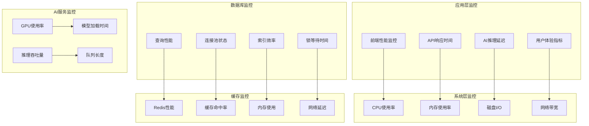

# 太上老君AI平台 - 性能调优指南

## 概述

本文档详细介绍太上老君AI平台的性能调优策略，包括系统架构优化、数据库性能调优、缓存策略优化、AI服务性能优化等方面的最佳实践。

## 性能监控架构



## 系统架构优化

### 1. 负载均衡优化

```yaml
# performance/nginx-optimization.yaml
apiVersion: v1
kind: ConfigMap
metadata:
  name: nginx-performance-config
  namespace: taishanglaojun-prod
data:
  nginx.conf: |
    user nginx;
    worker_processes auto;
    worker_rlimit_nofile 65535;
    
    error_log /var/log/nginx/error.log warn;
    pid /var/run/nginx.pid;
    
    events {
        worker_connections 4096;
        use epoll;
        multi_accept on;
    }
    
    http {
        include /etc/nginx/mime.types;
        default_type application/octet-stream;
        
        # 日志格式优化
        log_format main '$remote_addr - $remote_user [$time_local] "$request" '
                       '$status $body_bytes_sent "$http_referer" '
                       '"$http_user_agent" "$http_x_forwarded_for" '
                       'rt=$request_time uct="$upstream_connect_time" '
                       'uht="$upstream_header_time" urt="$upstream_response_time"';
        
        access_log /var/log/nginx/access.log main;
        
        # 性能优化配置
        sendfile on;
        tcp_nopush on;
        tcp_nodelay on;
        keepalive_timeout 65;
        keepalive_requests 1000;
        types_hash_max_size 2048;
        server_tokens off;
        
        # 缓冲区优化
        client_body_buffer_size 128k;
        client_max_body_size 10m;
        client_header_buffer_size 1k;
        large_client_header_buffers 4 4k;
        output_buffers 1 32k;
        postpone_output 1460;
        
        # 压缩优化
        gzip on;
        gzip_vary on;
        gzip_min_length 1024;
        gzip_proxied any;
        gzip_comp_level 6;
        gzip_types
            text/plain
            text/css
            text/xml
            text/javascript
            application/json
            application/javascript
            application/xml+rss
            application/atom+xml
            image/svg+xml;
        
        # 连接池优化
        upstream backend {
            least_conn;
            keepalive 32;
            keepalive_requests 1000;
            keepalive_timeout 60s;
            
            server backend-1:8080 max_fails=3 fail_timeout=30s weight=1;
            server backend-2:8080 max_fails=3 fail_timeout=30s weight=1;
            server backend-3:8080 max_fails=3 fail_timeout=30s weight=1;
        }
        
        upstream ai-service {
            least_conn;
            keepalive 16;
            keepalive_requests 100;
            keepalive_timeout 60s;
            
            server ai-service-1:8000 max_fails=2 fail_timeout=30s weight=1;
            server ai-service-2:8000 max_fails=2 fail_timeout=30s weight=1;
        }
        
        # 缓存配置
        proxy_cache_path /var/cache/nginx levels=1:2 keys_zone=api_cache:10m 
                        max_size=1g inactive=60m use_temp_path=off;
        
        server {
            listen 80;
            server_name taishanglaojun.com;
            
            # 静态资源缓存
            location ~* \.(js|css|png|jpg|jpeg|gif|ico|svg|woff|woff2|ttf|eot)$ {
                expires 1y;
                add_header Cache-Control "public, immutable";
                add_header Vary Accept-Encoding;
                access_log off;
            }
            
            # API代理优化
            location /api/ {
                proxy_pass http://backend;
                proxy_http_version 1.1;
                proxy_set_header Upgrade $http_upgrade;
                proxy_set_header Connection "upgrade";
                proxy_set_header Host $host;
                proxy_set_header X-Real-IP $remote_addr;
                proxy_set_header X-Forwarded-For $proxy_add_x_forwarded_for;
                proxy_set_header X-Forwarded-Proto $scheme;
                
                # 缓冲区优化
                proxy_buffering on;
                proxy_buffer_size 4k;
                proxy_buffers 8 4k;
                proxy_busy_buffers_size 8k;
                
                # 超时优化
                proxy_connect_timeout 5s;
                proxy_send_timeout 60s;
                proxy_read_timeout 60s;
                
                # 缓存配置
                proxy_cache api_cache;
                proxy_cache_valid 200 302 10m;
                proxy_cache_valid 404 1m;
                proxy_cache_use_stale error timeout updating http_500 http_502 http_503 http_504;
                proxy_cache_lock on;
                proxy_cache_lock_timeout 5s;
                
                add_header X-Cache-Status $upstream_cache_status;
            }
            
            # AI服务代理
            location /ai/ {
                proxy_pass http://ai-service;
                proxy_http_version 1.1;
                proxy_set_header Connection "";
                proxy_set_header Host $host;
                proxy_set_header X-Real-IP $remote_addr;
                proxy_set_header X-Forwarded-For $proxy_add_x_forwarded_for;
                proxy_set_header X-Forwarded-Proto $scheme;
                
                # AI服务特殊配置
                proxy_connect_timeout 10s;
                proxy_send_timeout 300s;
                proxy_read_timeout 300s;
                proxy_buffering off;
            }
        }
    }

---
apiVersion: apps/v1
kind: Deployment
metadata:
  name: nginx-optimized
  namespace: taishanglaojun-prod
spec:
  replicas: 3
  selector:
    matchLabels:
      app: nginx
  template:
    metadata:
      labels:
        app: nginx
    spec:
      containers:
      - name: nginx
        image: nginx:1.25-alpine
        ports:
        - containerPort: 80
        volumeMounts:
        - name: nginx-config
          mountPath: /etc/nginx/nginx.conf
          subPath: nginx.conf
        - name: cache-volume
          mountPath: /var/cache/nginx
        resources:
          requests:
            memory: "128Mi"
            cpu: "100m"
          limits:
            memory: "256Mi"
            cpu: "500m"
        livenessProbe:
          httpGet:
            path: /health
            port: 80
          initialDelaySeconds: 30
          periodSeconds: 10
        readinessProbe:
          httpGet:
            path: /health
            port: 80
          initialDelaySeconds: 5
          periodSeconds: 5
      volumes:
      - name: nginx-config
        configMap:
          name: nginx-performance-config
      - name: cache-volume
        emptyDir:
          sizeLimit: 1Gi
```

### 2. 应用服务优化

```go
// pkg/performance/optimization.go
package performance

import (
    "context"
    "net/http"
    "runtime"
    "sync"
    "time"
    
    "github.com/gin-gonic/gin"
    "golang.org/x/time/rate"
)

// 连接池优化
type OptimizedHTTPClient struct {
    client *http.Client
}

func NewOptimizedHTTPClient() *OptimizedHTTPClient {
    transport := &http.Transport{
        MaxIdleConns:        100,
        MaxIdleConnsPerHost: 20,
        IdleConnTimeout:     90 * time.Second,
        DisableCompression:  false,
        ForceAttemptHTTP2:   true,
    }
    
    client := &http.Client{
        Transport: transport,
        Timeout:   30 * time.Second,
    }
    
    return &OptimizedHTTPClient{client: client}
}

// 内存池优化
type BufferPool struct {
    pool sync.Pool
}

func NewBufferPool() *BufferPool {
    return &BufferPool{
        pool: sync.Pool{
            New: func() interface{} {
                return make([]byte, 0, 1024)
            },
        },
    }
}

func (bp *BufferPool) Get() []byte {
    return bp.pool.Get().([]byte)
}

func (bp *BufferPool) Put(buf []byte) {
    if cap(buf) > 1024*1024 { // 1MB
        return // 不回收过大的缓冲区
    }
    bp.pool.Put(buf[:0])
}

// 限流器
type RateLimiter struct {
    limiters map[string]*rate.Limiter
    mu       sync.RWMutex
}

func NewRateLimiter() *RateLimiter {
    return &RateLimiter{
        limiters: make(map[string]*rate.Limiter),
    }
}

func (rl *RateLimiter) GetLimiter(key string, r rate.Limit, b int) *rate.Limiter {
    rl.mu.RLock()
    limiter, exists := rl.limiters[key]
    rl.mu.RUnlock()
    
    if !exists {
        rl.mu.Lock()
        limiter, exists = rl.limiters[key]
        if !exists {
            limiter = rate.NewLimiter(r, b)
            rl.limiters[key] = limiter
        }
        rl.mu.Unlock()
    }
    
    return limiter
}

func (rl *RateLimiter) RateLimitMiddleware(requestsPerSecond int, burst int) gin.HandlerFunc {
    return func(c *gin.Context) {
        key := c.ClientIP()
        limiter := rl.GetLimiter(key, rate.Limit(requestsPerSecond), burst)
        
        if !limiter.Allow() {
            c.JSON(http.StatusTooManyRequests, gin.H{
                "error": "Rate limit exceeded",
            })
            c.Abort()
            return
        }
        
        c.Next()
    }
}

// 响应缓存中间件
type ResponseCache struct {
    cache map[string]CacheEntry
    mu    sync.RWMutex
}

type CacheEntry struct {
    Data      []byte
    Headers   map[string]string
    ExpiresAt time.Time
}

func NewResponseCache() *ResponseCache {
    cache := &ResponseCache{
        cache: make(map[string]CacheEntry),
    }
    
    // 定期清理过期缓存
    go cache.cleanup()
    
    return cache
}

func (rc *ResponseCache) cleanup() {
    ticker := time.NewTicker(5 * time.Minute)
    defer ticker.Stop()
    
    for range ticker.C {
        rc.mu.Lock()
        now := time.Now()
        for key, entry := range rc.cache {
            if now.After(entry.ExpiresAt) {
                delete(rc.cache, key)
            }
        }
        rc.mu.Unlock()
    }
}

func (rc *ResponseCache) CacheMiddleware(duration time.Duration) gin.HandlerFunc {
    return func(c *gin.Context) {
        // 只缓存GET请求
        if c.Request.Method != "GET" {
            c.Next()
            return
        }
        
        key := c.Request.URL.String()
        
        // 检查缓存
        rc.mu.RLock()
        entry, exists := rc.cache[key]
        rc.mu.RUnlock()
        
        if exists && time.Now().Before(entry.ExpiresAt) {
            // 返回缓存数据
            for k, v := range entry.Headers {
                c.Header(k, v)
            }
            c.Header("X-Cache", "HIT")
            c.Data(http.StatusOK, "application/json", entry.Data)
            c.Abort()
            return
        }
        
        // 捕获响应
        writer := &responseWriter{
            ResponseWriter: c.Writer,
            body:          make([]byte, 0),
        }
        c.Writer = writer
        
        c.Next()
        
        // 缓存响应
        if c.Writer.Status() == http.StatusOK {
            headers := make(map[string]string)
            for k, v := range c.Writer.Header() {
                if len(v) > 0 {
                    headers[k] = v[0]
                }
            }
            
            rc.mu.Lock()
            rc.cache[key] = CacheEntry{
                Data:      writer.body,
                Headers:   headers,
                ExpiresAt: time.Now().Add(duration),
            }
            rc.mu.Unlock()
            
            c.Header("X-Cache", "MISS")
        }
    }
}

type responseWriter struct {
    gin.ResponseWriter
    body []byte
}

func (w *responseWriter) Write(data []byte) (int, error) {
    w.body = append(w.body, data...)
    return w.ResponseWriter.Write(data)
}

// 性能监控中间件
func PerformanceMonitoringMiddleware() gin.HandlerFunc {
    return func(c *gin.Context) {
        start := time.Now()
        
        // 记录内存使用
        var m1 runtime.MemStats
        runtime.ReadMemStats(&m1)
        
        c.Next()
        
        // 计算性能指标
        duration := time.Since(start)
        
        var m2 runtime.MemStats
        runtime.ReadMemStats(&m2)
        
        // 记录性能指标
        c.Header("X-Response-Time", duration.String())
        c.Header("X-Memory-Used", fmt.Sprintf("%d", m2.Alloc-m1.Alloc))
        
        // 记录到监控系统
        recordPerformanceMetrics(c.Request.URL.Path, duration, m2.Alloc-m1.Alloc)
    }
}

func recordPerformanceMetrics(path string, duration time.Duration, memoryUsed uint64) {
    // 实现性能指标记录逻辑
    // 可以发送到Prometheus、InfluxDB等监控系统
}

// 优化的JSON序列化
import "github.com/json-iterator/go"

var json = jsoniter.ConfigCompatibleWithStandardLibrary

func OptimizedJSONMiddleware() gin.HandlerFunc {
    return func(c *gin.Context) {
        c.Next()
        
        // 使用优化的JSON库
        if c.Writer.Header().Get("Content-Type") == "application/json" {
            // 这里可以添加JSON优化逻辑
        }
    }
}
```

## 数据库性能优化

### 1. PostgreSQL优化配置

```sql
-- PostgreSQL性能优化配置
-- postgresql.conf优化参数

-- 内存配置
shared_buffers = '256MB'                    -- 共享缓冲区，通常设置为总内存的25%
effective_cache_size = '1GB'                -- 操作系统缓存大小
work_mem = '4MB'                           -- 排序和哈希操作内存
maintenance_work_mem = '64MB'               -- 维护操作内存
wal_buffers = '16MB'                       -- WAL缓冲区

-- 检查点配置
checkpoint_completion_target = 0.9          -- 检查点完成目标
checkpoint_timeout = '10min'                -- 检查点超时
max_wal_size = '1GB'                       -- 最大WAL大小
min_wal_size = '80MB'                      -- 最小WAL大小

-- 连接配置
max_connections = 200                       -- 最大连接数
shared_preload_libraries = 'pg_stat_statements' -- 预加载库

-- 查询优化
random_page_cost = 1.1                     -- 随机页面成本
effective_io_concurrency = 200             -- 有效IO并发
default_statistics_target = 100            -- 统计信息目标

-- 日志配置
log_min_duration_statement = 1000          -- 记录慢查询（1秒）
log_checkpoints = on                       -- 记录检查点
log_connections = on                       -- 记录连接
log_disconnections = on                    -- 记录断开连接
log_lock_waits = on                        -- 记录锁等待

-- 自动清理配置
autovacuum = on                            -- 启用自动清理
autovacuum_max_workers = 3                 -- 自动清理工作进程数
autovacuum_naptime = '1min'                -- 自动清理间隔

-- 创建性能监控视图
CREATE OR REPLACE VIEW performance_stats AS
SELECT 
    schemaname,
    tablename,
    attname,
    n_distinct,
    correlation,
    most_common_vals,
    most_common_freqs
FROM pg_stats 
WHERE schemaname NOT IN ('information_schema', 'pg_catalog');

-- 创建慢查询监控视图
CREATE OR REPLACE VIEW slow_queries AS
SELECT 
    query,
    calls,
    total_time,
    mean_time,
    rows,
    100.0 * shared_blks_hit / nullif(shared_blks_hit + shared_blks_read, 0) AS hit_percent
FROM pg_stat_statements 
ORDER BY total_time DESC;

-- 创建索引使用统计视图
CREATE OR REPLACE VIEW index_usage AS
SELECT 
    schemaname,
    tablename,
    indexname,
    idx_tup_read,
    idx_tup_fetch,
    idx_scan,
    CASE 
        WHEN idx_scan = 0 THEN 'Unused'
        WHEN idx_scan < 10 THEN 'Low Usage'
        ELSE 'Active'
    END as usage_status
FROM pg_stat_user_indexes
ORDER BY idx_scan;

-- 创建表大小统计视图
CREATE OR REPLACE VIEW table_sizes AS
SELECT 
    schemaname,
    tablename,
    pg_size_pretty(pg_total_relation_size(schemaname||'.'||tablename)) as size,
    pg_total_relation_size(schemaname||'.'||tablename) as size_bytes
FROM pg_tables 
WHERE schemaname NOT IN ('information_schema', 'pg_catalog')
ORDER BY size_bytes DESC;

-- 优化查询示例
-- 1. 用户查询优化
CREATE INDEX CONCURRENTLY idx_users_email_active 
ON users(email) WHERE active = true;

CREATE INDEX CONCURRENTLY idx_users_created_at_desc 
ON users(created_at DESC);

-- 2. 聊天记录查询优化
CREATE INDEX CONCURRENTLY idx_chat_messages_user_created 
ON chat_messages(user_id, created_at DESC);

CREATE INDEX CONCURRENTLY idx_chat_messages_session_created 
ON chat_messages(session_id, created_at DESC);

-- 3. 文档查询优化
CREATE INDEX CONCURRENTLY idx_documents_user_status 
ON documents(user_id, status) WHERE status IN ('active', 'processing');

-- 4. 全文搜索优化
CREATE INDEX CONCURRENTLY idx_documents_content_gin 
ON documents USING gin(to_tsvector('english', content));

-- 分区表示例（大表优化）
-- 按时间分区聊天记录表
CREATE TABLE chat_messages_partitioned (
    id BIGSERIAL,
    user_id BIGINT NOT NULL,
    session_id UUID NOT NULL,
    content TEXT NOT NULL,
    created_at TIMESTAMP NOT NULL DEFAULT CURRENT_TIMESTAMP
) PARTITION BY RANGE (created_at);

-- 创建分区
CREATE TABLE chat_messages_2024_01 PARTITION OF chat_messages_partitioned
    FOR VALUES FROM ('2024-01-01') TO ('2024-02-01');

CREATE TABLE chat_messages_2024_02 PARTITION OF chat_messages_partitioned
    FOR VALUES FROM ('2024-02-01') TO ('2024-03-01');

-- 自动创建分区的函数
CREATE OR REPLACE FUNCTION create_monthly_partition(table_name text, start_date date)
RETURNS void AS $$
DECLARE
    partition_name text;
    end_date date;
BEGIN
    partition_name := table_name || '_' || to_char(start_date, 'YYYY_MM');
    end_date := start_date + interval '1 month';
    
    EXECUTE format('CREATE TABLE %I PARTITION OF %I FOR VALUES FROM (%L) TO (%L)',
                   partition_name, table_name, start_date, end_date);
    
    EXECUTE format('CREATE INDEX ON %I (user_id, created_at DESC)', partition_name);
    EXECUTE format('CREATE INDEX ON %I (session_id, created_at DESC)', partition_name);
END;
$$ LANGUAGE plpgsql;

-- 数据库维护脚本
-- 1. 重建统计信息
DO $$
DECLARE
    rec RECORD;
BEGIN
    FOR rec IN 
        SELECT schemaname, tablename 
        FROM pg_tables 
        WHERE schemaname NOT IN ('information_schema', 'pg_catalog')
    LOOP
        EXECUTE 'ANALYZE ' || quote_ident(rec.schemaname) || '.' || quote_ident(rec.tablename);
    END LOOP;
END $$;

-- 2. 重建索引
DO $$
DECLARE
    rec RECORD;
BEGIN
    FOR rec IN 
        SELECT schemaname, indexname 
        FROM pg_indexes 
        WHERE schemaname NOT IN ('information_schema', 'pg_catalog')
        AND indexname NOT LIKE 'pg_%'
    LOOP
        EXECUTE 'REINDEX INDEX CONCURRENTLY ' || quote_ident(rec.schemaname) || '.' || quote_ident(rec.indexname);
    END LOOP;
END $$;

-- 3. 清理无用数据
-- 删除过期的聊天记录（保留6个月）
DELETE FROM chat_messages 
WHERE created_at < CURRENT_DATE - INTERVAL '6 months';

-- 删除过期的日志记录（保留3个月）
DELETE FROM audit_logs 
WHERE created_at < CURRENT_DATE - INTERVAL '3 months';

-- 4. 表空间优化
VACUUM (VERBOSE, ANALYZE) chat_messages;
VACUUM (VERBOSE, ANALYZE) documents;
VACUUM (VERBOSE, ANALYZE) users;
```

### 2. 连接池优化

```go
// pkg/database/pool.go
package database

import (
    "context"
    "database/sql"
    "time"
    
    "github.com/jackc/pgx/v5/pgxpool"
    _ "github.com/lib/pq"
)

type OptimizedDB struct {
    pool *pgxpool.Pool
}

func NewOptimizedDB(databaseURL string) (*OptimizedDB, error) {
    config, err := pgxpool.ParseConfig(databaseURL)
    if err != nil {
        return nil, err
    }
    
    // 连接池优化配置
    config.MaxConns = 30                          // 最大连接数
    config.MinConns = 5                           // 最小连接数
    config.MaxConnLifetime = time.Hour            // 连接最大生命周期
    config.MaxConnIdleTime = time.Minute * 30     // 连接最大空闲时间
    config.HealthCheckPeriod = time.Minute        // 健康检查周期
    
    // 连接配置优化
    config.ConnConfig.ConnectTimeout = time.Second * 10
    config.ConnConfig.RuntimeParams["application_name"] = "taishanglaojun"
    config.ConnConfig.RuntimeParams["search_path"] = "public"
    
    pool, err := pgxpool.NewWithConfig(context.Background(), config)
    if err != nil {
        return nil, err
    }
    
    return &OptimizedDB{pool: pool}, nil
}

func (db *OptimizedDB) Close() {
    db.pool.Close()
}

// 批量插入优化
func (db *OptimizedDB) BatchInsertChatMessages(messages []ChatMessage) error {
    ctx := context.Background()
    
    batch := &pgx.Batch{}
    for _, msg := range messages {
        batch.Queue(
            "INSERT INTO chat_messages (user_id, session_id, content, created_at) VALUES ($1, $2, $3, $4)",
            msg.UserID, msg.SessionID, msg.Content, msg.CreatedAt,
        )
    }
    
    br := db.pool.SendBatch(ctx, batch)
    defer br.Close()
    
    for range messages {
        _, err := br.Exec()
        if err != nil {
            return err
        }
    }
    
    return nil
}

// 预编译语句缓存
type PreparedStatements struct {
    getUserByID    *sql.Stmt
    getChatHistory *sql.Stmt
    insertMessage  *sql.Stmt
}

func (db *OptimizedDB) PrepareCachedStatements() (*PreparedStatements, error) {
    getUserByID, err := db.pool.Prepare(context.Background(), "get_user_by_id",
        "SELECT id, username, email, created_at FROM users WHERE id = $1")
    if err != nil {
        return nil, err
    }
    
    getChatHistory, err := db.pool.Prepare(context.Background(), "get_chat_history",
        "SELECT id, content, created_at FROM chat_messages WHERE session_id = $1 ORDER BY created_at DESC LIMIT $2")
    if err != nil {
        return nil, err
    }
    
    insertMessage, err := db.pool.Prepare(context.Background(), "insert_message",
        "INSERT INTO chat_messages (user_id, session_id, content) VALUES ($1, $2, $3) RETURNING id")
    if err != nil {
        return nil, err
    }
    
    return &PreparedStatements{
        getUserByID:    getUserByID,
        getChatHistory: getChatHistory,
        insertMessage:  insertMessage,
    }, nil
}

// 读写分离
type ReadWriteDB struct {
    writeDB *OptimizedDB
    readDB  *OptimizedDB
}

func NewReadWriteDB(writeURL, readURL string) (*ReadWriteDB, error) {
    writeDB, err := NewOptimizedDB(writeURL)
    if err != nil {
        return nil, err
    }
    
    readDB, err := NewOptimizedDB(readURL)
    if err != nil {
        return nil, err
    }
    
    return &ReadWriteDB{
        writeDB: writeDB,
        readDB:  readDB,
    }, nil
}

func (rw *ReadWriteDB) Write() *OptimizedDB {
    return rw.writeDB
}

func (rw *ReadWriteDB) Read() *OptimizedDB {
    return rw.readDB
}
```

## Redis缓存优化

### 1. Redis配置优化

```conf
# redis.conf 性能优化配置

# 内存配置
maxmemory 2gb
maxmemory-policy allkeys-lru
maxmemory-samples 5

# 持久化配置
save 900 1
save 300 10
save 60 10000

# AOF配置
appendonly yes
appendfsync everysec
no-appendfsync-on-rewrite no
auto-aof-rewrite-percentage 100
auto-aof-rewrite-min-size 64mb

# 网络配置
tcp-keepalive 300
timeout 0
tcp-backlog 511

# 客户端配置
maxclients 10000

# 慢日志配置
slowlog-log-slower-than 10000
slowlog-max-len 128

# 延迟监控
latency-monitor-threshold 100

# 内存优化
hash-max-ziplist-entries 512
hash-max-ziplist-value 64
list-max-ziplist-size -2
list-compress-depth 0
set-max-intset-entries 512
zset-max-ziplist-entries 128
zset-max-ziplist-value 64

# 线程配置
io-threads 4
io-threads-do-reads yes

# 安全配置
protected-mode yes
requirepass your_redis_password
```

### 2. Redis客户端优化

```go
// pkg/cache/redis_optimized.go
package cache

import (
    "context"
    "encoding/json"
    "time"
    
    "github.com/go-redis/redis/v8"
    "github.com/go-redis/cache/v8"
)

type OptimizedRedisClient struct {
    client *redis.Client
    cache  *cache.Cache
}

func NewOptimizedRedisClient(addr, password string, db int) *OptimizedRedisClient {
    rdb := redis.NewClient(&redis.Options{
        Addr:         addr,
        Password:     password,
        DB:           db,
        PoolSize:     20,              // 连接池大小
        MinIdleConns: 5,               // 最小空闲连接
        MaxRetries:   3,               // 最大重试次数
        DialTimeout:  5 * time.Second, // 连接超时
        ReadTimeout:  3 * time.Second, // 读取超时
        WriteTimeout: 3 * time.Second, // 写入超时
        PoolTimeout:  4 * time.Second, // 连接池超时
        IdleTimeout:  5 * time.Minute, // 空闲连接超时
    })
    
    // 创建缓存实例
    mycache := cache.New(&cache.Options{
        Redis:      rdb,
        LocalCache: cache.NewTinyLFU(1000, time.Minute),
    })
    
    return &OptimizedRedisClient{
        client: rdb,
        cache:  mycache,
    }
}

// 批量操作优化
func (r *OptimizedRedisClient) BatchSet(ctx context.Context, items map[string]interface{}, expiration time.Duration) error {
    pipe := r.client.Pipeline()
    
    for key, value := range items {
        data, err := json.Marshal(value)
        if err != nil {
            return err
        }
        pipe.Set(ctx, key, data, expiration)
    }
    
    _, err := pipe.Exec(ctx)
    return err
}

func (r *OptimizedRedisClient) BatchGet(ctx context.Context, keys []string) (map[string]string, error) {
    pipe := r.client.Pipeline()
    
    cmds := make([]*redis.StringCmd, len(keys))
    for i, key := range keys {
        cmds[i] = pipe.Get(ctx, key)
    }
    
    _, err := pipe.Exec(ctx)
    if err != nil && err != redis.Nil {
        return nil, err
    }
    
    result := make(map[string]string)
    for i, cmd := range cmds {
        val, err := cmd.Result()
        if err == nil {
            result[keys[i]] = val
        }
    }
    
    return result, nil
}

// 分布式锁优化
func (r *OptimizedRedisClient) AcquireLock(ctx context.Context, key string, expiration time.Duration) (bool, error) {
    script := `
        if redis.call("get", KEYS[1]) == ARGV[1] then
            return redis.call("del", KEYS[1])
        else
            return 0
        end
    `
    
    value := generateUniqueID()
    result, err := r.client.SetNX(ctx, key, value, expiration).Result()
    if err != nil {
        return false, err
    }
    
    if result {
        // 设置自动续期
        go r.renewLock(ctx, key, value, expiration)
    }
    
    return result, nil
}

func (r *OptimizedRedisClient) renewLock(ctx context.Context, key, value string, expiration time.Duration) {
    ticker := time.NewTicker(expiration / 3)
    defer ticker.Stop()
    
    for {
        select {
        case <-ctx.Done():
            return
        case <-ticker.C:
            script := `
                if redis.call("get", KEYS[1]) == ARGV[1] then
                    return redis.call("expire", KEYS[1], ARGV[2])
                else
                    return 0
                end
            `
            r.client.Eval(ctx, script, []string{key}, value, int(expiration.Seconds()))
        }
    }
}

// 缓存预热
func (r *OptimizedRedisClient) WarmupCache(ctx context.Context) error {
    // 预热用户数据
    users, err := getUsersFromDB()
    if err != nil {
        return err
    }
    
    pipe := r.client.Pipeline()
    for _, user := range users {
        key := fmt.Sprintf("user:%d", user.ID)
        data, _ := json.Marshal(user)
        pipe.Set(ctx, key, data, time.Hour)
    }
    
    // 预热热门文档
    documents, err := getPopularDocumentsFromDB()
    if err != nil {
        return err
    }
    
    for _, doc := range documents {
        key := fmt.Sprintf("document:%d", doc.ID)
        data, _ := json.Marshal(doc)
        pipe.Set(ctx, key, data, 30*time.Minute)
    }
    
    _, err = pipe.Exec(ctx)
    return err
}

// 缓存策略优化
type CacheStrategy struct {
    client *OptimizedRedisClient
}

func NewCacheStrategy(client *OptimizedRedisClient) *CacheStrategy {
    return &CacheStrategy{client: client}
}

// 多级缓存
func (cs *CacheStrategy) GetWithFallback(ctx context.Context, key string, fallback func() (interface{}, error)) (interface{}, error) {
    // 1. 尝试从本地缓存获取
    var result interface{}
    err := cs.client.cache.Get(ctx, key, &result)
    if err == nil {
        return result, nil
    }
    
    // 2. 尝试从Redis获取
    val, err := cs.client.client.Get(ctx, key).Result()
    if err == nil {
        json.Unmarshal([]byte(val), &result)
        // 回写到本地缓存
        cs.client.cache.Set(&cache.Item{
            Key:   key,
            Value: result,
            TTL:   time.Minute,
        })
        return result, nil
    }
    
    // 3. 从数据源获取
    result, err = fallback()
    if err != nil {
        return nil, err
    }
    
    // 4. 写入缓存
    cs.client.cache.Set(&cache.Item{
        Key:   key,
        Value: result,
        TTL:   time.Hour,
    })
    
    data, _ := json.Marshal(result)
    cs.client.client.Set(ctx, key, data, time.Hour)
    
    return result, nil
}

// 缓存穿透防护
func (cs *CacheStrategy) GetWithBloomFilter(ctx context.Context, key string, exists func(string) bool, getter func() (interface{}, error)) (interface{}, error) {
    // 检查布隆过滤器
    if !exists(key) {
        return nil, ErrNotFound
    }
    
    return cs.GetWithFallback(ctx, key, getter)
}

// 缓存雪崩防护
func (cs *CacheStrategy) SetWithRandomTTL(ctx context.Context, key string, value interface{}, baseTTL time.Duration) error {
    // 添加随机时间，防止缓存雪崩
    randomTTL := baseTTL + time.Duration(rand.Intn(300))*time.Second
    
    data, err := json.Marshal(value)
    if err != nil {
        return err
    }
    
    return cs.client.client.Set(ctx, key, data, randomTTL).Err()
}
```

## AI服务性能优化

### 1. 模型推理优化

```python
# ai_service/optimization/model_optimizer.py
import torch
import torch.nn as nn
from torch.jit import script
from transformers import AutoTokenizer, AutoModel
import onnxruntime as ort
import tensorrt as trt
import numpy as np
from typing import List, Dict, Any
import asyncio
import aioredis
from concurrent.futures import ThreadPoolExecutor
import queue
import threading
import time

class ModelOptimizer:
    def __init__(self, model_name: str, device: str = "cuda"):
        self.model_name = model_name
        self.device = device
        self.tokenizer = AutoTokenizer.from_pretrained(model_name)
        self.model = AutoModel.from_pretrained(model_name)
        self.model.to(device)
        self.model.eval()
        
        # 模型优化
        self._optimize_model()
        
    def _optimize_model(self):
        """模型优化"""
        # 1. 编译模型
        if hasattr(torch, 'compile'):
            self.model = torch.compile(self.model)
        
        # 2. 转换为TorchScript
        try:
            sample_input = self.tokenizer("Hello world", return_tensors="pt")
            sample_input = {k: v.to(self.device) for k, v in sample_input.items()}
            self.scripted_model = script(self.model)
        except Exception as e:
            print(f"TorchScript conversion failed: {e}")
            self.scripted_model = self.model
    
    def convert_to_onnx(self, output_path: str):
        """转换为ONNX格式"""
        sample_input = self.tokenizer("Hello world", return_tensors="pt")
        sample_input = {k: v.to(self.device) for k, v in sample_input.items()}
        
        torch.onnx.export(
            self.model,
            (sample_input['input_ids'], sample_input['attention_mask']),
            output_path,
            export_params=True,
            opset_version=11,
            do_constant_folding=True,
            input_names=['input_ids', 'attention_mask'],
            output_names=['output'],
            dynamic_axes={
                'input_ids': {0: 'batch_size', 1: 'sequence'},
                'attention_mask': {0: 'batch_size', 1: 'sequence'},
                'output': {0: 'batch_size', 1: 'sequence'}
            }
        )

class BatchProcessor:
    def __init__(self, model_optimizer: ModelOptimizer, batch_size: int = 8, max_wait_time: float = 0.1):
        self.model_optimizer = model_optimizer
        self.batch_size = batch_size
        self.max_wait_time = max_wait_time
        self.request_queue = queue.Queue()
        self.response_futures = {}
        self.processing = False
        
        # 启动批处理线程
        self.batch_thread = threading.Thread(target=self._batch_processing_loop)
        self.batch_thread.daemon = True
        self.batch_thread.start()
    
    async def process_async(self, text: str) -> Dict[str, Any]:
        """异步处理请求"""
        future = asyncio.Future()
        request_id = id(future)
        
        self.request_queue.put({
            'id': request_id,
            'text': text,
            'future': future
        })
        
        return await future
    
    def _batch_processing_loop(self):
        """批处理循环"""
        while True:
            batch = []
            start_time = time.time()
            
            # 收集批次
            while len(batch) < self.batch_size and (time.time() - start_time) < self.max_wait_time:
                try:
                    request = self.request_queue.get(timeout=0.01)
                    batch.append(request)
                except queue.Empty:
                    continue
            
            if not batch:
                continue
            
            # 处理批次
            try:
                texts = [req['text'] for req in batch]
                results = self._process_batch(texts)
                
                # 返回结果
                for req, result in zip(batch, results):
                    req['future'].set_result(result)
                    
            except Exception as e:
                # 处理错误
                for req in batch:
                    req['future'].set_exception(e)
    
    def _process_batch(self, texts: List[str]) -> List[Dict[str, Any]]:
        """批量处理文本"""
        # 批量编码
        inputs = self.model_optimizer.tokenizer(
            texts,
            padding=True,
            truncation=True,
            max_length=512,
            return_tensors="pt"
        )
        inputs = {k: v.to(self.model_optimizer.device) for k, v in inputs.items()}
        
        # 批量推理
        with torch.no_grad():
            outputs = self.model_optimizer.scripted_model(**inputs)
        
        # 处理输出
        results = []
        for i in range(len(texts)):
            result = {
                'text': texts[i],
                'embedding': outputs.last_hidden_state[i].cpu().numpy().tolist(),
                'pooled_output': outputs.pooler_output[i].cpu().numpy().tolist() if hasattr(outputs, 'pooler_output') else None
            }
            results.append(result)
        
        return results

class GPUMemoryManager:
    def __init__(self):
        self.memory_pool = {}
        self.max_memory_usage = 0.8  # 最大GPU内存使用率
    
    def allocate_memory(self, size: int, dtype: torch.dtype = torch.float32) -> torch.Tensor:
        """分配GPU内存"""
        key = (size, dtype)
        
        if key in self.memory_pool:
            return self.memory_pool[key]
        
        # 检查内存使用率
        if torch.cuda.is_available():
            memory_used = torch.cuda.memory_allocated() / torch.cuda.max_memory_allocated()
            if memory_used > self.max_memory_usage:
                self.cleanup_memory()
        
        tensor = torch.empty(size, dtype=dtype, device='cuda')
        self.memory_pool[key] = tensor
        return tensor
    
    def cleanup_memory(self):
        """清理GPU内存"""
        self.memory_pool.clear()
        if torch.cuda.is_available():
            torch.cuda.empty_cache()

class ModelCache:
    def __init__(self, redis_url: str):
        self.redis = aioredis.from_url(redis_url)
        self.local_cache = {}
        self.cache_ttl = 3600  # 1小时
    
    async def get_cached_result(self, text_hash: str) -> Dict[str, Any]:
        """获取缓存结果"""
        # 先检查本地缓存
        if text_hash in self.local_cache:
            return self.local_cache[text_hash]
        
        # 检查Redis缓存
        cached = await self.redis.get(f"model_result:{text_hash}")
        if cached:
            result = json.loads(cached)
            self.local_cache[text_hash] = result
            return result
        
        return None
    
    async def cache_result(self, text_hash: str, result: Dict[str, Any]):
        """缓存结果"""
        # 缓存到本地
        self.local_cache[text_hash] = result
        
        # 缓存到Redis
        await self.redis.setex(
            f"model_result:{text_hash}",
            self.cache_ttl,
            json.dumps(result)
        )

class OptimizedAIService:
    def __init__(self, model_name: str, redis_url: str):
        self.model_optimizer = ModelOptimizer(model_name)
        self.batch_processor = BatchProcessor(self.model_optimizer)
        self.memory_manager = GPUMemoryManager()
        self.model_cache = ModelCache(redis_url)
        self.executor = ThreadPoolExecutor(max_workers=4)
    
    async def process_text(self, text: str) -> Dict[str, Any]:
        """处理文本"""
        # 计算文本哈希
        text_hash = hashlib.md5(text.encode()).hexdigest()
        
        # 检查缓存
        cached_result = await self.model_cache.get_cached_result(text_hash)
        if cached_result:
            return cached_result
        
        # 批量处理
        result = await self.batch_processor.process_async(text)
        
        # 缓存结果
        await self.model_cache.cache_result(text_hash, result)
        
        return result
    
    async def health_check(self) -> Dict[str, Any]:
        """健康检查"""
        gpu_memory = torch.cuda.memory_allocated() / torch.cuda.max_memory_allocated() if torch.cuda.is_available() else 0
        
        return {
            'status': 'healthy',
            'gpu_memory_usage': gpu_memory,
            'queue_size': self.batch_processor.request_queue.qsize(),
            'cache_size': len(self.model_cache.local_cache)
        }
```

### 2. 推理服务部署优化

```yaml
# ai-service/deployment-optimized.yaml
apiVersion: apps/v1
kind: Deployment
metadata:
  name: ai-service-optimized
  namespace: taishanglaojun-prod
spec:
  replicas: 3
  selector:
    matchLabels:
      app: ai-service
  template:
    metadata:
      labels:
        app: ai-service
    spec:
      nodeSelector:
        accelerator: nvidia-tesla-v100
      containers:
      - name: ai-service
        image: taishanglaojun/ai-service:optimized
        ports:
        - containerPort: 8000
        env:
        - name: CUDA_VISIBLE_DEVICES
          value: "0"
        - name: NVIDIA_VISIBLE_DEVICES
          value: "all"
        - name: NVIDIA_DRIVER_CAPABILITIES
          value: "compute,utility"
        - name: BATCH_SIZE
          value: "16"
        - name: MAX_WAIT_TIME
          value: "0.1"
        - name: MODEL_CACHE_SIZE
          value: "1000"
        resources:
          requests:
            memory: "8Gi"
            cpu: "2"
            nvidia.com/gpu: 1
          limits:
            memory: "16Gi"
            cpu: "4"
            nvidia.com/gpu: 1
        volumeMounts:
        - name: model-cache
          mountPath: /app/model_cache
        - name: shm
          mountPath: /dev/shm
        livenessProbe:
          httpGet:
            path: /health
            port: 8000
          initialDelaySeconds: 60
          periodSeconds: 30
        readinessProbe:
          httpGet:
            path: /ready
            port: 8000
          initialDelaySeconds: 30
          periodSeconds: 10
        lifecycle:
          preStop:
            exec:
              command: ["/bin/sh", "-c", "sleep 15"]
      volumes:
      - name: model-cache
        emptyDir:
          sizeLimit: 10Gi
      - name: shm
        emptyDir:
          medium: Memory
          sizeLimit: 2Gi
      terminationGracePeriodSeconds: 30

---
apiVersion: v1
kind: Service
metadata:
  name: ai-service
  namespace: taishanglaojun-prod
spec:
  selector:
    app: ai-service
  ports:
  - port: 8000
    targetPort: 8000
  type: ClusterIP

---
apiVersion: autoscaling/v2
kind: HorizontalPodAutoscaler
metadata:
  name: ai-service-hpa
  namespace: taishanglaojun-prod
spec:
  scaleTargetRef:
    apiVersion: apps/v1
    kind: Deployment
    name: ai-service-optimized
  minReplicas: 2
  maxReplicas: 10
  metrics:
  - type: Resource
    resource:
      name: cpu
      target:
        type: Utilization
        averageUtilization: 70
  - type: Resource
    resource:
      name: memory
      target:
        type: Utilization
        averageUtilization: 80
  - type: Pods
    pods:
      metric:
        name: gpu_utilization
      target:
        type: AverageValue
        averageValue: "75"
  behavior:
    scaleDown:
      stabilizationWindowSeconds: 300
      policies:
      - type: Percent
        value: 10
        periodSeconds: 60
    scaleUp:
      stabilizationWindowSeconds: 60
      policies:
      - type: Percent
        value: 50
        periodSeconds: 60
```

## 性能监控脚本

### 1. 性能分析脚本

```bash
#!/bin/bash
# performance/performance_analysis.sh

# 性能分析脚本
set -e

NAMESPACE="taishanglaojun-prod"
LOG_FILE="/var/log/performance_analysis.log"
ALERT_WEBHOOK="https://hooks.slack.com/services/YOUR/SLACK/WEBHOOK"

# 日志函数
log() {
    echo "[$(date '+%Y-%m-%d %H:%M:%S')] $1" | tee -a $LOG_FILE
}

# 发送告警
send_alert() {
    local message="$1"
    local severity="$2"
    
    curl -X POST -H 'Content-type: application/json' \
        --data "{\"text\":\"🚨 Performance Alert [$severity]: $message\"}" \
        $ALERT_WEBHOOK
}

# 检查Pod性能
check_pod_performance() {
    log "检查Pod性能指标..."
    
    # 获取Pod资源使用情况
    kubectl top pods -n $NAMESPACE --no-headers | while read line; do
        pod_name=$(echo $line | awk '{print $1}')
        cpu_usage=$(echo $line | awk '{print $2}' | sed 's/m//')
        memory_usage=$(echo $line | awk '{print $3}' | sed 's/Mi//')
        
        # 检查CPU使用率
        if [ "$cpu_usage" -gt 800 ]; then
            log "WARNING: Pod $pod_name CPU使用率过高: ${cpu_usage}m"
            send_alert "Pod $pod_name CPU使用率过高: ${cpu_usage}m" "WARNING"
        fi
        
        # 检查内存使用率
        if [ "$memory_usage" -gt 1024 ]; then
            log "WARNING: Pod $pod_name 内存使用率过高: ${memory_usage}Mi"
            send_alert "Pod $pod_name 内存使用率过高: ${memory_usage}Mi" "WARNING"
        fi
    done
}

# 检查节点性能
check_node_performance() {
    log "检查节点性能指标..."
    
    kubectl top nodes --no-headers | while read line; do
        node_name=$(echo $line | awk '{print $1}')
        cpu_usage=$(echo $line | awk '{print $2}' | sed 's/%//')
        memory_usage=$(echo $line | awk '{print $4}' | sed 's/%//')
        
        # 检查CPU使用率
        if [ "$cpu_usage" -gt 80 ]; then
            log "CRITICAL: 节点 $node_name CPU使用率过高: ${cpu_usage}%"
            send_alert "节点 $node_name CPU使用率过高: ${cpu_usage}%" "CRITICAL"
        fi
        
        # 检查内存使用率
        if [ "$memory_usage" -gt 85 ]; then
            log "CRITICAL: 节点 $node_name 内存使用率过高: ${memory_usage}%"
            send_alert "节点 $node_name 内存使用率过高: ${memory_usage}%" "CRITICAL"
        fi
    done
}

# 检查网络延迟
check_network_latency() {
    log "检查网络延迟..."
    
    # 检查服务间延迟
    services=("frontend-service" "backend-service" "ai-service")
    
    for service in "${services[@]}"; do
        service_ip=$(kubectl get svc $service -n $NAMESPACE -o jsonpath='{.spec.clusterIP}')
        if [ -n "$service_ip" ]; then
            # 使用curl检查响应时间
            response_time=$(kubectl run temp-pod --rm -i --restart=Never --image=curlimages/curl -- \
                curl -o /dev/null -s -w '%{time_total}' http://$service_ip/health 2>/dev/null || echo "999")
            
            response_time_ms=$(echo "$response_time * 1000" | bc)
            
            if (( $(echo "$response_time_ms > 1000" | bc -l) )); then
                log "WARNING: 服务 $service 响应时间过长: ${response_time_ms}ms"
                send_alert "服务 $service 响应时间过长: ${response_time_ms}ms" "WARNING"
            fi
        fi
    done
}

# 检查数据库性能
check_database_performance() {
    log "检查数据库性能..."
    
    # 获取PostgreSQL Pod
    postgres_pod=$(kubectl get pods -n $NAMESPACE -l app=postgres -o jsonpath='{.items[0].metadata.name}')
    
    if [ -n "$postgres_pod" ]; then
        # 检查活跃连接数
        active_connections=$(kubectl exec -n $NAMESPACE $postgres_pod -- \
            psql -U postgres -d taishanglaojun -t -c "SELECT count(*) FROM pg_stat_activity WHERE state = 'active';" 2>/dev/null | tr -d ' ')
        
        if [ "$active_connections" -gt 50 ]; then
            log "WARNING: PostgreSQL活跃连接数过多: $active_connections"
            send_alert "PostgreSQL活跃连接数过多: $active_connections" "WARNING"
        fi
        
        # 检查慢查询
        slow_queries=$(kubectl exec -n $NAMESPACE $postgres_pod -- \
            psql -U postgres -d taishanglaojun -t -c "SELECT count(*) FROM pg_stat_statements WHERE mean_time > 1000;" 2>/dev/null | tr -d ' ')
        
        if [ "$slow_queries" -gt 10 ]; then
            log "WARNING: PostgreSQL慢查询过多: $slow_queries"
            send_alert "PostgreSQL慢查询过多: $slow_queries" "WARNING"
        fi
    fi
    
    # 检查Redis性能
    redis_pod=$(kubectl get pods -n $NAMESPACE -l app=redis -o jsonpath='{.items[0].metadata.name}')
    
    if [ -n "$redis_pod" ]; then
        # 检查内存使用率
        memory_usage=$(kubectl exec -n $NAMESPACE $redis_pod -- \
            redis-cli info memory | grep used_memory_human | cut -d: -f2 | tr -d '\r')
        
        log "Redis内存使用: $memory_usage"
        
        # 检查连接数
        connected_clients=$(kubectl exec -n $NAMESPACE $redis_pod -- \
            redis-cli info clients | grep connected_clients | cut -d: -f2 | tr -d '\r')
        
        if [ "$connected_clients" -gt 100 ]; then
            log "WARNING: Redis连接数过多: $connected_clients"
            send_alert "Redis连接数过多: $connected_clients" "WARNING"
        fi
    fi
}

# 生成性能报告
generate_performance_report() {
    log "生成性能报告..."
    
    report_file="/tmp/performance_report_$(date +%Y%m%d_%H%M%S).html"
    
    cat > $report_file << EOF
<!DOCTYPE html>
<html>
<head>
    <title>太上老君AI平台性能报告</title>
    <style>
        body { font-family: Arial, sans-serif; margin: 20px; }
        .header { background-color: #f0f0f0; padding: 10px; border-radius: 5px; }
        .section { margin: 20px 0; }
        .metric { background-color: #f9f9f9; padding: 10px; margin: 5px 0; border-left: 4px solid #007cba; }
        .warning { border-left-color: #ff9800; }
        .critical { border-left-color: #f44336; }
        table { border-collapse: collapse; width: 100%; }
        th, td { border: 1px solid #ddd; padding: 8px; text-align: left; }
        th { background-color: #f2f2f2; }
    </style>
</head>
<body>
    <div class="header">
        <h1>太上老君AI平台性能报告</h1>
        <p>生成时间: $(date)</p>
    </div>
    
    <div class="section">
        <h2>系统概览</h2>
        <table>
            <tr><th>指标</th><th>当前值</th><th>状态</th></tr>
EOF

    # 添加系统指标
    kubectl top nodes --no-headers | while read line; do
        node_name=$(echo $line | awk '{print $1}')
        cpu_usage=$(echo $line | awk '{print $2}')
        memory_usage=$(echo $line | awk '{print $4}')
        
        echo "            <tr><td>节点 $node_name CPU</td><td>$cpu_usage</td><td>正常</td></tr>" >> $report_file
        echo "            <tr><td>节点 $node_name 内存</td><td>$memory_usage</td><td>正常</td></tr>" >> $report_file
    done
    
    cat >> $report_file << EOF
        </table>
    </div>
</body>
</html>
EOF

    log "性能报告已生成: $report_file"
}

# 主函数
main() {
    log "开始性能分析..."
    
    check_pod_performance
    check_node_performance
    check_network_latency
    check_database_performance
    generate_performance_report
    
    log "性能分析完成"
}

# 执行主函数
main "$@"
```

### 2. 自动优化脚本

```bash
#!/bin/bash
# performance/auto_optimization.sh

# 自动优化脚本
set -e

NAMESPACE="taishanglaojun-prod"
LOG_FILE="/var/log/auto_optimization.log"

# 日志函数
log() {
    echo "[$(date '+%Y-%m-%d %H:%M:%S')] $1" | tee -a $LOG_FILE
}

# 优化Pod资源配置
optimize_pod_resources() {
    log "开始优化Pod资源配置..."
    
    # 获取Pod资源使用情况
    kubectl top pods -n $NAMESPACE --no-headers | while read line; do
        pod_name=$(echo $line | awk '{print $1}')
        cpu_usage=$(echo $line | awk '{print $2}' | sed 's/m//')
        memory_usage=$(echo $line | awk '{print $3}' | sed 's/Mi//')
        
        # 获取Pod的Deployment
        deployment=$(kubectl get pod $pod_name -n $NAMESPACE -o jsonpath='{.metadata.labels.app}')
        
        if [ -n "$deployment" ]; then
            # 获取当前资源限制
            current_cpu_limit=$(kubectl get deployment $deployment -n $NAMESPACE -o jsonpath='{.spec.template.spec.containers[0].resources.limits.cpu}' | sed 's/m//')
            current_memory_limit=$(kubectl get deployment $deployment -n $NAMESPACE -o jsonpath='{.spec.template.spec.containers[0].resources.limits.memory}' | sed 's/Mi//')
            
            # 计算建议的资源配置
            if [ "$cpu_usage" -gt 0 ] && [ "$current_cpu_limit" -gt 0 ]; then
                cpu_utilization=$((cpu_usage * 100 / current_cpu_limit))
                
                # 如果CPU使用率低于30%，减少资源限制
                if [ "$cpu_utilization" -lt 30 ]; then
                    new_cpu_limit=$((current_cpu_limit * 80 / 100))
                    log "建议减少 $deployment CPU限制: ${current_cpu_limit}m -> ${new_cpu_limit}m"
                    
                    kubectl patch deployment $deployment -n $NAMESPACE -p \
                        "{\"spec\":{\"template\":{\"spec\":{\"containers\":[{\"name\":\"$deployment\",\"resources\":{\"limits\":{\"cpu\":\"${new_cpu_limit}m\"}}}]}}}}"
                
                # 如果CPU使用率高于80%，增加资源限制
                elif [ "$cpu_utilization" -gt 80 ]; then
                    new_cpu_limit=$((current_cpu_limit * 120 / 100))
                    log "建议增加 $deployment CPU限制: ${current_cpu_limit}m -> ${new_cpu_limit}m"
                    
                    kubectl patch deployment $deployment -n $NAMESPACE -p \
                        "{\"spec\":{\"template\":{\"spec\":{\"containers\":[{\"name\":\"$deployment\",\"resources\":{\"limits\":{\"cpu\":\"${new_cpu_limit}m\"}}}]}}}}"
                fi
            fi
        fi
    done
}

# 优化HPA配置
optimize_hpa() {
    log "开始优化HPA配置..."
    
    # 获取所有HPA
    kubectl get hpa -n $NAMESPACE -o json | jq -r '.items[].metadata.name' | while read hpa_name; do
        # 获取当前指标
        current_cpu=$(kubectl get hpa $hpa_name -n $NAMESPACE -o jsonpath='{.status.currentMetrics[0].resource.current.averageUtilization}')
        target_cpu=$(kubectl get hpa $hpa_name -n $NAMESPACE -o jsonpath='{.spec.metrics[0].resource.target.averageUtilization}')
        
        if [ -n "$current_cpu" ] && [ -n "$target_cpu" ]; then
            # 如果当前CPU使用率持续低于目标值的50%，降低目标值
            if [ "$current_cpu" -lt $((target_cpu / 2)) ]; then
                new_target=$((target_cpu - 10))
                if [ "$new_target" -gt 30 ]; then
                    log "调整 $hpa_name CPU目标: ${target_cpu}% -> ${new_target}%"
                    kubectl patch hpa $hpa_name -n $NAMESPACE -p \
                        "{\"spec\":{\"metrics\":[{\"type\":\"Resource\",\"resource\":{\"name\":\"cpu\",\"target\":{\"type\":\"Utilization\",\"averageUtilization\":$new_target}}}]}}"
                fi
            fi
        fi
    done
}

# 数据库优化
optimize_database() {
    log "开始数据库优化..."
    
    postgres_pod=$(kubectl get pods -n $NAMESPACE -l app=postgres -o jsonpath='{.items[0].metadata.name}')
    
    if [ -n "$postgres_pod" ]; then
        # 执行VACUUM ANALYZE
        log "执行PostgreSQL VACUUM ANALYZE..."
        kubectl exec -n $NAMESPACE $postgres_pod -- \
            psql -U postgres -d taishanglaojun -c "VACUUM ANALYZE;"
        
        # 重建统计信息
        log "重建PostgreSQL统计信息..."
        kubectl exec -n $NAMESPACE $postgres_pod -- \
            psql -U postgres -d taishanglaojun -c "
                DO \$\$
                DECLARE
                    rec RECORD;
                BEGIN
                    FOR rec IN 
                        SELECT schemaname, tablename 
                        FROM pg_tables 
                        WHERE schemaname NOT IN ('information_schema', 'pg_catalog')
                    LOOP
                        EXECUTE 'ANALYZE ' || quote_ident(rec.schemaname) || '.' || quote_ident(rec.tablename);
                    END LOOP;
                END \$\$;
            "
        
        # 检查并重建低效索引
        log "检查PostgreSQL索引使用情况..."
        unused_indexes=$(kubectl exec -n $NAMESPACE $postgres_pod -- \
            psql -U postgres -d taishanglaojun -t -c "
                SELECT indexname 
                FROM pg_stat_user_indexes 
                WHERE idx_scan < 10 AND schemaname = 'public'
            " | tr -d ' ' | grep -v '^$')
        
        if [ -n "$unused_indexes" ]; then
            log "发现未使用的索引，建议删除: $unused_indexes"
        fi
    fi
    
    # Redis优化
    redis_pod=$(kubectl get pods -n $NAMESPACE -l app=redis -o jsonpath='{.items[0].metadata.name}')
    
    if [ -n "$redis_pod" ]; then
        # 清理过期键
        log "清理Redis过期键..."
        kubectl exec -n $NAMESPACE $redis_pod -- redis-cli FLUSHDB
        
        # 内存碎片整理
        log "Redis内存碎片整理..."
        kubectl exec -n $NAMESPACE $redis_pod -- redis-cli MEMORY PURGE
    fi
}

# 清理无用资源
cleanup_resources() {
    log "开始清理无用资源..."
    
    # 清理已完成的Job
    kubectl delete jobs -n $NAMESPACE --field-selector status.successful=1
    
    # 清理失败的Pod
    kubectl delete pods -n $NAMESPACE --field-selector status.phase=Failed
    
    # 清理Evicted Pod
    kubectl get pods -n $NAMESPACE | grep Evicted | awk '{print $1}' | xargs -r kubectl delete pod -n $NAMESPACE
    
    # 清理未使用的ConfigMap和Secret
    log "检查未使用的ConfigMap和Secret..."
    
    # 这里可以添加更复杂的逻辑来检查哪些ConfigMap和Secret未被使用
}

# 网络优化
optimize_network() {
    log "开始网络优化..."
    
    # 检查Service Mesh配置
    if kubectl get pods -n istio-system >/dev/null 2>&1; then
        log "优化Istio配置..."
        
        # 调整Envoy代理资源
        kubectl patch deployment istiod -n istio-system -p \
            '{"spec":{"template":{"spec":{"containers":[{"name":"discovery","resources":{"requests":{"cpu":"100m","memory":"128Mi"},"limits":{"cpu":"500m","memory":"512Mi"}}}]}}}}'
    fi
    
    # 优化DNS配置
    log "优化CoreDNS配置..."
    kubectl patch configmap coredns -n kube-system -p \
        '{"data":{"Corefile":".:53 {\n    errors\n    health {\n       lameduck 5s\n    }\n    ready\n    kubernetes cluster.local in-addr.arpa ip6.arpa {\n       pods insecure\n       fallthrough in-addr.arpa ip6.arpa\n       ttl 30\n    }\n    prometheus :9153\n    forward . /etc/resolv.conf {\n       max_concurrent 1000\n    }\n    cache 30\n    loop\n    reload\n    loadbalance\n}"}}'
}

# 主函数
main() {
    log "开始自动优化..."
    
    optimize_pod_resources
    optimize_hpa
    optimize_database
    cleanup_resources
    optimize_network
    
    log "自动优化完成"
}

# 执行主函数
main "$@"
```

## 性能调优最佳实践

### 1. 监控指标设置

```yaml
# performance/monitoring-rules.yaml
apiVersion: monitoring.coreos.com/v1
kind: PrometheusRule
metadata:
  name: performance-rules
  namespace: taishanglaojun-prod
spec:
  groups:
  - name: performance.rules
    rules:
    # 应用性能指标
    - alert: HighResponseTime
      expr: histogram_quantile(0.95, rate(http_request_duration_seconds_bucket[5m])) > 1
      for: 2m
      labels:
        severity: warning
      annotations:
        summary: "应用响应时间过长"
        description: "{{ $labels.service }} 95%响应时间超过1秒"
    
    - alert: HighErrorRate
      expr: rate(http_requests_total{status=~"5.."}[5m]) / rate(http_requests_total[5m]) > 0.05
      for: 1m
      labels:
        severity: critical
      annotations:
        summary: "应用错误率过高"
        description: "{{ $labels.service }} 错误率超过5%"
    
    # 资源使用指标
    - alert: HighCPUUsage
      expr: rate(container_cpu_usage_seconds_total[5m]) * 100 > 80
      for: 5m
      labels:
        severity: warning
      annotations:
        summary: "CPU使用率过高"
        description: "{{ $labels.pod }} CPU使用率超过80%"
    
    - alert: HighMemoryUsage
      expr: container_memory_usage_bytes / container_spec_memory_limit_bytes * 100 > 85
      for: 3m
      labels:
        severity: warning
      annotations:
        summary: "内存使用率过高"
        description: "{{ $labels.pod }} 内存使用率超过85%"
    
    # 数据库性能指标
    - alert: DatabaseSlowQueries
      expr: pg_stat_statements_mean_time_seconds > 1
      for: 2m
      labels:
        severity: warning
      annotations:
        summary: "数据库慢查询"
        description: "数据库平均查询时间超过1秒"
    
    - alert: DatabaseConnectionsHigh
      expr: pg_stat_database_numbackends > 50
      for: 1m
      labels:
        severity: warning
      annotations:
        summary: "数据库连接数过多"
        description: "数据库活跃连接数超过50"
    
    # AI服务性能指标
    - alert: AIServiceHighLatency
      expr: ai_inference_duration_seconds > 5
      for: 1m
      labels:
        severity: warning
      annotations:
        summary: "AI推理延迟过高"
        description: "AI推理时间超过5秒"
    
    - alert: GPUUtilizationLow
      expr: nvidia_gpu_utilization_gpu < 30
      for: 10m
      labels:
        severity: info
      annotations:
        summary: "GPU利用率过低"
        description: "GPU利用率低于30%，可能存在资源浪费"
```

### 2. 性能调优检查清单

```markdown
# 性能调优检查清单

## 应用层优化
- [ ] 启用HTTP/2和gRPC
- [ ] 实现连接池和连接复用
- [ ] 使用异步处理和批量操作
- [ ] 实现响应缓存和CDN
- [ ] 优化JSON序列化/反序列化
- [ ] 使用压缩算法减少传输大小
- [ ] 实现请求去重和幂等性

## 数据库优化
- [ ] 创建合适的索引
- [ ] 优化查询语句
- [ ] 实现读写分离
- [ ] 配置连接池
- [ ] 定期执行VACUUM和ANALYZE
- [ ] 监控慢查询日志
- [ ] 实现数据分区

## 缓存优化
- [ ] 实现多级缓存策略
- [ ] 配置合适的TTL
- [ ] 防止缓存穿透、击穿、雪崩
- [ ] 使用布隆过滤器
- [ ] 实现缓存预热
- [ ] 监控缓存命中率

## 系统资源优化
- [ ] 调整JVM/Go运行时参数
- [ ] 优化容器资源限制
- [ ] 配置HPA和VPA
- [ ] 使用节点亲和性
- [ ] 优化存储I/O
- [ ] 配置网络策略

## AI服务优化
- [ ] 实现模型批量推理
- [ ] 使用模型量化和剪枝
- [ ] 配置GPU资源调度
- [ ] 实现模型缓存
- [ ] 优化数据预处理
- [ ] 使用异步推理队列

## 监控和告警
- [ ] 配置性能监控指标
- [ ] 设置告警阈值
- [ ] 实现自动扩缩容
- [ ] 配置日志聚合
- [ ] 实现分布式追踪
- [ ] 定期性能测试
```

## 相关文档

- [部署概览](./deployment-overview.md)
- [Docker部署](./docker-deployment.md)
- [Kubernetes部署](./kubernetes-deployment.md)
- [监控运维](./monitoring-operations.md)
- [安全配置](./security-configuration.md)