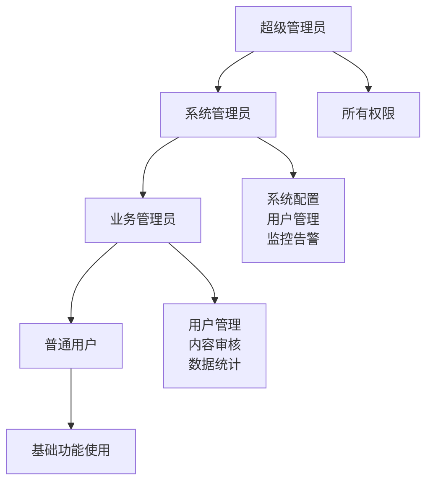

# 太上老君AI平台管理员指南

## 概述

本指南面向太上老君AI平台的系统管理员，涵盖平台管理、用户管理、系统监控、安全配置等核心管理功能。

## 管理员权限体系

### 权限级别



### 权限矩阵

| 功能模块 | 超级管理员 | 系统管理员 | 业务管理员 | 普通用户 |
|----------|------------|------------|------------|----------|
| 用户管理 | ✅ | ✅ | ✅ | ❌ |
| 系统配置 | ✅ | ✅ | ❌ | ❌ |
| 监控告警 | ✅ | ✅ | 📖 | ❌ |
| 内容审核 | ✅ | ✅ | ✅ | ❌ |
| 数据统计 | ✅ | ✅ | ✅ | ❌ |
| 安全设置 | ✅ | ✅ | ❌ | ❌ |
| 备份恢复 | ✅ | ✅ | ❌ | ❌ |

## 管理后台访问

### 登录管理后台

1. 访问管理后台地址：`https://admin.taishanglaojun.ai`
2. 使用管理员账户登录
3. 通过两步验证（如已启用）
4. 进入管理控制台

### 管理后台界面

```
┌─────────────────────────────────────────────────────────┐
│ 太上老君AI平台 - 管理控制台                              │
├─────────────────────────────────────────────────────────┤
│ 侧边栏导航 │              主要内容区域                   │
│            │                                            │
│ 📊 概览    │  ┌─────────────────────────────────────┐   │
│ 👥 用户管理 │  │           系统概览                  │   │
│ ⚙️ 系统设置 │  │                                     │   │
│ 📈 监控告警 │  │  活跃用户: 1,234                   │   │
│ 🔒 安全管理 │  │  今日对话: 5,678                   │   │
│ 📝 内容审核 │  │  系统状态: 正常                     │   │
│ 📊 数据统计 │  │                                     │   │
│ 🔧 系统维护 │  └─────────────────────────────────────┘   │
│ 📋 日志查看 │                                            │
└─────────────────────────────────────────────────────────┘
```

## 用户管理

### 1. 用户列表管理

#### 查看用户列表

```sql
-- 获取用户列表的SQL查询示例
SELECT 
    id,
    username,
    email,
    status,
    created_at,
    last_login_at,
    role
FROM users 
ORDER BY created_at DESC
LIMIT 50;
```

#### 用户状态管理

**用户状态类型**
- `active`: 正常活跃用户
- `inactive`: 非活跃用户
- `suspended`: 暂停使用
- `banned`: 永久封禁
- `pending`: 待验证

**状态操作**
```go
// 用户状态管理API示例
type UserStatusRequest struct {
    UserID int    `json:"user_id"`
    Status string `json:"status"`
    Reason string `json:"reason"`
}

func (h *AdminHandler) UpdateUserStatus(c *gin.Context) {
    var req UserStatusRequest
    if err := c.ShouldBindJSON(&req); err != nil {
        c.JSON(400, gin.H{"error": err.Error()})
        return
    }
    
    // 更新用户状态
    err := h.userService.UpdateStatus(req.UserID, req.Status, req.Reason)
    if err != nil {
        c.JSON(500, gin.H{"error": "更新失败"})
        return
    }
    
    // 记录操作日志
    h.auditLogger.LogUserStatusChange(
        c.GetString("admin_id"),
        req.UserID,
        req.Status,
        req.Reason,
    )
    
    c.JSON(200, gin.H{"message": "状态更新成功"})
}
```

### 2. 用户详情管理

#### 用户信息查看

```go
type UserDetail struct {
    ID              int       `json:"id"`
    Username        string    `json:"username"`
    Email           string    `json:"email"`
    Status          string    `json:"status"`
    Role            string    `json:"role"`
    CreatedAt       time.Time `json:"created_at"`
    LastLoginAt     *time.Time `json:"last_login_at"`
    LoginCount      int       `json:"login_count"`
    MessageCount    int       `json:"message_count"`
    ImageCount      int       `json:"image_count"`
    DocumentCount   int       `json:"document_count"`
    StorageUsed     int64     `json:"storage_used"`
    APICallsToday   int       `json:"api_calls_today"`
    APICallsMonth   int       `json:"api_calls_month"`
}
```

#### 用户活动统计

```sql
-- 用户活动统计查询
SELECT 
    u.id,
    u.username,
    COUNT(DISTINCT cm.id) as message_count,
    COUNT(DISTINCT ig.id) as image_count,
    COUNT(DISTINCT da.id) as document_count,
    SUM(CASE WHEN cm.created_at >= CURRENT_DATE THEN 1 ELSE 0 END) as today_messages,
    MAX(cm.created_at) as last_activity
FROM users u
LEFT JOIN chat_messages cm ON u.id = cm.user_id
LEFT JOIN image_generations ig ON u.id = ig.user_id
LEFT JOIN document_analyses da ON u.id = da.user_id
WHERE u.id = ?
GROUP BY u.id, u.username;
```

### 3. 批量用户操作

#### 批量导入用户

```go
type BatchUserImport struct {
    Users []struct {
        Username string `json:"username"`
        Email    string `json:"email"`
        Role     string `json:"role"`
        Password string `json:"password"`
    } `json:"users"`
}

func (h *AdminHandler) BatchImportUsers(c *gin.Context) {
    var req BatchUserImport
    if err := c.ShouldBindJSON(&req); err != nil {
        c.JSON(400, gin.H{"error": err.Error()})
        return
    }
    
    results := make([]map[string]interface{}, 0)
    
    for _, user := range req.Users {
        result := map[string]interface{}{
            "username": user.Username,
            "email":    user.Email,
        }
        
        // 创建用户
        userID, err := h.userService.CreateUser(user.Username, user.Email, user.Password, user.Role)
        if err != nil {
            result["status"] = "failed"
            result["error"] = err.Error()
        } else {
            result["status"] = "success"
            result["user_id"] = userID
        }
        
        results = append(results, result)
    }
    
    c.JSON(200, gin.H{"results": results})
}
```

#### 批量操作示例

```bash
# 批量暂停用户
curl -X POST \
  -H "Authorization: Bearer $ADMIN_TOKEN" \
  -H "Content-Type: application/json" \
  -d '{
    "user_ids": [123, 456, 789],
    "action": "suspend",
    "reason": "违规行为"
  }' \
  https://admin.taishanglaojun.ai/api/users/batch-action
```

## 系统配置管理

### 1. 基础配置

#### 系统参数配置

```yaml
# config/system.yaml
system:
  # 基础设置
  site_name: "太上老君AI平台"
  site_url: "https://taishanglaojun.ai"
  admin_email: "admin@taishanglaojun.ai"
  
  # 功能开关
  features:
    chat_enabled: true
    image_generation_enabled: true
    document_analysis_enabled: true
    api_access_enabled: true
    mobile_app_enabled: true
  
  # 限制设置
  limits:
    max_message_length: 4000
    max_file_size: 50MB
    max_daily_requests: 1000
    max_concurrent_users: 10000
  
  # 安全设置
  security:
    session_timeout: 3600
    password_min_length: 8
    max_login_attempts: 5
    lockout_duration: 900
    require_email_verification: true
    enable_2fa: true
```

#### 配置管理API

```go
type SystemConfig struct {
    Key         string      `json:"key"`
    Value       interface{} `json:"value"`
    Type        string      `json:"type"`
    Description string      `json:"description"`
    UpdatedAt   time.Time   `json:"updated_at"`
    UpdatedBy   string      `json:"updated_by"`
}

func (h *AdminHandler) UpdateSystemConfig(c *gin.Context) {
    var req SystemConfig
    if err := c.ShouldBindJSON(&req); err != nil {
        c.JSON(400, gin.H{"error": err.Error()})
        return
    }
    
    // 验证配置值
    if err := h.configService.ValidateConfig(req.Key, req.Value); err != nil {
        c.JSON(400, gin.H{"error": "配置值无效: " + err.Error()})
        return
    }
    
    // 更新配置
    err := h.configService.UpdateConfig(req.Key, req.Value, c.GetString("admin_id"))
    if err != nil {
        c.JSON(500, gin.H{"error": "更新失败"})
        return
    }
    
    // 记录配置变更
    h.auditLogger.LogConfigChange(
        c.GetString("admin_id"),
        req.Key,
        req.Value,
    )
    
    c.JSON(200, gin.H{"message": "配置更新成功"})
}
```

### 2. AI模型配置

#### 模型管理

```yaml
# config/models.yaml
models:
  text_generation:
    primary:
      name: "gpt-4"
      endpoint: "https://api.openai.com/v1/chat/completions"
      api_key: "${OPENAI_API_KEY}"
      max_tokens: 4000
      temperature: 0.7
    
    fallback:
      name: "claude-3"
      endpoint: "https://api.anthropic.com/v1/messages"
      api_key: "${ANTHROPIC_API_KEY}"
      max_tokens: 4000
      temperature: 0.7
  
  image_generation:
    primary:
      name: "dall-e-3"
      endpoint: "https://api.openai.com/v1/images/generations"
      api_key: "${OPENAI_API_KEY}"
      size: "1024x1024"
      quality: "standard"
    
    fallback:
      name: "stable-diffusion"
      endpoint: "https://api.stability.ai/v1/generation"
      api_key: "${STABILITY_API_KEY}"
      size: "1024x1024"
```

#### 模型性能监控

```go
type ModelMetrics struct {
    ModelName       string        `json:"model_name"`
    RequestCount    int           `json:"request_count"`
    SuccessCount    int           `json:"success_count"`
    ErrorCount      int           `json:"error_count"`
    AvgResponseTime time.Duration `json:"avg_response_time"`
    AvgTokens       float64       `json:"avg_tokens"`
    Cost            float64       `json:"cost"`
    LastUsed        time.Time     `json:"last_used"`
}

func (h *AdminHandler) GetModelMetrics(c *gin.Context) {
    timeRange := c.DefaultQuery("range", "24h")
    
    metrics, err := h.metricsService.GetModelMetrics(timeRange)
    if err != nil {
        c.JSON(500, gin.H{"error": "获取指标失败"})
        return
    }
    
    c.JSON(200, gin.H{"metrics": metrics})
}
```

### 3. 存储配置

#### 文件存储设置

```yaml
# config/storage.yaml
storage:
  # 本地存储
  local:
    enabled: true
    path: "/data/uploads"
    max_size: "10GB"
  
  # 对象存储
  s3:
    enabled: true
    bucket: "taishanglaojun-files"
    region: "us-west-2"
    access_key: "${AWS_ACCESS_KEY}"
    secret_key: "${AWS_SECRET_KEY}"
    endpoint: "https://s3.amazonaws.com"
  
  # CDN配置
  cdn:
    enabled: true
    domain: "cdn.taishanglaojun.ai"
    cache_ttl: 86400
```

## 监控与告警

### 1. 系统监控

#### 监控指标

```go
type SystemMetrics struct {
    // 系统资源
    CPUUsage    float64 `json:"cpu_usage"`
    MemoryUsage float64 `json:"memory_usage"`
    DiskUsage   float64 `json:"disk_usage"`
    
    // 应用指标
    ActiveUsers     int `json:"active_users"`
    RequestsPerMin  int `json:"requests_per_min"`
    ResponseTime    int `json:"response_time_ms"`
    ErrorRate       float64 `json:"error_rate"`
    
    // 数据库指标
    DBConnections   int     `json:"db_connections"`
    DBResponseTime  int     `json:"db_response_time_ms"`
    SlowQueries     int     `json:"slow_queries"`
    
    // 缓存指标
    CacheHitRate    float64 `json:"cache_hit_rate"`
    CacheMemory     int64   `json:"cache_memory_bytes"`
    
    Timestamp       time.Time `json:"timestamp"`
}
```

#### 实时监控面板

```html
<!-- 监控面板HTML模板 -->
<div class="monitoring-dashboard">
    <div class="metrics-grid">
        <div class="metric-card">
            <h3>系统负载</h3>
            <div class="metric-value" id="cpu-usage">--</div>
            <div class="metric-chart" id="cpu-chart"></div>
        </div>
        
        <div class="metric-card">
            <h3>活跃用户</h3>
            <div class="metric-value" id="active-users">--</div>
            <div class="metric-trend" id="users-trend"></div>
        </div>
        
        <div class="metric-card">
            <h3>响应时间</h3>
            <div class="metric-value" id="response-time">--</div>
            <div class="metric-chart" id="response-chart"></div>
        </div>
        
        <div class="metric-card">
            <h3>错误率</h3>
            <div class="metric-value" id="error-rate">--</div>
            <div class="metric-status" id="error-status"></div>
        </div>
    </div>
</div>

<script>
// 实时更新监控数据
function updateMetrics() {
    fetch('/api/admin/metrics')
        .then(response => response.json())
        .then(data => {
            document.getElementById('cpu-usage').textContent = data.cpu_usage.toFixed(1) + '%';
            document.getElementById('active-users').textContent = data.active_users;
            document.getElementById('response-time').textContent = data.response_time + 'ms';
            document.getElementById('error-rate').textContent = data.error_rate.toFixed(2) + '%';
            
            // 更新图表
            updateCharts(data);
        });
}

// 每30秒更新一次
setInterval(updateMetrics, 30000);
</script>
```

### 2. 告警配置

#### 告警规则

```yaml
# config/alerts.yaml
alerts:
  # 系统资源告警
  system:
    - name: "CPU使用率过高"
      metric: "cpu_usage"
      threshold: 80
      duration: "5m"
      severity: "warning"
      
    - name: "内存使用率过高"
      metric: "memory_usage"
      threshold: 85
      duration: "3m"
      severity: "critical"
      
    - name: "磁盘空间不足"
      metric: "disk_usage"
      threshold: 90
      duration: "1m"
      severity: "critical"
  
  # 应用性能告警
  application:
    - name: "响应时间过长"
      metric: "response_time"
      threshold: 2000
      duration: "2m"
      severity: "warning"
      
    - name: "错误率过高"
      metric: "error_rate"
      threshold: 5
      duration: "1m"
      severity: "critical"
      
    - name: "活跃用户数异常"
      metric: "active_users"
      threshold: 10000
      duration: "5m"
      severity: "warning"
  
  # 数据库告警
  database:
    - name: "数据库连接数过多"
      metric: "db_connections"
      threshold: 80
      duration: "2m"
      severity: "warning"
      
    - name: "慢查询过多"
      metric: "slow_queries"
      threshold: 10
      duration: "5m"
      severity: "warning"
```

#### 告警通知

```go
type AlertNotification struct {
    ID          string    `json:"id"`
    RuleName    string    `json:"rule_name"`
    Severity    string    `json:"severity"`
    Message     string    `json:"message"`
    Value       float64   `json:"value"`
    Threshold   float64   `json:"threshold"`
    Timestamp   time.Time `json:"timestamp"`
    Status      string    `json:"status"` // firing, resolved
}

type NotificationChannel struct {
    Type   string                 `json:"type"`   // email, slack, webhook
    Config map[string]interface{} `json:"config"`
}

func (s *AlertService) SendNotification(alert AlertNotification, channels []NotificationChannel) error {
    for _, channel := range channels {
        switch channel.Type {
        case "email":
            err := s.sendEmailAlert(alert, channel.Config)
            if err != nil {
                log.Printf("发送邮件告警失败: %v", err)
            }
            
        case "slack":
            err := s.sendSlackAlert(alert, channel.Config)
            if err != nil {
                log.Printf("发送Slack告警失败: %v", err)
            }
            
        case "webhook":
            err := s.sendWebhookAlert(alert, channel.Config)
            if err != nil {
                log.Printf("发送Webhook告警失败: %v", err)
            }
        }
    }
    
    return nil
}
```

### 3. 日志管理

#### 日志收集配置

```yaml
# config/logging.yaml
logging:
  level: "info"
  format: "json"
  
  outputs:
    - type: "file"
      path: "/var/log/taishanglaojun/app.log"
      max_size: "100MB"
      max_backups: 10
      max_age: 30
      
    - type: "elasticsearch"
      hosts: ["elasticsearch:9200"]
      index: "taishanglaojun-logs"
      
  loggers:
    - name: "access"
      level: "info"
      file: "/var/log/taishanglaojun/access.log"
      
    - name: "error"
      level: "error"
      file: "/var/log/taishanglaojun/error.log"
      
    - name: "audit"
      level: "info"
      file: "/var/log/taishanglaojun/audit.log"
```

#### 日志查询接口

```go
type LogQuery struct {
    Level     string    `json:"level"`
    Service   string    `json:"service"`
    StartTime time.Time `json:"start_time"`
    EndTime   time.Time `json:"end_time"`
    Keyword   string    `json:"keyword"`
    Limit     int       `json:"limit"`
    Offset    int       `json:"offset"`
}

type LogEntry struct {
    Timestamp time.Time              `json:"timestamp"`
    Level     string                 `json:"level"`
    Service   string                 `json:"service"`
    Message   string                 `json:"message"`
    Fields    map[string]interface{} `json:"fields"`
}

func (h *AdminHandler) QueryLogs(c *gin.Context) {
    var query LogQuery
    if err := c.ShouldBindJSON(&query); err != nil {
        c.JSON(400, gin.H{"error": err.Error()})
        return
    }
    
    logs, total, err := h.logService.QueryLogs(query)
    if err != nil {
        c.JSON(500, gin.H{"error": "查询日志失败"})
        return
    }
    
    c.JSON(200, gin.H{
        "logs":  logs,
        "total": total,
        "query": query,
    })
}
```

## 安全管理

### 1. 访问控制

#### IP白名单管理

```go
type IPWhitelist struct {
    ID          int       `json:"id"`
    IPAddress   string    `json:"ip_address"`
    Description string    `json:"description"`
    CreatedBy   string    `json:"created_by"`
    CreatedAt   time.Time `json:"created_at"`
    ExpiresAt   *time.Time `json:"expires_at"`
    IsActive    bool      `json:"is_active"`
}

func (h *AdminHandler) AddIPToWhitelist(c *gin.Context) {
    var req IPWhitelist
    if err := c.ShouldBindJSON(&req); err != nil {
        c.JSON(400, gin.H{"error": err.Error()})
        return
    }
    
    // 验证IP地址格式
    if net.ParseIP(req.IPAddress) == nil {
        c.JSON(400, gin.H{"error": "无效的IP地址"})
        return
    }
    
    // 添加到白名单
    id, err := h.securityService.AddIPToWhitelist(req)
    if err != nil {
        c.JSON(500, gin.H{"error": "添加失败"})
        return
    }
    
    // 记录安全日志
    h.auditLogger.LogSecurityEvent(
        c.GetString("admin_id"),
        "ip_whitelist_add",
        map[string]interface{}{
            "ip_address": req.IPAddress,
            "whitelist_id": id,
        },
    )
    
    c.JSON(200, gin.H{"id": id, "message": "添加成功"})
}
```

#### 会话管理

```go
type UserSession struct {
    ID        string    `json:"id"`
    UserID    int       `json:"user_id"`
    Username  string    `json:"username"`
    IPAddress string    `json:"ip_address"`
    UserAgent string    `json:"user_agent"`
    CreatedAt time.Time `json:"created_at"`
    LastSeen  time.Time `json:"last_seen"`
    IsActive  bool      `json:"is_active"`
}

func (h *AdminHandler) GetActiveSessions(c *gin.Context) {
    sessions, err := h.sessionService.GetActiveSessions()
    if err != nil {
        c.JSON(500, gin.H{"error": "获取会话失败"})
        return
    }
    
    c.JSON(200, gin.H{"sessions": sessions})
}

func (h *AdminHandler) TerminateSession(c *gin.Context) {
    sessionID := c.Param("session_id")
    
    err := h.sessionService.TerminateSession(sessionID)
    if err != nil {
        c.JSON(500, gin.H{"error": "终止会话失败"})
        return
    }
    
    // 记录安全日志
    h.auditLogger.LogSecurityEvent(
        c.GetString("admin_id"),
        "session_terminate",
        map[string]interface{}{
            "session_id": sessionID,
        },
    )
    
    c.JSON(200, gin.H{"message": "会话已终止"})
}
```

### 2. 安全审计

#### 审计日志

```go
type AuditLog struct {
    ID        int                    `json:"id"`
    UserID    int                    `json:"user_id"`
    Username  string                 `json:"username"`
    Action    string                 `json:"action"`
    Resource  string                 `json:"resource"`
    Details   map[string]interface{} `json:"details"`
    IPAddress string                 `json:"ip_address"`
    UserAgent string                 `json:"user_agent"`
    Timestamp time.Time              `json:"timestamp"`
    Result    string                 `json:"result"` // success, failure
}

type AuditLogger struct {
    db *sql.DB
}

func (a *AuditLogger) LogUserAction(userID int, action, resource string, details map[string]interface{}, result string) {
    log := AuditLog{
        UserID:    userID,
        Action:    action,
        Resource:  resource,
        Details:   details,
        Timestamp: time.Now(),
        Result:    result,
    }
    
    // 异步写入审计日志
    go a.writeAuditLog(log)
}

func (a *AuditLogger) LogSecurityEvent(adminID, eventType string, details map[string]interface{}) {
    log := AuditLog{
        UserID:    0, // 系统事件
        Action:    eventType,
        Resource:  "security",
        Details:   details,
        Timestamp: time.Now(),
        Result:    "success",
    }
    
    go a.writeAuditLog(log)
}
```

#### 安全事件监控

```go
type SecurityEvent struct {
    Type        string                 `json:"type"`
    Severity    string                 `json:"severity"`
    UserID      int                    `json:"user_id"`
    IPAddress   string                 `json:"ip_address"`
    Description string                 `json:"description"`
    Details     map[string]interface{} `json:"details"`
    Timestamp   time.Time              `json:"timestamp"`
}

// 安全事件类型
const (
    EventLoginFailure     = "login_failure"
    EventMultipleLogin    = "multiple_login"
    EventSuspiciousIP     = "suspicious_ip"
    EventRateLimitExceed  = "rate_limit_exceed"
    EventUnauthorizedAPI  = "unauthorized_api"
    EventDataBreach       = "data_breach"
)

func (s *SecurityService) DetectSuspiciousActivity(userID int, ipAddress string) {
    // 检测多次登录失败
    failureCount := s.getLoginFailureCount(userID, time.Hour)
    if failureCount >= 5 {
        s.createSecurityEvent(SecurityEvent{
            Type:        EventLoginFailure,
            Severity:    "high",
            UserID:      userID,
            IPAddress:   ipAddress,
            Description: "多次登录失败",
            Details: map[string]interface{}{
                "failure_count": failureCount,
                "time_window":   "1h",
            },
            Timestamp: time.Now(),
        })
    }
    
    // 检测异常IP
    if s.isIPSuspicious(ipAddress) {
        s.createSecurityEvent(SecurityEvent{
            Type:        EventSuspiciousIP,
            Severity:    "medium",
            UserID:      userID,
            IPAddress:   ipAddress,
            Description: "来自可疑IP的访问",
            Timestamp:   time.Now(),
        })
    }
}
```

### 3. 数据保护

#### 数据备份管理

```go
type BackupJob struct {
    ID          int       `json:"id"`
    Type        string    `json:"type"`        // full, incremental
    Status      string    `json:"status"`      // running, completed, failed
    StartTime   time.Time `json:"start_time"`
    EndTime     *time.Time `json:"end_time"`
    Size        int64     `json:"size"`
    Location    string    `json:"location"`
    CreatedBy   string    `json:"created_by"`
    ErrorMsg    string    `json:"error_msg"`
}

func (h *AdminHandler) CreateBackup(c *gin.Context) {
    backupType := c.DefaultQuery("type", "full")
    
    job := BackupJob{
        Type:      backupType,
        Status:    "running",
        StartTime: time.Now(),
        CreatedBy: c.GetString("admin_id"),
    }
    
    // 创建备份任务
    jobID, err := h.backupService.CreateBackupJob(job)
    if err != nil {
        c.JSON(500, gin.H{"error": "创建备份任务失败"})
        return
    }
    
    // 异步执行备份
    go h.backupService.ExecuteBackup(jobID)
    
    c.JSON(200, gin.H{
        "job_id": jobID,
        "message": "备份任务已创建",
    })
}
```

#### 数据恢复

```go
func (h *AdminHandler) RestoreBackup(c *gin.Context) {
    var req struct {
        BackupID int    `json:"backup_id"`
        Target   string `json:"target"` // database, files, all
    }
    
    if err := c.ShouldBindJSON(&req); err != nil {
        c.JSON(400, gin.H{"error": err.Error()})
        return
    }
    
    // 验证备份文件
    backup, err := h.backupService.GetBackup(req.BackupID)
    if err != nil {
        c.JSON(404, gin.H{"error": "备份不存在"})
        return
    }
    
    // 创建恢复任务
    restoreJob := RestoreJob{
        BackupID:  req.BackupID,
        Target:    req.Target,
        Status:    "running",
        StartTime: time.Now(),
        CreatedBy: c.GetString("admin_id"),
    }
    
    jobID, err := h.backupService.CreateRestoreJob(restoreJob)
    if err != nil {
        c.JSON(500, gin.H{"error": "创建恢复任务失败"})
        return
    }
    
    // 异步执行恢复
    go h.backupService.ExecuteRestore(jobID)
    
    c.JSON(200, gin.H{
        "job_id": jobID,
        "message": "恢复任务已创建",
    })
}
```

## 内容审核

### 1. 自动审核

#### 内容过滤规则

```yaml
# config/content_filter.yaml
content_filter:
  # 文本过滤
  text:
    # 敏感词过滤
    sensitive_words:
      enabled: true
      action: "block"  # block, warn, log
      words_file: "/config/sensitive_words.txt"
      
    # 垃圾内容检测
    spam_detection:
      enabled: true
      threshold: 0.8
      model: "spam_classifier_v1"
      
    # 有害内容检测
    harmful_content:
      enabled: true
      categories: ["violence", "hate", "sexual", "illegal"]
      threshold: 0.7
  
  # 图像过滤
  image:
    # NSFW检测
    nsfw_detection:
      enabled: true
      threshold: 0.8
      model: "nsfw_classifier_v2"
      
    # 暴力内容检测
    violence_detection:
      enabled: true
      threshold: 0.7
      
    # 版权检测
    copyright_detection:
      enabled: true
      database: "copyright_db"
```

#### 审核服务实现

```go
type ContentModerationService struct {
    textClassifier  *TextClassifier
    imageClassifier *ImageClassifier
    db             *sql.DB
}

type ModerationResult struct {
    IsApproved bool                   `json:"is_approved"`
    Confidence float64                `json:"confidence"`
    Categories []string               `json:"categories"`
    Reason     string                 `json:"reason"`
    Details    map[string]interface{} `json:"details"`
}

func (s *ContentModerationService) ModerateText(content string) (*ModerationResult, error) {
    result := &ModerationResult{
        IsApproved: true,
        Categories: []string{},
        Details:    make(map[string]interface{}),
    }
    
    // 敏感词检测
    if words := s.detectSensitiveWords(content); len(words) > 0 {
        result.IsApproved = false
        result.Categories = append(result.Categories, "sensitive_words")
        result.Reason = "包含敏感词汇"
        result.Details["sensitive_words"] = words
        return result, nil
    }
    
    // AI分类检测
    classification, err := s.textClassifier.Classify(content)
    if err != nil {
        return nil, err
    }
    
    for category, confidence := range classification {
        if confidence > 0.7 {
            result.IsApproved = false
            result.Categories = append(result.Categories, category)
            result.Confidence = confidence
            result.Reason = fmt.Sprintf("检测到%s内容", category)
        }
    }
    
    return result, nil
}

func (s *ContentModerationService) ModerateImage(imageData []byte) (*ModerationResult, error) {
    result := &ModerationResult{
        IsApproved: true,
        Categories: []string{},
        Details:    make(map[string]interface{}),
    }
    
    // NSFW检测
    nsfwScore, err := s.imageClassifier.DetectNSFW(imageData)
    if err != nil {
        return nil, err
    }
    
    if nsfwScore > 0.8 {
        result.IsApproved = false
        result.Categories = append(result.Categories, "nsfw")
        result.Confidence = nsfwScore
        result.Reason = "包含不当内容"
        result.Details["nsfw_score"] = nsfwScore
    }
    
    return result, nil
}
```

### 2. 人工审核

#### 审核队列管理

```go
type ModerationQueue struct {
    ID          int                    `json:"id"`
    ContentType string                 `json:"content_type"` // text, image, document
    ContentID   int                    `json:"content_id"`
    UserID      int                    `json:"user_id"`
    Content     map[string]interface{} `json:"content"`
    AutoResult  *ModerationResult      `json:"auto_result"`
    Status      string                 `json:"status"` // pending, approved, rejected
    AssignedTo  *int                   `json:"assigned_to"`
    ReviewedBy  *int                   `json:"reviewed_by"`
    ReviewedAt  *time.Time             `json:"reviewed_at"`
    Comments    string                 `json:"comments"`
    CreatedAt   time.Time              `json:"created_at"`
    Priority    int                    `json:"priority"`
}

func (h *AdminHandler) GetModerationQueue(c *gin.Context) {
    status := c.DefaultQuery("status", "pending")
    limit := c.DefaultQuery("limit", "50")
    offset := c.DefaultQuery("offset", "0")
    
    queue, total, err := h.moderationService.GetQueue(status, limit, offset)
    if err != nil {
        c.JSON(500, gin.H{"error": "获取审核队列失败"})
        return
    }
    
    c.JSON(200, gin.H{
        "queue": queue,
        "total": total,
    })
}

func (h *AdminHandler) ReviewContent(c *gin.Context) {
    var req struct {
        QueueID  int    `json:"queue_id"`
        Decision string `json:"decision"` // approve, reject
        Comments string `json:"comments"`
    }
    
    if err := c.ShouldBindJSON(&req); err != nil {
        c.JSON(400, gin.H{"error": err.Error()})
        return
    }
    
    adminID := c.GetInt("admin_id")
    
    err := h.moderationService.ReviewContent(req.QueueID, req.Decision, req.Comments, adminID)
    if err != nil {
        c.JSON(500, gin.H{"error": "审核失败"})
        return
    }
    
    // 记录审核日志
    h.auditLogger.LogModerationAction(
        adminID,
        req.QueueID,
        req.Decision,
        req.Comments,
    )
    
    c.JSON(200, gin.H{"message": "审核完成"})
}
```

### 3. 审核统计

#### 审核报告

```go
type ModerationStats struct {
    Period          string `json:"period"`
    TotalReviewed   int    `json:"total_reviewed"`
    AutoApproved    int    `json:"auto_approved"`
    AutoRejected    int    `json:"auto_rejected"`
    ManualApproved  int    `json:"manual_approved"`
    ManualRejected  int    `json:"manual_rejected"`
    PendingReview   int    `json:"pending_review"`
    AvgReviewTime   int    `json:"avg_review_time_minutes"`
    TopCategories   []struct {
        Category string `json:"category"`
        Count    int    `json:"count"`
    } `json:"top_categories"`
}

func (h *AdminHandler) GetModerationStats(c *gin.Context) {
    period := c.DefaultQuery("period", "7d")
    
    stats, err := h.moderationService.GetStats(period)
    if err != nil {
        c.JSON(500, gin.H{"error": "获取统计失败"})
        return
    }
    
    c.JSON(200, gin.H{"stats": stats})
}
```

## 数据统计与分析

### 1. 用户统计

#### 用户增长分析

```sql
-- 用户增长统计
WITH daily_stats AS (
    SELECT 
        DATE(created_at) as date,
        COUNT(*) as new_users,
        COUNT(*) OVER (ORDER BY DATE(created_at)) as total_users
    FROM users 
    WHERE created_at >= CURRENT_DATE - INTERVAL '30 days'
    GROUP BY DATE(created_at)
    ORDER BY date
)
SELECT 
    date,
    new_users,
    total_users,
    LAG(new_users) OVER (ORDER BY date) as prev_day_new_users,
    ROUND(
        (new_users - LAG(new_users) OVER (ORDER BY date)) * 100.0 / 
        NULLIF(LAG(new_users) OVER (ORDER BY date), 0), 
        2
    ) as growth_rate
FROM daily_stats;
```

#### 用户活跃度分析

```go
type UserActivityStats struct {
    Period           string  `json:"period"`
    TotalUsers       int     `json:"total_users"`
    ActiveUsers      int     `json:"active_users"`
    NewUsers         int     `json:"new_users"`
    ReturnUsers      int     `json:"return_users"`
    ActivityRate     float64 `json:"activity_rate"`
    RetentionRate    float64 `json:"retention_rate"`
    AvgSessionTime   int     `json:"avg_session_time_minutes"`
    AvgDailyUsage    int     `json:"avg_daily_usage_minutes"`
}

func (s *StatsService) GetUserActivityStats(period string) (*UserActivityStats, error) {
    var stats UserActivityStats
    stats.Period = period
    
    // 计算时间范围
    startTime, endTime := s.parsePeriod(period)
    
    // 总用户数
    err := s.db.QueryRow(`
        SELECT COUNT(*) FROM users 
        WHERE created_at <= ?
    `, endTime).Scan(&stats.TotalUsers)
    if err != nil {
        return nil, err
    }
    
    // 活跃用户数
    err = s.db.QueryRow(`
        SELECT COUNT(DISTINCT user_id) 
        FROM user_activities 
        WHERE created_at BETWEEN ? AND ?
    `, startTime, endTime).Scan(&stats.ActiveUsers)
    if err != nil {
        return nil, err
    }
    
    // 新用户数
    err = s.db.QueryRow(`
        SELECT COUNT(*) FROM users 
        WHERE created_at BETWEEN ? AND ?
    `, startTime, endTime).Scan(&stats.NewUsers)
    if err != nil {
        return nil, err
    }
    
    // 计算活跃率
    if stats.TotalUsers > 0 {
        stats.ActivityRate = float64(stats.ActiveUsers) / float64(stats.TotalUsers) * 100
    }
    
    return &stats, nil
}
```

### 2. 使用统计

#### 功能使用统计

```go
type FeatureUsageStats struct {
    Feature      string `json:"feature"`
    UsageCount   int    `json:"usage_count"`
    UniqueUsers  int    `json:"unique_users"`
    AvgPerUser   float64 `json:"avg_per_user"`
    GrowthRate   float64 `json:"growth_rate"`
}

func (s *StatsService) GetFeatureUsageStats(period string) ([]FeatureUsageStats, error) {
    query := `
        SELECT 
            feature_name,
            COUNT(*) as usage_count,
            COUNT(DISTINCT user_id) as unique_users,
            ROUND(COUNT(*) * 1.0 / COUNT(DISTINCT user_id), 2) as avg_per_user
        FROM feature_usage_logs 
        WHERE created_at >= ? AND created_at <= ?
        GROUP BY feature_name
        ORDER BY usage_count DESC
    `
    
    startTime, endTime := s.parsePeriod(period)
    rows, err := s.db.Query(query, startTime, endTime)
    if err != nil {
        return nil, err
    }
    defer rows.Close()
    
    var stats []FeatureUsageStats
    for rows.Next() {
        var stat FeatureUsageStats
        err := rows.Scan(
            &stat.Feature,
            &stat.UsageCount,
            &stat.UniqueUsers,
            &stat.AvgPerUser,
        )
        if err != nil {
            return nil, err
        }
        
        // 计算增长率
        stat.GrowthRate = s.calculateGrowthRate(stat.Feature, period)
        stats = append(stats, stat)
    }
    
    return stats, nil
}
```

### 3. 性能统计

#### API性能统计

```go
type APIPerformanceStats struct {
    Endpoint        string  `json:"endpoint"`
    RequestCount    int     `json:"request_count"`
    AvgResponseTime float64 `json:"avg_response_time_ms"`
    P95ResponseTime float64 `json:"p95_response_time_ms"`
    P99ResponseTime float64 `json:"p99_response_time_ms"`
    ErrorRate       float64 `json:"error_rate"`
    Throughput      float64 `json:"throughput_rps"`
}

func (s *StatsService) GetAPIPerformanceStats(period string) ([]APIPerformanceStats, error) {
    query := `
        SELECT 
            endpoint,
            COUNT(*) as request_count,
            AVG(response_time_ms) as avg_response_time,
            PERCENTILE_CONT(0.95) WITHIN GROUP (ORDER BY response_time_ms) as p95_response_time,
            PERCENTILE_CONT(0.99) WITHIN GROUP (ORDER BY response_time_ms) as p99_response_time,
            SUM(CASE WHEN status_code >= 400 THEN 1 ELSE 0 END) * 100.0 / COUNT(*) as error_rate
        FROM api_request_logs 
        WHERE created_at >= ? AND created_at <= ?
        GROUP BY endpoint
        ORDER BY request_count DESC
    `
    
    startTime, endTime := s.parsePeriod(period)
    rows, err := s.db.Query(query, startTime, endTime)
    if err != nil {
        return nil, err
    }
    defer rows.Close()
    
    var stats []APIPerformanceStats
    periodHours := endTime.Sub(startTime).Hours()
    
    for rows.Next() {
        var stat APIPerformanceStats
        err := rows.Scan(
            &stat.Endpoint,
            &stat.RequestCount,
            &stat.AvgResponseTime,
            &stat.P95ResponseTime,
            &stat.P99ResponseTime,
            &stat.ErrorRate,
        )
        if err != nil {
            return nil, err
        }
        
        // 计算吞吐量 (请求/秒)
        stat.Throughput = float64(stat.RequestCount) / (periodHours * 3600)
        
        stats = append(stats, stat)
    }
    
    return stats, nil
}
```

## 系统维护

### 1. 定期维护任务

#### 数据库维护

```bash
#!/bin/bash
# scripts/db_maintenance.sh

# 数据库维护脚本
set -e

DB_HOST="localhost"
DB_PORT="5432"
DB_NAME="taishanglaojun"
DB_USER="postgres"
LOG_FILE="/var/log/db_maintenance.log"

log() {
    echo "[$(date '+%Y-%m-%d %H:%M:%S')] $1" | tee -a $LOG_FILE
}

# 数据库统计信息更新
update_statistics() {
    log "开始更新数据库统计信息..."
    
    psql -h $DB_HOST -p $DB_PORT -U $DB_USER -d $DB_NAME -c "
        DO \$\$
        DECLARE
            rec RECORD;
        BEGIN
            FOR rec IN 
                SELECT schemaname, tablename 
                FROM pg_tables 
                WHERE schemaname = 'public'
            LOOP
                EXECUTE 'ANALYZE ' || quote_ident(rec.schemaname) || '.' || quote_ident(rec.tablename);
                RAISE NOTICE 'Analyzed table: %.%', rec.schemaname, rec.tablename;
            END LOOP;
        END \$\$;
    "
    
    log "数据库统计信息更新完成"
}

# 重建索引
rebuild_indexes() {
    log "开始重建索引..."
    
    # 获取索引使用情况
    psql -h $DB_HOST -p $DB_PORT -U $DB_USER -d $DB_NAME -t -c "
        SELECT indexname 
        FROM pg_stat_user_indexes 
        WHERE idx_scan < 100 AND schemaname = 'public'
    " | while read index_name; do
        if [ -n "$index_name" ]; then
            log "重建索引: $index_name"
            psql -h $DB_HOST -p $DB_PORT -U $DB_USER -d $DB_NAME -c "REINDEX INDEX $index_name;"
        fi
    done
    
    log "索引重建完成"
}

# 清理过期数据
cleanup_expired_data() {
    log "开始清理过期数据..."
    
    # 清理过期的会话
    psql -h $DB_HOST -p $DB_PORT -U $DB_USER -d $DB_NAME -c "
        DELETE FROM user_sessions 
        WHERE last_seen < NOW() - INTERVAL '30 days';
    "
    
    # 清理过期的日志
    psql -h $DB_HOST -p $DB_PORT -U $DB_USER -d $DB_NAME -c "
        DELETE FROM audit_logs 
        WHERE created_at < NOW() - INTERVAL '90 days';
    "
    
    # 清理过期的临时文件记录
    psql -h $DB_HOST -p $DB_PORT -U $DB_USER -d $DB_NAME -c "
        DELETE FROM temp_files 
        WHERE created_at < NOW() - INTERVAL '7 days';
    "
    
    log "过期数据清理完成"
}

# 数据库备份
backup_database() {
    log "开始数据库备份..."
    
    BACKUP_DIR="/backup/database"
    BACKUP_FILE="$BACKUP_DIR/taishanglaojun_$(date +%Y%m%d_%H%M%S).sql"
    
    mkdir -p $BACKUP_DIR
    
    pg_dump -h $DB_HOST -p $DB_PORT -U $DB_USER -d $DB_NAME > $BACKUP_FILE
    
    # 压缩备份文件
    gzip $BACKUP_FILE
    
    log "数据库备份完成: ${BACKUP_FILE}.gz"
    
    # 清理旧备份（保留7天）
    find $BACKUP_DIR -name "*.sql.gz" -mtime +7 -delete
}

# 主函数
main() {
    log "开始数据库维护..."
    
    update_statistics
    rebuild_indexes
    cleanup_expired_data
    backup_database
    
    log "数据库维护完成"
}

# 执行主函数
main "$@"
```

#### 系统清理

```bash
#!/bin/bash
# scripts/system_cleanup.sh

# 系统清理脚本
set -e

LOG_FILE="/var/log/system_cleanup.log"

log() {
    echo "[$(date '+%Y-%m-%d %H:%M:%S')] $1" | tee -a $LOG_FILE
}

# 清理临时文件
cleanup_temp_files() {
    log "开始清理临时文件..."
    
    # 清理应用临时文件
    find /tmp -name "taishanglaojun_*" -mtime +1 -delete
    
    # 清理上传临时文件
    find /data/uploads/temp -type f -mtime +1 -delete
    
    # 清理日志文件
    find /var/log -name "*.log.*" -mtime +30 -delete
    
    log "临时文件清理完成"
}

# 清理Docker资源
cleanup_docker() {
    log "开始清理Docker资源..."
    
    # 清理未使用的镜像
    docker image prune -f
    
    # 清理未使用的容器
    docker container prune -f
    
    # 清理未使用的网络
    docker network prune -f
    
    # 清理未使用的卷
    docker volume prune -f
    
    log "Docker资源清理完成"
}

# 清理系统缓存
cleanup_system_cache() {
    log "开始清理系统缓存..."
    
    # 清理包管理器缓存
    if command -v apt-get &> /dev/null; then
        apt-get clean
    elif command -v yum &> /dev/null; then
        yum clean all
    fi
    
    # 清理系统缓存
    sync && echo 3 > /proc/sys/vm/drop_caches
    
    log "系统缓存清理完成"
}

# 检查磁盘空间
check_disk_space() {
    log "检查磁盘空间..."
    
    df -h | while read line; do
        usage=$(echo $line | awk '{print $5}' | sed 's/%//')
        partition=$(echo $line | awk '{print $6}')
        
        if [ "$usage" -gt 80 ]; then
            log "警告: 分区 $partition 使用率达到 ${usage}%"
            
            # 发送告警
            curl -X POST \
                -H "Content-Type: application/json" \
                -d "{\"text\":\"磁盘空间告警: $partition 使用率 ${usage}%\"}" \
                "$SLACK_WEBHOOK_URL"
        fi
    done
}

# 主函数
main() {
    log "开始系统清理..."
    
    cleanup_temp_files
    cleanup_docker
    cleanup_system_cache
    check_disk_space
    
    log "系统清理完成"
}

# 执行主函数
main "$@"
```

### 2. 自动化维护

#### 定时任务配置

```bash
# crontab -e
# 添加定时维护任务

# 每天凌晨2点执行数据库维护
0 2 * * * /scripts/db_maintenance.sh

# 每天凌晨3点执行系统清理
0 3 * * * /scripts/system_cleanup.sh

# 每小时检查系统状态
0 * * * * /scripts/health_check.sh

# 每周日凌晨1点执行完整备份
0 1 * * 0 /scripts/full_backup.sh

# 每天检查SSL证书有效期
0 6 * * * /scripts/check_ssl_cert.sh
```

#### 健康检查脚本

```bash
#!/bin/bash
# scripts/health_check.sh

# 系统健康检查脚本
set -e

LOG_FILE="/var/log/health_check.log"
ALERT_WEBHOOK="$SLACK_WEBHOOK_URL"

log() {
    echo "[$(date '+%Y-%m-%d %H:%M:%S')] $1" | tee -a $LOG_FILE
}

send_alert() {
    local message="$1"
    log "发送告警: $message"
    
    curl -X POST \
        -H "Content-Type: application/json" \
        -d "{\"text\":\"🚨 系统告警: $message\"}" \
        "$ALERT_WEBHOOK"
}

# 检查服务状态
check_services() {
    log "检查服务状态..."
    
    services=("nginx" "postgres" "redis" "docker")
    
    for service in "${services[@]}"; do
        if ! systemctl is-active --quiet $service; then
            send_alert "服务 $service 未运行"
        else
            log "服务 $service 运行正常"
        fi
    done
}

# 检查端口连通性
check_ports() {
    log "检查端口连通性..."
    
    ports=("80:HTTP" "443:HTTPS" "5432:PostgreSQL" "6379:Redis")
    
    for port_info in "${ports[@]}"; do
        port=$(echo $port_info | cut -d: -f1)
        service=$(echo $port_info | cut -d: -f2)
        
        if ! nc -z localhost $port; then
            send_alert "端口 $port ($service) 无法连接"
        else
            log "端口 $port ($service) 连接正常"
        fi
    done
}

# 检查API健康状态
check_api_health() {
    log "检查API健康状态..."
    
    response=$(curl -s -o /dev/null -w "%{http_code}" http://localhost/api/health)
    
    if [ "$response" != "200" ]; then
        send_alert "API健康检查失败，状态码: $response"
    else
        log "API健康检查正常"
    fi
}

# 检查数据库连接
check_database() {
    log "检查数据库连接..."
    
    if ! pg_isready -h localhost -p 5432; then
        send_alert "数据库连接失败"
    else
        log "数据库连接正常"
    fi
}

# 检查Redis连接
check_redis() {
    log "检查Redis连接..."
    
    if ! redis-cli ping > /dev/null; then
        send_alert "Redis连接失败"
    else
        log "Redis连接正常"
    fi
}

# 主函数
main() {
    log "开始健康检查..."
    
    check_services
    check_ports
    check_api_health
    check_database
    check_redis
    
    log "健康检查完成"
}

# 执行主函数
main "$@"
```

## 故障排查

### 1. 常见问题诊断

#### 性能问题排查

```bash
#!/bin/bash
# scripts/performance_diagnosis.sh

# 性能问题诊断脚本
set -e

LOG_FILE="/var/log/performance_diagnosis.log"

log() {
    echo "[$(date '+%Y-%m-%d %H:%M:%S')] $1" | tee -a $LOG_FILE
}

# 检查系统负载
check_system_load() {
    log "检查系统负载..."
    
    load_avg=$(uptime | awk -F'load average:' '{print $2}' | awk '{print $1}' | sed 's/,//')
    cpu_cores=$(nproc)
    load_threshold=$(echo "$cpu_cores * 0.8" | bc)
    
    if (( $(echo "$load_avg > $load_threshold" | bc -l) )); then
        log "警告: 系统负载过高 - $load_avg (阈值: $load_threshold)"
        
        # 显示占用CPU最多的进程
        log "CPU占用最高的进程:"
        ps aux --sort=-%cpu | head -10 | tee -a $LOG_FILE
    else
        log "系统负载正常: $load_avg"
    fi
}

# 检查内存使用
check_memory_usage() {
    log "检查内存使用..."
    
    memory_info=$(free -m)
    total_mem=$(echo "$memory_info" | awk 'NR==2{print $2}')
    used_mem=$(echo "$memory_info" | awk 'NR==2{print $3}')
    usage_percent=$(echo "scale=2; $used_mem * 100 / $total_mem" | bc)
    
    if (( $(echo "$usage_percent > 80" | bc -l) )); then
        log "警告: 内存使用率过高 - ${usage_percent}%"
        
        # 显示占用内存最多的进程
        log "内存占用最高的进程:"
        ps aux --sort=-%mem | head -10 | tee -a $LOG_FILE
    else
        log "内存使用正常: ${usage_percent}%"
    fi
}

# 检查磁盘I/O
check_disk_io() {
    log "检查磁盘I/O..."
    
    # 使用iostat检查磁盘I/O
    if command -v iostat &> /dev/null; then
        log "磁盘I/O统计:"
        iostat -x 1 3 | tee -a $LOG_FILE
    fi
    
    # 检查I/O等待时间
    iowait=$(top -bn1 | grep "Cpu(s)" | awk '{print $10}' | sed 's/%wa,//')
    if (( $(echo "$iowait > 20" | bc -l) )); then
        log "警告: I/O等待时间过高 - ${iowait}%"
    else
        log "I/O等待时间正常: ${iowait}%"
    fi
}

# 检查网络连接
check_network() {
    log "检查网络连接..."
    
    # 检查网络连接数
    connections=$(netstat -an | grep ESTABLISHED | wc -l)
    log "当前网络连接数: $connections"
    
    if [ "$connections" -gt 1000 ]; then
        log "警告: 网络连接数过多"
        
        # 显示连接最多的IP
        log "连接最多的IP地址:"
        netstat -an | grep ESTABLISHED | awk '{print $5}' | cut -d: -f1 | sort | uniq -c | sort -nr | head -10 | tee -a $LOG_FILE
    fi
}

# 检查数据库性能
check_database_performance() {
    log "检查数据库性能..."
    
    # 检查慢查询
    slow_queries=$(psql -h localhost -U postgres -d taishanglaojun -t -c "
        SELECT count(*) 
        FROM pg_stat_statements 
        WHERE mean_time > 1000;
    " 2>/dev/null || echo "0")
    
    log "慢查询数量: $slow_queries"
    
    if [ "$slow_queries" -gt 10 ]; then
        log "警告: 慢查询过多"
        
        # 显示最慢的查询
        psql -h localhost -U postgres -d taishanglaojun -c "
            SELECT query, mean_time, calls 
            FROM pg_stat_statements 
            ORDER BY mean_time DESC 
            LIMIT 5;
        " 2>/dev/null | tee -a $LOG_FILE
    fi
}

# 主函数
main() {
    log "开始性能诊断..."
    
    check_system_load
    check_memory_usage
    check_disk_io
    check_network
    check_database_performance
    
    log "性能诊断完成"
}

# 执行主函数
main "$@"
```

#### 应用错误排查

```go
// 错误排查工具
package main

import (
    "encoding/json"
    "fmt"
    "log"
    "net/http"
    "os"
    "time"
)

type ErrorAnalyzer struct {
    logFile string
    db      *sql.DB
}

type ErrorPattern struct {
    Pattern     string    `json:"pattern"`
    Count       int       `json:"count"`
    LastSeen    time.Time `json:"last_seen"`
    Severity    string    `json:"severity"`
    Suggestions []string  `json:"suggestions"`
}

func (e *ErrorAnalyzer) AnalyzeErrors(hours int) ([]ErrorPattern, error) {
    // 分析最近N小时的错误日志
    since := time.Now().Add(-time.Duration(hours) * time.Hour)
    
    query := `
        SELECT 
            error_type,
            COUNT(*) as count,
            MAX(created_at) as last_seen,
            severity
        FROM error_logs 
        WHERE created_at >= ?
        GROUP BY error_type, severity
        ORDER BY count DESC
    `
    
    rows, err := e.db.Query(query, since)
    if err != nil {
        return nil, err
    }
    defer rows.Close()
    
    var patterns []ErrorPattern
    for rows.Next() {
        var pattern ErrorPattern
        err := rows.Scan(
            &pattern.Pattern,
            &pattern.Count,
            &pattern.LastSeen,
            &pattern.Severity,
        )
        if err != nil {
            return nil, err
        }
        
        // 添加解决建议
        pattern.Suggestions = e.getSuggestions(pattern.Pattern)
        patterns = append(patterns, pattern)
    }
    
    return patterns, nil
}

func (e *ErrorAnalyzer) getSuggestions(errorType string) []string {
    suggestions := map[string][]string{
        "database_connection_failed": {
            "检查数据库服务是否运行",
            "验证数据库连接配置",
            "检查网络连接",
            "查看数据库日志",
        },
        "redis_connection_failed": {
            "检查Redis服务状态",
            "验证Redis配置",
            "检查内存使用情况",
            "重启Redis服务",
        },
        "api_timeout": {
            "检查API响应时间",
            "优化数据库查询",
            "增加超时时间",
            "检查网络延迟",
        },
        "memory_limit_exceeded": {
            "检查内存使用情况",
            "优化内存使用",
            "增加服务器内存",
            "重启应用服务",
        },
        "disk_space_full": {
            "清理临时文件",
            "删除旧日志文件",
            "扩展磁盘空间",
            "移动数据到其他磁盘",
        },
    }
    
    if suggestions, exists := suggestions[errorType]; exists {
        return suggestions
    }
    
    return []string{"查看详细错误日志", "联系技术支持"}
}

// HTTP处理器
func (e *ErrorAnalyzer) HandleErrorAnalysis(w http.ResponseWriter, r *http.Request) {
    hours := 24 // 默认分析最近24小时
    if h := r.URL.Query().Get("hours"); h != "" {
        if parsed, err := strconv.Atoi(h); err == nil {
            hours = parsed
        }
    }
    
    patterns, err := e.AnalyzeErrors(hours)
    if err != nil {
        http.Error(w, "分析错误失败", http.StatusInternalServerError)
        return
    }
    
    w.Header().Set("Content-Type", "application/json")
    json.NewEncoder(w).Encode(map[string]interface{}{
        "patterns": patterns,
        "analysis_period": fmt.Sprintf("%d hours", hours),
        "total_errors": len(patterns),
    })
}
```

### 2. 日志分析

#### 日志聚合分析

```bash
#!/bin/bash
# scripts/log_analysis.sh

# 日志分析脚本
set -e

LOG_DIR="/var/log/taishanglaojun"
ANALYSIS_OUTPUT="/tmp/log_analysis_$(date +%Y%m%d_%H%M%S).txt"

log() {
    echo "[$(date '+%Y-%m-%d %H:%M:%S')] $1" | tee -a $ANALYSIS_OUTPUT
}

# 分析错误日志
analyze_error_logs() {
    log "分析错误日志..."
    
    if [ -f "$LOG_DIR/error.log" ]; then
        log "最近24小时错误统计:"
        
        # 按错误类型统计
        grep "$(date -d '1 day ago' '+%Y-%m-%d')" "$LOG_DIR/error.log" | \
        awk '{print $4}' | sort | uniq -c | sort -nr | head -10 | \
        while read count error_type; do
            log "  $error_type: $count 次"
        done
        
        # 最新的10个错误
        log "最新的错误:"
        tail -10 "$LOG_DIR/error.log" | while read line; do
            log "  $line"
        done
    fi
}

# 分析访问日志
analyze_access_logs() {
    log "分析访问日志..."
    
    if [ -f "$LOG_DIR/access.log" ]; then
        log "最近24小时访问统计:"
        
        # 统计状态码
        log "HTTP状态码分布:"
        grep "$(date '+%d/%b/%Y')" "$LOG_DIR/access.log" | \
        awk '{print $9}' | sort | uniq -c | sort -nr | \
        while read count status; do
            log "  $status: $count 次"
        done
        
        # 统计访问最多的IP
        log "访问最多的IP地址:"
        grep "$(date '+%d/%b/%Y')" "$LOG_DIR/access.log" | \
        awk '{print $1}' | sort | uniq -c | sort -nr | head -10 | \
        while read count ip; do
            log "  $ip: $count 次"
        done
        
        # 统计访问最多的页面
        log "访问最多的页面:"
        grep "$(date '+%d/%b/%Y')" "$LOG_DIR/access.log" | \
        awk '{print $7}' | sort | uniq -c | sort -nr | head -10 | \
        while read count page; do
            log "  $page: $count 次"
        done
    fi
}

# 分析性能日志
analyze_performance_logs() {
    log "分析性能日志..."
    
    if [ -f "$LOG_DIR/performance.log" ]; then
        # 统计响应时间
        log "响应时间统计:"
        
        avg_response_time=$(grep "$(date '+%Y-%m-%d')" "$LOG_DIR/performance.log" | \
        awk '{sum+=$5; count++} END {if(count>0) print sum/count; else print 0}')
        
        log "  平均响应时间: ${avg_response_time}ms"
        
        # 慢请求统计
        slow_requests=$(grep "$(date '+%Y-%m-%d')" "$LOG_DIR/performance.log" | \
        awk '$5 > 2000 {count++} END {print count+0}')
        
        log "  慢请求数量 (>2s): $slow_requests"
    fi
}

# 生成分析报告
generate_report() {
    log "生成分析报告..."
    
    cat << EOF >> $ANALYSIS_OUTPUT

========================================
日志分析报告
生成时间: $(date)
========================================

系统状态:
- 磁盘使用: $(df -h / | awk 'NR==2 {print $5}')
- 内存使用: $(free | awk 'NR==2{printf "%.2f%%", $3*100/$2}')
- CPU负载: $(uptime | awk -F'load average:' '{print $2}')

建议:
EOF

    # 根据分析结果添加建议
    error_count=$(grep -c "ERROR" "$LOG_DIR/error.log" 2>/dev/null || echo "0")
    if [ "$error_count" -gt 100 ]; then
        echo "- 错误数量较多，建议检查应用配置和代码" >> $ANALYSIS_OUTPUT
    fi
    
    log "分析报告已生成: $ANALYSIS_OUTPUT"
}

# 主函数
main() {
    log "开始日志分析..."
    
    analyze_error_logs
    analyze_access_logs
    analyze_performance_logs
    generate_report
    
    log "日志分析完成"
    
    # 发送报告到管理员邮箱
    if [ -n "$ADMIN_EMAIL" ]; then
        mail -s "太上老君AI平台日志分析报告" "$ADMIN_EMAIL" < $ANALYSIS_OUTPUT
    fi
}

# 执行主函数
main "$@"
```

## 最佳实践

### 1. 安全最佳实践

#### 定期安全检查清单

```markdown
## 每日安全检查

- [ ] 检查登录失败次数异常的账户
- [ ] 审查新注册用户
- [ ] 检查系统资源使用情况
- [ ] 查看安全告警日志
- [ ] 验证备份任务执行状态

## 每周安全检查

- [ ] 更新系统安全补丁
- [ ] 检查SSL证书有效期
- [ ] 审查用户权限变更
- [ ] 分析安全事件趋势
- [ ] 测试备份恢复流程

## 每月安全检查

- [ ] 进行渗透测试
- [ ] 更新安全策略
- [ ] 审查第三方集成安全性
- [ ] 检查合规性要求
- [ ] 更新应急响应计划
```

### 2. 性能优化最佳实践

#### 监控指标阈值

```yaml
# 性能监控阈值配置
performance_thresholds:
  # 系统资源
  cpu_usage:
    warning: 70
    critical: 85
  
  memory_usage:
    warning: 75
    critical: 90
  
  disk_usage:
    warning: 80
    critical: 95
  
  # 应用性能
  response_time:
    warning: 1000  # ms
    critical: 2000
  
  error_rate:
    warning: 2     # %
    critical: 5
  
  # 数据库
  db_connections:
    warning: 70    # %
    critical: 90
  
  slow_queries:
    warning: 5     # per minute
    critical: 10
```

### 3. 运维自动化

#### 自动化部署流程

```yaml
# .github/workflows/deploy.yml
name: 自动化部署

on:
  push:
    branches: [main]

jobs:
  deploy:
    runs-on: ubuntu-latest
    
    steps:
    - uses: actions/checkout@v2
    
    - name: 构建Docker镜像
      run: |
        docker build -t taishanglaojun:${{ github.sha }} .
        docker tag taishanglaojun:${{ github.sha }} taishanglaojun:latest
    
    - name: 推送到镜像仓库
      run: |
        echo ${{ secrets.DOCKER_PASSWORD }} | docker login -u ${{ secrets.DOCKER_USERNAME }} --password-stdin
        docker push taishanglaojun:${{ github.sha }}
        docker push taishanglaojun:latest
    
    - name: 部署到生产环境
      run: |
        ssh ${{ secrets.DEPLOY_USER }}@${{ secrets.DEPLOY_HOST }} '
          cd /opt/taishanglaojun &&
          docker-compose pull &&
          docker-compose up -d &&
          docker system prune -f
        '
    
    - name: 健康检查
      run: |
        sleep 30
        curl -f http://${{ secrets.DEPLOY_HOST }}/api/health || exit 1
    
    - name: 发送部署通知
      if: always()
      run: |
        curl -X POST \
          -H "Content-Type: application/json" \
          -d "{\"text\":\"部署完成: ${{ job.status }}\"}" \
          ${{ secrets.SLACK_WEBHOOK }}
```

## 联系支持

### 技术支持

- **邮箱**: admin@taishanglaojun.ai
- **电话**: +86-400-123-4567
- **在线支持**: https://support.taishanglaojun.ai

### 紧急联系

- **24小时热线**: +86-400-999-8888
- **紧急邮箱**: emergency@taishanglaojun.ai

### 文档更新

本文档最后更新时间：2024年1月
版本：v1.0

---

© 2024 太上老君AI平台. 保留所有权利。