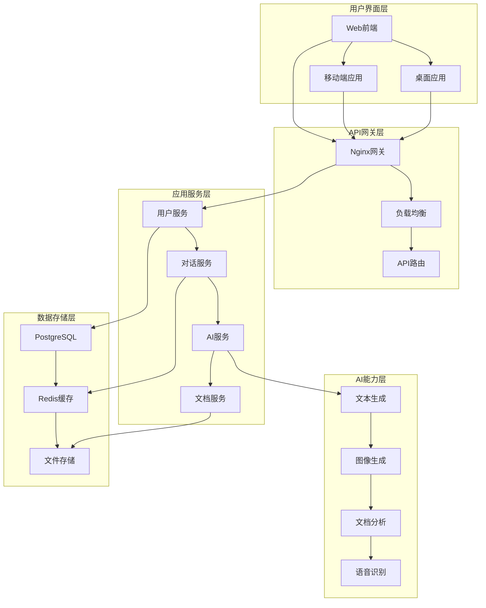

# 太上老君AI平台用户手册

## 概述

太上老君AI平台是一个集成了多种AI能力的智能对话平台，支持文本对话、图像生成、文档分析等功能。本手册将帮助您快速上手并充分利用平台的各项功能。

## 系统架构



## 快速开始

### 1. 账户注册与登录

#### 注册新账户

1. 访问平台首页
2. 点击"注册"按钮
3. 填写注册信息：
   - 用户名（3-20个字符）
   - 邮箱地址
   - 密码（至少8位，包含字母和数字）
   - 确认密码
4. 点击"注册"完成账户创建
5. 查收邮箱验证邮件并点击验证链接

#### 登录账户

1. 在首页点击"登录"
2. 输入用户名/邮箱和密码
3. 可选择"记住我"保持登录状态
4. 点击"登录"进入平台

#### 忘记密码

1. 在登录页面点击"忘记密码"
2. 输入注册邮箱
3. 查收重置密码邮件
4. 点击邮件中的链接设置新密码

### 2. 界面介绍

#### 主界面布局

```
┌─────────────────────────────────────────────────────────┐
│ 顶部导航栏                                                │
├─────────────────────────────────────────────────────────┤
│ 侧边栏 │                主要内容区域                      │
│        │                                                │
│ 功能   │  ┌─────────────────────────────────────────┐   │
│ 菜单   │  │           对话窗口                      │   │
│        │  │                                         │   │
│ - 对话 │  │  用户: 你好                             │   │
│ - 图像 │  │  AI: 您好！有什么可以帮助您的吗？        │   │
│ - 文档 │  │                                         │   │
│ - 设置 │  └─────────────────────────────────────────┘   │
│        │  ┌─────────────────────────────────────────┐   │
│        │  │           输入框                        │   │
│        │  └─────────────────────────────────────────┘   │
└─────────────────────────────────────────────────────────┘
```

#### 顶部导航栏

- **Logo**: 点击返回首页
- **用户头像**: 下拉菜单包含个人设置、账户信息、退出登录
- **通知图标**: 显示系统通知和消息
- **帮助图标**: 快速访问帮助文档

#### 侧边栏功能菜单

- **对话**: 文本对话功能
- **图像生成**: AI图像创作
- **文档分析**: 文档上传和分析
- **历史记录**: 查看对话历史
- **个人设置**: 账户和偏好设置

## 核心功能详解

### 1. 智能对话

#### 基础对话

1. 在主界面输入框中输入问题
2. 点击发送按钮或按Enter键
3. AI将实时回复您的问题
4. 支持连续对话，AI会记住上下文

#### 对话类型

**日常问答**
```
用户: 今天天气怎么样？
AI: 我无法获取实时天气信息，建议您查看天气应用或网站获取准确的天气预报。
```

**技术咨询**
```
用户: 如何学习Python编程？
AI: 学习Python编程可以按以下步骤：
1. 安装Python环境
2. 学习基础语法
3. 练习编写小程序
4. 学习常用库和框架
5. 参与开源项目
```

**创意写作**
```
用户: 帮我写一首关于春天的诗
AI: 春风轻抚绿柳梢，
    花开满园香气飘。
    燕子归来筑新巢，
    万物复苏景色娇。
```

#### 高级功能

**代码生成**
```
用户: 写一个Python函数计算斐波那契数列
AI: 这里是一个计算斐波那契数列的Python函数：

```python
def fibonacci(n):
    """计算斐波那契数列的第n项"""
    if n <= 1:
        return n
    return fibonacci(n-1) + fibonacci(n-2)

# 优化版本（使用动态规划）
def fibonacci_dp(n):
    if n <= 1:
        return n
    
    a, b = 0, 1
    for _ in range(2, n + 1):
        a, b = b, a + b
    return b
```
```

**数据分析**
```
用户: 分析这组数据的趋势：[1, 3, 5, 7, 9, 11]
AI: 根据您提供的数据 [1, 3, 5, 7, 9, 11]，我可以分析出以下趋势：

1. **线性增长**: 数据呈现完美的线性增长模式
2. **等差数列**: 公差为2的等差数列
3. **增长率**: 每项比前一项增加2
4. **预测**: 下一项应该是13，再下一项是15
```

### 2. 图像生成

#### 基础图像生成

1. 点击侧边栏"图像生成"
2. 在描述框中输入图像描述
3. 选择图像风格和尺寸
4. 点击"生成图像"
5. 等待AI生成完成

#### 提示词编写技巧

**基础结构**
```
[主体] + [风格] + [环境] + [细节] + [技术参数]
```

**示例提示词**
```
一只可爱的橘猫，卡通风格，坐在阳光明媚的花园里，
毛发蓬松，眼睛明亮，高清，4K分辨率，柔和光线
```

**风格关键词**
- 写实风格: realistic, photorealistic, detailed
- 卡通风格: cartoon, anime, cute, chibi
- 艺术风格: oil painting, watercolor, sketch
- 科幻风格: cyberpunk, futuristic, sci-fi

**质量关键词**
- 高质量: high quality, masterpiece, best quality
- 分辨率: 4K, 8K, ultra high resolution
- 光线: soft lighting, dramatic lighting, golden hour

#### 图像编辑功能

**图像修改**
1. 上传已有图像
2. 描述需要修改的部分
3. AI将生成修改后的图像

**风格转换**
1. 上传原图
2. 选择目标风格
3. 生成风格转换后的图像

### 3. 文档分析

#### 支持的文档格式

- **文本文档**: .txt, .md, .rtf
- **办公文档**: .doc, .docx, .pdf
- **表格文档**: .xls, .xlsx, .csv
- **演示文档**: .ppt, .pptx

#### 文档上传与分析

1. 点击"文档分析"功能
2. 拖拽文档到上传区域或点击选择文件
3. 等待文档上传和解析完成
4. 选择分析类型：
   - 内容摘要
   - 关键词提取
   - 情感分析
   - 翻译
   - 问答

#### 分析功能详解

**内容摘要**
```
原文档: 一篇5000字的技术报告
摘要结果: 
- 主要观点1: 技术发展趋势
- 主要观点2: 市场分析
- 主要观点3: 未来展望
- 结论: 技术前景乐观
```

**关键词提取**
```
文档: 产品营销方案
关键词: 
- 目标客户 (权重: 0.95)
- 市场定位 (权重: 0.87)
- 营销策略 (权重: 0.82)
- 品牌推广 (权重: 0.76)
```

**文档问答**
```
用户: 这份报告的主要结论是什么？
AI: 根据文档分析，主要结论包括：
1. 市场需求持续增长
2. 技术创新是关键驱动力
3. 建议加大研发投入
```

### 4. 历史记录管理

#### 查看对话历史

1. 点击侧边栏"历史记录"
2. 按时间或类型筛选记录
3. 点击任意记录查看详情
4. 支持搜索功能快速定位

#### 记录分类

- **对话记录**: 文本对话内容
- **图像记录**: 生成的图像和提示词
- **文档记录**: 分析过的文档和结果
- **收藏记录**: 标记为收藏的内容

#### 导出功能

1. 选择要导出的记录
2. 选择导出格式（PDF、Word、JSON）
3. 点击"导出"下载文件

## 个人设置

### 1. 账户信息

#### 基本信息修改

1. 点击用户头像 → "个人设置"
2. 在"账户信息"标签页修改：
   - 用户名
   - 邮箱地址
   - 个人简介
   - 头像上传

#### 密码修改

1. 在"安全设置"标签页
2. 输入当前密码
3. 设置新密码
4. 确认新密码
5. 点击"更新密码"

#### 两步验证

1. 在"安全设置"中启用两步验证
2. 扫描二维码绑定验证器应用
3. 输入验证码完成绑定
4. 保存备用恢复代码

### 2. 偏好设置

#### 界面设置

- **主题选择**: 浅色/深色/自动
- **语言设置**: 中文/英文
- **字体大小**: 小/中/大
- **动画效果**: 开启/关闭

#### 功能设置

- **自动保存**: 开启对话自动保存
- **消息通知**: 设置通知类型和时间
- **隐私模式**: 不保存对话记录
- **快捷键**: 自定义键盘快捷键

### 3. API设置

#### API密钥管理

1. 在"开发者设置"中生成API密钥
2. 设置密钥权限和有效期
3. 复制密钥用于第三方集成
4. 定期轮换密钥确保安全

#### 使用限制

- **请求频率**: 每分钟最多100次请求
- **数据量**: 每次请求最大10MB
- **并发数**: 最多5个并发请求

## 高级功能

### 1. 自定义AI助手

#### 创建专属助手

1. 点击"创建助手"
2. 设置助手信息：
   - 名称和描述
   - 专业领域
   - 回答风格
   - 知识库

#### 助手配置示例

```yaml
助手名称: 编程导师
专业领域: 软件开发
回答风格: 详细、耐心、循序渐进
知识库: 
  - Python编程
  - Web开发
  - 数据结构与算法
  - 软件工程
```

### 2. 工作流自动化

#### 创建工作流

1. 在"自动化"页面点击"新建工作流"
2. 设置触发条件
3. 配置执行步骤
4. 测试并启用工作流

#### 工作流示例

```yaml
工作流名称: 文档自动摘要
触发条件: 上传PDF文档
执行步骤:
  1. 提取文档文本
  2. 生成内容摘要
  3. 提取关键词
  4. 发送邮件通知
```

### 3. 团队协作

#### 创建团队

1. 在"团队管理"中创建新团队
2. 邀请成员加入
3. 设置成员权限
4. 配置共享资源

#### 权限管理

- **管理员**: 完全权限
- **编辑者**: 创建和编辑内容
- **查看者**: 只能查看内容
- **访客**: 临时访问权限

## 移动端使用

### 1. 应用下载

- **iOS**: App Store搜索"太上老君AI"
- **Android**: Google Play或官网下载APK

### 2. 移动端特色功能

#### 语音输入

1. 点击输入框旁的麦克风图标
2. 说出您的问题
3. AI将识别语音并回复

#### 拍照识别

1. 点击相机图标
2. 拍摄或选择图片
3. AI分析图片内容并回答相关问题

#### 离线模式

- 下载离线模型包
- 在无网络环境下使用基础功能
- 支持文本对话和简单图像识别

## 常见问题解答

### 1. 账户相关

**Q: 忘记用户名怎么办？**
A: 可以使用注册邮箱登录，或联系客服找回用户名。

**Q: 如何删除账户？**
A: 在账户设置中点击"删除账户"，确认后账户将被永久删除。

**Q: 可以修改注册邮箱吗？**
A: 可以在个人设置中修改，需要验证新邮箱地址。

### 2. 功能使用

**Q: AI回答不准确怎么办？**
A: 
1. 尝试重新描述问题
2. 提供更多上下文信息
3. 使用更具体的关键词
4. 反馈问题帮助改进

**Q: 图像生成失败怎么办？**
A:
1. 检查提示词是否包含敏感内容
2. 简化描述内容
3. 重试生成
4. 联系技术支持

**Q: 文档上传失败怎么办？**
A:
1. 检查文件格式是否支持
2. 确认文件大小不超过限制
3. 检查网络连接
4. 尝试重新上传

### 3. 技术问题

**Q: 页面加载缓慢怎么办？**
A:
1. 检查网络连接
2. 清除浏览器缓存
3. 尝试刷新页面
4. 使用其他浏览器

**Q: 移动端应用闪退怎么办？**
A:
1. 重启应用
2. 更新到最新版本
3. 重启设备
4. 重新安装应用

## 安全与隐私

### 1. 数据安全

#### 数据加密

- 传输加密: 使用TLS 1.3协议
- 存储加密: AES-256加密算法
- 密钥管理: 定期轮换加密密钥

#### 访问控制

- 多因素认证
- IP白名单
- 会话管理
- 权限控制

### 2. 隐私保护

#### 数据收集

我们只收集必要的数据：
- 账户信息（用户名、邮箱）
- 使用数据（对话记录、使用统计）
- 技术数据（日志、错误报告）

#### 数据使用

- 提供和改进服务
- 个性化推荐
- 安全监控
- 合规要求

#### 数据删除

- 用户可随时删除个人数据
- 账户删除后30天内清除所有数据
- 支持数据导出功能

### 3. 合规声明

- 遵守GDPR、CCPA等隐私法规
- 定期安全审计
- 透明的隐私政策
- 用户权利保护

## 技术支持

### 1. 联系方式

- **在线客服**: 平台内置聊天窗口
- **邮箱支持**: support@taishanglaojun.ai
- **电话支持**: 400-123-4567
- **工单系统**: 提交详细问题描述

### 2. 支持时间

- **在线客服**: 7×24小时
- **邮箱支持**: 24小时内回复
- **电话支持**: 工作日9:00-18:00

### 3. 社区支持

- **用户论坛**: 与其他用户交流经验
- **知识库**: 搜索常见问题解答
- **视频教程**: 观看功能使用教程
- **开发者文档**: API和集成指南

## 更新日志

### 版本 2.1.0 (2024-01-15)

**新功能**
- 新增语音对话功能
- 支持多模态输入
- 增加团队协作功能
- 优化移动端体验

**改进**
- 提升AI回答准确性
- 优化图像生成速度
- 改进文档分析算法
- 增强安全防护

**修复**
- 修复登录偶尔失败的问题
- 解决文件上传超时问题
- 修复移动端显示异常
- 优化内存使用

### 版本 2.0.0 (2023-12-01)

**重大更新**
- 全新UI设计
- 重构后端架构
- 新增AI图像生成
- 支持文档分析

## 附录

### A. 快捷键列表

| 功能 | Windows/Linux | macOS |
|------|---------------|-------|
| 发送消息 | Ctrl + Enter | Cmd + Enter |
| 新建对话 | Ctrl + N | Cmd + N |
| 搜索历史 | Ctrl + F | Cmd + F |
| 设置页面 | Ctrl + , | Cmd + , |
| 帮助文档 | F1 | F1 |

### B. API参考

#### 认证
```bash
curl -H "Authorization: Bearer YOUR_API_KEY" \
     https://api.taishanglaojun.ai/v1/chat
```

#### 发送消息
```bash
curl -X POST \
     -H "Authorization: Bearer YOUR_API_KEY" \
     -H "Content-Type: application/json" \
     -d '{"message": "你好", "stream": false}' \
     https://api.taishanglaojun.ai/v1/chat
```

### C. 错误代码

| 代码 | 说明 | 解决方案 |
|------|------|----------|
| 401 | 未授权 | 检查API密钥 |
| 429 | 请求过频 | 降低请求频率 |
| 500 | 服务器错误 | 联系技术支持 |

---

*本手册最后更新时间: 2024年1月15日*
*如有疑问，请联系技术支持团队*