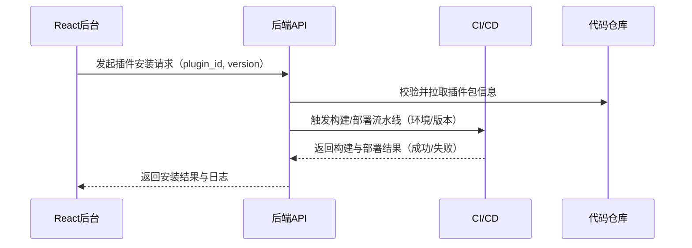
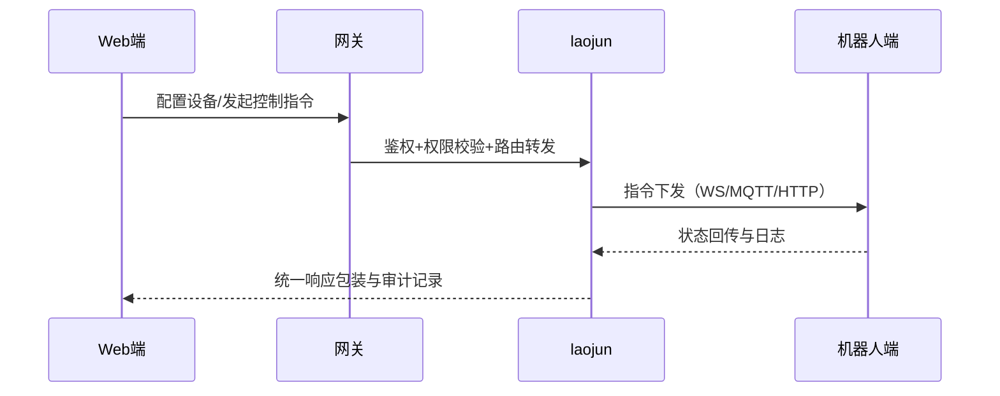
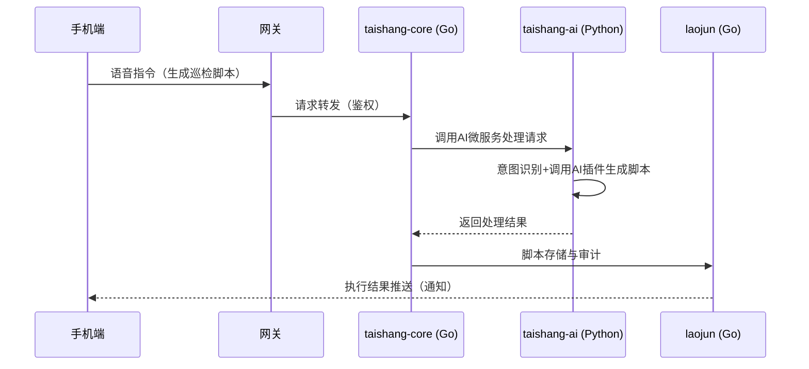
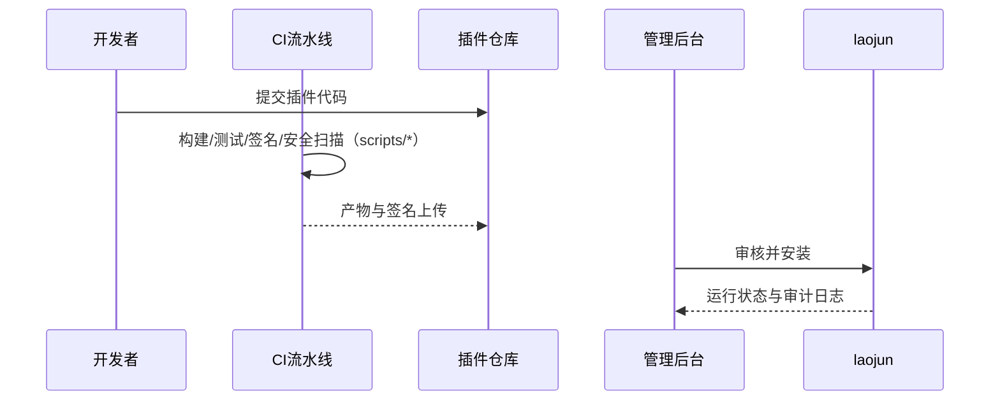

# 架构总览（混合架构）

本架构遵循页面提出的多端适配与插件化策略：B/S 为主、C/S 辅助，并以 CI/CD 贯穿插件生命周期。调整为各终端使用原生语言，Web 使用 React。后端采用混合架构：Laojun域使用Go语言，Taishang域核心API使用Go语言，AI计算功能使用Python微服务。[0]

## 总体架构
- 终端矩阵：
  - Web 管理后台（React + Vite + Ant Design）：插件管理、系统运维、数据监控。[0]
  - iOS 原生（Swift/SwiftUI）：轻量核心功能与通知。
  - Android 原生（Kotlin/Jetpack Compose）：轻量核心功能与通知。
  - 机器人端原生（C++/Qt/QML 或设备官方框架）：控制与状态面板。
  - 手表端原生：Apple Watch（SwiftUI）或微信小程序原生框架（极简状态与快捷操作）。
- 后端（混合架构）：
  - Laojun域（基础功能）：Go（Gin）
  - Taishang域（AI能力）：
    - 核心API：Go（Gin）
    - AI计算微服务：Python（FastAPI）
  - 服务间通信：gRPC + Protocol Buffers
  - 模块地址：`github.com/codetaoist/taishanglaojun`，OpenAPI 3.0 为事实源。[0]
- 数据：关系型数据库（分库分表）、缓存（Redis）、向量库（Milvus/Faiss）。[0]
- 插件：Web 后台主导安装/启停/升级/卸载；本地 C/S 工具辅助开发与签名校验；CI/CD 驱动构建/测试/部署。[0]

## 逻辑分层
- 接口层：HTTP/REST（OpenAPI 3.0），统一认证、鉴权、审计。
- 应用层：业务编排、插件生命周期管理。
- 领域层：核心实体（插件、版本、任务、用户）。
- 基础设施层：DB/缓存/消息/向量库适配器。

## 关键非功能需求
- 安全：插件签名与来源校验、接口鉴权、审计日志。
- 性能：分库分表与缓存策略、接口限流与异步处理。
- 可靠性：环境基线与监控告警、灰度发布与回滚策略。

## 交互流程（示例）


## 域划分与表前缀
- laojun（老君基础域）：插件、审计、系统配置
  - 表前缀：`lao_`，示例：`lao_plugins`, `lao_plugin_versions`, `lao_audit_logs`
- taishang（太上域）：AI 模型、向量集合、任务编排
  - 表前缀：`tai_`，示例：`tai_models`, `tai_vector_collections`, `tai_tasks`
- 路由建议：`/api/laojun/...` 与 `/api/taishang/...`，便于权限与审计分域。

## 六层架构（完整）- 混合架构
- 终端层：原生应用矩阵（Web/桌面/手机/机器人/手表）。
- 接入层：API 网关、协议适配（HTTP/WS/MQTT/IPC）、`X-Device-Type` 响应裁剪。
- 核心服务层：
  - `laojun`（Go）：插件/审计/配置/设备
  - `taishang-core`（Go）：模型/向量/任务/多模态核心API
  - `taishang-ai`（Python）：AI计算微服务（模型推理/向量计算/任务执行）
- 插件层：基础插件与 AI 插件注册与运行，资源隔离与配额控制。
- 数据层：DB/缓存/对象存储/向量库，冷热分层与备份策略。
- 运维层：监控日志、CI/CD 门禁、安全合规、灰度与回滚。

```mermaid
graph TD
    终端层[终端层：原生应用] --> 接入层[接入层：API网关/适配]
    接入层 --> laojun[laojun：基础底座<br/>(Go)]
    接入层 --> taishang_core[taishang-core：AI核心API<br/>(Go)]
    taishang_core --> taishang_ai[taishang-ai：AI计算<br/>(Python)]
    laojun --> 插件层[插件层：基础/AI插件]
    taishang_core --> 插件层
    laojun --> 数据层[数据层：DB/缓存/存储/向量]
    taishang_core --> 数据层
    taishang_ai --> 数据层
    laojun --> 运维层[运维层：监控/日志/CI/CD/安全]
    taishang_core --> 运维层
    taishang_ai --> 运维层
```

## 模块映射（laojun/taishang）- 混合架构
- laojun（Go）：用户与权限、设备管理、插件注册中心、审计与配置、网关与适配。
- taishang-core（Go）：大模型集成元数据、向量集合管理、任务编排元数据、API网关与路由。
- taishang-ai（Python）：大模型推理、向量计算与检索、任务执行、多模态处理。

## 关键业务流（精炼）
### 多终端协同控制（设备）


### AI 智能交互与自动化（脚本）- 混合架构


### 插件扩展与交付（CI 门禁）


## 接口边界与治理 - 混合架构
- 路由分域：
  - `/api/laojun/*`：Laojun域API（Go）
  - `/api/taishang/*`：Taishang域核心API（Go）
  - 内部gRPC：taishang-core与taishang-ai之间的通信
- 响应统一：`{ code, data, message }` 包装；错误码标准映射；幂等键支持。
- 安全治理：插件签名与来源校验、公钥管理与撤销、审计闭环与威胁防护。
- 质量门禁：契约校验与合同 diff、测试覆盖与性能基线、插件生态安全门禁。
- 跨语言通信：使用gRPC + Protocol Buffers实现Go和Python服务间的高效通信。

> 参考：`openapi/laojun.yaml`、`openapi/taishang.yaml`、`docs/interfaces/standard.md`