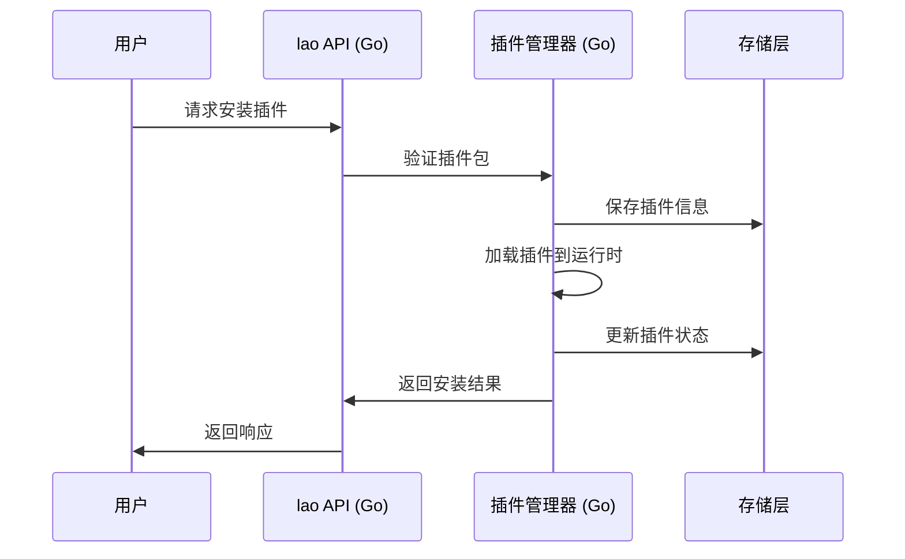
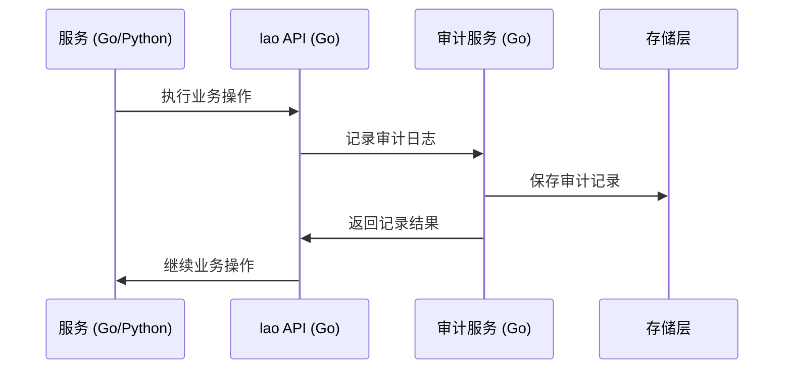
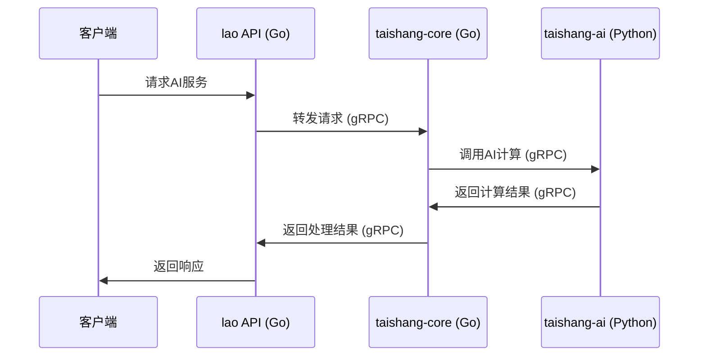
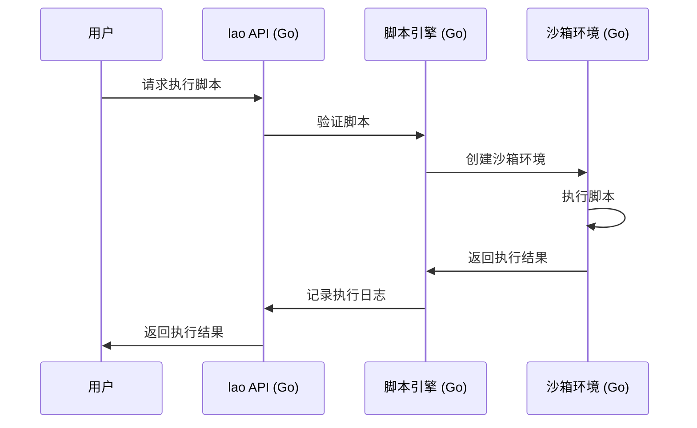
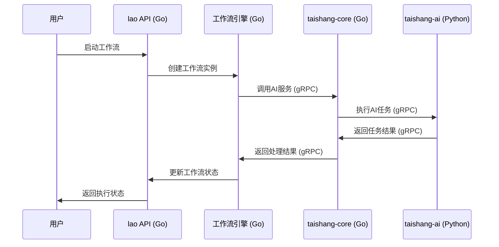

# 老君基础域（laojun）深入设计（混合架构）

定位：平台的基础能力域，负责插件全生命周期、审计日志、系统配置，路径 `/api/laojun/...`，表前缀 `lao_`。在混合架构中，老君域完全使用Go语言实现，专注于高性能、高可靠性的基础服务。[0]

## 业务职责
- 插件生命周期：安装/启动/升级/停止/卸载，版本语义与兼容校验。
- 审计与合规：所有操作记录、查询与导出，支持追踪与告警。
- 系统配置：全局/模块配置，作用域与优先级，变更审计。

## 核心实体

### 1. 插件（Plugin）
```go
type Plugin struct {
    ID          string    `json:"id"`
    Name        string    `json:"name"`
    Version     string    `json:"version"`
    Description string    `json:"description"`
    Status      string    `json:"status"` // active, inactive, error
    Config      string    `json:"config"` // JSON格式的配置
    CreatedAt   time.Time `json:"created_at"`
    UpdatedAt   time.Time `json:"updated_at"`
}
```

### 2. 插件版本（PluginVersion）
```go
type PluginVersion struct {
    ID        string    `json:"id"`
    PluginID  string    `json:"plugin_id"`
    Version   string    `json:"version"`
    Manifest  string    `json:"manifest"`  // JSON格式的清单
    Signature string    `json:"signature"` // 签名
    CreatedAt time.Time `json:"created_at"`
}
```

### 3. 审计日志（AuditLog）
```go
type AuditLog struct {
    ID      string    `json:"id"`
    Actor   string    `json:"actor"`
    Action  string    `json:"action"`
    Target  string    `json:"target"`
    Payload string    `json:"payload"` // JSON格式的载荷
    Result  string    `json:"result"`
    CreatedAt time.Time `json:"created_at"`
}
```

### 4. 系统配置（Config）
```go
type Config struct {
    Key       string    `json:"key"`
    Value     string    `json:"value"`
    Scope     string    `json:"scope"`
    UpdatedAt time.Time `json:"updated_at"`
}
```

### 5. 服务调用记录（ServiceCall）
```go
type ServiceCall struct {
    ID          string    `json:"id"`
    FromService string    `json:"from_service"` // lao, taishang-core, taishang-ai
    ToService   string    `json:"to_service"`   // lao, taishang-core, taishang-ai
    Method      string    `json:"method"`
    Request     string    `json:"request"`      // JSON格式的请求内容
    Response    string    `json:"response"`     // JSON格式的响应内容
    Duration    int64     `json:"duration"`     // 调用耗时，单位毫秒
    Status      string    `json:"status"`       // success, error, timeout
    CreatedAt   time.Time `json:"created_at"`
}
```

### 约束说明
- Plugin: `name` 唯一；状态机 `inactive/active/installed`
- PluginVersion: `plugin_id+version` 唯一；FK 指向 `Plugin`
- AuditLog: 索引 `actor, created_at`；可分区或归档
- Config: `scope` 普通索引

## 数据落库
- 表：`lao_plugins`, `lao_plugin_versions`, `lao_audit_logs`, `lao_configs`
- 索引：`name`唯一、`plugin_id+version`唯一、`actor+created_at`复合、`scope`普通索引。

## 接口路由

### 1. 插件管理 API
```
GET    /api/laojun/plugins              // 获取插件列表
POST   /api/laojun/plugins              // 创建插件
GET    /api/laojun/plugins/:id          // 获取插件详情
PUT    /api/laojun/plugins/:id          // 更新插件
DELETE /api/laojun/plugins/:id          // 删除插件
POST   /api/laojun/plugins/:id/start    // 启动插件
POST   /api/laojun/plugins/:id/stop     // 停止插件
POST   /api/laojun/plugins/:id/restart  // 重启插件
```

### 2. 插件版本管理 API
```
GET    /api/laojun/plugins/:id/versions           // 获取插件版本列表
POST   /api/laojun/plugins/:id/versions           // 创建插件版本
GET    /api/laojun/plugins/:id/versions/:version  // 获取插件版本详情
DELETE /api/laojun/plugins/:id/versions/:version  // 删除插件版本
```

### 3. 审计日志 API
```
GET    /api/laojun/audit_logs              // 获取审计日志列表
GET    /api/laojun/audit_logs/:id          // 获取审计日志详情
GET    /api/laojun/audit_logs/export       // 导出审计日志
```

### 4. 系统配置 API
```
GET    /api/laojun/configs                 // 获取系统配置列表
POST   /api/laojun/configs                 // 创建系统配置
GET    /api/laojun/configs/:key            // 获取系统配置详情
PUT    /api/laojun/configs/:key            // 更新系统配置
DELETE /api/laojun/configs/:key            // 删除系统配置
```

### 5. 脚本管理 API
```
GET    /api/laojun/scripts                 // 获取脚本列表
POST   /api/laojun/scripts                 // 创建脚本
GET    /api/laojun/scripts/:id             // 获取脚本详情
PUT    /api/laojun/scripts/:id             // 更新脚本
DELETE /api/laojun/scripts/:id             // 删除脚本
POST   /api/laojun/scripts/:id/execute     // 执行脚本
```

### 6. 工作流管理 API
```
GET    /api/laojun/workflows               // 获取工作流列表
POST   /api/laojun/workflows               // 创建工作流
GET    /api/laojun/workflows/:id           // 获取工作流详情
PUT    /api/laojun/workflows/:id           // 更新工作流
DELETE /api/laojun/workflows/:id           // 删除工作流
POST   /api/laojun/workflows/:id/start     // 启动工作流
POST   /api/laojun/workflows/:id/stop      // 停止工作流
```

### 7. 跨语言服务调用 API
```
GET    /api/laojun/service_calls           // 获取服务调用记录
POST   /api/laojun/call_taishang_core      // 调用taishang-core服务
POST   /api/laojun/call_taishang_ai        // 调用taishang-ai服务
```

## 关键流程

### 1. 插件生命周期管理流程


### 2. 审计日志记录流程


### 3. 跨语言服务调用流程


### 4. 脚本执行流程


### 5. 工作流执行流程


## 策略与门禁
- 幂等：操作带去重键；失败可重试；审计不重复。
- 权限：管理员/运维/只读；操作级权限粒度到动作。
- 安全：manifest与签名校验；来源可信；接口鉴权与速率限制。

## 规划总览
- 目标：构建可信、可管控的插件运行与集成域，覆盖清单/签名/权限、生命周期、UI 组件集成与审计回滚。
- 契约：`/api/laojun/plugins/*`（install/list/start/stop/upgrade/uninstall），统一响应包装与错误码映射。

## 业务流程（高层）
- 安装（Install）：校验清单 → 验签 → 存储注册 → 资源配额与权限授予 → 可回滚。
- 启停（Start/Stop）：资源检查 → 沙箱化加载/卸载 → 健康检查与观测 → 容错与熔断。
- 升级（Upgrade）：版本兼容评审 → 双轨部署（旧版并存）→ 切换与回滚。
- 卸载（Uninstall）：依赖检查 → 清理注册与持久化记录 → 留存审计轨迹。

## 功能分解
- 清单管理：字段完整性、`checksum` 校验、兼容策略（SemVer）。
- 签名与来源：`RSA-2048`/`Ed25519` 验签，公钥管理与撤销列表。
- 权限与资源：最小授权、CPU/Mem/GPU 配额、文件系统与网络隔离。
- 生命周期 API：`Init/Start/Stop/Health`，异常回滚与幂等处理。
- UI 组件集成：组件注册、权限提示、原生端插入点与主题隔离。
- 观测与审计：日志/指标/traceId，失败阈值告警与自动回滚策略。

## 细节逻辑与约束
- 交易性保障：安装/升级操作需事务化，失败自动回滚并记录。
- 并发与限流：并发启动队列与回压；接口与资源限流统一配置。
- 错误码对齐：平台侧统一错误码，插件侧映射并在响应包装返回。
- 数据持久化：插件注册表、权限授予记录、审计日志；参见 `db/migrations/V1__init_lao.sql`。
- 安全与合规：隐私与数据收集说明，供应链扫描（依赖来源与签名）。

## 部署与监控

### 1. 部署方案
- **容器化部署**
  - lao API服务使用Go语言实现，打包为Docker镜像
  - 插件管理器、审计服务、脚本引擎等组件打包为独立容器
  - 使用Kubernetes进行容器编排和管理
  - 支持水平扩展和自动故障恢复

- **服务发现**
  - 使用Consul或Kubernetes Service进行服务注册与发现
  - lao API服务自动注册到服务发现中心
  - 支持跨语言服务调用（Go服务调用Python服务）

- **配置管理**
  - 使用ConfigMap管理应用配置
  - 支持配置热更新，无需重启服务
  - 敏感信息使用Secret管理

### 2. 监控方案
- **健康检查**
  - lao API服务提供健康检查端点
  - 检查数据库连接、Redis连接、插件状态等
  - 支持Kubernetes Liveness和Readiness探针

- **指标监控**
  - 使用Prometheus收集关键指标
  - 监控API请求量、响应时间、错误率等
  - 监控插件状态、脚本执行情况等

- **日志管理**
  - 使用ELK Stack（Elasticsearch、Logstash、Kibana）管理日志
  - 结构化日志输出，便于查询和分析
  - 支持分布式链路追踪

- **告警机制**
  - 基于Prometheus Alertmanager实现告警
  - 支持邮件、Slack、钉钉等多种告警方式
  - 告警规则包括服务不可用、性能下降、错误率上升等

### 3. 跨语言通信监控
- **服务调用监控**
  - 记录所有跨语言服务调用（Go ↔ Python）
  - 监控调用延迟、成功率、错误类型
  - 提供服务拓扑图，可视化服务依赖关系

- **gRPC监控**
  - 监控gRPC连接状态、请求量、响应时间
  - 跟踪gRPC流式传输的性能
  - 监控gRPC拦截器的执行情况

### 4. 容量规划
- **资源评估**
  - CPU：根据插件数量和并发请求量评估
  - 内存：根据插件运行时内存占用评估
  - 存储：根据插件包大小、日志量、审计数据量评估

- **扩展策略**
  - 水平扩展：增加lao API服务实例数量
  - 垂直扩展：增加单个实例的CPU和内存
  - 存储扩展：使用分布式存储系统

## 接口契约映射

### 1. 插件管理 API
- 创建插件：`POST /api/laojun/plugins` → 返回 `{code, data: Plugin, message}`
- 获取插件列表：`GET /api/laojun/plugins` → 返回 `{code, data: {plugins: Plugin[], total}, message}`
- 获取插件详情：`GET /api/laojun/plugins/:id` → 返回 `{code, data: Plugin, message}`
- 更新插件：`PUT /api/laojun/plugins/:id` → 返回 `{code, data: Plugin, message}`
- 删除插件：`DELETE /api/laojun/plugins/:id` → 返回 `{code, message}`
- 启动插件：`POST /api/laojun/plugins/:id/start` → 返回 `{code, data: {status: string}, message}`
- 停止插件：`POST /api/laojun/plugins/:id/stop` → 返回 `{code, data: {status: string}, message}`
- 重启插件：`POST /api/laojun/plugins/:id/restart` → 返回 `{code, data: {status: string}, message}`

### 2. 插件版本管理 API
- 创建插件版本：`POST /api/laojun/plugins/:id/versions` → 返回 `{code, data: PluginVersion, message}`
- 获取插件版本列表：`GET /api/laojun/plugins/:id/versions` → 返回 `{code, data: {versions: PluginVersion[], total}, message}`
- 获取插件版本详情：`GET /api/laojun/plugins/:id/versions/:version` → 返回 `{code, data: PluginVersion, message}`
- 删除插件版本：`DELETE /api/laojun/plugins/:id/versions/:version` → 返回 `{code, message}`

### 3. 审计日志 API
- 获取审计日志列表：`GET /api/laojun/audit_logs` → 返回 `{code, data: {logs: AuditLog[], total}, message}`
- 获取审计日志详情：`GET /api/laojun/audit_logs/:id` → 返回 `{code, data: AuditLog, message}`
- 导出审计日志：`GET /api/laojun/audit_logs/export` → 返回文件流或下载链接

### 4. 系统配置 API
- 创建系统配置：`POST /api/laojun/configs` → 返回 `{code, data: Config, message}`
- 获取系统配置列表：`GET /api/laojun/configs` → 返回 `{code, data: {configs: Config[], total}, message}`
- 获取系统配置详情：`GET /api/laojun/configs/:key` → 返回 `{code, data: Config, message}`
- 更新系统配置：`PUT /api/laojun/configs/:key` → 返回 `{code, data: Config, message}`
- 删除系统配置：`DELETE /api/laojun/configs/:key` → 返回 `{code, message}`

### 5. 脚本管理 API
- 创建脚本：`POST /api/laojun/scripts` → 返回 `{code, data: Script, message}`
- 获取脚本列表：`GET /api/laojun/scripts` → 返回 `{code, data: {scripts: Script[], total}, message}`
- 获取脚本详情：`GET /api/laojun/scripts/:id` → 返回 `{code, data: Script, message}`
- 更新脚本：`PUT /api/laojun/scripts/:id` → 返回 `{code, data: Script, message}`
- 删除脚本：`DELETE /api/laojun/scripts/:id` → 返回 `{code, message}`
- 执行脚本：`POST /api/laojun/scripts/:id/execute` → 返回 `{code, data: {execution_id: string, output: string}, message}`

### 6. 工作流管理 API
- 创建工作流：`POST /api/laojun/workflows` → 返回 `{code, data: Workflow, message}`
- 获取工作流列表：`GET /api/laojun/workflows` → 返回 `{code, data: {workflows: Workflow[], total}, message}`
- 获取工作流详情：`GET /api/laojun/workflows/:id` → 返回 `{code, data: Workflow, message}`
- 更新工作流：`PUT /api/laojun/workflows/:id` → 返回 `{code, data: Workflow, message}`
- 删除工作流：`DELETE /api/laojun/workflows/:id` → 返回 `{code, message}`
- 启动工作流：`POST /api/laojun/workflows/:id/start` → 返回 `{code, data: {execution_id: string, status: string}, message}`
- 停止工作流：`POST /api/laojun/workflows/:id/stop` → 返回 `{code, data: {status: string}, message}`

### 7. 跨语言服务调用 API
- 获取服务调用记录：`GET /api/laojun/service_calls` → 返回 `{code, data: {calls: ServiceCall[], total}, message}`
- 调用taishang-core服务：`POST /api/laojun/call_taishang_core` → 返回 `{code, data: {result: any}, message}`
- 调用taishang-ai服务：`POST /api/laojun/call_taishang_ai` → 返回 `{code, data: {result: any}, message}`
- 列表：`GET /api/laojun/plugins/list`
- 启动：`POST /api/laojun/plugins/start`
- 停止：`POST /api/laojun/plugins/stop`
- 升级：`POST /api/laojun/plugins/upgrade`
- 卸载：`POST /api/laojun/plugins/uninstall`

> 参考：`openapi/laojun.yaml`，`docs/plugins/plugin-system-details.md`，`docs/security/permission-model.md`
- 安全：manifest与签名校验；来源可信；接口鉴权与速率限制。

## 能力列表（What we do）
- 插件生态治理：开发→测试→部署→安装→运行→卸载全闭环，版本兼容与回滚策略。
- 平台审计与合规：操作事件审计、告警与导出；接口防护与来源可信。
- 系统与设备基础能力：用户与权限、设备管理、配置与适配（多协议）。

## 实现路径（How we do it）
- 契约与脚本：使用 `openapi/laojun.yaml` 定义接口契约；在本地与 CI 使用 `scripts/manifest_validate.py`、`scripts/manifest_sign.py` 与 `scripts/openapi_contract_diff.py` 做清单校验、签名与合同 diff。
- 生命周期与沙箱：通过 `Init/Start/Stop/Health` API 驱动插件生命周期，在容器/沙箱内隔离运行并施加配额与权限。
- 权限与门禁：RBAC 与作用域授权（global/workspace/instance），`enabledActions` 驱动前端可见；门禁校验覆盖契约/安全/测试与性能基线。
- 审计与观测：统一日志/指标/traceId，失败阈值与自动回滚；插件与平台的审计事件闭环。

> 参阅：`docs/plugins/development-manual.md`、`scripts/README.md`、`docs/interfaces/laojun-api-spec.md`
