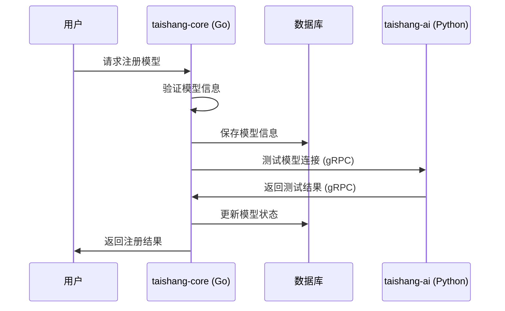
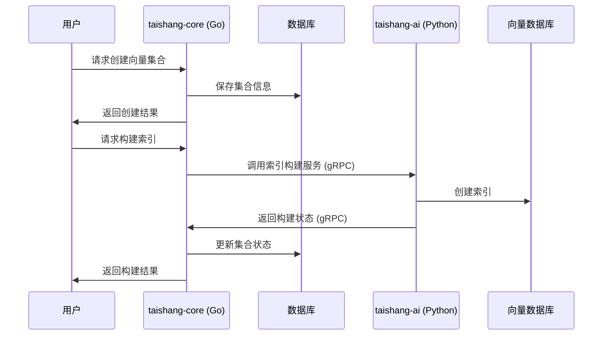
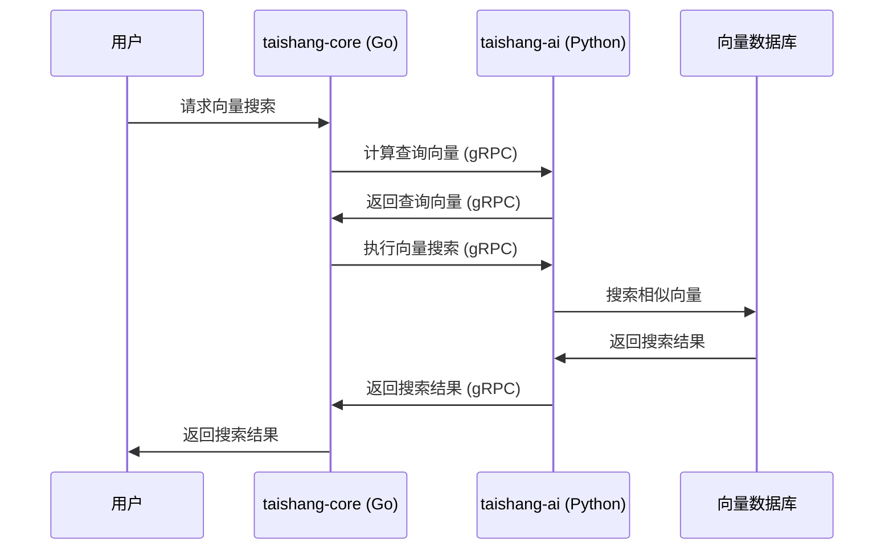
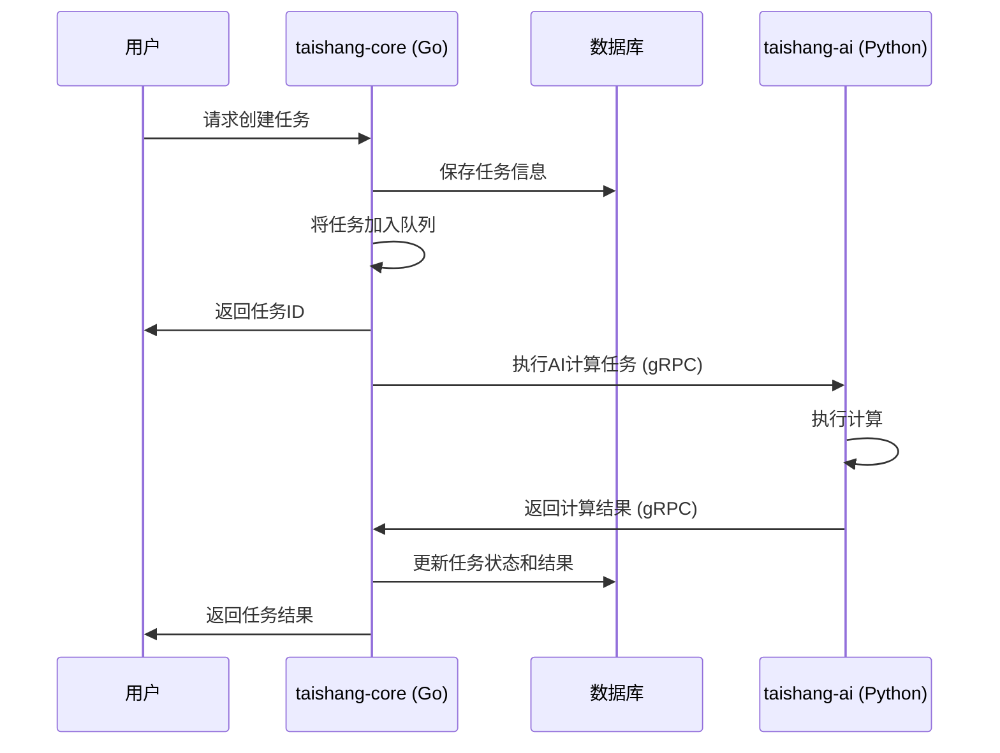
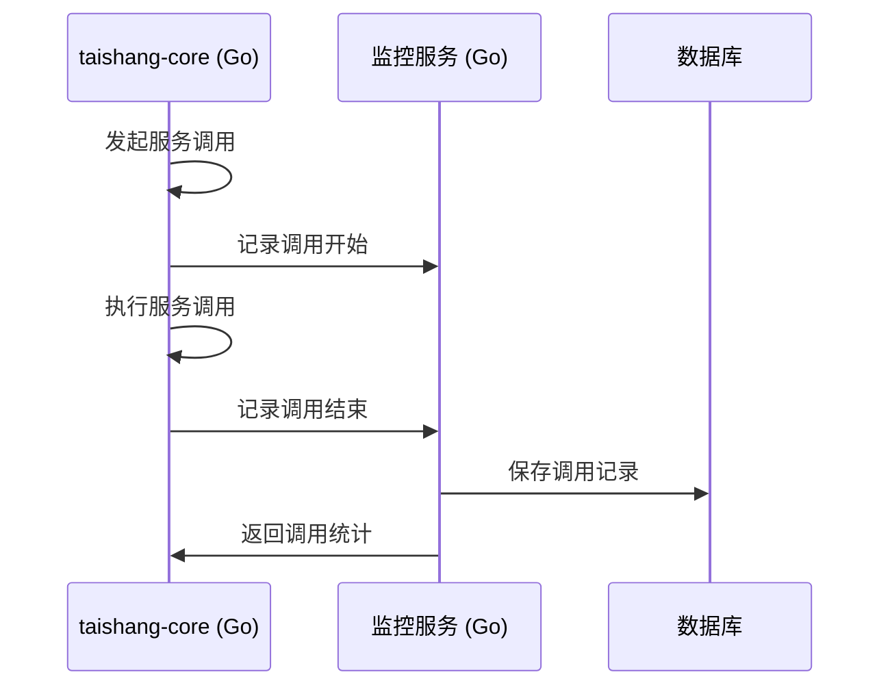

# 太上域（taishang）深入设计（混合架构）

定位：AI能力域，负责模型注册、向量集合管理、任务编排与监控，路径 `/api/taishang/...`，表前缀 `tai_`。采用Go + Python混合架构，核心API使用Go语言实现，AI计算功能使用Python微服务实现。

## 业务职责

### 1. 模型注册与管理（taishang-core）
- 模型来源、版本、状态管理（Go实现）
- 兼容性与退役策略（Go实现）
- 模型路由与负载均衡（Go实现）
- 跨语言调用AI计算服务（Go调用Python）

### 2. 向量集合管理（taishang-core + taishang-ai）
- 向量集合创建、维度与索引类型管理（Go实现）
- 集合生命周期与性能策略（Go实现）
- 向量嵌入计算（Python实现）
- 向量索引构建与查询（Go调用Python）

### 3. 任务编排与监控（taishang-core + taishang-ai）
- 任务类型、状态流转管理（Go实现）
- 任务调度与资源分配（Go实现）
- AI计算任务执行（Python实现）
- 任务监控与告警（Go实现）

### 4. 跨语言服务协调
- Go服务与Python微服务之间的通信协调
- gRPC接口定义与实现
- 服务发现与负载均衡
- 错误处理与重试机制

## 核心实体

### 1. Model（模型）- taishang-core
```go
type Model struct {
    ID          string    `json:"id" gorm:"primaryKey;type:varchar(36)"`
    Name        string    `json:"name" gorm:"type:varchar(100);not null;index:idx_name_provider"`
    Provider    string    `json:"provider" gorm:"type:varchar(50);not null;index:idx_name_provider"`
    Version     string    `json:"version" gorm:"type:varchar(20);not null"`
    Status      string    `json:"status" gorm:"type:enum('active','inactive','deprecated');default:'inactive'"`
    Endpoint    string    `json:"endpoint" gorm:"type:varchar(255)"`
    Config      string    `json:"config" gorm:"type:text"` // JSON配置
    CreatedAt   time.Time `json:"created_at" gorm:"autoCreateTime"`
    UpdatedAt   time.Time `json:"updated_at" gorm:"autoUpdateTime"`
}
```
- 约束：`name+provider` 唯一；状态 `active/inactive/deprecated`。

### 2. VectorCollection（向量集合）- taishang-core
```go
type VectorCollection struct {
    ID         string    `json:"id" gorm:"primaryKey;type:varchar(36)"`
    Name       string    `json:"name" gorm:"type:varchar(100);not null;uniqueIndex"`
    Dims       int       `json:"dims" gorm:"not null"`
    IndexType  string    `json:"index_type" gorm:"type:varchar(50);not null"`
    MetricType string    `json:"metric_type" gorm:"type:varchar(20);default:'cosine'"`
    Status     string    `json:"status" gorm:"type:enum('building','ready','error');default:'building'"`
    CreatedAt  time.Time `json:"created_at" gorm:"autoCreateTime"`
    UpdatedAt  time.Time `json:"updated_at" gorm:"autoUpdateTime"`
}
```
- 约束：`name` 唯一；`dims` 必填。

### 3. Task（任务）- taishang-core
```go
type Task struct {
    ID          string    `json:"id" gorm:"primaryKey;type:varchar(36)"`
    Type        string    `json:"type" gorm:"type:varchar(50);not null;index:idx_type"`
    Status      string    `json:"status" gorm:"type:enum('pending','running','completed','failed','cancelled');default:'pending';index:idx_status"`
    Payload     string    `json:"payload" gorm:"type:text"` // JSON配置
    Result      string    `json:"result" gorm:"type:text"`   // JSON结果
    ErrorMsg    string    `json:"error_msg" gorm:"type:text"`
    Progress    int       `json:"progress" gorm:"default:0"` // 0-100
    CreatedAt   time.Time `json:"created_at" gorm:"autoCreateTime;index:idx_created_at"`
    UpdatedAt   time.Time `json:"updated_at" gorm:"autoUpdateTime"`
    CompletedAt *time.Time `json:"completed_at"`
}
```
- 索引：`status, created_at`；必要时分表。

### 4. ServiceCall（服务调用记录）- taishang-core
```go
type ServiceCall struct {
    ID           string    `json:"id" gorm:"primaryKey;type:varchar(36)"`
    SourceService string   `json:"source_service" gorm:"type:varchar(50);not null;index:idx_source"`
    TargetService string   `json:"target_service" gorm:"type:varchar(50);not null;index:idx_target"`
    Method       string    `json:"method" gorm:"type:varchar(100);not null"`
    Request      string    `json:"request" gorm:"type:text"`     // JSON请求
    Response     string    `json:"response" gorm:"type:text"`    // JSON响应
    Duration     int       `json:"duration" gorm:"default:0"`    // 毫秒
    Status       string    `json:"status" gorm:"type:enum('success','failed','timeout');default:'success'"`
    ErrorMsg     string    `json:"error_msg" gorm:"type:text"`
    CreatedAt    time.Time `json:"created_at" gorm:"autoCreateTime;index:idx_created_at"`
}
```
- 约束：记录taishang-core与taishang-ai之间的服务调用信息。

## 数据落库

### 1. 表结构
- `tai_models`：模型信息表（taishang-core）
- `tai_vector_collections`：向量集合表（taishang-core）
- `tai_tasks`：任务表（taishang-core）
- `tai_service_calls`：服务调用记录表（taishang-core）

### 2. 索引策略
- `tai_models`：`name+provider` 唯一索引
- `tai_vector_collections`：`name` 唯一索引
- `tai_tasks`：`status+created_at` 复合索引，`type` 单列索引
- `tai_service_calls`：`source_service+created_at` 复合索引，`target_service+created_at` 复合索引

### 3. 分表策略
- `tai_tasks`：按月分表，表名格式 `tai_tasks_YYYYMM`
- `tai_service_calls`：按月分表，表名格式 `tai_service_calls_YYYYMM`

## 接口路由

### 1. 模型管理 API (taishang-core)
```
GET    /api/taishang/models              // 获取模型列表
POST   /api/taishang/models              // 创建模型
GET    /api/taishang/models/:id         // 获取模型详情
PUT    /api/taishang/models/:id         // 更新模型
DELETE /api/taishang/models/:id         // 删除模型
POST   /api/taishang/models/:id/activate    // 激活模型
POST   /api/taishang/models/:id/deactivate  // 停用模型
```

### 2. 向量集合管理 API (taishang-core)
```
GET    /api/taishang/vector_collections              // 获取向量集合列表
POST   /api/taishang/vector_collections              // 创建向量集合
GET    /api/taishang/vector_collections/:id         // 获取向量集合详情
PUT    /api/taishang/vector_collections/:id         // 更新向量集合
DELETE /api/taishang/vector_collections/:id         // 删除向量集合
POST   /api/taishang/vector_collections/:id/build   // 构建向量索引
```

### 3. 向量操作 API (taishang-core调用taishang-ai)
```
POST   /api/taishang/vectors/upsert       // 插入或更新向量
POST   /api/taishang/vectors/search       // 向量搜索
POST   /api/taishang/vectors/delete       // 删除向量
POST   /api/taishang/vectors/embed        // 计算文本嵌入
```

### 4. 任务管理 API (taishang-core)
```
GET    /api/taishang/tasks              // 获取任务列表
POST   /api/taishang/tasks              // 创建任务
GET    /api/taishang/tasks/:id          // 获取任务详情
PUT    /api/taishang/tasks/:id          // 更新任务
DELETE /api/taishang/tasks/:id          // 删除任务
POST   /api/taishang/tasks/:id/start    // 启动任务
POST   /api/taishang/tasks/:id/stop     // 停止任务
POST   /api/taishang/tasks/:id/cancel   // 取消任务
```

### 5. 服务调用监控 API (taishang-core)
```
GET    /api/taishang/service_calls           // 获取服务调用记录
GET    /api/taishang/service_calls/stats      // 获取服务调用统计
```

## 关键流程

### 1. 模型注册流程


### 2. 向量集合创建与索引构建流程


### 3. 向量搜索流程


### 4. 任务执行流程


### 5. 跨语言服务调用监控流程


## 性能与资源

### 1. 限流与队列策略
- **接口限流**：基于令牌桶算法，针对不同API设置不同限流策略
- **异步处理**：长时间任务异步执行，通过任务队列管理
- **重试指数退避**：跨语言服务调用失败时采用指数退避重试策略

### 2. 向量库接入策略
- **向量数据库选择**：Milvus/Faiss，根据数据量和查询需求选择
- **写入批量优化**：批量写入向量数据，提高写入效率
- **查询并发控制**：限制并发查询数，避免系统过载
- **缓存策略**：热点向量数据缓存，提高查询速度

### 3. 跨语言服务性能优化
- **gRPC连接池**：复用gRPC连接，减少连接建立开销
- **负载均衡**：多个taishang-ai实例之间的负载均衡
- **数据序列化优化**：使用Protocol Buffers高效序列化数据
- **调用超时控制**：设置合理的超时时间，避免长时间阻塞

### 4. 监控指标
- **任务性能**：任务吞吐量、失败率、平均执行时间
- **向量操作性能**：索引构建耗时、向量搜索延迟
- **模型响应时间**：模型调用响应时间、成功率
- **跨语言调用监控**：Go与Python服务之间的调用延迟、成功率

### 5. 资源管理
- **CPU资源分配**：taishang-core和taishang-ai分别配置CPU限制
- **内存管理**：Python AI服务的内存使用监控和限制
- **存储优化**：向量数据存储策略，冷热数据分离
- **网络带宽**：跨语言服务之间的网络通信优化

## 规划总览
- 目标：提供可治理的模型/向量/任务编排域，实现数据管道、索引与检索、训练评估与作业管理的闭环。
- 契约：`/api/taishang/*`（models/vectors/tasks），统一响应包装与错误码映射。

## 业务流程（高层）
- 模型：注册 → 配置（资源/精度/费用）→ 上架/下架 → 更新/回滚。
- 向量：集合创建 → 数据摄入 → 切分与嵌入 → 索引构建 → 搜索/维护。
- 任务：作业创建 → 调度（优先级/配额/重试）→ 运行 → 监控与审计 → 终止/取消。

## 功能分解
- 模型管理：`register/list/update/delete`，版本语义化与兼容策略，缓存与路由。
- 向量管理：集合/分片/度量（cosine/L2/dot），`upsert/search/delete`，TTL 与压缩策略。
- 任务编排：类型（训练/嵌入/索引/评估），状态机（创建/队列/运行/完成/失败/取消），重试与回退。
- 数据管道：来源（文件/仓/API），清洗与分块（窗口/语义），嵌入器与模型选择，监控与告警。
- 成本与性能：预算与配额，并发/回压，冷热数据分层与缓存策略。
- 安全与合规：数据分级与脱敏，密钥管理与访问审计，跨域共享治理。

## 细节逻辑与约束
- 一致性：集合与索引构建需幂等；任务状态机禁止不合法跳转。
- 并发：写多读多场景下的锁与分片策略；后台合并与重建。
- 监控：吞吐/延时/召回/精度指标；阈值告警与自愈策略。
- 持久化：集合元数据、索引参数、任务轨迹；参见 `db/migrations/V2__init_tai.sql`。
- 错误码：统一错误码表，模型/向量/任务端点映射与响应包装返回。

## 接口契约映射

### 1. 模型管理 API (taishang-core)
- 创建模型：`POST /api/taishang/models` → 返回 `{code, data: Model, message}`
- 获取模型列表：`GET /api/taishang/models` → 返回 `{code, data: {models: Model[], total}, message}`
- 获取模型详情：`GET /api/taishang/models/:id` → 返回 `{code, data: Model, message}`
- 更新模型：`PUT /api/taishang/models/:id` → 返回 `{code, data: Model, message}`
- 删除模型：`DELETE /api/taishang/models/:id` → 返回 `{code, message}`
- 激活模型：`POST /api/taishang/models/:id/activate` → 返回 `{code, data: {status: string}, message}`
- 停用模型：`POST /api/taishang/models/:id/deactivate` → 返回 `{code, data: {status: string}, message}`

### 2. 向量集合管理 API (taishang-core)
- 创建向量集合：`POST /api/taishang/vector_collections` → 返回 `{code, data: VectorCollection, message}`
- 获取向量集合列表：`GET /api/taishang/vector_collections` → 返回 `{code, data: {collections: VectorCollection[], total}, message}`
- 获取向量集合详情：`GET /api/taishang/vector_collections/:id` → 返回 `{code, data: VectorCollection, message}`
- 更新向量集合：`PUT /api/taishang/vector_collections/:id` → 返回 `{code, data: VectorCollection, message}`
- 删除向量集合：`DELETE /api/taishang/vector_collections/:id` → 返回 `{code, message}`
- 构建向量索引：`POST /api/taishang/vector_collections/:id/build` → 返回 `{code, data: {task_id: string}, message}`

### 3. 向量操作 API (taishang-core调用taishang-ai)
- 插入或更新向量：`POST /api/taishang/vectors/upsert` → 返回 `{code, data: {count: int}, message}`
- 向量搜索：`POST /api/taishang/vectors/search` → 返回 `{code, data: {results: VectorSearchResult[], total}, message}`
- 删除向量：`POST /api/taishang/vectors/delete` → 返回 `{code, data: {count: int}, message}`
- 计算文本嵌入：`POST /api/taishang/vectors/embed` → 返回 `{code, data: {embedding: []float32}, message}`

### 4. 任务管理 API (taishang-core)
- 创建任务：`POST /api/taishang/tasks` → 返回 `{code, data: Task, message}`
- 获取任务列表：`GET /api/taishang/tasks` → 返回 `{code, data: {tasks: Task[], total}, message}`
- 获取任务详情：`GET /api/taishang/tasks/:id` → 返回 `{code, data: Task, message}`
- 更新任务：`PUT /api/taishang/tasks/:id` → 返回 `{code, data: Task, message}`
- 删除任务：`DELETE /api/taishang/tasks/:id` → 返回 `{code, message}`
- 启动任务：`POST /api/taishang/tasks/:id/start` → 返回 `{code, data: {status: string}, message}`
- 停止任务：`POST /api/taishang/tasks/:id/stop` → 返回 `{code, data: {status: string}, message}`
- 取消任务：`POST /api/taishang/tasks/:id/cancel` → 返回 `{code, data: {status: string}, message}`

### 5. 服务调用监控 API (taishang-core)
- 获取服务调用记录：`GET /api/taishang/service_calls` → 返回 `{code, data: {calls: ServiceCall[], total}, message}`
- 获取服务调用统计：`GET /api/taishang/service_calls/stats` → 返回 `{code, data: {stats: ServiceCallStats}, message}`

### 6. gRPC内部接口 (taishang-core ↔ taishang-ai)
- 计算向量嵌入：`ComputeEmbedding(request) → response`
- 执行向量搜索：`SearchVectors(request) → response`
- 执行AI模型推理：`InferenceModel(request) → response`
- 构建向量索引：`BuildIndex(request) → response`

> 参考：`openapi/taishang.yaml`，`docs/data/data-model-design.md`，`docs/testing/strategy.md`

## 能力列表（What we do）
- 模型治理：注册/版本/状态与退役策略，动态路由与缓存。
- 向量检索：集合生命周期、嵌入/索引/搜索闭环，性能与成本治理。
- 任务编排：长任务状态机、优先级与配额、失败重试与降级、观测与告警。

## 实现路径（How we do it）

### 1. 契约与生成
- 使用 `openapi/taishang.yaml` 作为事实源，生成客户端并驱动前后端联调
- 合同校验与 diff 接入 CI 门禁
- 定义gRPC接口规范，用于taishang-core与taishang-ai之间的通信

### 2. 混合架构实现
- **taishang-core (Go)**：
  - 实现RESTful API接口
  - 数据库操作和业务逻辑
  - 任务调度和状态管理
  - 跨语言服务调用客户端
  
- **taishang-ai (Python)**：
  - 实现AI计算功能
  - 向量嵌入计算
  - 模型推理
  - 向量索引构建和搜索

### 3. 数据管道与嵌入
- 来源（文件/仓/API）→ 清洗与分块 → 嵌入器选择与模型切换 → 索引构建 → 搜索
- taishang-core负责数据流转和任务调度
- taishang-ai负责具体的AI计算和向量操作

### 4. 状态机与观测
- 任务 `create/queue/run/succeed/fail/cancel` 状态
- 进度、成本与吞吐指标
- 端到端 trace 与审计事件
- 跨语言服务调用监控

### 5. 成本与性能
- 预算/配额/回压与并发控制
- 冷热数据分层与缓存策略
- 异常降级与切换（本地→远程模型）
- gRPC连接池和负载均衡

### 6. 部署与运维
- 容器化部署：taishang-core和taishang-ai分别打包为Docker镜像
- 服务发现与注册：使用Consul或Kubernetes Service
- 监控与告警：Prometheus + Grafana监控跨语言服务调用
- 日志管理：ELK Stack统一收集和分析日志

> 参阅：`docs/interfaces/taishang-api-spec.md`、`docs/testing/strategy.md`、`scripts/openapi_contract_diff.py`