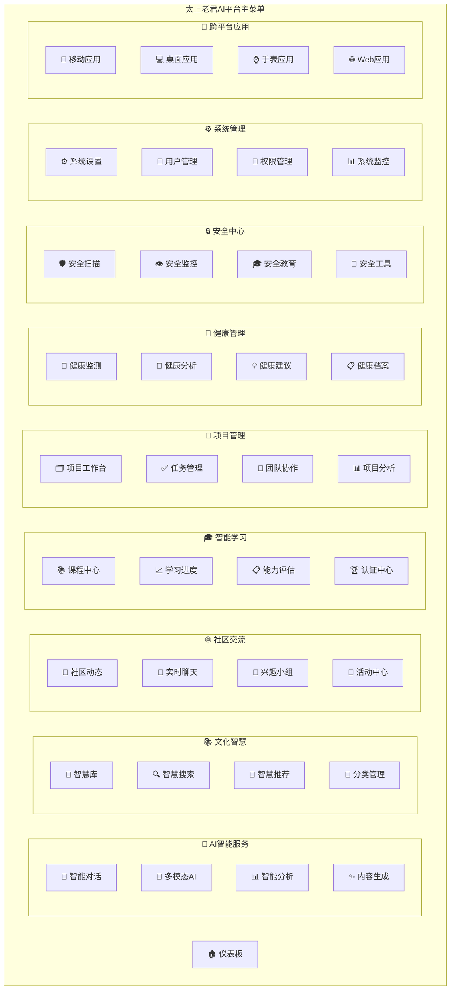

# 太上老君AI平台 - 系统菜单架构设计

## 📋 概述

本文档定义了太上老君AI平台的完整系统菜单架构，涵盖所有已开发和规划中的功能模块，确保用户能够便捷地访问所有功能。

## 🏗️ 菜单架构设计

## 🎯 详细菜单结构

### 1. 🏠 仪表板 (Dashboard)
**状态**: ✅ 已开发
- **概览面板**: 系统状态、用户活动、关键指标
- **快捷操作**: 常用功能快速入口
- **个性化推荐**: 基于用户行为的智能推荐
- **通知中心**: 系统通知、消息提醒

### 2. 🧠 AI智能服务
#### 2.1 💬 智能对话
**状态**: ✅ 已开发
- **多轮对话**: 上下文感知的智能对话
- **专业领域**: 文化、技术、生活等专业对话
- **语音交互**: 语音输入输出支持
- **对话历史**: 对话记录管理

#### 2.2 🎨 多模态AI
**状态**: 🔄 部分开发
- **图像生成**: AI图像创作
- **图像分析**: 图像内容识别
- **视频处理**: 视频分析与生成
- **音频处理**: 语音合成与识别

#### 2.3 📊 智能分析
**状态**: ⏳ 规划中
- **数据分析**: 智能数据洞察
- **趋势预测**: 基于AI的趋势分析
- **报告生成**: 自动化报告生成
- **可视化**: 智能图表生成

#### 2.4 ✨ 内容生成
**状态**: ⏳ 规划中
- **文本生成**: 智能写作助手
- **代码生成**: AI编程助手
- **创意设计**: 设计方案生成
- **营销内容**: 营销文案生成

### 3. 📚 文化智慧
#### 3.1 📖 智慧库
**状态**: ✅ 已开发
- **经典文献**: 儒道佛法经典收录
- **现代解读**: 古典智慧现代应用
- **智慧问答**: 基于文化智慧的问答
- **收藏管理**: 个人智慧收藏

#### 3.2 🔍 智慧搜索
**状态**: ✅ 已开发
- **语义搜索**: 基于AI的智能搜索
- **关联推荐**: 相关内容推荐
- **搜索历史**: 搜索记录管理
- **高级筛选**: 多维度筛选功能

#### 3.3 🎯 智慧推荐
**状态**: ✅ 已开发
- **个性化推荐**: 基于用户偏好推荐
- **每日智慧**: 每日智慧推送
- **主题推荐**: 主题化内容推荐
- **趋势智慧**: 热门智慧内容

#### 3.4 📂 分类管理
**状态**: ✅ 已开发
- **分类体系**: 智慧内容分类
- **标签管理**: 智慧标签系统
- **内容管理**: 智慧内容编辑
- **质量控制**: 内容质量管理

### 4. 🌐 社区交流
#### 4.1 📝 社区动态
**状态**: ✅ 已开发
- **动态发布**: 用户动态分享
- **互动功能**: 点赞、评论、转发
- **话题讨论**: 热门话题讨论
- **内容审核**: 社区内容管理

#### 4.2 💬 实时聊天
**状态**: ✅ 已开发
- **私聊功能**: 用户一对一聊天
- **群聊功能**: 多人群组聊天
- **文件传输**: 文件分享功能
- **消息管理**: 聊天记录管理

#### 4.3 👥 兴趣小组
**状态**: ✅ 已开发
- **小组创建**: 兴趣小组建立
- **成员管理**: 小组成员管理
- **活动组织**: 小组活动策划
- **资源分享**: 小组资源共享

#### 4.4 🎉 活动中心
**状态**: ⏳ 规划中
- **活动发布**: 社区活动发布
- **报名管理**: 活动报名系统
- **活动直播**: 在线活动直播
- **活动回顾**: 活动总结回顾

### 5. 🎓 智能学习
#### 5.1 📚 课程中心
**状态**: 🔄 部分开发
- **课程目录**: 学习课程浏览
- **课程播放**: 视频课程播放
- **课程笔记**: 学习笔记记录
- **课程评价**: 课程评分评价

#### 5.2 📈 学习进度
**状态**: ✅ 已开发
- **进度追踪**: 学习进度可视化
- **学习计划**: 个性化学习计划
- **学习统计**: 学习数据统计
- **成就系统**: 学习成就奖励

#### 5.3 📋 能力评估
**状态**: 🔄 部分开发
- **技能测试**: 专业技能测评
- **能力分析**: 能力模型分析
- **学习建议**: 个性化学习建议
- **证书考试**: 专业认证考试

#### 5.4 🏆 认证中心
**状态**: ⏳ 规划中
- **证书管理**: 学习证书管理
- **认证申请**: 专业认证申请
- **证书验证**: 证书真伪验证
- **证书分享**: 证书社交分享

### 6. 💼 项目管理
#### 6.1 🗂️ 项目工作台
**状态**: ⏳ 规划中
- **项目概览**: 项目状态总览
- **项目创建**: 新项目创建向导
- **项目模板**: 项目模板库
- **项目归档**: 项目归档管理

#### 6.2 ✅ 任务管理
**状态**: ⏳ 规划中
- **任务创建**: 任务创建分配
- **任务跟踪**: 任务进度跟踪
- **任务提醒**: 任务截止提醒
- **任务统计**: 任务完成统计

#### 6.3 🤝 团队协作
**状态**: ⏳ 规划中
- **团队管理**: 项目团队管理
- **协作工具**: 团队协作工具
- **文档共享**: 项目文档共享
- **会议管理**: 团队会议管理

#### 6.4 📊 项目分析
**状态**: ⏳ 规划中
- **项目报告**: 项目进度报告
- **数据分析**: 项目数据分析
- **风险评估**: 项目风险评估
- **绩效评估**: 团队绩效评估

### 7. 🏥 健康管理
#### 7.1 📱 健康监测
**状态**: ⏳ 规划中
- **生理监测**: 生理指标监测
- **运动追踪**: 运动数据追踪
- **睡眠分析**: 睡眠质量分析
- **心理健康**: 心理状态评估

#### 7.2 🔬 健康分析
**状态**: ⏳ 规划中
- **健康报告**: 综合健康报告
- **趋势分析**: 健康趋势分析
- **异常预警**: 健康异常预警
- **对比分析**: 健康数据对比

#### 7.3 💡 健康建议
**状态**: ⏳ 规划中
- **个性化建议**: 个人健康建议
- **运动计划**: 运动健身计划
- **饮食建议**: 营养饮食建议
- **生活方式**: 健康生活方式

#### 7.4 📋 健康档案
**状态**: ⏳ 规划中
- **档案管理**: 个人健康档案
- **病历记录**: 医疗病历记录
- **体检报告**: 体检报告管理
- **用药记录**: 用药历史记录

### 8. 🔒 安全中心
#### 8.1 🛡️ 安全扫描
**状态**: ⏳ 规划中
- **漏洞扫描**: 系统漏洞扫描
- **恶意软件**: 恶意软件检测
- **网络安全**: 网络安全检测
- **数据安全**: 数据安全审计

#### 8.2 👁️ 安全监控
**状态**: ⏳ 规划中
- **实时监控**: 安全事件监控
- **威胁检测**: 安全威胁检测
- **入侵检测**: 入侵行为检测
- **安全日志**: 安全日志分析

#### 8.3 🎓 安全教育
**状态**: ⏳ 规划中
- **安全培训**: 网络安全培训
- **安全意识**: 安全意识教育
- **最佳实践**: 安全最佳实践
- **案例分析**: 安全事件案例

#### 8.4 🔧 安全工具
**状态**: ⏳ 规划中
- **渗透测试**: 渗透测试工具
- **安全评估**: 安全评估工具
- **加密工具**: 数据加密工具
- **密码管理**: 密码管理工具

### 9. ⚙️ 系统管理
#### 9.1 ⚙️ 系统设置
**状态**: ✅ 已开发
- **基础配置**: 系统基础配置
- **功能开关**: 功能模块开关
- **性能调优**: 系统性能优化
- **备份恢复**: 数据备份恢复

#### 9.2 👤 用户管理
**状态**: ✅ 已开发
- **用户列表**: 系统用户管理
- **用户权限**: 用户权限分配
- **用户组**: 用户组管理
- **用户审计**: 用户操作审计

#### 9.3 🔐 权限管理
**状态**: ✅ 已开发
- **角色管理**: 系统角色管理
- **权限分配**: 权限分配管理
- **访问控制**: 访问控制策略
- **权限审计**: 权限变更审计

#### 9.4 📊 系统监控
**状态**: ✅ 已开发
- **性能监控**: 系统性能监控
- **资源监控**: 系统资源监控
- **日志管理**: 系统日志管理
- **告警管理**: 系统告警管理

### 10. 📱 跨平台应用
#### 10.1 📱 移动应用
**状态**: 🔄 部分开发
- **Android应用**: Android原生应用
- **iOS应用**: iOS原生应用
- **鸿蒙应用**: 华为鸿蒙应用
- **应用商店**: 应用下载管理

#### 10.2 💻 桌面应用
**状态**: 🔄 部分开发
- **Windows应用**: Windows桌面应用
- **macOS应用**: macOS桌面应用
- **Linux应用**: Linux桌面应用
- **跨平台同步**: 多端数据同步

#### 10.3 ⌚ 手表应用
**状态**: ⏳ 规划中
- **Apple Watch**: Apple Watch应用
- **Wear OS**: Wear OS应用
- **华为手表**: 华为手表应用
- **健康监测**: 手表健康功能

#### 10.4 🌐 Web应用
**状态**: ⏳ 规划中
- **响应式Web**: 响应式Web应用
- **PWA应用**: 渐进式Web应用
- **浏览器扩展**: 浏览器插件
- **Web API**: Web API接口

## 🎨 菜单设计原则

### 1. 用户体验优先
- **直观导航**: 清晰的菜单层级结构
- **快速访问**: 常用功能快捷入口
- **个性化**: 基于用户习惯的菜单定制
- **响应式**: 适配不同设备屏幕

### 2. 功能模块化
- **模块独立**: 各功能模块相对独立
- **模块协作**: 模块间数据互通
- **渐进增强**: 功能逐步完善
- **向后兼容**: 保持接口稳定

### 3. 权限控制
- **角色权限**: 基于角色的菜单显示
- **功能权限**: 细粒度功能权限控制
- **数据权限**: 数据访问权限控制
- **审计追踪**: 操作审计日志

### 4. 性能优化
- **懒加载**: 菜单内容按需加载
- **缓存策略**: 菜单数据缓存优化
- **异步加载**: 非关键内容异步加载
- **资源优化**: 静态资源优化

## 📊 开发优先级

### 高优先级 (P0)
1. **Web前端应用** - 主要用户界面
2. **健康管理模块** - 核心差异化功能
3. **任务管理系统** - 提升用户粘性
4. **安全中心** - 保障系统安全

### 中优先级 (P1)
1. **项目管理** - 企业级功能
2. **智能学习完善** - 教育功能增强
3. **移动应用完善** - 移动端体验
4. **桌面应用完善** - 桌面端体验

### 低优先级 (P2)
1. **智能手表应用** - 扩展设备支持
2. **高级AI功能** - AI能力增强
3. **第三方集成** - 生态系统建设
4. **国际化支持** - 全球化准备

## 🔄 迭代计划

### 第一阶段 (当前-2024年12月)
- 完善已开发功能的用户界面
- 开发Web前端应用基础框架
- 实现基础的健康管理功能

### 第二阶段 (2025年1月-3月)
- 完成任务管理系统开发
- 增强移动应用功能
- 实现安全中心基础功能

### 第三阶段 (2025年4月-6月)
- 完善项目管理功能
- 增强桌面应用体验
- 实现高级AI功能

### 第四阶段 (2025年7月-9月)
- 开发智能手表应用
- 实现第三方系统集成
- 完善国际化支持

---

**文档版本**: v1.0  
**创建时间**: 2024年12月19日  
**维护团队**: 太上老君AI平台架构团队  
**更新频率**: 每月更新