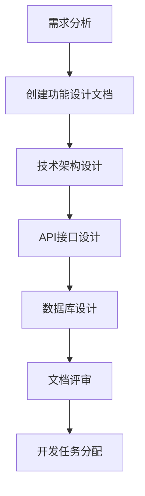
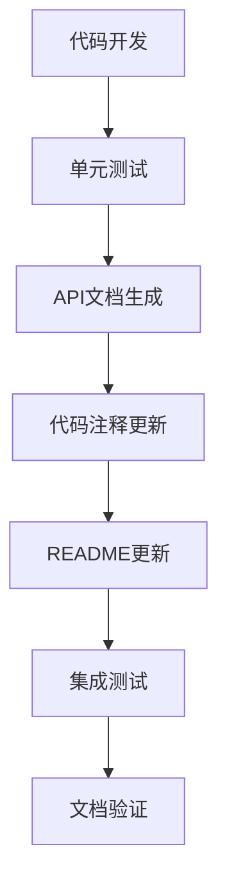
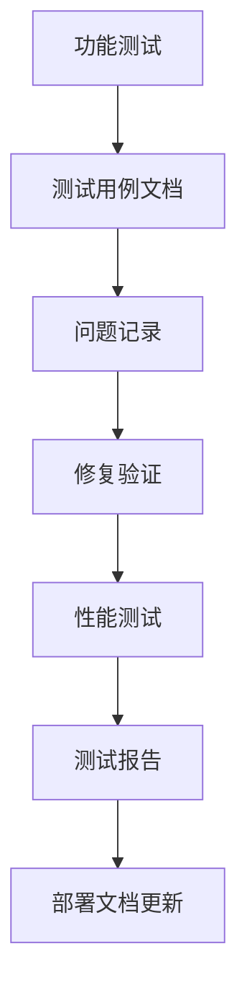
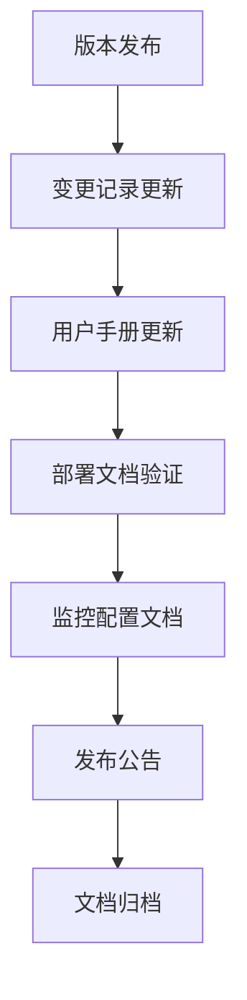

# 太上老君AI平台 - 文档持续更新机制

> 建立与开发流程深度集成的文档持续更新机制，确保文档与代码同步更新

[](#)
[](#)
[](#)

## 📋 机制概述

### 设计原则
- **开发驱动**: 文档更新与代码开发同步进行
- **自动化优先**: 最大化自动化程度，减少手动维护
- **质量保证**: 建立文档质量检查和审核机制
- **版本管理**: 文档版本与代码版本保持一致
- **持续改进**: 基于反馈持续优化更新流程

### 核心目标
1. **实时同步**: 确保文档与代码实时同步
2. **质量保证**: 维护高质量的文档标准
3. **效率提升**: 减少文档维护的人工成本
4. **一致性**: 保持文档格式和内容的一致性
5. **可追溯性**: 建立完整的文档变更历史

## 🔄 更新流程设计

### 1. 开发阶段文档更新

#### 1.1 需求分析阶段


**更新内容**:
- 功能设计文档 (使用功能设计模板)
- 技术架构文档
- API接口文档
- 数据库设计文档

**责任人**: 产品经理、架构师、技术负责人

#### 1.2 开发实施阶段


**更新内容**:
- 模块README文档
- API文档 (自动生成)
- 代码注释和文档字符串
- 开发指南更新

**责任人**: 开发工程师

#### 1.3 测试阶段


**更新内容**:
- 测试用例文档
- 问题修复记录
- 性能测试报告
- 部署指南更新

**责任人**: 测试工程师、运维工程师

#### 1.4 发布阶段


**更新内容**:
- 变更记录 (使用变更记录模板)
- 用户手册
- 部署运维文档
- 发布说明

**责任人**: 发布经理、技术写作

### 2. 文档生命周期管理

#### 2.1 文档创建流程
```yaml
文档创建:
  触发条件:
    - 新功能开发启动
    - 新模块设计完成
    - API接口变更
  
  创建步骤:
    1. 选择合适的文档模板
    2. 填写基础信息和元数据
    3. 编写核心内容
    4. 内部评审
    5. 发布到文档系统
  
  质量检查:
    - 模板规范检查
    - 内容完整性检查
    - 格式一致性检查
    - 链接有效性检查
```

#### 2.2 文档更新流程
```yaml
文档更新:
  触发条件:
    - 代码功能变更
    - API接口修改
    - 配置参数调整
    - 问题修复
  
  更新步骤:
    1. 识别需要更新的文档
    2. 评估更新范围和影响
    3. 执行文档更新
    4. 版本控制和变更记录
    5. 质量检查和评审
    6. 发布更新版本
  
  自动化支持:
    - Git Hook触发更新
    - CI/CD集成检查
    - 自动化测试验证
```

#### 2.3 文档维护流程
```yaml
文档维护:
  定期维护:
    - 每周: 链接有效性检查
    - 每月: 内容准确性审查
    - 每季度: 文档结构优化
    - 每年: 文档架构评估
  
  维护内容:
    - 过期信息清理
    - 链接更新修复
    - 格式标准化
    - 内容去重整合
  
  质量指标:
    - 文档覆盖率: >90%
    - 内容准确率: >95%
    - 更新及时性: <24小时
    - 用户满意度: >4.0/5.0
```

## 🤖 自动化机制

### 1. Git Hook集成

#### 1.1 Pre-commit Hook
```bash
#!/bin/bash
# .git/hooks/pre-commit

echo "检查文档更新..."

# 检查是否有代码变更需要文档更新
changed_files=$(git diff --cached --name-only)

# 检查API文件变更
api_changed=$(echo "$changed_files" | grep -E "\.(go|py|js|ts)$" | grep -E "(api|handler|controller)")

if [ ! -z "$api_changed" ]; then
    echo "检测到API文件变更，检查API文档是否需要更新..."
    
    # 检查是否有对应的API文档更新
    api_docs_changed=$(echo "$changed_files" | grep -E "docs/.*api.*\.md$")
    
    if [ -z "$api_docs_changed" ]; then
        echo "警告: API文件已变更，但未发现API文档更新"
        echo "请确认是否需要更新相关API文档"
        read -p "继续提交? (y/N): " confirm
        if [ "$confirm" != "y" ]; then
            exit 1
        fi
    fi
fi

# 检查README文件
readme_check=$(echo "$changed_files" | grep -E "(core-services|frontend|mobile-apps)" | head -1)
if [ ! -z "$readme_check" ]; then
    module_path=$(dirname "$readme_check")
    if [ ! -f "$module_path/README.md" ]; then
        echo "警告: 模块 $module_path 缺少README.md文件"
        echo "建议使用模板创建: docs/templates/README模板.md"
    fi
fi

echo "文档检查完成"
```

#### 1.2 Post-commit Hook
```bash
#!/bin/bash
# .git/hooks/post-commit

echo "提交后文档处理..."

# 获取提交信息
commit_msg=$(git log -1 --pretty=%B)
commit_hash=$(git rev-parse HEAD)
commit_date=$(git log -1 --pretty=%cd --date=short)

# 检查是否需要更新变更记录
if echo "$commit_msg" | grep -E "^(feat|fix|docs|style|refactor|perf|test|chore)"; then
    echo "检测到规范提交，更新变更记录..."
    
    # 解析提交类型和描述
    commit_type=$(echo "$commit_msg" | sed -n 's/^\([^:]*\):.*/\1/p')
    commit_desc=$(echo "$commit_msg" | sed -n 's/^[^:]*: *\(.*\)/\1/p')
    
    # 更新变更记录文件
    changelog_file="docs/10-开发进度/变更记录.md"
    if [ -f "$changelog_file" ]; then
        # 在文件中插入新的变更记录
        temp_file=$(mktemp)
        head -n 20 "$changelog_file" > "$temp_file"
        echo "- **[$commit_date]** $commit_type: $commit_desc ([$commit_hash])" >> "$temp_file"
        tail -n +21 "$changelog_file" >> "$temp_file"
        mv "$temp_file" "$changelog_file"
        
        echo "变更记录已更新: $changelog_file"
    fi
fi

echo "提交后处理完成"
```

### 2. CI/CD集成

#### 2.1 GitHub Actions配置
```yaml
# .github/workflows/docs-update.yml
name: 文档自动更新

on:
  push:
    branches: [ main, develop ]
  pull_request:
    branches: [ main ]

jobs:
  docs-check:
    runs-on: ubuntu-latest
    steps:
    - uses: actions/checkout@v3
    
    - name: 检查文档完整性
      run: |
        echo "检查模块README文件..."
        find core-services -type d -maxdepth 1 -mindepth 1 | while read dir; do
          if [ ! -f "$dir/README.md" ]; then
            echo "缺少README: $dir"
            exit 1
          fi
        done
        
        echo "检查API文档..."
        find core-services -name "*.go" -path "*/api/*" | while read file; do
          module=$(echo $file | cut -d'/' -f2)
          if [ ! -f "docs/06-API文档/核心服务API/${module}.md" ]; then
            echo "缺少API文档: $module"
            exit 1
          fi
        done
    
    - name: 生成API文档
      run: |
        echo "自动生成API文档..."
        # 这里可以集成swagger或其他API文档生成工具
        
    - name: 检查文档链接
      run: |
        echo "检查文档链接有效性..."
        find docs -name "*.md" -exec grep -l "http" {} \; | while read file; do
          echo "检查文件: $file"
          # 可以使用markdown-link-check等工具
        done
    
    - name: 更新文档索引
      run: |
        echo "更新文档索引..."
        # 自动更新README.md中的文档索引
        
    - name: 提交文档更新
      if: github.event_name == 'push'
      run: |
        git config --local user.email "action@github.com"
        git config --local user.name "GitHub Action"
        git add docs/
        git diff --staged --quiet || git commit -m "docs: 自动更新文档 [skip ci]"
        git push
```

#### 2.2 文档质量检查
```yaml
# .github/workflows/docs-quality.yml
name: 文档质量检查

on:
  schedule:
    - cron: '0 2 * * 1'  # 每周一凌晨2点执行
  workflow_dispatch:

jobs:
  quality-check:
    runs-on: ubuntu-latest
    steps:
    - uses: actions/checkout@v3
    
    - name: 安装依赖
      run: |
        npm install -g markdownlint-cli
        npm install -g markdown-link-check
    
    - name: Markdown格式检查
      run: |
        markdownlint docs/ --config .markdownlint.json
    
    - name: 链接有效性检查
      run: |
        find docs -name "*.md" -exec markdown-link-check {} \;
    
    - name: 文档覆盖率检查
      run: |
        echo "检查文档覆盖率..."
        total_modules=$(find core-services -type d -maxdepth 1 -mindepth 1 | wc -l)
        documented_modules=$(find docs/03-核心服务 -name "README.md" | wc -l)
        coverage=$((documented_modules * 100 / total_modules))
        echo "文档覆盖率: $coverage%"
        
        if [ $coverage -lt 90 ]; then
          echo "文档覆盖率低于90%，需要改进"
          exit 1
        fi
    
    - name: 生成质量报告
      run: |
        echo "生成文档质量报告..."
        # 生成详细的质量报告
```

### 3. 自动化工具配置

#### 3.1 Markdown配置
```json
// .markdownlint.json
{
  "default": true,
  "MD013": {
    "line_length": 120,
    "code_blocks": false,
    "tables": false
  },
  "MD033": {
    "allowed_elements": ["details", "summary", "mcfile", "mcsymbol", "mcurl", "mcfolder"]
  },
  "MD041": false
}
```

#### 3.2 文档模板验证
```python
# scripts/validate_docs.py
import os
import re
import yaml
from pathlib import Path

def validate_readme_template(file_path):
    """验证README文档是否符合模板规范"""
    with open(file_path, 'r', encoding='utf-8') as f:
        content = f.read()
    
    required_sections = [
        '# 模块概述',
        '## 核心功能',
        '## 架构设计',
        '## 快速开始',
        '## 使用说明',
        '## API接口',
        '## 开发指南'
    ]
    
    missing_sections = []
    for section in required_sections:
        if section not in content:
            missing_sections.append(section)
    
    if missing_sections:
        print(f"文件 {file_path} 缺少以下必需章节:")
        for section in missing_sections:
            print(f"  - {section}")
        return False
    
    return True

def validate_api_docs():
    """验证API文档完整性"""
    api_docs_dir = Path('docs/06-API文档/核心服务API')
    core_services_dir = Path('core-services')
    
    # 获取所有核心服务模块
    modules = [d.name for d in core_services_dir.iterdir() if d.is_dir()]
    
    # 检查每个模块是否有对应的API文档
    missing_docs = []
    for module in modules:
        api_doc_path = api_docs_dir / f"{module}.md"
        if not api_doc_path.exists():
            missing_docs.append(module)
    
    if missing_docs:
        print("以下模块缺少API文档:")
        for module in missing_docs:
            print(f"  - {module}")
        return False
    
    return True

if __name__ == "__main__":
    # 验证所有README文件
    readme_files = list(Path('.').rglob('README.md'))
    for readme in readme_files:
        if 'docs/templates' not in str(readme):
            validate_readme_template(readme)
    
    # 验证API文档
    validate_api_docs()
```

## 📊 监控和度量

### 1. 文档质量指标

#### 1.1 覆盖率指标
```yaml
覆盖率指标:
  模块文档覆盖率:
    计算方式: (有文档的模块数 / 总模块数) * 100%
    目标值: ≥90%
    
  API文档覆盖率:
    计算方式: (有文档的API数 / 总API数) * 100%
    目标值: ≥95%
    
  功能文档覆盖率:
    计算方式: (有文档的功能数 / 总功能数) * 100%
    目标值: ≥85%
```

#### 1.2 质量指标
```yaml
质量指标:
  文档准确性:
    计算方式: (准确的文档数 / 总文档数) * 100%
    目标值: ≥95%
    检查方式: 定期人工审查 + 自动化测试
    
  文档时效性:
    计算方式: (及时更新的文档数 / 需要更新的文档数) * 100%
    目标值: ≥90%
    检查方式: 代码变更后24小时内更新
    
  文档完整性:
    计算方式: (完整的文档数 / 总文档数) * 100%
    目标值: ≥90%
    检查方式: 模板规范检查
```

#### 1.3 用户体验指标
```yaml
用户体验指标:
  文档查找效率:
    计算方式: 平均查找时间
    目标值: ≤2分钟
    
  文档满意度:
    计算方式: 用户评分平均值
    目标值: ≥4.0/5.0
    
  问题解决率:
    计算方式: (通过文档解决的问题数 / 总问题数) * 100%
    目标值: ≥80%
```

### 2. 监控仪表板

#### 2.1 实时监控
```yaml
实时监控:
  文档更新状态:
    - 最近24小时更新的文档数量
    - 待更新的文档列表
    - 更新延迟超过阈值的文档
    
  质量检查状态:
    - 格式检查通过率
    - 链接有效性检查结果
    - 内容完整性检查结果
    
  用户访问统计:
    - 文档访问量排行
    - 搜索关键词统计
    - 用户反馈统计
```

#### 2.2 趋势分析
```yaml
趋势分析:
  文档增长趋势:
    - 每月新增文档数量
    - 文档总量变化趋势
    - 各模块文档增长对比
    
  质量改进趋势:
    - 文档质量评分变化
    - 问题修复速度趋势
    - 用户满意度变化
    
  维护效率趋势:
    - 文档维护时间统计
    - 自动化程度提升
    - 人工干预次数变化
```

## 🔧 工具和平台

### 1. 文档管理工具

#### 1.1 版本控制
- **Git**: 文档版本控制和协作
- **GitHub**: 代码和文档统一管理
- **Git LFS**: 大文件和图片管理

#### 1.2 编辑和预览
- **VS Code**: 主要编辑器，支持Markdown预览
- **Typora**: 所见即所得Markdown编辑器
- **GitBook**: 在线文档平台和预览

#### 1.3 自动化工具
- **GitHub Actions**: CI/CD和自动化流程
- **Swagger**: API文档自动生成
- **JSDoc/GoDoc**: 代码注释文档生成

### 2. 质量保证工具

#### 2.1 格式检查
- **markdownlint**: Markdown格式规范检查
- **prettier**: 代码和文档格式化
- **textlint**: 文本内容质量检查

#### 2.2 链接检查
- **markdown-link-check**: 链接有效性检查
- **broken-link-checker**: 网站链接检查
- **linkchecker**: 批量链接验证

#### 2.3 内容分析
- **alex**: 包容性语言检查
- **write-good**: 写作质量分析
- **vale**: 风格和术语一致性检查

## 📋 实施计划

### 第一阶段: 基础设施搭建 (1-2周)

#### 1.1 环境配置
- [ ] 配置Git Hooks
- [ ] 设置GitHub Actions
- [ ] 安装质量检查工具
- [ ] 配置自动化脚本

#### 1.2 模板应用
- [ ] 应用README模板到所有模块
- [ ] 创建API文档模板实例
- [ ] 建立变更记录文档
- [ ] 设置文档质量标准

### 第二阶段: 流程集成 (2-3周)

#### 2.1 开发流程集成
- [ ] 集成文档更新到开发流程
- [ ] 建立代码评审文档检查
- [ ] 设置自动化测试验证
- [ ] 配置发布流程文档更新

#### 2.2 监控体系建立
- [ ] 建立文档质量监控
- [ ] 设置自动化报告生成
- [ ] 配置告警和通知机制
- [ ] 建立用户反馈收集

### 第三阶段: 优化和完善 (持续进行)

#### 3.1 流程优化
- [ ] 基于使用反馈优化流程
- [ ] 提高自动化程度
- [ ] 改进文档质量标准
- [ ] 优化用户体验

#### 3.2 工具升级
- [ ] 评估和引入新工具
- [ ] 升级现有工具版本
- [ ] 优化工具配置
- [ ] 提升工具集成度

## 📞 联系信息

- **文档流程负责人**: [负责人姓名]
- **技术实施团队**: [团队名称]
- **质量保证负责人**: [QA负责人]
- **用户体验负责人**: [UX负责人]

---

**最后更新**: 2024年12月19日  
**文档版本**: v1.0  
**实施状态**: 进行中 🚀