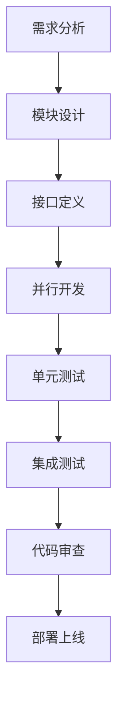

# 单人+AI高效协作开发策略

## 🎯 协作理念

基于"一人多窗口，AI并行开发"的理念，通过Trae多窗口功能实现模块化并行开发，最大化开发效率。

## 📋 核心策略

### 1. 模块化并行开发
- **垂直分层**：基础设施 → 核心服务 → 前端应用
- **水平分模块**：每个模块独立开发，接口先行
- **依赖管理**：明确模块间依赖关系，优先开发底层模块

### 2. Trae多窗口协作
- **窗口分工**：每个窗口专注一个模块
- **上下文隔离**：避免不同模块代码混淆
- **进度同步**：定期同步各模块开发进度

### 3. AI辅助开发
- **代码生成**：利用AI生成样板代码和基础结构
- **问题解决**：遇到技术难题时寻求AI建议
- **代码审查**：AI辅助代码质量检查

## 🚀 开发阶段规划

### 阶段一：基础设施搭建（第1-2周）
**目标**：建立项目基础，为后续开发提供支撑

**并行任务分配**：
- **窗口1**：项目脚手架 + 数据库层
- **窗口2**：认证系统 + API网关
- **窗口3**：前端项目初始化 + 基础组件

**每日工作流程**：
1. **上午**（3小时）：
   - 窗口1：专注基础设施核心功能
   - 窗口2：开发认证和网关功能
   - 窗口3：搭建前端架构

2. **下午**（3小时）：
   - 集成测试和接口联调
   - 代码审查和优化
   - 文档更新

### 阶段二：核心服务开发（第3-4周）
**目标**：实现核心业务功能

**并行任务分配**：
- **窗口1**：文化智慧服务
- **窗口2**：AI集成服务
- **窗口3**：前端核心页面

### 阶段三：功能完善和优化（第5-6周）
**目标**：完善功能，优化性能

**并行任务分配**：
- **窗口1**：后端性能优化
- **窗口2**：AI功能增强
- **窗口3**：前端交互优化

## 🔧 技术协作规范

### 1. 代码规范
```yaml
命名规范:
  - Go: 驼峰命名，首字母大写表示公开
  - TypeScript: 驼峰命名，接口以I开头
  - 文件名: 小写+下划线

目录规范:
  - 每个模块独立目录
  - README.md说明模块功能
  - 统一的目录结构

API规范:
  - RESTful设计
  - 统一错误处理
  - 版本控制（/api/v1/）
```

### 2. 开发流程


### 3. 质量保证
- **单元测试**：每个模块覆盖率 > 80%
- **集成测试**：API接口功能测试
- **性能测试**：关键接口性能验证
- **代码审查**：AI辅助代码质量检查

## 🎯 Trae多窗口最佳实践

### 1. 窗口管理策略
```yaml
窗口分配原则:
  - 一个窗口专注一个模块
  - 相关模块可以在同一窗口切换
  - 避免频繁切换上下文

窗口命名规范:
  - Backend-Infrastructure: 后端基础设施
  - Backend-Services: 后端核心服务
  - Frontend-App: 前端应用
  - Integration-Test: 集成测试
  - Documentation: 文档维护
```

### 2. 上下文管理
- **模块隔离**：每个窗口维护独立的工作上下文
- **进度跟踪**：使用TODO工具跟踪各模块进度
- **文档同步**：及时更新模块间接口文档

### 3. 协作沟通
- **接口先行**：优先定义模块间接口
- **依赖管理**：明确模块依赖关系
- **进度同步**：定期检查各模块开发进度

## 📊 效率评估指标

### 1. 开发效率
- **代码产出**：每日有效代码行数
- **功能完成**：按时完成的功能点数量
- **质量指标**：Bug数量和修复时间

### 2. 协作效果
- **模块耦合度**：模块间依赖复杂度
- **接口稳定性**：接口变更频率
- **集成成功率**：模块集成一次成功率

### 3. AI辅助效果
- **代码生成效率**：AI生成代码的可用性
- **问题解决速度**：技术问题解决时间
- **代码质量提升**：AI建议采纳率

## 🎯 风险控制

### 1. 技术风险
- **模块依赖**：避免循环依赖，明确依赖层次
- **接口变更**：接口变更需要同步所有相关模块
- **性能瓶颈**：及时识别和解决性能问题

### 2. 进度风险
- **任务评估**：合理评估任务复杂度和时间
- **缓冲时间**：为每个阶段预留缓冲时间
- **优先级调整**：根据实际情况调整功能优先级

### 3. 质量风险
- **测试覆盖**：确保充分的测试覆盖
- **代码审查**：严格执行代码审查流程
- **文档维护**：保持文档与代码同步

## 🎯 成功标准

- [ ] 模块化开发架构建立
- [ ] Trae多窗口协作流程确立
- [ ] AI辅助开发效率提升30%+
- [ ] 代码质量指标达标
- [ ] 项目按时完成各阶段目标
- [ ] 团队协作效率持续优化