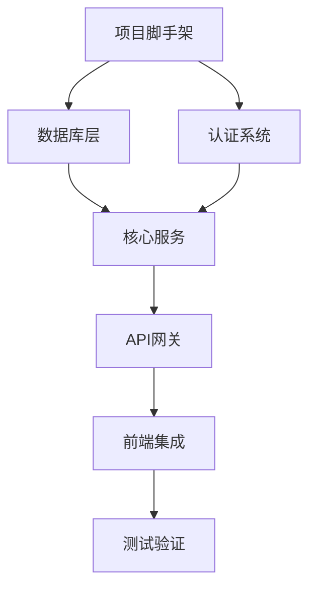

# 开发工作流程与任务分配策略

## 🎯 工作流程概览

基于"单人+AI+多窗口"的开发模式，建立高效的开发工作流程和任务分配机制。

## 📅 每日工作流程

### 上午工作流程（9:00-12:00）

#### 9:00-9:30 - 晨会规划
```yaml
任务:
  - 检查昨日进度和遗留问题
  - 规划今日开发任务
  - 更新TODO列表
  - 确认各窗口工作重点

工具:
  - 使用todo_write工具更新任务状态
  - 检查各模块README.md文件
  - 确认依赖关系和优先级
```

#### 9:30-12:00 - 并行开发
```yaml
窗口分配:
  窗口1 - 后端基础设施:
    - 专注数据库层、认证系统开发
    - 处理基础设施相关问题
    - 维护基础服务稳定性
    
  窗口2 - 后端核心服务:
    - 开发业务逻辑和API
    - 实现文化智慧和AI集成
    - 处理复杂业务需求
    
  窗口3 - 前端应用:
    - 开发用户界面和交互
    - 集成后端API
    - 优化用户体验

工作原则:
  - 每个窗口专注单一模块
  - 避免频繁切换上下文
  - 及时记录开发进度
```

### 下午工作流程（14:00-17:00）

#### 14:00-15:30 - 集成开发
```yaml
任务:
  - 模块间接口联调
  - 集成测试和问题修复
  - 跨模块功能实现

窗口协作:
  - 窗口1: 提供稳定的基础服务
  - 窗口2: 确保API接口正常
  - 窗口3: 验证前后端集成
```

#### 15:30-16:30 - 测试和优化
```yaml
任务:
  - 单元测试编写和执行
  - 性能测试和优化
  - 代码质量检查

AI辅助:
  - 使用AI生成测试用例
  - AI辅助代码审查
  - 性能优化建议
```

#### 16:30-17:00 - 总结和规划
```yaml
任务:
  - 更新开发进度
  - 记录遇到的问题和解决方案
  - 规划明日工作重点
  - 更新文档和README
```

## 🗓️ 周度工作规划

### 周一 - 规划周
```yaml
重点任务:
  - 制定本周开发计划
  - 分析上周遗留问题
  - 确认模块优先级
  - 更新项目文档

窗口分配:
  - 所有窗口: 同步规划和设计
  - 重点讨论接口设计
  - 确认技术方案
```

### 周二-周四 - 开发周
```yaml
重点任务:
  - 专注核心功能开发
  - 保持高强度编码
  - 及时解决技术问题
  - 维护代码质量

窗口分配:
  - 严格按模块分工
  - 最大化并行开发效率
  - 定期同步进度
```

### 周五 - 集成周
```yaml
重点任务:
  - 模块集成和联调
  - 全面测试验证
  - 问题修复和优化
  - 周度总结和规划

窗口协作:
  - 集中处理集成问题
  - 跨模块功能验证
  - 性能和稳定性测试
```

## 🎯 任务分配策略

### 1. 基于优先级的任务分配

#### P0 - 核心基础（必须完成）
```yaml
基础设施模块:
  - 项目脚手架搭建
  - 数据库连接和基础操作
  - 用户认证和权限系统
  - API网关基础功能

核心服务模块:
  - 智慧内容基础CRUD
  - AI服务基础集成
  - 用户管理基础功能

前端应用模块:
  - 项目架构和路由
  - 基础组件库
  - 核心页面框架
```

#### P1 - 重要功能（优先完成）
```yaml
基础设施模块:
  - 缓存系统集成
  - 监控和日志系统
  - 性能优化

核心服务模块:
  - 搜索和推荐功能
  - 高级AI功能
  - 社交互动功能

前端应用模块:
  - 完整用户界面
  - 交互功能实现
  - 响应式设计
```

#### P2 - 增强功能（时间允许时完成）
```yaml
基础设施模块:
  - 高级监控功能
  - 自动化部署
  - 性能调优

核心服务模块:
  - 高级推荐算法
  - 多语言支持
  - 高级分析功能

前端应用模块:
  - 高级交互效果
  - 性能优化
  - 无障碍访问
```

### 2. 基于依赖关系的任务排序



### 3. 基于窗口能力的任务分配

#### 窗口1 - 后端基础设施专家
```yaml
核心能力:
  - Go语言开发
  - 数据库设计和优化
  - 系统架构设计
  - 性能调优

主要任务:
  - 数据库层开发
  - 认证系统实现
  - 基础服务搭建
  - 性能监控
```

#### 窗口2 - 后端业务服务专家
```yaml
核心能力:
  - 业务逻辑设计
  - API设计和实现
  - AI服务集成
  - 复杂算法实现

主要任务:
  - 文化智慧服务
  - AI集成服务
  - 搜索推荐功能
  - 业务API开发
```

#### 窗口3 - 前端应用专家
```yaml
核心能力:
  - React/TypeScript开发
  - 用户界面设计
  - 用户体验优化
  - 前端性能优化

主要任务:
  - 前端架构搭建
  - 用户界面开发
  - API集成
  - 交互功能实现
```

## 🔄 迭代开发流程

### 1. 功能迭代周期（1周）
```yaml
Day 1-2: 需求分析和设计
  - 明确功能需求
  - 设计技术方案
  - 定义接口规范

Day 3-5: 并行开发
  - 各窗口独立开发
  - 定期同步进度
  - 及时解决问题

Day 6-7: 集成和测试
  - 模块集成联调
  - 功能测试验证
  - 问题修复优化
```

### 2. 版本发布周期（2-3周）
```yaml
Week 1: 核心功能开发
Week 2: 功能完善和优化
Week 3: 测试验证和发布准备
```

## 🛠️ 工具和环境配置

### 1. 开发工具配置
```yaml
代码编辑器: Trae IDE
版本控制: Git
项目管理: TODO工具
文档管理: Markdown文件
测试工具: 各语言原生测试框架
```

### 2. 环境管理
```yaml
开发环境:
  - 本地开发环境
  - Docker容器化
  - 热重载支持

测试环境:
  - 单元测试环境
  - 集成测试环境
  - 性能测试环境

生产环境:
  - 容器化部署
  - 监控和日志
  - 自动化运维
```

## 📊 进度跟踪和质量控制

### 1. 进度跟踪指标
```yaml
开发进度:
  - 功能点完成率
  - 代码提交频率
  - 测试覆盖率

质量指标:
  - Bug数量和严重程度
  - 代码审查通过率
  - 性能指标达标率

效率指标:
  - 任务完成时间
  - 返工率
  - 客户满意度
```

### 2. 质量控制流程
```yaml
代码质量:
  - 编码规范检查
  - 单元测试要求
  - 代码审查流程

功能质量:
  - 功能测试验证
  - 用户体验测试
  - 性能压力测试

文档质量:
  - API文档完整性
  - 代码注释规范
  - 用户文档准确性
```

## 🎯 成功标准

- [ ] 建立高效的日常工作流程
- [ ] 实现模块化并行开发
- [ ] 确保代码质量和测试覆盖
- [ ] 按时完成各阶段里程碑
- [ ] 维护良好的文档和规范
- [ ] 持续优化开发效率